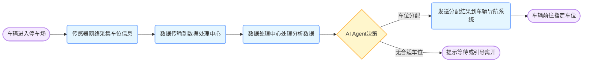

# 智能停车系统：AI Agent的车位分配优化

> 关键词：智能停车系统、AI Agent、车位分配优化、算法原理、实际应用

> 摘要：本文聚焦于智能停车系统中AI Agent的车位分配优化问题。通过深入探讨核心概念、算法原理、数学模型，结合项目实战案例和实际应用场景分析，详细阐述了如何利用AI Agent提升车位分配效率。同时推荐了相关学习资源、开发工具和论文著作，最后总结了未来发展趋势与挑战，并解答常见问题，为智能停车系统的进一步发展提供了全面而深入的参考。

## 1. 背景介绍 
### 1.1 目的和范围
随着城市化进程的加速和汽车保有量的急剧增加，停车难问题日益凸显。智能停车系统作为解决这一问题的有效手段应运而生。本文章的目的在于深入研究如何利用AI Agent对智能停车系统中的车位分配进行优化，以提高停车效率、减少车主寻找车位的时间和成本，同时提升停车场的运营管理水平。

文章的范围涵盖了智能停车系统中车位分配优化的各个方面，包括核心概念的介绍、相关算法原理的分析、数学模型的建立、实际项目案例的讲解、应用场景的探讨以及相关工具和资源的推荐等。

### 1.2 预期读者
本文预期读者主要包括从事智能交通、智能停车系统开发的技术人员，对人工智能在实际场景中应用感兴趣的研究人员，停车场运营管理相关人员，以及希望了解智能停车系统技术原理和发展趋势的相关专业学生。

### 1.3 文档结构概述
本文将按照以下结构进行组织：首先介绍智能停车系统和AI Agent的核心概念及其联系，通过文本示意图和Mermaid流程图进行直观展示；接着详细阐述用于车位分配优化的核心算法原理，并给出Python源代码进行说明；然后建立数学模型和公式，对其进行详细讲解并举例说明；通过项目实战案例，介绍开发环境搭建、源代码实现和代码解读；分析智能停车系统中车位分配优化的实际应用场景；推荐相关的学习资源、开发工具框架和论文著作；最后总结未来发展趋势与挑战，解答常见问题，并提供扩展阅读和参考资料。

### 1.4 术语表
#### 1.4.1 核心术语定义
- **智能停车系统**：利用先进的信息技术、传感器技术和网络通信技术，实现停车场的自动化管理和智能化服务，包括车位信息实时监测、车辆进出管理、车位分配等功能的系统。
- **AI Agent**：人工智能代理，是一种能够感知环境、根据自身目标和策略进行决策，并采取行动以实现目标的智能实体。在智能停车系统中，AI Agent可以根据停车场的实时状态和车辆的需求，进行车位分配决策。
- **车位分配优化**：通过合理的算法和策略，将停车场的车位分配给进入停车场的车辆，以达到提高停车效率、减少车主等待时间、提高停车场利用率等目标的过程。

#### 1.4.2 相关概念解释
- **传感器网络**：由大量的传感器节点组成的网络，用于实时监测停车场内的车位状态、车辆进出情况等信息。传感器节点可以是超声波传感器、地磁传感器、摄像头等。
- **实时数据**：在智能停车系统中，实时数据是指传感器网络实时采集到的停车场内的车位状态、车辆位置、车辆进出时间等信息，这些数据是AI Agent进行车位分配决策的重要依据。
- **决策策略**：AI Agent根据实时数据和自身的目标，制定的用于车位分配的规则和方法。常见的决策策略包括最短路径优先、空闲车位优先、先到先得等。

#### 1.4.3 缩略词列表
- **IoT**：Internet of Things，物联网，指通过各种信息传感器、射频识别技术、全球定位系统等技术和装置，实现物与物、物与人的泛在连接，实现对物品和过程的智能化感知、识别和管理。
- **RFID**：Radio Frequency Identification，射频识别技术，是一种无线通信技术，可通过无线电讯号识别特定目标并读写相关数据，而无需识别系统与特定目标之间建立机械或光学接触。

## 2. 核心概念与联系 
### 核心概念原理
智能停车系统的核心目标是实现停车场的高效管理和车辆的快速停放。它主要由传感器网络、数据处理中心和AI Agent三部分组成。

传感器网络负责实时采集停车场内的车位状态信息，包括车位是否空闲、车辆的位置等。这些信息通过网络传输到数据处理中心。

数据处理中心对传感器网络采集到的实时数据进行处理和分析，将处理后的数据提供给AI Agent。

AI Agent是智能停车系统的决策核心，它根据数据处理中心提供的实时数据和预设的决策策略，对进入停车场的车辆进行车位分配。AI Agent可以不断学习和优化决策策略，以提高车位分配的效率和准确性。

### 架构的文本示意图
智能停车系统的架构可以用以下文本描述：

停车场内分布着多个传感器节点，这些传感器节点实时采集车位状态信息，并通过无线通信网络将数据传输到数据处理中心。数据处理中心对数据进行清洗、存储和分析，然后将处理后的数据发送给AI Agent。AI Agent根据这些数据和预设的决策策略，为进入停车场的车辆分配合适的车位，并将分配结果发送给车辆导航系统，引导车辆到达指定车位。

### Mermaid流程图


## 3. 核心算法原理 & 具体操作步骤 
### 算法原理
在智能停车系统中，常用的车位分配优化算法是基于图论的最短路径算法和贪心算法的结合。具体思路是将停车场的车位看作图中的节点，车位之间的通道看作图中的边，每条边的权重可以根据通道的长度、通行难度等因素确定。当有车辆进入停车场时，AI Agent首先根据车辆的当前位置和停车场的实时车位信息，计算出所有空闲车位到车辆的最短路径。然后，根据贪心算法的思想，选择最短路径对应的车位分配给车辆。

### Python源代码实现
```python
import heapq

# 定义图的类
class Graph:
    def __init__(self, num_nodes):
        self.num_nodes = num_nodes
        self.adj_list = [[] for _ in range(num_nodes)]

    def add_edge(self, u, v, weight):
        self.adj_list[u].append((v, weight))
        self.adj_list[v].append((u, weight))

    # Dijkstra算法计算最短路径
    def dijkstra(self, start):
        dist = [float('inf')] * self.num_nodes
        dist[start] = 0
        pq = [(0, start)]
        while pq:
            curr_dist, curr_node = heapq.heappop(pq)
            if curr_dist > dist[curr_node]:
                continue
            for neighbor, weight in self.adj_list[curr_node]:
                distance = curr_dist + weight
                if distance < dist[neighbor]:
                    dist[neighbor] = distance
                    heapq.heappush(pq, (distance, neighbor))
        return dist

# 车位分配优化函数
def optimize_parking_allocation(graph, vehicle_pos, available_spots):
    shortest_paths = graph.dijkstra(vehicle_pos)
    min_distance = float('inf')
    best_spot = None
    for spot in available_spots:
        if shortest_paths[spot] < min_distance:
            min_distance = shortest_paths[spot]
            best_spot = spot
    return best_spot

# 示例使用
if __name__ == "__main__":
    # 创建图
    num_nodes = 10
    graph = Graph(num_nodes)
    # 添加边
    graph.add_edge(0, 1, 1)
    graph.add_edge(1, 2, 2)
    graph.add_edge(2, 3, 1)
    graph.add_edge(3, 4, 2)
    graph.add_edge(4, 5, 1)
    graph.add_edge(5, 6, 2)
    graph.add_edge(6, 7, 1)
    graph.add_edge(7, 8, 2)
    graph.add_edge(8, 9, 1)

    vehicle_pos = 0
    available_spots = [3, 6, 9]

    best_spot = optimize_parking_allocation(graph, vehicle_pos, available_spots)
    print(f"最优车位是: {best_spot}")
```

### 具体操作步骤
1. **构建图**：根据停车场的布局和车位之间的通道信息，构建图的邻接表表示。每个车位对应图中的一个节点，车位之间的通道对应图中的边，边的权重表示通道的长度或通行难度。
2. **车辆进入停车场**：传感器网络实时采集车辆的位置信息和停车场的车位状态信息，将这些信息传输到数据处理中心。
3. **计算最短路径**：数据处理中心将车辆的位置信息和车位状态信息提供给AI Agent，AI Agent使用Dijkstra算法计算车辆到所有空闲车位的最短路径。
4. **车位分配**：AI Agent根据最短路径的结果，选择最短路径对应的车位分配给车辆，并将分配结果发送给车辆导航系统。
5. **更新车位状态**：车辆到达指定车位后，传感器网络更新该车位的状态为已占用。

## 4. 数学模型和公式 & 详细讲解 & 举例说明 
### 数学模型
设停车场有 $n$ 个车位，用集合 $S = \{s_1, s_2, \cdots, s_n\}$ 表示，其中 $s_i$ 表示第 $i$ 个车位。车辆的集合用 $V = \{v_1, v_2, \cdots, v_m\}$ 表示，其中 $v_j$ 表示第 $j$ 辆进入停车场的车辆。

定义一个距离矩阵 $D = [d_{ij}]_{m \times n}$，其中 $d_{ij}$ 表示第 $j$ 辆车到第 $i$ 个车位的最短路径长度。

定义一个分配矩阵 $X = [x_{ij}]_{m \times n}$，其中 $x_{ij}$ 是一个二进制变量，当第 $j$ 辆车分配到第 $i$ 个车位时，$x_{ij} = 1$，否则 $x_{ij} = 0$。

### 优化目标
车位分配优化的目标是最小化所有车辆到分配车位的总距离，即：

$$\min \sum_{j=1}^{m} \sum_{i=1}^{n} d_{ij} x_{ij}$$

### 约束条件
1. **每个车辆只能分配一个车位**：
$$\sum_{i=1}^{n} x_{ij} = 1, \quad \forall j = 1, 2, \cdots, m$$

2. **每个车位最多只能分配给一辆车**：
$$\sum_{j=1}^{m} x_{ij} \leq 1, \quad \forall i = 1, 2, \cdots, n$$

3. **只有空闲车位才能分配**：设 $f_i$ 是一个二进制变量，当第 $i$ 个车位空闲时，$f_i = 1$，否则 $f_i = 0$。则有：
$$x_{ij} \leq f_i, \quad \forall i = 1, 2, \cdots, n; \quad \forall j = 1, 2, \cdots, m$$

### 举例说明
假设有 3 辆车 $v_1, v_2, v_3$ 和 4 个车位 $s_1, s_2, s_3, s_4$，距离矩阵 $D$ 如下：

$$
D = 
\begin{bmatrix}
2 & 3 & 4 & 5 \\
3 & 2 & 5 & 4 \\
4 & 5 & 2 & 3
\end{bmatrix}
$$

假设车位 $s_1, s_2, s_4$ 空闲，即 $f_1 = 1, f_2 = 1, f_3 = 0, f_4 = 1$。

我们的目标是找到一个分配矩阵 $X$，使得 $\sum_{j=1}^{3} \sum_{i=1}^{4} d_{ij} x_{ij}$ 最小，同时满足上述约束条件。

通过求解这个线性规划问题，可以得到最优的车位分配方案。在实际应用中，可以使用Python的`pulp`库来求解线性规划问题。

```python
from pulp import LpMinimize, LpProblem, LpVariable

# 距离矩阵
D = [
    [2, 3, 4, 5],
    [3, 2, 5, 4],
    [4, 5, 2, 3]
]

# 空闲车位状态
f = [1, 1, 0, 1]

m = len(D)  # 车辆数量
n = len(D[0])  # 车位数量

# 创建线性规划问题
prob = LpProblem("Parking_Allocation", LpMinimize)

# 定义变量
x = [[LpVariable(f"x_{i}_{j}", cat='Binary') for j in range(n)] for i in range(m)]

# 目标函数
prob += sum(D[j][i] * x[j][i] for j in range(m) for i in range(n))

# 约束条件
# 每个车辆只能分配一个车位
for j in range(m):
    prob += sum(x[j][i] for i in range(n)) == 1

# 每个车位最多只能分配给一辆车
for i in range(n):
    prob += sum(x[j][i] for j in range(m)) <= 1

# 只有空闲车位才能分配
for i in range(n):
    for j in range(m):
        prob += x[j][i] <= f[i]

# 求解问题
prob.solve()

# 输出结果
print("最优分配方案:")
for j in range(m):
    for i in range(n):
        if x[j][i].value() == 1:
            print(f"车辆 {j+1} 分配到车位 {i+1}")
```

## 5. 项目实战：代码实际案例和详细解释说明 
### 5.1  开发环境搭建
#### 硬件环境
- **传感器节点**：选择合适的传感器节点，如超声波传感器、地磁传感器、摄像头等，用于实时采集停车场内的车位状态信息。
- **数据传输设备**：使用无线通信模块，如Wi-Fi模块、ZigBee模块等，将传感器节点采集到的数据传输到数据处理中心。
- **数据处理中心**：可以使用服务器或嵌入式开发板，如Raspberry Pi、NVIDIA Jetson等，用于处理和分析传感器节点采集到的数据。

#### 软件环境
- **操作系统**：选择适合数据处理中心硬件平台的操作系统，如Linux、Windows等。
- **编程语言**：选择Python作为主要的开发语言，因为Python具有丰富的科学计算库和机器学习库，便于实现车位分配优化算法。
- **开发工具**：选择PyCharm、Jupyter Notebook等开发工具，用于编写和调试Python代码。

### 5.2  源代码详细实现和代码解读
以下是一个简单的智能停车系统车位分配优化的完整代码示例，结合了传感器数据模拟、最短路径计算和车位分配功能。

```python
import heapq
import random

# 定义图的类
class Graph:
    def __init__(self, num_nodes):
        self.num_nodes = num_nodes
        self.adj_list = [[] for _ in range(num_nodes)]

    def add_edge(self, u, v, weight):
        self.adj_list[u].append((v, weight))
        self.adj_list[v].append((u, weight))

    # Dijkstra算法计算最短路径
    def dijkstra(self, start):
        dist = [float('inf')] * self.num_nodes
        dist[start] = 0
        pq = [(0, start)]
        while pq:
            curr_dist, curr_node = heapq.heappop(pq)
            if curr_dist > dist[curr_node]:
                continue
            for neighbor, weight in self.adj_list[curr_node]:
                distance = curr_dist + weight
                if distance < dist[neighbor]:
                    dist[neighbor] = distance
                    heapq.heappush(pq, (distance, neighbor))
        return dist

# 模拟传感器数据采集
def simulate_sensor_data(num_spots):
    # 随机生成车位状态，0表示空闲，1表示已占用
    spot_status = [random.randint(0, 1) for _ in range(num_spots)]
    available_spots = [i for i in range(num_spots) if spot_status[i] == 0]
    return available_spots

# 车位分配优化函数
def optimize_parking_allocation(graph, vehicle_pos, available_spots):
    shortest_paths = graph.dijkstra(vehicle_pos)
    min_distance = float('inf')
    best_spot = None
    for spot in available_spots:
        if shortest_paths[spot] < min_distance:
            min_distance = shortest_paths[spot]
            best_spot = spot
    return best_spot

# 主函数
if __name__ == "__main__":
    # 创建图
    num_nodes = 20
    graph = Graph(num_nodes)
    # 随机添加边
    for _ in range(30):
        u = random.randint(0, num_nodes - 1)
        v = random.randint(0, num_nodes - 1)
        weight = random.randint(1, 5)
        graph.add_edge(u, v, weight)

    # 模拟车辆进入停车场
    vehicle_pos = random.randint(0, num_nodes - 1)
    print(f"车辆当前位置: {vehicle_pos}")

    # 模拟传感器数据采集
    available_spots = simulate_sensor_data(num_nodes)
    print(f"可用车位: {available_spots}")

    # 车位分配优化
    best_spot = optimize_parking_allocation(graph, vehicle_pos, available_spots)
    if best_spot is not None:
        print(f"最优车位是: {best_spot}")
    else:
        print("没有可用车位")
```

### 代码解读与分析
1. **Graph类**：用于表示停车场的图结构，包含节点数量和邻接表。`add_edge`方法用于添加边，`dijkstra`方法用于计算从指定节点到其他所有节点的最短路径。
2. **simulate_sensor_data函数**：模拟传感器数据采集，随机生成车位状态，返回可用车位的列表。
3. **optimize_parking_allocation函数**：根据车辆的当前位置和可用车位列表，使用Dijkstra算法计算最短路径，选择最短路径对应的车位作为最优车位。
4. **主函数**：创建图，模拟车辆进入停车场和传感器数据采集，调用`optimize_parking_allocation`函数进行车位分配优化，并输出结果。

## 6. 实际应用场景 
### 商业停车场
在商业停车场中，智能停车系统可以大大提高停车效率，减少车主寻找车位的时间。AI Agent可以根据实时车位信息和车辆的位置，快速为车主分配最优车位，提高停车场的利用率。同时，智能停车系统还可以提供线上预订车位、缴费等功能，提升车主的停车体验。

### 住宅小区停车场
在住宅小区停车场中，智能停车系统可以实现对业主车辆的精准管理。通过车牌识别技术和AI Agent的车位分配优化功能，业主可以快速找到自己的专属车位或空闲车位，避免了传统停车方式中乱停乱放的问题，提高了小区停车场的安全性和管理效率。

### 机场、火车站等交通枢纽停车场
在机场、火车站等交通枢纽停车场，车辆流量大，停车需求复杂。智能停车系统可以实时监测车位状态，为不同类型的车辆（如短期停车、长期停车、接送客车辆等）提供合理的车位分配方案。同时，结合导航系统，引导车辆快速到达指定车位，减少车辆在停车场内的行驶时间和拥堵。

### 医院停车场
在医院停车场中，智能停车系统可以优先为急诊车辆、救护车等特殊车辆分配车位，确保紧急情况下的快速停车。同时，为普通患者和医护人员提供高效的车位分配服务，缓解医院周边的停车压力。

## 7. 工具和资源推荐
### 7.1 学习资源推荐
#### 7.1.1 书籍推荐
- 《人工智能：一种现代的方法》：这本书是人工智能领域的经典教材，全面介绍了人工智能的各个方面，包括搜索算法、知识表示、机器学习、自然语言处理等，对于理解智能停车系统中AI Agent的原理和应用有很大的帮助。
- 《算法导论》：这本书是算法领域的权威著作，详细介绍了各种经典算法的原理和实现，如Dijkstra算法、贪心算法、线性规划等，对于学习车位分配优化算法非常有价值。
- 《智能交通系统》：这本书专门介绍了智能交通系统的相关技术和应用，包括智能停车系统、智能交通管理、智能车辆等，对于了解智能停车系统的整体架构和发展趋势有很大的帮助。

#### 7.1.2 在线课程
- Coursera上的“人工智能基础”课程：由知名高校的教授授课，系统地介绍了人工智能的基本概念、算法和应用，通过在线视频、作业和考试等方式进行学习。
- edX上的“算法设计与分析”课程：该课程深入讲解了各种算法的设计和分析方法，包括图算法、动态规划、贪心算法等，对于提升算法设计和实现能力非常有帮助。
- 中国大学MOOC上的“智能交通系统概论”课程：由国内高校的专家授课，介绍了智能交通系统的基本概念、技术和应用，对于了解智能停车系统在智能交通领域的地位和作用有很大的帮助。

#### 7.1.3 技术博客和网站
- 机器之心：专注于人工智能领域的技术博客，提供了大量关于人工智能算法、应用案例、研究成果等方面的文章和资讯。
- 开源中国：国内知名的开源技术社区，提供了丰富的开源项目和技术文章，对于学习智能停车系统的开发和实现有很大的帮助。
- IEEE Xplore：电气和电子工程师协会（IEEE）的数字图书馆，收录了大量关于智能交通、人工智能等领域的学术论文和技术报告，是获取最新研究成果的重要资源。

### 7.2 开发工具框架推荐
#### 7.2.1 IDE和编辑器
- PyCharm：一款专门为Python开发设计的集成开发环境（IDE），提供了代码编辑、调试、自动补全、版本控制等功能，非常适合开发智能停车系统的Python代码。
- Jupyter Notebook：一个基于Web的交互式计算环境，支持Python、R等多种编程语言，适合进行数据分析、算法验证和模型训练等工作。
- Visual Studio Code：一款轻量级的代码编辑器，支持多种编程语言和插件扩展，具有丰富的代码编辑和调试功能，是开发智能停车系统的常用工具之一。

#### 7.2.2 调试和性能分析工具
- PDB：Python自带的调试器，可以在代码中设置断点，单步执行代码，查看变量的值，帮助开发者快速定位和解决代码中的问题。
- cProfile：Python标准库中的性能分析工具，可以统计代码中各个函数的执行时间和调用次数，帮助开发者找出代码中的性能瓶颈。
- TensorBoard：一个用于可视化深度学习模型训练过程的工具，可以实时展示模型的训练损失、准确率等指标，帮助开发者优化模型。

#### 7.2.3 相关框架和库
- NumPy：Python的数值计算库，提供了高效的多维数组对象和各种数学函数，是进行科学计算和数据分析的基础库。
- Pandas：Python的数据分析库，提供了高效的数据结构和数据处理工具，适合处理和分析传感器采集到的实时数据。
- Scikit-learn：Python的机器学习库，提供了各种机器学习算法和工具，如分类、回归、聚类等，可用于智能停车系统中的车位预测和分配优化。

### 7.3 相关论文著作推荐
#### 7.3.1 经典论文
- "A Survey on Intelligent Parking Systems: Recent Developments and Future Trends"：这篇论文对智能停车系统的最新发展和未来趋势进行了全面的综述，介绍了智能停车系统的各个组成部分和关键技术，对于了解智能停车系统的研究现状非常有帮助。
- "Dijkstra's Algorithm Revisited: The Dynamic Case"：这篇论文对Dijkstra算法进行了深入研究，提出了在动态图中使用Dijkstra算法的改进方法，对于智能停车系统中实时计算最短路径有很大的参考价值。
- "Greedy Algorithms for Combinatorial Optimization Problems"：这篇论文介绍了贪心算法在组合优化问题中的应用，分析了贪心算法的优缺点和适用场景，对于理解车位分配优化中的贪心算法原理有很大的帮助。

#### 7.3.2 最新研究成果
- 在IEEE Transactions on Intelligent Transportation Systems、ACM Transactions on Sensor Networks等学术期刊上发表的关于智能停车系统的最新研究成果，包括新的车位分配算法、传感器技术、数据处理方法等。
- 在ACM SIGKDD、NeurIPS等顶级学术会议上发表的关于人工智能在智能停车系统中应用的研究论文，如基于深度学习的车位预测模型、基于强化学习的车位分配策略等。

#### 7.3.3 应用案例分析
- 一些大型停车场或智能交通项目的实际应用案例分析报告，介绍了智能停车系统的实施过程、遇到的问题和解决方案，以及取得的实际效果。这些案例分析可以为智能停车系统的开发和应用提供宝贵的经验。

## 8. 总结：未来发展趋势与挑战
### 未来发展趋势
- **与物联网和大数据的深度融合**：未来的智能停车系统将与物联网和大数据技术更加紧密地结合。传感器网络将更加智能化和多样化，能够实时采集更多的停车场信息，如车辆的速度、加速度、车位的温度、湿度等。同时，通过大数据分析，可以对停车场的使用情况进行深入挖掘，为停车场的规划和管理提供更科学的决策依据。
- **人工智能技术的进一步应用**：除了现有的AI Agent进行车位分配优化外，未来的智能停车系统将更多地应用人工智能技术，如深度学习、强化学习等。例如，使用深度学习模型对车辆的类型、停车时间进行预测，以便更好地进行车位分配和资源管理；使用强化学习算法优化AI Agent的决策策略，提高车位分配的效率和准确性。
- **与城市交通系统的一体化**：智能停车系统将不再是一个孤立的系统，而是与城市交通系统实现一体化。通过与城市交通管理部门的数据共享和协同工作，智能停车系统可以为车主提供更全面的出行信息，如周边停车场的实时车位信息、道路拥堵情况等，引导车主合理选择停车地点和出行路线，缓解城市交通拥堵。
- **自动驾驶车辆的支持**：随着自动驾驶技术的发展，未来的智能停车系统将需要支持自动驾驶车辆的停车需求。智能停车系统可以与自动驾驶车辆进行通信，为其提供精确的车位引导和停车指令，实现自动驾驶车辆的自动停车和取车功能。

### 挑战
- **数据安全和隐私保护**：智能停车系统涉及大量的车辆和车主信息，如车牌号码、停车时间、支付信息等，数据安全和隐私保护是一个重要的挑战。需要采取有效的加密技术和安全措施，防止数据泄露和滥用。
- **传感器技术的可靠性和准确性**：传感器是智能停车系统的重要组成部分，其可靠性和准确性直接影响到系统的性能。目前的传感器技术还存在一些问题，如受环境因素影响较大、误判率较高等，需要进一步提高传感器的性能和稳定性。
- **标准和规范的统一**：目前智能停车系统的标准和规范还不够统一，不同厂家的产品和系统之间存在兼容性问题。需要制定统一的标准和规范，促进智能停车系统的互联互通和互操作性。
- **成本和效益的平衡**：智能停车系统的建设和运营需要投入大量的资金和人力，如何在保证系统性能和服务质量的前提下，降低成本，提高效益，是一个需要解决的问题。

## 9. 附录：常见问题与解答
### 1. 智能停车系统的安装和维护复杂吗？
智能停车系统的安装和维护相对较为复杂，需要专业的技术人员进行操作。安装过程包括传感器节点的部署、数据传输设备的连接、数据处理中心的搭建等，需要考虑停车场的布局、环境等因素。维护过程包括传感器的校准、设备的故障排查和修复、数据的备份和管理等。不过，随着技术的不断发展，智能停车系统的安装和维护难度正在逐渐降低。

### 2. AI Agent的决策策略可以根据不同的停车场进行定制吗？
可以。AI Agent的决策策略可以根据不同停车场的特点和需求进行定制。例如，对于商业停车场，可以采用最短路径优先的策略，以提高车主的停车效率；对于住宅小区停车场，可以采用业主优先的策略，确保业主的停车权益。通过调整决策策略的参数和规则，可以实现不同的车位分配目标。

### 3. 智能停车系统如何处理突发情况，如车位故障、车辆故障等？
智能停车系统可以通过实时监测和预警机制来处理突发情况。当传感器检测到车位故障或车辆故障时，系统会及时发出警报，并将相关信息发送给管理人员。管理人员可以根据情况采取相应的措施，如将故障车位标记为不可用、引导故障车辆到安全区域等。同时，AI Agent可以根据实时情况重新进行车位分配，确保停车场的正常运行。

### 4. 智能停车系统的成本主要包括哪些方面？
智能停车系统的成本主要包括硬件设备成本、软件系统开发成本、安装调试成本、运营维护成本等。硬件设备成本包括传感器节点、数据传输设备、数据处理中心等；软件系统开发成本包括车位分配算法、数据处理程序、用户界面等的开发；安装调试成本包括设备的安装、调试和系统的集成；运营维护成本包括设备的维修、保养、数据的管理和更新等。

## 10. 扩展阅读 & 参考资料
### 扩展阅读
- 《智能交通系统技术与应用》
- 《深度学习实战》
- 《强化学习原理与Python实现》

### 参考资料
- 相关学术论文和研究报告，如IEEE Transactions on Intelligent Transportation Systems、ACM Transactions on Sensor Networks等期刊上的论文。
- 智能停车系统相关的行业标准和规范，如《智能停车场系统技术要求》等。
- 智能停车系统产品和解决方案提供商的官方网站和技术文档。

作者：AI天才研究院/AI Genius Institute & 禅与计算机程序设计艺术 /Zen And The Art of Computer Programming