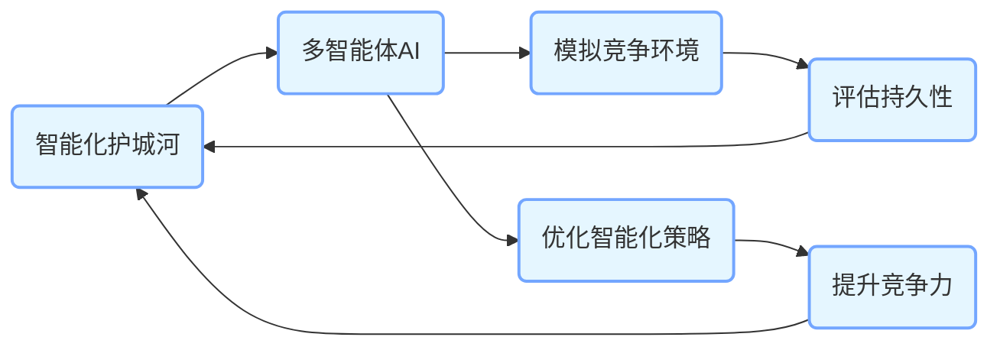

# 智能化护城河持久性评估：多智能体AI的新视角

> 关键词：智能化护城河、持久性评估、多智能体AI、竞争优势、动态分析

> 摘要：本文从多智能体AI的全新视角出发，深入探讨智能化护城河持久性评估的相关问题。首先介绍了智能化护城河的背景以及研究的目的、范围和预期读者等内容。接着阐述多智能体AI与智能化护城河的核心概念及联系，详细讲解核心算法原理与操作步骤，并运用数学模型和公式进行分析。通过项目实战案例展示如何在实际中进行评估，探讨其实际应用场景。同时推荐了相关的学习资源、开发工具框架和论文著作。最后总结未来发展趋势与挑战，解答常见问题并提供扩展阅读和参考资料，旨在为相关领域的研究者和从业者提供全面且深入的理论与实践指导。

## 1. 背景介绍 
### 1.1 目的和范围
在当今数字化和智能化飞速发展的时代，企业和组织面临着日益激烈的竞争环境。智能化护城河作为一种描述企业或组织凭借其独特的智能化优势在市场中保持领先地位的概念，其持久性对于企业的长期发展至关重要。本研究的目的在于从多智能体AI的新视角出发，开发一套科学、有效的智能化护城河持久性评估方法。

研究范围涵盖了各种类型的企业和组织，无论是传统行业的数字化转型企业，还是新兴的科技公司。同时，考虑到不同领域的智能化应用特点，本研究将涉及人工智能、机器学习、数据分析等多个相关技术领域，以及市场竞争、战略管理等商业领域。

### 1.2 预期读者
本文预期读者包括企业战略规划师、市场分析师、人工智能研究者、技术创新者以及对智能化竞争优势感兴趣的学者和从业者。对于企业战略规划师和市场分析师，本文提供的评估方法可以帮助他们更好地制定企业发展战略，评估企业在市场中的竞争地位和可持续性。人工智能研究者可以从多智能体AI的应用角度获得新的研究思路和方法。技术创新者可以了解如何利用多智能体AI提升企业的智能化护城河。而学者和从业者则可以通过本文深入了解智能化护城河持久性评估的理论和实践。

### 1.3 文档结构概述
本文将按照以下结构展开：首先介绍背景信息，包括目的、范围、预期读者等。接着阐述多智能体AI与智能化护城河的核心概念及联系，通过文本示意图和Mermaid流程图进行直观展示。然后详细讲解核心算法原理与具体操作步骤，并使用Python源代码进行阐述。之后运用数学模型和公式对评估方法进行深入分析，并举例说明。通过项目实战案例展示如何在实际中进行评估，包括开发环境搭建、源代码实现和代码解读。探讨智能化护城河持久性评估的实际应用场景。推荐相关的学习资源、开发工具框架和论文著作。最后总结未来发展趋势与挑战，解答常见问题并提供扩展阅读和参考资料。

### 1.4 术语表
#### 1.4.1 核心术语定义
- **智能化护城河**：指企业或组织凭借其在智能化领域的独特优势，如先进的人工智能技术、大数据分析能力、智能决策系统等，形成的一种能够抵御竞争对手侵蚀，保持市场领先地位的竞争优势。
- **多智能体AI**：是指由多个智能体组成的人工智能系统。每个智能体具有一定的自主性、学习能力和决策能力，能够与其他智能体进行交互和协作，以实现共同的目标。
- **持久性评估**：对智能化护城河在未来一段时间内能够持续保持其竞争优势的程度进行评估的过程。

#### 1.4.2 相关概念解释
- **竞争优势**：企业或组织在市场中相对于竞争对手所具有的优势，包括成本优势、差异化优势、技术优势等。智能化护城河是竞争优势在智能化时代的一种具体表现形式。
- **智能体**：在人工智能领域，智能体是指能够感知环境、进行决策并采取行动的实体。智能体可以是软件程序、机器人等。
- **协同进化**：在多智能体AI系统中，多个智能体之间相互影响、相互作用，共同进化和发展的过程。

#### 1.4.3 缩略词列表
- **AI**：Artificial Intelligence，人工智能
- **ML**：Machine Learning，机器学习
- **RL**：Reinforcement Learning，强化学习

## 2. 核心概念与联系 

### 智能化护城河的概念原理
智能化护城河的形成源于企业或组织在智能化领域的一系列投资和创新。企业通过引入先进的人工智能技术、大数据分析工具和智能决策系统，能够提高生产效率、优化产品和服务质量、提升客户体验，从而在市场中获得竞争优势。这种竞争优势就像一道护城河，能够阻止竞争对手进入市场或抢夺市场份额。

例如，一家电商企业通过建立智能推荐系统，能够根据用户的浏览历史、购买行为等数据，为用户提供个性化的商品推荐，提高用户的购买转化率和忠诚度。其他竞争对手如果没有类似的智能推荐系统，就很难在用户体验和市场份额上与该企业竞争。

### 多智能体AI的概念原理
多智能体AI是一种分布式人工智能系统，由多个智能体组成。每个智能体具有一定的自主性和学习能力，能够感知环境、进行决策并采取行动。智能体之间通过通信和协作机制，实现信息共享和任务分配，以实现共同的目标。

例如，在一个智能交通系统中，多个智能体可以分别代表不同的交通参与者，如车辆、行人、交通信号灯等。每个智能体可以根据自身的传感器获取环境信息，如车辆的速度、位置，行人的行走方向等，并根据这些信息进行决策，如车辆的加速、减速、转弯，交通信号灯的切换等。智能体之间通过通信机制进行信息交换，以协调各自的行动，实现交通的顺畅和安全。

### 两者的联系
多智能体AI可以为智能化护城河的持久性评估提供新的视角和方法。一方面，多智能体AI可以模拟企业所处的竞争环境，包括竞争对手的行为、市场动态等，从而更准确地评估智能化护城河的持久性。另一方面，多智能体AI可以通过协同进化机制，不断优化企业的智能化策略，提升智能化护城河的深度和宽度。

例如，通过构建一个多智能体AI模型，模拟企业和竞争对手在市场中的竞争行为。每个智能体代表一个企业或竞争对手，智能体之间通过竞争和协作机制进行交互。通过观察智能体的行为和演化过程，可以评估企业的智能化护城河在不同竞争环境下的持久性。同时，企业可以根据多智能体AI模型的结果，调整自身的智能化策略，如加大在人工智能技术研发上的投入、优化智能决策系统等，以提升智能化护城河的持久性。

### 文本示意图
智能化护城河与多智能体AI的联系可以用以下文本示意图表示：

智能化护城河（企业独特的智能化优势）
|
| 影响
|
多智能体AI（模拟竞争环境、优化智能化策略）
|
| 反馈
|
智能化护城河（评估持久性、提升竞争力）

### Mermaid流程图


## 3. 核心算法原理 & 具体操作步骤 

### 核心算法原理
在智能化护城河持久性评估中，我们可以采用多智能体强化学习算法。强化学习是一种通过智能体与环境进行交互，不断尝试和学习，以获得最大累积奖励的机器学习方法。在多智能体强化学习中，多个智能体同时在环境中进行学习和决策，智能体之间通过协作和竞争机制进行交互。

具体来说，我们可以将企业和竞争对手分别看作不同的智能体，将市场环境看作智能体所处的环境。每个智能体的目标是通过调整自身的策略，最大化自身的利益。智能体的策略可以包括产品定价、技术研发投入、市场推广等。智能体在环境中采取行动后，会根据环境的反馈获得相应的奖励。通过不断地尝试和学习，智能体可以找到最优的策略，以在竞争中获得优势。

### Python源代码详细阐述
以下是一个简单的多智能体强化学习示例代码，用于模拟企业和竞争对手在市场中的竞争行为：

```python
import numpy as np

# 定义智能体类
class Agent:
    def __init__(self, num_actions):
        self.num_actions = num_actions
        self.q_table = np.zeros((1, num_actions))  # 初始化Q表
        self.epsilon = 0.1  # 探索率
        self.alpha = 0.1  # 学习率
        self.gamma = 0.9  # 折扣因子

    def choose_action(self):
        if np.random.uniform(0, 1) < self.epsilon:
            action = np.random.choice(self.num_actions)  # 探索
        else:
            action = np.argmax(self.q_table[0])  # 利用
        return action

    def learn(self, action, reward):
        max_q = np.max(self.q_table[0])
        self.q_table[0, action] += self.alpha * (reward + self.gamma * max_q - self.q_table[0, action])

# 定义环境类
class Environment:
    def __init__(self):
        self.num_actions = 3  # 动作数量
        self.agents = [Agent(self.num_actions) for _ in range(2)]  # 两个智能体（企业和竞争对手）

    def step(self):
        actions = [agent.choose_action() for agent in self.agents]  # 智能体选择动作
        # 简单的奖励函数，根据动作计算奖励
        rewards = [self.calculate_reward(actions[0], actions[1], i) for i in range(2)]
        for i in range(2):
            self.agents[i].learn(actions[i], rewards[i])  # 智能体学习
        return rewards

    def calculate_reward(self, action1, action2, agent_index):
        # 简单的奖励规则，根据动作组合计算奖励
        if agent_index == 0:
            if action1 == 0 and action2 == 0:
                return 1
            elif action1 == 1 and action2 == 1:
                return 2
            else:
                return 0
        else:
            if action1 == 0 and action2 == 0:
                return 1
            elif action1 == 1 and action2 == 1:
                return 2
            else:
                return 0

# 训练过程
env = Environment()
num_episodes = 1000
for episode in range(num_episodes):
    rewards = env.step()
    if episode % 100 == 0:
        print(f"Episode {episode}: Rewards = {rewards}")
```

### 具体操作步骤
1. **定义智能体和环境**：根据问题的特点，定义智能体的动作空间、状态空间和奖励函数。在上述示例中，智能体的动作空间为3，状态空间简化为1维，奖励函数根据动作组合计算。
2. **初始化智能体的Q表**：Q表用于存储智能体在不同状态下采取不同动作的价值估计。在上述示例中，Q表初始化为全零。
3. **智能体选择动作**：智能体根据当前的策略选择动作。在上述示例中，采用epsilon-greedy策略，以一定的概率进行探索，以一定的概率利用已有的经验。
4. **智能体执行动作并获得奖励**：智能体在环境中执行选择的动作，环境根据动作和当前状态返回相应的奖励。
5. **智能体学习**：智能体根据获得的奖励更新Q表，以提高自身的策略。在上述示例中，采用Q-learning算法进行学习。
6. **重复步骤3-5**：不断进行训练，直到智能体找到最优的策略。

## 4. 数学模型和公式 & 详细讲解 & 举例说明 

### 数学模型
在多智能体强化学习中，常用的数学模型是马尔可夫决策过程（MDP）的扩展——多智能体马尔可夫决策过程（MMDP）。MMDP可以用一个六元组 $<S, A_1, A_2, ..., A_n, P, R_1, R_2, ..., R_n, \gamma>$ 表示，其中：
- $S$ 是环境的状态空间。
- $A_i$ 是第 $i$ 个智能体的动作空间。
- $P(s'|s, a_1, a_2, ..., a_n)$ 是状态转移概率，表示在状态 $s$ 下，所有智能体采取动作 $a_1, a_2, ..., a_n$ 后，环境转移到状态 $s'$ 的概率。
- $R_i(s, a_1, a_2, ..., a_n)$ 是第 $i$ 个智能体的奖励函数，表示在状态 $s$ 下，所有智能体采取动作 $a_1, a_2, ..., a_n$ 后，第 $i$ 个智能体获得的奖励。
- $\gamma$ 是折扣因子，用于衡量未来奖励的重要性。

### 公式讲解
在多智能体强化学习中，智能体的目标是最大化自身的累积折扣奖励。第 $i$ 个智能体的累积折扣奖励可以表示为：

$$G_{i,t} = \sum_{k=0}^{\infty} \gamma^k R_i(s_{t+k}, a_{1,t+k}, a_{2,t+k}, ..., a_{n,t+k})$$

其中，$s_{t+k}$ 是时刻 $t+k$ 的环境状态，$a_{j,t+k}$ 是第 $j$ 个智能体在时刻 $t+k$ 采取的动作。

智能体的策略 $\pi_i$ 是一个从状态空间到动作空间的映射，表示在不同状态下智能体采取的动作。智能体的最优策略 $\pi_i^*$ 是使得累积折扣奖励最大的策略。

在Q-learning算法中，智能体通过更新Q表来学习最优策略。Q表 $Q_i(s, a)$ 表示在状态 $s$ 下，第 $i$ 个智能体采取动作 $a$ 的价值估计。Q表的更新公式为：

$$Q_i(s_t, a_{i,t}) \leftarrow Q_i(s_t, a_{i,t}) + \alpha [R_i(s_t, a_{1,t}, a_{2,t}, ..., a_{n,t}) + \gamma \max_{a_i'} Q_i(s_{t+1}, a_i') - Q_i(s_t, a_{i,t})]$$

其中，$\alpha$ 是学习率，$s_t$ 是时刻 $t$ 的环境状态，$a_{i,t}$ 是第 $i$ 个智能体在时刻 $t$ 采取的动作，$s_{t+1}$ 是时刻 $t+1$ 的环境状态。

### 举例说明
假设一个简单的市场竞争场景，有两个企业（智能体）在市场中竞争。市场状态 $S$ 只有一种，每个企业的动作空间 $A$ 有3种动作：降价、维持价格、涨价。奖励函数 $R$ 定义如下：
- 如果两个企业都降价，每个企业获得奖励1。
- 如果两个企业都维持价格，每个企业获得奖励2。
- 如果两个企业都涨价，每个企业获得奖励0。
- 如果一个企业降价，另一个企业维持价格或涨价，降价的企业获得奖励3，另一个企业获得奖励0。

初始时，Q表 $Q$ 都初始化为全零。假设在某一时刻，企业1选择降价，企业2选择维持价格。根据奖励函数，企业1获得奖励3，企业2获得奖励0。根据Q表的更新公式，企业1和企业2的Q表将进行相应的更新。经过多次训练，企业将逐渐找到最优的策略，以在竞争中获得最大的奖励。

## 5. 项目实战：代码实际案例和详细解释说明 

### 5.1  开发环境搭建
1. **安装Python**：确保你的系统中安装了Python 3.x版本。可以从Python官方网站（https://www.python.org/downloads/） 下载并安装。
2. **安装依赖库**：本项目主要使用了NumPy库，用于数值计算。可以使用以下命令安装NumPy：
```sh
pip install numpy
```
3. **选择开发工具**：可以选择使用PyCharm、Jupyter Notebook等开发工具。PyCharm是一个功能强大的Python集成开发环境，适合开发大型项目。Jupyter Notebook是一个交互式的开发环境，适合进行代码测试和数据分析。

### 5.2  源代码详细实现和代码解读
以下是一个完整的多智能体强化学习项目代码，用于模拟企业和竞争对手在市场中的竞争行为，并评估智能化护城河的持久性：

```python
import numpy as np
import matplotlib.pyplot as plt

# 定义智能体类
class Agent:
    def __init__(self, num_actions):
        self.num_actions = num_actions
        self.q_table = np.zeros((1, num_actions))  # 初始化Q表
        self.epsilon = 0.1  # 探索率
        self.alpha = 0.1  # 学习率
        self.gamma = 0.9  # 折扣因子

    def choose_action(self):
        if np.random.uniform(0, 1) < self.epsilon:
            action = np.random.choice(self.num_actions)  # 探索
        else:
            action = np.argmax(self.q_table[0])  # 利用
        return action

    def learn(self, action, reward):
        max_q = np.max(self.q_table[0])
        self.q_table[0, action] += self.alpha * (reward