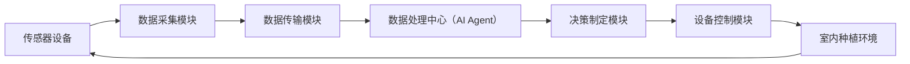

# 智能园艺：AI Agent控制的室内种植系统

> 关键词：智能园艺、AI Agent、室内种植系统、传感器技术、自动化控制

> 摘要：本文聚焦于智能园艺领域，深入探讨了基于AI Agent控制的室内种植系统。首先介绍了该系统的背景，包括目的、预期读者、文档结构和相关术语。接着阐述了核心概念与联系，给出了原理和架构的示意图及流程图。详细讲解了核心算法原理和具体操作步骤，通过Python源代码进行了说明。分析了系统涉及的数学模型和公式，并举例说明。结合项目实战，给出了开发环境搭建、源代码实现和解读。探讨了该系统的实际应用场景，推荐了学习资源、开发工具框架和相关论文著作。最后总结了未来发展趋势与挑战，解答了常见问题，并提供了扩展阅读和参考资料，旨在为智能园艺的发展提供全面且深入的技术指导。

## 1. 背景介绍 
### 1.1 目的和范围
智能园艺作为现代农业与信息技术融合的产物，旨在利用先进的技术手段优化植物种植过程，提高种植效率和质量。基于AI Agent控制的室内种植系统的目的在于实现室内种植环境的精准控制和自动化管理，减少人工干预，同时为植物生长创造最优条件。本系统的范围涵盖了从环境数据采集、数据分析处理、决策制定到设备控制的全流程，涉及传感器技术、人工智能算法、自动化控制等多个领域。

### 1.2 预期读者
本文的预期读者包括对智能园艺、人工智能和自动化控制感兴趣的科研人员、工程师、园艺爱好者以及相关专业的学生。对于科研人员，本文可以为他们的研究提供新的思路和方法；工程师可以从中获取系统设计和开发的技术细节；园艺爱好者能够了解如何利用先进技术提升自己的种植水平；学生则可以将其作为学习相关专业知识的参考资料。

### 1.3 文档结构概述
本文将按照以下结构进行阐述：首先介绍系统的背景信息，让读者对智能园艺和AI Agent控制的室内种植系统有一个初步的了解。接着详细讲解核心概念与联系，包括系统的原理和架构。然后深入探讨核心算法原理和具体操作步骤，并通过Python代码进行说明。之后分析系统涉及的数学模型和公式，结合实际例子进行解释。在项目实战部分，给出开发环境搭建、源代码实现和解读。探讨系统的实际应用场景，为读者展示系统的实用性。推荐学习资源、开发工具框架和相关论文著作，帮助读者进一步深入学习。最后总结未来发展趋势与挑战，解答常见问题，并提供扩展阅读和参考资料。

### 1.4 术语表
#### 1.4.1 核心术语定义
- **智能园艺**：利用信息技术和自动化设备对园艺种植过程进行智能化管理和控制的一种新型园艺模式。
- **AI Agent**：人工智能代理，是一种能够感知环境、进行决策并采取行动的智能实体，在本系统中用于根据环境数据做出种植决策。
- **室内种植系统**：在室内环境中构建的用于植物种植的系统，通过控制光照、温度、湿度等环境因素，为植物生长提供适宜的条件。
- **传感器技术**：利用各种传感器采集环境数据的技术，如温度传感器、湿度传感器、光照传感器等。
- **自动化控制**：通过计算机程序和控制设备自动调节环境参数，实现对种植过程的自动化管理。

#### 1.4.2 相关概念解释
- **环境数据采集**：使用传感器收集室内种植环境的各种数据，如温度、湿度、光照强度、土壤湿度等，为后续的数据分析和决策提供依据。
- **数据分析处理**：对采集到的环境数据进行清洗、转换和分析，提取有价值的信息，以便AI Agent做出准确的决策。
- **决策制定**：AI Agent根据数据分析结果，结合植物生长的需求和规律，制定出相应的控制策略，如调节光照时间、温度和湿度等。
- **设备控制**：根据决策制定的结果，通过控制设备对室内种植环境进行调节，如开启或关闭灯光、空调、加湿器等。

#### 1.4.3 缩略词列表
- **AI**：Artificial Intelligence，人工智能
- **IoT**：Internet of Things，物联网
- **PLC**：Programmable Logic Controller，可编程逻辑控制器

## 2. 核心概念与联系 
### 核心概念原理
基于AI Agent控制的室内种植系统的核心原理是利用传感器技术实时采集室内种植环境的各种数据，如温度、湿度、光照强度、土壤湿度等。这些数据通过物联网传输到数据处理中心，AI Agent对数据进行分析处理，结合植物生长的需求和规律，制定出相应的控制策略。然后，通过自动化控制设备对室内种植环境进行调节，如开启或关闭灯光、空调、加湿器等，以满足植物生长的最佳条件。整个过程形成一个闭环控制系统，不断根据环境变化进行调整，实现室内种植的智能化管理。

### 架构的文本示意图
```plaintext
+-------------------+
|  传感器设备       |
|  (温度、湿度、光照等)|
+-------------------+
         |
         v
+-------------------+
|  数据采集模块     |
+-------------------+
         |
         v
+-------------------+
|  数据传输模块     |
|  (物联网技术)     |
+-------------------+
         |
         v
+-------------------+
|  数据处理中心     |
|  (AI Agent)       |
+-------------------+
         |
         v
+-------------------+
|  决策制定模块     |
+-------------------+
         |
         v
+-------------------+
|  设备控制模块     |
|  (灯光、空调、加湿器等)|
+-------------------+
         |
         v
+-------------------+
|  室内种植环境     |
+-------------------+
```

### Mermaid流程图


## 3. 核心算法原理 & 具体操作步骤 
### 核心算法原理
本系统的核心算法主要包括数据处理算法和决策算法。数据处理算法用于对采集到的环境数据进行清洗、转换和特征提取，以提高数据的质量和可用性。决策算法则根据处理后的数据和植物生长的需求，制定出相应的控制策略。

### 数据处理算法
数据处理算法可以使用Python的pandas库进行实现。以下是一个简单的数据处理示例代码：
```python
import pandas as pd

# 模拟采集到的环境数据
data = {
    'temperature': [20, 21, 22, 23, 24],
    'humidity': [60, 61, 62, 63, 64],
    'light_intensity': [1000, 1100, 1200, 1300, 1400]
}

df = pd.DataFrame(data)

# 数据清洗：去除缺失值
df = df.dropna()

# 数据转换：归一化处理
df = (df - df.min()) / (df.max() - df.min())

print(df)
```
### 决策算法
决策算法可以使用机器学习算法，如决策树、神经网络等。以下是一个简单的决策树算法示例代码：
```python
from sklearn.tree import DecisionTreeClassifier
import numpy as np

# 模拟训练数据
X = np.array([[20, 60, 1000], [21, 61, 1100], [22, 62, 1200], [23, 63, 1300], [24, 64, 1400]])
y = np.array([0, 0, 1, 1, 1])  # 0表示不需要调节，1表示需要调节

# 创建决策树模型
model = DecisionTreeClassifier()

# 训练模型
model.fit(X, y)

# 模拟新的环境数据
new_data = np.array([[25, 65, 1500]])

# 进行预测
prediction = model.predict(new_data)

print("预测结果：", prediction)
```
### 具体操作步骤
1. **数据采集**：使用传感器设备实时采集室内种植环境的各种数据。
2. **数据传输**：将采集到的数据通过物联网技术传输到数据处理中心。
3. **数据处理**：对传输过来的数据进行清洗、转换和特征提取。
4. **决策制定**：使用决策算法根据处理后的数据制定控制策略。
5. **设备控制**：根据决策结果，通过自动化控制设备对室内种植环境进行调节。
6. **循环监测**：不断重复以上步骤，实时监测和调节室内种植环境。

## 4. 数学模型和公式 & 详细讲解 & 举例说明 
### 数据归一化公式
数据归一化是将数据缩放到一个特定的范围，通常是[0, 1]。常用的归一化公式为：
$$
x_{norm}=\frac{x - x_{min}}{x_{max}-x_{min}}
$$
其中，$x$ 是原始数据，$x_{min}$ 是数据的最小值，$x_{max}$ 是数据的最大值，$x_{norm}$ 是归一化后的数据。

### 举例说明
假设我们有一组温度数据：$[20, 21, 22, 23, 24]$。其中，$x_{min}=20$，$x_{max}=24$。

对于第一个数据点 $x = 20$，归一化后的值为：
$$
x_{norm}=\frac{20 - 20}{24 - 20}=0
$$

对于第二个数据点 $x = 21$，归一化后的值为：
$$
x_{norm}=\frac{21 - 20}{24 - 20}=0.25
$$

以此类推，可以得到所有数据点的归一化值。

### 决策树算法原理
决策树是一种基于树结构进行决策的机器学习算法。它通过对训练数据的学习，构建一个决策树模型，根据输入的特征值进行分类或预测。决策树的每个内部节点代表一个特征上的测试，每个分支代表一个测试输出，每个叶节点代表一个类别或值。

### 信息增益公式
决策树的构建通常使用信息增益来选择最优的特征进行划分。信息增益的计算公式为：
$$
IG(S, A)=H(S)-\sum_{v\in Values(A)}\frac{|S_v|}{|S|}H(S_v)
$$
其中，$IG(S, A)$ 表示特征 $A$ 对数据集 $S$ 的信息增益，$H(S)$ 表示数据集 $S$ 的熵，$Values(A)$ 表示特征 $A$ 的所有可能取值，$S_v$ 表示特征 $A$ 取值为 $v$ 时的子集，$|S|$ 表示数据集 $S$ 的样本数量，$|S_v|$ 表示子集 $S_v$ 的样本数量。

### 举例说明
假设我们有一个数据集 $S$，包含 10 个样本，其中 6 个样本属于类别 0，4 个样本属于类别 1。则数据集 $S$ 的熵为：
$$
H(S)=-\frac{6}{10}\log_2\frac{6}{10}-\frac{4}{10}\log_2\frac{4}{10}\approx0.971
$$

假设我们有一个特征 $A$，有两个取值 $v_1$ 和 $v_2$。特征 $A$ 取值为 $v_1$ 时的子集 $S_{v_1}$ 包含 4 个样本，其中 3 个样本属于类别 0，1 个样本属于类别 1；特征 $A$ 取值为 $v_2$ 时的子集 $S_{v_2}$ 包含 6 个样本，其中 3 个样本属于类别 0，3 个样本属于类别 1。

则子集 $S_{v_1}$ 的熵为：
$$
H(S_{v_1})=-\frac{3}{4}\log_2\frac{3}{4}-\frac{1}{4}\log_2\frac{1}{4}\approx0.811
$$

子集 $S_{v_2}$ 的熵为：
$$
H(S_{v_2})=-\frac{3}{6}\log_2\frac{3}{6}-\frac{3}{6}\log_2\frac{3}{6}=1
$$

特征 $A$ 对数据集 $S$ 的信息增益为：
$$
IG(S, A)=0.971-\frac{4}{10}\times0.811-\frac{6}{10}\times1\approx0.046
$$

通过计算所有特征的信息增益，选择信息增益最大的特征作为当前节点的划分特征，不断重复这个过程，直到满足停止条件，如所有样本属于同一类别或没有更多的特征可供选择。

## 5. 项目实战：代码实际案例和详细解释说明 
### 5.1  开发环境搭建
#### 硬件环境
- **传感器设备**：选择合适的温度传感器、湿度传感器、光照传感器等，如DHT11温度湿度传感器、BH1750光照传感器。
- **控制器**：可以使用Arduino、Raspberry Pi等开发板作为控制器，实现数据采集和设备控制。
- **执行设备**：如灯光、空调、加湿器等，用于调节室内种植环境。

#### 软件环境
- **操作系统**：可以选择Linux系统，如Raspbian、Ubuntu等。
- **开发语言**：Python，用于编写数据处理和决策算法。
- **开发工具**：可以使用PyCharm、VS Code等集成开发环境。

### 5.2  源代码详细实现和代码解读
#### 数据采集代码
以下是使用Python和Raspberry Pi采集DHT11温度湿度传感器数据的示例代码：
```python
import Adafruit_DHT

# 传感器类型
sensor = Adafruit_DHT.DHT11
# 传感器连接的引脚
pin = 4

# 读取传感器数据
humidity, temperature = Adafruit_DHT.read_retry(sensor, pin)

if humidity is not None and temperature is not None:
    print('Temperature: {0:0.1f}°C'.format(temperature))
    print('Humidity: {0:0.1f}%'.format(humidity))
else:
    print('Failed to get reading. Try again!')
```
**代码解读**：
- 导入Adafruit_DHT库，该库用于与DHT11传感器进行通信。
- 定义传感器类型和连接的引脚。
- 使用`Adafruit_DHT.read_retry`函数读取传感器数据，该函数会尝试多次读取，直到成功或达到最大重试次数。
- 如果读取成功，打印温度和湿度值；否则，提示读取失败。

#### 数据处理和决策代码
以下是一个简单的数据处理和决策代码示例：
```python
import pandas as pd
from sklearn.tree import DecisionTreeClassifier
import numpy as np

# 模拟采集到的环境数据
data = {
    'temperature': [20, 21, 22, 23, 24],
    'humidity': [60, 61, 62, 63, 64],
    'light_intensity': [1000, 1100, 1200, 1300, 1400]
}

df = pd.DataFrame(data)

# 数据清洗：去除缺失值
df = df.dropna()

# 数据转换：归一化处理
df = (df - df.min()) / (df.max() - df.min())

# 模拟训练数据
X = df.values
y = np.array([0, 0, 1, 1, 1])  # 0表示不需要调节，1表示需要调节

# 创建决策树模型
model = DecisionTreeClassifier()

# 训练模型
model.fit(X, y)

# 模拟新的环境数据
new_data = np.array([[0.25, 0.25, 0.25]])

# 进行预测
prediction = model.predict(new_data)

print("预测结果：", prediction)
```
**代码解读**：
- 导入pandas和sklearn库，用于数据处理和机器学习。
- 模拟采集到的环境数据，并创建DataFrame对象。
- 对数据进行清洗和归一化处理。
- 模拟训练数据，创建决策树模型并进行训练。
- 模拟新的环境数据，使用训练好的模型进行预测，并打印预测结果。

#### 设备控制代码
以下是一个简单的设备控制代码示例，使用Raspberry Pi控制LED灯：
```python
import RPi.GPIO as GPIO
import time

# 设置GPIO模式
GPIO.setmode(GPIO.BCM)

# 定义LED引脚
led_pin = 18

# 设置LED引脚为输出模式
GPIO.setup(led_pin, GPIO.OUT)

# 控制LED灯闪烁
try:
    while True:
        GPIO.output(led_pin, GPIO.HIGH)
        time.sleep(1)
        GPIO.output(led_pin, GPIO.LOW)
        time.sleep(1)
except KeyboardInterrupt:
    # 清理GPIO设置
    GPIO.cleanup()
```
**代码解读**：
- 导入RPi.GPIO库，用于控制Raspberry Pi的GPIO引脚。
- 设置GPIO模式为BCM模式。
- 定义LED引脚，并将其设置为输出模式。
- 使用`GPIO.output`函数控制LED灯的亮灭，通过`time.sleep`函数控制闪烁间隔。
- 捕获`KeyboardInterrupt`异常，在程序结束时清理GPIO设置。

### 5.3  代码解读与分析
#### 数据采集代码分析
数据采集代码通过使用Adafruit_DHT库与DHT11传感器进行通信，实现了温度和湿度数据的采集。该代码简单易懂，通过调用`Adafruit_DHT.read_retry`函数可以确保数据的可靠性。

#### 数据处理和决策代码分析
数据处理和决策代码使用pandas库进行数据处理，包括数据清洗和归一化处理。使用sklearn库的决策树算法进行决策制定，通过训练模型和预测新数据，实现了根据环境数据做出控制决策的功能。

#### 设备控制代码分析
设备控制代码使用RPi.GPIO库控制Raspberry Pi的GPIO引脚，实现了对LED灯的控制。通过循环和延时函数，实现了LED灯的闪烁效果。该代码可以作为控制其他设备的基础，如空调、加湿器等。

## 6. 实际应用场景 
### 家庭园艺
对于家庭园艺爱好者来说，基于AI Agent控制的室内种植系统可以帮助他们轻松管理室内植物的生长。系统可以根据不同植物的需求，自动调节光照、温度、湿度等环境因素，为植物创造最优的生长条件。即使主人不在家，也能保证植物健康生长。例如，在冬季，系统可以自动开启加热设备，保持室内温度适宜；在光照不足时，自动开启补光灯。

### 商业种植
在商业种植领域，该系统可以提高种植效率和质量，降低生产成本。通过精准控制环境因素，可以实现植物的快速生长和高产。例如，在温室种植中，系统可以实时监测温室内的环境数据，根据植物的生长阶段和需求，自动调节通风、灌溉、施肥等设备，提高作物的产量和品质。

### 科研实验
在科研实验中，该系统可以为植物生长实验提供精确的环境控制。科研人员可以根据实验需求，设置不同的环境参数，观察植物在不同条件下的生长情况。例如，研究不同光照强度对植物光合作用的影响，通过系统可以精确控制光照时间和强度，为实验提供准确的数据支持。

## 7. 工具和资源推荐
### 7.1 学习资源推荐
#### 7.1.1 书籍推荐
- 《Python数据分析实战》：介绍了Python在数据分析领域的应用，包括数据处理、可视化等方面的知识。
- 《机器学习实战》：通过实际案例介绍了机器学习的基本算法和应用，适合初学者入门。
- 《智能农业技术与应用》：涵盖了智能农业的各个方面，包括传感器技术、自动化控制、人工智能等，对智能园艺有深入的讲解。

#### 7.1.2 在线课程
- Coursera上的“机器学习”课程：由斯坦福大学教授Andrew Ng主讲，是机器学习领域的经典课程。
- edX上的“Python for Data Science”课程：介绍了Python在数据科学中的应用，包括数据处理、机器学习等方面的内容。
- 中国大学MOOC上的“智能农业概论”课程：讲解了智能农业的基本概念、技术和应用，对智能园艺有一定的涉及。

#### 7.1.3 技术博客和网站
- 博客园：有很多技术博客分享关于Python、机器学习、物联网等方面的知识和经验。
- 开源中国：提供了大量的开源项目和技术文章，对智能园艺相关的开源项目有一定的介绍。
- 传感器专家网：专注于传感器技术的介绍和应用，对智能园艺中使用的传感器有详细的讲解。

### 7.2 开发工具框架推荐
#### 7.2.1 IDE和编辑器
- PyCharm：是一款专门用于Python开发的集成开发环境，具有强大的代码编辑、调试和自动补全功能。
- VS Code：是一款轻量级的代码编辑器，支持多种编程语言，通过安装插件可以实现Python开发的各种功能。
- Arduino IDE：用于Arduino开发板的编程，提供了简单易用的开发环境。

#### 7.2.2 调试和性能分析工具
- Py-Spy：是一个用于Python程序性能分析的工具，可以帮助开发者找出程序中的性能瓶颈。
- GDB：是一个通用的调试器，可以用于调试Python程序和其他编程语言的程序。
- Arduino Serial Monitor：用于调试Arduino开发板，实时查看串口输出信息。

#### 7.2.3 相关框架和库
- pandas：是Python中用于数据处理和分析的强大库，提供了丰富的数据结构和数据处理方法。
- scikit-learn：是Python中用于机器学习的开源库，包含了各种机器学习算法和工具。
- Adafruit_DHT：是一个用于与DHT系列传感器进行通信的Python库，方便开发者进行传感器数据采集。

### 7.3 相关论文著作推荐
#### 7.3.1 经典论文
- “A Survey on Internet of Things for Smart Agriculture”：对智能农业中的物联网技术进行了全面的综述，介绍了物联网在农业生产中的应用现状和发展趋势。
- “Machine Learning in Agriculture: A Review”：对机器学习在农业领域的应用进行了总结和分析，包括作物病虫害预测、产量预测等方面。
- “Intelligent Greenhouse Control Systems: A Review”：对智能温室控制系统进行了详细的介绍，包括系统的架构、控制算法和应用案例。

#### 7.3.2 最新研究成果
- 可以通过IEEE Xplore、ACM Digital Library等学术数据库搜索关于智能园艺、AI Agent控制和室内种植系统的最新研究论文。这些论文通常会介绍最新的技术和方法，对系统的优化和改进有一定的参考价值。

#### 7.3.3 应用案例分析
- 一些农业科技公司和科研机构会发布智能园艺系统的应用案例报告，可以通过他们的官方网站或相关行业媒体获取这些案例。这些案例分析可以帮助读者了解系统在实际应用中的效果和问题，为自己的项目提供借鉴。

## 8. 总结：未来发展趋势与挑战
### 未来发展趋势
- **智能化程度不断提高**：随着人工智能技术的不断发展，AI Agent将具备更强的学习和决策能力，能够更加精准地根据植物的生长需求进行环境控制。例如，通过深度学习算法，AI Agent可以对植物的生长状态进行实时监测和分析，自动调整种植策略。
- **与物联网深度融合**：智能园艺系统将与物联网技术更加紧密地结合，实现设备之间的互联互通和数据的实时共享。例如，传感器设备可以将采集到的数据实时上传到云端，AI Agent可以在云端进行数据分析和决策，然后通过物联网将控制指令发送到执行设备。
- **个性化定制服务**：根据不同用户的需求和植物的特点，提供个性化的种植方案和服务。例如，针对不同的植物品种，系统可以提供专门的生长模型和控制策略，满足用户的个性化需求。
- **与其他技术的融合**：智能园艺系统将与大数据、区块链、机器人等技术进行融合，进一步提升系统的性能和功能。例如，利用大数据技术对大量的种植数据进行分析和挖掘，为种植决策提供更有力的支持；利用区块链技术保证数据的安全性和可信度；利用机器人实现自动化的种植操作，提高种植效率。

### 挑战
- **数据安全和隐私问题**：智能园艺系统涉及大量的环境数据和用户信息，如何保证数据的安全和隐私是一个重要的挑战。需要采用先进的加密技术和安全机制，防止数据泄露和恶意攻击。
- **技术成本较高**：目前，智能园艺系统的开发和应用需要投入大量的资金和技术资源，包括传感器设备、控制器、云计算平台等。如何降低技术成本，提高系统的性价比，是推广智能园艺系统的关键。
- **标准和规范不完善**：智能园艺领域缺乏统一的标准和规范，不同的系统和设备之间可能存在兼容性问题。需要制定相关的标准和规范，促进智能园艺系统的互联互通和互操作性。
- **用户接受度不高**：一些用户对智能园艺系统的了解和认识不足，对新技术存在疑虑和不信任。需要加强宣传和推广，提高用户对智能园艺系统的认知和接受度。

## 9. 附录：常见问题与解答
### 1. 智能园艺系统需要哪些硬件设备？
智能园艺系统通常需要传感器设备（如温度传感器、湿度传感器、光照传感器等）、控制器（如Arduino、Raspberry Pi等）、执行设备（如灯光、空调、加湿器等）。

### 2. 如何选择合适的传感器？
选择传感器时，需要考虑传感器的精度、可靠性、稳定性、价格等因素。同时，要根据实际需求选择合适的传感器类型，如测量温度可以选择热电偶、热敏电阻等传感器。

### 3. 智能园艺系统的安装和调试复杂吗？
智能园艺系统的安装和调试相对较为复杂，需要具备一定的电子技术和编程知识。不过，现在市场上也有一些一体化的智能园艺设备，安装和调试相对简单。

### 4. 智能园艺系统的运行成本高吗？
智能园艺系统的运行成本主要包括设备能耗、传感器更换、维护等费用。具体成本取决于系统的规模和使用情况。一般来说，随着技术的发展和成本的降低，智能园艺系统的运行成本会逐渐降低。

### 5. 智能园艺系统可以种植哪些植物？
智能园艺系统可以种植各种室内植物，包括蔬菜、花卉、草药等。不同的植物对环境的要求不同，系统可以根据植物的特点进行个性化的环境控制。

## 10. 扩展阅读 & 参考资料
### 扩展阅读
- 《人工智能：现代方法》：对人工智能的基本概念、算法和应用进行了全面的介绍，适合深入学习人工智能技术。
- 《物联网：技术、应用与创新》：介绍了物联网的技术原理、应用场景和发展趋势，对智能园艺系统与物联网的融合有一定的参考价值。
- 《农业信息化导论》：涵盖了农业信息化的各个方面，包括农业传感器技术、农业大数据、农业物联网等，对智能园艺系统的开发和应用有深入的讲解。

### 参考资料
- Adafruit官方文档：提供了各种传感器和开发板的详细文档和示例代码。
- Raspberry Pi官方文档：介绍了Raspberry Pi的硬件和软件使用方法，对基于Raspberry Pi的智能园艺系统开发有重要的参考价值。
- sklearn官方文档：是scikit-learn库的官方文档，提供了各种机器学习算法的详细介绍和使用示例。

作者：AI天才研究院/AI Genius Institute & 禅与计算机程序设计艺术 /Zen And The Art of Computer Programming