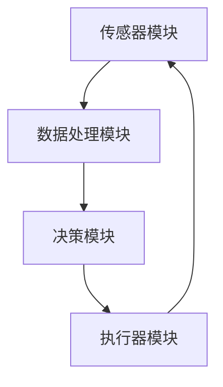

# 智能宠物玩具：AI Agent的宠物智力开发

> 关键词：智能宠物玩具、AI Agent、宠物智力开发、机器学习、人机交互

> 摘要：本文围绕智能宠物玩具中AI Agent对宠物智力开发这一主题展开深入探讨。首先介绍了该研究的背景、目的、预期读者等内容，接着阐述了智能宠物玩具和AI Agent的核心概念及联系，详细讲解了相关核心算法原理、数学模型和公式。通过实际项目案例，展示了开发环境搭建、源代码实现与解读。分析了智能宠物玩具在不同场景下的实际应用，推荐了学习资源、开发工具框架以及相关论文著作。最后总结了未来发展趋势与挑战，并对常见问题进行解答，为智能宠物玩具领域的研究和实践提供了全面且深入的参考。

## 1. 背景介绍 
### 1.1 目的和范围
随着人们生活水平的提高，养宠物已经成为一种普遍的生活方式。宠物不仅是人们的伴侣，还能给人们带来情感上的慰藉。然而，宠物也需要适当的智力刺激和锻炼，以保持健康和快乐。传统的宠物玩具功能有限，无法满足宠物多样化的需求。智能宠物玩具结合了AI Agent技术，能够为宠物提供更加个性化、智能化的互动体验，从而促进宠物的智力开发。

本文的目的是探讨智能宠物玩具中AI Agent的应用原理、技术实现以及对宠物智力开发的影响。具体范围包括智能宠物玩具的核心概念、相关算法原理、数学模型、项目实战案例、实际应用场景、工具和资源推荐等方面。

### 1.2 预期读者
本文预期读者包括宠物玩具开发者、人工智能研究人员、宠物爱好者以及对智能设备和动物行为感兴趣的人士。对于宠物玩具开发者，本文可以提供技术思路和实现方法；对于人工智能研究人员，本文可以作为AI在动物领域应用的案例参考；对于宠物爱好者，本文可以帮助他们了解智能宠物玩具的原理和优势，选择适合自己宠物的玩具；对于对智能设备和动物行为感兴趣的人士，本文可以提供一个跨领域的学习和研究视角。

### 1.3 文档结构概述
本文将按照以下结构进行组织：
1. 背景介绍：介绍研究的目的、范围、预期读者和文档结构概述。
2. 核心概念与联系：阐述智能宠物玩具和AI Agent的核心概念，以及它们之间的联系，并通过文本示意图和Mermaid流程图进行展示。
3. 核心算法原理 & 具体操作步骤：详细讲解智能宠物玩具中涉及的核心算法原理，并使用Python源代码进行阐述。
4. 数学模型和公式 & 详细讲解 & 举例说明：介绍相关的数学模型和公式，并通过具体例子进行详细讲解。
5. 项目实战：代码实际案例和详细解释说明：通过一个实际项目案例，展示智能宠物玩具的开发过程，包括开发环境搭建、源代码实现和代码解读。
6. 实际应用场景：分析智能宠物玩具在不同场景下的实际应用。
7. 工具和资源推荐：推荐学习资源、开发工具框架以及相关论文著作。
8. 总结：未来发展趋势与挑战：总结智能宠物玩具的发展趋势和面临的挑战。
9. 附录：常见问题与解答：解答读者可能关心的常见问题。
10. 扩展阅读 & 参考资料：提供扩展阅读的建议和相关参考资料。

### 1.4 术语表
#### 1.4.1 核心术语定义
- **智能宠物玩具**：结合了人工智能技术，能够与宠物进行互动，为宠物提供多样化体验的玩具。
- **AI Agent**：人工智能代理，是一种能够感知环境、做出决策并采取行动的智能实体。
- **机器学习**：一门多领域交叉学科，涉及概率论、统计学、逼近论、凸分析、算法复杂度理论等多门学科。它专门研究计算机怎样模拟或实现人类的学习行为，以获取新的知识或技能，重新组织已有的知识结构使之不断改善自身的性能。
- **强化学习**：一种机器学习方法，智能体通过与环境进行交互，根据环境反馈的奖励信号来学习最优的行为策略。
- **计算机视觉**：一门研究如何使机器“看”的科学，通过摄像头等设备获取图像或视频数据，并对其进行处理、分析和理解。

#### 1.4.2 相关概念解释
- **宠物智力开发**：通过各种方式和活动，刺激宠物的大脑，提高宠物的认知能力、学习能力、解决问题的能力等。
- **人机交互**：人与计算机之间进行信息交换和互动的过程，在智能宠物玩具中表现为宠物与玩具之间的互动。

#### 1.4.3 缩略词列表
- **AI**：Artificial Intelligence，人工智能
- **ML**：Machine Learning，机器学习
- **RL**：Reinforcement Learning，强化学习
- **CV**：Computer Vision，计算机视觉

## 2. 核心概念与联系 
### 核心概念原理
#### 智能宠物玩具
智能宠物玩具是在传统宠物玩具的基础上，融入了人工智能技术。它通常配备有传感器、处理器和执行器等硬件设备，能够感知宠物的行为和环境信息，并根据这些信息做出相应的反应。例如，一些智能宠物玩具可以通过摄像头识别宠物的位置和动作，然后移动到宠物附近，吸引宠物的注意力；还有一些玩具可以通过声音传感器检测宠物的叫声，根据叫声的不同做出不同的回应。

#### AI Agent
AI Agent是一种能够自主感知环境、做出决策并采取行动的智能实体。在智能宠物玩具中，AI Agent可以根据宠物的行为和环境信息，选择合适的互动方式和策略。例如，当宠物对某个玩具表现出兴趣时，AI Agent可以增加玩具的互动难度，以进一步激发宠物的好奇心和探索欲；当宠物感到厌倦时，AI Agent可以更换玩具的互动模式，提供新的刺激。

### 架构的文本示意图
智能宠物玩具的架构主要包括以下几个部分：
1. **传感器模块**：用于感知宠物的行为和环境信息，如摄像头、声音传感器、压力传感器等。
2. **数据处理模块**：对传感器采集到的数据进行处理和分析，提取有用的信息。
3. **决策模块**：根据数据处理模块提供的信息，AI Agent做出决策，选择合适的互动方式和策略。
4. **执行器模块**：根据决策模块的指令，执行相应的动作，如移动、发光、发声等。

### Mermaid流程图

该流程图展示了智能宠物玩具的工作流程。传感器模块不断采集宠物的行为和环境信息，并将其传输给数据处理模块。数据处理模块对数据进行处理和分析后，将结果传递给决策模块。决策模块根据这些信息做出决策，并将指令发送给执行器模块。执行器模块执行相应的动作，同时这些动作又会影响宠物的行为和环境，从而形成一个闭环反馈系统。

## 3. 核心算法原理 & 具体操作步骤 
### 核心算法原理
在智能宠物玩具中，常用的核心算法包括机器学习算法和计算机视觉算法。下面我们以强化学习算法为例，详细讲解其原理。

#### 强化学习原理
强化学习是一种通过智能体与环境进行交互，根据环境反馈的奖励信号来学习最优行为策略的机器学习方法。在智能宠物玩具中，智能体可以看作是玩具本身，环境就是宠物和周围的环境。智能体通过执行不同的动作（如移动、发光、发声等）与环境进行交互，环境会根据智能体的动作给予相应的奖励或惩罚。智能体的目标是通过不断地尝试和学习，找到一种能够获得最大累积奖励的行为策略。

强化学习的基本要素包括：
- **状态（State）**：描述环境当前的情况，在智能宠物玩具中，状态可以包括宠物的位置、动作、情绪等信息。
- **动作（Action）**：智能体可以执行的操作，如移动到某个位置、发出某种声音等。
- **奖励（Reward）**：环境对智能体执行某个动作后的反馈，奖励可以是正的（表示该动作得到了积极的结果），也可以是负的（表示该动作得到了消极的结果）。
- **策略（Policy）**：智能体根据当前状态选择动作的规则，策略通常用一个函数来表示，输入为状态，输出为动作。

### 具体操作步骤
下面是使用Python实现一个简单的强化学习算法的具体步骤：

```python
import numpy as np

# 定义环境参数
num_states = 10  # 状态数量
num_actions = 4  # 动作数量
gamma = 0.9  # 折扣因子
alpha = 0.1  # 学习率

# 初始化Q表
Q = np.zeros((num_states, num_actions))

# 定义奖励函数
def get_reward(state, action):
    # 这里简单定义一个奖励函数，实际应用中需要根据具体情况设计
    if state == 5 and action == 2:
        return 10
    else:
        return -1

# 定义策略函数
def epsilon_greedy(Q, state, epsilon):
    if np.random.uniform(0, 1) < epsilon:
        # 探索：随机选择一个动作
        action = np.random.choice(num_actions)
    else:
        # 利用：选择Q值最大的动作
        action = np.argmax(Q[state, :])
    return action

# 训练过程
num_episodes = 1000
epsilon = 0.1

for episode in range(num_episodes):
    state = np.random.randint(0, num_states)  # 随机初始化状态
    done = False
    while not done:
        action = epsilon_greedy(Q, state, epsilon)
        reward = get_reward(state, action)
        next_state = np.random.randint(0, num_states)  # 简单模拟下一个状态
        # 更新Q表
        Q[state, action] = Q[state, action] + alpha * (reward + gamma * np.max(Q[next_state, :]) - Q[state, action])
        state = next_state
        if reward == 10:
            done = True

# 测试过程
state = np.random.randint(0, num_states)
for _ in range(10):
    action = np.argmax(Q[state, :])
    reward = get_reward(state, action)
    next_state = np.random.randint(0, num_states)
    print(f"State: {state}, Action: {action}, Reward: {reward}")
    state = next_state
```

### 代码解释
1. **初始化参数**：定义了状态数量、动作数量、折扣因子和学习率等参数，并初始化了Q表。
2. **奖励函数**：根据当前状态和动作返回相应的奖励值。
3. **策略函数**：使用epsilon-greedy策略，以一定的概率随机选择动作（探索），以其余的概率选择Q值最大的动作（利用）。
4. **训练过程**：通过多次迭代，智能体不断与环境进行交互，根据奖励信号更新Q表。
5. **测试过程**：使用训练好的Q表，智能体选择最优动作，并观察奖励情况。

## 4. 数学模型和公式 & 详细讲解 & 举例说明 
### 数学模型
在强化学习中，常用的数学模型是马尔可夫决策过程（Markov Decision Process，MDP）。MDP是一个五元组 $(S, A, P, R, \gamma)$，其中：
- $S$ 是状态集合，表示环境可能处于的所有状态。
- $A$ 是动作集合，表示智能体可以执行的所有动作。
- $P(s'|s, a)$ 是状态转移概率，表示在状态 $s$ 执行动作 $a$ 后转移到状态 $s'$ 的概率。
- $R(s, a)$ 是奖励函数，表示在状态 $s$ 执行动作 $a$ 后获得的即时奖励。
- $\gamma$ 是折扣因子，取值范围为 $[0, 1]$，用于权衡即时奖励和未来奖励的重要性。

### 公式
#### Q值更新公式
在Q学习算法中，Q值的更新公式为：
$$
Q(s, a) \leftarrow Q(s, a) + \alpha [R(s, a) + \gamma \max_{a'} Q(s', a') - Q(s, a)]
$$
其中，$Q(s, a)$ 表示在状态 $s$ 执行动作 $a$ 的Q值，$\alpha$ 是学习率，$R(s, a)$ 是即时奖励，$\gamma$ 是折扣因子，$s'$ 是下一个状态，$\max_{a'} Q(s', a')$ 表示在下一个状态 $s'$ 选择最优动作的Q值。

#### 策略评估公式
策略评估是计算在给定策略 $\pi$ 下，每个状态的价值函数 $V^{\pi}(s)$。价值函数的定义为：
$$
V^{\pi}(s) = \mathbb{E}_{\pi} \left[ \sum_{t=0}^{\infty} \gamma^t R_{t+1} | S_0 = s \right]
$$
其中，$\mathbb{E}_{\pi}$ 表示在策略 $\pi$ 下的期望，$R_{t+1}$ 是第 $t+1$ 时刻的奖励，$S_0 = s$ 表示初始状态为 $s$。

### 详细讲解
#### Q值更新公式
Q值更新公式的核心思想是通过不断地尝试和学习，让智能体逐渐找到最优的行为策略。公式中的 $R(s, a) + \gamma \max_{a'} Q(s', a')$ 表示在状态 $s$ 执行动作 $a$ 后，未来可能获得的最大累积奖励。而 $Q(s, a)$ 是当前估计的Q值。通过将两者的差值乘以学习率 $\alpha$，并加到当前的Q值上，就可以不断地更新Q值，使其逐渐接近最优值。

#### 策略评估公式
策略评估公式用于计算在给定策略下，每个状态的价值。价值函数表示从某个状态开始，按照给定策略执行动作，所能获得的期望累积奖励。折扣因子 $\gamma$ 的作用是对未来的奖励进行折扣，使得即时奖励更加重要。

### 举例说明
假设一个简单的智能宠物玩具环境，状态集合 $S = \{s_1, s_2, s_3\}$，动作集合 $A = \{a_1, a_2\}$。初始时，Q表中的所有值都为0。

在某一时刻，智能体处于状态 $s_1$，选择了动作 $a_1$，获得即时奖励 $R(s_1, a_1) = 5$，并转移到了状态 $s_2$。假设学习率 $\alpha = 0.1$，折扣因子 $\gamma = 0.9$。

根据Q值更新公式，$Q(s_1, a_1)$ 的更新过程如下：
$$
\begin{align*}
Q(s_1, a_1) &\leftarrow Q(s_1, a_1) + \alpha [R(s_1, a_1) + \gamma \max_{a'} Q(s_2, a') - Q(s_1, a_1)] \\
&= 0 + 0.1 \times [5 + 0.9 \times \max\{Q(s_2, a_1), Q(s_2, a_2)\} - 0] \\
&= 0 + 0.1 \times [5 + 0.9 \times 0 - 0] \\
&= 0.5
\end{align*}
$$

通过不断地进行这样的更新，Q表中的值会逐渐收敛到最优值，智能体也会学习到最优的行为策略。

## 5. 项目实战：代码实际案例和详细解释说明 
### 5.1  开发环境搭建
#### 硬件环境
- **开发板**：选择一款性能适中、易于开发的开发板，如树莓派（Raspberry Pi）。树莓派具有丰富的接口和较低的成本，适合用于智能宠物玩具的开发。
- **传感器**：根据需求选择合适的传感器，如摄像头、声音传感器、红外传感器等。例如，摄像头可以用于识别宠物的位置和动作，声音传感器可以检测宠物的叫声。
- **执行器**：选择能够实现玩具动作的执行器，如电机、舵机、LED灯等。电机可以用于驱动玩具移动，舵机可以控制玩具的角度，LED灯可以发出不同颜色的光。

#### 软件环境
- **操作系统**：在开发板上安装适合的操作系统，如Raspbian（树莓派官方操作系统）。
- **编程语言**：选择Python作为开发语言，Python具有丰富的库和工具，易于学习和使用。
- **开发工具**：使用Visual Studio Code等集成开发环境（IDE）进行代码编写和调试。

### 5.2  源代码详细实现和代码解读
#### 整体功能概述
本项目实现了一个简单的智能宠物玩具，该玩具可以通过摄像头识别宠物的位置，并移动到宠物附近。

#### 代码实现

```python
import cv2
import numpy as np
import RPi.GPIO as GPIO
import time

# 初始化摄像头
cap = cv2.VideoCapture(0)

# 初始化GPIO
GPIO.setmode(GPIO.BCM)
motor_pins = [17, 18, 22, 23]  # 电机控制引脚
for pin in motor_pins:
    GPIO.setup(pin, GPIO.OUT)

# 定义电机控制函数
def move_forward():
    GPIO.output(motor_pins[0], GPIO.HIGH)
    GPIO.output(motor_pins[1], GPIO.LOW)
    GPIO.output(motor_pins[2], GPIO.HIGH)
    GPIO.output(motor_pins[3], GPIO.LOW)

def move_backward():
    GPIO.output(motor_pins[0], GPIO.LOW)
    GPIO.output(motor_pins[1], GPIO.HIGH)
    GPIO.output(motor_pins[2], GPIO.LOW)
    GPIO.output(motor_pins[3], GPIO.HIGH)

def turn_left():
    GPIO.output(motor_pins[0], GPIO.LOW)
    GPIO.output(motor_pins[1], GPIO.HIGH)
    GPIO.output(motor_pins[2], GPIO.HIGH)
    GPIO.output(motor_pins[3], GPIO.LOW)

def turn_right():
    GPIO.output(motor_pins[0], GPIO.HIGH)
    GPIO.output(motor_pins[1], GPIO.LOW)
    GPIO.output(motor_pins[2], GPIO.LOW)
    GPIO.output(motor_pins[3], GPIO.HIGH)

def stop():
    for pin in motor_pins:
        GPIO.output(pin, GPIO.LOW)

# 主循环
while True:
    ret, frame = cap.read()
    if not ret:
        break

    # 进行图像处理，识别宠物位置
    gray = cv2.cvtColor(frame, cv2.COLOR_BGR2GRAY)
    blurred = cv2.GaussianBlur(gray, (5, 5), 0)
    _, thresh = cv2.threshold(blurred, 100, 255, cv2.THRESH_BINARY)
    contours, _ = cv2.findContours(thresh.copy(), cv2.RETR_EXTERNAL, cv2.CHAIN_APPROX_SIMPLE)

    if len(contours) > 0:
        c = max(contours, key=cv2.contourArea)
        M = cv2.moments(c)
        if M["m00"]!= 0:
            cX = int(M["m10"] / M["m00"])
            cY = int(M["m01"] / M["m00"])
            frame_width = frame.shape[1]
            frame_height = frame.shape[0]

            # 根据宠物位置控制玩具移动
            if cX < frame_width / 3:
                turn_left()
            elif cX > 2 * frame_width / 3:
                turn_right()
            else:
                move_forward()
    else:
        stop()

    # 显示图像
    cv2.imshow("Frame", frame)
    if cv2.waitKey(1) & 0xFF == ord('q'):
        break

# 释放资源
cap.release()
cv2.destroyAllWindows()
GPIO.cleanup()
```

#### 代码解读
1. **初始化部分**：初始化摄像头和GPIO引脚，用于图像采集和电机控制。
2. **电机控制函数**：定义了向前、向后、向左、向右移动和停止的函数，通过控制GPIO引脚的电平来实现电机的转动。
3. **主循环**：不断采集摄像头的图像，进行图像处理，识别宠物的位置。根据宠物的位置，调用相应的电机控制函数，控制玩具的移动。
4. **图像处理**：将图像转换为灰度图，进行高斯模糊和阈值处理，然后查找轮廓。找到最大的轮廓，并计算其中心点的坐标。
5. **位置判断**：根据宠物的位置，判断玩具应该向哪个方向移动。如果宠物在图像的左侧，玩具向左转；如果宠物在图像的右侧，玩具向右转；如果宠物在图像的中间，玩具向前移动。
6. **资源释放**：在程序结束时，释放摄像头资源，关闭所有窗口，并清理GPIO引脚。

### 5.3  代码解读与分析
#### 优点
- **简单易懂**：代码结构清晰，使用了常见的图像处理和GPIO控制方法，易于理解和修改。
- **可扩展性强**：可以根据需要添加更多的传感器和执行器，实现更复杂的功能。
- **实时性好**：通过不断采集图像并进行处理，能够实时地根据宠物的位置控制玩具的移动。

#### 缺点
- **识别精度有限**：使用简单的图像处理方法，对于复杂的环境和宠物姿态，识别精度可能不够高。
- **缺乏智能决策**：只是根据宠物的位置进行简单的移动控制，没有考虑宠物的行为和情绪，缺乏智能决策能力。

#### 改进方向
- **引入机器学习算法**：使用深度学习模型进行宠物识别，提高识别精度。
- **结合强化学习**：让玩具能够根据宠物的行为和环境信息，学习最优的互动策略。

## 6. 实际应用场景 
### 家庭陪伴场景
在家庭环境中，智能宠物玩具可以为宠物提供持续的陪伴和娱乐。当主人不在家时，玩具可以自动与宠物进行互动，激发宠物的好奇心和探索欲，减少宠物的孤独感。例如，智能球可以通过随机移动和发光，吸引宠物追逐和玩耍；智能发声玩具可以根据宠物的叫声做出回应，与宠物进行“对话”。

### 宠物训练场景
智能宠物玩具可以作为宠物训练的工具。通过设置不同的互动模式和难度级别，帮助宠物学习基本的指令和技能。例如，玩具可以发出特定的声音或灯光信号，引导宠物做出相应的动作；还可以通过奖励机制，鼓励宠物完成任务，提高宠物的学习积极性和能力。

### 宠物健康监测场景
智能宠物玩具可以集成健康监测功能，实时监测宠物的运动状态、心率、体温等生理指标。通过分析这些数据，主人可以及时了解宠物的健康状况，发现潜在的健康问题。例如，当宠物的运动量明显减少或心率异常时，玩具可以发出警报，提醒主人关注宠物的健康。

### 宠物店和宠物医院场景
在宠物店和宠物医院，智能宠物玩具可以用于吸引顾客和评估宠物的健康状况。宠物店可以展示各种智能宠物玩具，让顾客的宠物进行体验，增加顾客的购买欲望；宠物医院可以使用智能宠物玩具对宠物进行行为评估和康复训练，提高诊断和治疗的效果。

## 7. 工具和资源推荐
### 7.1 学习资源推荐
#### 7.1.1 书籍推荐
- 《Python机器学习实战》：本书详细介绍了Python在机器学习领域的应用，包括各种机器学习算法的原理和实现方法，适合初学者入门。
- 《强化学习：原理与Python实现》：系统地介绍了强化学习的基本概念、算法和应用，通过大量的Python代码示例帮助读者理解和掌握强化学习的核心内容。
- 《计算机视觉：算法与应用》：全面阐述了计算机视觉的基本理论、算法和应用，是计算机视觉领域的经典教材。

#### 7.1.2 在线课程
- Coursera上的“机器学习”课程：由斯坦福大学教授Andrew Ng主讲，是机器学习领域的经典课程，涵盖了机器学习的基本概念、算法和应用。
- edX上的“强化学习基础”课程：详细介绍了强化学习的基本原理和算法，通过实际案例帮助学生掌握强化学习的应用。
- 哔哩哔哩（B站）上的“计算机视觉入门教程”：由国内知名博主讲解，内容通俗易懂，适合初学者快速入门。

#### 7.1.3 技术博客和网站
- Medium：一个汇集了众多技术专家和爱好者的博客平台，上面有很多关于人工智能、机器学习、计算机视觉等领域的优秀文章。
- 知乎：国内知名的知识问答社区，有很多关于智能宠物玩具和人工智能的讨论和分享。
- GitHub：全球最大的开源代码托管平台，上面有很多与智能宠物玩具相关的开源项目，可以参考和学习。

### 7.2 开发工具框架推荐
#### 7.2.1 IDE和编辑器
- Visual Studio Code：一款轻量级的开源代码编辑器，支持多种编程语言和插件扩展，具有强大的代码编辑和调试功能。
- PyCharm：专门为Python开发设计的集成开发环境，提供了丰富的代码分析、调试和测试工具，适合Python项目的开发。
- Jupyter Notebook：一种交互式的编程环境，支持Python等多种编程语言，可以方便地进行代码编写、运行和可视化展示，适合机器学习和数据分析项目的开发。

#### 7.2.2 调试和性能分析工具
- PDB：Python自带的调试工具，可以在代码中设置断点，逐步执行代码，查看变量的值和程序的执行流程。
- cProfile：Python的性能分析工具，可以统计代码中各个函数的执行时间和调用次数，帮助开发者找出性能瓶颈。
- TensorBoard：TensorFlow的可视化工具，可以实时监控模型的训练过程，查看损失函数、准确率等指标的变化情况。

#### 7.2.3 相关框架和库
- TensorFlow：一个开源的机器学习框架，提供了丰富的深度学习模型和工具，支持多种硬件平台和编程语言。
- PyTorch：另一个流行的深度学习框架，具有动态图机制和简洁的API，易于学习和使用。
- OpenCV：一个开源的计算机视觉库，提供了各种图像处理和计算机视觉算法，广泛应用于智能宠物玩具的图像识别和处理中。

### 7.3 相关论文著作推荐
#### 7.3.1 经典论文
- “Q-learning”：由Christopher J. C. H. Watkins和Peter Dayan于1992年发表，是强化学习领域的经典论文，介绍了Q学习算法的基本原理和实现方法。
- “LeNet-5: Gradient-Based Learning Applied to Document Recognition”：由Yann LeCun等人于1998年发表，提出了LeNet-5卷积神经网络模型，开创了深度学习在图像识别领域的应用。
- “ImageNet Classification with Deep Convolutional Neural Networks”：由Alex Krizhevsky等人于2012年发表，提出了AlexNet卷积神经网络模型，在ImageNet图像分类竞赛中取得了巨大成功，引发了深度学习的热潮。

#### 7.3.2 最新研究成果
- 关注顶级学术会议，如NeurIPS（神经信息处理系统大会）、ICML（国际机器学习会议）、CVPR（计算机视觉与模式识别会议）等，这些会议上会发表很多关于人工智能、机器学习、计算机视觉等领域的最新研究成果。
- 阅读相关领域的顶级学术期刊，如Journal of Artificial Intelligence Research（JAIR）、Artificial Intelligence（AI）、IEEE Transactions on Pattern Analysis and Machine Intelligence（TPAMI）等，这些期刊上会刊登高质量的研究论文。

#### 7.3.3 应用案例分析
- 一些科技媒体和行业报告中会有关于智能宠物玩具的应用案例分析，如TechCrunch、Gartner等。这些案例分析可以帮助读者了解智能宠物玩具在实际应用中的情况和效果。
- 参加相关的行业展会和研讨会，与业内人士交流和分享经验，了解智能宠物玩具的最新应用趋势和案例。

## 8. 总结：未来发展趋势与挑战
### 未来发展趋势
#### 个性化定制
未来的智能宠物玩具将更加注重个性化定制。根据宠物的品种、年龄、性格等因素，为宠物提供定制化的互动体验。例如，对于活泼好动的宠物，玩具可以设计更多的运动和追逐模式；对于温顺安静的宠物，玩具可以提供更温和的互动方式。

#### 多模态交互
智能宠物玩具将不再局限于单一的交互方式，而是实现多模态交互。除了视觉和听觉交互外，还将增加触觉、嗅觉等交互方式。例如，玩具可以通过模拟不同的气味，吸引宠物的注意力；还可以通过振动和触摸，与宠物进行更亲密的互动。

#### 与智能家居融合
智能宠物玩具将与智能家居系统深度融合，实现更智能化的控制和管理。例如，玩具可以与智能摄像头、智能门锁等设备联动，当主人离家时，玩具自动启动，陪伴宠物；当主人回家时，玩具自动停止。

#### 健康监测与数据分析
智能宠物玩具将具备更强大的健康监测和数据分析功能。除了监测宠物的运动状态和生理指标外，还将分析宠物的行为模式和情绪变化，为宠物的健康管理提供更全面的建议。

### 挑战
#### 技术挑战
- **精准识别**：提高宠物的识别精度是智能宠物玩具面临的一个重要挑战。宠物的姿态、动作和表情变化多样，需要更先进的计算机视觉和机器学习算法来实现精准识别。
- **智能决策**：让玩具能够根据宠物的行为和环境信息做出智能决策，需要更复杂的强化学习和深度学习算法，以及大量的训练数据。
- **硬件性能**：智能宠物玩具需要具备一定的计算能力和续航能力，以支持复杂的算法和长时间的运行。如何在保证硬件性能的前提下，降低成本和体积，是一个亟待解决的问题。

#### 市场挑战
- **消费者认知**：目前，消费者对智能宠物玩具的认知度还不够高，需要加强市场推广和宣传，提高消费者对智能宠物玩具的了解和接受度。
- **价格因素**：智能宠物玩具的研发和生产成本较高，导致价格相对较贵。如何在保证产品质量和功能的前提下，降低价格，提高产品的性价比，是打开市场的关键。
- **竞争激烈**：随着智能宠物玩具市场的逐渐升温，竞争也越来越激烈。如何在众多的竞争对手中脱颖而出，打造具有差异化竞争优势的产品，是企业面临的一个重要挑战。

#### 伦理和法律挑战
- **动物福利**：智能宠物玩具的设计和使用需要考虑动物福利问题，避免对宠物造成伤害或不适。例如，玩具的声音和光线强度不能过高，以免对宠物的听力和视力造成损害。
- **数据隐私**：智能宠物玩具在使用过程中会收集大量的宠物数据，如行为数据、生理数据等。如何保护这些数据的隐私和安全，防止数据泄露和滥用，是一个重要的伦理和法律问题。

## 9. 附录：常见问题与解答
### 智能宠物玩具对宠物真的有智力开发作用吗？
智能宠物玩具通过多样化的互动方式和挑战，可以刺激宠物的大脑，提高宠物的认知能力、学习能力和解决问题的能力，从而对宠物的智力开发起到一定的作用。例如，一些智能玩具可以让宠物通过完成任务来获得奖励，这有助于培养宠物的目标意识和执行力。

### 智能宠物玩具安全吗？
一般来说，正规厂家生产的智能宠物玩具在设计和制造过程中会考虑到宠物的安全问题，采用无毒、无害的材料，避免对宠物造成伤害。但是，在使用过程中，主人仍然需要注意观察宠物的行为，确保玩具的使用不会对宠物造成危险。例如，一些小零件可能会被宠物吞食，需要及时清理和更换。

### 智能宠物玩具的续航能力如何？
智能宠物玩具的续航能力因产品而异。一些简单的玩具可能使用电池供电，续航时间较短，需要经常更换电池；而一些复杂的玩具可能采用充电式设计，续航时间相对较长。在购买时，建议选择续航能力较强的产品，以满足宠物的使用需求。

### 智能宠物玩具容易操作吗？
大多数智能宠物玩具的操作都比较简单，主人只需要按照说明书进行设置和使用即可。一些玩具还支持手机APP控制，主人可以通过手机远程控制玩具的运行，更加方便快捷。

### 智能宠物玩具的价格贵吗？
智能宠物玩具的价格因产品的功能、品牌和质量而异。一般来说，功能越复杂、品牌越知名的产品价格越高。与传统宠物玩具相比，智能宠物玩具的价格相对较高，但考虑到其提供的多样化功能和对宠物智力开发的作用，还是具有一定的性价比。

## 10. 扩展阅读 & 参考资料
### 扩展阅读
- 《宠物行为学》：深入了解宠物的行为和心理，有助于更好地设计和使用智能宠物玩具。
- 《人工智能简史》：了解人工智能的发展历程和技术原理，为智能宠物玩具的研究和开发提供理论基础。
- 《智能家居：原理、技术与应用》：了解智能家居的相关知识，为智能宠物玩具与智能家居的融合提供思路。

### 参考资料
- [1] Sutton, R. S., & Barto, A. G. (2018). Reinforcement learning: An introduction. MIT press.
- [2] LeCun, Y., Bengio, Y., & Hinton, G. (2015). Deep learning. Nature, 521(7553), 436-444.
- [3] OpenCV官方文档：https://docs.opencv.org/
- [4] TensorFlow官方文档：https://www.tensorflow.org/
- [5] PyTorch官方文档：https://pytorch.org/

作者：AI天才研究院/AI Genius Institute & 禅与计算机程序设计艺术 /Zen And The Art of Computer Programming