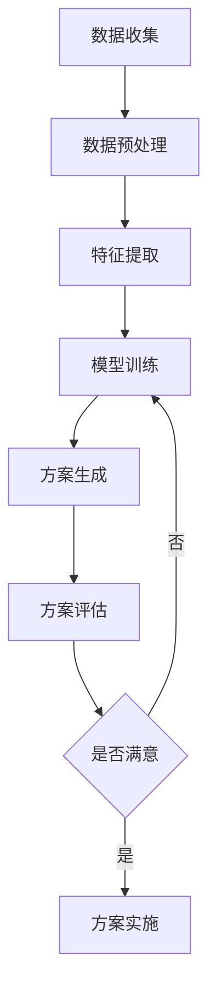

# 智能家族信托规划助手

> 关键词：智能家族信托规划助手、人工智能、家族信托、金融科技、财富管理、数据分析、智能决策

> 摘要：本文围绕智能家族信托规划助手展开深入探讨。随着家族信托需求的不断增长，传统规划方式面临效率低、精准度不足等问题，智能家族信托规划助手应运而生。文章详细介绍了其背景，包括目的、预期读者等内容；阐述了核心概念与联系，构建了清晰的架构图和流程图；深入剖析核心算法原理，并给出Python源代码；讲解数学模型和公式，辅以实例说明；通过项目实战展示其开发环境搭建、源代码实现与解读；分析了实际应用场景；推荐了相关的学习资源、开发工具框架及论文著作；最后总结了其未来发展趋势与挑战，并对常见问题进行解答。旨在为读者全面呈现智能家族信托规划助手的技术原理、应用价值和发展前景。

## 1. 背景介绍 
### 1.1 目的和范围
智能家族信托规划助手的主要目的是利用先进的人工智能和数据分析技术，为家族信托的规划提供高效、精准、个性化的解决方案。在传统的家族信托规划过程中，往往需要耗费大量的人力和时间进行信息收集、分析和方案制定，而且容易受到人为因素的影响，导致规划结果不够准确和全面。智能家族信托规划助手能够整合多源数据，运用复杂的算法进行分析和建模，快速生成符合客户需求的家族信托规划方案，提高规划效率和质量。

其范围涵盖了家族信托规划的各个环节，包括客户信息收集与分析、资产配置建议、风险评估、信托条款设计、税务筹划等。通过对这些环节的智能化处理，帮助客户更好地管理家族财富，实现财富的传承和增值。

### 1.2 预期读者
本文的预期读者主要包括以下几类人群：
- **金融从业者**：如信托公司的规划师、理财顾问、投资经理等，他们可以通过了解智能家族信托规划助手的技术原理和应用方法，提升自己的专业能力和服务水平，为客户提供更优质的家族信托规划服务。
- **科技开发者**：包括人工智能、数据分析、软件开发等领域的专业人员，他们可以从本文中获取智能家族信托规划助手的技术架构和算法实现细节，为相关技术的研发和创新提供参考。
- **家族企业所有者和高净值人士**：他们是家族信托的主要需求者，通过了解智能家族信托规划助手的功能和优势，可以更好地利用这一工具进行家族财富的规划和管理，保障家族财富的安全和传承。
- **研究人员**：金融、法律、信息技术等领域的研究人员可以从本文中获取关于智能家族信托规划助手的研究资料和案例分析，为相关领域的学术研究提供支持。

### 1.3 文档结构概述
本文将按照以下结构进行详细阐述：
- **核心概念与联系**：介绍智能家族信托规划助手的核心概念，包括家族信托、人工智能、数据分析等，以及它们之间的联系，并通过文本示意图和Mermaid流程图进行展示。
- **核心算法原理 & 具体操作步骤**：深入剖析智能家族信托规划助手所使用的核心算法，如机器学习算法、优化算法等，并给出Python源代码进行详细阐述，同时说明具体的操作步骤。
- **数学模型和公式 & 详细讲解 & 举例说明**：讲解智能家族信托规划助手所涉及的数学模型和公式，如资产定价模型、风险评估模型等，并通过具体的例子进行说明。
- **项目实战：代码实际案例和详细解释说明**：通过一个实际的项目案例，展示智能家族信托规划助手的开发环境搭建、源代码实现和代码解读，帮助读者更好地理解其技术实现过程。
- **实际应用场景**：分析智能家族信托规划助手在不同场景下的应用，如家族财富传承、资产保护、税务筹划等，展示其实际应用价值。
- **工具和资源推荐**：推荐相关的学习资源、开发工具框架和论文著作，帮助读者进一步深入学习和研究智能家族信托规划助手。
- **总结：未来发展趋势与挑战**：总结智能家族信托规划助手的发展现状，分析其未来发展趋势和面临的挑战。
- **附录：常见问题与解答**：对读者可能关心的常见问题进行解答，提供相关的技术支持和建议。
- **扩展阅读 & 参考资料**：提供相关的扩展阅读材料和参考资料，方便读者进一步深入学习和研究。

### 1.4 术语表
#### 1.4.1 核心术语定义
- **家族信托**：是一种信托机构受个人或家族的委托，代为管理、处置家庭财产的财产管理方式，以实现富人的财富规划及传承目标。
- **人工智能（AI）**：是研究、开发用于模拟、延伸和扩展人的智能的理论、方法、技术及应用系统的一门新的技术科学。
- **数据分析**：是指用适当的统计分析方法对收集来的大量数据进行分析，提取有用信息和形成结论而对数据加以详细研究和概括总结的过程。
- **机器学习**：是一门多领域交叉学科，涉及概率论、统计学、逼近论、凸分析、算法复杂度理论等多门学科。它专门研究计算机怎样模拟或实现人类的学习行为，以获取新的知识或技能，重新组织已有的知识结构使之不断改善自身的性能。
- **资产配置**：是指根据投资需求将投资资金在不同资产类别之间进行分配，通常是将资产在低风险、低收益证券与高风险、高收益证券之间进行分配。

#### 1.4.2 相关概念解释
- **信托条款**：是指信托合同中规定的信托当事人的权利和义务、信托财产的管理和处分方式、信托收益的分配等内容的条款。
- **风险评估**：是指在风险事件发生之前或之后（但还没有结束），该事件给人们的生活、生命、财产等各个方面造成的影响和损失的可能性进行量化评估的工作。
- **税务筹划**：是指在纳税行为发生之前，在不违反法律、法规（税法及其他相关法律、法规）的前提下，通过对纳税主体（法人或自然人）的经营活动或投资行为等涉税事项做出事先安排，以达到少缴税或递延纳税目标的一系列谋划活动。

#### 1.4.3 缩略词列表
- **AI**：Artificial Intelligence（人工智能）
- **ML**：Machine Learning（机器学习）
- **HFT**：High - Frequency Trading（高频交易）
- **VaR**：Value at Risk（风险价值）

## 2. 核心概念与联系 

### 核心概念原理
#### 家族信托
家族信托是一种基于信任关系的财产管理制度，委托人将其财产委托给受托人，由受托人按照委托人的意愿和信托合同的约定，为受益人的利益进行管理和处分。家族信托的核心原理在于通过法律和契约的形式，实现财产的隔离和传承，保障家族财富的安全和稳定。

#### 人工智能
人工智能是让计算机模拟人类的智能行为，包括感知、学习、推理、决策等。在智能家族信托规划助手中，人工智能主要通过机器学习、自然语言处理等技术，对大量的金融数据和客户信息进行分析和处理，以实现智能化的规划和决策。

#### 数据分析
数据分析是指对收集到的数据进行清洗、转换、分析和可视化等操作，以发现数据中的规律和价值。在智能家族信托规划助手中，数据分析用于挖掘客户的需求和偏好、评估资产的风险和收益、优化资产配置方案等。

### 架构的文本示意图
智能家族信托规划助手的架构主要包括数据层、算法层、应用层和用户界面层。

- **数据层**：负责收集和存储各种相关数据，包括客户信息、金融市场数据、法律法规数据等。
- **算法层**：运用机器学习、优化算法等对数据进行分析和处理，生成家族信托规划方案。
- **应用层**：将算法层生成的方案进行整合和优化，提供具体的服务，如资产配置建议、风险评估报告等。
- **用户界面层**：为用户提供交互界面，方便用户输入信息、查看规划方案和进行操作。

### Mermaid 流程图


这个流程图展示了智能家族信托规划助手的主要工作流程。首先进行数据收集，然后对数据进行预处理和特征提取，接着使用这些数据进行模型训练，生成家族信托规划方案。对生成的方案进行评估，如果用户不满意，则重新进行模型训练，直到生成满意的方案后进行实施。

## 3. 核心算法原理 & 具体操作步骤 

### 核心算法原理
#### 机器学习算法 - 决策树
决策树是一种常用的机器学习算法，它通过对数据的特征进行分析和判断，构建一个树形结构的模型，用于分类和预测。在智能家族信托规划助手中，决策树可以用于客户分类、风险评估等任务。

决策树的基本原理是通过选择最优的特征和划分点，将数据集划分为不同的子集，使得每个子集中的数据具有较高的纯度。常用的划分准则有信息增益、信息增益比、基尼指数等。

#### 优化算法 - 遗传算法
遗传算法是一种模拟生物进化过程的优化算法，它通过模拟自然选择和遗传机制，不断迭代优化问题的解。在智能家族信托规划助手中，遗传算法可以用于资产配置优化，寻找最优的资产组合，使得在满足一定风险约束的条件下，资产的收益最大化。

### Python源代码详细阐述
```python
# 决策树算法示例
from sklearn.datasets import load_iris
from sklearn.model_selection import train_test_split
from sklearn.tree import DecisionTreeClassifier
from sklearn.metrics import accuracy_score

# 加载数据集
iris = load_iris()
X = iris.data
y = iris.target

# 划分训练集和测试集
X_train, X_test, y_train, y_test = train_test_split(X, y, test_size=0.3, random_state=42)

# 创建决策树分类器
clf = DecisionTreeClassifier()

# 训练模型
clf.fit(X_train, y_train)

# 预测
y_pred = clf.predict(X_test)

# 计算准确率
accuracy = accuracy_score(y_test, y_pred)
print(f"决策树模型的准确率: {accuracy}")


# 遗传算法示例
import numpy as np
from deap import base, creator, tools, algorithms

# 定义问题
creator.create("FitnessMax", base.Fitness, weights=(1.0,))
creator.create("Individual", list, fitness=creator.FitnessMax)

# 初始化种群
toolbox = base.Toolbox()
toolbox.register("attr_bool", np.random.randint, 0, 2)
toolbox.register("individual", tools.initRepeat, creator.Individual, toolbox.attr_bool, n=10)
toolbox.register("population", tools.initRepeat, list, toolbox.individual)

# 定义适应度函数
def eval_func(individual):
    return sum(individual),

toolbox.register("evaluate", eval_func)
toolbox.register("mate", tools.cxTwoPoint)
toolbox.register("mutate", tools.mutFlipBit, indpb=0.05)
toolbox.register("select", tools.selTournament, tournsize=3)

# 运行遗传算法
pop = toolbox.population(n=50)
NGEN = 40
for gen in range(NGEN):
    offspring = algorithms.varAnd(pop, toolbox, cxpb=0.5, mutpb=0.2)
    fits = toolbox.map(toolbox.evaluate, offspring)
    for fit, ind in zip(fits, offspring):
        ind.fitness.values = fit
    pop = toolbox.select(offspring, k=len(pop))

# 输出最优解
best_ind = tools.selBest(pop, k=1)[0]
print(f"遗传算法的最优解: {best_ind}")
```

### 具体操作步骤
1. **数据准备**：收集客户信息、金融市场数据等相关数据，并进行清洗和预处理，确保数据的质量和一致性。
2. **特征工程**：从数据中提取有用的特征，如客户的资产规模、风险偏好、投资目标等，用于模型训练。
3. **模型选择和训练**：根据具体的任务选择合适的算法，如决策树、遗传算法等，并使用训练数据对模型进行训练。
4. **模型评估和优化**：使用测试数据对训练好的模型进行评估，根据评估结果对模型进行优化，如调整模型参数、选择更合适的特征等。
5. **方案生成和实施**：使用训练好的模型生成家族信托规划方案，并根据客户的需求和反馈进行调整和优化，最终实施规划方案。

## 4. 数学模型和公式 & 详细讲解 & 举例说明 

### 资产定价模型 - 资本资产定价模型（CAPM）
资本资产定价模型（CAPM）是一种描述资产预期收益率与风险之间关系的模型。其基本公式为：
$$E(R_i)=R_f+\beta_i[E(R_m)-R_f]$$
其中：
- $E(R_i)$ 是资产 $i$ 的预期收益率。
- $R_f$ 是无风险收益率，通常可以用国债收益率来近似表示。
- $\beta_i$ 是资产 $i$ 的贝塔系数，反映了资产 $i$ 的收益率对市场收益率变动的敏感程度。
- $E(R_m)$ 是市场组合的预期收益率。

### 详细讲解
CAPM 模型的核心思想是，资产的预期收益率由两部分组成：无风险收益率和风险溢价。风险溢价是资产承担市场风险所获得的额外收益，其大小取决于资产的贝塔系数。贝塔系数越大，资产的风险越高，预期收益率也越高。

### 举例说明
假设无风险收益率 $R_f = 3\%$，市场组合的预期收益率 $E(R_m)=10\%$，某资产的贝塔系数 $\beta_i = 1.2$。则该资产的预期收益率为：
$$E(R_i)=0.03 + 1.2\times(0.1 - 0.03)=0.114 = 11.4\%$$

### 风险评估模型 - 风险价值（VaR）
风险价值（VaR）是一种衡量资产或投资组合在一定置信水平下，在未来特定时间段内可能遭受的最大损失的方法。其基本公式为：
$$P(\Delta V\leq -VaR)=1 - c$$
其中：
- $\Delta V$ 是资产或投资组合在未来特定时间段内的价值变化。
- $VaR$ 是风险价值。
- $c$ 是置信水平。

### 详细讲解
VaR 的计算方法有多种，常见的有历史模拟法、方差 - 协方差法和蒙特卡罗模拟法。其核心思想是通过对资产或投资组合的历史数据或模拟数据进行分析，估计在一定置信水平下的最大损失。

### 举例说明
假设某投资组合在 95% 的置信水平下，1 天的 VaR 为 100 万元。这意味着在未来 1 天内，该投资组合有 95% 的可能性损失不超过 100 万元，有 5% 的可能性损失超过 100 万元。

## 5. 项目实战：代码实际案例和详细解释说明 

### 5.1  开发环境搭建
#### 操作系统
选择合适的操作系统，如 Windows、Linux 或 macOS。本文以 Windows 10 为例进行说明。

#### 编程语言和开发工具
- **Python**：选择 Python 3.7 及以上版本，可以从 Python 官方网站（https://www.python.org/downloads/） 下载安装。
- **集成开发环境（IDE）**：推荐使用 PyCharm，可以从 JetBrains 官方网站（https://www.jetbrains.com/pycharm/download/） 下载安装。

#### 相关库和框架
- **NumPy**：用于数值计算和数组操作。
- **Pandas**：用于数据处理和分析。
- **Scikit - learn**：用于机器学习算法的实现。
- **Matplotlib**：用于数据可视化。

可以使用以下命令安装这些库：
```sh
pip install numpy pandas scikit-learn matplotlib
```

### 5.2  源代码详细实现和代码解读
```python
import numpy as np
import pandas as pd
from sklearn.model_selection import train_test_split
from sklearn.tree import DecisionTreeClassifier
from sklearn.metrics import accuracy_score
import matplotlib.pyplot as plt

# 加载数据集
data = pd.read_csv('customer_data.csv')

# 数据预处理
X = data.drop('risk_level', axis=1)
y = data['risk_level']

# 划分训练集和测试集
X_train, X_test, y_train, y_test = train_test_split(X, y, test_size=0.3, random_state=42)

# 创建决策树分类器
clf = DecisionTreeClassifier()

# 训练模型
clf.fit(X_train, y_train)

# 预测
y_pred = clf.predict(X_test)

# 计算准确率
accuracy = accuracy_score(y_test, y_pred)
print(f"决策树模型的准确率: {accuracy}")

# 可视化决策树
from sklearn.tree import plot_tree
plt.figure(figsize=(10, 6))
plot_tree(clf, feature_names=X.columns, class_names=y.unique(), filled=True)
plt.show()
```

### 代码解读与分析
1. **数据加载**：使用 `pandas` 库的 `read_csv` 函数加载客户数据文件 `customer_data.csv`。
2. **数据预处理**：将特征数据和目标数据分开，`X` 表示特征数据，`y` 表示目标数据（风险等级