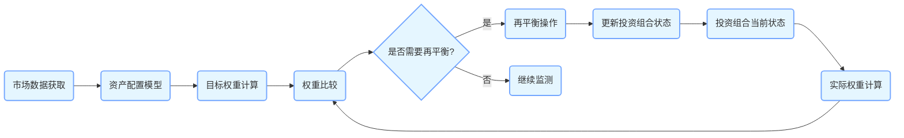

# 智能投资组合多周期再平衡策略

> 关键词：智能投资组合、多周期再平衡、资产配置、风险控制、量化投资

> 摘要：本文深入探讨智能投资组合多周期再平衡策略，旨在帮助投资者在不同市场环境下优化资产配置，降低风险并提高收益。文章首先介绍了该策略的背景信息，包括目的、预期读者、文档结构和相关术语。接着阐述核心概念与联系，通过文本示意图和 Mermaid 流程图展示其原理和架构。详细讲解核心算法原理及具体操作步骤，并给出 Python 源代码。同时，运用数学模型和公式对策略进行分析，结合实际例子加深理解。通过项目实战展示代码实现和解读，分析不同场景下的应用效果。最后探讨实际应用场景，推荐相关工具和资源，总结未来发展趋势与挑战，解答常见问题并提供扩展阅读和参考资料。

## 1. 背景介绍 
### 1.1 目的和范围
在金融投资领域，投资者面临着市场的不确定性和资产价格的波动。智能投资组合多周期再平衡策略的目的是通过合理的资产配置和定期调整，降低投资组合的风险，提高收益的稳定性。本策略的范围涵盖了多种金融资产，如股票、债券、基金等，适用于个人投资者、机构投资者以及量化投资团队。

### 1.2 预期读者
本文预期读者包括对金融投资和量化交易感兴趣的个人投资者、金融机构的投资经理、量化分析师以及相关领域的研究人员。无论您是初学者还是有一定经验的专业人士，都可以从本文中获取关于智能投资组合多周期再平衡策略的深入知识。

### 1.3 文档结构概述
本文将按照以下结构进行阐述：首先介绍核心概念与联系，包括策略的基本原理和架构；接着详细讲解核心算法原理和具体操作步骤，并给出 Python 源代码；然后运用数学模型和公式对策略进行分析，结合实际例子进行说明；通过项目实战展示代码的实际应用和解读；探讨该策略在不同场景下的实际应用；推荐相关的学习资源、开发工具和研究论文；最后总结未来发展趋势与挑战，解答常见问题并提供扩展阅读和参考资料。

### 1.4 术语表
#### 1.4.1 核心术语定义
- **智能投资组合**：基于数据分析和算法模型构建的投资组合，旨在优化资产配置，实现风险和收益的平衡。
- **多周期再平衡**：在不同的时间周期（如日、周、月）对投资组合进行定期调整，以维持资产的目标权重。
- **资产配置**：将资金分配到不同类型的资产中，以降低投资组合的风险。
- **风险控制**：通过各种方法和策略，降低投资组合面临的风险。
- **量化投资**：运用数学模型和计算机算法进行投资决策的方法。

#### 1.4.2 相关概念解释
- **资产相关性**：不同资产之间价格变动的关联程度。正相关表示资产价格变动方向一致，负相关表示变动方向相反。
- **波动率**：衡量资产价格波动程度的指标，波动率越高，资产价格的不确定性越大。
- **夏普比率**：衡量投资组合风险调整后收益的指标，越高表示投资组合在承担相同风险的情况下获得的收益越高。

#### 1.4.3 缩略词列表
- **ETF**：交易型开放式指数基金（Exchange Traded Fund）
- **MA**：移动平均线（Moving Average）
- **VAR**：风险价值（Value at Risk）

## 2. 核心概念与联系 
### 核心概念原理
智能投资组合多周期再平衡策略的核心原理是基于资产配置和风险控制的思想。通过合理地将资金分配到不同类型的资产中，可以降低投资组合的整体风险。同时，由于市场环境的变化，资产的实际权重会偏离目标权重，因此需要定期进行再平衡操作，以维持资产的目标权重。

多周期再平衡是指在不同的时间周期对投资组合进行调整。短期再平衡可以及时应对市场的快速变化，长期再平衡则可以避免频繁交易带来的成本。通过结合不同周期的再平衡，可以在风险控制和交易成本之间找到一个平衡点。

### 架构示意图
以下是智能投资组合多周期再平衡策略的架构示意图：



该架构主要包括以下几个部分：
1. **市场数据获取**：收集各种金融资产的历史价格、收益率等数据。
2. **资产配置模型**：根据投资者的风险偏好和投资目标，确定资产的目标权重。
3. **目标权重计算**：根据资产配置模型计算出每种资产的目标权重。
4. **投资组合当前状态**：记录投资组合中每种资产的当前持有数量和市值。
5. **实际权重计算**：根据投资组合当前状态计算出每种资产的实际权重。
6. **权重比较**：将目标权重和实际权重进行比较，判断是否需要进行再平衡操作。
7. **再平衡操作**：如果需要再平衡，则根据目标权重调整投资组合中每种资产的持有数量。
8. **更新投资组合状态**：更新投资组合中每种资产的持有数量和市值，以便下次再平衡时使用。

## 3. 核心算法原理 & 具体操作步骤 
### 核心算法原理
智能投资组合多周期再平衡策略的核心算法主要包括资产配置和再平衡两个部分。

#### 资产配置
资产配置的目标是根据投资者的风险偏好和投资目标，确定投资组合中各种资产的最优权重。常用的资产配置方法包括均值 - 方差模型、风险平价模型等。

以均值 - 方差模型为例，该模型的目标是在给定的预期收益率下，最小化投资组合的方差。假设投资组合中有 $n$ 种资产，每种资产的预期收益率为 $\mu_i$，方差为 $\sigma_i^2$，资产之间的协方差为 $\sigma_{ij}$，投资组合的权重为 $w_i$，则投资组合的预期收益率 $\mu_p$ 和方差 $\sigma_p^2$ 分别为：

$$\mu_p = \sum_{i=1}^{n} w_i \mu_i$$

$$\sigma_p^2 = \sum_{i=1}^{n} w_i^2 \sigma_i^2 + 2 \sum_{1 \leq i < j \leq n} w_i w_j \sigma_{ij}$$

均值 - 方差模型的优化问题可以表示为：

$$\min_{w} \sigma_p^2$$

$$s.t. \sum_{i=1}^{n} w_i = 1$$

$$\mu_p \geq \mu_{target}$$

其中，$\mu_{target}$ 是投资者设定的目标预期收益率。

#### 再平衡
再平衡的目的是在资产价格波动后，将投资组合的实际权重调整回目标权重。具体步骤如下：
1. 计算投资组合中每种资产的实际权重。
2. 将实际权重与目标权重进行比较，计算权重偏差。
3. 根据权重偏差，确定需要买入或卖出的资产数量。
4. 执行买入或卖出操作，更新投资组合的持有数量和市值。

### 具体操作步骤
以下是智能投资组合多周期再平衡策略的具体操作步骤：

#### 步骤 1：数据准备
收集各种金融资产的历史价格、收益率等数据。可以使用金融数据提供商（如雅虎财经、Tushare 等）获取数据。

#### 步骤 2：资产配置
根据投资者的风险偏好和投资目标，选择合适的资产配置方法，计算每种资产的目标权重。

#### 步骤 3：初始投资组合构建
根据目标权重，确定每种资产的初始投资金额，并买入相应数量的资产。

#### 步骤 4：定期监测
在不同的时间周期（如日、周、月）对投资组合进行监测，计算每种资产的实际权重。

#### 步骤 5：权重比较
将实际权重与目标权重进行比较，判断是否需要进行再平衡操作。可以设定一个权重偏差阈值，当实际权重与目标权重的偏差超过该阈值时，进行再平衡操作。

#### 步骤 6：再平衡操作
如果需要再平衡，根据权重偏差确定需要买入或卖出的资产数量，并执行相应的交易操作。

#### 步骤 7：更新投资组合状态
更新投资组合中每种资产的持有数量和市值，以便下次再平衡时使用。

### Python 源代码实现
以下是一个使用 Python 实现智能投资组合多周期再平衡策略的示例代码：

```python
import numpy as np
import pandas as pd
import yfinance as yf

# 步骤 1：数据准备
def get_data(tickers, start_date, end_date):
    data = yf.download(tickers, start=start_date, end=end_date)['AdjClose']
    returns = data.pct_change().dropna()
    return returns

# 步骤 2：资产配置 - 均值 - 方差模型
def mean_variance_optimization(returns, target_return):
    cov_matrix = returns.cov()
    n = len(returns.columns)
    bounds = [(0, 1) for _ in range(n)]
    constraints = [{'type': 'eq', 'fun': lambda x: np.sum(x) - 1},
                   {'type': 'ineq', 'fun': lambda x: np.dot(x, returns.mean()) - target_return}]
    initial_weights = np.ones(n) / n
    from scipy.optimize import minimize
    result = minimize(lambda x: np.dot(x.T, np.dot(cov_matrix, x)), initial_weights,
                      method='SLSQP', bounds=bounds, constraints=constraints)
    return result.x

# 步骤 3：初始投资组合构建
def initial_portfolio(weights, initial_capital, prices):
    shares = {}
    for i, ticker in enumerate(prices.index):
        share = initial_capital * weights[i] / prices[ticker]
        shares[ticker] = share
    return shares

# 步骤 4：定期监测
def monitor_portfolio(shares, prices):
    values = {}
    total_value = 0
    for ticker, share in shares.items():
        value = share * prices[ticker]
        values[ticker] = value
        total_value += value
    weights = {ticker: value / total_value for ticker, value in values.items()}
    return weights

# 步骤 5：权重比较
def need_rebalance(target_weights, actual_weights, threshold):
    for ticker in target_weights.keys():
        if abs(target_weights[ticker] - actual_weights[ticker]) > threshold:
            return True
    return False

# 步骤 6：再平衡操作
def rebalance(shares, target_weights, prices, total_value):
    new_shares = {}
    for ticker in shares.keys():
        target_value = total_value * target_weights[ticker]
        new_share = target_value / prices[ticker]
        new_shares[ticker] = new_share
    return new_shares

# 主函数
def main():
    tickers = ['AAPL', 'MSFT', 'GOOG', 'AMZN']
    start_date = '2020-01-01'
    end_date = '2021-01-01'
    initial_capital = 100000
    target_return = 0.1
    rebalance_threshold = 0.05
    rebalance_frequency = 'M'  # 每月再平衡

    returns = get_data(tickers, start_date, end_date)
    target_weights = mean_variance_optimization(returns, target_return)
    initial_prices = returns.iloc[0]
    shares = initial_portfolio(target_weights, initial_capital, initial_prices)

    dates = pd.date_range(start=start_date, end=end_date, freq=rebalance_frequency)
    for date in dates:
        try:
            prices = yf.download(tickers, start=date, end=date + pd.Timedelta(days=1))['AdjClose'].iloc[0]
            actual_weights = monitor_portfolio(shares, prices)
            total_value = sum([shares[ticker] * prices[ticker] for ticker in tickers])
            if need_rebalance(target_weights, actual_weights, rebalance_threshold):
                shares = rebalance(shares, target_weights, prices, total_value)
                print(f"Rebalanced on {date}")
        except IndexError:
            continue

if __name__ == "__main__":
    main()
```

## 4. 数学模型和公式 & 详细讲解 & 举例说明 
### 资产配置模型 - 均值 - 方差模型
#### 详细讲解
均值 - 方差模型是由哈里·马科维茨（Harry Markowitz）提出的一种经典的资产配置方法。该模型的核心思想是在给定的预期收益率下，最小化投资组合的方差，或者在给定的方差下，最大化投资组合的预期收益率。

假设投资组合中有 $n$ 种资产，每种资产的预期收益率为 $\mu_i$，方差为 $\sigma_i^2$，资产之间的协方差为 $\sigma_{ij}$，投资组合的权重为 $w_i$，则投资组合的预期收益率 $\mu_p$ 和方差 $\sigma_p^2$ 分别为：

$$\mu_p = \sum_{i=1}^{n} w_i \mu_i$$

$$\sigma_p^2 = \sum_{i=1}^{n} w_i^2 \sigma_i^2 + 2 \sum_{1 \leq i < j \leq n} w_i w_j \sigma_{ij}$$

均值 - 方差模型的优化问题可以表示为：

$$\min_{w} \sigma_p^2$$

$$s.t. \sum_{i=1}^{n} w_i = 1$$

$$\mu_p \geq \mu_{target}$$

其中，$\mu_{target}$ 是投资者设定的目标预期收益率。

#### 举例说明
假设投资组合中有两种资产 A 和 B，它们的预期收益率分别为 $\mu_A = 0.1$ 和 $\mu_B = 0.2$，方差分别为 $\sigma_A^2 = 0.04$ 和 $\sigma_B^2 = 0.09$，协方差为 $\sigma_{AB} = 0.02$。投资者设定的目标预期收益率为 $\mu_{target} = 0.15$。

设资产 A 的权重为 $w_A$，则资产 B 的权重为 $w_B = 1 - w_A$。投资组合的预期收益率和方差分别为：

$$\mu_p = w_A \mu_A + w_B \mu_B = w_A \times 0.1 + (1 - w_A) \times 0.2 = 0.2 - 0.1 w_A$$

$$\sigma_p^2 = w_A^2 \sigma_A^2 + w_B^2 \sigma_B^2 + 2 w_A w_B \sigma_{AB}$$

$$= w_A^2 \times 0.04 + (1 - w_A)^2 \times 0.09 + 2 w_A (1 - w_A) \times 0.02$$

将 $\mu_p = 0.15$ 代入预期收益率公式，可得：

$$0.2 - 0.1 w_A = 0.15$$

解得 $w_A = 0.5$，$w_B = 0.5$。

将 $w_A = 0.5$ 和 $w_B = 0.5$ 代入方差公式，可得：

$$\sigma_p^2 = 0.5^2 \times 0.04 + 0.5^2 \times 0.09 + 2 \times 0.5 \times 0.5 \times 0.02 = 0.0325$$

### 风险平价模型
#### 详细讲解
风险平价模型是一种基于风险贡献的资产配置方法，其目标是使投资组合中每种资产的风险贡献相等。风险贡献是指每种资产对投资组合总风险的贡献程度。

假设投资组合中有 $n$ 种资产，每种资产的权重为 $w_i$，协方差矩阵为 $\Sigma$，则投资组合的方差为：

$$\sigma_p^2 = w^T \Sigma w$$

其中，$w = [w_1, w_2, \cdots, w_n]^T$。

每种资产的风险贡献 $RC_i$ 可以表示为：

$$RC_i = w_i \frac{\partial \sigma_p}{\partial w_i}$$

风险平价模型的优化问题可以表示为：

$$\min_{w} \sum_{i=1}^{n} \sum_{j=1}^{n} (RC_i - RC_j)^2$$

$$s.t. \sum_{i=1}^{n} w_i = 1$$

#### 举例说明
假设投资组合中有两种资产 A 和 B，它们的协方差矩阵为：

$$\Sigma = \begin{bmatrix} 0.04 & 0.02 \\ 0.02 & 0.09 \end{bmatrix}$$

设资产 A 的权重为 $w_A$，则资产 B 的权重为 $w_B = 1 - w_A$。投资组合的方差为：

$$\sigma_p^2 = w_A^2 \times 0.04 + w_B^2 \times 0.09 + 2 w_A w_B \times 0.02$$

每种资产的风险贡献分别为：

$$RC_A = w_A \frac{\partial \sigma_p}{\partial w_A}$$

$$RC_B = w_B \frac{\partial \sigma_p}{\partial w_B}$$

通过求解风险平价模型的优化问题，可以得到使 $RC_A = RC_B$ 的权重 $w_A$ 和 $w_B$。

## 5. 项目实战：代码实际案例和详细解释说明 
### 5.1  开发环境搭建
#### 安装 Python
首先，需要安装 Python 编程语言。可以从 Python 官方网站（https://www.python.org/downloads/）下载适合您操作系统的 Python 安装包，并按照安装向导进行安装。

#### 安装必要的库
本项目需要使用以下 Python 库：
- `numpy`：用于数值计算。
- `pandas`：用于数据处理和分析。
- `yfinance`：用于获取金融数据。
- `scipy`：用于优化计算。

可以使用以下命令安装这些库：

```sh
pip install numpy pandas yfinance scipy
```

### 5.2  源代码详细实现和代码解读
以下是智能投资组合多周期再平衡策略的源代码详细实现和代码解读：

```python
import numpy as np
import pandas as pd
import yfinance as yf

# 步骤 1：数据准备
def get_data(tickers, start_date, end_date):
    # 使用 yfinance 库下载指定股票在指定日期范围内的调整后收盘价
    data = yf.download(tickers, start=start_date, end=end_date)['AdjClose']
    # 计算每日收益率，并去除缺失值
    returns = data.pct_change().dropna()
    return returns

# 步骤 2：资产配置 - 均值 - 方差模型
def mean_variance_optimization(returns, target_return):
    # 计算收益率的协方差矩阵
    cov_matrix = returns.cov()
    # 获取资产数量
    n = len(returns.columns)
    # 定义权重的取值范围为 [0, 1]
    bounds = [(0, 1) for _ in range(n)]
    # 定义约束条件：权重之和为 1，预期收益率不低于目标收益率
    constraints = [{'type': 'eq', 'fun': lambda x: np.sum(x) - 1},
                   {'type': 'ineq', 'fun': lambda x: np.dot(x, returns.mean()) - target_return}]
    # 初始化权重为等权重
    initial_weights = np.ones(n) / n
    # 使用 scipy.optimize.minimize 函数进行优化
    from scipy.optimize import minimize
    result = minimize(lambda x: np.dot(x.T, np.dot(cov_matrix, x)), initial_weights,
                      method='SLSQP', bounds=bounds, constraints=constraints)
    return result.x

# 步骤 3：初始投资组合构建
def initial_portfolio(weights, initial_capital, prices):
    shares = {}
    # 计算每种资产的初始买入数量
    for i, ticker in enumerate(prices.index):
        share = initial_capital * weights[i] / prices[ticker]
        shares[ticker] = share
    return shares

# 步骤 4：定期监测
def monitor_portfolio(shares, prices):
    values = {}
    total_value = 0
    # 计算每种资产的当前市值
    for ticker, share in shares.items():
        value = share * prices[ticker]
        values[ticker] = value
        total_value += value
    # 计算每种资产的实际权重
    weights = {ticker: value / total_value for ticker, value in values.items()}
    return weights

# 步骤 5：权重比较
def need_rebalance(target_weights, actual_weights, threshold):
    # 比较实际权重和目标权重的偏差，判断是否需要再平衡
    for ticker in target_weights.keys():
        if abs(target_weights[ticker] - actual_weights[ticker]) > threshold:
            return True
    return False

# 步骤 6：再平衡操作
def rebalance(shares, target_weights, prices, total_value):
    new_shares = {}
    # 计算每种资产的新买入数量
    for ticker in shares.keys():
        target_value = total_value * target_weights[ticker]
        new_share = target_value / prices[ticker]
        new_shares[ticker] = new_share
    return new_shares

# 主函数
def main():
    # 选择要投资的股票
    tickers = ['AAPL', 'MSFT', 'GOOG', 'AMZN']
    # 设定数据的起始日期和结束日期
    start_date = '2020-01-01'
    end_date = '2021-01-01'
    # 设定初始投资金额
    initial_capital = 100000
    # 设定目标预期收益率
    target_return = 0.1
    # 设定再平衡的权重偏差阈值
    rebalance_threshold = 0.05
    # 设定再平衡的频率为每月
    rebalance_frequency = 'M'

    # 获取股票的收益率数据
    returns = get_data(tickers, start_date, end_date)
    # 使用均值 - 方差模型计算目标权重
    target_weights = mean_variance_optimization(returns, target_return)
    # 获取初始价格
    initial_prices = returns.iloc[0]
    # 构建初始投资组合
    shares = initial_portfolio(target_weights, initial_capital, initial_prices)

    # 生成再平衡日期序列
    dates = pd.date_range(start=start_date, end=end_date, freq=rebalance_frequency)
    for date in dates:
        try:
            # 获取当前日期的股票价格
            prices = yf.download(tickers, start=date, end=date + pd.Timedelta(days=1))['AdjClose'].iloc[0]
            # 监测投资组合的实际权重
            actual_weights = monitor_portfolio(shares, prices)
            # 计算投资组合的总市值
            total_value = sum([shares[ticker] * prices[ticker] for ticker in tickers])
            # 判断是否需要再平衡
            if need_rebalance(target_weights, actual_weights, rebalance_threshold):
                # 进行再平衡操作
                shares = rebalance(shares, target_weights, prices, total_value)
                print(f"Rebalanced on {date}")
        except IndexError:
            continue

if __name__ == "__main__":
    main()
```

### 5.3  代码解读与分析
#### 数据准备
`get_data` 函数使用 `yfinance` 库下载指定股票在指定日期范围内的调整后收盘价，并计算每日收益率。收益率数据将用于后续的资产配置计算。

#### 资产配置
`mean_variance_optimization` 函数使用均值 - 方差模型计算投资组合的目标权重。该函数通过 `scipy.optimize.minimize` 函数求解优化问题，在给定的目标预期收益率下，最小化投资组合的方差。

#### 初始投资组合构建
`initial_portfolio` 函数根据目标权重和初始投资金额，计算每种资产的初始买入数量。

#### 定期监测
`monitor_portfolio` 函数根据当前的股票价格和持有数量，计算投资组合中每种资产的实际权重。

#### 权重比较
`need_rebalance` 函数比较实际权重和目标权重的偏差，判断是否需要进行再平衡操作。如果偏差超过设定的阈值，则需要进行再平衡。

#### 再平衡操作
`rebalance` 函数根据目标权重和当前的股票价格，计算每种资产的新买入数量，以调整投资组合的权重。

#### 主函数
`main` 函数是整个策略的入口，它调用上述函数完成数据准备、资产配置、初始投资组合构建、定期监测和再平衡等操作。

## 6. 实际应用场景 
### 个人投资者
对于个人投资者来说，智能投资组合多周期再平衡策略可以帮助他们实现资产的合理配置和风险控制。个人投资者通常缺乏专业的投资知识和时间，难以实时跟踪市场变化和调整投资组合。通过使用该策略，个人投资者可以根据自己的风险偏好和投资目标，设定资产的目标权重，并定期进行再平衡操作，从而降低投资组合的风险，提高收益的稳定性。

例如，一位个人投资者希望将资金分配到股票和债券中，以实现风险和收益的平衡。他可以使用均值 - 方差模型或风险平价模型确定股票和债券的目标权重，并设定每月进行一次再平衡操作。在市场波动时，该策略会自动调整投资组合的权重，确保投资者始终保持合理的资产配置。

### 机构投资者
机构投资者如基金公司、保险公司等通常管理着大量的资金，需要进行大规模的资产配置和风险管理。智能投资组合多周期再平衡策略可以帮助机构投资者优化资产配置，降低投资组合的风险。

例如，一家基金公司管理着一只混合型基金，该基金投资于股票、债券和其他金融资产。基金经理可以使用该策略根据市场情况和基金的投资目标，定期调整投资组合的权重，以实现基金的业绩目标。

### 量化投资团队
量化投资团队通常使用数学模型和计算机算法进行投资决策。智能投资组合多周期再平衡策略是量化投资的重要组成部分，量化投资团队可以通过对策略进行优化和改进，提高投资组合的收益和风险控制能力。

例如，量化投资团队可以使用机器学习算法对市场数据进行分析，预测资产的未来走势，并根据预测结果调整投资组合的权重。同时，他们还可以使用风险控制模型对投资组合的风险进行实时监测和管理，确保投资组合的风险在可控范围内。

## 7. 工具和资源推荐
### 7.1 学习资源推荐
#### 7.1.1 书籍推荐
- 《投资组合理论与资本市场》（*Portfolio Theory and Capital Markets*）：哈里·马科维茨（Harry Markowitz）的经典著作，详细介绍了均值 - 方差模型和现代投资组合理论。
- 《聪明的投资者》（*The Intelligent Investor*）：本杰明·格雷厄姆（Benjamin Graham）的投资经典，强调价值投资和风险控制的重要性。
- 《金融市场技术分析》（*Technical Analysis of the Financial Markets*）：约翰·墨菲（John J. Murphy）的技术分析入门书籍，介绍了各种技术分析工具和方法。

#### 7.1.2 在线课程
- Coursera 上的“投资学原理”（*Principles of Investments*）：由耶鲁大学教授罗伯特·席勒（Robert Shiller）授课，介绍了投资组合理论、资产定价等基础知识。
- edX 上的“量化投资策略”（*Quantitative Investment Strategies*）：由麻省理工学院教授安德鲁·洛（Andrew Lo）授课，介绍了量化投资的基本概念和方法。

#### 7.1.3 技术博客和网站
- 雪球（https://xueqiu.com/）：国内知名的财经社区，提供股票、基金等金融产品的行情、分析和讨论。
- 优矿（https://uqer.datayes.com/）：国内专业的量化投资平台，提供金融数据、量化策略开发和回测等功能。
- Seeking Alpha（https://seekingalpha.com/）：国外知名的财经网站，提供股票、基金等金融产品的分析和评论。

### 7.2 开发工具框架推荐
#### 7.2.1 IDE和编辑器
- PyCharm：一款专业的 Python 集成开发环境，提供代码编辑、调试、版本控制等功能。
- Jupyter Notebook：一个交互式的编程环境，适合进行数据分析和可视化。

#### 7.2.2 调试和性能分析工具
- pdb：Python 内置的调试工具，可以帮助开发者调试代码。
- cProfile：Python 内置的性能分析工具，可以分析代码的运行时间和函数调用次数。

#### 7.2.3 相关框架和库
- `numpy`：用于数值计算和数组操作。
- `pandas`：用于数据处理和分析。
- `yfinance`：用于获取金融数据。
- `scipy`：用于科学计算和优化。
- `matplotlib`：用于数据可视化。

### 7.3 相关论文著作推荐
#### 7.3.1 经典论文
- Markowitz, H. M. (1952). *Portfolio Selection*. The Journal of Finance, 7(1), 77 - 91. 提出了均值 - 方差模型，奠定了现代投资组合理论的基础。
- Sharpe, W. F. (1964). *Capital Asset Prices: A Theory of Market Equilibrium under Conditions of Risk*. The Journal of Finance, 19(3), 425 - 442. 提出了资本资产定价模型（CAPM）。

#### 7.3.2 最新研究成果
- Asness, C. S., Frazzini, A., & Pedersen, L. H. (2017). *Leverage Aversion and Risk Parity*. The Journal of Financial Economics, 123(1), 1 - 28. 研究了杠杆厌恶和风险平价策略的关系。
- Ilmanen, A., & Kizer, S. (2012). *The Case for Risk - Parity Investing*. Journal of Investing, 21(1), 86 - 99. 介绍了风险平价投资策略的原理和应用。

#### 7.3.3 应用案例分析
- 桥水基金（Bridgewater Associates）的全天候策略是风险平价策略的典型应用案例。该策略通过合理配置不同类型的资产，实现了在不同市场环境下的稳定收益。

## 8. 总结：未来发展趋势与挑战
### 未来发展趋势
#### 智能化和自动化
随着人工智能和机器学习技术的不断发展，智能投资组合多周期再平衡策略将越来越智能化和自动化。未来，投资者可以使用智能投资顾问来自动构建和管理投资组合，根据市场情况和个人偏好实时调整资产配置。

#### 多元化资产配置
除了传统的股票、债券和基金等资产，未来的投资组合将更加多元化，包括数字货币、大宗商品、房地产等。投资者可以通过配置不同类型的资产，进一步降低投资组合的风险，提高收益的稳定性。

#### 跨市场和跨地域投资
随着全球经济的一体化，投资者将越来越倾向于进行跨市场和跨地域的投资。智能投资组合多周期再平衡策略可以帮助投资者在不同市场和地域之间进行资产配置，分散投资风险。

### 挑战
#### 数据质量和可靠性
智能投资组合多周期再平衡策略依赖于大量的金融数据，数据的质量和可靠性直接影响策略的效果。未来，如何获取准确、及时、完整的金融数据将是一个挑战。

#### 市场不确定性
金融市场具有高度的不确定性，资产价格的波动受到多种因素的影响，如宏观经济环境、政策变化、突发事件等。如何在不确定的市场环境下准确预测资产的未来走势，是智能投资组合多周期再平衡策略面临的另一个挑战。

#### 模型风险
智能投资组合多周期再平衡策略通常基于一定的数学模型和假设，这些模型和假设可能与实际市场情况存在偏差。因此，模型风险是该策略需要面对的一个重要问题。如何对模型进行优化和改进，降低模型风险，是未来研究的一个重要方向。

## 9. 附录：常见问题与解答
### 问题 1：多周期再平衡的频率应该如何选择？
多周期再平衡的频率应该根据投资者的风险偏好、投资目标和市场情况来选择。一般来说，短期再平衡可以及时应对市场的快速变化，但会增加交易成本；长期再平衡可以减少交易成本，但可能无法及时适应市场变化。投资者可以根据自己的情况选择合适的再平衡频率，如每日、每周、每月或每季度。

### 问题 2：如何确定资产的目标权重？
确定资产的目标权重可以使用多种方法，如均值 - 方差模型、风险平价模型等。均值 - 方差模型根据资产的预期收益率和方差来确定最优权重，风险平价模型根据资产的风险贡献来确定权重。投资者可以根据自己的风险偏好和投资目标选择合适的方法。

### 问题 3：再平衡操作会产生哪些成本？
再平衡操作会产生交易成本，如佣金、印花税等。此外，频繁的再平衡操作还可能导致市场冲击成本，即买卖订单对市场价格的影响。因此，在进行再平衡操作时，需要考虑交易成本和市场冲击成本的影响。

### 问题 4：智能投资组合多周期再平衡策略是否适用于所有投资者？
智能投资组合多周期再平衡策略适用于大多数投资者，但并不是适用于所有投资者。该策略需要投资者具备一定的投资知识和风险承受能力。对于风险承受能力较低的投资者，可能更适合选择较为保守的投资策略。

## 10. 扩展阅读 & 参考资料
### 扩展阅读
- 《漫步华尔街》（*A Random Walk Down Wall Street*）：伯顿·马尔基尔（Burton G. Malkiel）的经典投资书籍，介绍了有效市场假说和随机漫步理论。
- 《黑天鹅》（*The Black Swan*）：纳西姆·尼古拉斯·塔勒布（Nassim Nicholas Taleb）的著作，探讨了极端事件对金融市场的影响。

### 参考资料
- Markowitz, H. M. (1952). *Portfolio Selection*. The Journal of Finance, 7(1), 77 - 91.
- Sharpe, W. F. (1964). *Capital Asset Prices: A Theory of Market Equilibrium under Conditions of Risk*. The Journal of Finance, 19(3), 425 - 442.
- Asness, C. S., Frazzini, A., & Pedersen, L. H. (2017). *Leverage Aversion and Risk Parity*. The Journal of Financial Economics, 123(1), 1 - 28.
- Ilmanen, A., & Kizer, S. (2012). *The Case for Risk - Parity Investing*. Journal of Investing, 21(1), 86 - 99.

作者：AI天才研究院/AI Genius Institute & 禅与计算机程序设计艺术 /Zen And The Art of Computer Programming