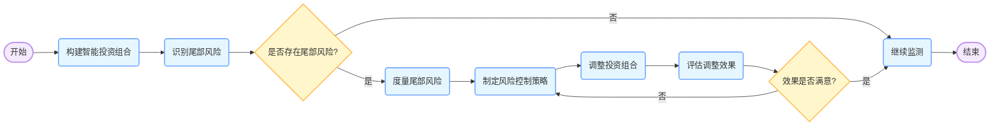

# 智能投资组合尾部风险管理

> 关键词：智能投资组合、尾部风险、风险管理、量化分析、金融科技

> 摘要：本文聚焦于智能投资组合的尾部风险管理。首先介绍了相关背景，包括目的、预期读者、文档结构等。接着阐述了核心概念，如尾部风险的原理和与投资组合的联系，并给出了示意图和流程图。详细讲解了核心算法原理和操作步骤，使用 Python 代码进行示例。同时介绍了相关数学模型和公式，并举例说明。通过项目实战展示了代码的实际应用和解读。探讨了实际应用场景，推荐了学习资源、开发工具框架和相关论文著作。最后总结了未来发展趋势与挑战，还设置了常见问题解答和扩展阅读部分，旨在为投资者和相关从业者提供全面的智能投资组合尾部风险管理知识。

## 1. 背景介绍 
### 1.1 目的和范围
在金融市场中，投资组合管理是实现资产增值和风险控制的重要手段。然而，传统的投资组合管理方法往往侧重于均值 - 方差分析，忽略了尾部风险的影响。尾部风险是指在极端市场条件下，投资组合可能遭受的巨大损失。智能投资组合尾部风险管理的目的在于运用先进的技术和方法，识别、度量和控制投资组合的尾部风险，从而提高投资组合的稳健性和抗风险能力。

本文的范围涵盖了智能投资组合尾部风险管理的基本概念、核心算法、数学模型、实际应用以及相关工具和资源。通过对这些内容的详细介绍，帮助读者全面了解和掌握智能投资组合尾部风险管理的理论和实践。

### 1.2 预期读者
本文的预期读者包括金融行业的从业者，如投资经理、风险分析师、量化交易员等；金融科技领域的开发者和研究人员；以及对智能投资和风险管理感兴趣的投资者和学者。

### 1.3 文档结构概述
本文将按照以下结构进行组织：
1. 背景介绍：介绍智能投资组合尾部风险管理的目的、范围、预期读者和文档结构。
2. 核心概念与联系：阐述尾部风险、投资组合等核心概念的原理和联系，并给出示意图和流程图。
3. 核心算法原理 & 具体操作步骤：介绍常用的尾部风险管理算法，如风险价值（VaR）、条件风险价值（CVaR）等，并使用 Python 代码进行详细阐述。
4. 数学模型和公式 & 详细讲解 & 举例说明：介绍相关的数学模型和公式，如正态分布、极值理论等，并通过具体例子进行说明。
5. 项目实战：代码实际案例和详细解释说明：通过一个实际的项目案例，展示如何使用 Python 实现智能投资组合尾部风险管理。
6. 实际应用场景：探讨智能投资组合尾部风险管理在金融市场中的实际应用场景。
7. 工具和资源推荐：推荐相关的学习资源、开发工具框架和论文著作。
8. 总结：未来发展趋势与挑战：总结智能投资组合尾部风险管理的未来发展趋势和面临的挑战。
9. 附录：常见问题与解答：解答读者在学习和实践过程中可能遇到的常见问题。
10. 扩展阅读 & 参考资料：提供相关的扩展阅读材料和参考资料。

### 1.4 术语表
#### 1.4.1 核心术语定义
- **智能投资组合**：利用人工智能、机器学习等技术构建的投资组合，旨在优化投资决策和提高投资绩效。
- **尾部风险**：指在极端市场条件下，投资组合可能遭受的巨大损失。尾部风险通常用风险价值（VaR）、条件风险价值（CVaR）等指标来度量。
- **风险管理**：指识别、度量和控制风险的过程。在投资组合管理中，风险管理的目标是在实现投资目标的同时，降低投资组合的风险。
- **风险价值（VaR）**：指在一定的置信水平下，投资组合在未来一段时间内可能遭受的最大损失。
- **条件风险价值（CVaR）**：指在一定的置信水平下，投资组合在未来一段时间内可能遭受的平均损失，当损失超过风险价值（VaR）时。

#### 1.4.2 相关概念解释
- **正态分布**：一种常见的概率分布，其特点是数据集中在均值附近，两侧呈对称分布。在金融市场中，许多资产的收益率被假设为服从正态分布。
- **极值理论**：一种用于研究极端事件发生概率的理论。在尾部风险管理中，极值理论可以用来估计极端市场条件下投资组合的损失。
- **蒙特卡罗模拟**：一种通过随机抽样来模拟复杂系统行为的方法。在投资组合管理中，蒙特卡罗模拟可以用来估计投资组合的风险和收益。

#### 1.4.3 缩略词列表
- **VaR**：风险价值（Value at Risk）
- **CVaR**：条件风险价值（Conditional Value at Risk）
- **AI**：人工智能（Artificial Intelligence）
- **ML**：机器学习（Machine Learning）

## 2. 核心概念与联系 

### 2.1 尾部风险的原理
尾部风险源于金融市场的不确定性和极端事件的发生。金融市场受到多种因素的影响，如宏观经济数据、政治事件、自然灾害等，这些因素的变化可能导致资产价格的大幅波动。在正常市场条件下，资产价格的波动通常符合一定的概率分布，如正态分布。然而，在极端市场条件下，资产价格的波动可能会偏离正态分布，出现极端值。这些极端值就构成了尾部风险。

从统计学的角度来看，尾部风险对应于概率分布的尾部区域。在正态分布中，大部分数据集中在均值附近，而尾部区域的数据出现的概率较小。但一旦极端事件发生，尾部区域的数据所代表的损失可能会非常巨大。例如，在 2008 年全球金融危机期间，许多金融资产的价格大幅下跌，远远超出了正常的波动范围，给投资者带来了巨大的损失。

### 2.2 投资组合与尾部风险的联系
投资组合是由多种资产组成的集合，其目的是通过分散投资来降低风险。然而，投资组合并不能完全消除尾部风险。当极端事件发生时，不同资产之间的相关性可能会发生变化，导致投资组合的损失超出预期。

例如，在市场崩溃时，原本被认为具有低相关性的资产可能会同时下跌，从而使投资组合的风险增加。因此，在构建投资组合时，需要考虑尾部风险的影响，选择合适的资产和权重，以降低投资组合的尾部风险。

### 2.3 核心概念的文本示意图
```plaintext
          智能投资组合
              |
              | 包含多种资产
              |
  ┌───────────┴───────────┐
  |                       |
  |     资产1             |     资产2
  |                       |
  └───────────┬───────────┘
              |
              | 面临尾部风险
              |
  ┌───────────┴───────────┐
  |                       |
  |     尾部风险度量      |     尾部风险控制
  |                       |
  └───────────────────────┘
```

### 2.4 Mermaid 流程图


## 3. 核心算法原理 & 具体操作步骤 

### 3.1 风险价值（VaR）算法原理
风险价值（VaR）是一种常用的尾部风险度量指标，它表示在一定的置信水平下，投资组合在未来一段时间内可能遭受的最大损失。其基本思想是通过对投资组合的历史收益率进行统计分析，估计出在给定置信水平下的最大损失。

假设投资组合的收益率服从正态分布，其均值为 $\mu$，标准差为 $\sigma$。在置信水平为 $1 - \alpha$ 下，VaR 的计算公式为：

$$VaR = z_{\alpha} \times \sigma \times \sqrt{T}$$

其中，$z_{\alpha}$ 是标准正态分布的分位数，对应于置信水平为 $\alpha$；$T$ 是时间周期。

### 3.2 VaR 算法的 Python 实现
```python
import numpy as np
from scipy.stats import norm

def calculate_var(returns, confidence_level=0.95, time_period=1):
    """
    计算投资组合的风险价值（VaR）
    :param returns: 投资组合的历史收益率
    :param confidence_level: 置信水平，默认为 0.95
    :param time_period: 时间周期，默认为 1
    :return: VaR 值
    """
    mean_return = np.mean(returns)
    std_return = np.std(returns)
    z_score = norm.ppf(1 - confidence_level)
    var = - (mean_return + z_score * std_return * np.sqrt(time_period))
    return var

# 示例数据
returns = np.random.normal(0, 0.01, 1000)
var = calculate_var(returns)
print(f"VaR 值为: {var:.4f}")
```

### 3.3 条件风险价值（CVaR）算法原理
条件风险价值（CVaR）也称为预期尾部损失（ES），它是在给定置信水平下，当损失超过 VaR 时的平均损失。CVaR 考虑了极端损失的情况，因此比 VaR 更能反映尾部风险。

CVaR 的计算公式为：

$$CVaR = E[R | R < -VaR]$$

其中，$R$ 是投资组合的收益率。

### 3.4 CVaR 算法的 Python 实现
```python
import numpy as np

def calculate_cvar(returns, confidence_level=0.95):
    """
    计算投资组合的条件风险价值（CVaR）
    :param returns: 投资组合的历史收益率
    :param confidence_level: 置信水平，默认为 0.95
    :return: CVaR 值
    """
    var = calculate_var(returns, confidence_level)
    tail_returns = returns[returns < -var]
    cvar = -np.mean(tail_returns)
    return cvar

# 示例数据
returns = np.random.normal(0, 0.01, 1000)
cvar = calculate_cvar(returns)
print(f"CVaR 值为: {cvar:.4f}")
```

### 3.5 具体操作步骤
1. **数据收集**：收集投资组合中各资产的历史收益率数据。
2. **数据预处理**：对收集到的数据进行清洗、缺失值处理等操作。
3. **计算收益率**：根据资产的价格数据计算投资组合的历史收益率。
4. **选择算法**：根据实际需求选择合适的尾部风险度量算法，如 VaR 或 CVaR。
5. **参数设置**：设置算法的参数，如置信水平、时间周期等。
6. **计算尾部风险**：使用选定的算法计算投资组合的尾部风险。
7. **风险评估**：根据计算结果评估投资组合的尾部风险水平，并制定相应的风险控制策略。

## 4. 数学模型和公式 & 详细讲解 & 举例说明 

### 4.1 正态分布模型
正态分布是一种常见的概率分布，其概率密度函数为：

$$f(x) = \frac{1}{\sigma \sqrt{2\pi}} e^{-\frac{(x - \mu)^2}{2\sigma^2}}$$

其中，$\mu$ 是均值，$\sigma$ 是标准差。

在金融市场中，许多资产的收益率被假设为服从正态分布。例如，假设某股票的收益率 $R$ 服从正态分布 $N(\mu, \sigma^2)$，则可以使用正态分布的性质来计算该股票在一定置信水平下的 VaR。

### 4.2 极值理论模型
极值理论是一种用于研究极端事件发生概率的理论。在尾部风险管理中，极值理论可以用来估计极端市场条件下投资组合的损失。

极值理论主要有两种方法：块最大值法（Block Maxima Method）和阈值超额法（Peak - over - Threshold Method）。

#### 4.2.1 块最大值法
块最大值法是将时间序列数据分成若干个块，然后取每个块中的最大值。这些最大值构成一个新的序列，假设该序列服从广义极值分布（Generalized Extreme Value Distribution，GEV）。

广义极值分布的概率密度函数为：

$$F(x) = \exp\left\{-\left[1 + \xi\left(\frac{x - \mu}{\sigma}\right)\right]^{-\frac{1}{\xi}}\right\}$$

其中，$\mu$ 是位置参数，$\sigma$ 是尺度参数，$\xi$ 是形状参数。

#### 4.2.2 阈值超额法
阈值超额法是选择一个阈值 $u$，然后考虑超过该阈值的所有数据。这些超过阈值的数据构成一个新的序列，假设该序列服从广义帕累托分布（Generalized Pareto Distribution，GPD）。

广义帕累托分布的概率密度函数为：

$$F(x) = 1 - \left(1 + \frac{\xi x}{\beta}\right)^{-\frac{1}{\xi}}$$

其中，$\beta$ 是尺度参数，$\xi$ 是形状参数。

### 4.3 举例说明
假设某投资组合的历史收益率数据如下：
```python
import numpy as np

returns = np.array([0.01, -0.02, 0.03, -0.05, 0.02, -0.01, 0.04, -0.03, 0.02, -0.04])
```

#### 4.3.1 使用正态分布计算 VaR
```python
from scipy.stats import norm

mean_return = np.mean(returns)
std_return = np.std(returns)
confidence_level = 0.95
z_score = norm.ppf(1 - confidence_level)
var = - (mean_return + z_score * std_return)
print(f"使用正态分布计算的 VaR 值为: {var:.4f}")
```

#### 4.3.2 使用极值理论计算 VaR
```python
from scipy.stats import genpareto

# 选择阈值
threshold = np.percentile(returns, 90)
exceedances = returns[returns > threshold] - threshold

# 拟合广义帕累托分布
params = genpareto.fit(exceedances)
shape, loc, scale = params

# 计算 VaR
alpha = 0.95
n = len(returns)
nu = len(exceedances)
var = threshold + (scale / shape) * (((n / nu) * (1 - alpha)) ** (-shape) - 1)
print(f"使用极值理论计算的 VaR 值为: {var:.4f}")
```

## 5. 项目实战：代码实际案例和详细解释说明 

### 5.1  开发环境搭建
#### 5.1.1 安装 Python
首先，需要安装 Python 环境。可以从 Python 官方网站（https://www.python.org/downloads/）下载适合自己操作系统的 Python 版本，并按照安装向导进行安装。

#### 5.1.2 安装必要的库
在项目中，需要使用一些 Python 库，如 `numpy`、`pandas`、`scipy` 等。可以使用以下命令进行安装：
```sh
pip install numpy pandas scipy
```

### 5.2  源代码详细实现和代码解读
#### 5.2.1 数据收集和预处理
```python
import pandas as pd
import numpy as np

# 读取数据
data = pd.read_csv('portfolio_returns.csv')

# 计算投资组合的收益率
returns = data['Portfolio_Returns']

# 数据预处理
returns = returns.dropna()
```
代码解读：
- 首先使用 `pandas` 库的 `read_csv` 函数读取投资组合的收益率数据。
- 然后计算投资组合的收益率，并使用 `dropna` 函数去除缺失值。

#### 5.2.2 计算 VaR 和 CVaR
```python
from scipy.stats import norm

def calculate_var(returns, confidence_level=0.95, time_period=1):
    mean_return = np.mean(returns)
    std_return = np.std(returns)
    z_score = norm.ppf(1 - confidence_level)
    var = - (mean_return + z_score * std_return * np.sqrt(time_period))
    return var

def calculate_cvar(returns, confidence_level=0.95):
    var = calculate_var(returns, confidence_level)
    tail_returns = returns[returns < -var]
    cvar = -np.mean(tail_returns)
    return cvar

# 计算 VaR 和 CVaR
var = calculate_var(returns)
cvar = calculate_cvar(returns)

print(f"VaR 值为: {var:.4f}")
print(f"CVaR 值为: {cvar:.4f}")
```
代码解读：
- 定义了 `calculate_var` 函数和 `calculate_cvar` 函数分别用于计算 VaR 和 CVaR。
- 在 `calculate_var` 函数中，使用正态分布的分位数计算 VaR。
- 在 `calculate_cvar` 函数中，先调用 `calculate_var` 函数计算 VaR，然后找出收益率小于 -VaR 的数据，计算这些数据的平均值得到 CVaR。

#### 5.2.3 风险评估和策略制定
```python
# 风险评估
if var > 0.05:
    print("投资组合的尾部风险较高，需要调整投资组合。")
else:
    print("投资组合的尾部风险较低，可以继续持有。")

# 策略制定（示例）
if var > 0.05:
    # 减少高风险资产的权重
    # 这里只是示例，实际操作需要根据具体情况进行调整
    print("减少高风险资产的权重。")
```
代码解读：
- 根据计算得到的 VaR 值进行风险评估，如果 VaR 大于 0.05，则认为投资组合的尾部风险较高，需要调整投资组合。
- 在策略制定部分，给出了一个简单的示例，即减少高风险资产的权重。

### 5.3  代码解读与分析
通过上述代码，我们完成了一个简单的智能投资组合尾部风险管理项目。首先，我们收集和预处理了投资组合的收益率数据。然后，使用正态分布计算了投资组合的 VaR 和 CVaR。最后，根据计算结果进行了风险评估和策略制定。

需要注意的是，上述代码只是一个简单的示例，实际应用中可能需要考虑更多的因素，如资产之间的相关性、市场的动态变化等。同时，也可以使用更复杂的算法和模型来提高尾部风险度量的准确性。

## 6. 实际应用场景 
### 6.1 投资组合优化
在构建投资组合时，考虑尾部风险可以帮助投资者选择更合适的资产和权重，从而降低投资组合的整体风险。例如，通过计算不同资产组合的 VaR 和 CVaR，选择具有较低尾部风险的组合进行投资。

### 6.2 风险预警
实时监测投资组合的尾部风险指标，如 VaR 和 CVaR，当这些指标超过预设的阈值时，及时发出风险预警。这样可以帮助投资者及时采取措施，避免或减少损失。

### 6.3 金融机构风险管理
金融机构，如银行、保险公司等，需要对其投资组合进行有效的风险管理。智能投资组合尾部风险管理可以帮助金融机构识别和度量潜在的风险，制定合理的风险控制策略，确保金融机构的稳健运营。

### 6.4 监管合规
金融监管机构通常要求金融机构对其投资组合的风险进行评估和披露。智能投资组合尾部风险管理可以为金融机构提供准确的风险度量指标，帮助其满足监管要求。

## 7. 工具和资源推荐
### 7.1 学习资源推荐
#### 7.1.1 书籍推荐
- 《风险管理与金融机构》（Risk Management and Financial Institutions）：作者是 John C. Hull，这本书系统地介绍了风险管理的基本概念、方法和技术，包括尾部风险管理。
- 《金融时间序列分析》（Analysis of Financial Time Series）：作者是 Ruey S. Tsay，这本书介绍了金融时间序列的建模和分析方法，对于理解金融市场的波动和尾部风险有很大帮助。
- 《智能投资：如何构建量化投资组合》（Smart Investing: How to Build a Quantitative Investment Portfolio）：这本书介绍了智能投资的基本概念和方法，包括如何使用人工智能和机器学习技术进行投资组合管理和尾部风险管理。

#### 7.1.2 在线课程
- Coursera 上的“金融风险管理”（Financial Risk Management）课程：该课程由纽约大学斯特恩商学院的教授授课，系统地介绍了金融风险管理的理论和实践。
- edX 上的“量化投资与风险管理”（Quantitative Investing and Risk Management）课程：该课程介绍了量化投资的基本概念和方法，以及如何使用 Python 进行投资组合管理和尾部风险管理。

#### 7.1.3 技术博客和网站
- 量化投资与机器学习社区（https://www.quantinfo.com/）：该网站提供了量化投资和机器学习的相关文章、教程和案例，对于学习智能投资组合尾部风险管理有很大帮助。
- 金融界量化频道（https://q.stock.sohu.com/）：该频道提供了金融量化分析的相关资讯和研究报告，有助于了解金融市场的最新动态和量化投资的发展趋势。

### 7.2 开发工具框架推荐
#### 7.2.1 IDE和编辑器
- PyCharm：一款专业的 Python 集成开发环境，具有代码编辑、调试、版本控制等功能，适合开发大型的 Python 项目。
- Jupyter Notebook：一种交互式的开发环境，支持 Python、R 等多种编程语言，适合进行数据探索和模型实验。

#### 7.2.2 调试和性能分析工具
- PDB：Python 自带的调试工具，可以帮助开发者定位和解决代码中的问题。
- cProfile：Python 自带的性能分析工具，可以帮助开发者找出代码中的性能瓶颈。

#### 7.2.3 相关框架和库
- NumPy：一个用于科学计算的 Python 库，提供了高效的数组操作和数学函数。
- Pandas：一个用于数据处理和分析的 Python 库，提供了灵活的数据结构和数据操作方法。
- Scikit - learn：一个用于机器学习的 Python 库，提供了丰富的机器学习算法和工具。

### 7.3 相关论文著作推荐
#### 7.3.1 经典论文
- “Value at Risk: The New Benchmark for Managing Financial Risk”：作者是 Philippe Jorion，这篇论文系统地介绍了风险价值（VaR）的概念和计算方法，是风险管理领域的经典之作。
- “Conditional Value - at - Risk for General Loss Distributions”：作者是 Rockafellar 和 Uryasev，这篇论文提出了条件风险价值（CVaR）的概念和计算方法，为尾部风险管理提供了新的思路。

#### 7.3.2 最新研究成果
- “Machine Learning for Portfolio Optimization”：这篇论文探讨了如何使用机器学习技术进行投资组合优化，包括如何考虑尾部风险。
- “Extreme Value Theory and Risk Management”：这篇论文介绍了极值理论在风险管理中的应用，包括如何使用极值理论估计尾部风险。

#### 7.3.3 应用案例分析
- “Tail Risk Management in Hedge Funds”：这篇论文分析了对冲基金的尾部风险管理策略和实践，为投资者和从业者提供了参考。
- “Risk Management in Pension Funds: A Case Study”：这篇论文以养老金基金为例，介绍了如何进行投资组合的风险管理，包括尾部风险管理。

## 8. 总结：未来发展趋势与挑战
### 8.1 未来发展趋势
#### 8.1.1 人工智能和机器学习的应用
随着人工智能和机器学习技术的不断发展，它们将在智能投资组合尾部风险管理中发挥越来越重要的作用。例如，使用深度学习算法可以更好地捕捉金融市场的复杂模式和非线性关系，提高尾部风险度量的准确性。

#### 8.1.2 多源数据的融合
除了传统的金融数据，如资产价格、收益率等，未来还将融合更多的多源数据，如新闻资讯、社交媒体数据等。这些数据可以提供更多的市场信息和情绪指标，帮助投资者更好地理解市场动态和尾部风险。

#### 8.1.3 实时风险管理
随着金融市场的快速变化，实时风险管理将变得越来越重要。未来的智能投资组合尾部风险管理系统将具备实时监测和预警功能，能够及时发现和应对潜在的风险。

### 8.2 面临的挑战
#### 8.2.1 数据质量和可用性
人工智能和机器学习算法需要大量的高质量数据来进行训练和优化。然而，金融数据往往存在噪声、缺失值等问题，数据的质量和可用性会影响尾部风险度量的准确性。

#### 8.2.2 模型的可解释性
一些复杂的人工智能和机器学习模型，如深度学习模型，往往具有较高的预测性能，但缺乏可解释性。在风险管理领域，模型的可解释性非常重要，因为投资者和监管机构需要理解模型的决策过程和依据。

#### 8.2.3 市场的不确定性
金融市场具有高度的不确定性，极端事件的发生往往难以预测。因此，如何准确地估计尾部风险，以及如何在不确定性环境下制定有效的风险管理策略，仍然是一个挑战。

## 9. 附录：常见问题与解答
### 9.1 什么是尾部风险？
尾部风险是指在极端市场条件下，投资组合可能遭受的巨大损失。尾部风险通常用风险价值（VaR）、条件风险价值（CVaR）等指标来度量。

### 9.2 为什么要进行尾部风险管理？
传统的投资组合管理方法往往侧重于均值 - 方差分析，忽略了尾部风险的影响。然而，在极端市场条件下，尾部风险可能会给投资者带来巨大的损失。因此，进行尾部风险管理可以帮助投资者识别、度量和控制潜在的风险，提高投资组合的稳健性和抗风险能力。

### 9.3 VaR 和 CVaR 有什么区别？
风险价值（VaR）表示在一定的置信水平下，投资组合在未来一段时间内可能遭受的最大损失。而条件风险价值（CVaR）表示在给定置信水平下，当损失超过 VaR 时的平均损失。CVaR 考虑了极端损失的情况，因此比 VaR 更能反映尾部风险。

### 9.4 如何选择合适的尾部风险度量方法？
选择合适的尾部风险度量方法需要考虑多个因素，如数据的分布特征、投资组合的特点、风险偏好等。一般来说，如果数据近似服从正态分布，可以使用 VaR 方法；如果数据存在厚尾现象，建议使用 CVaR 方法或极值理论方法。

### 9.5 智能投资组合尾部风险管理在实际应用中存在哪些局限性？
智能投资组合尾部风险管理在实际应用中存在一些局限性，如数据质量和可用性问题、模型的可解释性问题、市场的不确定性问题等。此外，尾部风险度量方法本身也存在一定的局限性，如 VaR 方法不能反映极端损失的程度，极值理论方法对数据的要求较高等。

## 10. 扩展阅读 & 参考资料
### 10.1 扩展阅读
- 《行为金融学》：了解投资者的心理和行为对金融市场的影响，有助于更好地理解尾部风险的产生机制。
- 《金融工程学》：学习金融衍生品的定价和风险管理方法，为智能投资组合尾部风险管理提供更多的工具和思路。

### 10.2 参考资料
- John C. Hull. “Options, Futures, and Other Derivatives”. Pearson, 2018.
- Ruey S. Tsay. “Analysis of Financial Time Series”. Wiley, 2014.
- Philippe Jorion. “Value at Risk: The New Benchmark for Managing Financial Risk”. McGraw - Hill, 2006.

作者：AI天才研究院/AI Genius Institute & 禅与计算机程序设计艺术 /Zen And The Art of Computer Programming