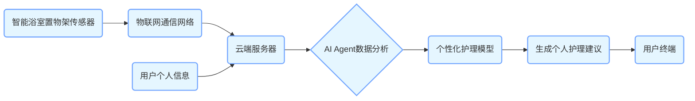

# 智能浴室置物架：AI Agent的个人护理建议

> 关键词：智能浴室置物架、AI Agent、个人护理建议、物联网、机器学习

> 摘要：本文围绕智能浴室置物架与AI Agent提供个人护理建议展开。首先介绍了智能浴室置物架和AI Agent的背景知识，阐述了它们的核心概念及联系。详细讲解了实现AI Agent提供个人护理建议所涉及的核心算法原理、数学模型和公式。通过项目实战，展示了如何搭建开发环境、实现源代码并进行代码解读。探讨了该技术在实际生活中的应用场景，推荐了相关的学习资源、开发工具框架以及论文著作。最后总结了其未来发展趋势与挑战，并给出常见问题解答和扩展阅读参考资料，旨在全面深入地介绍这一前沿技术，为相关领域的研究和应用提供参考。

## 1. 背景介绍 
### 1.1 目的和范围
随着智能家居的快速发展，人们对生活品质的追求不断提高，浴室作为日常生活中重要的空间，其智能化需求也日益增长。智能浴室置物架结合AI Agent提供个人护理建议的技术应运而生，旨在为用户提供更加个性化、智能化的浴室使用体验。本文的范围涵盖了智能浴室置物架和AI Agent的核心概念、算法原理、数学模型、项目实战、应用场景等方面，旨在深入探讨这一技术的实现原理和应用价值。

### 1.2 预期读者
本文预期读者包括智能家居领域的开发者、研究人员，对人工智能和物联网技术感兴趣的爱好者，以及关注个人护理智能化发展的消费者。通过阅读本文，读者可以了解智能浴室置物架和AI Agent的相关技术，为进一步的研究、开发或应用提供参考。

### 1.3 文档结构概述
本文将按照以下结构进行阐述：首先介绍智能浴室置物架和AI Agent的背景知识，包括目的、预期读者和文档结构概述；接着详细讲解核心概念与联系，包括原理和架构的文本示意图以及Mermaid流程图；然后阐述核心算法原理和具体操作步骤，并使用Python源代码进行详细说明；之后介绍数学模型和公式，并通过举例进行详细讲解；通过项目实战展示代码的实际案例和详细解释；探讨该技术在实际生活中的应用场景；推荐相关的学习资源、开发工具框架和论文著作；最后总结未来发展趋势与挑战，给出常见问题解答和扩展阅读参考资料。

### 1.4 术语表
#### 1.4.1 核心术语定义
- **智能浴室置物架**：一种具备智能化功能的浴室置物架，通常集成了传感器、通信模块等设备，能够与其他智能设备进行交互，并收集相关数据。
- **AI Agent**：人工智能代理，是一种能够感知环境、做出决策并采取行动的智能实体。在本文中，AI Agent通过分析智能浴室置物架收集的数据，为用户提供个人护理建议。
- **物联网（IoT）**：通过各种信息传感器、射频识别技术、全球定位系统、红外感应器、激光扫描器等各种装置与技术，实时采集任何需要监控、连接、互动的物体或过程，采集其声、光、热、电、力学、化学、生物、位置等各种需要的信息，通过各类可能的网络接入，实现物与物、物与人的泛在连接，实现对物品和过程的智能化感知、识别和管理。
- **机器学习**：一门多领域交叉学科，涉及概率论、统计学、逼近论、凸分析、算法复杂度理论等多门学科。它专门研究计算机怎样模拟或实现人类的学习行为，以获取新的知识或技能，重新组织已有的知识结构使之不断改善自身的性能。

#### 1.4.2 相关概念解释
- **传感器数据**：智能浴室置物架上的传感器收集到的各种数据，如物品的重量、使用频率、环境湿度等。
- **个性化护理建议**：根据用户的个人信息、使用习惯和传感器数据，AI Agent为用户量身定制的护理建议，如推荐适合的护肤品、提醒更换牙刷等。
- **数据挖掘**：从大量的数据中通过算法搜索隐藏于其中信息的过程，旨在从数据中发现模式、趋势和关联。

#### 1.4.3 缩略词列表
- **IoT**：Internet of Things（物联网）
- **AI**：Artificial Intelligence（人工智能）
- **ML**：Machine Learning（机器学习）

## 2. 核心概念与联系 

### 核心概念原理
智能浴室置物架通过集成各种传感器，如重量传感器、红外传感器等，实时收集放置在其上的物品信息，包括物品的重量、使用频率、剩余量等。这些传感器数据通过物联网技术传输到云端服务器，AI Agent在云端服务器上运行，对这些数据进行分析和处理。

AI Agent利用机器学习算法，结合用户的个人信息（如年龄、性别、肤质等）和历史使用数据，建立个性化的护理模型。通过对当前传感器数据的实时分析，AI Agent能够判断用户的护理需求，并给出相应的个人护理建议。例如，如果AI Agent检测到用户的洗发水使用频率较高，且根据用户的发质信息判断其头发较为干燥，它可能会推荐用户更换具有滋润功效的洗发水。

### 架构的文本示意图
智能浴室置物架与AI Agent的架构主要包括以下几个部分：
1. **智能浴室置物架终端**：由各种传感器和通信模块组成，负责收集物品信息并将数据发送到云端服务器。
2. **物联网通信网络**：如Wi-Fi、蓝牙等，用于实现智能浴室置物架终端与云端服务器之间的数据传输。
3. **云端服务器**：存储传感器数据和用户信息，运行AI Agent程序，对数据进行分析和处理。
4. **用户终端**：如手机APP、智能音箱等，用户可以通过这些终端接收AI Agent提供的个人护理建议。

### Mermaid流程图


该流程图展示了智能浴室置物架与AI Agent之间的数据流动和处理过程。首先，智能浴室置物架的传感器收集数据，通过物联网通信网络传输到云端服务器。同时，用户的个人信息也存储在云端服务器中。AI Agent对这些数据进行分析，利用个性化护理模型生成个人护理建议，并将建议发送到用户终端。

## 3. 核心算法原理 & 具体操作步骤 

### 核心算法原理
实现AI Agent提供个人护理建议的核心算法主要涉及机器学习中的分类和回归算法。以下是详细的算法原理说明：

#### 数据预处理
在进行机器学习分析之前，需要对传感器收集到的数据进行预处理。这包括数据清洗、特征提取和数据标准化等步骤。

数据清洗是去除数据中的噪声和异常值，确保数据的准确性和可靠性。特征提取是从原始数据中提取出对模型训练有帮助的特征，例如物品的使用频率、剩余量等。数据标准化是将数据转换为统一的尺度，以便于不同特征之间的比较和计算。

#### 分类算法
分类算法用于将用户的护理需求分为不同的类别，例如干性皮肤、油性皮肤等。常用的分类算法包括决策树、支持向量机（SVM）和神经网络等。

以决策树算法为例，决策树是一种基于树结构进行决策的算法。它通过对数据的特征进行递归划分，构建一个决策树模型。在预测时，根据输入数据的特征值，从根节点开始，沿着决策树的路径进行判断，最终得到分类结果。

#### 回归算法
回归算法用于预测连续的数值，例如物品的剩余使用天数。常用的回归算法包括线性回归、岭回归和随机森林回归等。

以线性回归算法为例，线性回归是一种通过拟合一条直线来预测数值的算法。它的基本思想是找到一条直线，使得所有数据点到该直线的距离之和最小。在预测时，根据输入数据的特征值，代入线性回归模型的方程中，得到预测结果。

### 具体操作步骤

#### 步骤1：数据收集
智能浴室置物架的传感器实时收集物品的重量、使用频率等数据，并将这些数据通过物联网通信网络发送到云端服务器。

#### 步骤2：数据预处理
在云端服务器上，对收集到的数据进行预处理。以下是使用Python进行数据预处理的示例代码：
```python
import pandas as pd
from sklearn.preprocessing import StandardScaler

# 读取数据
data = pd.read_csv('sensor_data.csv')

# 数据清洗：去除缺失值
data = data.dropna()

# 特征提取：选择需要的特征
features = data[['weight', 'usage_frequency']]

# 数据标准化
scaler = StandardScaler()
scaled_features = scaler.fit_transform(features)
```

#### 步骤3：模型训练
使用预处理后的数据对分类和回归模型进行训练。以下是使用Python进行决策树分类和线性回归模型训练的示例代码：
```python
from sklearn.model_selection import train_test_split
from sklearn.tree import DecisionTreeClassifier
from sklearn.linear_model import LinearRegression

# 划分训练集和测试集
X_train, X_test, y_train, y_test = train_test_split(scaled_features, data['skin_type'], test_size=0.2, random_state=42)

# 决策树分类模型训练
classifier = DecisionTreeClassifier()
classifier.fit(X_train, y_train)

# 划分训练集和测试集用于回归模型
X_train_reg, X_test_reg, y_train_reg, y_test_reg = train_test_split(scaled_features, data['remaining_days'], test_size=0.2, random_state=42)

# 线性回归模型训练
regressor = LinearRegression()
regressor.fit(X_train_reg, y_train_reg)
```

#### 步骤4：模型评估
使用测试集对训练好的模型进行评估，计算模型的准确率、召回率、均方误差等指标，评估模型的性能。以下是使用Python进行模型评估的示例代码：
```python
from sklearn.metrics import accuracy_score, mean_squared_error

# 决策树分类模型评估
y_pred = classifier.predict(X_test)
accuracy = accuracy_score(y_test, y_pred)
print(f"决策树分类模型准确率: {accuracy}")

# 线性回归模型评估
y_pred_reg = regressor.predict(X_test_reg)
mse = mean_squared_error(y_test_reg, y_pred_reg)
print(f"线性回归模型均方误差: {mse}")
```

#### 步骤5：生成个人护理建议
根据训练好的模型，对实时收集到的数据进行预测，生成个人护理建议。以下是使用Python生成个人护理建议的示例代码：
```python
# 假设新的传感器数据
new_data = [[100, 5]]  # 重量为100，使用频率为5
new_data_scaled = scaler.transform(new_data)

# 预测皮肤类型
predicted_skin_type = classifier.predict(new_data_scaled)
print(f"预测的皮肤类型: {predicted_skin_type}")

# 预测剩余使用天数
predicted_remaining_days = regressor.predict(new_data_scaled)
print(f"预测的剩余使用天数: {predicted_remaining_days}")

# 根据预测结果生成个人护理建议
if predicted_skin_type[0] == 'dry':
    print("您的皮肤比较干燥，建议使用滋润型的护肤品。")
else:
    print("您的皮肤状态良好，请继续保持。")
```

## 4. 数学模型和公式 & 详细讲解 & 举例说明 

### 线性回归数学模型和公式
线性回归是一种用于预测连续数值的机器学习算法。它的基本数学模型可以表示为：

$$y = \beta_0 + \beta_1x_1 + \beta_2x_2 + \cdots + \beta_nx_n + \epsilon$$

其中，$y$ 是预测的目标变量，$x_1, x_2, \cdots, x_n$ 是输入的特征变量，$\beta_0, \beta_1, \cdots, \beta_n$ 是模型的参数，$\epsilon$ 是误差项。

线性回归的目标是找到一组最优的参数 $\beta_0, \beta_1, \cdots, \beta_n$，使得预测值 $\hat{y}$ 与真实值 $y$ 之间的误差最小。通常使用最小二乘法来求解最优参数，即最小化误差平方和：

$$J(\beta) = \sum_{i=1}^{m}(y_i - \hat{y}_i)^2 = \sum_{i=1}^{m}(y_i - (\beta_0 + \beta_1x_{i1} + \beta_2x_{i2} + \cdots + \beta_nx_{in}))^2$$

其中，$m$ 是样本数量，$y_i$ 是第 $i$ 个样本的真实值，$\hat{y}_i$ 是第 $i$ 个样本的预测值。

### 详细讲解
线性回归的基本思想是通过拟合一条直线（在二维空间中）或超平面（在多维空间中）来尽可能地逼近数据点。参数 $\beta_0$ 是截距，表示当所有特征变量都为 0 时的预测值；参数 $\beta_1, \beta_2, \cdots, \beta_n$ 是斜率，表示每个特征变量对目标变量的影响程度。

最小二乘法的原理是通过对误差平方和 $J(\beta)$ 求偏导数，并令偏导数等于 0，得到一组方程组，解这个方程组就可以得到最优的参数 $\beta_0, \beta_1, \cdots, \beta_n$。

### 举例说明
假设我们有一组关于物品使用频率和剩余量的数据，我们想要通过线性回归模型预测物品的剩余使用天数。以下是具体的数据示例：

| 使用频率 ($x$) | 剩余量 ($y$) | 剩余使用天数 ($z$) |
| --- | --- | --- |
| 2 | 100 | 50 |
| 3 | 80 | 27 |
| 4 | 60 | 15 |
| 5 | 40 | 8 |

我们可以将使用频率和剩余量作为特征变量，剩余使用天数作为目标变量，建立线性回归模型：

$$z = \beta_0 + \beta_1x + \beta_2y + \epsilon$$

使用最小二乘法求解最优参数 $\beta_0, \beta_1, \beta_2$，得到线性回归模型的方程。然后，我们可以使用这个方程对新的使用频率和剩余量数据进行预测，得到物品的剩余使用天数。

以下是使用Python实现上述线性回归模型的代码：
```python
import numpy as np
from sklearn.linear_model import LinearRegression

# 输入特征数据
X = np.array([[2, 100], [3, 80], [4, 60], [5, 40]])
# 目标变量数据
y = np.array([50, 27, 15, 8])

# 创建线性回归模型
model = LinearRegression()
# 训练模型
model.fit(X, y)

# 新的输入数据
new_X = np.array([[3, 70]])
# 预测剩余使用天数
predicted_days = model.predict(new_X)
print(f"预测的剩余使用天数: {predicted_days}")
```

### 决策树分类数学模型和公式
决策树是一种基于树结构进行决策的机器学习算法。它的基本思想是通过对数据的特征进行递归划分，构建一个决策树模型。决策树的每个内部节点是一个特征上的测试，每个分支是测试输出，每个叶节点是一个类别或值。

决策树的构建过程通常使用信息增益、基尼不纯度等指标来选择最优的划分特征。以信息增益为例，信息增益是指在划分数据集前后信息熵的减少量。信息熵是用来衡量数据的不确定性的指标，其计算公式为：

$$H(D) = -\sum_{i=1}^{k}p_i\log_2p_i$$

其中，$D$ 是数据集，$k$ 是数据集中类别的数量，$p_i$ 是第 $i$ 个类别的概率。

信息增益的计算公式为：

$$IG(D, A) = H(D) - \sum_{v\in V(A)}\frac{|D^v|}{|D|}H(D^v)$$

其中，$A$ 是划分特征，$V(A)$ 是特征 $A$ 的取值集合，$D^v$ 是特征 $A$ 取值为 $v$ 时的子集。

### 详细讲解
决策树的构建过程是一个递归的过程。首先，选择一个最优的划分特征，将数据集划分为多个子集。然后，对每个子集重复上述过程，直到满足停止条件（如子集的样本数量小于某个阈值、所有样本属于同一类别等）。

信息增益的作用是衡量划分特征对数据集的分类能力。信息增益越大，说明划分特征对数据集的分类能力越强，因此应该选择信息增益最大的特征作为当前的划分特征。

### 举例说明
假设我们有一个关于用户肤质分类的数据集，包含以下特征：年龄、性别、皮肤油脂分泌量。数据集如下：

| 年龄 | 性别 | 皮肤油脂分泌量 | 肤质 |
| --- | --- | --- | --- |
| 20 | 男 | 高 | 油性 |
| 25 | 女 | 中 | 中性 |
| 30 | 男 | 低 | 干性 |
| 35 | 女 | 高 | 油性 |

我们可以使用决策树算法对这个数据集进行分类。首先，计算每个特征的信息增益，选择信息增益最大的特征作为根节点的划分特征。假设选择皮肤油脂分泌量作为根节点的划分特征，将数据集划分为三个子集：高油脂分泌量子集、中油脂分泌量子集和低油脂分泌量子集。然后，对每个子集重复上述过程，直到所有样本属于同一类别或满足停止条件。

以下是使用Python实现上述决策树分类的代码：
```python
from sklearn.tree import DecisionTreeClassifier
from sklearn.preprocessing import LabelEncoder
import pandas as pd

# 数据集
data = {
    'age': [20, 25, 30, 35],
    'gender': ['男', '女', '男', '女'],
    'oil_secretion': ['高', '中', '低', '高'],
    'skin_type': ['油性', '中性', '干性', '油性']
}
df = pd.DataFrame(data)

# 数据预处理：将字符串特征编码为数值
le_gender = LabelEncoder()
le_oil_secretion = LabelEncoder()
le_skin_type = LabelEncoder()

df['gender'] = le_gender.fit_transform(df['gender'])
df['oil_secretion'] = le_oil_secretion.fit_transform(df['oil_secretion'])
df['skin_type'] = le_skin_type.fit_transform(df['skin_type'])

# 划分特征和目标变量
X = df[['age', 'gender', 'oil_secretion']]
y = df['skin_type']

# 创建决策树分类模型
model = DecisionTreeClassifier()
# 训练模型
model.fit(X, y)

# 新的输入数据
new_X = pd.DataFrame({
    'age': [22],
    'gender': le_gender.transform(['男']),
    'oil_secretion': le_oil_secretion.transform(['高'])
})
# 预测肤质
predicted_skin_type = model.predict(new_X)
print(f"预测的肤质: {le_skin_type.inverse_transform(predicted_skin_type)}")
```

## 5. 项目实战：代码实际案例和详细解释说明 

### 5.1  开发环境搭建
要实现智能浴室置物架与AI Agent提供个人护理建议的项目，需要搭建以下开发环境：

#### 硬件环境
- **智能浴室置物架**：选择具备传感器（如重量传感器、红外传感器等）和通信模块（如Wi-Fi、蓝牙）的智能浴室置物架。
- **开发板**：如树莓派、Arduino等，用于连接传感器和处理数据。
- **服务器**：可以选择云服务器（如阿里云、腾讯云等）或本地服务器，用于存储数据和运行AI Agent程序。

#### 软件环境
- **操作系统**：在开发板上安装适合的操作系统，如Raspbian（树莓派）、Arduino IDE（Arduino）；在服务器上安装Linux操作系统（如Ubuntu）。
- **编程语言**：使用Python进行算法开发和数据处理，因为Python拥有丰富的机器学习库和工具。
- **机器学习库**：安装Scikit-learn、TensorFlow等机器学习库，用于实现分类和回归算法。
- **数据库**：选择适合的数据库，如MySQL、MongoDB等，用于存储传感器数据和用户信息。

### 5.2  源代码详细实现和代码解读

#### 传感器数据采集代码
以下是使用Python和树莓派采集重量传感器数据的示例代码：
```python
import RPi.GPIO as GPIO
import time

# 设置GPIO模式
GPIO.setmode(GPIO.BCM)

# 定义重量传感器引脚
WEIGHT_SENSOR_PIN = 17

# 设置引脚为输入模式
GPIO.setup(WEIGHT_SENSOR_PIN, GPIO.IN)

try:
    while True:
        # 读取传感器数据
        weight = GPIO.input(WEIGHT_SENSOR_PIN)
        print(f"当前重量: {weight}")
        time.sleep(1)
except KeyboardInterrupt:
    print("程序终止")
finally:
    # 清理GPIO设置
    GPIO.cleanup()
```
代码解读：
- 首先，导入RPi.GPIO库用于控制树莓派的GPIO引脚，导入time库用于实现延时功能。
- 设置GPIO模式为BCM模式，定义重量传感器的引脚为17。
- 将引脚设置为输入模式，以便读取传感器数据。
- 使用一个无限循环不断读取传感器数据，并将数据打印输出。
- 当用户按下Ctrl+C时，程序终止，并清理GPIO设置。

#### 数据上传到服务器代码
以下是使用Python将传感器数据上传到服务器的示例代码：
```python
import requests
import time

# 服务器地址
SERVER_URL = "http://your_server_ip/api/upload_data"

# 模拟传感器数据
def get_sensor_data():
    # 这里可以替换为实际的传感器数据采集代码
    return {
        "weight": 100,
        "usage_frequency": 5
    }

try:
    while True:
        # 获取传感器数据
        data = get_sensor_data()
        # 发送POST请求将数据上传到服务器
        response = requests.post(SERVER_URL, json=data)
        if response.status_code == 200:
            print("数据上传成功")
        else:
            print(f"数据上传失败，状态码: {response.status_code}")
        time.sleep(60)  # 每隔60秒上传一次数据
except KeyboardInterrupt:
    print("程序终止")
```
代码解读：
- 导入requests库用于发送HTTP请求，导入time库用于实现延时功能。
- 定义服务器的地址，用于接收传感器数据。
- 定义一个函数get_sensor_data()用于模拟传感器数据的采集，实际应用中可以替换为真实的传感器数据采集代码。
- 使用一个无限循环不断获取传感器数据，并使用requests.post()方法将数据以JSON格式发送到服务器。
- 根据服务器的响应状态码判断数据上传是否成功，并打印相应的信息。
- 每隔60秒上传一次数据，当用户按下Ctrl+C时，程序终止。

#### 服务器端AI Agent代码
以下是服务器端使用Python和Scikit-learn实现AI Agent的示例代码：
```python
from flask import Flask, request, jsonify
from sklearn.tree import DecisionTreeClassifier
from sklearn.linear_model import LinearRegression
import pandas as pd
from sklearn.preprocessing import StandardScaler

app = Flask(__name__)

# 加载数据集
data = pd.read_csv('sensor_data.csv')

# 数据预处理
data = data.dropna()
features = data[['weight', 'usage_frequency']]
scaler = StandardScaler()
scaled_features = scaler.fit_transform(features)

# 划分训练集和测试集
X_train, X_test, y_train, y_test = train_test_split(scaled_features, data['skin_type'], test_size=0.2, random_state=42)
X_train_reg, X_test_reg, y_train_reg, y_test_reg = train_test_split(scaled_features, data['remaining_days'], test_size=0.2, random_state=42)

# 训练分类模型
classifier = DecisionTreeClassifier()
classifier.fit(X_train, y_train)

# 训练回归模型
regressor = LinearRegression()
regressor.fit(X_train_reg, y_train_reg)

@app.route('/api/upload_data', methods=['POST'])
def upload_data():
    # 获取客户端发送的传感器数据
    data = request.get_json()
    weight = data['weight']
    usage_frequency = data['usage_frequency']

    # 数据预处理
    new_data = [[weight, usage_frequency]]
    new_data_scaled = scaler.transform(new_data)

    # 预测皮肤类型
    predicted_skin_type = classifier.predict(new_data_scaled)

    # 预测剩余使用天数
    predicted_remaining_days = regressor.predict(new_data_scaled)

    # 生成个人护理建议
    if predicted_skin_type[0] == 'dry':
        advice = "您的皮肤比较干燥，建议使用滋润型的护肤品。"
    else:
        advice = "您的皮肤状态良好，请继续保持。"

    response = {
        "predicted_skin_type": predicted_skin_type[0],
        "predicted_remaining_days": predicted_remaining_days[0],
        "advice": advice
    }

    return jsonify(response)

if __name__ == '__main__':
    app.run(debug=True)
```
代码解读：
- 导入Flask库用于创建Web服务器，导入Scikit-learn库中的决策树分类器和线性回归模型，导入pandas库用于数据处理，导入StandardScaler类用于数据标准化。
- 加载数据集并进行数据预处理，包括去除缺失值、特征提取和数据标准化。
- 划分训练集和测试集，分别训练分类模型和回归模型。
- 创建一个Flask应用，并定义一个API接口`/api/upload_data`用于接收客户端发送的传感器数据。
- 在API接口中，对客户端发送的数据进行预处理，使用训练好的模型进行预测，生成个人护理建议，并将预测结果和建议以JSON格式返回给客户端。
- 最后，启动Flask应用，开启调试模式。

### 5.3  代码解读与分析
#### 传感器数据采集代码分析
传感器数据采集代码的主要功能是读取重量传感器的数据，并将数据打印输出。代码通过RPi.GPIO库控制树莓派的GPIO引脚，实现了对传感器数据的实时采集。在实际应用中，可以根据需要添加更多的传感器，并对不同类型的传感器数据进行采集。

#### 数据上传到服务器代码分析
数据上传到服务器代码的主要功能是将传感器数据以JSON格式发送到服务器。代码使用requests库发送HTTP POST请求，将数据上传到指定的服务器地址。在实际应用中，可以根据服务器的要求对数据进行加密和压缩处理，以提高数据传输的安全性和效率。

#### 服务器端AI Agent代码分析
服务器端AI Agent代码的主要功能是接收客户端发送的传感器数据，对数据进行预处理，使用训练好的模型进行预测，生成个人护理建议，并将结果返回给客户端。代码使用Flask库创建了一个Web服务器，提供了一个API接口用于接收和处理数据。在实际应用中，可以根据需要对模型进行优化和更新，以提高预测的准确性和可靠性。

## 6. 实际应用场景 
### 家庭浴室场景
在家庭浴室中，智能浴室置物架与AI Agent的组合可以为用户提供个性化的个人护理建议。例如，根据用户的肤质和洗发水的使用情况，AI Agent可以推荐适合的洗发水品牌和型号；根据牙刷的使用时间和频率，提醒用户及时更换牙刷，以保证口腔健康。

### 酒店浴室场景
在酒店浴室中，智能浴室置物架可以为不同的客人提供个性化的护理建议。例如，根据客人的年龄、性别和入住时间，推荐适合的护肤品和洗浴用品；当客人使用某种物品的频率较高时，及时补充该物品，提高客人的满意度。

### 健身中心浴室场景
在健身中心浴室中，智能浴室置物架可以根据用户的健身习惯和出汗情况，提供相应的护理建议。例如，推荐具有清洁和杀菌功能的沐浴露，提醒用户及时补充水分和电解质等。

### 医疗机构浴室场景
在医疗机构的浴室中，智能浴室置物架可以为患者提供特殊的护理建议。例如，对于皮肤过敏的患者，推荐温和无刺激的洗浴用品；对于行动不便的患者，提供使用辅助设备的建议，确保患者的安全和舒适。

## 7. 工具和资源推荐
### 7.1 学习资源推荐
#### 7.1.1 书籍推荐
- 《Python机器学习》：本书详细介绍了Python在机器学习领域的应用，包括数据预处理、模型选择、评估和优化等方面的内容，适合初学者入门。
- 《机器学习》（周志华著）：本书是机器学习领域的经典教材，系统地介绍了机器学习的基本概念、算法和应用，适合有一定编程基础的读者深入学习。
- 《深度学习》：本书由深度学习领域的三位先驱Ian Goodfellow、Yoshua Bengio和Aaron Courville撰写，全面介绍了深度学习的理论和实践，是深度学习领域的权威著作。

#### 7.1.2 在线课程
- Coursera上的“机器学习”课程：由斯坦福大学教授Andrew Ng授课，是机器学习领域最受欢迎的在线课程之一，课程内容丰富，讲解清晰，适合初学者。
- edX上的“深度学习微硕士项目”：该项目由多家知名高校和企业联合推出，提供了深度学习的系统学习课程，包括卷积神经网络、循环神经网络等方面的内容，适合有一定基础的读者深入学习。
- 阿里云大学的“物联网开发实战”课程：该课程介绍了物联网的基本概念、技术和应用，通过实际案例演示了如何使用阿里云平台进行物联网开发，适合对物联网感兴趣的读者学习。

#### 7.1.3 技术博客和网站
- Medium：是一个技术博客平台，上面有很多关于人工智能、机器学习和物联网的优秀文章，可以帮助读者了解最新的技术动态和研究成果。
- 开源中国：是国内知名的开源技术社区，提供了丰富的技术文章、开源项目和技术论坛，适合国内开发者交流和学习。
- Kaggle：是一个数据科学竞赛平台，上面有很多真实的数据集和竞赛项目，可以帮助读者提高数据分析和机器学习的能力。

### 7.2 开发工具框架推荐
#### 7.2.1 IDE和编辑器
- PyCharm：是一款专门为Python开发设计的集成开发环境（IDE），提供了丰富的代码编辑、调试和分析功能，适合Python开发者使用。
- Visual Studio Code：是一款轻量级的代码编辑器，支持多种编程语言，拥有丰富的插件和扩展，可以满足不同开发者的需求。
- Jupyter Notebook：是一个交互式的编程环境，适合进行数据探索、模型训练和可视化等工作，尤其适合机器学习和数据分析领域的开发者。

#### 7.2.2 调试和性能分析工具
- Py-Spy：是一个用于Python程序性能分析的工具，可以实时监测Python程序的CPU使用率、函数调用情况等，帮助开发者找出性能瓶颈。
- TensorBoard：是TensorFlow提供的一个可视化工具，可以帮助开发者可视化模型的训练过程、损失函数变化等，方便模型的调试和优化。
- cProfile：是Python标准库中的一个性能分析工具，可以统计Python程序中各个函数的调用次数、执行时间等信息，帮助开发者找出性能问题。

#### 7.2.3 相关框架和库
- Scikit-learn：是一个简单易用的机器学习库，提供了丰富的机器学习算法和工具，如分类、回归、聚类等，适合初学者和快速开发。
- TensorFlow：是一个开源的深度学习框架，由Google开发，提供了丰富的深度学习模型和工具，如卷积神经网络、循环神经网络等，适合进行大规模的深度学习开发。
- PyTorch：是一个开源的深度学习框架，由Facebook开发，具有动态图的特点，易于使用和调试，适合进行深度学习研究和开发。

### 7.3 相关论文著作推荐
#### 7.3.1 经典论文
- “A Logical Calculus of the Ideas Immanent in Nervous Activity”（Warren S. McCulloch和Walter Pitts）：这篇论文提出了人工神经网络的基本概念，是神经网络领域的经典之作。
- “Support-Vector Networks”（Corinna Cortes和Vladimir Vapnik）：这篇论文介绍了支持向量机（SVM）的基本原理和算法，是机器学习领域的重要论文之一。
- “ImageNet Classification with Deep Convolutional Neural Networks”（Alex Krizhevsky、Ilya Sutskever和Geoffrey E. Hinton）：这篇论文介绍了AlexNet卷积神经网络，在ImageNet图像分类竞赛中取得了优异的成绩，开启了深度学习在计算机视觉领域的应用热潮。

#### 7.3.2 最新研究成果
- 关注顶级学术会议如NeurIPS（神经信息处理系统大会）、ICML（国际机器学习会议）、CVPR（计算机视觉与模式识别会议）等的最新论文，这些会议涵盖了人工智能、机器学习和计算机视觉等领域的最新研究成果。
- 关注知名学术期刊如Journal of Artificial Intelligence Research（JAIR）、Artificial Intelligence等的最新论文，这些期刊发表了人工智能领域的高质量研究成果。

#### 7.3.3 应用案例分析
- 关注行业报告和案例分析，如Gartner、IDC等机构发布的智能家居行业报告，了解智能浴室置物架和AI Agent在实际应用中的案例和效果。
- 关注科技媒体和博客的报道，如TechCrunch、36氪等，了解相关技术的最新应用动态和发展趋势。

## 8. 总结：未来发展趋势与挑战
### 未来发展趋势
#### 智能化程度不断提高
随着人工智能和物联网技术的不断发展，智能浴室置物架和AI Agent的智能化程度将不断提高。未来，AI Agent将能够更加准确地分析用户的护理需求，提供更加个性化、精准的护理建议。例如，结合用户的基因数据和生活习惯，为用户提供定制化的护肤方案。

#### 与其他智能设备的融合
智能浴室置物架将与其他智能设备进行更加深度的融合，形成一个完整的智能家居生态系统。例如，与智能镜子、智能马桶等设备进行联动，实现信息共享和协同工作。用户可以通过智能镜子查看AI Agent提供的护理建议，同时智能马桶可以根据用户的健康数据提供相应的健康提示。

#### 数据安全和隐私保护更加重视
随着智能设备的普及和数据的大量收集，数据安全和隐私保护将成为未来发展的重要关注点。未来，智能浴室置物架和AI Agent将采用更加先进的加密技术和安全机制，确保用户数据的安全和隐私。例如，对用户的个人信息和传感器数据进行加密存储和传输，防止数据泄露。

### 挑战
#### 数据质量和准确性
智能浴室置物架和AI Agent的性能和效果很大程度上依赖于传感器数据的质量和准确性。然而，传感器可能会受到环境因素、设备故障等影响，导致数据出现误差或缺失。因此，如何提高传感器数据的质量和准确性是一个亟待解决的问题。

#### 模型的泛化能力
在实际应用中，不同用户的护理需求和使用习惯可能存在很大差异。因此，如何提高AI Agent模型的泛化能力，使其能够适应不同用户的需求，是一个挑战。需要收集更多的样本数据，对模型进行优化和改进，提高模型的鲁棒性和适应性。

#### 用户接受度
智能浴室置物架和AI Agent作为新兴技术，用户对其接受度可能存在一定的问题。一些用户可能对新技术存在疑虑，担心数据安全和隐私问题；另一些用户可能习惯了传统的浴室使用方式，不愿意尝试新的产品。因此，如何提高用户对智能浴室置物架和AI Agent的接受度，是推广和应用该技术的关键。

## 9. 附录：常见问题与解答
### 问题1：智能浴室置物架的传感器数据准确吗？
解答：智能浴室置物架的传感器数据的准确性受到多种因素的影响，如传感器的质量、安装位置、环境因素等。一般来说，高质量的传感器和合理的安装位置可以提高数据的准确性。同时，为了确保数据的可靠性，可以定期对传感器进行校准和维护。

### 问题2：AI Agent提供的个人护理建议可靠吗？
解答：AI Agent提供的个人护理建议的可靠性取决于多个因素，如模型的训练数据、算法的选择和优化等。在实际应用中，需要不断收集和更新训练数据，对模型进行优化和改进，以提高建议的准确性和可靠性。同时，AI Agent提供的建议仅供参考，用户可以根据自己的实际情况进行选择和判断。

### 问题3：智能浴室置物架和AI Agent的安全性如何？
解答：智能浴室置物架和AI Agent的安全性是非常重要的。为了确保用户数据的安全和隐私，通常会采用多种安全措施，如数据加密、访问控制、安全审计等。同时，在选择智能浴室置物架和相关服务时，建议选择正规厂家和可靠的服务提供商，以降低安全风险。

### 问题4：如何安装和使用智能浴室置物架？
解答：安装智能浴室置物架通常需要按照产品说明书进行操作。一般来说，需要将置物架安装在合适的位置，并连接电源和通信模块。使用时，用户可以通过手机APP或其他终端设备与智能浴室置物架进行交互，查看传感器数据和接收AI Agent提供的个人护理建议。

### 问题5：智能浴室置物架和AI Agent的成本高吗？
解答：智能浴室置物架和AI Agent的成本因产品的功能、品牌和质量而异。一般来说，具有更多功能和更高性能的产品成本相对较高。随着技术的不断发展和市场的竞争，智能浴室置物架和AI Agent的成本有望逐渐降低，使其更加普及和可接受。

## 10. 扩展阅读 & 参考资料
### 扩展阅读
- 《智能家居：原理、设计与应用》：本书全面介绍了智能家居的原理、技术和应用，包括智能传感器、智能控制器、智能通信等方面的内容，适合对智能家居感兴趣的读者深入学习。
- 《人工智能：现代方法》：本书是人工智能领域的经典教材，系统地介绍了人工智能的基本概念、算法和应用，包括搜索算法、知识表示、机器学习、自然语言处理等方面的内容，适合有一定编程基础的读者深入学习。
- 《物联网：技术、应用与创新》：本书介绍了物联网的基本概念、技术和应用，包括物联网的体系结构、传感器技术、通信技术、云计算等方面的内容，适合对物联网感兴趣的读者学习。

### 参考资料
- 相关的学术论文和研究报告，如IEEE Transactions on Smart Homes and Health Care、ACM Transactions on Sensor Networks等期刊上的论文。
- 智能浴室置物架和相关产品的官方文档和技术资料。
- 物联网和人工智能领域的开源项目和代码库，如GitHub上的相关项目。

作者：AI天才研究院/AI Genius Institute & 禅与计算机程序设计艺术 /Zen And The Art of Computer Programming