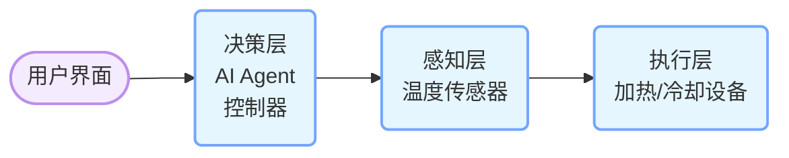

# 智能浴缸：AI Agent的水温调节系统

> 关键词：智能浴缸、AI Agent、水温调节系统、机器学习、传感器技术、自动化控制

> 摘要：本文聚焦于智能浴缸的AI Agent水温调节系统，详细阐述了该系统的背景、核心概念、算法原理、数学模型等内容。通过深入分析系统的工作机制，结合Python代码给出具体实现案例，并探讨了其在实际生活中的应用场景。同时，推荐了相关的学习资源、开发工具和研究论文，最后对该系统的未来发展趋势与挑战进行了总结，旨在为相关领域的研究和开发提供全面且深入的参考。

## 1. 背景介绍 
### 1.1 目的和范围
随着智能家居技术的飞速发展，智能浴缸作为其中的重要组成部分，越来越受到人们的关注。智能浴缸的水温调节系统是提升用户体验的关键因素之一。本文章的目的在于深入探讨如何利用AI Agent技术实现智能浴缸水温的精准、智能调节。范围涵盖了从核心概念的阐述、算法原理的分析、数学模型的建立，到实际项目的开发与应用，以及相关资源的推荐等多个方面。

### 1.2 预期读者
本文预期读者包括对智能家居技术、人工智能应用、嵌入式系统开发等领域感兴趣的研究人员、工程师和爱好者。同时，也适合相关专业的学生作为学习参考资料。

### 1.3 文档结构概述
本文将按照以下结构进行阐述：首先介绍核心概念与联系，包括智能浴缸、AI Agent和水温调节系统的原理和架构；接着详细讲解核心算法原理及具体操作步骤，并给出Python源代码；然后建立数学模型并进行详细讲解和举例说明；通过项目实战展示代码的实际案例和详细解释；探讨实际应用场景；推荐相关的工具和资源；最后总结未来发展趋势与挑战，并提供常见问题解答和扩展阅读参考资料。

### 1.4 术语表
#### 1.4.1 核心术语定义
- **智能浴缸**：一种具备智能化功能的浴缸，能够通过传感器、控制器等设备实现对水温、水位、水质等参数的自动监测和调节。
- **AI Agent**：人工智能代理，是一种能够感知环境、自主决策并采取行动以实现特定目标的智能实体。在智能浴缸水温调节系统中，AI Agent可以根据传感器数据和用户需求，自动调整水温。
- **水温调节系统**：负责监测和调节浴缸水温的系统，通常由温度传感器、加热设备、冷却设备和控制器组成。

#### 1.4.2 相关概念解释
- **机器学习**：是一门多领域交叉学科，涉及概率论、统计学、逼近论、凸分析、算法复杂度理论等多门学科。它专门研究计算机怎样模拟或实现人类的学习行为，以获取新的知识或技能，重新组织已有的知识结构使之不断改善自身的性能。在水温调节系统中，机器学习算法可以用于预测用户的水温需求和优化调节策略。
- **传感器技术**：是获取信息的重要手段，通过各种传感器可以实时监测浴缸的水温、水位、水质等参数。常见的温度传感器有热电偶、热敏电阻等。

#### 1.4.3 缩略词列表
- **PID**：Proportional - Integral - Derivative，比例 - 积分 - 微分控制器，是一种常见的反馈控制算法，用于调节系统的输出。
- **ML**：Machine Learning，机器学习。

## 2. 核心概念与联系 

### 2.1 智能浴缸的基本原理
智能浴缸主要由浴缸本体、传感器模块、控制器模块、执行器模块和人机交互界面组成。传感器模块用于实时监测浴缸内的水温、水位、水质等参数；控制器模块根据传感器数据和用户设定的参数，通过算法计算出合适的控制指令；执行器模块根据控制指令对加热设备、冷却设备等进行操作，以实现水温、水位等参数的调节；人机交互界面则允许用户设置和查看浴缸的运行状态。

### 2.2 AI Agent在水温调节系统中的作用
AI Agent在水温调节系统中扮演着智能决策者的角色。它通过感知环境（即传感器采集的水温数据），结合自身的知识库和学习能力，预测用户的水温需求，并生成相应的控制策略。与传统的水温调节方法相比，AI Agent能够根据不同用户的习惯和环境变化，实现更加个性化、精准的水温调节。

### 2.3 水温调节系统的架构
水温调节系统的架构可以分为三层：感知层、决策层和执行层。感知层主要由温度传感器组成，负责实时采集浴缸内的水温数据；决策层由AI Agent和控制器组成，AI Agent根据水温数据进行分析和决策，控制器将AI Agent的决策转化为具体的控制指令；执行层由加热设备和冷却设备组成，根据控制指令对水温进行调节。

以下是水温调节系统架构的文本示意图：

```plaintext
+---------------------+
|      用户界面      |
+---------------------+
          |
          v
+---------------------+
|     决策层 (AI Agent)    |
|     控制器             |
+---------------------+
          |
          v
+---------------------+
|     感知层 (温度传感器)  |
+---------------------+
          |
          v
+---------------------+
|     执行层 (加热/冷却设备) |
+---------------------+
```

以下是对应的Mermaid流程图：



## 3. 核心算法原理 & 具体操作步骤 

### 3.1 机器学习算法在水温调节中的应用
在智能浴缸水温调节系统中，我们可以使用机器学习算法来预测用户的水温需求。这里以简单的线性回归算法为例，线性回归是一种用于建立自变量和因变量之间线性关系的统计方法。

#### 3.1.1 线性回归算法原理
线性回归的基本模型可以表示为：

$$y = \theta_0 + \theta_1x_1 + \theta_2x_2 + \cdots + \theta_nx_n + \epsilon$$

其中，$y$ 是因变量（即用户需求的水温），$x_1, x_2, \cdots, x_n$ 是自变量（例如时间、季节、历史水温等），$\theta_0, \theta_1, \cdots, \theta_n$ 是模型的参数，$\epsilon$ 是误差项。

我们的目标是通过训练数据来估计这些参数，使得模型的预测值与实际值之间的误差最小。常用的误差度量方法是均方误差（Mean Squared Error, MSE）：

$$MSE = \frac{1}{m}\sum_{i = 1}^{m}(y^{(i)} - \hat{y}^{(i)})^2$$

其中，$m$ 是训练样本的数量，$y^{(i)}$ 是第 $i$ 个样本的实际值，$\hat{y}^{(i)}$ 是第 $i$ 个样本的预测值。

#### 3.1.2 具体操作步骤
1. **数据收集**：收集用户的水温使用历史数据，包括时间、季节、环境温度、历史水温等信息。
2. **数据预处理**：对收集到的数据进行清洗、归一化等处理，以提高模型的训练效果。
3. **模型训练**：使用训练数据对线性回归模型进行训练，估计模型的参数。
4. **模型评估**：使用测试数据对训练好的模型进行评估，计算均方误差等指标。
5. **模型应用**：将训练好的模型应用到实际的水温调节系统中，根据当前的环境信息预测用户的水温需求。

### 3.2 Python代码实现

```python
import numpy as np
from sklearn.linear_model import LinearRegression
from sklearn.model_selection import train_test_split
from sklearn.metrics import mean_squared_error

# 生成示例数据
# 假设我们有两个自变量：时间和环境温度
np.random.seed(0)
X = np.random.rand(100, 2)  # 100个样本，每个样本有2个特征
y = 2 * X[:, 0] + 3 * X[:, 1] + 1 + 0.1 * np.random.randn(100)  # 真实的水温需求

# 划分训练集和测试集
X_train, X_test, y_train, y_test = train_test_split(X, y, test_size=0.2, random_state=42)

# 创建线性回归模型
model = LinearRegression()

# 模型训练
model.fit(X_train, y_train)

# 模型预测
y_pred = model.predict(X_test)

# 模型评估
mse = mean_squared_error(y_test, y_pred)
print(f"均方误差: {mse}")

# 预测新的水温需求
new_X = np.array([[0.5, 0.6]])
predicted_temp = model.predict(new_X)
print(f"预测的水温需求: {predicted_temp[0]}")
```

### 3.3 代码解释
1. **数据生成**：使用 `numpy` 生成示例数据，其中 `X` 是自变量矩阵，`y` 是因变量向量。
2. **数据划分**：使用 `train_test_split` 函数将数据划分为训练集和测试集。
3. **模型创建**：创建一个线性回归模型 `LinearRegression`。
4. **模型训练**：使用训练数据对模型进行训练，调用 `fit` 方法。
5. **模型预测**：使用测试数据对模型进行预测，调用 `predict` 方法。
6. **模型评估**：使用 `mean_squared_error` 函数计算均方误差。
7. **新数据预测**：使用训练好的模型对新的环境信息进行水温需求预测。

## 4. 数学模型和公式 & 详细讲解 & 举例说明 

### 4.1 线性回归模型的数学推导
线性回归模型的目标是最小化均方误差 $MSE$。我们可以使用最小二乘法来求解模型的参数 $\theta$。

对于简单线性回归（只有一个自变量 $x$），模型可以表示为：

$$y = \theta_0 + \theta_1x + \epsilon$$

均方误差为：

$$MSE = \frac{1}{m}\sum_{i = 1}^{m}(y^{(i)} - (\theta_0 + \theta_1x^{(i)}))^2$$

为了找到使 $MSE$ 最小的 $\theta_0$ 和 $\theta_1$，我们分别对 $\theta_0$ 和 $\theta_1$ 求偏导数，并令其等于 0：

$$\frac{\partial MSE}{\partial \theta_0} = -\frac{2}{m}\sum_{i = 1}^{m}(y^{(i)} - (\theta_0 + \theta_1x^{(i)})) = 0$$

$$\frac{\partial MSE}{\partial \theta_1} = -\frac{2}{m}\sum_{i = 1}^{m}(y^{(i)} - (\theta_0 + \theta_1x^{(i)}))x^{(i)} = 0$$

解上述方程组，可以得到 $\theta_0$ 和 $\theta_1$ 的最优解：

$$\theta_1 = \frac{\sum_{i = 1}^{m}(x^{(i)} - \bar{x})(y^{(i)} - \bar{y})}{\sum_{i = 1}^{m}(x^{(i)} - \bar{x})^2}$$

$$\theta_0 = \bar{y} - \theta_1\bar{x}$$

其中，$\bar{x}$ 和 $\bar{y}$ 分别是 $x$ 和 $y$ 的均值。

### 4.2 举例说明
假设我们有以下数据：

| 时间 $x$ | 水温需求 $y$ |
| ---- | ---- |
| 1 | 20 |
| 2 | 22 |
| 3 | 24 |
| 4 | 26 |
| 5 | 28 |

首先计算均值：

$$\bar{x} = \frac{1 + 2 + 3 + 4 + 5}{5} = 3$$

$$\bar{y} = \frac{20 + 22 + 24 + 26 + 28}{5} = 24$$

然后计算 $\theta_1$：

$$\sum_{i = 1}^{5}(x^{(i)} - \bar{x})(y^{(i)} - \bar{y}) = (1 - 3)(20 - 24) + (2 - 3)(22 - 24) + (3 - 3)(24 - 24) + (4 - 3)(26 - 24) + (5 - 3)(28 - 24) = 20$$

$$\sum_{i = 1}^{5}(x^{(i)} - \bar{x})^2 = (1 - 3)^2 + (2 - 3)^2 + (3 - 3)^2 + (4 - 3)^2 + (5 - 3)^2 = 10$$

$$\theta_1 = \frac{20}{10} = 2$$

最后计算 $\theta_0$：

$$\theta_0 = 24 - 2 \times 3 = 18$$

所以，线性回归模型为：

$$y = 18 + 2x$$

当 $x = 6$ 时，预测的水温需求为：

$$y = 18 + 2 \times 6 = 30$$

## 5. 项目实战：代码实际案例和详细解释说明 

### 5.1  开发环境搭建
#### 5.1.1 硬件环境
- **智能浴缸**：具备温度传感器和加热/冷却设备。
- **控制器**：可以使用树莓派、Arduino等开发板作为控制器。
- **传感器**：温度传感器，如DS18B20。
- **执行器**：加热棒、制冷模块等。

#### 5.1.2 软件环境
- **操作系统**：树莓派可以使用Raspbian操作系统，Arduino可以使用Arduino IDE。
- **编程语言**：Python，用于编写控制算法。
- **开发库**：`RPi.GPIO`（树莓派GPIO控制库）、`w1thermsensor`（DS18B20温度传感器读取库）等。

### 5.2  源代码详细实现和代码解读

```python
import time
from w1thermsensor import W1ThermSensor
import RPi.GPIO as GPIO

# 初始化温度传感器
sensor = W1ThermSensor()

# 初始化GPIO
GPIO.setmode(GPIO.BCM)
HEATING_PIN = 17
COOLING_PIN = 18
GPIO.setup(HEATING_PIN, GPIO.OUT)
GPIO.setup(COOLING_PIN, GPIO.OUT)

# 目标水温
target_temp = 38

def read_temperature():
    """读取当前水温"""
    return sensor.get_temperature()

def control_temperature():
    """控制水温"""
    current_temp = read_temperature()
    print(f"当前水温: {current_temp}°C")
    if current_temp < target_temp:
        # 水温低于目标水温，开启加热设备
        GPIO.output(HEATING_PIN, GPIO.HIGH)
        GPIO.output(COOLING_PIN, GPIO.LOW)
        print("开启加热设备")
    elif current_temp > target_temp:
        # 水温高于目标水温，开启冷却设备
        GPIO.output(HEATING_PIN, GPIO.LOW)
        GPIO.output(COOLING_PIN, GPIO.HIGH)
        print("开启冷却设备")
    else:
        # 水温达到目标水温，关闭加热和冷却设备
        GPIO.output(HEATING_PIN, GPIO.LOW)
        GPIO.output(COOLING_PIN, GPIO.LOW)
        print("水温已达到目标，关闭加热和冷却设备")

try:
    while True:
        control_temperature()
        time.sleep(5)  # 每5秒检查一次水温
except KeyboardInterrupt:
    print("程序终止，清理GPIO")
    GPIO.cleanup()
```

### 5.3  代码解读与分析
1. **温度传感器初始化**：使用 `W1ThermSensor` 库初始化温度传感器，用于读取当前水温。
2. **GPIO初始化**：使用 `RPi.GPIO` 库初始化GPIO引脚，分别控制加热设备和冷却设备。
3. **读取水温函数**：`read_temperature` 函数用于读取当前水温。
4. **水温控制函数**：`control_temperature` 函数根据当前水温与目标水温的比较结果，控制加热设备和冷却设备的开关。
5. **主循环**：使用 `while True` 循环，每5秒检查一次水温，并调用 `control_temperature` 函数进行水温控制。
6. **异常处理**：使用 `try-except` 语句捕获 `KeyboardInterrupt` 异常，当用户按下 `Ctrl+C` 时，程序终止并清理GPIO引脚。

## 6. 实际应用场景 
### 6.1 家庭浴室
在家庭浴室中，智能浴缸的水温调节系统可以为用户提供更加舒适的沐浴体验。用户可以通过手机APP或语音控制设置目标水温，系统会自动调节水温，无需用户手动操作。同时，系统可以根据用户的使用习惯和环境变化，智能地调整水温，提高能源利用效率。

### 6.2 酒店客房
酒店可以为客房配备智能浴缸，提升客房的品质和竞争力。客人可以在入住前通过酒店的APP设置好浴缸的水温，到达房间后即可享受舒适的沐浴。酒店管理人员可以通过后台系统实时监测浴缸的运行状态，及时进行维护和管理。

### 6.3 温泉浴场
在温泉浴场中，智能浴缸的水温调节系统可以确保每个浴缸的水温保持在合适的范围内。浴场工作人员可以通过集中控制系统对多个浴缸的水温进行统一管理，提高工作效率和服务质量。

## 7. 工具和资源推荐
### 7.1 学习资源推荐
#### 7.1.1 书籍推荐
- 《机器学习》（周志华著）：全面介绍了机器学习的基本概念、算法和应用，是机器学习领域的经典教材。
- 《Python机器学习实战》（Sebastian Raschka著）：通过实际案例介绍了如何使用Python进行机器学习项目的开发。
- 《智能家居技术与应用》（张三著）：详细介绍了智能家居的各个方面，包括智能浴缸等设备的原理和应用。

#### 7.1.2 在线课程
- Coursera上的“机器学习”课程（Andrew Ng教授主讲）：是机器学习领域最受欢迎的在线课程之一，讲解深入浅出，适合初学者。
- edX上的“人工智能基础”课程：介绍了人工智能的基本概念、算法和应用，对理解AI Agent技术有很大帮助。
- 中国大学MOOC上的“智能家居系统设计与开发”课程：结合实际案例，介绍了智能家居系统的设计和开发方法。

#### 7.1.3 技术博客和网站
- 博客园：有很多技术博主分享机器学习、智能家居等领域的技术文章和经验。
- 知乎：可以在知乎上搜索相关话题，了解行业动态和技术趋势。
- 开源中国：提供了大量的开源项目和技术资源，对学习和开发有很大帮助。

### 7.2 开发工具框架推荐
#### 7.2.1 IDE和编辑器
- PyCharm：是一款专业的Python集成开发环境，提供了丰富的代码编辑、调试和部署功能。
- Visual Studio Code：是一款轻量级的代码编辑器，支持多种编程语言和插件扩展，适合快速开发。
- Arduino IDE：专门用于Arduino开发板的集成开发环境，简单易用。

#### 7.2.2 调试和性能分析工具
- `pdb`：Python自带的调试工具，可以帮助开发者定位代码中的问题。
- `cProfile`：Python的性能分析工具，可以分析代码的运行时间和函数调用情况。
- `Arduino IDE` 的串口监视器：可以实时查看Arduino开发板的输出信息，方便调试。

#### 7.2.3 相关框架和库
- `scikit-learn`：是Python中最常用的机器学习库，提供了丰富的机器学习算法和工具。
- `TensorFlow`：是Google开发的开源机器学习框架，广泛应用于深度学习领域。
- `RPi.GPIO`：树莓派的GPIO控制库，方便开发者控制树莓派的硬件引脚。

### 7.3 相关论文著作推荐
#### 7.3.1 经典论文
- “A Logical Calculus of the Ideas Immanent in Nervous Activity”（Warren S. McCulloch和Walter Pitts著）：提出了人工神经网络的基本模型，是人工智能领域的经典论文。
- “Pattern Recognition and Machine Learning”（Christopher M. Bishop著）：全面介绍了模式识别和机器学习的理论和方法，是该领域的重要著作。

#### 7.3.2 最新研究成果
- 可以关注顶级学术会议如NeurIPS、ICML、CVPR等的论文，了解人工智能和机器学习领域的最新研究成果。
- 查阅相关的学术期刊如《Journal of Artificial Intelligence Research》、《Artificial Intelligence》等，获取最新的研究动态。

#### 7.3.3 应用案例分析
- 可以在IEEE Xplore、ACM Digital Library等数据库中搜索关于智能家居应用案例的论文，学习他人的经验和方法。

## 8. 总结：未来发展趋势与挑战
### 8.1 未来发展趋势
- **个性化定制**：智能浴缸的水温调节系统将更加注重用户的个性化需求，通过机器学习算法深入分析用户的使用习惯和偏好，为每个用户提供独一无二的水温调节方案。
- **与其他智能家居系统的集成**：智能浴缸将与家庭中的其他智能家居设备，如智能照明、智能音响等进行深度集成，实现更加智能化的家居场景。例如，当用户开启浴缸时，系统可以自动调节灯光亮度和音乐播放，营造舒适的沐浴环境。
- **健康监测功能**：未来的智能浴缸可能会集成更多的健康监测传感器，如心率传感器、血压传感器等，实时监测用户的健康状况，并根据监测结果调整水温，提供个性化的健康建议。
- **云计算和大数据应用**：利用云计算和大数据技术，智能浴缸可以将用户的使用数据上传到云端进行分析和处理，挖掘更多的潜在信息，为产品的优化和升级提供依据。

### 8.2 挑战
- **数据安全和隐私问题**：智能浴缸收集的用户数据包含了大量的个人信息，如使用习惯、健康状况等。如何保障这些数据的安全和隐私，防止数据泄露和滥用，是一个亟待解决的问题。
- **算法的准确性和可靠性**：水温调节系统的性能直接取决于算法的准确性和可靠性。在复杂的环境下，如何提高算法的适应性和鲁棒性，确保水温调节的精准度，是一个挑战。
- **硬件成本和兼容性**：智能浴缸的硬件设备，如传感器、控制器等，成本较高，限制了产品的普及。同时，不同品牌和型号的硬件设备之间可能存在兼容性问题，需要解决。
- **用户接受度**：一些用户可能对智能浴缸的新技术和功能存在疑虑，担心操作复杂、可靠性低等问题。如何提高用户的接受度，让更多的用户愿意使用智能浴缸，是推广智能浴缸的关键。

## 9. 附录：常见问题与解答
### 9.1 智能浴缸的水温调节系统是否稳定可靠？
智能浴缸的水温调节系统通常采用了先进的传感器技术和控制算法，在正常情况下可以实现稳定可靠的水温调节。但是，系统的稳定性也受到硬件质量、环境因素等多种因素的影响。在使用过程中，如果发现水温调节异常，应及时检查传感器、加热设备等硬件是否正常工作。

### 9.2 智能浴缸的水温调节系统是否节能？
智能浴缸的水温调节系统可以根据用户的需求和环境变化，智能地调整水温，避免了传统浴缸因长时间加热或冷却而造成的能源浪费，从而提高了能源利用效率。同时，一些智能浴缸还采用了节能型的加热设备和保温材料，进一步降低了能耗。

### 9.3 智能浴缸的水温调节系统可以实现远程控制吗？
可以。通过与手机APP或智能家居系统的连接，用户可以实现对智能浴缸水温调节系统的远程控制。用户可以在离家前提前设置好浴缸的水温，回家后即可享受舒适的沐浴。

### 9.4 智能浴缸的水温调节系统出现故障怎么办？
如果智能浴缸的水温调节系统出现故障，首先应检查系统的电源、传感器、加热设备等硬件是否正常连接。如果硬件没有问题，可以尝试重启系统或恢复出厂设置。如果问题仍然存在，建议联系专业的售后服务人员进行维修。

## 10. 扩展阅读 & 参考资料
- 《智能家居：原理、设计与应用》
- 《人工智能：一种现代的方法》
- 智能家居相关的行业报告和技术白皮书
- 智能浴缸产品的官方文档和用户手册

作者：AI天才研究院/AI Genius Institute & 禅与计算机程序设计艺术 /Zen And The Art of Computer Programming