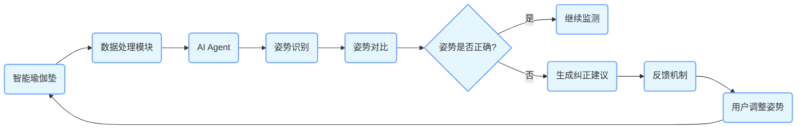

# 智能瑜伽垫：AI Agent的实时姿势纠正系统

> 关键词：智能瑜伽垫、AI Agent、实时姿势纠正、计算机视觉、机器学习

> 摘要：本文围绕智能瑜伽垫的AI Agent实时姿势纠正系统展开深入探讨。首先介绍了该系统开发的背景和意义，明确预期读者和文档结构。接着阐述核心概念，包括智能瑜伽垫、AI Agent等原理及其联系，并通过文本示意图和Mermaid流程图展示架构。详细讲解了核心算法原理和具体操作步骤，用Python代码进行示例。从数学模型和公式层面深入剖析系统运行机制，并举例说明。通过项目实战，介绍开发环境搭建、源代码实现及代码解读。分析了该系统在不同场景下的实际应用，推荐了相关学习资源、开发工具框架和论文著作。最后总结系统未来发展趋势与挑战，提供常见问题解答和扩展阅读参考资料，旨在为相关领域的研究和开发提供全面的技术指导。

## 1. 背景介绍 
### 1.1 目的和范围
随着人们对健康和健身的关注度不断提高，瑜伽作为一种有效的身心锻炼方式受到了广泛欢迎。然而，在练习瑜伽的过程中，正确的姿势至关重要，错误的姿势不仅可能无法达到预期的锻炼效果，还可能导致身体受伤。传统的瑜伽教学方式主要依赖于教练的现场指导，但这种方式受到时间、空间和经济成本的限制。因此，开发一种智能的实时姿势纠正系统具有重要的现实意义。

本项目的目的是设计和实现一个基于智能瑜伽垫的AI Agent实时姿势纠正系统，该系统能够实时监测用户在瑜伽垫上的姿势，并通过AI Agent提供即时的姿势纠正建议。系统的范围涵盖了从硬件设备（智能瑜伽垫）的数据采集，到计算机视觉和机器学习算法的处理，再到最终的姿势纠正反馈的整个流程。

### 1.2 预期读者
本文的预期读者包括对人工智能、计算机视觉、健身科技等领域感兴趣的研究人员、开发者、健身爱好者以及相关行业的从业者。对于研究人员和开发者，本文可以为他们在智能健身设备的开发和算法优化方面提供参考；对于健身爱好者，本文可以帮助他们了解智能瑜伽垫的工作原理和优势；对于行业从业者，本文可以为他们的市场推广和产品设计提供思路。

### 1.3 文档结构概述
本文将按照以下结构进行组织：
1. 背景介绍：阐述项目的目的、范围、预期读者和文档结构。
2. 核心概念与联系：介绍智能瑜伽垫、AI Agent、实时姿势纠正等核心概念，并展示它们之间的联系和系统架构。
3. 核心算法原理 & 具体操作步骤：详细讲解系统所使用的核心算法原理，并给出具体的操作步骤和Python代码示例。
4. 数学模型和公式 & 详细讲解 & 举例说明：从数学角度深入分析系统的运行机制，给出相关的数学模型和公式，并通过具体例子进行说明。
5. 项目实战：代码实际案例和详细解释说明：介绍开发环境的搭建，给出源代码的详细实现和代码解读。
6. 实际应用场景：分析系统在不同场景下的实际应用。
7. 工具和资源推荐：推荐相关的学习资源、开发工具框架和论文著作。
8. 总结：未来发展趋势与挑战：总结系统的发展趋势和面临的挑战。
9. 附录：常见问题与解答：提供常见问题的解答。
10. 扩展阅读 & 参考资料：列出相关的扩展阅读材料和参考资料。

### 1.4 术语表
#### 1.4.1 核心术语定义
- **智能瑜伽垫**：集成了传感器和数据处理模块的瑜伽垫，能够采集用户在瑜伽垫上的压力分布、动作姿态等数据。
- **AI Agent**：人工智能代理，是一种能够感知环境、做出决策并采取行动的智能实体。在本系统中，AI Agent根据智能瑜伽垫采集的数据，分析用户的姿势，并提供姿势纠正建议。
- **实时姿势纠正**：在用户进行瑜伽练习的过程中，系统实时监测用户的姿势，并及时提供纠正建议，以帮助用户保持正确的姿势。
- **计算机视觉**：是一门研究如何使机器“看”的科学，通过图像和视频处理技术，让计算机理解和分析视觉信息。在本系统中，计算机视觉技术用于识别用户的姿势。
- **机器学习**：是一门多领域交叉学科，涉及概率论、统计学、逼近论、凸分析、算法复杂度理论等多门学科。它专门研究计算机怎样模拟或实现人类的学习行为，以获取新的知识或技能，重新组织已有的知识结构使之不断改善自身的性能。在本系统中，机器学习算法用于训练姿势识别模型。

#### 1.4.2 相关概念解释
- **传感器融合**：将多种不同类型的传感器数据进行融合处理，以获取更全面、准确的信息。在智能瑜伽垫中，可能会融合压力传感器、加速度传感器等多种传感器的数据。
- **姿势识别模型**：通过机器学习算法训练得到的模型，用于识别用户的瑜伽姿势。该模型可以根据输入的传感器数据，输出用户当前的姿势类别。
- **反馈机制**：系统将姿势分析结果和纠正建议反馈给用户的方式，如语音提示、手机APP显示等。

#### 1.4.3 缩略词列表
- **AI**：Artificial Intelligence，人工智能
- **CV**：Computer Vision，计算机视觉
- **ML**：Machine Learning，机器学习
- **CNN**：Convolutional Neural Network，卷积神经网络
- **RNN**：Recurrent Neural Network，循环神经网络

## 2. 核心概念与联系 
### 核心概念原理
#### 智能瑜伽垫
智能瑜伽垫的核心是集成了各种传感器，如压力传感器、加速度传感器等。压力传感器可以检测用户在瑜伽垫上不同位置的压力分布，从而推断出用户的身体重心位置和脚部、手部的放置情况。加速度传感器则可以检测用户身体的运动状态，如运动方向、速度等。这些传感器将采集到的数据传输到数据处理模块，进行初步的处理和分析。

#### AI Agent
AI Agent是整个系统的智能核心。它接收智能瑜伽垫采集的数据，并运用计算机视觉和机器学习算法对数据进行处理和分析。首先，通过计算机视觉技术对用户的姿势进行识别，确定用户当前的瑜伽姿势类别。然后，将识别结果与标准的瑜伽姿势进行对比，找出用户姿势中存在的问题。最后，根据问题的类型和严重程度，生成相应的姿势纠正建议，并通过反馈机制传达给用户。

#### 实时姿势纠正
实时姿势纠正是系统的主要功能之一。在用户进行瑜伽练习的过程中，智能瑜伽垫不断采集数据，AI Agent实时对数据进行处理和分析。一旦发现用户的姿势存在偏差，系统立即生成纠正建议并反馈给用户，使用户能够及时调整姿势，保持正确的练习状态。

### 架构的文本示意图
```plaintext
+-------------------+
|    智能瑜伽垫     |
|  (传感器模块)     |
+-------------------+
         |
         v
+-------------------+
|  数据处理模块     |
|  (数据采集与预处理)|
+-------------------+
         |
         v
+-------------------+
|    AI Agent       |
| (姿势识别与分析)  |
+-------------------+
         |
         v
+-------------------+
|   反馈机制        |
| (语音提示、APP显示)|
+-------------------+
```

### Mermaid流程图


## 3. 核心算法原理 & 具体操作步骤 
### 核心算法原理
#### 姿势识别算法
本系统采用卷积神经网络（CNN）进行姿势识别。CNN是一种专门用于处理具有网格结构数据（如图像）的深度学习模型，它具有自动提取特征的能力。在姿势识别任务中，我们将智能瑜伽垫采集到的传感器数据转换为类似图像的二维矩阵，作为CNN的输入。CNN通过卷积层、池化层和全连接层对输入数据进行处理，最终输出用户的姿势类别。

#### 姿势对比算法
姿势对比算法的主要目的是将用户的实际姿势与标准的瑜伽姿势进行对比，找出两者之间的差异。我们可以使用关键点匹配的方法来实现姿势对比。首先，从用户的姿势和标准姿势中提取关键点，如关节点的位置。然后，计算这些关键点之间的距离和角度差异。根据差异的大小，判断用户姿势的偏差程度。

### 具体操作步骤
#### 数据采集
智能瑜伽垫的传感器模块实时采集用户的压力分布、加速度等数据，并将数据传输到数据处理模块。

#### 数据预处理
数据处理模块对采集到的数据进行预处理，包括数据清洗、归一化等操作。数据清洗的目的是去除噪声和异常值，归一化的目的是将数据映射到相同的范围，以便后续的处理。

#### 姿势识别
将预处理后的数据输入到训练好的CNN模型中，进行姿势识别。CNN模型输出用户的姿势类别。

#### 姿势对比
将识别出的用户姿势与标准的瑜伽姿势进行对比，计算关键点之间的差异。

#### 生成纠正建议
根据姿势对比的结果，生成相应的姿势纠正建议。例如，如果发现用户的某个关节角度偏差过大，建议用户调整关节的位置。

#### 反馈
通过反馈机制将纠正建议传达给用户，如语音提示、手机APP显示等。

### Python代码示例
```python
import numpy as np
import tensorflow as tf
from tensorflow.keras.models import Sequential
from tensorflow.keras.layers import Conv2D, MaxPooling2D, Flatten, Dense

# 假设我们有一个简单的CNN模型用于姿势识别
def build_cnn_model(input_shape, num_classes):
    model = Sequential([
        Conv2D(32, (3, 3), activation='relu', input_shape=input_shape),
        MaxPooling2D((2, 2)),
        Conv2D(64, (3, 3), activation='relu'),
        MaxPooling2D((2, 2)),
        Flatten(),
        Dense(64, activation='relu'),
        Dense(num_classes, activation='softmax')
    ])
    model.compile(optimizer='adam',
                  loss='sparse_categorical_crossentropy',
                  metrics=['accuracy'])
    return model

# 模拟数据采集
def collect_data():
    # 这里简单生成一些随机数据作为示例
    data = np.random.rand(100, 10, 10)  # 假设数据是10x10的二维矩阵
    labels = np.random.randint(0, 5, 100)  # 假设共有5种姿势类别
    return data, labels

# 数据预处理
def preprocess_data(data):
    # 归一化处理
    data = data / np.max(data)
    data = np.expand_dims(data, axis=-1)  # 添加通道维度
    return data

# 训练模型
def train_model():
    data, labels = collect_data()
    data = preprocess_data(data)
    input_shape = data[0].shape
    num_classes = len(np.unique(labels))
    model = build_cnn_model(input_shape, num_classes)
    model.fit(data, labels, epochs=10, batch_size=32)
    return model

# 姿势识别
def recognize_pose(model, new_data):
    new_data = preprocess_data(new_data)
    predictions = model.predict(new_data)
    predicted_class = np.argmax(predictions)
    return predicted_class

# 主程序
if __name__ == "__main__":
    model = train_model()
    # 模拟新的数据进行姿势识别
    new_data = np.random.rand(1, 10, 10)
    predicted_class = recognize_pose(model, new_data)
    print(f"Predicted pose class: {predicted_class}")
```

## 4. 数学模型和公式 & 详细讲解 & 举例说明 
### 卷积神经网络（CNN）的数学模型
#### 卷积层
卷积层是CNN的核心层之一，它通过卷积操作提取输入数据的特征。卷积操作可以用以下公式表示：

$$
y_{i,j}^k = \sum_{m=0}^{M-1} \sum_{n=0}^{N-1} x_{i+m,j+n}^l \cdot w_{m,n}^{l,k} + b^k
$$

其中，$y_{i,j}^k$ 是输出特征图中第 $k$ 个通道的第 $(i,j)$ 个元素，$x_{i+m,j+n}^l$ 是输入特征图中第 $l$ 个通道的第 $(i+m,j+n)$ 个元素，$w_{m,n}^{l,k}$ 是卷积核中第 $(m,n)$ 个元素，$b^k$ 是偏置项，$M$ 和 $N$ 是卷积核的大小。

#### 池化层
池化层的主要作用是对特征图进行下采样，减少数据的维度，同时保留重要的特征信息。常用的池化操作有最大池化和平均池化。以最大池化为例，其公式可以表示为：

$$
y_{i,j}^k = \max_{m=0}^{M-1} \max_{n=0}^{N-1} x_{i \cdot s + m,j \cdot s + n}^k
$$

其中，$y_{i,j}^k$ 是输出特征图中第 $k$ 个通道的第 $(i,j)$ 个元素，$x_{i \cdot s + m,j \cdot s + n}^k$ 是输入特征图中第 $k$ 个通道的第 $(i \cdot s + m,j \cdot s + n)$ 个元素，$s$ 是池化的步长，$M$ 和 $N$ 是池化窗口的大小。

#### 全连接层
全连接层将卷积层和池化层提取的特征进行整合，输出最终的分类结果。全连接层的公式可以表示为：

$$
y_j = \sum_{i=0}^{I-1} x_i \cdot w_{i,j} + b_j
$$

其中，$y_j$ 是输出层的第 $j$ 个元素，$x_i$ 是输入层的第 $i$ 个元素，$w_{i,j}$ 是连接权重，$b_j$ 是偏置项，$I$ 是输入层的大小。

### 姿势对比的数学模型
#### 关键点匹配
在姿势对比中，我们使用关键点匹配的方法来计算用户姿势与标准姿势之间的差异。假设我们从用户姿势和标准姿势中提取了 $K$ 个关键点，每个关键点的坐标为 $(x,y)$。则两个关键点之间的欧氏距离可以表示为：

$$
d = \sqrt{(x_1 - x_2)^2 + (y_1 - y_2)^2}
$$

其中，$(x_1,y_1)$ 和 $(x_2,y_2)$ 分别是两个关键点的坐标。

#### 角度计算
除了距离差异，我们还可以计算关键点之间的角度差异。假设我们有三个关键点 $A(x_1,y_1)$，$B(x_2,y_2)$ 和 $C(x_3,y_3)$，则 $\angle ABC$ 的余弦值可以通过以下公式计算：

$$
\cos(\angle ABC) = \frac{\overrightarrow{BA} \cdot \overrightarrow{BC}}{\vert\overrightarrow{BA}\vert \cdot \vert\overrightarrow{BC}\vert}
$$

其中，$\overrightarrow{BA} = (x_1 - x_2, y_1 - y_2)$，$\overrightarrow{BC} = (x_3 - x_2, y_3 - y_2)$，$\vert\overrightarrow{BA}\vert$ 和 $\vert\overrightarrow{BC}\vert$ 分别是向量 $\overrightarrow{BA}$ 和 $\overrightarrow{BC}$ 的模。

### 举例说明
假设我们有一个简单的瑜伽姿势，需要识别用户的姿势是否正确。我们从用户姿势和标准姿势中提取了三个关键点 $A(1,2)$，$B(3,4)$ 和 $C(5,6)$ 作为示例。

#### 计算关键点之间的距离
- 计算 $AB$ 的距离：
  - $d_{AB} = \sqrt{(1 - 3)^2 + (2 - 4)^2} = \sqrt{4 + 4} = \sqrt{8} \approx 2.83$
- 计算 $BC$ 的距离：
  - $d_{BC} = \sqrt{(3 - 5)^2 + (4 - 6)^2} = \sqrt{4 + 4} = \sqrt{8} \approx 2.83$
- 计算 $AC$ 的距离：
  - $d_{AC} = \sqrt{(1 - 5)^2 + (2 - 6)^2} = \sqrt{16 + 16} = \sqrt{32} \approx 5.66$

#### 计算角度
- 首先计算向量 $\overrightarrow{BA} = (-2,-2)$，$\overrightarrow{BC} = (2,2)$
- 计算向量的模：$\vert\overrightarrow{BA}\vert = \sqrt{(-2)^2 + (-2)^2} = \sqrt{8} \approx 2.83$，$\vert\overrightarrow{BC}\vert = \sqrt{2^2 + 2^2} = \sqrt{8} \approx 2.83$
- 计算向量的点积：$\overrightarrow{BA} \cdot \overrightarrow{BC} = (-2) \times 2 + (-2) \times 2 = -8$
- 计算 $\cos(\angle ABC)$：
  - $\cos(\angle ABC) = \frac{-8}{2.83 \times 2.83} \approx -1$
  - 则 $\angle ABC \approx 180^{\circ}$

通过比较用户姿势和标准姿势中关键点的距离和角度差异，我们可以判断用户姿势是否正确。如果差异超过了一定的阈值，则认为用户姿势存在偏差，需要进行纠正。

## 5. 项目实战：代码实际案例和详细解释说明 
### 5.1  开发环境搭建
#### 硬件环境
- **智能瑜伽垫**：选择集成了压力传感器和加速度传感器的智能瑜伽垫，确保传感器能够准确采集数据。
- **计算机**：配备足够的计算资源，如CPU、GPU等，以支持深度学习模型的训练和推理。建议使用NVIDIA GPU，以加速模型的训练过程。

#### 软件环境
- **操作系统**：推荐使用Ubuntu 18.04或更高版本的Linux操作系统，也可以使用Windows 10操作系统。
- **Python环境**：安装Python 3.7或更高版本，并使用虚拟环境管理工具（如`virtualenv`或`conda`）创建一个独立的Python环境。
- **深度学习框架**：安装TensorFlow或PyTorch深度学习框架，用于构建和训练CNN模型。
- **其他依赖库**：安装NumPy、Pandas、OpenCV等常用的Python库，用于数据处理和图像操作。

### 5.2  源代码详细实现和代码解读
#### 数据采集模块
```python
import serial

# 假设智能瑜伽垫通过串口与计算机连接
def collect_data_from_mat():
    ser = serial.Serial('COM3', 9600)  # 根据实际情况修改串口名称和波特率
    data = []
    try:
        while True:
            line = ser.readline().decode('utf-8').strip()
            if line:
                values = [float(x) for x in line.split(',')]
                data.append(values)
                if len(data) == 100:  # 采集100个数据点
                    break
    except KeyboardInterrupt:
        ser.close()
    return np.array(data)
```
**代码解读**：该函数通过串口与智能瑜伽垫进行通信，实时采集传感器数据。将采集到的数据存储在一个列表中，当采集到100个数据点时，停止采集并返回数据。

#### 数据预处理模块
```python
def preprocess_data(data):
    # 数据清洗：去除异常值
    data = np.clip(data, 0, 100)  # 假设数据范围在0-100之间
    # 归一化处理
    data = (data - np.min(data)) / (np.max(data) - np.min(data))
    # 调整数据形状
    data = np.reshape(data, (10, 10))  # 假设数据可以转换为10x10的矩阵
    data = np.expand_dims(data, axis=0)  # 添加批量维度
    data = np.expand_dims(data, axis=-1)  # 添加通道维度
    return data
```
**代码解读**：该函数对采集到的数据进行预处理。首先使用`np.clip`函数去除异常值，将数据限制在0-100的范围内。然后进行归一化处理，将数据映射到0-1的区间。最后调整数据的形状，使其符合CNN模型的输入要求。

#### 姿势识别模块
```python
import tensorflow as tf
from tensorflow.keras.models import load_model

def recognize_pose(model_path, data):
    model = load_model(model_path)
    predictions = model.predict(data)
    predicted_class = np.argmax(predictions)
    return predicted_class
```
**代码解读**：该函数加载训练好的CNN模型，并对预处理后的数据进行姿势识别。使用`model.predict`方法得到模型的预测结果，然后使用`np.argmax`函数找出预测概率最大的类别作为最终的预测类别。

#### 主程序
```python
if __name__ == "__main__":
    # 数据采集
    mat_data = collect_data_from_mat()
    # 数据预处理
    processed_data = preprocess_data(mat_data)
    # 姿势识别
    model_path = 'pose_recognition_model.h5'
    predicted_class = recognize_pose(model_path, processed_data)
    print(f"Predicted pose class: {predicted_class}")
```
**代码解读**：主程序依次调用数据采集、数据预处理和姿势识别模块，完成整个姿势识别流程。最后输出预测的姿势类别。

### 5.3  代码解读与分析
#### 数据采集模块
- 该模块通过串口与智能瑜伽垫进行通信，实时采集传感器数据。在实际应用中，需要根据智能瑜伽垫的通信协议和接口规范进行相应的调整。
- 为了提高数据采集的稳定性和准确性，可以添加数据校验和错误处理机制。

#### 数据预处理模块
- 数据清洗和归一化处理是非常重要的步骤，可以提高模型的训练效果和泛化能力。
- 调整数据形状时，需要根据CNN模型的输入要求进行相应的调整。

#### 姿势识别模块
- 该模块加载训练好的CNN模型，并对预处理后的数据进行姿势识别。在实际应用中，可以使用更复杂的模型结构和训练方法，以提高姿势识别的准确率。
- 可以添加模型评估和优化的步骤，如交叉验证、模型调优等，以进一步提高模型的性能。

## 6. 实际应用场景 
### 家庭瑜伽练习
对于喜欢在家中进行瑜伽练习的用户，智能瑜伽垫的实时姿势纠正系统可以提供专业的指导，帮助他们保持正确的姿势，避免因姿势错误而导致的身体损伤。用户只需将智能瑜伽垫放置在合适的位置，打开系统，即可开始进行瑜伽练习。系统会实时监测用户的姿势，并通过语音提示或手机APP显示的方式提供纠正建议。

### 瑜伽培训机构
在瑜伽培训机构中，智能瑜伽垫的实时姿势纠正系统可以作为辅助教学工具，帮助教练更高效地指导学员。教练可以同时关注多个学员的练习情况，系统会自动识别学员的姿势问题，并及时提供纠正建议。这样可以提高教学质量，减少教练的工作负担。

### 康复训练
对于一些因运动损伤或疾病需要进行康复训练的患者，智能瑜伽垫的实时姿势纠正系统可以提供个性化的康复指导。系统可以根据患者的康复计划和身体状况，设置相应的姿势标准和训练目标。在患者进行康复训练的过程中，系统会实时监测患者的姿势，确保患者按照正确的方法进行训练，促进康复效果。

### 健身俱乐部
在健身俱乐部中，智能瑜伽垫的实时姿势纠正系统可以为会员提供更丰富的健身体验。会员可以在瑜伽课程中使用智能瑜伽垫，系统会实时记录会员的练习数据和姿势纠正情况。俱乐部可以根据这些数据为会员提供个性化的健身建议和训练计划，提高会员的满意度和忠诚度。

## 7. 工具和资源推荐
### 7.1 学习资源推荐
#### 7.1.1 书籍推荐
- 《深度学习》（Deep Learning）：由Ian Goodfellow、Yoshua Bengio和Aaron Courville合著，是深度学习领域的经典教材，涵盖了深度学习的基本原理、算法和应用。
- 《计算机视觉：算法与应用》（Computer Vision: Algorithms and Applications）：由Richard Szeliski编写，全面介绍了计算机视觉的基本概念、算法和应用，是计算机视觉领域的重要参考书。
- 《Python机器学习实战》（Python Machine Learning）：由Sebastian Raschka和Vahid Mirjalili合著，通过实际案例介绍了Python在机器学习中的应用，适合初学者入门。

#### 7.1.2 在线课程
- Coursera上的“深度学习专项课程”（Deep Learning Specialization）：由Andrew Ng教授主讲，包括五门课程，全面介绍了深度学习的理论和实践。
- edX上的“计算机视觉基础”（Foundations of Computer Vision）：由Berkeley大学的教授主讲，系统介绍了计算机视觉的基本概念和算法。
- Udemy上的“Python深度学习实战”（Deep Learning with Python）：通过实际项目介绍了Python在深度学习中的应用，适合有一定编程基础的学习者。

#### 7.1.3 技术博客和网站
- Medium：是一个技术博客平台，上面有很多关于人工智能、计算机视觉和机器学习的优秀文章。
- Towards Data Science：是一个专注于数据科学和机器学习的博客平台，提供了大量的技术文章和案例分析。
- arXiv：是一个预印本平台，上面可以找到很多最新的学术研究论文，包括人工智能、计算机视觉等领域的研究成果。

### 7.2 开发工具框架推荐
#### 7.2.1 IDE和编辑器
- PyCharm：是一款专门为Python开发设计的集成开发环境（IDE），提供了丰富的代码编辑、调试和项目管理功能。
- Jupyter Notebook：是一个交互式的开发环境，适合进行数据探索、模型训练和实验。
- Visual Studio Code：是一款轻量级的代码编辑器，支持多种编程语言和插件扩展，非常适合快速开发和调试。

#### 7.2.2 调试和性能分析工具
- TensorBoard：是TensorFlow提供的可视化工具，可以用于监控模型的训练过程、查看模型的结构和性能指标。
- PyTorch Profiler：是PyTorch提供的性能分析工具，可以帮助开发者找出代码中的性能瓶颈和优化点。
- cProfile：是Python标准库中的性能分析工具，可以统计代码中各个函数的执行时间和调用次数。

#### 7.2.3 相关框架和库
- TensorFlow：是一个开源的深度学习框架，提供了丰富的工具和库，支持多种深度学习模型的构建和训练。
- PyTorch：是另一个流行的深度学习框架，具有动态图和易于使用的特点，适合快速开发和研究。
- OpenCV：是一个开源的计算机视觉库，提供了丰富的图像处理和计算机视觉算法，可用于图像和视频处理、目标检测等任务。

### 7.3 相关论文著作推荐
#### 7.3.1 经典论文
- “ImageNet Classification with Deep Convolutional Neural Networks”：由Alex Krizhevsky、Ilya Sutskever和Geoffrey E. Hinton发表于2012年的NIPS会议，提出了AlexNet模型，开启了深度学习在计算机视觉领域的新纪元。
- “Very Deep Convolutional Networks for Large-Scale Image Recognition”：由Karen Simonyan和Andrew Zisserman发表于2014年的ICLR会议，提出了VGGNet模型，证明了增加网络深度可以提高模型的性能。
- “Going Deeper with Convolutions”：由Christian Szegedy等人发表于2015年的CVPR会议，提出了GoogLeNet模型，引入了Inception模块，提高了模型的计算效率和性能。

#### 7.3.2 最新研究成果
- 关注顶级学术会议（如CVPR、ICCV、ECCV等）和期刊（如IEEE Transactions on Pattern Analysis and Machine Intelligence等）上的最新研究论文，了解智能瑜伽垫和实时姿势纠正系统领域的最新技术和方法。
- 关注相关研究机构和学者的研究成果，如Google Research、Facebook AI Research等。

#### 7.3.3 应用案例分析
- 参考一些实际应用案例的研究报告和论文，了解智能瑜伽垫和实时姿势纠正系统在不同场景下的应用效果和问题解决方案。
- 可以关注一些健身科技公司的官方网站和博客，了解他们在智能健身设备研发和应用方面的经验和成果。

## 8. 总结：未来发展趋势与挑战
### 未来发展趋势
#### 多模态数据融合
未来的智能瑜伽垫可能会融合更多类型的传感器数据，如视觉传感器、音频传感器等，以获取更全面、准确的用户信息。通过多模态数据融合，可以提高姿势识别的准确率和可靠性，为用户提供更个性化的姿势纠正建议。

#### 个性化训练方案
随着人工智能技术的不断发展，智能瑜伽垫的实时姿势纠正系统可以根据用户的身体状况、运动目标和训练历史，为用户生成个性化的训练方案。系统可以根据用户的实时表现，动态调整训练强度和难度，提高训练效果。

#### 社交互动功能
智能瑜伽垫可以与社交平台集成，实现用户之间的互动和交流。用户可以分享自己的训练成果、比赛成绩等，增加训练的趣味性和动力。同时，社交互动还可以促进用户之间的相互学习和支持，形成良好的健身氛围。

#### 云服务和大数据分析
将智能瑜伽垫的数据上传到云端，可以利用大数据分析技术对用户的训练数据进行深度挖掘和分析。通过分析大量用户的数据，可以发现用户的训练习惯、健康状况等规律，为用户提供更科学的健身建议和健康管理方案。

### 挑战
#### 数据隐私和安全
智能瑜伽垫采集的用户数据包含了用户的身体信息和运动习惯等敏感信息，如何保护这些数据的隐私和安全是一个重要的挑战。需要采用先进的加密技术和安全机制，确保用户数据不被泄露和滥用。

#### 姿势识别的准确性
虽然目前的姿势识别技术已经取得了很大的进展，但在复杂环境下（如光线变化、遮挡等），姿势识别的准确性仍然有待提高。需要进一步研究和改进姿势识别算法，提高算法的鲁棒性和适应性。

#### 硬件成本和性能
智能瑜伽垫的硬件成本和性能是制约其发展的重要因素。需要开发更先进、低成本的传感器和数据处理模块，提高智能瑜伽垫的性能和性价比，以满足市场的需求。

#### 用户体验和接受度
智能瑜伽垫作为一种新兴的健身设备，用户对其功能和使用体验的接受度也是一个挑战。需要注重产品的设计和用户体验，提高产品的易用性和舒适性，让更多的用户愿意使用智能瑜伽垫进行健身训练。

## 9. 附录：常见问题与解答
### 智能瑜伽垫的传感器精度如何保证？
智能瑜伽垫的传感器精度可以通过以下方式保证：
- 选择高质量的传感器：在设计和生产智能瑜伽垫时，选择精度高、稳定性好的传感器。
- 校准和标定：在出厂前对传感器进行校准和标定，确保传感器的测量值准确可靠。
- 数据处理和滤波：对传感器采集到的数据进行处理和滤波，去除噪声和干扰，提高数据的精度。

### 系统的姿势识别准确率能达到多少？
系统的姿势识别准确率受到多种因素的影响，如传感器的精度、训练数据的质量、算法的复杂度等。在理想情况下，经过充分训练和优化的系统，姿势识别准确率可以达到90%以上。但在实际应用中，由于环境的复杂性和用户姿势的多样性，准确率可能会有所下降。

### 智能瑜伽垫可以支持哪些瑜伽姿势的识别？
智能瑜伽垫可以支持多种常见的瑜伽姿势的识别，如树式、三角式、下犬式等。具体支持的姿势种类可以根据系统的训练数据和模型进行调整和扩展。

### 系统的反馈机制是否会影响用户的练习体验？
系统的反馈机制可以通过合理的设计来避免影响用户的练习体验。例如，语音提示的音量和频率可以根据用户的需求进行调整，避免过于嘈杂或频繁的提示干扰用户的练习。同时，手机APP的显示界面也可以设计得简洁明了，方便用户查看纠正建议。

### 智能瑜伽垫的电池续航能力如何？
智能瑜伽垫的电池续航能力取决于电池的容量、传感器的功耗和使用频率等因素。一般来说，经过优化设计的智能瑜伽垫，一次充电可以使用数天甚至数周。具体的续航时间可以参考产品的说明书。

## 10. 扩展阅读 & 参考资料
### 扩展阅读
- 《智能可穿戴设备技术与应用》：介绍了智能可穿戴设备的技术原理、设计方法和应用案例，对智能瑜伽垫的开发有一定的参考价值。
- 《人工智能与健康管理》：探讨了人工智能在健康管理领域的应用，包括健身指导、疾病预防等方面，为智能瑜伽垫的功能扩展提供了思路。
- 《运动生物力学》：研究人体运动的力学原理和规律，对于理解瑜伽姿势的正确性和合理性有很大的帮助。

### 参考资料
- [TensorFlow官方文档](https://www.tensorflow.org/)
- [PyTorch官方文档](https://pytorch.org/)
- [OpenCV官方文档](https://opencv.org/)
- [IEEE Xplore](https://ieeexplore.ieee.org/)
- [ACM Digital Library](https://dl.acm.org/)

作者：AI天才研究院/AI Genius Institute & 禅与计算机程序设计艺术 /Zen And The Art of Computer Programming