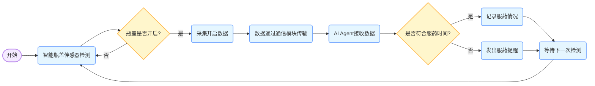

# 智能瓶盖：AI Agent的药物服用提醒

> 关键词：智能瓶盖、AI Agent、药物服用提醒、物联网、传感器技术

> 摘要：本文围绕智能瓶盖结合AI Agent实现药物服用提醒这一主题展开。首先介绍了智能瓶盖在医疗健康领域的背景和意义，阐述了其核心概念与相关架构。详细讲解了实现药物服用提醒的核心算法原理，并给出Python代码示例。深入探讨了相关的数学模型和公式，结合实际例子进行说明。通过项目实战展示了开发环境搭建、源代码实现及代码解读。分析了智能瓶盖在不同场景下的实际应用，推荐了学习该领域知识的工具和资源。最后总结了未来发展趋势与挑战，并对常见问题进行解答，提供了扩展阅读和参考资料。

## 1. 背景介绍 
### 1.1 目的和范围
随着人口老龄化的加剧以及慢性疾病患者数量的增加，按时准确服药对于患者的健康恢复至关重要。然而，由于各种原因，如健忘、复杂的服药方案等，患者常常不能按时服药，这可能导致治疗效果不佳甚至病情恶化。智能瓶盖结合AI Agent的药物服用提醒系统旨在解决这一问题，通过实时监测瓶盖的开启情况，利用AI Agent进行智能分析和决策，及时提醒患者按时服药。本文的范围涵盖了智能瓶盖的工作原理、核心算法、数学模型、实际应用案例以及相关的工具和资源等方面。

### 1.2 预期读者
本文预期读者包括医疗科技领域的开发者、研究人员，对物联网和人工智能应用感兴趣的技术爱好者，以及关注医疗健康产品创新的专业人士。

### 1.3 文档结构概述
本文首先介绍智能瓶盖与AI Agent药物服用提醒的背景信息，包括目的、预期读者和文档结构。接着阐述核心概念与联系，通过文本示意图和Mermaid流程图展示其架构。然后详细讲解核心算法原理和具体操作步骤，并给出Python代码示例。之后介绍相关的数学模型和公式，结合实例进行说明。通过项目实战展示代码的实际应用和解读。分析实际应用场景，推荐学习该领域的工具和资源。最后总结未来发展趋势与挑战，解答常见问题，并提供扩展阅读和参考资料。

### 1.4 术语表
#### 1.4.1 核心术语定义
- **智能瓶盖**：一种集成了传感器、通信模块等技术的瓶盖，能够实时监测瓶盖的开启和关闭状态，并将数据传输到外部设备。
- **AI Agent**：人工智能代理，是一种能够感知环境、进行决策并采取行动的智能实体。在本文中，AI Agent根据智能瓶盖传输的数据和预设的服药方案，判断患者是否按时服药，并发出提醒。
- **药物服用提醒**：根据患者的服药方案，在合适的时间提醒患者按时服药的功能。

#### 1.4.2 相关概念解释
- **物联网（IoT）**：通过各种信息传感器、射频识别技术、全球定位系统等各种装置与技术，实时采集任何需要监控、连接、互动的物体或过程，采集其声、光、热、电、力学、化学、生物、位置等各种需要的信息，通过各类可能的网络接入，实现物与物、物与人的泛在连接，实现对物品和过程的智能化感知、识别和管理。智能瓶盖就是物联网在医疗健康领域的一个应用实例。
- **传感器技术**：能感受规定的被测量并按照一定的规律转换成可用信号的器件或装置，通常由敏感元件和转换元件组成。智能瓶盖中常用的传感器有霍尔传感器、加速度传感器等，用于检测瓶盖的开启和关闭状态。

#### 1.4.3 缩略词列表
- **IoT**：Internet of Things，物联网
- **AI**：Artificial Intelligence，人工智能

## 2. 核心概念与联系 
智能瓶盖结合AI Agent实现药物服用提醒的核心概念涉及多个方面，下面通过文本示意图和Mermaid流程图进行详细说明。

### 文本示意图
智能瓶盖主要由传感器模块、通信模块和微控制器组成。传感器模块用于实时监测瓶盖的开启和关闭状态，常见的传感器有霍尔传感器、加速度传感器等。通信模块负责将传感器采集到的数据传输到外部设备，如智能手机或云端服务器，常用的通信方式有蓝牙、Wi-Fi等。微控制器则负责控制传感器和通信模块的工作，对采集到的数据进行初步处理。

AI Agent是整个系统的智能决策核心，它接收来自智能瓶盖传输的数据，并结合预设的服药方案进行分析和判断。如果发现患者未按时服药，AI Agent会通过多种方式发出提醒，如推送消息、语音提醒等。

智能瓶盖与AI Agent之间通过通信网络进行数据交互，形成一个闭环的智能系统，实现对患者药物服用情况的实时监测和提醒。

### Mermaid流程图


该流程图展示了智能瓶盖结合AI Agent实现药物服用提醒的工作流程。首先，智能瓶盖的传感器不断检测瓶盖的开启状态。当瓶盖开启时，采集开启数据并通过通信模块传输给AI Agent。AI Agent根据预设的服药方案判断当前开启是否符合服药时间，如果符合则记录服药情况，否则发出服药提醒。然后等待下一次检测，形成一个循环的监测和提醒过程。

## 3. 核心算法原理 & 具体操作步骤 
### 核心算法原理
实现药物服用提醒的核心算法主要包括数据采集、数据传输、数据处理和决策判断四个部分。

#### 数据采集
智能瓶盖中的传感器负责实时采集瓶盖的开启和关闭状态数据。例如，霍尔传感器通过检测磁场的变化来判断瓶盖是否开启，加速度传感器通过检测瓶盖的运动状态来判断其是否被打开。传感器将采集到的数据转换为电信号，并传输给微控制器。

#### 数据传输
微控制器对传感器采集到的数据进行初步处理后，通过通信模块将数据传输到外部设备。通信模块可以选择蓝牙、Wi-Fi等无线通信方式，将数据发送到智能手机或云端服务器。

#### 数据处理
AI Agent接收来自智能瓶盖传输的数据后，对数据进行进一步处理。首先，对数据进行清洗和预处理，去除噪声和异常值。然后，将处理后的数据与预设的服药方案进行比对。

#### 决策判断
根据数据处理的结果，AI Agent进行决策判断。如果当前瓶盖开启时间符合预设的服药时间，则记录患者的服药情况；如果不符合，则发出服药提醒。

### 具体操作步骤
以下是使用Python代码实现上述核心算法的具体操作步骤：

```python
import time

# 模拟智能瓶盖传感器数据采集
def collect_sensor_data():
    # 这里简单模拟传感器检测到瓶盖开启，实际应用中需要连接真实传感器
    import random
    return random.choice([True, False])

# 模拟数据传输
def transmit_data(data):
    # 这里简单打印传输的数据，实际应用中需要使用通信模块发送数据
    print(f"Transmitting data: {data}")
    return data

# 预设服药方案
medication_schedule = [
    {"time": "08:00", "medicine": "Medicine A"},
    {"time": "12:00", "medicine": "Medicine B"},
    {"time": "18:00", "medicine": "Medicine C"}
]

# 获取当前时间
def get_current_time():
    return time.strftime("%H:%M", time.localtime())

# AI Agent进行决策判断
def ai_agent_decision(data):
    current_time = get_current_time()
    for schedule in medication_schedule:
        if current_time == schedule["time"]:
            if data:
                print(f"Patient took {schedule['medicine']} at {current_time}")
            else:
                print(f"Reminder: It's time to take {schedule['medicine']} at {current_time}")
    return

# 主循环
while True:
    sensor_data = collect_sensor_data()
    transmitted_data = transmit_data(sensor_data)
    ai_agent_decision(transmitted_data)
    time.sleep(60)  # 每分钟检测一次
```

### 代码解释
1. **collect_sensor_data()**：模拟智能瓶盖传感器的数据采集，随机返回True或False，表示瓶盖是否开启。
2. **transmit_data(data)**：模拟数据传输过程，将采集到的数据打印出来，实际应用中需要使用通信模块将数据发送到外部设备。
3. **medication_schedule**：预设的服药方案，包含服药时间和对应的药物名称。
4. **get_current_time()**：获取当前时间，格式为“HH:MM”。
5. **ai_agent_decision(data)**：AI Agent进行决策判断的函数，根据当前时间和采集到的数据，判断患者是否按时服药，并输出相应的信息。
6. **主循环**：每分钟调用一次数据采集、数据传输和决策判断函数，实现对患者药物服用情况的实时监测和提醒。

## 4. 数学模型和公式 & 详细讲解 & 举例说明 
### 数学模型
在智能瓶盖结合AI Agent的药物服用提醒系统中，主要涉及到时间匹配和决策判断的数学模型。

#### 时间匹配模型
设 $T_{current}$ 为当前时间，$T_{schedule}$ 为预设的服药时间。时间匹配的条件可以表示为：

$$
\text{Match} = 
\begin{cases}
1, & \text{if } T_{current} = T_{schedule} \\
0, & \text{otherwise}
\end{cases}
$$

其中，$\text{Match}$ 为时间匹配标志，$1$ 表示匹配，$0$ 表示不匹配。

#### 决策判断模型
设 $D$ 为传感器采集到的瓶盖开启状态数据，$D = 1$ 表示瓶盖开启，$D = 0$ 表示瓶盖未开启。决策判断的条件可以表示为：

$$
\text{Decision} = 
\begin{cases}
\text{Record}, & \text{if } \text{Match} = 1 \text{ and } D = 1 \\
\text{Reminder}, & \text{if } \text{Match} = 1 \text{ and } D = 0 \\
\text{No action}, & \text{if } \text{Match} = 0
\end{cases}
$$

其中，$\text{Decision}$ 为决策结果，$\text{Record}$ 表示记录患者服药情况，$\text{Reminder}$ 表示发出服药提醒，$\text{No action}$ 表示不采取任何行动。

### 详细讲解
时间匹配模型用于判断当前时间是否与预设的服药时间一致。通过比较当前时间和预设服药时间，如果两者相等，则认为时间匹配，否则不匹配。

决策判断模型根据时间匹配结果和传感器采集到的瓶盖开启状态数据进行决策。如果时间匹配且瓶盖开启，则记录患者的服药情况；如果时间匹配但瓶盖未开启，则发出服药提醒；如果时间不匹配，则不采取任何行动。

### 举例说明
假设预设的服药时间为 $T_{schedule} = "08:00"$，当前时间为 $T_{current} = "08:00"$，传感器采集到的瓶盖开启状态数据为 $D = 1$。

首先，根据时间匹配模型，由于 $T_{current} = T_{schedule}$，所以 $\text{Match} = 1$。

然后，根据决策判断模型，由于 $\text{Match} = 1$ 且 $D = 1$，所以 $\text{Decision} = \text{Record}$，即记录患者在 $08:00$ 服用了药物。

如果当前时间为 $T_{current} = "09:00"$，则 $\text{Match} = 0$，根据决策判断模型，$\text{Decision} = \text{No action}$，即不采取任何行动。

如果当前时间为 $T_{current} = "08:00"$，但传感器采集到的瓶盖开启状态数据为 $D = 0$，则 $\text{Match} = 1$ 且 $D = 0$，根据决策判断模型，$\text{Decision} = \text{Reminder}$，即发出服药提醒。

## 5. 项目实战：代码实际案例和详细解释说明 
### 5.1  开发环境搭建
#### 硬件环境
- **智能瓶盖开发板**：选择一款支持传感器接入和通信功能的开发板，如Arduino、Raspberry Pi等。
- **传感器模块**：根据需求选择合适的传感器，如霍尔传感器、加速度传感器等。
- **通信模块**：选择蓝牙或Wi-Fi通信模块，实现与外部设备的数据传输。

#### 软件环境
- **开发工具**：安装Arduino IDE或Raspberry Pi的开发环境，用于编写和上传代码到开发板。
- **Python环境**：安装Python 3.x版本，用于实现AI Agent的决策判断功能。
- **相关库**：安装pyserial、bluepy等库，用于实现数据传输和通信功能。

### 5.2  源代码详细实现和代码解读
以下是一个基于Arduino和Python的完整项目示例：

#### Arduino代码（智能瓶盖端）
```cpp
#include <Wire.h>
#include <SPI.h>
#include <BluetoothSerial.h>

#if!defined(CONFIG_BT_ENABLED) ||!defined(CONFIG_BLUEDROID_ENABLED)
#error Bluetooth is not enabled! Please run `make menuconfig` to and enable it
#endif

BluetoothSerial SerialBT;

const int sensorPin = 2;  // 传感器连接的引脚

void setup() {
  Serial.begin(115200);
  SerialBT.begin("SmartCap"); // 蓝牙设备名称
  pinMode(sensorPin, INPUT);
}

void loop() {
  int sensorValue = digitalRead(sensorPin);  // 读取传感器数据
  SerialBT.println(sensorValue);  // 通过蓝牙发送数据
  delay(1000);  // 每秒发送一次数据
}
```

#### 代码解读
- `#include` 语句：引入必要的库，包括蓝牙通信库。
- `BluetoothSerial SerialBT;`：创建蓝牙串口对象。
- `setup()` 函数：初始化串口通信、蓝牙通信和传感器引脚。
- `loop()` 函数：循环读取传感器数据，并通过蓝牙发送到外部设备，每隔1秒发送一次。

#### Python代码（AI Agent端）
```python
import bluetooth
import time

# 预设服药方案
medication_schedule = [
    {"time": "08:00", "medicine": "Medicine A"},
    {"time": "12:00", "medicine": "Medicine B"},
    {"time": "18:00", "medicine": "Medicine C"}
]

# 获取当前时间
def get_current_time():
    return time.strftime("%H:%M", time.localtime())

# AI Agent进行决策判断
def ai_agent_decision(data):
    current_time = get_current_time()
    for schedule in medication_schedule:
        if current_time == schedule["time"]:
            if int(data) == 1:
                print(f"Patient took {schedule['medicine']} at {current_time}")
            else:
                print(f"Reminder: It's time to take {schedule['medicine']} at {current_time}")
    return

# 连接蓝牙设备
target_name = "SmartCap"
target_address = None

nearby_devices = bluetooth.discover_devices()

for bdaddr in nearby_devices:
    if target_name == bluetooth.lookup_name(bdaddr):
        target_address = bdaddr
        break

if target_address is not None:
    print(f"Found target bluetooth device with address {target_address}")
    sock = bluetooth.BluetoothSocket(bluetooth.RFCOMM)
    sock.connect((target_address, 1))

    while True:
        data = sock.recv(1024).decode().strip()
        if data:
            ai_agent_decision(data)
else:
    print("Could not find target bluetooth device nearby")
```

#### 代码解读
- `bluetooth` 库：用于实现蓝牙通信功能。
- `medication_schedule`：预设的服药方案。
- `get_current_time()` 函数：获取当前时间。
- `ai_agent_decision(data)` 函数：AI Agent进行决策判断的函数，根据当前时间和接收到的传感器数据，判断患者是否按时服药，并输出相应的信息。
- 蓝牙连接部分：通过蓝牙发现设备功能查找目标蓝牙设备（智能瓶盖），并建立连接。
- 主循环：不断接收来自智能瓶盖的传感器数据，并调用决策判断函数进行处理。

### 5.3  代码解读与分析
#### 智能瓶盖端代码
智能瓶盖端的代码主要负责传感器数据的采集和蓝牙传输。通过 `digitalRead()` 函数读取传感器的状态，并通过蓝牙串口将数据发送到外部设备。

#### AI Agent端代码
AI Agent端的代码主要负责蓝牙连接、数据接收和决策判断。通过蓝牙发现设备功能查找智能瓶盖设备，并建立连接。在主循环中，不断接收来自智能瓶盖的传感器数据，并调用 `ai_agent_decision()` 函数进行决策判断。

整个项目通过蓝牙通信实现了智能瓶盖和AI Agent之间的数据交互，实现了对患者药物服用情况的实时监测和提醒。

## 6. 实际应用场景 
### 家庭护理
在家庭环境中，智能瓶盖结合AI Agent的药物服用提醒系统可以帮助老年人和慢性疾病患者按时服药。例如，老年人可能由于记忆力减退而忘记服药，该系统可以通过手机推送消息或语音提醒的方式，及时提醒他们按时服药。同时，系统还可以记录患者的服药情况，方便家属或医生了解患者的治疗进度。

### 医疗机构
在医疗机构中，该系统可以用于住院患者的药物管理。护士可以通过系统实时了解患者的服药情况，避免漏服或误服药物的情况发生。同时，系统还可以提供数据统计和分析功能，帮助医生更好地评估患者的治疗效果。

### 长期护理机构
在长期护理机构中，如养老院、康复中心等，该系统可以提高护理人员的工作效率，减少人工管理的工作量。护理人员可以通过系统快速了解每个患者的服药情况，及时进行提醒和记录。

## 7. 工具和资源推荐
### 7.1 学习资源推荐
#### 7.1.1 书籍推荐
- 《物联网技术与应用》：介绍了物联网的基本概念、技术原理和应用案例，对于理解智能瓶盖的物联网应用有很大帮助。
- 《人工智能基础》：讲解了人工智能的基本算法和模型，有助于深入理解AI Agent的决策判断原理。
- 《传感器技术》：详细介绍了各种传感器的工作原理和应用场景，对于选择和使用智能瓶盖中的传感器有指导作用。

#### 7.1.2 在线课程
- Coursera上的“物联网基础”课程：系统地介绍了物联网的技术架构和应用开发，通过实际案例帮助学员掌握物联网开发的基本技能。
- edX上的“人工智能导论”课程：由知名高校的教授授课，深入浅出地讲解了人工智能的核心概念和算法，适合初学者学习。
- Udemy上的“传感器技术与应用”课程：通过实际项目演示，介绍了各种传感器的使用方法和开发技巧。

#### 7.1.3 技术博客和网站
- 物联网世界（https://www.iotworld.com.cn/）：提供物联网领域的最新技术动态、产品评测和应用案例，是了解物联网行业发展的重要渠道。
- 人工智能头条（https://www.toutiao.com/ch/ai/）：汇聚了人工智能领域的前沿技术和研究成果，对于学习AI Agent相关知识有很大帮助。
- 传感器技术网（https://www.sensorexpo.com.cn/）：专注于传感器技术的研究和应用，提供传感器的选型、开发和应用等方面的知识和资源。

### 7.2 开发工具框架推荐
#### 7.2.1 IDE和编辑器
- Arduino IDE：专门用于Arduino开发板的集成开发环境，简单易用，适合初学者。
- PyCharm：一款功能强大的Python集成开发环境，提供代码编辑、调试、版本控制等功能，提高Python开发效率。
- Visual Studio Code：一款轻量级的代码编辑器，支持多种编程语言和插件扩展，可用于智能瓶盖和AI Agent的开发。

#### 7.2.2 调试和性能分析工具
- Arduino Serial Monitor：用于调试Arduino开发板，实时查看串口通信数据，方便排查问题。
- Py-Spy：一个Python性能分析工具，可以帮助开发者找出Python代码中的性能瓶颈，优化代码性能。
- Bluetooth Sniffer：蓝牙协议分析工具，用于分析蓝牙通信过程中的数据传输情况，帮助调试蓝牙通信问题。

#### 7.2.3 相关框架和库
- MQTT：一种轻量级的物联网消息传输协议，可用于智能瓶盖和AI Agent之间的数据通信。Python中可以使用 `paho-mqtt` 库实现MQTT通信。
- TensorFlow：一个开源的人工智能框架，可用于开发更复杂的AI Agent决策模型，如基于机器学习的服药提醒预测模型。
- Flask：一个轻量级的Python Web框架，可用于开发智能瓶盖和AI Agent的Web应用程序，实现数据的可视化和远程管理。

### 7.3 相关论文著作推荐
#### 7.3.1 经典论文
- "Internet of Things: A Survey"：全面介绍了物联网的概念、技术架构和应用场景，是物联网领域的经典论文之一。
- "Artificial Intelligence: A Modern Approach"：人工智能领域的权威著作，系统地介绍了人工智能的各种算法和模型，对于理解AI Agent的原理有重要参考价值。
- "Sensor Networks: A Survey"：对传感器网络的研究现状和发展趋势进行了综述，对于了解智能瓶盖中传感器的应用有帮助。

#### 7.3.2 最新研究成果
- 关注IEEE物联网学报（IEEE Internet of Things Journal）、ACM Transactions on Intelligent Systems and Technology等学术期刊，及时了解智能瓶盖和AI Agent相关的最新研究成果。
- 参加国际物联网会议（IEEE IoT）、人工智能会议（AAAI）等学术会议，与国内外专家学者交流最新的研究进展。

#### 7.3.3 应用案例分析
- 查阅医疗科技领域的应用案例报告，了解智能瓶盖结合AI Agent在实际医疗场景中的应用效果和经验教训。
- 关注科技媒体和行业报告，了解相关产品的市场应用情况和用户反馈。

## 8. 总结：未来发展趋势与挑战
### 未来发展趋势
- **智能化程度不断提高**：随着人工智能技术的不断发展，AI Agent将具备更强的学习和决策能力，能够根据患者的个体情况和历史服药数据，提供更加个性化的服药提醒方案。
- **与其他医疗设备集成**：智能瓶盖将与其他医疗设备，如智能手环、智能药盒等进行集成，实现更加全面的健康监测和管理。例如，结合智能手环的心率、睡眠等数据，综合判断患者的身体状况，调整服药提醒策略。
- **大数据和云计算应用**：通过大数据和云计算技术，将大量患者的服药数据进行存储和分析，挖掘数据背后的潜在价值。例如，分析不同地区、不同年龄段患者的服药习惯和治疗效果，为医疗决策提供参考。

### 挑战
- **数据安全和隐私问题**：智能瓶盖和AI Agent系统涉及患者的个人健康数据，数据安全和隐私保护是一个重要的挑战。需要采用先进的加密技术和安全机制，确保数据不被泄露和滥用。
- **技术标准和兼容性**：目前智能瓶盖和相关技术的标准尚未统一，不同厂商的产品可能存在兼容性问题。需要建立统一的技术标准和规范，促进产品的互联互通和互操作性。
- **用户接受度**：部分患者可能对智能瓶盖和AI Agent系统存在疑虑和不信任，担心设备的可靠性和使用的便利性。需要加强用户教育和宣传，提高用户对该技术的接受度和认可度。

## 9. 附录：常见问题与解答
### 1. 智能瓶盖的电池续航能力如何？
智能瓶盖的电池续航能力取决于多个因素，如传感器的功耗、通信模块的使用频率等。一般来说，采用低功耗的传感器和通信模块，并合理设计电源管理策略，可以使智能瓶盖的电池续航时间达到数周甚至数月。

### 2. 智能瓶盖能否适应不同类型的药瓶？
智能瓶盖的设计通常考虑了通用性，可以适应不同尺寸和形状的药瓶。一些智能瓶盖采用了可调节的结构，能够适配多种规格的药瓶。

### 3. AI Agent的决策判断是否准确？
AI Agent的决策判断准确性取决于预设的服药方案和传感器采集的数据准确性。在实际应用中，需要确保服药方案的设置正确，并对传感器进行定期校准和维护，以提高决策判断的准确性。

### 4. 智能瓶盖和AI Agent系统是否需要网络连接？
如果采用蓝牙通信方式，智能瓶盖和AI Agent系统可以在本地进行数据交互，不需要网络连接。但如果需要将数据上传到云端服务器进行存储和分析，或者通过手机推送消息进行提醒，则需要网络连接。

## 10. 扩展阅读 & 参考资料
- [物联网技术原理与应用](https://book.douban.com/subject/27013804/)
- [人工智能：一种现代的方法](https://book.douban.com/subject/1076300/)
- [传感器技术与应用](https://book.douban.com/subject/27013803/)
- IEEE Internet of Things Journal
- ACM Transactions on Intelligent Systems and Technology

作者：AI天才研究院/AI Genius Institute & 禅与计算机程序设计艺术 /Zen And The Art of Computer Programming