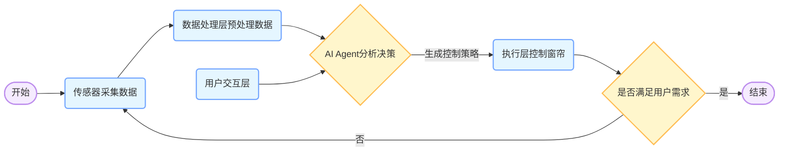

# 智能窗帘：AI Agent的日光利用优化系统

> 关键词：智能窗帘、AI Agent、日光利用优化、自动化系统、节能、用户体验

> 摘要：本文围绕智能窗帘的AI Agent日光利用优化系统展开，深入探讨了其背景、核心概念、算法原理、数学模型、项目实战、实际应用场景等多方面内容。首先介绍了该系统的开发背景和意义，阐述了相关核心概念及联系，通过Python代码详细讲解了核心算法原理和操作步骤。同时，给出了数学模型和公式并举例说明，以实际案例展示了系统的代码实现和解读。分析了其在不同场景下的应用，并推荐了相关的学习资源、开发工具和论文著作。最后总结了未来发展趋势与挑战，解答了常见问题并提供了扩展阅读与参考资料，旨在全面深入地介绍智能窗帘的AI Agent日光利用优化系统，为相关领域的研究和实践提供参考。

## 1. 背景介绍 
### 1.1 目的和范围
在当今追求绿色、智能生活的时代，如何高效利用自然资源成为了研究的热点之一。日光作为一种清洁、可再生的能源，其合理利用对于降低建筑能耗、提高室内环境质量具有重要意义。智能窗帘的AI Agent日光利用优化系统的目的在于通过先进的人工智能技术，实现对窗帘的智能控制，以最大化地利用日光，减少人工照明的使用，从而达到节能的效果。同时，该系统还能根据用户的个性化需求，提供舒适的室内光照环境，提升用户体验。

本系统的范围涵盖了从数据采集、处理到窗帘控制的整个流程。包括对室外光照强度、室内光照需求、时间、天气等多方面数据的收集和分析，以及基于这些数据生成合理的窗帘控制策略，最终实现对窗帘的自动化控制。

### 1.2 预期读者
本文的预期读者包括对智能家居技术感兴趣的爱好者、从事智能建筑领域研究的科研人员、相关专业的学生以及智能窗帘系统的开发人员和工程师等。无论是想要了解智能窗帘系统基本原理的初学者，还是希望深入研究其技术细节和应用的专业人士，都能从本文中获得有价值的信息。

### 1.3 文档结构概述
本文将按照以下结构进行阐述：首先介绍智能窗帘的AI Agent日光利用优化系统的背景知识，包括目的、预期读者和文档结构等。接着深入探讨核心概念与联系，通过文本示意图和Mermaid流程图展示系统的架构和工作原理。然后详细讲解核心算法原理和具体操作步骤，结合Python代码进行说明。之后给出数学模型和公式，并举例说明其应用。再通过项目实战，展示系统的代码实际案例和详细解释。分析该系统在实际中的应用场景，推荐相关的工具和资源。最后总结未来发展趋势与挑战，解答常见问题并提供扩展阅读与参考资料。

### 1.4 术语表
#### 1.4.1 核心术语定义
- **智能窗帘**：一种具备自动化控制功能的窗帘系统，能够根据不同的环境条件和用户需求进行自动调节。
- **AI Agent**：人工智能代理，是一种能够感知环境、进行推理决策并采取行动的智能实体，在本系统中用于实现对窗帘的智能控制。
- **日光利用优化**：通过合理的策略和方法，最大化地利用日光资源，减少人工照明的使用，提高能源利用效率。
- **自动化系统**：利用计算机技术和控制理论，实现对设备或过程的自动控制，无需人工干预或只需少量人工干预。

#### 1.4.2 相关概念解释
- **光照强度**：指单位面积上所接受可见光的光通量，单位为勒克斯（lx），是衡量日光强度的重要指标。
- **传感器**：用于检测环境中的各种物理量，如光照强度、温度、湿度等，并将其转换为电信号或数字信号，为系统提供数据支持。
- **控制策略**：根据系统的目标和环境条件，制定的一系列决策规则，用于指导系统的行为，在本系统中即用于控制窗帘的开合程度和时间。

#### 1.4.3 缩略词列表
- **AI**：Artificial Intelligence，人工智能
- **IoT**：Internet of Things，物联网
- **PID**：Proportional - Integral - Derivative，比例 - 积分 - 微分，一种常用的控制算法

## 2. 核心概念与联系 
### 核心概念原理
智能窗帘的AI Agent日光利用优化系统主要基于以下几个核心概念：

#### 数据采集与感知
系统通过各种传感器实时采集环境数据，包括室外光照强度、室内光照强度、时间、天气等信息。这些传感器就像系统的“眼睛”和“耳朵”，为AI Agent提供了了解环境状态的依据。例如，光照传感器可以测量当前的光照强度，时间传感器可以提供当前的时间信息，天气传感器可以获取天气状况，如晴天、阴天、雨天等。

#### 人工智能决策
AI Agent接收到传感器采集的数据后，利用人工智能算法进行分析和推理。根据预设的目标和规则，AI Agent会生成相应的控制策略。例如，如果室外光照强度足够且室内光照需求较低，AI Agent可能会决定将窗帘完全打开，以充分利用日光；如果室外光照过强，可能会将窗帘部分关闭，以避免室内光线过亮。

#### 窗帘控制执行
根据AI Agent生成的控制策略，系统会向窗帘执行机构发送控制信号，实现对窗帘的开合程度和时间的精确控制。窗帘执行机构可以是电机驱动的电动窗帘，通过接收控制信号来调整窗帘的位置。

### 架构的文本示意图
智能窗帘的AI Agent日光利用优化系统的架构主要包括以下几个部分：

#### 传感器层
负责采集环境数据，包括光照传感器、时间传感器、天气传感器等。这些传感器将采集到的数据发送到数据处理层。

#### 数据处理层
对传感器采集到的数据进行预处理，包括数据清洗、滤波、归一化等操作，以提高数据的质量和可用性。处理后的数据将被发送到AI Agent层。

#### AI Agent层
是系统的核心，利用人工智能算法对处理后的数据进行分析和决策。根据预设的目标和规则，生成窗帘控制策略。

#### 执行层
根据AI Agent层生成的控制策略，向窗帘执行机构发送控制信号，实现对窗帘的控制。

#### 用户交互层
提供用户与系统进行交互的接口，用户可以通过手机APP、遥控器等方式对系统进行设置和控制，如设置个性化的光照需求、定时开关窗帘等。

### Mermaid流程图


## 3. 核心算法原理 & 具体操作步骤 
### 核心算法原理
本系统主要采用基于规则的算法和机器学习算法相结合的方式进行决策。

#### 基于规则的算法
基于规则的算法是根据预设的规则来生成控制策略。例如，设定在白天（时间范围为早上7点到晚上7点），当室外光照强度大于10000lx且室内光照强度大于500lx时，将窗帘完全打开；当室外光照强度大于10000lx但室内光照强度小于300lx时，将窗帘部分打开。这些规则可以根据不同的环境和用户需求进行调整。

#### 机器学习算法
机器学习算法可以通过对大量历史数据的学习，自动发现数据中的规律和模式，从而生成更智能的控制策略。例如，可以使用神经网络算法，将传感器采集到的数据作为输入，窗帘的控制状态作为输出，对神经网络进行训练。训练好的神经网络可以根据当前的环境数据预测出最优的窗帘控制状态。

### 具体操作步骤
#### 数据采集
使用光照传感器、时间传感器、天气传感器等采集环境数据。以下是一个简单的Python代码示例，模拟光照传感器采集数据：
```python
import random

def get_light_intensity():
    # 模拟光照传感器采集数据，范围在0 - 20000lx之间
    return random.randint(0, 20000)
```
#### 数据处理
对采集到的数据进行预处理，包括数据清洗、滤波、归一化等操作。以下是一个简单的数据归一化代码示例：
```python
def normalize_data(data, min_value, max_value):
    # 归一化数据到0 - 1之间
    return (data - min_value) / (max_value - min_value)
```
#### 决策生成
根据基于规则的算法或机器学习算法生成控制策略。以下是一个基于规则的决策生成代码示例：
```python
def generate_control_strategy(outdoor_light, indoor_light):
    if outdoor_light > 10000 and indoor_light > 500:
        return "完全打开"
    elif outdoor_light > 10000 and indoor_light < 300:
        return "部分打开"
    else:
        return "关闭"
```
#### 窗帘控制
根据生成的控制策略，向窗帘执行机构发送控制信号。以下是一个简单的模拟窗帘控制代码示例：
```python
def control_curtain(strategy):
    print(f"当前窗帘控制策略：{strategy}")
    # 这里可以添加实际的控制代码，如向电机发送控制信号
```
#### 完整代码示例
```python
import random

def get_light_intensity():
    # 模拟光照传感器采集数据，范围在0 - 20000lx之间
    return random.randint(0, 20000)

def normalize_data(data, min_value, max_value):
    # 归一化数据到0 - 1之间
    return (data - min_value) / (max_value - min_value)

def generate_control_strategy(outdoor_light, indoor_light):
    if outdoor_light > 10000 and indoor_light > 500:
        return "完全打开"
    elif outdoor_light > 10000 and indoor_light < 300:
        return "部分打开"
    else:
        return "关闭"

def control_curtain(strategy):
    print(f"当前窗帘控制策略：{strategy}")
    # 这里可以添加实际的控制代码，如向电机发送控制信号

if __name__ == "__main__":
    outdoor_light = get_light_intensity()
    indoor_light = get_light_intensity()
    print(f"室外光照强度：{outdoor_light} lx")
    print(f"室内光照强度：{indoor_light} lx")
    strategy = generate_control_strategy(outdoor_light, indoor_light)
    control_curtain(strategy)
```

## 4. 数学模型和公式 & 详细讲解 & 举例说明 
### 数学模型
本系统主要涉及到光照强度的计算和控制策略的优化，以下是相关的数学模型。

#### 光照强度计算模型
假设室内某点的光照强度 $I_{indoor}$ 由室外光照强度 $I_{outdoor}$、窗帘的透光率 $\tau$ 和窗户的面积 $A$ 决定，可以用以下公式表示：
$$I_{indoor} = I_{outdoor} \times \tau \times A$$

其中，$\tau$ 的取值范围在 $0$ 到 $1$ 之间，$0$ 表示窗帘完全关闭，不透光；$1$ 表示窗帘完全打开，透光率为 $100\%$。

#### 控制策略优化模型
控制策略的优化目标是在满足用户光照需求 $I_{demand}$ 的前提下，最大化地利用日光，减少人工照明的使用。可以定义一个目标函数 $J$ 来表示：
$$J = \alpha \times (I_{indoor} - I_{demand})^2 + \beta \times (1 - \tau)$$

其中，$\alpha$ 和 $\beta$ 是权重系数，用于平衡光照强度误差和窗帘透光率的影响。通过最小化目标函数 $J$，可以得到最优的窗帘透光率 $\tau^*$。

### 详细讲解
#### 光照强度计算模型
该模型考虑了室外光照强度、窗帘的透光率和窗户的面积对室内光照强度的影响。室外光照强度越大，窗帘的透光率越高，窗户的面积越大，室内光照强度就越大。通过调整窗帘的透光率，可以控制室内光照强度，以满足用户的需求。

#### 控制策略优化模型
目标函数 $J$ 由两部分组成：第一部分 $\alpha \times (I_{indoor} - I_{demand})^2$ 表示室内光照强度与用户需求之间的误差的平方，用于衡量光照强度的满足程度；第二部分 $\beta \times (1 - \tau)$ 表示窗帘的遮光程度，用于鼓励最大化地利用日光。通过调整权重系数 $\alpha$ 和 $\beta$，可以根据不同的需求和场景来平衡这两部分的影响。

### 举例说明
假设室外光照强度 $I_{outdoor} = 15000$ lx，窗户的面积 $A = 2$ $m^2$，用户的光照需求 $I_{demand} = 800$ lx，权重系数 $\alpha = 0.8$，$\beta = 0.2$。

首先，根据光照强度计算模型，室内光照强度 $I_{indoor} = I_{outdoor} \times \tau \times A = 15000 \times \tau \times 2 = 30000\tau$。

然后，将 $I_{indoor}$ 代入目标函数 $J$ 中：
$$J = 0.8 \times (30000\tau - 800)^2 + 0.2 \times (1 - \tau)$$

为了找到最优的窗帘透光率 $\tau^*$，可以对目标函数 $J$ 求导数，并令导数等于 $0$：
$$\frac{dJ}{d\tau} = 0.8 \times 2 \times (30000\tau - 800) \times 30000 - 0.2 = 0$$

解方程可得：
$$48000 \times (30000\tau - 800) = 0.2$$
$$30000\tau - 800 = \frac{0.2}{48000}$$
$$30000\tau = \frac{0.2}{48000} + 800$$
$$\tau = \frac{\frac{0.2}{48000} + 800}{30000} \approx 0.0267$$

即最优的窗帘透光率约为 $2.67\%$，此时可以在满足用户光照需求的前提下，最大化地利用日光。

## 5. 项目实战：代码实际案例和详细解释说明 
### 5.1  开发环境搭建
#### 硬件环境
- **传感器**：选择合适的光照传感器、时间传感器、天气传感器等，如BH1750光照传感器、DS3231时间传感器等。
- **微控制器**：可以选择Arduino、Raspberry Pi等微控制器作为系统的控制核心。
- **窗帘执行机构**：选择电动窗帘电机，如步进电机或直流电机，并配备相应的驱动模块。

#### 软件环境
- **开发语言**：选择Python作为主要的开发语言，因为Python具有丰富的库和工具，便于进行数据处理、机器学习和控制算法的实现。
- **开发工具**：可以使用PyCharm、Thonny等集成开发环境（IDE）进行代码的编写和调试。
- **操作系统**：如果使用Raspberry Pi作为微控制器，可以选择Raspbian操作系统。

### 5.2  源代码详细实现和代码解读
#### 传感器数据采集代码
```python
import smbus
import time

# BH1750光照传感器初始化
DEVICE = 0x23  # 传感器I2C地址
POWER_DOWN = 0x00  # 关机指令
POWER_ON = 0x01  # 开机指令
RESET = 0x07  # 重置指令
CONTINUOUS_LOW_RES_MODE = 0x13  # 连续低分辨率模式
CONTINUOUS_HIGH_RES_MODE_1 = 0x10  # 连续高分辨率模式1
CONTINUOUS_HIGH_RES_MODE_2 = 0x11  # 连续高分辨率模式2
ONE_TIME_HIGH_RES_MODE_1 = 0x20  # 单次高分辨率模式1
ONE_TIME_HIGH_RES_MODE_2 = 0x21  # 单次高分辨率模式2
ONE_TIME_LOW_RES_MODE = 0x23  # 单次低分辨率模式

bus = smbus.SMBus(1)  # I2C总线

def convertToNumber(data):
    # 将传感器数据转换为光照强度值
    result = (data[1] + (256 * data[0])) / 1.2
    return (result)

def readLight(addr=DEVICE):
    # 读取光照强度
    data = bus.read_i2c_block_data(addr, ONE_TIME_HIGH_RES_MODE_1)
    return convertToNumber(data)

if __name__ == "__main__":
    while True:
        light_level = readLight()
        print("光照强度: " + str(light_level) + " lx")
        time.sleep(1)
```
**代码解读**：这段代码实现了对BH1750光照传感器的初始化和数据读取。首先定义了传感器的I2C地址和各种操作指令，然后通过`convertToNumber`函数将传感器采集到的数据转换为光照强度值，最后通过`readLight`函数读取光照强度并打印输出。

#### 窗帘控制代码
```python
import RPi.GPIO as GPIO
import time

# 定义电机控制引脚
IN1 = 17
IN2 = 18
ENA = 22

# 初始化GPIO
GPIO.setmode(GPIO.BCM)
GPIO.setup(IN1, GPIO.OUT)
GPIO.setup(IN2, GPIO.OUT)
GPIO.setup(ENA, GPIO.OUT)

# 定义PWM对象
pwm = GPIO.PWM(ENA, 100)
pwm.start(0)

def open_curtain():
    # 打开窗帘
    GPIO.output(IN1, GPIO.HIGH)
    GPIO.output(IN2, GPIO.LOW)
    pwm.ChangeDutyCycle(50)
    time.sleep(5)  # 假设打开窗帘需要5秒
    pwm.ChangeDutyCycle(0)

def close_curtain():
    # 关闭窗帘
    GPIO.output(IN1, GPIO.LOW)
    GPIO.output(IN2, GPIO.HIGH)
    pwm.ChangeDutyCycle(50)
    time.sleep(5)  # 假设关闭窗帘需要5秒
    pwm.ChangeDutyCycle(0)

if __name__ == "__main__":
    try:
        open_curtain()
        time.sleep(5)
        close_curtain()
    except KeyboardInterrupt:
        GPIO.cleanup()
```
**代码解读**：这段代码实现了对电动窗帘电机的控制。首先定义了电机控制引脚，然后初始化GPIO并创建PWM对象。`open_curtain`函数用于打开窗帘，通过设置电机的正转信号和PWM占空比来控制电机转动，`close_curtain`函数用于关闭窗帘，通过设置电机的反转信号和PWM占空比来控制电机转动。

#### 综合控制代码
```python
import smbus
import time
import RPi.GPIO as GPIO

# BH1750光照传感器初始化
DEVICE = 0x23  # 传感器I2C地址
POWER_DOWN = 0x00  # 关机指令
POWER_ON = 0x01  # 开机指令
RESET = 0x07  # 重置指令
CONTINUOUS_LOW_RES_MODE = 0x13  # 连续低分辨率模式
CONTINUOUS_HIGH_RES_MODE_1 = 0x10  # 连续高分辨率模式1
CONTINUOUS_HIGH_RES_MODE_2 = 0x11  # 连续高分辨率模式2
ONE_TIME_HIGH_RES_MODE_1 = 0x20  # 单次高分辨率模式1
ONE_TIME_HIGH_RES_MODE_2 = 0x21  # 单次高分辨率模式2
ONE_TIME_LOW_RES_MODE = 0x23  # 单次低分辨率模式

bus = smbus.SMBus(1)  # I2C总线

# 定义电机控制引脚
IN1 = 17
IN2 = 18
ENA = 22

# 初始化GPIO
GPIO.setmode(GPIO.BCM)
GPIO.setup(IN1, GPIO.OUT)
GPIO.setup(IN2, GPIO.OUT)
GPIO.setup(ENA, GPIO.OUT)

# 定义PWM对象
pwm = GPIO.PWM(ENA, 100)
pwm.start(0)

def convertToNumber(data):
    # 将传感器数据转换为光照强度值
    result = (data[1] + (256 * data[0])) / 1.2
    return (result)

def readLight(addr=DEVICE):
    # 读取光照强度
    data = bus.read_i2c_block_data(addr, ONE_TIME_HIGH_RES_MODE_1)
    return convertToNumber(data)

def open_curtain():
    # 打开窗帘
    GPIO.output(IN1, GPIO.HIGH)
    GPIO.output(IN2, GPIO.LOW)
    pwm.ChangeDutyCycle(50)
    time.sleep(5)  # 假设打开窗帘需要5秒
    pwm.ChangeDutyCycle(0)

def close_curtain():
    # 关闭窗帘
    GPIO.output(IN1, GPIO.LOW)
    GPIO.output(IN2, GPIO.HIGH)
    pwm.ChangeDutyCycle(50)
    time.sleep(5)  # 假设关闭窗帘需要5秒
    pwm.ChangeDutyCycle(0)

def generate_control_strategy(outdoor_light):
    if outdoor_light > 10000:
        return "打开"
    else:
        return "关闭"

if __name__ == "__main__":
    try:
        while True:
            outdoor_light = readLight()
            print("室外光照强度: " + str(outdoor_light) + " lx")
            strategy = generate_control_strategy(outdoor_light)
            if strategy == "打开":
                open_curtain()
            else:
                close_curtain()
            time.sleep(60)  # 每隔60秒检测一次
    except KeyboardInterrupt:
        GPIO.cleanup()
```
**代码解读**：这段代码综合了传感器数据采集和窗帘控制的功能。首先初始化光照传感器和电机控制引脚，然后通过`readLight`函数读取室外光照强度，根据`generate_control_strategy`函数生成控制策略，最后根据控制策略调用`open_curtain`或`close_curtain`函数来控制窗帘的开合。每隔60秒检测一次光照强度并更新窗帘状态。

### 5.3  代码解读与分析
#### 优点
- **模块化设计**：代码采用了模块化的设计思想，将传感器数据采集、窗帘控制和决策生成等功能分别封装成独立的函数，提高了代码的可读性和可维护性。
- **易于扩展**：可以很容易地添加其他传感器或控制设备，如温度传感器、湿度传感器等，以实现更复杂的功能。
- **实时性**：通过定时检测光照强度并更新窗帘状态，保证了系统的实时性和响应速度。

#### 缺点
- **简单的决策规则**：目前的决策规则比较简单，只考虑了室外光照强度，没有考虑室内光照需求、时间、天气等因素，可能无法满足用户的个性化需求。
- **缺乏机器学习算法**：没有使用机器学习算法进行决策，无法自动学习和优化控制策略，对于复杂的环境变化适应性较差。

#### 改进方向
- **完善决策规则**：考虑更多的因素，如室内光照需求、时间、天气等，制定更复杂的决策规则，以满足用户的个性化需求。
- **引入机器学习算法**：使用神经网络、决策树等机器学习算法，对大量的历史数据进行学习，自动生成更智能的控制策略，提高系统的适应性和性能。

## 6. 实际应用场景 
### 家庭住宅
在家庭住宅中，智能窗帘的AI Agent日光利用优化系统可以为用户提供舒适、节能的居住环境。例如，在白天，系统可以根据室外光照强度自动调整窗帘的开合程度，充分利用日光，减少人工照明的使用，降低能源消耗。同时，用户可以通过手机APP或遥控器设置个性化的光照需求和定时开关窗帘，满足不同的生活习惯和场景需求。

### 商业办公场所
在商业办公场所，智能窗帘系统可以提高办公环境的舒适度和工作效率。例如，在会议室、办公室等区域，系统可以根据室内人员的活动和光照需求，自动调整窗帘的状态，避免光线过强或过暗对人员造成影响。此外，系统还可以根据时间和天气情况，合理利用日光，减少人工照明和空调的使用，降低运营成本。

### 酒店
在酒店中，智能窗帘系统可以提升客人的入住体验。客人可以通过房间内的控制面板或手机APP轻松控制窗帘的开合，同时系统也可以根据客人的习惯和时间自动调整窗帘状态。例如，在早晨自动打开窗帘，让客人享受阳光的唤醒；在晚上自动关闭窗帘，提供舒适的睡眠环境。

### 学校
在学校中，智能窗帘系统可以为学生和教师提供良好的学习和教学环境。例如，在教室中，系统可以根据室外光照强度和室内人员的需求，自动调整窗帘的开合程度，保证教室光线均匀、适宜，减少学生的视觉疲劳。同时，系统还可以在课间休息时自动打开窗帘，让学生放松眼睛，提高学习效率。

## 7. 工具和资源推荐
### 7.1 学习资源推荐
#### 7.1.1 书籍推荐
- 《智能家居系统设计与实践》：本书详细介绍了智能家居系统的原理、设计方法和实践案例，对于学习智能窗帘系统的开发和应用具有重要的参考价值。
- 《Python机器学习实战》：该书介绍了Python在机器学习领域的应用，包括神经网络、决策树等算法的实现和应用，对于学习智能窗帘系统中的机器学习算法有很大的帮助。
- 《传感器技术与应用》：本书系统地介绍了各种传感器的原理、特性和应用，对于了解智能窗帘系统中传感器的选择和使用非常有用。

#### 7.1.2 在线课程
- Coursera上的“智能家居技术”课程：该课程由知名高校的教授授课，全面介绍了智能家居技术的发展趋势、原理和应用，适合对智能家居领域感兴趣的初学者和专业人士。
- edX上的“Python数据分析与机器学习”课程：该课程深入讲解了Python在数据分析和机器学习领域的应用，包括数据处理、模型训练和评估等内容，对于学习智能窗帘系统中的数据处理和机器学习算法有很大的帮助。
- 中国大学MOOC上的“传感器原理与应用”课程：该课程详细介绍了各种传感器的原理、特性和应用，通过实际案例和实验，帮助学习者更好地理解和掌握传感器技术。

#### 7.1.3 技术博客和网站
- 智能家居网：该网站提供了智能家居领域的最新资讯、技术文章和产品评测，对于了解智能窗帘系统的发展动态和市场趋势非常有帮助。
- 开源中国：该网站是国内知名的开源技术社区，提供了大量的开源代码和技术文章，对于学习智能窗帘系统的开发和应用有很大的参考价值。
- 博客园：该网站是一个技术博客平台，有很多开发者分享自己的技术经验和实践案例，对于学习智能窗帘系统的开发和调试有很大的帮助。

### 7.2 开发工具框架推荐
#### 7.2.1 IDE和编辑器
- PyCharm：是一款专业的Python集成开发环境，具有代码编辑、调试、自动补全、版本控制等功能，对于Python开发非常方便。
- Thonny：是一款简单易用的Python编辑器，适合初学者使用，具有直观的界面和调试功能。
- Visual Studio Code：是一款轻量级的代码编辑器，支持多种编程语言和插件扩展，对于智能窗帘系统的开发和调试非常方便。

#### 7.2.2 调试和性能分析工具
- PuTTY：是一款常用的远程登录工具，用于连接和调试基于Linux系统的微控制器，如Raspberry Pi。
- Wireshark：是一款网络协议分析工具，用于捕获和分析网络数据包，对于调试智能窗帘系统中的网络通信问题非常有用。
- cProfile：是Python的一个性能分析模块，用于分析Python代码的性能瓶颈，帮助开发者优化代码。

#### 7.2.3 相关框架和库
- Flask：是一个轻量级的Python Web框架，用于开发Web应用程序，可用于智能窗帘系统的用户交互层开发。
- TensorFlow：是一个开源的机器学习框架，用于构建和训练神经网络模型，可用于智能窗帘系统中的机器学习算法实现。
- GPIO Zero：是一个Python库，用于控制树莓派的GPIO引脚，对于智能窗帘系统中的电机控制非常方便。

### 7.3 相关论文著作推荐
#### 7.3.1 经典论文
- “Intelligent Curtain Control System Based on Artificial Intelligence”：该论文介绍了一种基于人工智能的智能窗帘控制系统，详细阐述了系统的架构、算法和实现方法，对于智能窗帘系统的研究具有重要的参考价值。
- “Energy - Efficient Daylight Utilization in Buildings Using Smart Curtains”：该论文研究了如何利用智能窗帘实现建筑物的节能日光利用，通过实验和模拟验证了系统的有效性和可行性。

#### 7.3.2 最新研究成果
- 近年来，随着人工智能和物联网技术的发展，关于智能窗帘系统的研究不断涌现。例如，一些研究采用深度学习算法对光照数据进行分析和预测，以实现更智能的窗帘控制；另一些研究则结合了人体行为识别技术，根据用户的行为习惯自动调整窗帘状态。

#### 7.3.3 应用案例分析
- 一些实际的智能窗帘系统应用案例，如某商业写字楼的智能窗帘系统改造项目，通过采用智能窗帘的AI Agent日光利用优化系统，实现了显著的节能效果和用户满意度提升。这些案例可以为智能窗帘系统的开发和应用提供实际参考。

## 8. 总结：未来发展趋势与挑战
### 未来发展趋势
#### 智能化程度不断提高
随着人工智能技术的不断发展，智能窗帘系统的智能化程度将不断提高。未来的智能窗帘系统将能够自动学习用户的习惯和偏好，根据不同的场景和需求，自动调整窗帘的状态，提供更加个性化、智能化的服务。

#### 与其他智能家居设备的集成
智能窗帘系统将与其他智能家居设备，如智能灯光、智能空调、智能门锁等进行深度集成，实现整个家居环境的智能化控制。例如，当智能门锁检测到用户回家时，智能窗帘可以自动打开；当智能空调检测到室内温度过高时，智能窗帘可以自动关闭，以减少阳光直射带来的热量。

#### 节能环保性能进一步提升
未来的智能窗帘系统将更加注重节能环保性能的提升。通过采用更先进的传感器技术和控制算法，系统可以更加精确地感知环境变化，合理利用日光，减少人工照明和空调的使用，降低能源消耗。

#### 外观设计更加美观和多样化
随着消费者对家居装饰美观性的要求不断提高，智能窗帘的外观设计将更加美观和多样化。未来的智能窗帘将不仅具有实用功能，还将成为家居装饰的一部分，满足不同消费者的审美需求。

### 挑战
#### 数据安全和隐私问题
智能窗帘系统需要采集和处理大量的用户数据，如光照强度、时间、用户行为习惯等，这些数据涉及用户的隐私和安全。因此，如何保障数据的安全和隐私，防止数据泄露和滥用，是智能窗帘系统面临的一个重要挑战。

#### 技术标准和兼容性问题
目前，智能窗帘系统的技术标准和规范还不够完善，不同品牌和厂家的产品之间存在兼容性问题。这给用户的选择和使用带来了不便，也限制了智能窗帘系统的推广和应用。因此，建立统一的技术标准和规范，提高产品的兼容性，是智能窗帘系统发展的必然趋势。

#### 成本和价格问题
智能窗帘系统的开发和生产成本相对较高，导致产品价格也比较昂贵。这使得一些消费者对智能窗帘系统望而却步，限制了其市场普及。因此，如何降低智能窗帘系统的成本和价格，提高产品的性价比，是智能窗帘系统发展需要解决的一个重要问题。

#### 用户接受度问题
尽管智能窗帘系统具有很多优点，但一些用户对新技术的接受度较低，仍然习惯于传统的手动窗帘。因此，如何提高用户对智能窗帘系统的认知和接受度，改变用户的使用习惯，是智能窗帘系统推广和应用的关键。

## 9. 附录：常见问题与解答
### 1. 智能窗帘系统的安装复杂吗？
智能窗帘系统的安装相对来说比较复杂，需要专业的技术人员进行操作。安装过程包括传感器的安装、微控制器的连接、窗帘执行机构的安装和调试等步骤。不同的智能窗帘系统安装方法可能会有所不同，具体可以参考产品的安装说明书或咨询厂家的技术支持人员。

### 2. 智能窗帘系统的使用寿命是多久？
智能窗帘系统的使用寿命取决于多个因素，如产品的质量、使用环境、使用频率等。一般来说，优质的智能窗帘系统的使用寿命可以达到5 - 10年。为了延长智能窗帘系统的使用寿命，建议定期对系统进行维护和保养，如清洁传感器、检查电机和驱动模块等。

### 3. 智能窗帘系统在停电时还能正常使用吗？
大部分智能窗帘系统在停电时无法正常使用，因为系统需要电力来驱动电机和传感器。但是，一些高端的智能窗帘系统配备了备用电源或手动控制功能，在停电时可以通过手动方式控制窗帘的开合。

### 4. 智能窗帘系统的安全性如何？
智能窗帘系统的安全性主要包括数据安全和物理安全两个方面。在数据安全方面，厂家会采取一系列的措施来保障用户数据的安全，如数据加密、访问控制等。在物理安全方面，智能窗帘系统的电机和驱动模块通常具有过载保护、短路保护等功能，以防止设备损坏和发生安全事故。

### 5. 智能窗帘系统可以与手机APP连接吗？
大部分智能窗帘系统都支持与手机APP连接，用户可以通过手机APP远程控制窗帘的开合、设置定时开关、查看传感器数据等。通过手机APP，用户可以更加方便地使用智能窗帘系统，提高生活的便利性。

## 10. 扩展阅读 & 参考资料
### 扩展阅读
- 《物联网技术与应用》：本书全面介绍了物联网的原理、技术和应用，对于了解智能窗帘系统所处的物联网环境有很大的帮助。
- 《人工智能原理与应用》：该书深入讲解了人工智能的基本原理和算法，对于理解智能窗帘系统中的人工智能决策过程非常有用。
- 《建筑节能技术》：本书介绍了建筑节能的各种技术和方法，对于了解智能窗帘系统在建筑节能中的作用和应用具有重要的参考价值。

### 参考资料
- 各智能窗帘系统厂家的产品说明书和技术文档。
- 相关的学术论文和研究报告，如IEEE、ACM等学术数据库中的论文。
- 智能家居行业的市场调研报告和分析报告。

作者：AI天才研究院/AI Genius Institute & 禅与计算机程序设计艺术 /Zen And The Art of Computer Programming