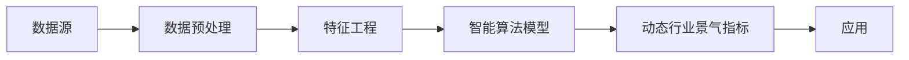

# 智能算法构建动态行业景气指标

> 关键词：智能算法、动态行业景气指标、机器学习、数据分析、时间序列、经济预测、行业评估

> 摘要：本文围绕智能算法构建动态行业景气指标展开深入探讨。在当今复杂多变的经济环境下，准确衡量行业的景气程度对于企业决策、投资者判断以及政策制定都具有至关重要的意义。传统的行业景气指标往往存在滞后性和静态性的问题，而智能算法的引入为解决这些问题提供了新的途径。文章首先介绍了相关背景知识，包括目的范围、预期读者等；接着阐述核心概念与联系，展示其原理和架构；详细讲解核心算法原理并给出 Python 代码示例；通过数学模型和公式进一步剖析；结合项目实战说明代码实现与解读；分析实际应用场景；推荐相关工具和资源；最后总结未来发展趋势与挑战，并对常见问题进行解答，旨在为读者全面呈现智能算法构建动态行业景气指标的全貌和应用价值。

## 1. 背景介绍 
### 1.1 目的和范围
在全球经济快速发展和变化的背景下，各个行业面临着不同的机遇和挑战。准确把握行业的景气状况，能够帮助企业及时调整战略、投资者做出合理的投资决策、政府制定有效的政策。本研究的目的在于利用智能算法构建动态行业景气指标，以更准确、及时地反映行业的发展态势。

范围涵盖多个行业，包括但不限于制造业、服务业、金融行业等。通过收集和分析这些行业的多源数据，运用智能算法挖掘数据中的潜在信息，构建出能够动态反映行业景气程度的指标体系。

### 1.2 预期读者
本文的预期读者包括从事金融分析、行业研究的专业人士，他们可以借助文中的方法和思路，更深入地了解行业动态，为投资决策和行业研究提供参考；企业的管理人员能够通过动态行业景气指标，及时调整企业的战略和运营策略；高校和科研机构的研究人员可以将其作为研究行业经济运行规律的参考，推动相关领域的学术研究；同时，对智能算法和经济数据分析感兴趣的爱好者也可以从中获取知识和启发。

### 1.3 文档结构概述
本文首先介绍背景知识，让读者了解研究的目的、范围、预期读者等信息。接着阐述核心概念与联系，包括智能算法、动态行业景气指标的原理和它们之间的关联，并通过示意图和流程图直观展示。然后详细讲解核心算法原理，结合 Python 代码进行说明，同时给出数学模型和公式进行理论支持。通过项目实战部分，展示如何将算法应用到实际中，包括开发环境搭建、源代码实现和代码解读。分析实际应用场景，说明动态行业景气指标在不同领域的应用价值。推荐相关的工具和资源，方便读者进一步学习和实践。最后总结未来发展趋势与挑战，解答常见问题，并提供扩展阅读和参考资料。

### 1.4 术语表
#### 1.4.1 核心术语定义
- **智能算法**：指利用机器学习、深度学习等技术，能够自动从数据中学习模式和规律，并进行预测和决策的算法。
- **动态行业景气指标**：一种能够随着时间变化，实时反映行业发展状况和趋势的量化指标。
- **机器学习**：一门多领域交叉学科，涉及概率论、统计学、逼近论、凸分析、算法复杂度理论等多门学科。它专门研究计算机怎样模拟或实现人类的学习行为，以获取新的知识或技能，重新组织已有的知识结构使之不断改善自身的性能。
- **时间序列分析**：一种统计分析方法，用于分析按时间顺序排列的数据，以揭示数据中的趋势、季节性和周期性等特征。

#### 1.4.2 相关概念解释
- **行业景气**：表示行业的繁荣程度，通常与行业的生产、销售、利润等经济指标相关。行业景气程度高意味着行业发展良好，市场需求旺盛，企业盈利增加；反之则表示行业面临困境。
- **数据挖掘**：从大量的、不完全的、有噪声的、模糊的、随机的数据中，提取隐含在其中的、人们事先不知道的、但又是潜在有用的信息和知识的过程。在构建动态行业景气指标中，数据挖掘用于从多源数据中发现与行业景气相关的信息。

#### 1.4.3 缩略词列表
- **AI**：Artificial Intelligence，人工智能
- **ML**：Machine Learning，机器学习
- **DL**：Deep Learning，深度学习
- **ARIMA**：AutoRegressive Integrated Moving Average，自回归积分滑动平均模型

## 2. 核心概念与联系 
### 核心概念原理
#### 智能算法
智能算法是构建动态行业景气指标的核心工具。机器学习算法如线性回归、决策树、随机森林等，可以从历史数据中学习行业景气与各种影响因素之间的关系，从而对未来的行业景气程度进行预测。深度学习算法如循环神经网络（RNN）、长短期记忆网络（LSTM）等，能够处理时间序列数据，捕捉数据中的长期依赖关系，更准确地反映行业景气的动态变化。

#### 动态行业景气指标
动态行业景气指标是基于多源数据构建的综合指标。它不仅考虑了行业的传统经济指标，如产值、销售额、利润等，还纳入了市场情绪、政策变化、技术创新等非传统因素。通过对这些数据的实时监测和分析，动态行业景气指标能够及时反映行业的发展态势，为决策者提供有价值的信息。

### 架构的文本示意图
```plaintext
数据源（行业经济数据、市场情绪数据、政策数据等）
    |
    v
数据预处理（清洗、转换、归一化等）
    |
    v
特征工程（提取与行业景气相关的特征）
    |
    v
智能算法模型（机器学习、深度学习等）
    |
    v
动态行业景气指标（实时更新）
    |
    v
应用（企业决策、投资分析、政策制定等）
```

### Mermaid 流程图


## 3. 核心算法原理 & 具体操作步骤 
### 核心算法原理
在构建动态行业景气指标中，我们将使用 LSTM 算法。LSTM 是一种特殊的 RNN，能够有效解决传统 RNN 中的梯度消失问题，适合处理时间序列数据。

LSTM 的核心结构包含三个门：输入门、遗忘门和输出门。遗忘门决定了上一时刻的细胞状态 $C_{t - 1}$ 有多少信息需要被遗忘；输入门决定了当前输入 $x_t$ 有多少信息需要被加入到细胞状态中；输出门决定了当前细胞状态 $C_t$ 有多少信息需要被输出到隐藏状态 $h_t$ 中。

### 具体操作步骤
1. **数据收集**：收集行业的多源数据，包括经济指标、市场情绪数据、政策数据等。
2. **数据预处理**：对收集到的数据进行清洗、转换和归一化处理，以提高数据质量和模型的训练效果。
3. **特征工程**：提取与行业景气相关的特征，如趋势特征、季节性特征等。
4. **数据集划分**：将预处理后的数据划分为训练集、验证集和测试集。
5. **模型构建**：使用 LSTM 构建模型，设置模型的参数，如神经元数量、层数等。
6. **模型训练**：使用训练集对模型进行训练，通过反向传播算法更新模型的参数。
7. **模型评估**：使用验证集和测试集对模型进行评估，计算模型的准确率、均方误差等指标。
8. **指标计算**：使用训练好的模型对实时数据进行预测，计算动态行业景气指标。

### Python 源代码示例
```python
import numpy as np
import pandas as pd
from sklearn.preprocessing import MinMaxScaler
from tensorflow.keras.models import Sequential
from tensorflow.keras.layers import LSTM, Dense

# 数据收集和预处理
data = pd.read_csv('industry_data.csv')
scaler = MinMaxScaler()
scaled_data = scaler.fit_transform(data)

# 数据集划分
train_size = int(len(scaled_data) * 0.8)
train_data = scaled_data[:train_size]
test_data = scaled_data[train_size:]

# 准备训练数据
def create_sequences(data, seq_length):
    xs, ys = [], []
    for i in range(len(data) - seq_length):
        x = data[i:i + seq_length]
        y = data[i + seq_length, 0]
        xs.append(x)
        ys.append(y)
    return np.array(xs), np.array(ys)

seq_length = 10
X_train, y_train = create_sequences(train_data, seq_length)
X_test, y_test = create_sequences(test_data, seq_length)

# 模型构建
model = Sequential()
model.add(LSTM(50, return_sequences=True, input_shape=(seq_length, X_train.shape[2])))
model.add(LSTM(50, return_sequences=False))
model.add(Dense(25))
model.add(Dense(1))

# 模型编译
model.compile(optimizer='adam', loss='mean_squared_error')

# 模型训练
model.fit(X_train, y_train, batch_size=32, epochs=50)

# 模型评估
predictions = model.predict(X_test)
predictions = scaler.inverse_transform(np.repeat(predictions, scaled_data.shape[1], axis=1))[:, 0]
y_test = scaler.inverse_transform(np.repeat(y_test.reshape(-1, 1), scaled_data.shape[1], axis=1))[:, 0]

# 计算均方误差
mse = np.mean((predictions - y_test) ** 2)
print(f"均方误差: {mse}")
```

## 4. 数学模型和公式 & 详细讲解 & 举例说明 
### LSTM 数学模型和公式
#### 遗忘门
遗忘门决定了上一时刻的细胞状态 $C_{t - 1}$ 有多少信息需要被遗忘。遗忘门的输出 $f_t$ 由当前输入 $x_t$ 和上一时刻的隐藏状态 $h_{t - 1}$ 计算得到：
$$
f_t = \sigma(W_f \cdot [h_{t - 1}, x_t] + b_f)
$$
其中，$W_f$ 是遗忘门的权重矩阵，$b_f$ 是遗忘门的偏置向量，$\sigma$ 是 sigmoid 函数，$[h_{t - 1}, x_t]$ 表示将 $h_{t - 1}$ 和 $x_t$ 拼接在一起。

#### 输入门
输入门决定了当前输入 $x_t$ 有多少信息需要被加入到细胞状态中。输入门的输出 $i_t$ 和候选细胞状态 $\tilde{C}_t$ 分别由以下公式计算：
$$
i_t = \sigma(W_i \cdot [h_{t - 1}, x_t] + b_i)
$$
$$
\tilde{C}_t = \tanh(W_C \cdot [h_{t - 1}, x_t] + b_C)
$$
其中，$W_i$ 和 $W_C$ 分别是输入门和候选细胞状态的权重矩阵，$b_i$ 和 $b_C$ 分别是输入门和候选细胞状态的偏置向量，$\tanh$ 是双曲正切函数。

#### 细胞状态更新
细胞状态 $C_t$ 由上一时刻的细胞状态 $C_{t - 1}$、遗忘门的输出 $f_t$、输入门的输出 $i_t$ 和候选细胞状态 $\tilde{C}_t$ 计算得到：
$$
C_t = f_t \odot C_{t - 1} + i_t \odot \tilde{C}_t
$$
其中，$\odot$ 表示逐元素相乘。

#### 输出门
输出门决定了当前细胞状态 $C_t$ 有多少信息需要被输出到隐藏状态 $h_t$ 中。输出门的输出 $o_t$ 和隐藏状态 $h_t$ 分别由以下公式计算：
$$
o_t = \sigma(W_o \cdot [h_{t - 1}, x_t] + b_o)
$$
$$
h_t = o_t \odot \tanh(C_t)
$$
其中，$W_o$ 是输出门的权重矩阵，$b_o$ 是输出门的偏置向量。

### 详细讲解
LSTM 通过三个门的机制，能够有效地捕捉时间序列数据中的长期依赖关系。遗忘门可以选择性地遗忘上一时刻的细胞状态中的信息，避免了梯度消失问题；输入门可以将当前输入中的有用信息加入到细胞状态中；输出门可以将细胞状态中的信息输出到隐藏状态中，用于后续的计算。

### 举例说明
假设我们有一个时间序列数据，记录了某行业的月度销售额。我们可以使用 LSTM 模型来预测未来的销售额。在每个时间步，LSTM 模型根据当前的销售额数据和上一时刻的隐藏状态，计算遗忘门、输入门和输出门的输出，更新细胞状态和隐藏状态，最终输出预测的销售额。通过不断地训练模型，调整模型的参数，我们可以得到一个准确的预测模型。

## 5. 项目实战：代码实际案例和详细解释说明 
### 5.1  开发环境搭建
#### 操作系统
可以选择 Windows、Linux 或 macOS 操作系统。

#### Python 环境
建议使用 Python 3.7 及以上版本。可以通过 Anaconda 或 Miniconda 来管理 Python 环境。

#### 安装依赖库
在命令行中执行以下命令安装所需的依赖库：
```sh
pip install numpy pandas scikit-learn tensorflow
```

### 5.2  源代码详细实现和代码解读
```python
import numpy as np
import pandas as pd
from sklearn.preprocessing import MinMaxScaler
from tensorflow.keras.models import Sequential
from tensorflow.keras.layers import LSTM, Dense

# 数据收集和预处理
# 读取行业数据文件
data = pd.read_csv('industry_data.csv')
# 使用 MinMaxScaler 对数据进行归一化处理，将数据缩放到 [0, 1] 范围内
scaler = MinMaxScaler()
scaled_data = scaler.fit_transform(data)

# 数据集划分
# 计算训练集的大小，占总数据的 80%
train_size = int(len(scaled_data) * 0.8)
train_data = scaled_data[:train_size]
test_data = scaled_data[train_size:]

# 准备训练数据
def create_sequences(data, seq_length):
    xs, ys = [], []
    for i in range(len(data) - seq_length):
        # 提取长度为 seq_length 的输入序列
        x = data[i:i + seq_length]
        # 提取对应的目标值
        y = data[i + seq_length, 0]
        xs.append(x)
        ys.append(y)
    return np.array(xs), np.array(ys)

# 序列长度
seq_length = 10
X_train, y_train = create_sequences(train_data, seq_length)
X_test, y_test = create_sequences(test_data, seq_length)

# 模型构建
model = Sequential()
# 添加第一个 LSTM 层，设置神经元数量为 50，return_sequences 为 True 表示返回序列
model.add(LSTM(50, return_sequences=True, input_shape=(seq_length, X_train.shape[2])))
# 添加第二个 LSTM 层，设置神经元数量为 50，return_sequences 为 False 表示不返回序列
model.add(LSTM(50, return_sequences=False))
# 添加全连接层，设置神经元数量为 25
model.add(Dense(25))
# 添加输出层，设置神经元数量为 1
model.add(Dense(1))

# 模型编译
# 使用 adam 优化器和均方误差损失函数
model.compile(optimizer='adam', loss='mean_squared_error')

# 模型训练
# 训练模型，设置批次大小为 32，训练轮数为 50
model.fit(X_train, y_train, batch_size=32, epochs=50)

# 模型评估
# 使用训练好的模型对测试数据进行预测
predictions = model.predict(X_test)
# 将预测结果反归一化
predictions = scaler.inverse_transform(np.repeat(predictions, scaled_data.shape[1], axis=1))[:, 0]
# 将真实值反归一化
y_test = scaler.inverse_transform(np.repeat(y_test.reshape(-1, 1), scaled_data.shape[1], axis=1))[:, 0]

# 计算均方误差
mse = np.mean((predictions - y_test) ** 2)
print(f"均方误差: {mse}")
```

### 5.3  代码解读与分析
1. **数据收集和预处理**：使用 `pandas` 库读取行业数据文件，并使用 `MinMaxScaler` 对数据进行归一化处理，将数据缩放到 [0, 1] 范围内，这有助于提高模型的训练效果。
2. **数据集划分**：将归一化后的数据划分为训练集和测试集，训练集占总数据的 80%。
3. **准备训练数据**：定义 `create_sequences` 函数，将数据转换为适合 LSTM 模型输入的序列数据。每个序列的长度为 `seq_length`，目标值为序列的下一个时间步的值。
4. **模型构建**：使用 `Sequential` 模型构建 LSTM 模型，包含两个 LSTM 层和两个全连接层。第一个 LSTM 层的 `return_sequences` 参数设置为 `True`，表示返回序列，以便后续的 LSTM 层处理；第二个 LSTM 层的 `return_sequences` 参数设置为 `False`，表示不返回序列。
5. **模型编译**：使用 `adam` 优化器和均方误差损失函数对模型进行编译。
6. **模型训练**：使用训练集对模型进行训练，设置批次大小为 32，训练轮数为 50。
7. **模型评估**：使用训练好的模型对测试数据进行预测，并将预测结果和真实值反归一化。计算预测结果和真实值之间的均方误差，评估模型的性能。

## 6. 实际应用场景 
### 企业决策
企业可以根据动态行业景气指标及时调整生产计划、营销策略和投资决策。当行业景气指标上升时，企业可以增加生产投入，扩大市场份额；当行业景气指标下降时，企业可以采取保守的经营策略，降低成本，减少风险。

### 投资分析
投资者可以利用动态行业景气指标评估不同行业的投资价值，选择具有潜力的行业进行投资。例如，当某个行业的景气指标持续上升时，说明该行业发展前景良好，投资者可以增加对该行业的投资；反之，则可以减少投资或避免投资。

### 政策制定
政府可以根据动态行业景气指标制定相应的产业政策，促进产业结构调整和经济发展。当某个行业的景气指标下降时，政府可以出台扶持政策，帮助企业渡过难关；当某个行业的景气指标过高时，政府可以采取调控措施，防止行业过热。

### 市场研究
市场研究机构可以利用动态行业景气指标分析市场趋势，为企业和投资者提供市场信息和决策建议。通过对不同行业的景气指标进行比较和分析，市场研究机构可以发现市场的热点和潜在机会，为客户提供有价值的研究报告。

## 7. 工具和资源推荐
### 7.1 学习资源推荐
#### 7.1.1 书籍推荐
- 《Python 机器学习》：本书详细介绍了 Python 在机器学习中的应用，包括数据预处理、模型选择、评估和优化等方面的内容，适合初学者学习。
- 《深度学习》：由深度学习领域的三位先驱 Ian Goodfellow、Yoshua Bengio 和 Aaron Courville 合著，是深度学习领域的经典教材，全面介绍了深度学习的理论和实践。
- 《时间序列分析及其应用：R 语言实例》：本书介绍了时间序列分析的基本理论和方法，并结合 R 语言进行实例分析，适合学习时间序列分析的读者。

#### 7.1.2 在线课程
- Coursera 上的《机器学习》课程：由 Andrew Ng 教授主讲，是机器学习领域的经典课程，系统地介绍了机器学习的基本概念、算法和应用。
- edX 上的《深度学习》课程：由 Berkeley 大学的教授主讲，深入介绍了深度学习的理论和实践，包括神经网络、卷积神经网络、循环神经网络等内容。
- 中国大学 MOOC 上的《Python 数据分析与应用》课程：介绍了 Python 在数据分析中的应用，包括数据处理、可视化、机器学习等方面的内容，适合初学者学习。

#### 7.1.3 技术博客和网站
- Medium：是一个技术博客平台，上面有很多关于机器学习、深度学习和数据分析的优秀文章，可以帮助读者了解最新的技术动态和研究成果。
- Kaggle：是一个数据科学竞赛平台，上面有很多数据集和优秀的解决方案，可以帮助读者提高数据处理和建模能力。
- Towards Data Science：是一个专注于数据科学和机器学习的网站，上面有很多高质量的文章和教程，可以帮助读者深入学习相关知识。

### 7.2 开发工具框架推荐
#### 7.2.1 IDE和编辑器
- PyCharm：是一款专门为 Python 开发设计的集成开发环境，具有代码编辑、调试、版本控制等功能，适合专业的 Python 开发者使用。
- Jupyter Notebook：是一个交互式的开发环境，支持多种编程语言，适合数据探索、模型训练和可视化等任务。
- Visual Studio Code：是一款轻量级的代码编辑器，支持多种编程语言和插件，具有丰富的功能和良好的用户体验。

#### 7.2.2 调试和性能分析工具
- TensorBoard：是 TensorFlow 提供的一个可视化工具，可以帮助用户监控模型的训练过程，分析模型的性能，如损失函数、准确率等。
- PyTorch Profiler：是 PyTorch 提供的一个性能分析工具，可以帮助用户分析模型的计算瓶颈，优化模型的性能。
- cProfile：是 Python 标准库中的一个性能分析工具，可以帮助用户分析 Python 代码的性能，找出性能瓶颈。

#### 7.2.3 相关框架和库
- TensorFlow：是一个开源的机器学习框架，由 Google 开发和维护，支持多种深度学习模型和算法，具有高效、灵活的特点。
- PyTorch：是一个开源的深度学习框架，由 Facebook 开发和维护，具有动态计算图、易于使用等特点，适合研究和开发。
- Scikit-learn：是一个开源的机器学习库，提供了丰富的机器学习算法和工具，如分类、回归、聚类等，适合初学者和快速开发。

### 7.3 相关论文著作推荐
#### 7.3.1 经典论文
- “Long Short-Term Memory”：由 Sepp Hochreiter 和 Jürgen Schmidhuber 发表于 1997 年，介绍了 LSTM 的基本原理和结构，是 LSTM 领域的经典论文。
- “Gradient-based learning applied to document recognition”：由 Yann LeCun、Léon Bottou、Yoshua Bengio 和 Patrick Haffner 发表于 1998 年，介绍了卷积神经网络（CNN）在手写字符识别中的应用，是 CNN 领域的经典论文。
- “Attention Is All You Need”：由 Ashish Vaswani 等人发表于 2017 年，介绍了 Transformer 模型的基本原理和结构，是自然语言处理领域的重要论文。

#### 7.3.2 最新研究成果
- 关注顶级学术会议如 NeurIPS、ICML、CVPR 等的最新论文，了解智能算法和机器学习领域的最新研究成果。
- 关注顶级学术期刊如 Journal of Machine Learning Research、Artificial Intelligence 等的最新论文，掌握相关领域的前沿动态。

#### 7.3.3 应用案例分析
- 可以参考一些行业报告和研究机构的分析报告，了解智能算法在不同行业中的应用案例和效果。
- 关注一些知名企业的技术博客，如 Google AI Blog、Facebook AI Research 等，了解他们在智能算法应用方面的实践经验。

## 8. 总结：未来发展趋势与挑战
### 未来发展趋势
#### 多源数据融合
未来，动态行业景气指标的构建将越来越依赖于多源数据的融合。除了传统的经济指标数据，还将纳入社交媒体数据、物联网数据、卫星图像数据等非传统数据，以更全面、准确地反映行业的发展态势。

#### 智能化决策支持
随着智能算法的不断发展，动态行业景气指标将不仅仅是一个量化指标，还将为决策者提供智能化的决策支持。通过结合机器学习和深度学习算法，对行业景气指标进行分析和预测，为企业、投资者和政府提供个性化的决策建议。

#### 实时监测和预警
未来，动态行业景气指标将实现实时监测和预警功能。通过实时收集和分析数据，及时发现行业的异常变化，为决策者提供预警信息，帮助他们及时采取措施，降低风险。

### 挑战
#### 数据质量和隐私问题
多源数据的融合带来了数据质量和隐私问题。不同来源的数据可能存在格式不一致、噪声大、缺失值等问题，需要进行有效的数据清洗和预处理。同时，数据的隐私保护也是一个重要的问题，需要采取有效的技术和管理措施，确保数据的安全和隐私。

#### 算法复杂度和可解释性
智能算法的复杂度越来越高，导致模型的可解释性越来越差。在实际应用中，决策者往往需要了解模型的决策过程和依据，以便做出合理的决策。因此，如何提高智能算法的可解释性是一个亟待解决的问题。

#### 技术更新换代快
智能算法和机器学习领域的技术更新换代非常快，新的算法和模型不断涌现。为了保持竞争力，需要不断学习和掌握新的技术，及时更新模型和方法。

## 9. 附录：常见问题与解答
### 1. 如何选择合适的智能算法构建动态行业景气指标？
选择合适的智能算法需要考虑数据的特点、问题的复杂度和应用场景等因素。如果数据是时间序列数据，可以选择 LSTM、GRU 等算法；如果数据是结构化数据，可以选择线性回归、决策树、随机森林等算法；如果数据是非结构化数据，可以选择深度学习算法如卷积神经网络（CNN）、Transformer 等。同时，还可以通过实验比较不同算法的性能，选择最优的算法。

### 2. 数据预处理的主要步骤有哪些？
数据预处理的主要步骤包括数据清洗、数据转换、数据归一化等。数据清洗主要是处理缺失值、异常值和重复值等问题；数据转换主要是将数据转换为适合模型输入的格式，如将分类变量转换为数值变量；数据归一化主要是将数据缩放到一个固定的范围内，如 [0, 1] 或 [-1, 1]，以提高模型的训练效果。

### 3. 如何评估动态行业景气指标的准确性？
可以使用多种指标评估动态行业景气指标的准确性，如均方误差（MSE）、均方根误差（RMSE）、平均绝对误差（MAE）、决定系数（$R^2$）等。同时，还可以通过比较动态行业景气指标与实际行业发展情况的一致性，进行定性评估。

### 4. 动态行业景气指标可以应用于哪些行业？
动态行业景气指标可以应用于各个行业，包括制造业、服务业、金融行业、能源行业等。不同行业的指标构建方法和影响因素可能会有所不同，需要根据具体情况进行调整和优化。

## 10. 扩展阅读 & 参考资料
### 扩展阅读
- 《智能时代》：介绍了人工智能在各个领域的应用和影响，帮助读者了解智能时代的发展趋势。
- 《大数据时代》：介绍了大数据的概念、技术和应用，帮助读者了解大数据时代的挑战和机遇。
- 《算法之美：指导工作与生活的算法》：介绍了算法在日常生活和工作中的应用，帮助读者了解算法的魅力和价值。

### 参考资料
- 相关的学术论文和研究报告，如发表在顶级学术期刊和会议上的论文。
- 相关的技术文档和官方网站，如 TensorFlow、PyTorch 等框架的官方文档。
- 相关的书籍和教材，如《Python 机器学习》、《深度学习》等。

作者：AI天才研究院/AI Genius Institute & 禅与计算机程序设计艺术 /Zen And The Art of Computer Programming