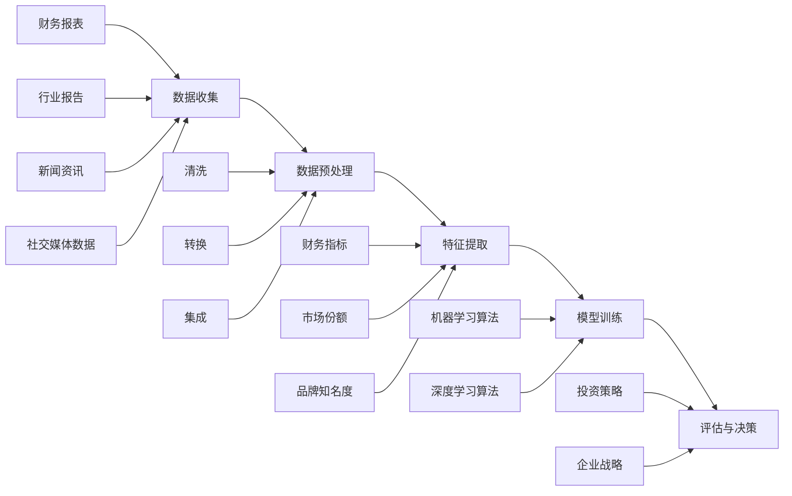

# 智能系统辅助公司护城河评估

> 关键词：智能系统、公司护城河、评估、数据分析、机器学习

> 摘要：本文围绕智能系统辅助公司护城河评估展开探讨。首先介绍了公司护城河评估的背景及相关概念，阐述了智能系统在其中的重要性。接着详细讲解了核心概念与联系，包括公司护城河的构成及智能系统的作用原理，并给出相应的示意图和流程图。在核心算法原理部分，使用 Python 源代码阐述了如何进行数据处理和分析。同时，通过数学模型和公式进一步解释评估的原理，并举例说明。项目实战部分提供了开发环境搭建、源代码实现与解读。随后介绍了智能系统辅助公司护城河评估的实际应用场景，推荐了相关的学习资源、开发工具框架和论文著作。最后总结了未来发展趋势与挑战，并对常见问题进行了解答，提供了扩展阅读与参考资料，旨在为相关从业者和研究者提供全面且深入的技术参考。

## 1. 背景介绍 
### 1.1 目的和范围
在当今竞争激烈的商业环境中，准确评估公司的护城河具有至关重要的意义。公司护城河是指企业抵御竞争对手、保持长期竞争优势的能力，它反映了企业在市场中的可持续盈利能力和稳定性。智能系统辅助公司护城河评估的目的在于利用先进的信息技术和数据分析手段，提高评估的准确性、效率和客观性。

本文章的范围涵盖了智能系统辅助公司护城河评估的各个方面，包括核心概念、算法原理、数学模型、项目实战、实际应用场景等，旨在为读者提供一个全面且深入的技术视角，帮助读者理解和掌握这一领域的关键技术和方法。

### 1.2 预期读者
本文预期读者包括但不限于金融分析师、投资经理、企业战略规划人员、数据科学家、人工智能研究者以及对公司护城河评估和智能系统应用感兴趣的技术爱好者和专业人士。

### 1.3 文档结构概述
本文共分为十个部分。第一部分为背景介绍，阐述了智能系统辅助公司护城河评估的目的、范围、预期读者和文档结构概述，并介绍了相关术语。第二部分讲解核心概念与联系，包括公司护城河的构成、智能系统的作用原理等，并给出文本示意图和 Mermaid 流程图。第三部分介绍核心算法原理及具体操作步骤，使用 Python 源代码详细阐述。第四部分讲解数学模型和公式，并通过举例进行说明。第五部分为项目实战，包括开发环境搭建、源代码详细实现和代码解读。第六部分介绍实际应用场景。第七部分推荐相关的工具和资源，包括学习资源、开发工具框架和论文著作。第八部分总结未来发展趋势与挑战。第九部分为附录，解答常见问题。第十部分提供扩展阅读与参考资料。

### 1.4 术语表
#### 1.4.1 核心术语定义
- **公司护城河（Economic Moat）**：由巴菲特提出，指企业所拥有的可持续竞争优势，如同城堡周围的护城河一样，保护企业免受竞争对手的侵袭，使其能够长期保持盈利和市场地位。
- **智能系统（Intelligent System）**：具备感知、学习、推理、决策等智能能力的计算机系统，通常基于人工智能、机器学习、数据分析等技术实现。
- **评估指标（Evaluation Index）**：用于衡量公司护城河的各种量化或非量化的因素，如品牌价值、成本优势、转换成本等。
- **机器学习（Machine Learning）**：一门多领域交叉学科，涉及概率论、统计学、逼近论、凸分析、算法复杂度理论等多门学科。它专门研究计算机怎样模拟或实现人类的学习行为，以获取新的知识或技能，重新组织已有的知识结构使之不断改善自身的性能。

#### 1.4.2 相关概念解释
- **竞争优势（Competitive Advantage）**：企业在市场中相对于竞争对手所具有的优势，包括成本优势、差异化优势、聚焦优势等。公司护城河是竞争优势的一种长期、可持续的表现形式。
- **数据挖掘（Data Mining）**：从大量的数据中通过算法搜索隐藏于其中信息的过程。在智能系统辅助公司护城河评估中，数据挖掘可用于发现潜在的评估指标和模式。
- **预测分析（Predictive Analytics）**：利用统计学、数据挖掘技术和机器学习算法，基于历史数据对未来事件或趋势进行预测的过程。在公司护城河评估中，预测分析可用于评估公司未来的竞争优势和盈利能力。

#### 1.4.3 缩略词列表
- **AI**：Artificial Intelligence，人工智能
- **ML**：Machine Learning，机器学习
- **NLP**：Natural Language Processing，自然语言处理
- **PCA**：Principal Component Analysis，主成分分析

## 2. 核心概念与联系 
### 公司护城河的构成
公司护城河主要由以下几个方面构成：
1. **无形资产**：包括品牌、专利、商标、政府许可等。品牌是消费者对企业产品或服务的认知和信任，强大的品牌可以吸引客户、提高产品价格和市场份额。专利和商标则保护企业的技术和知识产权，防止竞争对手模仿。政府许可则为企业进入某些行业或市场提供了门槛。
2. **转换成本**：指客户从一个产品或服务转换到另一个产品或服务时所面临的成本，包括时间成本、金钱成本、学习成本等。高转换成本使得客户不愿意轻易更换产品或服务，从而增强了企业的客户忠诚度。
3. **网络效应**：指产品或服务的价值随着用户数量的增加而增加的现象。例如，社交网络平台的用户越多，其对新用户的吸引力就越大，因为用户可以在平台上与更多的人进行交流和互动。
4. **成本优势**：企业通过规模经济、高效的生产流程、独特的资源获取渠道等方式降低成本，从而在价格上具有竞争优势。成本优势可以使企业在市场中获得更高的利润空间，或者以更低的价格吸引客户。
5. **有效规模**：在某些市场中，由于市场规模有限，只能容纳少数几家企业生存。这些企业通过合理的规模扩张和市场定位，形成了一种有效的规模，从而阻止了新的竞争对手进入市场。

### 智能系统的作用原理
智能系统在公司护城河评估中主要通过以下几个步骤发挥作用：
1. **数据收集**：智能系统通过各种渠道收集与公司相关的数据，包括财务报表、行业报告、新闻资讯、社交媒体数据等。这些数据涵盖了公司的各个方面，为评估提供了丰富的信息来源。
2. **数据预处理**：对收集到的数据进行清洗、转换、集成等预处理操作，去除噪声数据、处理缺失值、统一数据格式等，以提高数据的质量和可用性。
3. **特征提取**：从预处理后的数据中提取与公司护城河相关的特征，例如财务指标、市场份额、品牌知名度等。这些特征将作为评估模型的输入。
4. **模型训练**：使用机器学习或深度学习算法对提取的特征进行训练，建立评估模型。评估模型可以根据输入的特征预测公司的护城河强度。
5. **评估与决策**：将待评估公司的特征输入到训练好的评估模型中，得到公司的护城河评估结果。根据评估结果，决策者可以制定相应的投资策略、企业战略等。

### 文本示意图
```plaintext
智能系统辅助公司护城河评估

数据收集
|
|-- 财务报表
|-- 行业报告
|-- 新闻资讯
|-- 社交媒体数据

数据预处理
|
|-- 清洗
|-- 转换
|-- 集成

特征提取
|
|-- 财务指标
|-- 市场份额
|-- 品牌知名度

模型训练
|
|-- 机器学习算法
|-- 深度学习算法

评估与决策
|
|-- 投资策略
|-- 企业战略
```

### Mermaid 流程图


## 3. 核心算法原理 & 具体操作步骤 
### 数据预处理算法
在数据预处理阶段，我们需要对收集到的数据进行清洗、转换和集成等操作。以下是一个使用 Python 实现的数据预处理示例：

```python
import pandas as pd
import numpy as np

# 读取数据
data = pd.read_csv('company_data.csv')

# 清洗数据：处理缺失值
data = data.dropna()

# 转换数据：标准化处理
from sklearn.preprocessing import StandardScaler
scaler = StandardScaler()
numeric_columns = data.select_dtypes(include=[np.number]).columns
data[numeric_columns] = scaler.fit_transform(data[numeric_columns])

# 集成数据：合并不同来源的数据（假设还有另一个数据源）
another_data = pd.read_csv('another_data.csv')
merged_data = pd.merge(data, another_data, on='company_id')

print(merged_data.head())
```

### 特征提取算法
特征提取是从预处理后的数据中提取与公司护城河相关的特征。以下是一个使用主成分分析（PCA）进行特征提取的示例：

```python
from sklearn.decomposition import PCA

# 选择需要提取特征的列
features = merged_data.drop(['company_id'], axis=1)

# 应用 PCA 进行特征提取
pca = PCA(n_components=3)
reduced_features = pca.fit_transform(features)

print(reduced_features.shape)
```

### 模型训练算法
在模型训练阶段，我们可以使用多种机器学习算法，如逻辑回归、决策树、随机森林等。以下是一个使用随机森林进行模型训练的示例：

```python
from sklearn.ensemble import RandomForestClassifier
from sklearn.model_selection import train_test_split
from sklearn.metrics import accuracy_score

# 假设我们有一个标签列 'moat_strength' 表示公司护城河强度
labels = merged_data['moat_strength']

# 划分训练集和测试集
X_train, X_test, y_train, y_test = train_test_split(reduced_features, labels, test_size=0.2, random_state=42)

# 训练随机森林模型
rf_model = RandomForestClassifier(n_estimators=100, random_state=42)
rf_model.fit(X_train, y_train)

# 预测并评估模型
y_pred = rf_model.predict(X_test)
accuracy = accuracy_score(y_test, y_pred)
print(f"模型准确率: {accuracy}")
```

### 具体操作步骤
1. **数据收集**：使用网络爬虫、API 接口等工具收集与公司相关的数据。
2. **数据预处理**：使用 Python 的 Pandas 库进行数据清洗、转换和集成操作。
3. **特征提取**：使用 Scikit-learn 库中的 PCA 等算法进行特征提取。
4. **模型训练**：选择合适的机器学习算法，如随机森林、逻辑回归等，使用 Scikit-learn 库进行模型训练。
5. **评估与决策**：使用训练好的模型对新的公司数据进行评估，并根据评估结果制定相应的决策。

## 4. 数学模型和公式 & 详细讲解 & 举例说明 
### 主成分分析（PCA）的数学模型和公式
主成分分析（PCA）是一种常用的数据降维技术，其目标是找到数据的主成分，使得数据在这些主成分上的方差最大。

设数据集 $X = [x_1, x_2, \cdots, x_n]^T$，其中 $x_i \in \mathbb{R}^d$ 表示第 $i$ 个样本，$n$ 为样本数量，$d$ 为特征维度。PCA 的步骤如下：
1. **数据中心化**：计算样本的均值 $\mu = \frac{1}{n} \sum_{i=1}^{n} x_i$，并将每个样本减去均值，得到中心化后的数据 $X_c = X - \mu$。
2. **计算协方差矩阵**：协方差矩阵 $S = \frac{1}{n} X_c^T X_c$。
3. **特征值分解**：对协方差矩阵 $S$ 进行特征值分解，得到特征值 $\lambda_1 \geq \lambda_2 \geq \cdots \geq \lambda_d$ 和对应的特征向量 $u_1, u_2, \cdots, u_d$。
4. **选择主成分**：选择前 $k$ 个特征值对应的特征向量 $u_1, u_2, \cdots, u_k$ 作为主成分，其中 $k < d$。
5. **数据投影**：将中心化后的数据 $X_c$ 投影到主成分上，得到降维后的数据 $Z = X_c U_k$，其中 $U_k = [u_1, u_2, \cdots, u_k]$。

### 详细讲解
PCA 的核心思想是通过线性变换将原始数据投影到一个新的低维空间中，使得数据在这个低维空间中的方差最大。方差越大，说明数据在这个方向上的信息含量越高。因此，PCA 可以有效地提取数据的主要特征，减少数据的维度，同时保留数据的大部分信息。

### 举例说明
假设我们有一个二维数据集 $X = \begin{bmatrix} 1 & 2 \\ 2 & 3 \\ 3 & 4 \\ 4 & 5 \end{bmatrix}$，我们可以使用 PCA 对其进行降维。

1. **数据中心化**：
    - 计算均值 $\mu = \frac{1}{4} \begin{bmatrix} 1 + 2 + 3 + 4 \\ 2 + 3 + 4 + 5 \end{bmatrix} = \begin{bmatrix} 2.5 \\ 3.5 \end{bmatrix}$。
    - 中心化后的数据 $X_c = X - \mu = \begin{bmatrix} -1.5 & -1.5 \\ -0.5 & -0.5 \\ 0.5 & 0.5 \\ 1.5 & 1.5 \end{bmatrix}$。
2. **计算协方差矩阵**：
    - $S = \frac{1}{4} X_c^T X_c = \begin{bmatrix} 1.25 & 1.25 \\ 1.25 & 1.25 \end{bmatrix}$。
3. **特征值分解**：
    - 特征值 $\lambda_1 = 2.5$，$\lambda_2 = 0$。
    - 对应的特征向量 $u_1 = \begin{bmatrix} 0.707 \\ 0.707 \end{bmatrix}$，$u_2 = \begin{bmatrix} -0.707 \\ 0.707 \end{bmatrix}$。
4. **选择主成分**：
    - 选择特征值最大的特征向量 $u_1$ 作为主成分。
5. **数据投影**：
    - 降维后的数据 $Z = X_c u_1 = \begin{bmatrix} -2.121 \\ -0.707 \\ 0.707 \\ 2.121 \end{bmatrix}$。

通过 PCA，我们将二维数据降维到了一维，同时保留了数据的主要信息。

## 5. 项目实战：代码实际案例和详细解释说明 
### 5.1  开发环境搭建
1. **安装 Python**：建议使用 Python 3.7 及以上版本。可以从 Python 官方网站（https://www.python.org/downloads/） 下载并安装。
2. **安装必要的库**：使用以下命令安装所需的库：
```bash
pip install pandas numpy scikit-learn
```
3. **准备数据**：收集与公司相关的数据，并保存为 CSV 文件。确保数据文件包含所需的列，如公司 ID、财务指标、市场份额等。

### 5.2  源代码详细实现和代码解读
以下是一个完整的智能系统辅助公司护城河评估的代码示例：

```python
import pandas as pd
import numpy as np
from sklearn.preprocessing import StandardScaler
from sklearn.decomposition import PCA
from sklearn.ensemble import RandomForestClassifier
from sklearn.model_selection import train_test_split
from sklearn.metrics import accuracy_score

# 读取数据
data = pd.read_csv('company_data.csv')

# 数据预处理
# 处理缺失值
data = data.dropna()

# 标准化处理
numeric_columns = data.select_dtypes(include=[np.number]).columns
scaler = StandardScaler()
data[numeric_columns] = scaler.fit_transform(data[numeric_columns])

# 特征提取
features = data.drop(['company_id', 'moat_strength'], axis=1)
pca = PCA(n_components=3)
reduced_features = pca.fit_transform(features)

# 标签
labels = data['moat_strength']

# 划分训练集和测试集
X_train, X_test, y_train, y_test = train_test_split(reduced_features, labels, test_size=0.2, random_state=42)

# 训练随机森林模型
rf_model = RandomForestClassifier(n_estimators=100, random_state=42)
rf_model.fit(X_train, y_train)

# 预测并评估模型
y_pred = rf_model.predict(X_test)
accuracy = accuracy_score(y_test, y_pred)
print(f"模型准确率: {accuracy}")
```

### 代码解读与分析
1. **数据读取**：使用 Pandas 库的 `read_csv` 函数读取 CSV 文件中的数据。
2. **数据预处理**：
    - `dropna` 函数用于处理缺失值，删除包含缺失值的行。
    - `StandardScaler` 类用于对数值型数据进行标准化处理，使得数据的均值为 0，标准差为 1。
3. **特征提取**：
    - `drop` 函数用于删除不需要的列，如公司 ID 和标签列。
    - `PCA` 类用于进行主成分分析，将数据降维到 3 维。
4. **模型训练**：
    - `train_test_split` 函数用于将数据集划分为训练集和测试集，测试集占比为 20%。
    - `RandomForestClassifier` 类用于训练随机森林模型，设置树的数量为 100。
5. **模型评估**：
    - `predict` 函数用于对测试集进行预测。
    - `accuracy_score` 函数用于计算模型的准确率。

通过以上步骤，我们实现了一个简单的智能系统辅助公司护城河评估的项目。

## 6. 实际应用场景 
### 投资决策
在投资领域，智能系统辅助公司护城河评估可以帮助投资者更好地了解公司的竞争优势和可持续盈利能力。投资者可以根据评估结果选择具有较强护城河的公司进行投资，从而降低投资风险，提高投资回报率。例如，在股票投资中，投资者可以使用智能系统评估不同公司的护城河强度，优先选择护城河较宽的公司股票进行投资。

### 企业战略规划
对于企业来说，智能系统辅助公司护城河评估可以帮助企业管理者了解自身的竞争优势和劣势，制定相应的企业战略。企业可以根据评估结果加强自身的护城河，如提升品牌价值、降低成本、增加转换成本等，以提高企业的市场竞争力和可持续发展能力。例如，一家科技企业可以通过评估发现自身在技术研发方面具有较强的优势，从而加大研发投入，进一步巩固技术护城河。

### 行业分析
智能系统辅助公司护城河评估还可以用于行业分析，帮助分析师了解行业内不同公司的竞争格局和发展趋势。通过对行业内公司的护城河评估，分析师可以发现行业的领导者和潜在的挑战者，预测行业的未来发展方向。例如，在智能手机行业，分析师可以使用智能系统评估不同品牌手机厂商的护城河强度，分析行业的竞争态势和发展趋势。

### 风险管理
在金融机构的风险管理中，智能系统辅助公司护城河评估可以帮助评估企业的信用风险。具有较强护城河的企业通常具有更稳定的盈利能力和现金流，信用风险相对较低。金融机构可以根据评估结果调整信贷政策，降低信贷风险。例如，银行在审批企业贷款时，可以使用智能系统评估企业的护城河强度，对于护城河较宽的企业给予更优惠的贷款利率和更高的贷款额度。

## 7. 工具和资源推荐
### 7.1 学习资源推荐
#### 7.1.1 书籍推荐
- 《巴菲特的护城河》：这本书详细介绍了公司护城河的概念、构成和评估方法，是学习公司护城河评估的经典著作。
- 《机器学习》（周志华著）：一本全面介绍机器学习理论和算法的教材，对于理解智能系统中使用的机器学习算法非常有帮助。
- 《Python 数据分析实战》：介绍了如何使用 Python 进行数据分析，包括数据处理、可视化、机器学习等方面的内容。

#### 7.1.2 在线课程
- Coursera 上的 “机器学习” 课程：由斯坦福大学教授 Andrew Ng 讲授，是学习机器学习的经典在线课程。
- edX 上的 “数据科学与机器学习微硕士项目”：提供了系统的数据科学和机器学习课程，包括数据预处理、特征工程、模型训练等方面的内容。
- 中国大学 MOOC 上的 “Python 语言程序设计” 课程：适合初学者学习 Python 编程语言。

#### 7.1.3 技术博客和网站
- Medium：一个技术博客平台，上面有很多关于人工智能、机器学习、数据分析等领域的优秀文章。
- Kaggle：一个数据科学竞赛平台，上面有很多数据科学和机器学习的案例和教程。
- 博客园：国内的一个技术博客平台，有很多关于 Python、数据分析、机器学习等方面的技术文章。

### 7.2 开发工具框架推荐
#### 7.2.1 IDE和编辑器
- PyCharm：一款专业的 Python 集成开发环境，提供了丰富的代码编辑、调试、版本控制等功能。
- Jupyter Notebook：一个交互式的笔记本环境，适合进行数据分析和模型开发。
- Visual Studio Code：一款轻量级的代码编辑器，支持多种编程语言，并且有丰富的扩展插件。

#### 7.2.2 调试和性能分析工具
- PDB：Python 自带的调试工具，可以帮助开发者调试代码。
- Py-Spy：一个性能分析工具，可以帮助开发者分析 Python 代码的性能瓶颈。
- TensorBoard：一个可视化工具，用于可视化深度学习模型的训练过程和性能指标。

#### 7.2.3 相关框架和库
- Pandas：一个用于数据处理和分析的 Python 库，提供了丰富的数据结构和数据操作函数。
- NumPy：一个用于科学计算的 Python 库，提供了高效的数组操作和数学函数。
- Scikit-learn：一个用于机器学习的 Python 库，提供了各种机器学习算法和工具。
- TensorFlow：一个开源的深度学习框架，用于构建和训练深度学习模型。

### 7.3 相关论文著作推荐
#### 7.3.1 经典论文
- “A Machine Learning Approach to Predicting Stock Returns”：该论文介绍了如何使用机器学习算法预测股票回报率，对于智能系统辅助投资决策有一定的参考价值。
- “The Economic Moat and Firm Performance: Evidence from the S&P 500”：该论文研究了公司护城河与企业绩效之间的关系，为公司护城河评估提供了理论支持。

#### 7.3.2 最新研究成果
- 在顶级学术会议如 NeurIPS、ICML、KDD 等上发表的关于人工智能、机器学习在金融领域应用的研究论文。
- 在金融学术期刊如 The Journal of Finance、The Review of Financial Studies 等上发表的关于公司护城河评估和企业竞争优势的研究论文。

#### 7.3.3 应用案例分析
- 一些知名投资机构如巴菲特的伯克希尔·哈撒韦公司的投资案例分析，了解他们如何评估公司的护城河并进行投资决策。
- 一些大型企业的战略规划案例分析，了解他们如何通过加强自身的护城河来提高企业的竞争力。

## 8. 总结：未来发展趋势与挑战
### 未来发展趋势
1. **多模态数据融合**：未来的智能系统将不仅仅依赖于结构化的财务数据，还将融合非结构化的数据，如文本、图像、音频等。例如，通过分析新闻报道、社交媒体评论等文本数据，了解公众对公司品牌的评价；通过分析产品图片、视频等图像和音频数据，了解公司产品的特点和优势。多模态数据融合将为公司护城河评估提供更全面、更准确的信息。
2. **深度学习的广泛应用**：深度学习在图像识别、自然语言处理等领域取得了巨大的成功，未来将在公司护城河评估中得到更广泛的应用。例如，使用深度学习模型对公司的财务报表进行分析，提取更复杂的特征；使用自然语言处理技术对新闻资讯进行情感分析，了解市场对公司的看法。
3. **实时评估**：随着信息技术的发展，数据的获取和处理速度越来越快，未来的智能系统将能够实现对公司护城河的实时评估。投资者和企业管理者可以随时了解公司的竞争优势和发展态势，及时调整投资策略和企业战略。
4. **跨行业应用**：智能系统辅助公司护城河评估的方法和技术将不仅仅应用于金融和企业领域，还将扩展到其他行业，如医疗、教育、能源等。通过评估不同行业企业的护城河，为行业发展和政策制定提供参考。

### 挑战
1. **数据质量问题**：数据质量是智能系统辅助公司护城河评估的关键。由于数据来源广泛、数据格式多样，数据中可能存在噪声、缺失值、错误值等问题。如何保证数据的准确性、完整性和一致性是一个挑战。
2. **模型解释性问题**：深度学习模型等复杂的机器学习模型通常具有较高的预测准确率，但缺乏解释性。在公司护城河评估中，投资者和企业管理者需要了解模型的决策依据，以便做出合理的决策。如何提高模型的解释性是一个亟待解决的问题。
3. **隐私和安全问题**：在数据收集和处理过程中，涉及到大量的企业和用户隐私信息。如何保护这些隐私信息，防止数据泄露和滥用是一个重要的挑战。同时，智能系统的安全性也需要得到保障，防止黑客攻击和恶意破坏。
4. **行业差异问题**：不同行业的公司护城河构成和评估方法可能存在差异。如何根据不同行业的特点，开发出适合不同行业的评估模型和方法是一个挑战。

## 9. 附录：常见问题与解答
### 1. 智能系统辅助公司护城河评估的准确率有多高？
智能系统辅助公司护城河评估的准确率受到多种因素的影响，如数据质量、模型选择、特征提取等。一般来说，通过合理的数据预处理、特征工程和模型训练，评估的准确率可以达到一定的水平。但需要注意的是，公司护城河评估是一个复杂的问题，受到市场环境、行业竞争等多种因素的影响，因此评估结果只能作为参考，不能完全替代人工判断。

### 2. 如何选择合适的评估指标？
选择合适的评估指标需要考虑公司的行业特点、业务模式、竞争环境等因素。一般来说，可以从无形资产、转换成本、网络效应、成本优势、有效规模等方面选择相关的指标。同时，还可以参考行业研究报告、专家意见等，结合实际情况进行选择。

### 3. 智能系统评估结果与人工评估结果有何差异？
智能系统评估结果是基于数据和算法得出的，具有客观性和一致性的特点。而人工评估结果则受到评估人员的经验、知识、主观判断等因素的影响，可能存在一定的主观性和差异性。智能系统评估可以提供更全面、更快速的分析，但在一些复杂的情况下，人工评估的经验和判断仍然具有重要的作用。因此，在实际应用中，可以将智能系统评估结果和人工评估结果相结合，提高评估的准确性和可靠性。

### 4. 如何保证数据的安全性和隐私性？
为了保证数据的安全性和隐私性，可以采取以下措施：
- 数据加密：对敏感数据进行加密处理，防止数据在传输和存储过程中被泄露。
- 访问控制：设置严格的访问权限，只有授权人员才能访问和处理数据。
- 匿名化处理：在数据收集和处理过程中，对涉及个人隐私的信息进行匿名化处理，保护用户的隐私。
- 安全审计：定期对数据系统进行安全审计，及时发现和处理安全漏洞。

## 10. 扩展阅读 & 参考资料
### 扩展阅读
- 《价值投资实战手册》：进一步深入了解价值投资理念和公司评估方法。
- 《创新者的窘境》：探讨企业如何应对颠覆性创新，对于理解公司的竞争优势和护城河有一定的帮助。
- 《大数据时代》：了解大数据的概念、技术和应用，对于理解智能系统中数据的作用和价值有帮助。

### 参考资料
- 巴菲特致股东的信：https://www.berkshirehathaway.com/letters/letters.html
- Scikit-learn 官方文档：https://scikit-learn.org/stable/
- Pandas 官方文档：https://pandas.pydata.org/docs/
- NumPy 官方文档：https://numpy.org/doc/

作者：AI天才研究院/AI Genius Institute & 禅与计算机程序设计艺术 /Zen And The Art of Computer Programming