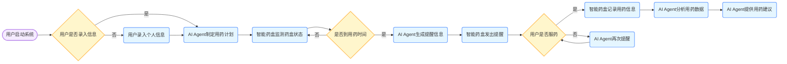

# 智能药盒：AI Agent的用药提醒系统

> 关键词：智能药盒、AI Agent、用药提醒系统、人工智能、医疗健康

> 摘要：本文围绕智能药盒的AI Agent用药提醒系统展开深入探讨。首先介绍了该系统的背景，包括目的、预期读者等内容。接着阐述了核心概念，给出了原理和架构的文本示意图及Mermaid流程图。详细讲解了核心算法原理和具体操作步骤，并结合Python源代码进行说明。同时，介绍了相关的数学模型和公式，通过举例加深理解。在项目实战部分，展示了开发环境搭建、源代码实现及解读。分析了实际应用场景，推荐了学习资源、开发工具框架和相关论文著作。最后总结了未来发展趋势与挑战，并给出常见问题解答和扩展阅读参考资料，旨在为智能药盒AI Agent用药提醒系统的研究和开发提供全面且深入的技术指导。

## 1. 背景介绍 
### 1.1 目的和范围
智能药盒的AI Agent用药提醒系统的主要目的是利用人工智能技术，为用户提供准确、个性化且便捷的用药提醒服务。在当今社会，人们面临着各种健康问题，需要按时服用不同种类的药物。然而，由于生活节奏快、事务繁忙等原因，很多人会忘记按时服药，这可能会影响治疗效果，甚至加重病情。本系统旨在解决这一问题，通过智能药盒与AI Agent的结合，实现自动化、智能化的用药提醒。

本系统的范围涵盖了从用户信息录入、用药计划制定、提醒功能实现到数据记录与分析等多个方面。它可以适用于家庭、养老院、医疗机构等多种场景，为不同年龄段和健康状况的用户提供服务。

### 1.2 预期读者
本文的预期读者主要包括以下几类人群：
- **医疗行业从业者**：如医生、护士等，他们可以了解如何利用智能药盒和AI Agent更好地管理患者的用药情况，提高治疗效果。
- **软件开发人员**：对人工智能和医疗健康领域感兴趣的程序员和软件工程师，他们可以参考本文的技术方案进行系统开发。
- **科研人员**：从事医疗信息技术、人工智能等相关领域研究的学者，他们可以从本文中获取研究灵感和参考资料。
- **普通用户**：关注自身健康管理，希望通过智能设备更好地管理用药的人群，他们可以了解智能药盒的工作原理和优势。

### 1.3 文档结构概述
本文将按照以下结构进行详细阐述：
- **核心概念与联系**：介绍智能药盒和AI Agent的核心概念，以及它们之间的联系，并给出原理和架构的文本示意图及Mermaid流程图。
- **核心算法原理 & 具体操作步骤**：讲解实现用药提醒系统的核心算法原理，并通过Python源代码详细说明具体操作步骤。
- **数学模型和公式 & 详细讲解 & 举例说明**：介绍相关的数学模型和公式，进行详细讲解，并通过实际例子加深理解。
- **项目实战：代码实际案例和详细解释说明**：展示如何搭建开发环境，实现源代码，并对代码进行详细解读和分析。
- **实际应用场景**：分析智能药盒的AI Agent用药提醒系统在不同场景下的应用。
- **工具和资源推荐**：推荐学习资源、开发工具框架和相关论文著作。
- **总结：未来发展趋势与挑战**：总结系统的未来发展趋势和面临的挑战。
- **附录：常见问题与解答**：解答读者可能遇到的常见问题。
- **扩展阅读 & 参考资料**：提供相关的扩展阅读材料和参考资料。

### 1.4 术语表
#### 1.4.1 核心术语定义
- **智能药盒**：一种具备智能化功能的药盒，通常集成了传感器、处理器、通信模块等，能够与用户进行交互，并根据预设的用药计划提供提醒服务。
- **AI Agent**：人工智能代理，是一种能够感知环境、自主决策并采取行动以实现特定目标的软件实体。在本系统中，AI Agent负责处理用户信息、制定用药计划、生成提醒信息等。
- **用药提醒系统**：利用智能设备和信息技术，为用户提供用药时间、剂量等提醒服务的系统。

#### 1.4.2 相关概念解释
- **传感器技术**：用于感知药盒的状态，如药盒是否打开、药物是否取出等。常见的传感器包括红外传感器、重力传感器等。
- **自然语言处理（NLP）**：使AI Agent能够理解用户的自然语言输入，并生成相应的回复。在本系统中，可用于用户与系统的交互，如用户查询用药信息等。
- **机器学习**：通过对大量的用药数据进行学习，AI Agent可以优化用药计划，提高提醒的准确性。

#### 1.4.3 缩略词列表
- **NLP**：Natural Language Processing（自然语言处理）
- **ML**：Machine Learning（机器学习）

## 2. 核心概念与联系 
### 核心概念原理
#### 智能药盒
智能药盒是整个系统的硬件基础，它通过内置的传感器实时监测药盒的状态。例如，红外传感器可以检测药盒是否被打开，重力传感器可以感知药物是否被取出。这些传感器将采集到的数据传输给药盒内部的处理器，处理器对数据进行处理和分析，判断用户是否按时服药。

#### AI Agent
AI Agent是系统的智能核心，它具备感知、决策和行动的能力。AI Agent可以通过与用户的交互，了解用户的基本信息、健康状况和用药需求，从而制定个性化的用药计划。在用药时间到达时，AI Agent会生成提醒信息，并通过智能药盒的显示屏、声音等方式提醒用户服药。同时，AI Agent还可以对用户的用药数据进行记录和分析，为用户提供用药建议和健康指导。

### 架构的文本示意图
智能药盒的AI Agent用药提醒系统主要由以下几个部分组成：
- **用户界面**：用户与系统进行交互的接口，包括智能药盒的显示屏、手机APP等。用户可以通过用户界面录入个人信息、设置用药计划、查询用药记录等。
- **AI Agent模块**：负责处理用户的请求，制定用药计划，生成提醒信息等。AI Agent模块与用户界面进行数据交互，接收用户的输入，并将处理结果反馈给用户。
- **智能药盒硬件**：包括传感器、处理器、通信模块等。传感器用于采集药盒的状态信息，处理器对数据进行处理和分析，通信模块用于与AI Agent模块进行数据传输。
- **数据库**：用于存储用户的个人信息、用药计划、用药记录等数据。AI Agent模块可以从数据库中读取数据，并将新的数据写入数据库。

### Mermaid流程图


该流程图展示了智能药盒的AI Agent用药提醒系统的工作流程。用户启动系统后，首先需要录入个人信息，AI Agent根据用户信息制定用药计划。智能药盒实时监测药盒状态，当到达用药时间时，AI Agent生成提醒信息，智能药盒发出提醒。用户服药后，智能药盒记录用药信息，AI Agent对用药数据进行分析，并提供用药建议。如果用户未服药，AI Agent会再次提醒。

## 3. 核心算法原理 & 具体操作步骤 
### 核心算法原理
#### 用药计划制定算法
用药计划制定算法的核心是根据用户的个人信息、健康状况和医生的建议，确定用药的时间、剂量和频率。在本系统中，我们可以使用规则引擎来实现用药计划的制定。规则引擎是一种基于规则的推理系统，它根据预设的规则对输入的数据进行匹配和推理，从而得出结论。

以下是一个简单的用药计划制定规则示例：
- 如果用户患有高血压，且年龄大于60岁，则每天早上8点服用降压药，剂量为5mg。
- 如果用户患有糖尿病，且血糖值高于正常范围，则每天晚上9点服用降糖药，剂量为10mg。

#### 提醒信息生成算法
提醒信息生成算法的主要任务是根据用药计划和当前时间，生成合适的提醒信息。在本系统中，我们可以使用自然语言生成（NLG）技术来生成提醒信息。自然语言生成是一种将结构化数据转换为自然语言文本的技术，它可以根据预设的模板和规则，生成个性化的提醒信息。

以下是一个简单的提醒信息生成模板示例：
- “尊敬的用户，现在是[用药时间]，您需要服用[药物名称]，剂量为[剂量]。请按时服药，祝您早日康复！”

### 具体操作步骤
#### 步骤1：用户信息录入
用户通过智能药盒的显示屏或手机APP录入个人信息，包括姓名、年龄、性别、健康状况、过敏史等。同时，用户还需要录入医生开具的用药处方，包括药物名称、剂量、用药时间和频率等。

#### 步骤2：用药计划制定
AI Agent根据用户录入的信息，使用用药计划制定算法生成个性化的用药计划。用药计划将存储在数据库中，以便后续查询和使用。

#### 步骤3：提醒信息生成
AI Agent实时监测当前时间，当到达用药时间时，使用提醒信息生成算法生成提醒信息。提醒信息将通过智能药盒的显示屏、声音等方式提醒用户服药。

#### 步骤4：用药数据记录
智能药盒通过传感器监测药盒的状态，当用户打开药盒取出药物时，智能药盒将记录用药时间和剂量等信息，并将数据传输给AI Agent。AI Agent将用药数据存储在数据库中，以便后续分析和使用。

#### 步骤5：用药数据分析
AI Agent定期对用户的用药数据进行分析，包括用药依从性、用药效果等。根据分析结果，AI Agent可以为用户提供用药建议和健康指导。

### Python源代码实现
```python
import datetime

# 用户信息类
class User:
    def __init__(self, name, age, health_status, prescriptions):
        self.name = name
        self.age = age
        self.health_status = health_status
        self.prescriptions = prescriptions

# 用药处方类
class Prescription:
    def __init__(self, drug_name, dosage, time, frequency):
        self.drug_name = drug_name
        self.dosage = dosage
        self.time = time
        self.frequency = frequency

# 用药计划制定函数
def create_medication_plan(user):
    medication_plan = []
    for prescription in user.prescriptions:
        # 简单示例：假设每天按照固定时间服药
        if prescription.frequency == "daily":
            medication_plan.append((prescription.drug_name, prescription.dosage, prescription.time))
    return medication_plan

# 提醒信息生成函数
def generate_reminder_message(drug_name, dosage, time):
    message = f"尊敬的用户，现在是{time}，您需要服用{drug_name}，剂量为{dosage}。请按时服药，祝您早日康复！"
    return message

# 主函数
def main():
    # 用户信息录入
    prescriptions = [Prescription("降压药", "5mg", "08:00", "daily")]
    user = User("张三", 65, "高血压", prescriptions)

    # 用药计划制定
    medication_plan = create_medication_plan(user)

    # 模拟当前时间
    current_time = datetime.datetime.now().strftime("%H:%M")

    # 检查是否到用药时间
    for drug_name, dosage, time in medication_plan:
        if current_time == time:
            # 生成提醒信息
            reminder_message = generate_reminder_message(drug_name, dosage, time)
            print(reminder_message)

if __name__ == "__main__":
    main()
```

以上代码实现了一个简单的智能药盒的AI Agent用药提醒系统。首先定义了用户信息类和用药处方类，然后实现了用药计划制定函数和提醒信息生成函数。在主函数中，模拟了用户信息录入、用药计划制定和提醒信息生成的过程。

## 4. 数学模型和公式 & 详细讲解 & 举例说明 
### 用药依从性模型
用药依从性是指患者按照医生的建议按时、按量服药的程度。在本系统中，我们可以使用以下数学模型来计算用药依从性：

$$
\text{用药依从性} = \frac{\text{实际服药次数}}{\text{应服药次数}} \times 100\%
$$

### 详细讲解
实际服药次数是指用户在一定时间内实际服用药物的次数，应服药次数是指根据用药计划用户应该服用药物的次数。通过计算用药依从性，我们可以了解用户的服药情况，及时发现用户是否存在漏服、误服等问题。

### 举例说明
假设用户的用药计划是每天早上8点服用降压药，连续服用30天。在这30天内，用户实际服用了25次降压药。则用户的用药依从性为：

$$
\text{用药依从性} = \frac{25}{30} \times 100\% \approx 83.33\%
$$

这表明用户的用药依从性较高，但仍有改进的空间。AI Agent可以根据用药依从性的计算结果，为用户提供相应的用药建议，如设置更频繁的提醒等。

### 用药效果评估模型
用药效果评估是指评估药物对用户健康状况的改善程度。在本系统中，我们可以使用以下数学模型来评估用药效果：

$$
\text{用药效果} = \frac{\text{治疗后指标值} - \text{治疗前指标值}}{\text{治疗前指标值}} \times 100\%
$$

### 详细讲解
治疗前指标值是指用户在开始服用药物之前的健康指标值，如血压、血糖等。治疗后指标值是指用户在服用药物一段时间后的健康指标值。通过计算用药效果，我们可以了解药物对用户健康状况的影响，判断药物是否有效。

### 举例说明
假设用户在开始服用降压药之前的血压为160/100mmHg，服用降压药一个月后的血压为130/80mmHg。则用户的用药效果为：

$$
\text{收缩压用药效果} = \frac{130 - 160}{160} \times 100\% \approx -18.75\%
$$

$$
\text{舒张压用药效果} = \frac{80 - 100}{100} \times 100\% = -20\%
$$

这表明降压药对用户的血压有明显的改善作用。AI Agent可以根据用药效果的评估结果，为用户提供调整用药剂量或更换药物的建议。

## 5. 项目实战：代码实际案例和详细解释说明 
### 5.1  开发环境搭建
#### 硬件环境
- **智能药盒**：选择一款具备传感器、处理器和通信模块的智能药盒，如Arduino、Raspberry Pi等。
- **传感器**：根据需求选择合适的传感器，如红外传感器、重力传感器等。
- **显示屏**：用于显示提醒信息和用户交互界面，如LCD显示屏、OLED显示屏等。

#### 软件环境
- **操作系统**：选择适合智能药盒硬件的操作系统，如Linux、Windows IoT等。
- **开发语言**：选择Python作为开发语言，因为Python具有简单易学、功能强大的特点，并且有丰富的库和框架可供使用。
- **开发工具**：选择合适的开发工具，如PyCharm、Visual Studio Code等。

### 5.2  源代码详细实现和代码解读
#### 传感器数据采集代码
```python
import RPi.GPIO as GPIO
import time

# 设置GPIO模式
GPIO.setmode(GPIO.BCM)

# 定义传感器引脚
SENSOR_PIN = 17

# 设置传感器引脚为输入模式
GPIO.setup(SENSOR_PIN, GPIO.IN)

def read_sensor_data():
    while True:
        sensor_value = GPIO.input(SENSOR_PIN)
        if sensor_value == GPIO.HIGH:
            print("药盒已打开")
        else:
            print("药盒未打开")
        time.sleep(1)

if __name__ == "__main__":
    try:
        read_sensor_data()
    except KeyboardInterrupt:
        GPIO.cleanup()
```

代码解读：
- 导入RPi.GPIO库用于控制树莓派的GPIO引脚，导入time库用于延时。
- 设置GPIO模式为BCM模式。
- 定义传感器引脚为17。
- 将传感器引脚设置为输入模式。
- 定义read_sensor_data函数，用于读取传感器数据。在函数中，使用while循环不断读取传感器值，如果传感器值为高电平，则表示药盒已打开，否则表示药盒未打开。
- 在主程序中，调用read_sensor_data函数，并在程序结束时清理GPIO引脚。

#### 提醒信息显示代码
```python
import Adafruit_SSD1306
from PIL import Image
from PIL import ImageDraw
from PIL import ImageFont

# 初始化OLED显示屏
disp = Adafruit_SSD1306.SSD1306_128_64(rst=None)
disp.begin()
disp.clear()
disp.display()

# 创建图像对象
width = disp.width
height = disp.height
image = Image.new('1', (width, height))
draw = ImageDraw.Draw(image)

# 加载字体
font = ImageFont.load_default()

def display_reminder_message(message):
    draw.rectangle((0, 0, width, height), outline=0, fill=0)
    draw.text((0, 0), message, font=font, fill=255)
    disp.image(image)
    disp.display()

if __name__ == "__main__":
    reminder_message = "尊敬的用户，现在是08:00，您需要服用降压药，剂量为5mg。请按时服药，祝您早日康复！"
    display_reminder_message(reminder_message)
```

代码解读：
- 导入Adafruit_SSD1306库用于控制OLED显示屏，导入PIL库用于图像处理。
- 初始化OLED显示屏，设置显示屏的分辨率和复位引脚。
- 创建图像对象和绘图对象。
- 加载默认字体。
- 定义display_reminder_message函数，用于显示提醒信息。在函数中，先清空显示屏，然后在图像上绘制提醒信息，最后将图像显示在显示屏上。
- 在主程序中，定义提醒信息并调用display_reminder_message函数显示提醒信息。

### 5.3  代码解读与分析
#### 传感器数据采集代码分析
传感器数据采集代码的主要功能是实时监测药盒的状态。通过读取传感器的值，我们可以判断药盒是否被打开。在实际应用中，我们可以根据传感器数据判断用户是否按时服药，并将服药信息记录到数据库中。

#### 提醒信息显示代码分析
提醒信息显示代码的主要功能是将提醒信息显示在OLED显示屏上。通过使用PIL库，我们可以在图像上绘制文本信息，并将图像显示在显示屏上。在实际应用中，我们可以根据用药计划生成提醒信息，并调用display_reminder_message函数显示提醒信息。

## 6. 实际应用场景 
### 家庭场景
在家庭场景中，智能药盒的AI Agent用药提醒系统可以为家庭成员提供便捷的用药提醒服务。老年人和儿童是容易忘记服药的人群，通过使用智能药盒，他们可以按时服药，提高治疗效果。同时，家庭成员可以通过手机APP远程查看老人和儿童的用药情况，及时了解他们的健康状况。

### 养老院场景
在养老院场景中，智能药盒的AI Agent用药提醒系统可以帮助护理人员更好地管理老人的用药情况。护理人员可以通过系统为老人制定用药计划，并设置提醒信息。当老人需要服药时，智能药盒会发出提醒，护理人员可以及时帮助老人服药。同时，系统可以记录老人的用药数据，为护理人员提供用药分析和建议。

### 医疗机构场景
在医疗机构场景中，智能药盒的AI Agent用药提醒系统可以为患者提供更加个性化的用药服务。医生可以通过系统为患者制定用药计划，并将用药信息发送到患者的智能药盒中。患者可以根据智能药盒的提醒按时服药，并将用药数据反馈给医生。医生可以根据患者的用药数据调整治疗方案，提高治疗效果。

## 7. 工具和资源推荐
### 7.1 学习资源推荐
#### 7.1.1 书籍推荐
- 《Python数据分析实战》：介绍了Python在数据分析领域的应用，包括数据处理、数据可视化、机器学习等方面的知识。
- 《人工智能基础教程》：系统地介绍了人工智能的基本概念、算法和应用，适合初学者入门。
- 《传感器技术与应用》：详细介绍了各种传感器的工作原理和应用场景，对于智能药盒的开发有很大的帮助。

#### 7.1.2 在线课程
- Coursera上的“Python for Data Science and Machine Learning Bootcamp”：由知名教授授课，讲解了Python在数据科学和机器学习领域的应用。
- edX上的“Artificial Intelligence”：介绍了人工智能的基本概念、算法和应用，通过实际案例帮助学员掌握人工智能的开发技巧。
- 中国大学MOOC上的“传感器原理及应用”：由国内高校教授授课，系统地介绍了传感器的工作原理和应用场景。

#### 7.1.3 技术博客和网站
- Medium：一个知名的技术博客平台，上面有很多关于人工智能、传感器技术等方面的文章。
- GitHub：一个开源代码托管平台，上面有很多智能药盒和AI Agent相关的开源项目，可以供开发者参考和学习。
- 知乎：一个知识分享社区，上面有很多关于智能药盒和医疗健康领域的讨论和经验分享。

### 7.2 开发工具框架推荐
#### 7.2.1 IDE和编辑器
- PyCharm：一款专门为Python开发设计的集成开发环境，具有代码自动补全、调试、版本控制等功能，适合Python开发者使用。
- Visual Studio Code：一款轻量级的代码编辑器，支持多种编程语言，具有丰富的插件和扩展功能，适合快速开发和调试。
- Arduino IDE：一款专门为Arduino开发设计的集成开发环境，具有简单易用的特点，适合初学者使用。

#### 7.2.2 调试和性能分析工具
- Py-Spy：一个用于Python代码性能分析的工具，可以帮助开发者找出代码中的性能瓶颈。
- GDB：一个通用的调试工具，支持多种编程语言，可以帮助开发者调试程序中的错误。
- Logic Analyzer：一个逻辑分析仪，可以用于调试传感器和通信模块的信号。

#### 7.2.3 相关框架和库
- Flask：一个轻量级的Web框架，适合开发小型的Web应用程序，可以用于搭建智能药盒的Web服务。
- TensorFlow：一个开源的机器学习框架，提供了丰富的机器学习算法和工具，可以用于开发AI Agent的机器学习模型。
- Adafruit CircuitPython：一个用于微控制器的Python库，提供了丰富的传感器和执行器驱动程序，可以用于智能药盒的开发。

### 7.3 相关论文著作推荐
#### 7.3.1 经典论文
- “Artificial Intelligence: A Modern Approach”：这是人工智能领域的经典教材，系统地介绍了人工智能的基本概念、算法和应用。
- “Machine Learning”：由Tom M. Mitchell编写，是机器学习领域的经典教材，详细介绍了机器学习的各种算法和模型。
- “Sensors and Actuators: An Introduction”：介绍了传感器和执行器的基本原理和应用，对于智能药盒的开发有很大的帮助。

#### 7.3.2 最新研究成果
- 在IEEE Xplore、ACM Digital Library等学术数据库中搜索“Smart Medicine Box”、“AI Agent for Medication Reminder”等关键词，可以找到关于智能药盒和AI Agent用药提醒系统的最新研究成果。

#### 7.3.3 应用案例分析
- 可以参考一些医疗健康领域的应用案例分析报告，了解智能药盒和AI Agent用药提醒系统在实际应用中的效果和经验。

## 8. 总结：未来发展趋势与挑战
### 未来发展趋势
#### 智能化程度不断提高
随着人工智能技术的不断发展，智能药盒的AI Agent用药提醒系统将变得更加智能化。AI Agent将能够根据用户的健康状况、生活习惯等因素，自动调整用药计划，提供更加个性化的用药建议。

#### 与其他医疗设备集成
智能药盒将与其他医疗设备如智能手环、智能血压计等集成，实现数据的共享和交互。通过整合多种医疗数据，AI Agent可以更全面地了解用户的健康状况，提供更加精准的用药提醒和健康指导。

#### 云服务的应用
智能药盒将与云服务相结合，实现数据的远程存储和管理。用户可以通过手机APP随时随地查看自己的用药记录和健康数据，医生也可以远程监控患者的用药情况，及时调整治疗方案。

### 挑战
#### 数据安全和隐私问题
智能药盒的AI Agent用药提醒系统涉及到用户的个人健康信息，数据安全和隐私问题是一个重要的挑战。系统需要采取有效的数据加密和安全措施，确保用户的个人信息不被泄露。

#### 算法的准确性和可靠性
AI Agent的算法准确性和可靠性直接影响到用药提醒的效果。系统需要不断优化算法，提高用药计划制定和提醒信息生成的准确性，同时确保系统在各种情况下都能稳定运行。

#### 用户接受度问题
智能药盒作为一种新型的医疗设备，用户对其接受度可能存在一定的问题。系统需要设计简单易用的用户界面，提高用户的使用体验，同时加强宣传和推广，提高用户对智能药盒的认知度和接受度。

## 9. 附录：常见问题与解答
### 问题1：智能药盒的电池续航能力如何？
解答：智能药盒的电池续航能力取决于其硬件配置和使用频率。一般来说，智能药盒采用低功耗的设计，电池续航时间可以达到数天甚至数周。在实际使用中，用户可以根据需要定期充电，以确保智能药盒的正常运行。

### 问题2：智能药盒是否可以与多个用户的手机APP连接？
解答：大多数智能药盒支持与多个用户的手机APP连接。这样，家庭成员可以通过各自的手机APP远程查看智能药盒的状态和用户的用药情况。在设置时，用户只需要在手机APP上添加智能药盒的设备信息，即可完成连接。

### 问题3：如果用户忘记携带智能药盒，是否还能收到用药提醒？
解答：如果智能药盒与手机APP连接，即使用户忘记携带智能药盒，也可以通过手机APP收到用药提醒。手机APP会在用药时间到达时发出提醒信息，提醒用户按时服药。

### 问题4：智能药盒的传感器是否准确可靠？
解答：智能药盒的传感器经过严格的测试和校准，具有较高的准确性和可靠性。在实际使用中，传感器可能会受到环境因素的影响，如温度、湿度等。为了确保传感器的准确性，用户应尽量将智能药盒放置在适宜的环境中，并定期对传感器进行检查和维护。

## 10. 扩展阅读 & 参考资料
### 扩展阅读
- 《医疗物联网技术与应用》：介绍了医疗物联网的基本概念、技术和应用，对于智能药盒的开发和应用有很大的启发。
- 《智能健康管理系统设计与实现》：详细介绍了智能健康管理系统的设计原理和实现方法，包括用户信息管理、健康数据采集、数据分析和决策支持等方面的内容。

### 参考资料
- 相关的技术文档和手册，如智能药盒的硬件开发文档、传感器的使用手册等。
- 学术论文和研究报告，如关于智能药盒和AI Agent用药提醒系统的研究论文、市场调研报告等。

作者：AI天才研究院/AI Genius Institute & 禅与计算机程序设计艺术 /Zen And The Art of Computer Programming