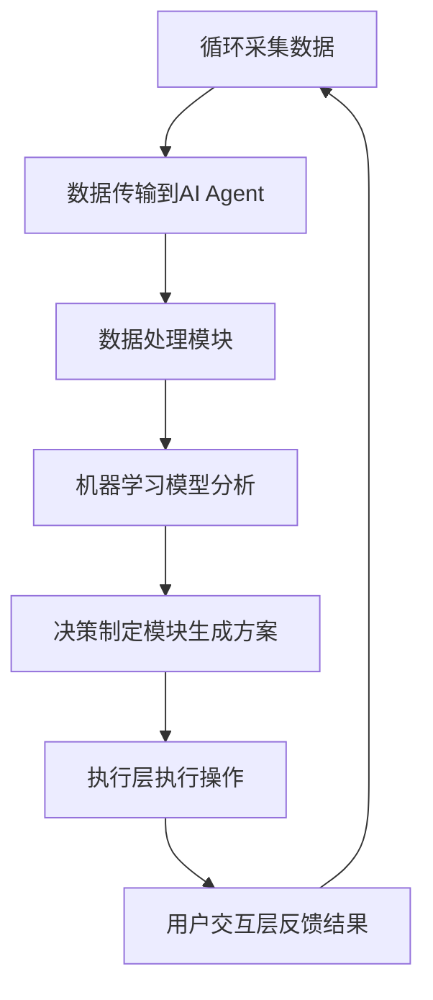

# 智能衣架：AI Agent的衣物护理与除皱系统

> 关键词：智能衣架、AI Agent、衣物护理、除皱系统、智能家居

> 摘要：本文聚焦于智能衣架这一新兴智能家居设备，深入探讨其基于AI Agent的衣物护理与除皱系统。详细介绍了相关背景知识，包括目的范围、预期读者等；阐述了核心概念与联系，给出原理和架构示意图及流程图；分析了核心算法原理并结合Python代码说明；讲解了数学模型和公式；通过项目实战展示代码实现与解读；列举了实际应用场景；推荐了学习资源、开发工具框架和相关论文著作；最后总结了未来发展趋势与挑战，还包含常见问题解答和扩展阅读参考资料，旨在为读者全面呈现智能衣架的技术原理和应用前景。

## 1. 背景介绍 
### 1.1 目的和范围
随着人们生活水平的提高，对于衣物护理的要求也日益增长。传统的衣物护理方式如熨烫等，不仅耗时费力，还需要一定的技巧。智能衣架作为一种新兴的智能家居设备，旨在利用先进的AI技术实现自动化的衣物护理与除皱功能，为用户提供更加便捷、高效的衣物护理解决方案。本文的范围涵盖了智能衣架的核心概念、算法原理、数学模型、项目实战、应用场景等方面，全面介绍了基于AI Agent的衣物护理与除皱系统。

### 1.2 预期读者
本文的预期读者包括对智能家居技术感兴趣的爱好者、从事相关领域研究的科研人员、智能家居产品的开发者以及对衣物护理技术有需求的消费者。通过阅读本文，读者可以深入了解智能衣架的技术原理和应用前景，为相关领域的研究和产品开发提供参考。

### 1.3 文档结构概述
本文共分为十个部分。第一部分为背景介绍，阐述了文章的目的和范围、预期读者以及文档结构概述；第二部分介绍核心概念与联系，包括相关原理和架构的示意图及流程图；第三部分讲解核心算法原理并结合Python代码详细说明；第四部分介绍数学模型和公式，并举例说明；第五部分通过项目实战展示代码实现和详细解释；第六部分列举实际应用场景；第七部分推荐学习资源、开发工具框架和相关论文著作；第八部分总结未来发展趋势与挑战；第九部分为附录，包含常见问题与解答；第十部分提供扩展阅读和参考资料。

### 1.4 术语表
#### 1.4.1 核心术语定义
- **智能衣架**：集成了先进传感器和AI技术的衣架设备，能够自动感知衣物状态并提供相应的护理和除皱功能。
- **AI Agent**：人工智能代理，是一种能够感知环境、做出决策并执行相应动作的智能实体，在智能衣架中用于控制衣物护理和除皱过程。
- **衣物护理**：对衣物进行清洁、保养、除皱等操作，以保持衣物的良好状态和外观。
- **除皱系统**：通过特定的技术和方法，去除衣物上的褶皱，使衣物更加平整。

#### 1.4.2 相关概念解释
- **传感器技术**：智能衣架利用各种传感器如湿度传感器、温度传感器、图像传感器等，实时感知衣物的状态信息，为后续的护理和除皱操作提供数据支持。
- **机器学习算法**：AI Agent通过机器学习算法对传感器采集的数据进行分析和处理，学习衣物的特性和护理需求，从而做出更加智能的决策。
- **智能家居**：将各种家居设备通过网络连接起来，实现智能化的控制和管理，智能衣架作为智能家居的一部分，可以与其他设备进行联动，提供更加便捷的家居体验。

#### 1.4.3 缩略词列表
- **AI**：Artificial Intelligence，人工智能
- **ML**：Machine Learning，机器学习
- **IoT**：Internet of Things，物联网

## 2. 核心概念与联系 

### 核心概念原理
智能衣架的衣物护理与除皱系统主要基于AI Agent的智能决策和控制。其核心原理是通过传感器实时采集衣物的状态信息，如湿度、温度、褶皱程度等，将这些信息传输给AI Agent。AI Agent利用机器学习算法对这些数据进行分析和处理，根据衣物的特性和用户的需求，制定出最佳的护理和除皱方案，并控制智能衣架上的相关设备执行相应的操作，如加热、喷气、振动等，以达到去除衣物褶皱和护理衣物的目的。

### 架构的文本示意图
```plaintext
智能衣架系统架构
|-- 传感器层
|   |-- 湿度传感器
|   |-- 温度传感器
|   |-- 图像传感器
|   |-- 其他传感器
|-- 数据传输层
|   |-- 无线通信模块（如Wi-Fi、蓝牙）
|-- AI Agent层
|   |-- 数据处理模块
|   |-- 机器学习模型
|   |-- 决策制定模块
|-- 执行层
|   |-- 加热装置
|   |-- 喷气装置
|   |-- 振动装置
|-- 用户交互层
|   |-- 手机APP
|   |-- 控制面板
```

### Mermaid 流程图


## 3. 核心算法原理 & 具体操作步骤 

### 核心算法原理
智能衣架的核心算法主要涉及机器学习算法，用于对传感器采集的数据进行分析和处理，以实现智能的衣物护理和除皱决策。这里我们以基于支持向量机（SVM）的分类算法为例，说明如何根据衣物的褶皱程度和材质等信息，选择合适的护理和除皱方案。

支持向量机是一种常用的监督学习算法，用于分类和回归分析。在智能衣架中，我们可以将衣物的不同状态（如轻度褶皱、中度褶皱、重度褶皱）作为不同的类别，通过训练SVM模型，使其能够根据传感器采集的数据准确地判断衣物的褶皱程度，从而选择合适的护理和除皱方案。

### Python源代码详细阐述
```python
import numpy as np
from sklearn import svm

# 假设我们有一些训练数据，包括衣物的特征（如湿度、温度、图像特征等）和对应的褶皱程度标签
# 特征数据
X = np.array([[20, 30, 0.5], [25, 35, 0.6], [15, 25, 0.4], [30, 40, 0.7]])
# 标签数据（0表示轻度褶皱，1表示中度褶皱，2表示重度褶皱）
y = np.array([0, 1, 0, 2])

# 创建SVM分类器
clf = svm.SVC()

# 训练模型
clf.fit(X, y)

# 假设我们有新的传感器数据，需要预测衣物的褶皱程度
new_data = np.array([[22, 32, 0.55]])
predicted_label = clf.predict(new_data)

print("预测的褶皱程度标签：", predicted_label)

# 根据预测的标签选择合适的护理和除皱方案
if predicted_label[0] == 0:
    print("轻度褶皱，采用温和的护理和除皱方案")
elif predicted_label[0] == 1:
    print("中度褶皱，采用中等强度的护理和除皱方案")
else:
    print("重度褶皱，采用高强度的护理和除皱方案")
```

### 具体操作步骤
1. **数据采集**：通过智能衣架上的传感器采集衣物的状态信息，如湿度、温度、图像特征等。
2. **数据预处理**：对采集到的数据进行清洗、归一化等预处理操作，以提高数据的质量和可用性。
3. **模型训练**：使用历史数据训练支持向量机模型，使其能够准确地判断衣物的褶皱程度。
4. **实时预测**：将新采集到的传感器数据输入到训练好的模型中，预测衣物的褶皱程度。
5. **决策制定**：根据预测的褶皱程度，选择合适的护理和除皱方案。
6. **执行操作**：控制智能衣架上的相关设备执行相应的护理和除皱操作。

## 4. 数学模型和公式 & 详细讲解 & 举例说明 

### 支持向量机数学模型
支持向量机的目标是找到一个最优的超平面，将不同类别的数据分开。对于二分类问题，假设我们有训练数据集 $\{(x_1, y_1), (x_2, y_2), \cdots, (x_n, y_n)\}$，其中 $x_i \in \mathbb{R}^d$ 是输入特征向量，$y_i \in \{-1, +1\}$ 是对应的标签。支持向量机的优化问题可以表示为：

$$
\begin{aligned}
\min_{\mathbf{w}, b, \xi} &\quad \frac{1}{2} \mathbf{w}^T \mathbf{w} + C \sum_{i=1}^{n} \xi_i \\
\text{s.t.} &\quad y_i(\mathbf{w}^T \mathbf{x}_i + b) \geq 1 - \xi_i, \quad i = 1, 2, \cdots, n \\
&\quad \xi_i \geq 0, \quad i = 1, 2, \cdots, n
\end{aligned}
$$

其中，$\mathbf{w}$ 是超平面的法向量，$b$ 是偏置项，$\xi_i$ 是松弛变量，用于处理线性不可分的情况，$C$ 是惩罚参数，用于平衡模型的复杂度和分类误差。

### 详细讲解
- **目标函数**：$\frac{1}{2} \mathbf{w}^T \mathbf{w}$ 表示超平面的间隔最大化，即希望找到一个超平面，使得不同类别的数据点到超平面的距离尽可能大。
- **约束条件**：$y_i(\mathbf{w}^T \mathbf{x}_i + b) \geq 1 - \xi_i$ 表示所有的数据点都要被正确分类，或者允许一定的分类误差（通过松弛变量 $\xi_i$ 控制）。
- **惩罚参数 $C$**：$C$ 越大，对分类误差的惩罚越重，模型会更倾向于准确分类；$C$ 越小，对分类误差的容忍度越高，模型会更注重超平面的间隔。

### 举例说明
假设我们有一个二维的数据集，包含两个类别的数据点。通过求解上述优化问题，我们可以找到一个最优的超平面，将这两个类别的数据点分开。在智能衣架中，我们可以将衣物的不同褶皱程度看作不同的类别，通过训练支持向量机模型，找到一个超平面，将不同褶皱程度的衣物数据分开，从而实现对衣物褶皱程度的准确分类。

## 5. 项目实战：代码实际案例和详细解释说明 

### 5.1  开发环境搭建
#### 硬件环境
- **智能衣架原型**：可以使用3D打印技术制作一个简单的智能衣架原型，集成湿度传感器、温度传感器、图像传感器等。
- **开发板**：选择一款适合的开发板，如Arduino、Raspberry Pi等，用于采集传感器数据和控制执行设备。
- **执行设备**：包括加热装置、喷气装置、振动装置等，用于实现衣物的护理和除皱功能。

#### 软件环境
- **编程语言**：Python，用于实现机器学习算法和控制逻辑。
- **开发工具**：PyCharm、Jupyter Notebook等，用于编写和调试Python代码。
- **机器学习库**：Scikit-learn，用于实现支持向量机等机器学习算法。
- **通信库**：如PySerial、PyBluez等，用于实现与传感器和执行设备的通信。

### 5.2  源代码详细实现和代码解读
```python
import serial
import time
from sklearn import svm
import numpy as np

# 初始化串口通信
ser = serial.Serial('/dev/ttyUSB0', 9600)

# 假设我们有一些训练数据，包括衣物的特征（如湿度、温度、图像特征等）和对应的褶皱程度标签
# 特征数据
X = np.array([[20, 30, 0.5], [25, 35, 0.6], [15, 25, 0.4], [30, 40, 0.7]])
# 标签数据（0表示轻度褶皱，1表示中度褶皱，2表示重度褶皱）
y = np.array([0, 1, 0, 2])

# 创建SVM分类器
clf = svm.SVC()

# 训练模型
clf.fit(X, y)

while True:
    # 从串口读取传感器数据
    data = ser.readline().decode('utf-8').strip().split(',')
    if len(data) == 3:
        try:
            humidity = float(data[0])
            temperature = float(data[1])
            image_feature = float(data[2])
            new_data = np.array([[humidity, temperature, image_feature]])
            predicted_label = clf.predict(new_data)

            print("预测的褶皱程度标签：", predicted_label)

            # 根据预测的标签选择合适的护理和除皱方案
            if predicted_label[0] == 0:
                print("轻度褶皱，采用温和的护理和除皱方案")
                # 发送指令到执行设备
                ser.write(b'0')
            elif predicted_label[0] == 1:
                print("中度褶皱，采用中等强度的护理和除皱方案")
                ser.write(b'1')
            else:
                print("重度褶皱，采用高强度的护理和除皱方案")
                ser.write(b'2')
        except ValueError:
            pass
    time.sleep(1)
```

### 代码解读与分析
- **串口通信**：使用 `serial.Serial` 函数初始化串口通信，从传感器读取数据。
- **模型训练**：使用Scikit-learn库创建支持向量机分类器，并使用历史数据进行训练。
- **实时预测**：在循环中不断从串口读取传感器数据，将其转换为特征向量，输入到训练好的模型中进行预测。
- **决策制定与执行**：根据预测的褶皱程度标签，选择合适的护理和除皱方案，并通过串口发送指令到执行设备。

## 6. 实际应用场景 
### 家庭场景
在家庭中，智能衣架可以方便地为用户提供衣物护理和除皱服务。用户只需将衣物挂在智能衣架上，智能衣架就可以自动感知衣物的状态，根据衣物的褶皱程度和材质等信息，选择合适的护理和除皱方案，为用户节省时间和精力。同时，智能衣架还可以与智能家居系统集成，实现远程控制和自动化操作。

### 酒店场景
在酒店中，智能衣架可以为客人提供更加贴心的服务。客人将衣物挂在智能衣架上后，智能衣架可以快速去除衣物上的褶皱，使衣物更加平整，为客人提供更好的穿着体验。此外，智能衣架还可以根据客人的需求，提供个性化的衣物护理服务，如消毒、除臭等。

### 商业洗衣店场景
在商业洗衣店中，智能衣架可以提高衣物护理的效率和质量。洗衣店可以将清洗后的衣物挂在智能衣架上，智能衣架可以自动完成除皱和护理工作，减少人工操作，提高工作效率。同时，智能衣架还可以对衣物进行分类处理，根据不同的衣物材质和褶皱程度，选择合适的护理和除皱方案，保证衣物的质量。

## 7. 工具和资源推荐
### 7.1 学习资源推荐
#### 7.1.1 书籍推荐
- 《机器学习》（周志华）：全面介绍了机器学习的基本概念、算法和应用，是学习机器学习的经典教材。
- 《Python机器学习实战》（Sebastian Raschka）：通过实际案例详细介绍了如何使用Python实现机器学习算法，适合初学者入门。
- 《智能家居：原理、技术与应用》：介绍了智能家居的基本原理、技术和应用场景，对智能衣架的开发有一定的参考价值。

#### 7.1.2 在线课程
- Coursera上的“Machine Learning”课程（Andrew Ng教授授课）：全球知名的机器学习课程，系统地介绍了机器学习的基础知识和算法。
- edX上的“Artificial Intelligence”课程：涵盖了人工智能的各个方面，包括机器学习、深度学习等。
- 中国大学MOOC上的“智能家居技术与应用”课程：介绍了智能家居的相关技术和应用案例，对智能衣架的开发有一定的指导作用。

#### 7.1.3 技术博客和网站
- Medium：上面有很多关于机器学习、人工智能和智能家居的技术文章和案例分享。
- GitHub：可以找到很多开源的智能家居项目和机器学习代码，供学习和参考。
- 知乎：有很多关于智能家居和人工智能的讨论和经验分享，可以从中获取有用的信息。

### 7.2 开发工具框架推荐
#### 7.2.1 IDE和编辑器
- PyCharm：功能强大的Python集成开发环境，提供代码编辑、调试、版本控制等功能，适合Python开发。
- Jupyter Notebook：交互式的编程环境，方便进行数据探索、模型训练和可视化，适合机器学习开发。
- Visual Studio Code：轻量级的代码编辑器，支持多种编程语言和插件，可用于智能衣架项目的开发。

#### 7.2.2 调试和性能分析工具
- Py-Spy：用于分析Python程序的性能瓶颈，找出程序中耗时较长的部分。
- PDB：Python自带的调试工具，可以帮助开发者调试Python代码，定位问题。
- TensorBoard：用于可视化深度学习模型的训练过程和性能指标，可用于优化机器学习模型。

#### 7.2.3 相关框架和库
- Scikit-learn：Python中常用的机器学习库，提供了丰富的机器学习算法和工具，如支持向量机、决策树、神经网络等。
- TensorFlow：开源的深度学习框架，可用于构建和训练深度学习模型，如卷积神经网络、循环神经网络等。
- OpenCV：计算机视觉库，可用于处理和分析图像数据，如智能衣架中的图像传感器数据。

### 7.3 相关论文著作推荐
#### 7.3.1 经典论文
- Cortes, C., & Vapnik, V. (1995). Support-vector networks. Machine learning, 20(3), 273-297. 这篇论文首次提出了支持向量机的概念和算法，是支持向量机领域的经典之作。
- Rosenblatt, F. (1958). The perceptron: a probabilistic model for information storage and organization in the brain. Psychological review, 65(6), 386. 介绍了感知机算法，是神经网络领域的早期经典论文。

#### 7.3.2 最新研究成果
- 可以通过IEEE Xplore、ACM Digital Library等学术数据库搜索关于智能衣架、智能家居和人工智能的最新研究成果，了解该领域的前沿技术和发展趋势。

#### 7.3.3 应用案例分析
- 一些知名的科技公司如Google、Amazon等会发布关于智能家居产品的应用案例分析，可以从中学习到他们的设计思路和技术实现方法。

## 8. 总结：未来发展趋势与挑战
### 未来发展趋势
- **智能化程度不断提高**：随着人工智能技术的不断发展，智能衣架的智能化程度将不断提高。AI Agent将能够更加准确地感知衣物的状态，学习用户的使用习惯，提供更加个性化的衣物护理和除皱方案。
- **与其他智能家居设备的融合**：智能衣架将与其他智能家居设备如智能衣柜、智能洗衣机等进行深度融合，实现更加便捷的家居体验。例如，智能衣架可以与智能洗衣机联动，自动接收清洗后的衣物，并进行护理和除皱处理。
- **多功能集成**：未来的智能衣架可能会集成更多的功能，如衣物消毒、除臭、防虫等，为用户提供更加全面的衣物护理服务。

### 挑战
- **数据安全与隐私问题**：智能衣架需要采集和处理大量的用户数据，如衣物状态信息、用户使用习惯等，如何保证这些数据的安全和隐私是一个重要的挑战。
- **技术成本**：目前，智能衣架的研发和生产成本较高，导致产品价格相对较贵，如何降低技术成本，提高产品的性价比，是推广智能衣架的关键。
- **用户接受度**：智能衣架作为一种新兴的智能家居设备，用户对其功能和使用方法还不够了解，如何提高用户的接受度，培养用户的使用习惯，也是一个需要解决的问题。

## 9. 附录：常见问题与解答
### 智能衣架的耗电量大吗？
智能衣架的耗电量主要取决于其使用的加热装置、喷气装置等设备的功率和使用时间。一般来说，智能衣架采用了节能设计，在不使用时会处于低功耗状态，因此整体耗电量不会很大。

### 智能衣架可以处理所有材质的衣物吗？
智能衣架可以处理大多数常见材质的衣物，如棉质、麻质、丝绸等。但对于一些特殊材质的衣物，如皮革、化纤等，可能需要特殊的护理和除皱方法，智能衣架可能无法完全满足需求。

### 智能衣架的使用寿命有多长？
智能衣架的使用寿命取决于其质量和使用频率。一般来说，质量较好的智能衣架可以使用3-5年甚至更长时间。在使用过程中，定期进行维护和保养可以延长智能衣架的使用寿命。

### 智能衣架可以远程控制吗？
可以，智能衣架通常支持与手机APP连接，用户可以通过手机APP实现远程控制，随时随地对衣物进行护理和除皱操作。

## 10. 扩展阅读 & 参考资料
### 扩展阅读
- 《人工智能时代的智能家居革命》
- 《未来家居：科技与生活的完美融合》

### 参考资料
- IEEE Transactions on Smart Homes and Healthcare
- ACM Transactions on Intelligent Systems and Technology
- 智能家居行业报告

作者：AI天才研究院/AI Genius Institute & 禅与计算机程序设计艺术 /Zen And The Art of Computer Programming