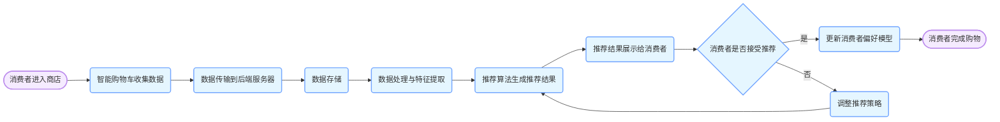

# 智能购物车：AI Agent的商品推荐系统

> 关键词：智能购物车、AI Agent、商品推荐系统、机器学习、个性化推荐

> 摘要：本文围绕智能购物车的AI Agent商品推荐系统展开深入探讨。首先介绍了该系统产生的背景，明确目的和范围、预期读者等信息。接着阐述核心概念，包括智能购物车、AI Agent及商品推荐系统的原理和联系，并通过文本示意图和Mermaid流程图展示架构。详细讲解核心算法原理，结合Python代码说明具体操作步骤，还给出相关数学模型和公式并举例。通过项目实战，从开发环境搭建到源代码实现与解读，全面展示系统开发过程。分析实际应用场景，推荐学习资源、开发工具框架和相关论文著作。最后总结未来发展趋势与挑战，提供常见问题解答和扩展阅读参考资料，旨在为读者提供关于智能购物车AI Agent商品推荐系统的全面且深入的技术知识。

## 1. 背景介绍 
### 1.1 目的和范围
在当今数字化时代，零售业竞争日益激烈，消费者面临海量商品选择，传统购物方式效率低且难以满足个性化需求。智能购物车的AI Agent商品推荐系统应运而生，其目的在于通过先进的人工智能技术，为消费者提供个性化的商品推荐，提升购物体验，同时帮助零售商增加销售额和客户忠诚度。

本系统的范围涵盖了从消费者进入商店开始，通过智能购物车与系统交互，系统收集消费者的行为数据（如浏览商品、添加商品到购物车等），运用AI算法进行分析处理，实时为消费者推荐符合其兴趣和需求的商品，直到消费者完成购物的整个过程。

### 1.2 预期读者
本文预期读者包括零售业从业者，如超市、商场的管理人员和运营人员，他们可以通过了解该系统，将其应用到实际业务中，提升店铺竞争力；人工智能和计算机科学领域的研究人员和开发者，他们可以从中获取技术灵感和实现思路，进一步研究和优化相关算法和系统；以及对智能购物和个性化推荐感兴趣的普通消费者，了解系统的工作原理和优势，更好地享受智能购物服务。

### 1.3 文档结构概述
本文将按照以下结构展开：首先介绍核心概念，包括智能购物车、AI Agent和商品推荐系统的定义、原理及它们之间的联系，并通过可视化方式展示架构；接着详细讲解核心算法原理和具体操作步骤，结合Python代码进行说明；然后给出相关数学模型和公式，并举例加深理解；通过项目实战，从开发环境搭建到源代码实现与解读，全面展示系统开发过程；分析系统的实际应用场景；推荐学习资源、开发工具框架和相关论文著作；最后总结未来发展趋势与挑战，提供常见问题解答和扩展阅读参考资料。

### 1.4 术语表
#### 1.4.1 核心术语定义
- **智能购物车**：配备了传感器、处理器和通信设备的购物车，能够收集消费者的购物行为数据，并与后端服务器进行通信，实现智能化的购物辅助功能。
- **AI Agent**：即人工智能代理，是一种能够感知环境、自主决策并采取行动以实现特定目标的智能实体。在智能购物车系统中，AI Agent负责分析消费者的行为数据，为其提供个性化的商品推荐。
- **商品推荐系统**：利用数据分析和机器学习算法，根据消费者的历史行为、偏好和当前情境，为消费者推荐可能感兴趣的商品的系统。

#### 1.4.2 相关概念解释
- **个性化推荐**：根据每个消费者的独特特征和行为，为其提供定制化的商品推荐，以提高推荐的准确性和相关性。
- **协同过滤**：一种常用的推荐算法，通过分析多个消费者的行为数据，找出具有相似偏好的消费者群体，从而为目标消费者推荐其他相似消费者喜欢的商品。
- **深度学习**：一种基于人工神经网络的机器学习方法，能够自动从大量数据中学习复杂的模式和特征，在商品推荐系统中具有广泛的应用。

#### 1.4.3 缩略词列表
- **AI**：Artificial Intelligence，人工智能
- **ML**：Machine Learning，机器学习
- **DNN**：Deep Neural Network，深度神经网络
- **CF**：Collaborative Filtering，协同过滤

## 2. 核心概念与联系 
### 核心概念原理
#### 智能购物车
智能购物车的核心原理是通过安装在购物车上的各种传感器（如重量传感器、摄像头、RFID阅读器等）收集消费者的购物行为数据。重量传感器可以检测购物车中商品的重量变化，判断消费者是否添加或移除了商品；摄像头可以识别商品的条形码或图像，记录消费者浏览的商品信息；RFID阅读器可以读取商品上的RFID标签，获取商品的详细信息。这些数据通过无线通信技术（如Wi-Fi、蓝牙等）传输到后端服务器进行处理。

#### AI Agent
AI Agent在智能购物车系统中扮演着智能决策的角色。它接收来自智能购物车的消费者行为数据，运用机器学习和深度学习算法对数据进行分析和处理。首先，AI Agent会对消费者的历史行为数据进行建模，了解消费者的偏好和兴趣；然后，根据当前收集到的实时数据，结合消费者的历史模型，为消费者生成个性化的商品推荐。AI Agent还可以与消费者进行交互，根据消费者的反馈不断调整推荐策略，提高推荐的准确性。

#### 商品推荐系统
商品推荐系统是智能购物车的核心组成部分，它的主要原理是利用数据分析和机器学习算法，从海量的商品数据和消费者行为数据中挖掘有价值的信息，为消费者推荐符合其需求的商品。常见的推荐算法包括基于内容的推荐、协同过滤推荐、深度学习推荐等。基于内容的推荐算法根据商品的属性（如类别、品牌、价格等）和消费者的历史偏好进行推荐；协同过滤推荐算法通过分析消费者之间的相似性，为目标消费者推荐其他相似消费者喜欢的商品；深度学习推荐算法则利用神经网络自动学习商品和消费者之间的复杂关系，生成更准确的推荐结果。

### 架构的文本示意图
智能购物车的AI Agent商品推荐系统主要由以下几个部分组成：
1. **智能购物车终端**：负责收集消费者的购物行为数据，并将数据传输到后端服务器。
2. **数据传输网络**：采用无线通信技术（如Wi-Fi、蓝牙等）将智能购物车终端的数据传输到后端服务器。
3. **后端服务器**：包括数据存储模块、数据处理模块和推荐算法模块。数据存储模块用于存储消费者的行为数据和商品信息；数据处理模块对收集到的数据进行清洗、预处理和特征提取；推荐算法模块根据处理后的数据，运用机器学习和深度学习算法生成商品推荐结果。
4. **用户界面**：通过智能购物车的显示屏或移动应用程序，将商品推荐结果展示给消费者，并接收消费者的反馈信息。

### Mermaid流程图


## 3. 核心算法原理 & 具体操作步骤 
### 协同过滤算法原理
协同过滤算法是商品推荐系统中最常用的算法之一，它基于“物以类聚，人以群分”的思想，通过分析多个消费者的行为数据，找出具有相似偏好的消费者群体，从而为目标消费者推荐其他相似消费者喜欢的商品。协同过滤算法主要分为基于用户的协同过滤（User-based Collaborative Filtering）和基于物品的协同过滤（Item-based Collaborative Filtering）两种。

#### 基于用户的协同过滤
基于用户的协同过滤算法的核心步骤如下：
1. **计算用户之间的相似度**：常用的相似度计算方法有皮尔逊相关系数（Pearson Correlation Coefficient）、余弦相似度（Cosine Similarity）等。以皮尔逊相关系数为例，其计算公式为：
$$
\mathrm{sim}(u, v)=\frac{\sum_{i \in I_{uv}}(r_{ui}-\overline{r}_u)(r_{vi}-\overline{r}_v)}{\sqrt{\sum_{i \in I_{uv}}(r_{ui}-\overline{r}_u)^2}\sqrt{\sum_{i \in I_{uv}}(r_{vi}-\overline{r}_v)^2}}
$$
其中，$u$ 和 $v$ 表示两个用户，$I_{uv}$ 表示用户 $u$ 和 $v$ 共同评分的物品集合，$r_{ui}$ 表示用户 $u$ 对物品 $i$ 的评分，$\overline{r}_u$ 表示用户 $u$ 的平均评分。
2. **找到与目标用户最相似的 $K$ 个用户**：根据计算得到的用户相似度，选择与目标用户最相似的 $K$ 个用户作为邻居。
3. **为目标用户生成推荐列表**：根据邻居用户对物品的评分，预测目标用户对未评分物品的评分，选择评分较高的物品作为推荐结果。预测公式为：
$$
\hat{r}_{ui}=\overline{r}_u+\frac{\sum_{v \in N(u)}\mathrm{sim}(u, v)(r_{vi}-\overline{r}_v)}{\sum_{v \in N(u)}|\mathrm{sim}(u, v)|}
$$
其中，$\hat{r}_{ui}$ 表示预测的用户 $u$ 对物品 $i$ 的评分，$N(u)$ 表示目标用户 $u$ 的邻居用户集合。

#### 基于物品的协同过滤
基于物品的协同过滤算法与基于用户的协同过滤算法类似，但其核心是计算物品之间的相似度。具体步骤如下：
1. **计算物品之间的相似度**：同样可以使用皮尔逊相关系数、余弦相似度等方法。
2. **找到与目标物品最相似的 $K$ 个物品**：根据计算得到的物品相似度，选择与目标物品最相似的 $K$ 个物品作为邻居。
3. **为目标用户生成推荐列表**：根据目标用户对已评分物品的评分，预测目标用户对未评分物品的评分，选择评分较高的物品作为推荐结果。

### Python代码实现基于用户的协同过滤算法
```python
import numpy as np

# 定义用户-物品评分矩阵
ratings = np.array([
    [5, 3, 0, 1],
    [4, 0, 0, 1],
    [1, 1, 0, 5],
    [1, 0, 0, 4],
    [0, 1, 5, 4]
])

# 计算皮尔逊相关系数
def pearson_similarity(ratings, user1, user2):
    common_items = np.logical_and(ratings[user1] > 0, ratings[user2] > 0)
    if np.sum(common_items) == 0:
        return 0
    user1_ratings = ratings[user1][common_items]
    user2_ratings = ratings[user2][common_items]
    mean_user1 = np.mean(ratings[user1][ratings[user1] > 0])
    mean_user2 = np.mean(ratings[user2][ratings[user2] > 0])
    numerator = np.sum((user1_ratings - mean_user1) * (user2_ratings - mean_user2))
    denominator = np.sqrt(np.sum((user1_ratings - mean_user1) ** 2)) * np.sqrt(np.sum((user2_ratings - mean_user2) ** 2))
    if denominator == 0:
        return 0
    return numerator / denominator

# 找到与目标用户最相似的K个用户
def find_top_k_similar_users(ratings, target_user, k):
    num_users = ratings.shape[0]
    similarities = []
    for user in range(num_users):
        if user!= target_user:
            similarity = pearson_similarity(ratings, target_user, user)
            similarities.append((user, similarity))
    similarities.sort(key=lambda x: x[1], reverse=True)
    return similarities[:k]

# 为目标用户生成推荐列表
def recommend_items(ratings, target_user, k):
    top_k_users = find_top_k_similar_users(ratings, target_user, k)
    num_items = ratings.shape[1]
    predictions = []
    mean_target_user = np.mean(ratings[target_user][ratings[target_user] > 0])
    for item in range(num_items):
        if ratings[target_user][item] == 0:
            numerator = 0
            denominator = 0
            for user, similarity in top_k_users:
                if ratings[user][item] > 0:
                    mean_user = np.mean(ratings[user][ratings[user] > 0])
                    numerator += similarity * (ratings[user][item] - mean_user)
                    denominator += abs(similarity)
            if denominator!= 0:
                prediction = mean_target_user + numerator / denominator
                predictions.append((item, prediction))
    predictions.sort(key=lambda x: x[1], reverse=True)
    return predictions

# 示例：为用户0生成推荐列表
target_user = 0
k = 2
recommendations = recommend_items(ratings, target_user, k)
print("为用户0的推荐列表：", recommendations)
```

### 代码解释
1. **定义用户-物品评分矩阵**：使用 `numpy` 数组 `ratings` 表示用户对物品的评分，其中 0 表示未评分。
2. **计算皮尔逊相关系数**：`pearson_similarity` 函数用于计算两个用户之间的皮尔逊相关系数，通过计算共同评分物品的评分偏差乘积之和与评分偏差平方和的平方根的比值得到。
3. **找到与目标用户最相似的 $K$ 个用户**：`find_top_k_similar_users` 函数计算目标用户与其他所有用户的相似度，并选择相似度最高的 $K$ 个用户作为邻居。
4. **为目标用户生成推荐列表**：`recommend_items` 函数根据邻居用户对未评分物品的评分，预测目标用户对这些物品的评分，选择评分较高的物品作为推荐结果。

## 4. 数学模型和公式 & 详细讲解 & 举例说明 
### 协同过滤算法的数学模型和公式
#### 皮尔逊相关系数
皮尔逊相关系数用于衡量两个变量之间的线性相关性，在协同过滤算法中用于计算用户之间或物品之间的相似度。其计算公式为：
$$
\mathrm{sim}(u, v)=\frac{\sum_{i \in I_{uv}}(r_{ui}-\overline{r}_u)(r_{vi}-\overline{r}_v)}{\sqrt{\sum_{i \in I_{uv}}(r_{ui}-\overline{r}_u)^2}\sqrt{\sum_{i \in I_{uv}}(r_{vi}-\overline{r}_v)^2}}
$$
其中，$u$ 和 $v$ 表示两个用户或物品，$I_{uv}$ 表示共同评分的物品或用户集合，$r_{ui}$ 表示用户 $u$ 对物品 $i$ 的评分，$\overline{r}_u$ 表示用户 $u$ 的平均评分。

#### 评分预测公式
在基于用户的协同过滤算法中，预测目标用户 $u$ 对物品 $i$ 的评分公式为：
$$
\hat{r}_{ui}=\overline{r}_u+\frac{\sum_{v \in N(u)}\mathrm{sim}(u, v)(r_{vi}-\overline{r}_v)}{\sum_{v \in N(u)}|\mathrm{sim}(u, v)|}
$$
其中，$\hat{r}_{ui}$ 表示预测的用户 $u$ 对物品 $i$ 的评分，$N(u)$ 表示目标用户 $u$ 的邻居用户集合。

### 详细讲解
#### 皮尔逊相关系数
皮尔逊相关系数的取值范围为 $[-1, 1]$，值越接近 1 表示两个变量之间的正相关性越强，值越接近 -1 表示负相关性越强，值为 0 表示两个变量之间没有线性相关性。在协同过滤算法中，相似度值越接近 1 表示两个用户或物品的偏好越相似。

#### 评分预测公式
评分预测公式的核心思想是根据目标用户的平均评分和邻居用户的评分偏差来预测目标用户对未评分物品的评分。具体来说，首先计算邻居用户对物品 $i$ 的评分与邻居用户平均评分的偏差，然后根据邻居用户与目标用户的相似度对这些偏差进行加权求和，最后将加权求和的结果加上目标用户的平均评分得到预测评分。

### 举例说明
假设我们有以下用户-物品评分矩阵：
| 用户 | 物品1 | 物品2 | 物品3 | 物品4 |
| ---- | ---- | ---- | ---- | ---- |
| 用户1 | 5 | 3 | 0 | 1 |
| 用户2 | 4 | 0 | 0 | 1 |
| 用户3 | 1 | 1 | 0 | 5 |
| 用户4 | 1 | 0 | 0 | 4 |
| 用户5 | 0 | 1 | 5 | 4 |

我们要为用户 1 推荐物品，首先计算用户 1 与其他用户的相似度。以用户 1 和用户 2 为例，共同评分的物品为物品 1 和物品 4，用户 1 的平均评分为 $(5 + 3 + 1) / 3 = 3$，用户 2 的平均评分为 $(4 + 1) / 2 = 2.5$。根据皮尔逊相关系数公式计算：
$$
\begin{align*}
\mathrm{sim}(1, 2)&=\frac{(5 - 3)(4 - 2.5)+(1 - 3)(1 - 2.5)}{\sqrt{(5 - 3)^2+(1 - 3)^2}\sqrt{(4 - 2.5)^2+(1 - 2.5)^2}}\\
&=\frac{2\times1.5+(-2)\times(-1.5)}{\sqrt{4 + 4}\sqrt{2.25 + 2.25}}\\
&=\frac{3 + 3}{\sqrt{8}\sqrt{4.5}}\\
&=\frac{6}{\sqrt{36}}\\
&= 1
\end{align*}
$$
然后找到与用户 1 最相似的 $K$ 个用户，假设 $K = 2$，找到用户 2 和用户 3 为邻居用户。接下来预测用户 1 对未评分物品（如物品 3）的评分。用户 1 的平均评分为 3，用户 2 对物品 3 未评分，用户 3 对物品 3 未评分，所以预测评分需要根据其他邻居用户的信息进行调整。假设邻居用户对物品 3 的评分和相似度满足一定条件，根据评分预测公式计算得到预测评分，选择预测评分较高的物品作为推荐结果。

## 5. 项目实战：代码实际案例和详细解释说明 
### 5.1  开发环境搭建
#### 硬件环境
- **服务器**：可以选择云服务器（如阿里云、腾讯云等）或本地服务器，建议配置至少 4 核 CPU、8GB 内存和 100GB 硬盘空间。
- **智能购物车终端**：配备传感器（如重量传感器、摄像头、RFID阅读器等）、处理器（如树莓派）和通信模块（如 Wi-Fi 模块）。

#### 软件环境
- **操作系统**：服务器端可以选择 Linux 系统（如 Ubuntu、CentOS 等），智能购物车终端可以选择适合嵌入式设备的操作系统（如 Raspbian）。
- **编程语言**：Python 3.x，推荐使用 Anaconda 环境进行管理。
- **数据库**：可以选择 MySQL、MongoDB 等数据库来存储消费者的行为数据和商品信息。
- **机器学习框架**：使用 TensorFlow、PyTorch 等深度学习框架实现推荐算法。

### 5.2  源代码详细实现和代码解读
#### 数据收集模块
```python
import serial
import time

# 模拟从传感器读取数据
def read_sensor_data():
    # 这里可以替换为实际的传感器读取代码
    # 例如，通过串口读取重量传感器数据
    try:
        ser = serial.Serial('/dev/ttyUSB0', 9600, timeout=1)
        data = ser.readline().decode('utf-8').strip()
        ser.close()
        return data
    except Exception as e:
        print(f"读取传感器数据失败: {e}")
        return None

# 主循环，持续收集数据
while True:
    sensor_data = read_sensor_data()
    if sensor_data:
        print(f"收集到传感器数据: {sensor_data}")
    time.sleep(1)
```
**代码解读**：该模块模拟从传感器读取数据，通过 `serial.Serial` 函数打开串口，读取传感器发送的数据。在实际应用中，需要根据具体的传感器类型和通信协议进行修改。

#### 数据处理模块
```python
import pandas as pd

# 加载数据
def load_data(file_path):
    data = pd.read_csv(file_path)
    return data

# 数据清洗和预处理
def preprocess_data(data):
    # 去除缺失值
    data = data.dropna()
    # 特征提取
    # 这里可以根据具体需求进行特征提取
    return data

# 示例使用
file_path = 'data.csv'
data = load_data(file_path)
processed_data = preprocess_data(data)
print("处理后的数据:")
print(processed_data.head())
```
**代码解读**：该模块负责数据的加载、清洗和预处理。使用 `pandas` 库读取 CSV 文件，通过 `dropna` 函数去除缺失值，然后可以根据具体需求进行特征提取。

#### 推荐算法模块
```python
import numpy as np

# 定义用户-物品评分矩阵
ratings = np.array([
    [5, 3, 0, 1],
    [4, 0, 0, 1],
    [1, 1, 0, 5],
    [1, 0, 0, 4],
    [0, 1, 5, 4]
])

# 计算皮尔逊相关系数
def pearson_similarity(ratings, user1, user2):
    common_items = np.logical_and(ratings[user1] > 0, ratings[user2] > 0)
    if np.sum(common_items) == 0:
        return 0
    user1_ratings = ratings[user1][common_items]
    user2_ratings = ratings[user2][common_items]
    mean_user1 = np.mean(ratings[user1][ratings[user1] > 0])
    mean_user2 = np.mean(ratings[user2][ratings[user2] > 0])
    numerator = np.sum((user1_ratings - mean_user1) * (user2_ratings - mean_user2))
    denominator = np.sqrt(np.sum((user1_ratings - mean_user1) ** 2)) * np.sqrt(np.sum((user2_ratings - mean_user2) ** 2))
    if denominator == 0:
        return 0
    return numerator / denominator

# 找到与目标用户最相似的K个用户
def find_top_k_similar_users(ratings, target_user, k):
    num_users = ratings.shape[0]
    similarities = []
    for user in range(num_users):
        if user!= target_user:
            similarity = pearson_similarity(ratings, target_user, user)
            similarities.append((user, similarity))
    similarities.sort(key=lambda x: x[1], reverse=True)
    return similarities[:k]

# 为目标用户生成推荐列表
def recommend_items(ratings, target_user, k):
    top_k_users = find_top_k_similar_users(ratings, target_user, k)
    num_items = ratings.shape[1]
    predictions = []
    mean_target_user = np.mean(ratings[target_user][ratings[target_user] > 0])
    for item in range(num_items):
        if ratings[target_user][item] == 0:
            numerator = 0
            denominator = 0
            for user, similarity in top_k_users:
                if ratings[user][item] > 0:
                    mean_user = np.mean(ratings[user][ratings[user] > 0])
                    numerator += similarity * (ratings[user][item] - mean_user)
                    denominator += abs(similarity)
            if denominator!= 0:
                prediction = mean_target_user + numerator / denominator
                predictions.append((item, prediction))
    predictions.sort(key=lambda x: x[1], reverse=True)
    return predictions

# 示例：为用户0生成推荐列表
target_user = 0
k = 2
recommendations = recommend_items(ratings, target_user, k)
print("为用户0的推荐列表：", recommendations)
```
**代码解读**：该模块实现了基于用户的协同过滤算法，包括计算皮尔逊相关系数、找到与目标用户最相似的 $K$ 个用户和为目标用户生成推荐列表。具体代码解释见前面的算法原理部分。

### 5.3  代码解读与分析
#### 数据收集模块
该模块的主要功能是从传感器收集数据，通过串口通信读取传感器发送的数据。在实际应用中，需要根据具体的传感器类型和通信协议进行修改，确保能够准确读取传感器数据。同时，可以添加数据校验和错误处理机制，提高数据收集的可靠性。

#### 数据处理模块
数据处理模块负责数据的加载、清洗和预处理。使用 `pandas` 库可以方便地读取和处理 CSV 文件，去除缺失值和进行特征提取。在特征提取过程中，可以根据具体需求选择合适的特征，如商品的类别、价格、销量等，以提高推荐算法的准确性。

#### 推荐算法模块
推荐算法模块实现了基于用户的协同过滤算法，通过计算用户之间的相似度和预测用户对未评分物品的评分，为目标用户生成推荐列表。该算法的优点是简单易懂，实现方便，但也存在一些缺点，如数据稀疏性问题和冷启动问题。在实际应用中，可以结合其他算法（如基于内容的推荐算法、深度学习推荐算法等）进行改进。

## 6. 实际应用场景 
### 超市购物
在超市中，智能购物车的AI Agent商品推荐系统可以为消费者提供个性化的商品推荐。当消费者将商品放入购物车时，系统通过传感器收集商品信息和消费者的行为数据，分析消费者的偏好和需求。例如，如果消费者购买了面包，系统可以推荐与之搭配的牛奶、果酱等商品；如果消费者经常购买有机食品，系统可以推荐更多的有机商品。同时，系统还可以根据超市的促销活动和库存情况，为消费者提供实时的优惠信息和商品推荐，提高消费者的购物满意度和超市的销售额。

### 商场购物
在商场中，智能购物车的AI Agent商品推荐系统可以为消费者提供更全面的购物引导。系统可以根据消费者的历史购物记录和当前位置，为消费者推荐附近店铺的商品和优惠信息。例如，如果消费者在服装区浏览，系统可以推荐该区域内符合消费者风格和尺码的服装；如果消费者在餐饮区，系统可以推荐附近餐厅的特色菜品和优惠套餐。此外，系统还可以与商场的会员系统集成，为会员提供专属的推荐和服务，增强会员的忠诚度。

### 线上购物
在电商平台上，智能购物车的AI Agent商品推荐系统同样可以发挥重要作用。当消费者将商品加入购物车时，系统可以根据消费者的历史购买记录、浏览记录和收藏记录，为消费者推荐相关的商品。例如，如果消费者购买了一部手机，系统可以推荐手机配件、手机壳等商品；如果消费者浏览了某一品牌的服装，系统可以推荐该品牌的其他款式或类似风格的服装。同时，系统还可以根据商品的库存情况和促销活动，为消费者提供实时的价格比较和购买建议，帮助消费者做出更明智的购物决策。

## 7. 工具和资源推荐
### 7.1 学习资源推荐
#### 7.1.1 书籍推荐
- 《Python机器学习实战》：本书通过大量的实例，详细介绍了Python在机器学习领域的应用，包括数据处理、模型训练和评估等方面的知识，适合初学者入门。
- 《深度学习》：由深度学习领域的三位权威专家Ian Goodfellow、Yoshua Bengio和Aaron Courville撰写，全面介绍了深度学习的基本概念、算法和应用，是深度学习领域的经典教材。
- 《推荐系统实践》：作者项亮结合自己在推荐系统领域的实践经验，详细介绍了推荐系统的原理、算法和应用，通过实际案例展示了如何构建一个完整的推荐系统。

#### 7.1.2 在线课程
- Coursera上的“机器学习”课程：由斯坦福大学教授Andrew Ng主讲，是机器学习领域的经典在线课程，涵盖了机器学习的基本概念、算法和应用，适合初学者入门。
- edX上的“深度学习微硕士学位项目”：由多所知名大学联合推出，包括深度学习的基础课程和实践项目，适合有一定机器学习基础的学习者深入学习深度学习。
- 阿里云天池的“推荐系统实战营”：结合实际案例，详细介绍了推荐系统的开发流程和算法实现，适合有一定编程基础的学习者进行实践学习。

#### 7.1.3 技术博客和网站
- 博客园：国内知名的技术博客平台，有很多机器学习和推荐系统领域的博主分享自己的学习经验和实践案例。
- Medium：国外知名的技术博客平台，有很多关于人工智能、机器学习和推荐系统的高质量文章。
- Kaggle：全球最大的数据科学竞赛平台，上面有很多关于推荐系统的数据集和竞赛项目，可以通过参与竞赛来提高自己的实践能力。

### 7.2 开发工具框架推荐
#### 7.2.1 IDE和编辑器
- PyCharm：一款专门为Python开发设计的集成开发环境（IDE），具有代码编辑、调试、自动补全、版本控制等功能，适合开发Python项目。
- Jupyter Notebook：一个交互式的开发环境，可以在浏览器中编写和运行代码，支持多种编程语言，适合进行数据探索和模型训练。
- Visual Studio Code：一款轻量级的代码编辑器，支持多种编程语言和插件扩展，具有丰富的代码编辑和调试功能，适合开发各种类型的项目。

#### 7.2.2 调试和性能分析工具
- PySnooper：一个简单易用的Python调试工具，可以在不修改代码的情况下，自动记录函数的执行过程和变量的值，方便调试代码。
- cProfile：Python标准库中的性能分析工具，可以分析代码的执行时间和函数调用次数，帮助优化代码性能。
- TensorBoard：TensorFlow提供的可视化工具，可以可视化模型的训练过程、损失函数和准确率等指标，方便调试和优化深度学习模型。

#### 7.2.3 相关框架和库
- TensorFlow：Google开发的开源深度学习框架，具有强大的计算能力和丰富的工具库，支持多种深度学习模型的开发和训练。
- PyTorch：Facebook开发的开源深度学习框架，具有简洁易用的API和动态计算图的特点，适合快速开发和实验深度学习模型。
- scikit-learn：一个简单易用的机器学习库，提供了各种机器学习算法和工具，包括数据预处理、模型选择、评估等功能，适合初学者入门。

### 7.3 相关论文著作推荐
#### 7.3.1 经典论文
- “Item-Based Collaborative Filtering Recommendation Algorithms”：该论文提出了基于物品的协同过滤算法，是协同过滤算法领域的经典论文之一。
- “Matrix Factorization Techniques for Recommender Systems”：该论文介绍了矩阵分解技术在推荐系统中的应用，是推荐系统领域的重要论文之一。
- “Deep Neural Networks for YouTube Recommendations”：该论文介绍了YouTube使用深度学习模型进行视频推荐的方法和实践经验，是深度学习在推荐系统中应用的经典案例。

#### 7.3.2 最新研究成果
- 可以关注顶级学术会议（如KDD、RecSys等）和学术期刊（如ACM Transactions on Information Systems、Journal of Machine Learning Research等）上的最新研究成果，了解推荐系统领域的最新技术和发展趋势。

#### 7.3.3 应用案例分析
- 可以参考一些知名企业（如亚马逊、Netflix等）的推荐系统应用案例，了解他们在实际应用中遇到的问题和解决方案，以及如何根据业务需求选择合适的推荐算法和技术。

## 8. 总结：未来发展趋势与挑战
### 未来发展趋势
#### 融合多模态数据
未来的智能购物车AI Agent商品推荐系统将不仅仅依赖于消费者的购物行为数据，还会融合多模态数据，如消费者的语音指令、面部表情、地理位置等。通过综合分析这些多模态数据，系统可以更准确地了解消费者的需求和偏好，提供更加个性化的商品推荐。

#### 强化学习的应用
强化学习是一种通过智能体与环境进行交互，不断学习最优策略的机器学习方法。在智能购物车推荐系统中，强化学习可以用于优化推荐策略，根据消费者的实时反馈动态调整推荐结果，提高推荐的准确性和用户满意度。

#### 与物联网技术深度融合
随着物联网技术的不断发展，智能购物车可以与商店内的其他设备（如货架传感器、智能标签等）进行互联互通。通过实时获取商品的库存信息、价格变化等数据，系统可以为消费者提供更加准确和及时的商品推荐，同时帮助零售商实现更高效的库存管理和供应链优化。

### 挑战
#### 数据隐私和安全问题
智能购物车系统需要收集大量的消费者行为数据，这些数据包含了消费者的个人隐私信息。如何确保数据的隐私和安全，防止数据泄露和滥用，是系统面临的重要挑战之一。需要采用先进的加密技术和数据安全管理机制，保护消费者的隐私权益。

#### 算法可解释性问题
深度学习等复杂的机器学习算法在推荐系统中取得了很好的效果，但这些算法往往具有较高的复杂度和黑盒性，难以解释推荐结果的产生原因。在实际应用中，消费者和零售商可能需要了解推荐结果的依据，因此如何提高算法的可解释性是一个亟待解决的问题。

#### 冷启动问题
冷启动问题是推荐系统中常见的问题，指的是当新用户或新商品加入系统时，由于缺乏足够的历史数据，系统难以提供准确的推荐。在智能购物车系统中，如何解决新用户和新商品的冷启动问题，快速为他们提供有价值的推荐，是系统开发和优化的重点。

## 9. 附录：常见问题与解答
### 问题1：智能购物车的AI Agent商品推荐系统需要哪些硬件设备？
答：智能购物车的AI Agent商品推荐系统需要的硬件设备包括智能购物车终端（配备传感器、处理器和通信模块）、服务器（用于数据存储和处理）、显示屏或移动应用程序（用于展示推荐结果）等。具体的硬件设备可以根据系统的功能和需求进行选择和配置。

### 问题2：如何提高推荐系统的准确性？
答：可以从以下几个方面提高推荐系统的准确性：
1. **收集更多的数据**：丰富的历史数据可以帮助系统更好地了解消费者的偏好和需求。
2. **采用多种推荐算法**：结合基于内容的推荐、协同过滤推荐、深度学习推荐等多种算法，发挥各自的优势。
3. **优化算法参数**：通过实验和调优，选择合适的算法参数，提高算法的性能。
4. **考虑上下文信息**：如时间、地点、季节等上下文信息，可以使推荐结果更加符合消费者的实际需求。

### 问题3：智能购物车系统如何处理数据稀疏性问题？
答：数据稀疏性问题是指用户对物品的评分数据非常稀疏，导致推荐算法难以准确计算用户之间或物品之间的相似度。可以采用以下方法处理数据稀疏性问题：
1. **特征工程**：提取更多的特征信息，如商品的类别、品牌、价格等，增加数据的丰富度。
2. **矩阵分解**：使用矩阵分解技术（如奇异值分解、非负矩阵分解等）对评分矩阵进行降维处理，减少数据的稀疏性。
3. **混合推荐算法**：结合基于内容的推荐和协同过滤推荐等多种算法，弥补单一算法在数据稀疏情况下的不足。

### 问题4：智能购物车系统的开发成本高吗？
答：智能购物车系统的开发成本取决于多个因素，如系统的功能需求、硬件设备的选择、开发团队的规模和经验等。一般来说，开发一个完整的智能购物车系统需要一定的资金投入，但随着技术的不断发展和成本的降低，开发成本也在逐渐下降。同时，智能购物车系统可以为零售商带来显著的经济效益，如提高销售额、增加客户忠诚度等，因此从长远来看，投资开发智能购物车系统是具有一定价值的。

## 10. 扩展阅读 & 参考资料
### 扩展阅读
- 《人工智能：现代方法》：全面介绍了人工智能的基本概念、算法和应用，是人工智能领域的经典教材。
- 《大数据时代》：介绍了大数据的概念、特点和应用，探讨了大数据对社会和经济的影响。
- 《未来简史：从智人到智神》：从人类历史和未来发展的角度，探讨了人工智能、生物技术等新兴技术对人类社会的影响和挑战。

### 参考资料
- [Kaggle官方网站](https://www.kaggle.com/)
- [TensorFlow官方文档](https://www.tensorflow.org/)
- [PyTorch官方文档](https://pytorch.org/)
- [scikit-learn官方文档](https://scikit-learn.org/)

作者：AI天才研究院/AI Genius Institute & 禅与计算机程序设计艺术 /Zen And The Art of Computer Programming