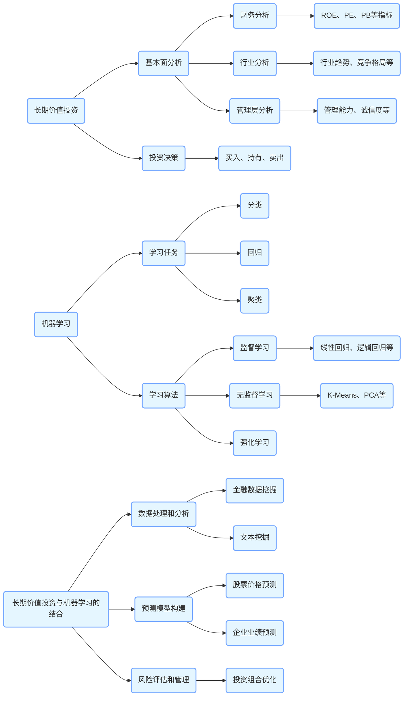

# 机器学习优化长期价值投资策略

> 关键词：机器学习、长期价值投资、优化策略、金融市场、算法模型

> 摘要：本文旨在探讨如何运用机器学习技术来优化长期价值投资策略。首先介绍了相关背景，包括目的、预期读者等内容。接着阐述了核心概念与联系，详细讲解了核心算法原理和具体操作步骤，并给出了相应的Python代码。同时，对涉及的数学模型和公式进行了详细说明与举例。通过项目实战展示了如何在实际中运用这些技术，分析了实际应用场景。还推荐了学习资源、开发工具框架以及相关论文著作。最后总结了未来发展趋势与挑战，并对常见问题进行了解答，提供了扩展阅读和参考资料，帮助投资者更好地利用机器学习提升长期价值投资的效果。

## 1. 背景介绍 
### 1.1 目的和范围
在金融市场中，长期价值投资是一种备受关注的投资策略，其核心在于通过深入分析企业的基本面，寻找具有长期增长潜力和内在价值被低估的资产，并长期持有以获取收益。然而，传统的长期价值投资策略在面对复杂多变的金融市场时，往往面临着信息处理能力有限、难以准确预测市场变化等问题。

本文章的目的是研究如何借助机器学习的强大能力，优化长期价值投资策略。通过对大量金融数据的分析和挖掘，利用机器学习算法构建预测模型，帮助投资者更准确地评估资产的价值和未来走势，从而制定更合理的投资决策。

范围涵盖了常见的机器学习算法在长期价值投资中的应用，包括数据收集、数据预处理、模型构建、模型评估和优化等环节。同时，结合实际案例，探讨了如何将这些技术应用到股票、基金等金融资产的投资中。

### 1.2 预期读者
本文的预期读者主要包括以下几类人群：
- **投资者**：无论是个人投资者还是机构投资者，希望通过学习机器学习技术来优化自己的长期价值投资策略，提高投资收益。
- **金融从业者**：如金融分析师、投资顾问等，希望借助机器学习工具提升自己的分析能力和服务质量。
- **技术人员**：对金融领域感兴趣的机器学习工程师、数据科学家等，希望了解如何将机器学习技术应用到实际的金融投资场景中。
- **学生和研究人员**：相关专业的学生和从事金融科技研究的人员，希望通过本文了解机器学习在金融投资领域的应用现状和发展趋势。

### 1.3 文档结构概述
本文将按照以下结构进行组织：
- 核心概念与联系：介绍长期价值投资和机器学习的基本概念，以及它们之间的联系和相互作用。
- 核心算法原理 & 具体操作步骤：详细讲解常用的机器学习算法在长期价值投资中的应用原理，并给出具体的操作步骤和Python代码示例。
- 数学模型和公式 & 详细讲解 & 举例说明：对涉及的数学模型和公式进行详细解释，并通过实际例子说明其应用。
- 项目实战：通过一个具体的项目案例，展示如何运用机器学习技术优化长期价值投资策略，包括开发环境搭建、源代码实现和代码解读。
- 实际应用场景：探讨机器学习在长期价值投资中的实际应用场景，如股票筛选、资产配置等。
- 工具和资源推荐：推荐学习机器学习和长期价值投资的相关资源，包括书籍、在线课程、技术博客和网站等，以及开发工具框架和相关论文著作。
- 总结：未来发展趋势与挑战：总结机器学习在长期价值投资中的应用现状，分析未来的发展趋势和可能面临的挑战。
- 附录：常见问题与解答：对读者可能关心的常见问题进行解答。
- 扩展阅读 & 参考资料：提供进一步学习和研究的扩展阅读材料和参考资料。

### 1.4 术语表
#### 1.4.1 核心术语定义
- **长期价值投资**：一种投资策略，投资者通过对企业的基本面进行深入分析，寻找具有长期增长潜力和内在价值被低估的资产，并长期持有，以获取资产增值和股息收益。
- **机器学习**：一门多领域交叉学科，涉及概率论、统计学、逼近论、凸分析、算法复杂度理论等多门学科。它专门研究计算机怎样模拟或实现人类的学习行为，以获取新的知识或技能，重新组织已有的知识结构使之不断改善自身的性能。
- **特征工程**：将原始数据转换为更能代表预测模型的潜在问题的特征的过程，包括特征提取、特征选择和特征变换等步骤。
- **过拟合**：模型在训练数据上表现良好，但在测试数据或新数据上表现不佳的现象，通常是由于模型过于复杂，学习了训练数据中的噪声和异常值。
- **欠拟合**：模型在训练数据和测试数据上都表现不佳的现象，通常是由于模型过于简单，无法捕捉数据中的复杂关系。

#### 1.4.2 相关概念解释
- **金融数据**：包括股票价格、成交量、财务报表数据、宏观经济数据等，是进行长期价值投资分析的基础。
- **预测模型**：根据历史数据构建的，用于预测未来资产价格走势或企业业绩的数学模型。
- **投资组合**：由多种资产组成的集合，投资者通过合理配置不同资产的比例，实现风险分散和收益最大化。

#### 1.4.3 缩略词列表
- **ML**：Machine Learning，机器学习
- **AI**：Artificial Intelligence，人工智能
- **GDP**：Gross Domestic Product，国内生产总值
- **ROE**：Return on Equity，净资产收益率
- **PE**：Price-to-Earnings Ratio，市盈率

## 2. 核心概念与联系 

### 长期价值投资的核心概念
长期价值投资的核心在于寻找那些具有持续竞争优势、良好财务状况和稳定现金流的企业。投资者通过对企业的基本面进行深入分析，评估其内在价值，并在价格低于内在价值时买入，长期持有等待价值回归和企业成长带来的收益。

基本面分析主要包括以下几个方面：
- **财务分析**：通过分析企业的财务报表，如资产负债表、利润表和现金流量表，评估企业的盈利能力、偿债能力、运营能力等。常用的财务指标包括净资产收益率（ROE）、市盈率（PE）、市净率（PB）等。
- **行业分析**：研究企业所处的行业环境，包括行业的发展趋势、竞争格局、市场规模等。了解行业的前景和竞争态势有助于判断企业的发展潜力。
- **管理层分析**：评估企业管理层的能力和诚信度。优秀的管理层能够制定合理的战略规划，有效地管理企业，为股东创造价值。

### 机器学习的核心概念
机器学习是一门让计算机通过数据自动学习模式和规律，并进行预测和决策的学科。常见的机器学习任务包括分类、回归、聚类等。

- **分类**：将数据分为不同的类别。例如，将股票分为买入、持有和卖出三类。
- **回归**：预测连续的数值。例如，预测股票的未来价格。
- **聚类**：将数据分为不同的簇，使得同一簇内的数据具有较高的相似度。例如，将不同行业的股票进行聚类。

机器学习算法可以分为监督学习、无监督学习和强化学习。
- **监督学习**：使用带有标签的数据进行训练，模型学习输入数据和标签之间的映射关系。常见的监督学习算法包括线性回归、逻辑回归、决策树、支持向量机等。
- **无监督学习**：使用无标签的数据进行训练，模型学习数据的内在结构和模式。常见的无监督学习算法包括聚类算法（如K-Means）、降维算法（如主成分分析PCA）等。
- **强化学习**：智能体通过与环境进行交互，根据环境反馈的奖励信号来学习最优的行为策略。强化学习在金融投资中的应用包括动态资产配置等。

### 长期价值投资与机器学习的联系
机器学习可以为长期价值投资提供强大的工具和方法，帮助投资者更准确地评估资产的价值和未来走势。具体体现在以下几个方面：
- **数据处理和分析**：金融市场产生了大量的数据，机器学习可以帮助投资者快速处理和分析这些数据，提取有价值的信息。例如，通过文本挖掘技术分析新闻报道和社交媒体数据，了解市场情绪和投资者预期。
- **预测模型构建**：机器学习算法可以根据历史数据构建预测模型，预测股票价格、企业业绩等。这些模型可以为投资者提供决策依据，帮助他们选择更有潜力的投资标的。
- **风险评估和管理**：机器学习可以用于评估投资组合的风险，通过分析资产之间的相关性和波动性，优化投资组合的配置，降低风险。

### 核心概念原理和架构的文本示意图
```plaintext
长期价值投资
|-- 基本面分析
|   |-- 财务分析
|   |   |-- ROE、PE、PB等指标
|   |-- 行业分析
|   |   |-- 行业趋势、竞争格局等
|   |-- 管理层分析
|       |-- 管理能力、诚信度等
|-- 投资决策
|   |-- 买入、持有、卖出

机器学习
|-- 学习任务
|   |-- 分类
|   |-- 回归
|   |-- 聚类
|-- 学习算法
|   |-- 监督学习
|   |   |-- 线性回归、逻辑回归等
|   |-- 无监督学习
|   |   |-- K-Means、PCA等
|   |-- 强化学习

长期价值投资与机器学习的结合
|-- 数据处理和分析
|   |-- 金融数据挖掘
|   |-- 文本挖掘
|-- 预测模型构建
|   |-- 股票价格预测
|   |-- 企业业绩预测
|-- 风险评估和管理
|   |-- 投资组合优化
```

### Mermaid 流程图


## 3. 核心算法原理 & 具体操作步骤 

### 线性回归算法原理
线性回归是一种简单而常用的监督学习算法，用于预测连续的数值。其基本思想是通过寻找一条最佳的直线（在二维空间中）或超平面（在多维空间中），使得所有数据点到该直线或超平面的距离之和最小。

假设我们有一组训练数据 $(x_1, y_1), (x_2, y_2), \cdots, (x_n, y_n)$，其中 $x_i$ 是输入特征向量，$y_i$ 是对应的目标值。线性回归模型可以表示为：

$$y = \theta_0 + \theta_1x_1 + \theta_2x_2 + \cdots + \theta_mx_m + \epsilon$$

其中，$\theta_0, \theta_1, \cdots, \theta_m$ 是模型的参数，$\epsilon$ 是误差项。

我们的目标是找到一组最优的参数 $\theta = (\theta_0, \theta_1, \cdots, \theta_m)$，使得预测值 $\hat{y}$ 与真实值 $y$ 之间的误差最小。通常使用均方误差（Mean Squared Error, MSE）作为损失函数：

$$MSE(\theta) = \frac{1}{n} \sum_{i=1}^{n} (y_i - \hat{y}_i)^2 = \frac{1}{n} \sum_{i=1}^{n} (y_i - (\theta_0 + \theta_1x_{i1} + \theta_2x_{i2} + \cdots + \theta_mx_{im}))^2$$

通过最小化均方误差，可以得到最优的参数 $\theta$。常用的求解方法包括最小二乘法和梯度下降法。

### 线性回归算法的具体操作步骤
1. **数据收集和预处理**：收集相关的金融数据，如股票价格、财务指标等，并进行清洗、归一化等预处理操作。
2. **特征选择**：选择与目标变量相关的特征，去除无关或冗余的特征。
3. **划分训练集和测试集**：将数据划分为训练集和测试集，通常按照 70:30 或 80:20 的比例进行划分。
4. **模型训练**：使用训练集数据对线性回归模型进行训练，求解最优的参数 $\theta$。
5. **模型评估**：使用测试集数据对训练好的模型进行评估，计算均方误差、决定系数等评估指标。
6. **预测和决策**：使用训练好的模型对新的数据进行预测，并根据预测结果做出投资决策。

### Python代码实现
```python
import numpy as np
from sklearn.linear_model import LinearRegression
from sklearn.model_selection import train_test_split
from sklearn.metrics import mean_squared_error, r2_score

# 生成示例数据
np.random.seed(0)
X = np.random.rand(100, 1) * 10
y = 2 * X + 1 + np.random.randn(100, 1)

# 划分训练集和测试集
X_train, X_test, y_train, y_test = train_test_split(X, y, test_size=0.2, random_state=42)

# 创建线性回归模型
model = LinearRegression()

# 模型训练
model.fit(X_train, y_train)

# 模型预测
y_pred = model.predict(X_test)

# 模型评估
mse = mean_squared_error(y_test, y_pred)
r2 = r2_score(y_test, y_pred)

print(f"均方误差: {mse}")
print(f"决定系数: {r2}")
```

### 逻辑回归算法原理
逻辑回归是一种用于分类问题的监督学习算法，它通过逻辑函数（Sigmoid函数）将线性回归的输出映射到 [0, 1] 区间，从而实现概率预测。

逻辑函数的定义为：

$$\sigma(z) = \frac{1}{1 + e^{-z}}$$

其中，$z$ 是线性回归的输出：

$$z = \theta_0 + \theta_1x_1 + \theta_2x_2 + \cdots + \theta_mx_m$$

逻辑回归模型的预测概率可以表示为：

$$P(y = 1 | x) = \sigma(z) = \frac{1}{1 + e^{-(\theta_0 + \theta_1x_1 + \theta_2x_2 + \cdots + \theta_mx_m)}}$$

我们的目标是找到一组最优的参数 $\theta = (\theta_0, \theta_1, \cdots, \theta_m)$，使得模型对训练数据的预测概率最大。通常使用对数损失函数（Log Loss）作为损失函数：

$$L(\theta) = -\frac{1}{n} \sum_{i=1}^{n} [y_i \log(P(y_i = 1 | x_i)) + (1 - y_i) \log(1 - P(y_i = 1 | x_i))]$$

通过最小化对数损失函数，可以得到最优的参数 $\theta$。常用的求解方法包括梯度下降法。

### 逻辑回归算法的具体操作步骤
1. **数据收集和预处理**：收集相关的金融数据，并进行清洗、编码等预处理操作。
2. **特征选择**：选择与目标变量相关的特征，去除无关或冗余的特征。
3. **划分训练集和测试集**：将数据划分为训练集和测试集。
4. **模型训练**：使用训练集数据对逻辑回归模型进行训练，求解最优的参数 $\theta$。
5. **模型评估**：使用测试集数据对训练好的模型进行评估，计算准确率、精确率、召回率等评估指标。
6. **预测和决策**：使用训练好的模型对新的数据进行预测，并根据预测结果做出投资决策。

### Python代码实现
```python
from sklearn.datasets import make_classification
from sklearn.linear_model import LogisticRegression
from sklearn.model_selection import train_test_split
from sklearn.metrics import accuracy_score, precision_score, recall_score

# 生成示例数据
X, y = make_classification(n_samples=100, n_features=2, n_informative=2, n_redundant=0, random_state=42)

# 划分训练集和测试集
X_train, X_test, y_train, y_test = train_test_split(X, y, test_size=0.2, random_state=42)

# 创建逻辑回归模型
model = LogisticRegression()

# 模型训练
model.fit(X_train, y_train)

# 模型预测
y_pred = model.predict(X_test)

# 模型评估
accuracy = accuracy_score(y_test, y_pred)
precision = precision_score(y_test, y_pred)
recall = recall_score(y_test, y_pred)

print(f"准确率: {accuracy}")
print(f"精确率: {precision}")
print(f"召回率: {recall}")
```

## 4. 数学模型和公式 & 详细讲解 & 举例说明 

### 线性回归的数学模型和公式
线性回归的数学模型可以表示为：

$$y = \theta_0 + \theta_1x_1 + \theta_2x_2 + \cdots + \theta_mx_m + \epsilon$$

其中，$y$ 是目标变量，$x_1, x_2, \cdots, x_m$ 是输入特征，$\theta_0, \theta_1, \cdots, \theta_m$ 是模型的参数，$\epsilon$ 是误差项。

为了求解最优的参数 $\theta$，我们使用均方误差（MSE）作为损失函数：

$$MSE(\theta) = \frac{1}{n} \sum_{i=1}^{n} (y_i - \hat{y}_i)^2 = \frac{1}{n} \sum_{i=1}^{n} (y_i - (\theta_0 + \theta_1x_{i1} + \theta_2x_{i2} + \cdots + \theta_mx_{im}))^2$$

最小二乘法是一种直接求解最优参数 $\theta$ 的方法。对于简单线性回归（只有一个特征），最优参数的计算公式为：

$$\theta_1 = \frac{\sum_{i=1}^{n} (x_i - \bar{x})(y_i - \bar{y})}{\sum_{i=1}^{n} (x_i - \bar{x})^2}$$

$$\theta_0 = \bar{y} - \theta_1\bar{x}$$

其中，$\bar{x}$ 和 $\bar{y}$ 分别是 $x$ 和 $y$ 的均值。

### 举例说明
假设我们有以下一组数据：

| $x$ | $y$ |
| --- | --- |
| 1 | 3 |
| 2 | 5 |
| 3 | 7 |
| 4 | 9 |
| 5 | 11 |

首先，计算 $x$ 和 $y$ 的均值：

$$\bar{x} = \frac{1 + 2 + 3 + 4 + 5}{5} = 3$$

$$\bar{y} = \frac{3 + 5 + 7 + 9 + 11}{5} = 7$$

然后，计算 $\theta_1$：

$$\sum_{i=1}^{5} (x_i - \bar{x})(y_i - \bar{y}) = (1 - 3)(3 - 7) + (2 - 3)(5 - 7) + (3 - 3)(7 - 7) + (4 - 3)(9 - 7) + (5 - 3)(11 - 7) = 20$$

$$\sum_{i=1}^{5} (x_i - \bar{x})^2 = (1 - 3)^2 + (2 - 3)^2 + (3 - 3)^2 + (4 - 3)^2 + (5 - 3)^2 = 10$$

$$\theta_1 = \frac{20}{10} = 2$$

最后，计算 $\theta_0$：

$$\theta_0 = \bar{y} - \theta_1\bar{x} = 7 - 2 \times 3 = 1$$

因此，线性回归模型为 $y = 1 + 2x$。

### 逻辑回归的数学模型和公式
逻辑回归的数学模型通过逻辑函数（Sigmoid函数）将线性回归的输出映射到 [0, 1] 区间：

$$P(y = 1 | x) = \sigma(z) = \frac{1}{1 + e^{-z}}$$

其中，$z = \theta_0 + \theta_1x_1 + \theta_2x_2 + \cdots + \theta_mx_m$。

对数损失函数（Log Loss）的定义为：

$$L(\theta) = -\frac{1}{n} \sum_{i=1}^{n} [y_i \log(P(y_i = 1 | x_i)) + (1 - y_i) \log(1 - P(y_i = 1 | x_i))]$$

为了最小化对数损失函数，我们可以使用梯度下降法。梯度下降法的更新公式为：

$$\theta_j := \theta_j - \alpha \frac{\partial L(\theta)}{\partial \theta_j}$$

其中，$\alpha$ 是学习率，$\frac{\partial L(\theta)}{\partial \theta_j}$ 是对数损失函数关于参数 $\theta_j$ 的偏导数。

### 举例说明
假设我们有一个简单的二分类问题，只有一个特征 $x$，数据集如下：

| $x$ | $y$ |
| --- | --- |
| 1 | 1 |
| 2 | 1 |
| 3 | 0 |
| 4 | 0 |

初始参数 $\theta_0 = 0$，$\theta_1 = 0$，学习率 $\alpha = 0.1$。

首先，计算 $z$ 和 $P(y = 1 | x)$：

对于 $x = 1$：

$$z = \theta_0 + \theta_1x = 0 + 0 \times 1 = 0$$

$$P(y = 1 | x = 1) = \frac{1}{1 + e^{-0}} = 0.5$$

对于 $x = 2$：

$$z = \theta_0 + \theta_1x = 0 + 0 \times 2 = 0$$

$$P(y = 1 | x = 2) = \frac{1}{1 + e^{-0}} = 0.5$$

对于 $x = 3$：

$$z = \theta_0 + \theta_1x = 0 + 0 \times 3 = 0$$

$$P(y = 1 | x = 3) = \frac{1}{1 + e^{-0}} = 0.5$$

对于 $x = 4$：

$$z = \theta_0 + \theta_1x = 0 + 0 \times 4 = 0$$

$$P(y = 1 | x = 4) = \frac{1}{1 + e^{-0}} = 0.5$$

然后，计算对数损失函数的值：

$$L(\theta) = -\frac{1}{4} [(1 \times \log(0.5) + (1 - 1) \times \log(1 - 0.5)) + (1 \times \log(0.5) + (1 - 1) \times \log(1 - 0.5)) + (0 \times \log(0.5) + (1 - 0) \times \log(1 - 0.5)) + (0 \times \log(0.5) + (1 - 0) \times \log(1 - 0.5))] = 0.693$$

接着，计算偏导数：

$$\frac{\partial L(\theta)}{\partial \theta_0} = -\frac{1}{4} \sum_{i=1}^{4} (y_i - P(y_i = 1 | x_i)) = -\frac{1}{4} [(1 - 0.5) + (1 - 0.5) + (0 - 0.5) + (0 - 0.5)] = 0$$

$$\frac{\partial L(\theta)}{\partial \theta_1} = -\frac{1}{4} \sum_{i=1}^{4} x_i(y_i - P(y_i = 1 | x_i)) = -\frac{1}{4} [1 \times (1 - 0.5) + 2 \times (1 - 0.5) + 3 \times (0 - 0.5) + 4 \times (0 - 0.5)] = -0.5$$

最后，更新参数：

$$\theta_0 := \theta_0 - \alpha \frac{\partial L(\theta)}{\partial \theta_0} = 0 - 0.1 \times 0 = 0$$

$$\theta_1 := \theta_1 - \alpha \frac{\partial L(\theta)}{\partial \theta_1} = 0 - 0.1 \times (-0.5) = 0.05$$

重复以上步骤，直到对数损失函数收敛。

## 5. 项目实战：代码实际案例和详细解释说明 

### 5.1  开发环境搭建
#### 安装Python
首先，确保你已经安装了Python 3.x 版本。你可以从Python官方网站（https://www.python.org/downloads/） 下载并安装适合你操作系统的Python版本。

#### 安装必要的库
在项目中，我们将使用以下几个常用的Python库：
- **NumPy**：用于数值计算和数组操作。
- **Pandas**：用于数据处理和分析。
- **Scikit-learn**：用于机器学习算法的实现和模型评估。
- **Matplotlib**：用于数据可视化。

你可以使用以下命令来安装这些库：
```sh
pip install numpy pandas scikit-learn matplotlib
```

### 5.2  源代码详细实现和代码解读
#### 数据收集和预处理
我们将使用一个简单的股票数据集来演示如何运用机器学习优化长期价值投资策略。假设我们已经从某个数据源获取了股票的历史价格和财务指标数据，并将其保存为CSV文件。

```python
import pandas as pd
import numpy as np
from sklearn.preprocessing import StandardScaler

# 读取数据
data = pd.read_csv('stock_data.csv')

# 查看数据基本信息
print(data.info())

# 查看数据集行数和列数
rows, columns = data.shape

# 处理缺失值
if data.isnull().values.any():
    # 缺失数据较少，删除缺失值
    if sum(data.isnull().values.any(axis=1)) / rows < 0.2:
        data = data.dropna()
    # 缺失数据较多，进行填充
    else:
        for col in data.columns:
            # 数值类型数据用均值填充
            if data[col].dtype in ['int64', 'float64']:
                data[col] = data[col].fillna(data[col].mean())
            # 类别类型数据用众数填充
            else:
                data[col] = data[col].fillna(data[col].mode()[0])

# 分离特征和目标变量
X = data.drop('target', axis=1)
y = data['target']

# 数据标准化
scaler = StandardScaler()
X_scaled = scaler.fit_transform(X)
```
**代码解读**：
- `pd.read_csv('stock_data.csv')`：使用Pandas库的`read_csv`函数读取CSV文件中的数据。
- `data.info()`：查看数据的基本信息，包括列名、数据类型和缺失值情况。
- `data.isnull().values.any()`：检查数据中是否存在缺失值。
- `data.dropna()`：删除包含缺失值的行。
- `data[col].fillna(data[col].mean())`：使用均值填充数值类型的缺失值。
- `data[col].fillna(data[col].mode()[0])`：使用众数填充类别类型的缺失值。
- `StandardScaler()`：使用Scikit-learn库的`StandardScaler`类对特征数据进行标准化处理，使得数据的均值为 0，标准差为 1。

#### 划分训练集和测试集
```python
from sklearn.model_selection import train_test_split

# 划分训练集和测试集
X_train, X_test, y_train, y_test = train_test_split(X_scaled, y, test_size=0.2, random_state=42)
```
**代码解读**：
- `train_test_split`：使用Scikit-learn库的`train_test_split`函数将数据集划分为训练集和测试集，`test_size=0.2`表示测试集占总数据的 20%，`random_state=42`用于保证每次划分的结果一致。

#### 模型训练和评估
```python
from sklearn.linear_model import LinearRegression
from sklearn.metrics import mean_squared_error, r2_score

# 创建线性回归模型
model = LinearRegression()

# 模型训练
model.fit(X_train, y_train)

# 模型预测
y_pred = model.predict(X_test)

# 模型评估
mse = mean_squared_error(y_test, y_pred)
r2 = r2_score(y_test, y_pred)

print(f"均方误差: {mse}")
print(f"决定系数: {r2}")
```
**代码解读**：
- `LinearRegression()`：创建一个线性回归模型对象。
- `model.fit(X_train, y_train)`：使用训练集数据对模型进行训练。
- `model.predict(X_test)`：使用训练好的模型对测试集数据进行预测。
- `mean_squared_error(y_test, y_pred)`：计算预测值和真实值之间的均方误差。
- `r2_score(y_test, y_pred)`：计算模型的决定系数，衡量模型对数据的拟合程度。

### 5.3  代码解读与分析
通过以上代码，我们完成了一个简单的机器学习项目，用于优化长期价值投资策略。具体步骤包括数据收集和预处理、划分训练集和测试集、模型训练和评估。

在数据预处理阶段，我们处理了缺失值并对数据进行了标准化处理，这有助于提高模型的性能。在模型训练阶段，我们使用线性回归模型对数据进行拟合。最后，通过计算均方误差和决定系数，我们评估了模型的性能。

如果模型的均方误差较小，决定系数接近 1，说明模型的拟合效果较好，可以用于预测股票的未来走势。否则，我们可能需要尝试其他的机器学习算法或对数据进行进一步的处理和特征工程。

## 6. 实际应用场景 
### 股票筛选
机器学习可以帮助投资者筛选出具有长期投资价值的股票。通过对大量股票的历史数据和基本面信息进行分析，构建预测模型，预测股票的未来业绩和价格走势。投资者可以根据模型的预测结果，选择那些具有较高增长潜力和较低风险的股票进行投资。

例如，使用逻辑回归模型对股票进行分类，将股票分为买入、持有和卖出三类。通过对股票的财务指标、市场情绪等特征进行分析，模型可以预测股票的未来表现，为投资者提供决策依据。

### 资产配置
在长期价值投资中，合理的资产配置是降低风险、提高收益的关键。机器学习可以用于优化资产配置方案，通过分析不同资产之间的相关性和波动性，构建投资组合模型，实现风险分散和收益最大化。

例如，使用均值 - 方差模型或强化学习算法，根据投资者的风险偏好和投资目标，确定不同资产的最优配置比例。通过不断调整资产配置方案，适应市场变化，提高投资组合的绩效。

### 风险评估和管理
机器学习可以帮助投资者评估投资组合的风险，及时发现潜在的风险因素，并采取相应的措施进行风险控制。通过对市场数据、宏观经济数据等进行分析，构建风险评估模型，预测投资组合的风险水平。

例如，使用VaR（Value at Risk）模型或条件风险价值（CVaR）模型，计算投资组合在一定置信水平下的最大可能损失。通过对风险指标的监控和预警，投资者可以及时调整投资组合，降低风险。

### 市场情绪分析
市场情绪对股票价格的走势有着重要的影响。机器学习可以通过文本挖掘技术，分析新闻报道、社交媒体数据等，了解市场情绪和投资者预期。通过构建情绪分析模型，预测市场情绪的变化，为投资者提供决策参考。

例如，使用情感分析算法对新闻文章进行情感分类，判断文章的情感倾向是积极、消极还是中性。通过对市场情绪的实时监测，投资者可以及时调整投资策略，把握市场机会。

## 7. 工具和资源推荐
### 7.1 学习资源推荐
#### 7.1.1 书籍推荐
- 《机器学习》（周志华）：这本书是机器学习领域的经典教材，系统地介绍了机器学习的基本概念、算法和应用。内容涵盖了监督学习、无监督学习、强化学习等多个方面，适合初学者和有一定基础的读者。
- 《Python机器学习》（Sebastian Raschka）：本书以Python为工具，详细介绍了机器学习的各种算法和实践技巧。通过大量的代码示例和案例分析，帮助读者快速掌握机器学习的应用。
- 《金融市场的机器学习》（Marcos Lopez de Prado）：这本书专门介绍了机器学习在金融市场中的应用，包括股票投资、风险管理、资产配置等方面。书中提供了很多实际案例和代码实现，对金融从业者和投资者有很大的帮助。

#### 7.1.2 在线课程
- Coursera上的“机器学习”课程（Andrew Ng）：这是一门非常经典的机器学习在线课程，由斯坦福大学的Andrew Ng教授授课。课程内容涵盖了机器学习的基本概念、算法和应用，通过视频讲解、编程作业和考试等方式，帮助学习者系统地掌握机器学习知识。
- edX上的“数据科学与机器学习微硕士项目”：该项目由伯克利大学推出，包含多门数据科学和机器学习相关的课程，如数据处理、机器学习算法、深度学习等。学习者可以通过完成课程作业和项目实践，获得微硕士学位。
- 网易云课堂上的“Python金融数据分析实战”：这门课程结合金融领域的实际案例，介绍了如何使用Python进行金融数据分析和机器学习建模。课程内容包括数据获取、数据清洗、特征工程、模型训练和评估等方面，适合对金融数据分析感兴趣的学习者。

#### 7.1.3 技术博客和网站
- Towards Data Science：这是一个专注于数据科学和机器学习的技术博客平台，上面有很多优秀的文章和教程，涵盖了机器学习的各个方面。作者们分享了自己的实践经验和研究成果，对学习者有很大的启发。
- Kaggle：Kaggle是一个数据科学竞赛平台，上面有很多真实的数据集和竞赛项目。学习者可以通过参与竞赛，与其他数据科学家交流和学习，提高自己的实践能力。
- 机器之心：这是一个专注于人工智能和机器学习的科技媒体网站，提供了最新的行业动态、技术文章和研究报告。学习者可以通过关注该网站，了解机器学习领域的最新发展趋势。

### 7.2 开发工具框架推荐
#### 7.2.1 IDE和编辑器
- PyCharm：这是一款专业的Python集成开发环境（IDE），具有代码编辑、调试、代码分析等功能。它支持多种Python库和框架，适合开发机器学习项目。
- Jupyter Notebook：Jupyter Notebook是一个交互式的开发环境，支持Python、R等多种编程语言。它以网页的形式展示代码和结果，方便用户进行数据探索和模型实验。
- Visual Studio Code：这是一款轻量级的代码编辑器，具有丰富的插件和扩展功能。它支持Python开发，并且可以与Git等版本控制系统集成，适合团队协作开发。

#### 7.2.2 调试和性能分析工具
- Py-Spy：这是一个用于Python程序性能分析的工具，可以实时监测程序的CPU使用率和函数调用情况。通过分析性能瓶颈，帮助开发者优化代码。
- cProfile：这是Python标准库中的一个性能分析模块，可以统计函数的调用次数、执行时间等信息。开发者可以使用cProfile来找出程序中的性能瓶颈。
- PDB：这是Python标准库中的一个调试模块，可以在程序中设置断点，单步执行代码，查看变量的值。开发者可以使用PDB来调试程序中的错误。

#### 7.2.3 相关框架和库
- Scikit-learn：这是一个常用的机器学习库，提供了丰富的机器学习算法和工具，如分类、回归、聚类等。它具有简单易用的API，适合初学者和快速开发。
- TensorFlow：这是一个开源的深度学习框架，由Google开发。它支持多种深度学习模型，如神经网络、卷积神经网络等。TensorFlow具有高效的计算能力和分布式训练功能，适合大规模的深度学习项目。
- PyTorch：这是另一个流行的深度学习框架，由Facebook开发。它具有动态图机制，使得模型的构建和调试更加灵活。PyTorch在学术界和工业界都有广泛的应用。

### 7.3 相关论文著作推荐
#### 7.3.1 经典论文
- 《A Mathematical Theory of Communication》（Claude E. Shannon）：这篇论文奠定了信息论的基础，对机器学习中的特征选择、模型评估等方面有重要的影响。
- 《Neural Networks and Deep Learning》（Michael Nielsen）：这本书是深度学习领域的经典著作，详细介绍了神经网络的基本原理和训练方法。
- 《The Elements of Statistical Learning》（Trevor Hastie, Robert Tibshirani, Jerome Friedman）：这本书是统计学习领域的经典教材，系统地介绍了统计学习的理论和方法，包括线性模型、树模型、支持向量机等。

#### 7.3.2 最新研究成果
- 《Deep Reinforcement Learning for Portfolio Management》：这篇论文研究了如何使用深度强化学习算法进行投资组合管理，通过模拟交易环境，学习最优的投资策略。
- 《Machine Learning for Credit Risk Assessment》：该论文探讨了机器学习在信用风险评估中的应用，通过构建预测模型，评估借款人的信用风险。
- 《Using Machine Learning to Predict Stock Price Movements》：这篇论文研究了如何使用机器学习算法预测股票价格的走势，通过分析历史数据和市场情绪，提高预测的准确性。

#### 7.3.3 应用案例分析
- 《Machine Learning in Finance: From Theory to Practice》：这本书介绍了机器学习在金融领域的各种应用案例，包括股票投资、风险管理、信用评分等。通过实际案例分析，帮助读者了解机器学习在金融领域的实际应用。
- 《AI in Finance: Transforming Financial Services》：该书探讨了人工智能在金融服务领域的应用，包括智能投顾、风险预测、客户服务等方面。书中提供了很多实际案例和行业趋势分析，对金融从业者有很大的参考价值。

## 8. 总结：未来发展趋势与挑战
### 未来发展趋势
- **融合多源数据**：未来，机器学习在长期价值投资中的应用将更加注重融合多源数据，包括金融数据、社交媒体数据、新闻报道数据等。通过综合分析不同来源的数据，挖掘更多有价值的信息，提高投资决策的准确性。
- **强化学习的应用**：强化学习在动态资产配置和交易策略优化方面具有很大的潜力。未来，随着强化学习算法的不断发展和完善，它将在长期价值投资中得到更广泛的应用。
- **深度学习的深入应用**：深度学习在图像识别、自然语言处理等领域取得了巨大的成功。在长期价值投资中，深度学习可以用于处理复杂的金融数据和文本信息，挖掘隐藏的模式和规律，为投资决策提供更有力的支持。
- **智能化投资顾问**：随着人工智能技术的发展，智能化投资顾问将逐渐普及。智能化投资顾问可以根据投资者的风险偏好、投资目标和财务状况，为其提供个性化的投资建议和资产配置方案，提高投资效率和服务质量。

### 挑战
- **数据质量和隐私问题**：金融数据的质量和隐私是机器学习在长期价值投资中面临的重要挑战。数据的准确性、完整性和一致性直接影响模型的性能。同时，金融数据涉及到用户的隐私和商业机密，如何保护数据的安全和隐私是一个亟待解决的问题。
- **模型解释性和可解释性**：很多机器学习模型，尤其是深度学习模型，具有很强的黑盒性质，难以解释模型的决策过程和结果。在金融投资领域，投资者需要了解模型的决策依据，以便做出合理的投资决策。因此，提高模型的解释性和可解释性是一个重要的研究方向。
- **市场不确定性和风险**：金融市场具有高度的不确定性和风险，机器学习模型很难完全准确地预测市场的变化。市场的突发事件、政策变化等因素都可能导致模型的失效。因此，如何在不确定的市场环境中有效地应用机器学习技术，降低投资风险，是一个需要解决的问题。
- **人才短缺**：机器学习在长期价值投资中的应用需要具备金融知识和机器学习技能的复合型人才。目前，这类人才相对短缺，制约了机器学习技术在金融投资领域的推广和应用。

## 9. 附录：常见问题与解答
### 问题1：机器学习模型的预测结果一定准确吗？
答：机器学习模型的预测结果并不是绝对准确的。模型的性能受到多种因素的影响，如数据质量、特征选择、模型选择和参数调整等。金融市场具有高度的不确定性和复杂性，即使是最好的模型也无法完全准确地预测市场的变化。因此，投资者在使用机器学习模型的预测结果时，应该结合自己的经验和判断，进行综合分析。

### 问题2：如何选择合适的机器学习算法？
答：选择合适的机器学习算法需要考虑多个因素，包括问题的类型（分类、回归、聚类等）、数据的特点（数据量、特征维度、数据分布等）、模型的复杂度和可解释性等。一般来说，可以先尝试一些简单的算法，如线性回归、逻辑回归等，作为基准模型。然后，根据模型的性能和需求，尝试更复杂的算法，如决策树、支持向量机、神经网络等。同时，可以使用交叉验证等方法来评估不同算法的性能，选择最优的算法。

### 问题3：如何处理金融数据中的缺失值和异常值？
答：处理金融数据中的缺失值和异常值可以采用以下方法：
- **缺失值处理**：如果缺失值较少，可以直接删除包含缺失值的样本；如果缺失值较多，可以使用均值、中位数、众数等统计量进行填充，或者使用插值方法进行填充。对于时间序列数据，还可以使用时间序列模型进行预测填充。
- **异常值处理**：可以使用统计方法，如Z-score、箱线图等，识别异常值。对于异常值，可以直接删除，或者进行修正，如将异常值替换为合理的数值。

### 问题4：机器学习模型会过拟合吗？如何避免过拟合？
答：机器学习模型可能会出现过拟合的问题。过拟合是指模型在训练数据上表现良好，但在测试数据或新数据上表现不佳的现象。为了避免过拟合，可以采用以下方法：
- **增加数据量