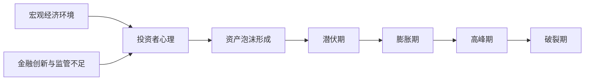

# 杰里米·格兰瑟姆的资产泡沫理论

> 关键词：杰里米·格兰瑟姆、资产泡沫理论、市场周期、泡沫形成、泡沫破裂

> 摘要：本文深入探讨杰里米·格兰瑟姆的资产泡沫理论。格兰瑟姆作为投资界的传奇人物，其资产泡沫理论对于理解金融市场的周期性波动、资产价格的异常变化具有重要意义。文章首先介绍研究该理论的背景、目的、预期读者和文档结构等内容。接着阐述核心概念与联系，包括资产泡沫的定义、形成机制等，并给出相应的示意图和流程图。详细讲解核心算法原理和具体操作步骤，运用Python代码进行说明。通过数学模型和公式进一步剖析该理论，结合实际案例举例说明。开展项目实战，搭建开发环境，给出源代码实现及详细解读。分析该理论在实际中的应用场景，推荐相关的学习资源、开发工具框架和论文著作。最后总结未来发展趋势与挑战，解答常见问题，并提供扩展阅读和参考资料，帮助读者全面深入地理解杰里米·格兰瑟姆的资产泡沫理论。

## 1. 背景介绍 
### 1.1 目的和范围
本研究旨在全面剖析杰里米·格兰瑟姆的资产泡沫理论，深入理解其理论内涵、形成机制、发展过程以及对金融市场的影响。范围涵盖理论的核心概念、相关算法原理、数学模型，通过实际案例展示理论的应用，同时探讨其在不同市场环境下的适用性和局限性。通过对该理论的研究，为投资者、金融从业者和研究人员提供有价值的参考，帮助他们更好地识别和应对资产泡沫，降低投资风险，把握市场机会。

### 1.2 预期读者
本文的预期读者包括但不限于以下几类人群：
- **投资者**：无论是个人投资者还是机构投资者，都可以从格兰瑟姆的资产泡沫理论中获取有关市场趋势和风险的信息，从而优化投资策略，提高投资收益。
- **金融从业者**：如银行职员、证券分析师、基金经理等，深入理解该理论有助于他们更好地为客户提供专业的金融服务，评估市场风险，制定合理的投资建议。
- **研究人员**：从事金融市场、经济学等领域研究的学者和研究人员，可以将该理论作为研究的参考和基础，进一步探索资产泡沫的形成机制、影响因素和应对策略。
- **对金融市场感兴趣的人士**：希望了解金融市场运行规律、资产价格波动原因的普通读者，通过阅读本文可以对资产泡沫有更深入的认识。

### 1.3 文档结构概述
本文将按照以下结构进行阐述：
- **核心概念与联系**：介绍资产泡沫的定义、形成机制、发展阶段等核心概念，并通过示意图和流程图展示各概念之间的联系。
- **核心算法原理 & 具体操作步骤**：讲解用于识别和分析资产泡沫的算法原理，并用Python代码实现具体操作步骤。
- **数学模型和公式 & 详细讲解 & 举例说明**：运用数学模型和公式对资产泡沫理论进行量化分析，结合实际案例详细说明模型的应用。
- **项目实战：代码实际案例和详细解释说明**：搭建开发环境，给出实际的Python代码实现，并对代码进行详细解读。
- **实际应用场景**：分析该理论在不同金融市场和投资领域的实际应用场景。
- **工具和资源推荐**：推荐学习该理论的相关书籍、在线课程、技术博客和网站，以及开发工具、框架和相关论文著作。
- **总结：未来发展趋势与挑战**：总结资产泡沫理论的发展趋势，分析面临的挑战和问题。
- **附录：常见问题与解答**：解答读者在理解和应用该理论过程中常见的问题。
- **扩展阅读 & 参考资料**：提供进一步深入学习的扩展阅读材料和参考资料。

### 1.4 术语表
#### 1.4.1 核心术语定义
- **资产泡沫**：指资产价格严重偏离其内在价值的现象，通常表现为资产价格在短期内急剧上涨，随后可能出现大幅下跌。
- **内在价值**：资产的真实价值，由其基本面因素如盈利能力、现金流、资产质量等决定。
- **市场周期**：金融市场价格波动的周期性变化，包括上升期、高峰期、下降期和低谷期。
- **泡沫破裂**：资产价格在泡沫形成后急剧下跌，回归到或接近其内在价值的过程。

#### 1.4.2 相关概念解释
- **非理性繁荣**：投资者在市场情绪的影响下，过度乐观地看待资产的未来收益，导致资产价格被高估的现象。
- **羊群效应**：投资者在决策时受到其他投资者的影响，盲目跟随市场趋势进行投资的行为。
- **杠杆**：投资者通过借入资金进行投资，以增加投资收益的方式。在资产泡沫期间，高杠杆可能加剧市场的波动。

#### 1.4.3 缩略词列表
- **P/E**：市盈率（Price-to-Earnings Ratio），衡量股票价格相对于每股收益的指标。
- **GDP**：国内生产总值（Gross Domestic Product），衡量一个国家或地区经济活动总量的指标。

## 2. 核心概念与联系 
### 资产泡沫的定义与本质
资产泡沫是金融市场中一种常见且复杂的现象。从本质上讲，资产泡沫是资产价格脱离其内在价值的过度膨胀。内在价值是基于资产的基本面因素，如公司的盈利能力、现金流、资产质量等所确定的合理价值。当市场参与者对资产的预期过于乐观，导致资产价格大幅高于其内在价值时，就形成了资产泡沫。

例如，在房地产市场中，如果一套房子的租金回报率和周边类似房产的价格等基本面因素决定其合理价值为100万元，但由于市场上投资者的过度追捧和投机行为，该房子的价格被炒到了200万元，那么这中间的100万元差价就可能是资产泡沫的体现。

### 资产泡沫的形成机制
资产泡沫的形成通常受到多种因素的综合影响，主要包括以下几个方面：

#### 宏观经济环境
宽松的货币政策是资产泡沫形成的重要诱因之一。当央行降低利率、增加货币供应量时，市场上的资金变得更加充裕，投资者为了追求更高的收益，会将资金投入到各类资产市场中，从而推动资产价格上涨。例如，在2008年全球金融危机后，许多国家的央行采取了量化宽松政策，大量资金流入房地产和股票市场，导致这些市场的资产价格大幅上涨，形成了一定程度的资产泡沫。

经济的高速增长也会增强投资者的信心，促使他们加大对资产的投资。当经济处于繁荣阶段时，企业的盈利状况通常较好，投资者预期未来资产的收益会更高，从而愿意以更高的价格购买资产，推动资产价格偏离其内在价值。

#### 投资者心理因素
非理性繁荣是资产泡沫形成的重要心理因素。在市场上涨阶段，投资者往往会受到乐观情绪的影响，过度相信资产价格会持续上涨，忽视了潜在的风险。他们可能会根据过去的价格走势来预测未来，而忽略了资产的基本面情况。这种非理性的投资行为会导致资产价格进一步上涨，形成自我强化的循环。

羊群效应也是导致资产泡沫形成的重要原因之一。投资者往往会受到周围其他投资者的影响，当看到别人在某个资产市场中获利时，会盲目跟风进入市场，而不考虑自己的投资目标和风险承受能力。这种集体的投资行为会进一步推动资产价格的上涨，加剧资产泡沫的形成。

#### 金融创新与监管不足
金融创新可以为投资者提供更多的投资工具和渠道，但也可能增加市场的复杂性和风险。一些复杂的金融衍生品在资产泡沫形成过程中可能起到了推波助澜的作用。例如，在2007 - 2008年的美国次贷危机中，次级抵押贷款支持证券等金融衍生品的过度创新和滥用，使得房地产市场的风险被放大，最终导致了房地产泡沫的破裂。

监管不足也是资产泡沫形成的一个重要因素。如果监管机构对金融市场的监管不力，不能及时发现和制止市场中的违规行为和过度投机行为，就容易导致资产价格的过度波动和泡沫的形成。

### 资产泡沫的发展阶段
杰里米·格兰瑟姆认为资产泡沫通常经历以下几个阶段：

#### 潜伏期
在这个阶段，市场环境相对稳定，资产价格可能开始缓慢上涨，但涨幅较小，尚未引起广泛关注。此时，一些基本面因素可能已经开始发生变化，如宏观经济政策的调整、行业的发展趋势等，但市场参与者对这些变化的反应较为迟钝。

#### 膨胀期
随着时间的推移，资产价格开始加速上涨，吸引了越来越多的投资者进入市场。市场上的乐观情绪逐渐蔓延，投资者的信心不断增强，他们纷纷加大对资产的投资。在这个阶段，资产价格的上涨往往脱离了其内在价值，泡沫开始逐渐形成。

#### 高峰期
资产价格达到最高点，市场上的乐观情绪达到顶峰。此时，几乎所有的投资者都参与到市场中，媒体也对市场的繁荣进行大肆宣传。但实际上，资产价格已经严重偏离其内在价值，泡沫已经非常大，市场的风险也在不断积累。

#### 破裂期
当市场上的一些因素发生变化，如宏观经济政策的调整、企业盈利状况的恶化等，投资者的信心开始动摇，资产价格开始下跌。随着价格的下跌，更多的投资者开始恐慌性抛售资产，导致资产价格进一步暴跌，泡沫破裂。

### 核心概念联系的文本示意图
```plaintext
宏观经济环境（宽松货币政策、经济增长）
         |
         v
投资者心理（非理性繁荣、羊群效应）
         |
         v
金融创新与监管不足
         |
         v
资产泡沫形成（潜伏期 -> 膨胀期 -> 高峰期 -> 破裂期）
```

### Mermaid 流程图


## 3. 核心算法原理 & 具体操作步骤 
### 识别资产泡沫的核心算法原理
要识别资产泡沫，关键在于判断资产价格是否偏离其内在价值。一种常用的方法是通过建立资产价格与基本面因素之间的关系模型，计算资产的内在价值，然后将其与实际市场价格进行比较。如果市场价格显著高于内在价值，则可能存在资产泡沫。

这里我们以股票市场为例，使用市盈率（P/E）指标来构建一个简单的资产泡沫识别模型。市盈率是股票价格与每股收益的比值，反映了投资者为获取每股收益所愿意支付的价格。一般来说，不同行业的市盈率水平会有所不同，但在一定时期内，同一行业的市盈率应该围绕一个合理的均值波动。如果某只股票或整个市场的市盈率大幅高于其历史均值或行业均值，就可能意味着存在资产泡沫。

### 具体操作步骤及 Python 代码实现
#### 步骤 1：数据收集
首先，我们需要收集股票的历史价格数据和每股收益数据，以及行业的平均市盈率数据。这里我们使用 `pandas-datareader` 库来获取股票数据，假设我们要分析的股票是苹果公司（AAPL），数据来源为雅虎财经。

```python
import pandas as pd
import pandas_datareader.data as web
import datetime

# 定义数据收集的时间范围
start = datetime.datetime(2010, 1, 1)
end = datetime.datetime(2023, 12, 31)

# 获取苹果公司的股票数据
aapl = web.DataReader('AAPL', 'yahoo', start, end)

# 假设我们已经有了苹果公司的每股收益数据（这里简单模拟）
eps_data = pd.Series([5.0, 5.5, 6.0, 6.5, 7.0], index=pd.date_range(start='2019-01-01', periods=5, freq='Y'))

# 假设我们已经有了行业平均市盈率数据（这里简单模拟）
industry_pe = pd.Series([15, 16, 17, 18, 19], index=pd.date_range(start='2019-01-01', periods=5, freq='Y'))
```

#### 步骤 2：计算市盈率
根据收集到的股票价格数据和每股收益数据，计算股票的市盈率。

```python
# 计算苹果公司每年的市盈率
aapl['PE'] = aapl['Close'] / eps_data.reindex(aapl.index, method='ffill')
```

#### 步骤 3：判断泡沫情况
将计算得到的股票市盈率与行业平均市盈率进行比较，如果股票市盈率显著高于行业平均市盈率，则认为可能存在资产泡沫。

```python
# 定义泡沫判断阈值（这里假设为行业平均市盈率的 1.5 倍）
threshold = 1.5

# 判断是否存在泡沫
aapl['Is_Bubble'] = aapl['PE'] > industry_pe.reindex(aapl.index, method='ffill') * threshold

# 输出存在泡沫的日期
bubble_dates = aapl[aapl['Is_Bubble']].index
print("可能存在资产泡沫的日期：", bubble_dates)
```

### 代码解释
- **数据收集部分**：使用 `pandas-datareader` 库从雅虎财经获取苹果公司的股票数据，并模拟了每股收益数据和行业平均市盈率数据。
- **计算市盈率部分**：通过将股票收盘价除以每股收益，计算出苹果公司每年的市盈率。
- **判断泡沫情况部分**：定义了一个泡沫判断阈值，将股票市盈率与行业平均市盈率的 1.5 倍进行比较，如果股票市盈率高于该值，则认为可能存在资产泡沫，并输出存在泡沫的日期。

需要注意的是，这只是一个简单的资产泡沫识别模型，实际应用中还需要考虑更多的因素，如宏观经济环境、行业发展趋势等。

## 4. 数学模型和公式 & 详细讲解 & 举例说明 
### 基于市盈率的资产泡沫数学模型
在前面的核心算法原理中，我们使用了市盈率来判断资产泡沫。这里我们进一步详细介绍基于市盈率的资产泡沫数学模型。

设 $P$ 为股票的市场价格，$EPS$ 为每股收益，$PE$ 为市盈率，则有：

$$PE = \frac{P}{EPS}$$

设 $PE_{industry}$ 为行业平均市盈率，$\alpha$ 为泡沫判断阈值（通常 $\alpha > 1$）。当 $PE > \alpha \times PE_{industry}$ 时，我们认为该股票可能存在资产泡沫。

### 详细讲解
- **市盈率的含义**：市盈率反映了投资者为获取每股收益所愿意支付的价格。较高的市盈率可能意味着投资者对该股票的未来收益有较高的预期，但也可能是资产价格被高估的信号。
- **行业平均市盈率的作用**：行业平均市盈率可以作为一个参考标准，用来衡量某只股票的市盈率是否合理。不同行业的市盈率水平会有所不同，因此使用行业平均市盈率进行比较更为合理。
- **泡沫判断阈值的确定**：泡沫判断阈值 $\alpha$ 的确定需要根据具体的市场情况和历史数据进行分析。一般来说，$\alpha$ 的值越大，判断资产泡沫的标准就越严格；$\alpha$ 的值越小，判断资产泡沫的标准就越宽松。

### 举例说明
假设苹果公司某一年的股票收盘价为 150 美元，每股收益为 5 美元，则该年苹果公司的市盈率为：

$$PE = \frac{150}{5} = 30$$

假设该行业的平均市盈率为 20，我们设定泡沫判断阈值 $\alpha = 1.5$，则 $\alpha \times PE_{industry} = 1.5 \times 20 = 30$。由于苹果公司的市盈率等于 $\alpha \times PE_{industry}$，按照我们的模型判断，该年苹果公司的股票可能处于资产泡沫的边缘。

### 更复杂的数学模型：基于现金流折现的资产内在价值模型
除了市盈率模型，我们还可以使用现金流折现模型（DCF）来计算资产的内在价值，从而判断资产是否存在泡沫。

设 $V$ 为资产的内在价值，$CF_t$ 为第 $t$ 期的现金流，$r$ 为折现率，$n$ 为预测期数，则现金流折现模型的公式为：

$$V = \sum_{t=1}^{n} \frac{CF_t}{(1 + r)^t} + \frac{TV}{(1 + r)^n}$$

其中，$TV$ 为资产在预测期结束后的终值，通常可以使用永续增长模型来计算：

$$TV = \frac{CF_{n+1}}{r - g}$$

这里，$CF_{n+1}$ 为预测期结束后下一期的现金流，$g$ 为永续增长率。

### 详细讲解
- **现金流的确定**：现金流是指资产在未来各期产生的现金流入减去现金流出后的净额。对于股票来说，现金流可以是公司的净利润加上折旧、摊销等非现金支出。
- **折现率的选择**：折现率反映了投资者对资产未来现金流的风险补偿要求。一般来说，折现率可以使用资本资产定价模型（CAPM）来计算：

$$r = R_f + \beta \times (R_m - R_f)$$

其中，$R_f$ 为无风险利率，$\beta$ 为资产的贝塔系数，$R_m$ 为市场收益率。

- **预测期数和永续增长率的确定**：预测期数需要根据资产的具体情况进行确定，一般可以选择 5 - 10 年。永续增长率是指资产在预测期结束后长期稳定的增长率，通常取值在 2% - 3% 之间。

### 举例说明
假设某公司未来 5 年的现金流分别为 100 万元、120 万元、140 万元、160 万元和 180 万元，预测期结束后下一期的现金流为 200 万元，永续增长率为 3%，折现率为 10%。则该公司的内在价值计算如下：

首先，计算预测期内现金流的现值：

$$PV_{CF} = \frac{100}{(1 + 0.1)^1} + \frac{120}{(1 + 0.1)^2} + \frac{140}{(1 + 0.1)^3} + \frac{160}{(1 + 0.1)^4} + \frac{180}{(1 + 0.1)^5} \approx 536.57$$（万元）

然后，计算终值：

$$TV = \frac{200}{0.1 - 0.03} \approx 2857.14$$（万元）

终值的现值为：

$$PV_{TV} = \frac{2857.14}{(1 + 0.1)^5} \approx 1770.83$$（万元）

最后，计算公司的内在价值：

$$V = PV_{CF} + PV_{TV} \approx 536.57 + 1770.83 = 2307.4$$（万元）

如果该公司的市场价值为 3000 万元，明显高于其内在价值，则可能存在资产泡沫。

## 5. 项目实战：代码实际案例和详细解释说明 
### 5.1  开发环境搭建
#### 安装 Python
首先，确保你已经安装了 Python 环境。建议使用 Python 3.7 及以上版本。你可以从 Python 官方网站（https://www.python.org/downloads/）下载适合你操作系统的安装包，并按照安装向导进行安装。

#### 安装必要的库
在项目中，我们需要使用一些 Python 库来获取数据、进行数据分析和可视化。可以使用以下命令来安装这些库：

```bash
pip install pandas pandas-datareader matplotlib
```

- **pandas**：用于数据处理和分析。
- **pandas-datareader**：用于从各种数据源获取金融数据。
- **matplotlib**：用于数据可视化。

### 5.2  源代码详细实现和代码解读
#### 完整代码示例
```python
import pandas as pd
import pandas_datareader.data as web
import datetime
import matplotlib.pyplot as plt

# 定义数据收集的时间范围
start = datetime.datetime(2010, 1, 1)
end = datetime.datetime(2023, 12, 31)

# 获取苹果公司的股票数据
aapl = web.DataReader('AAPL', 'yahoo', start, end)

# 假设我们已经有了苹果公司的每股收益数据（这里简单模拟）
eps_data = pd.Series([5.0, 5.5, 6.0, 6.5, 7.0], index=pd.date_range(start='2019-01-01', periods=5, freq='Y'))

# 假设我们已经有了行业平均市盈率数据（这里简单模拟）
industry_pe = pd.Series([15, 16, 17, 18, 19], index=pd.date_range(start='2019-01-01', periods=5, freq='Y'))

# 计算苹果公司每年的市盈率
aapl['PE'] = aapl['Close'] / eps_data.reindex(aapl.index, method='ffill')

# 定义泡沫判断阈值（这里假设为行业平均市盈率的 1.5 倍）
threshold = 1.5

# 判断是否存在泡沫
aapl['Is_Bubble'] = aapl['PE'] > industry_pe.reindex(aapl.index, method='ffill') * threshold

# 可视化市盈率和泡沫判断结果
plt.figure(figsize=(12, 6))
plt.plot(aapl.index, aapl['PE'], label='Apple PE')
plt.plot(industry_pe.reindex(aapl.index, method='ffill') * threshold, label='Bubble Threshold')
plt.scatter(aapl[aapl['Is_Bubble']].index, aapl[aapl['Is_Bubble']]['PE'], color='red', label='Possible Bubble')
plt.title('Apple Stock Price-to-Earnings Ratio and Bubble Detection')
plt.xlabel('Date')
plt.ylabel('P/E Ratio')
plt.legend()
plt.show()

# 输出存在泡沫的日期
bubble_dates = aapl[aapl['Is_Bubble']].index
print("可能存在资产泡沫的日期：", bubble_dates)
```

#### 代码解读
1. **数据收集部分**：
    - 使用 `pandas-datareader` 库从雅虎财经获取苹果公司从 2010 年 1 月 1 日到 2023 年 12 月 31 日的股票数据。
    - 模拟了苹果公司的每股收益数据和行业平均市盈率数据。

2. **计算市盈率部分**：
    - 通过将股票收盘价除以每股收益，计算出苹果公司每年的市盈率，并将结果存储在 `aapl` 数据框的 `PE` 列中。

3. **判断泡沫情况部分**：
    - 定义了一个泡沫判断阈值 `threshold`，将股票市盈率与行业平均市盈率的 `threshold` 倍进行比较。
    - 如果股票市盈率高于该值，则认为可能存在资产泡沫，并将结果存储在 `aapl` 数据框的 `Is_Bubble` 列中。

4. **可视化部分**：
    - 使用 `matplotlib` 库绘制苹果公司的市盈率曲线和泡沫判断阈值曲线。
    - 使用散点图标记出可能存在资产泡沫的日期。

5. **输出结果部分**：
    - 输出可能存在资产泡沫的日期。

### 5.3  代码解读与分析
#### 优点
- **简单易懂**：代码结构清晰，逻辑简单，易于理解和实现。
- **可扩展性**：可以很容易地扩展代码，例如更换股票代码、调整时间范围、修改泡沫判断阈值等。
- **可视化展示**：通过可视化的方式展示市盈率和泡沫判断结果，使结果更加直观。

#### 局限性
- **数据模拟**：每股收益数据和行业平均市盈率数据是简单模拟的，实际应用中需要使用真实的数据。
- **模型简单**：基于市盈率的泡沫判断模型比较简单，没有考虑到更多的因素，如宏观经济环境、行业发展趋势等。
- **阈值确定**：泡沫判断阈值的确定比较主观，需要根据具体的市场情况和历史数据进行调整。

在实际应用中，可以进一步优化代码和模型，提高资产泡沫识别的准确性。

## 6. 实际应用场景 
### 投资者决策
#### 股票投资
对于股票投资者来说，杰里米·格兰瑟姆的资产泡沫理论可以帮助他们识别股票市场中的泡沫，从而做出更明智的投资决策。当投资者通过分析发现某只股票或整个市场存在资产泡沫时，可以选择减少对该股票或市场的投资，或者采取对冲策略来降低风险。例如，在 2000 年的互联网泡沫时期，如果投资者能够运用资产泡沫理论及时识别出互联网股票的泡沫，就可以避免在泡沫破裂后遭受巨大的损失。

#### 房地产投资
在房地产市场中，资产泡沫理论同样具有重要的应用价值。投资者可以通过分析房价与租金、收入等基本面因素的关系，判断房地产市场是否存在泡沫。如果发现房地产市场存在泡沫，投资者可以谨慎投资，避免在房价高峰期买入房产。例如，在一些大城市的房地产市场出现过热现象时，投资者可以参考资产泡沫理论，等待房价回归合理水平后再进行投资。

### 金融机构风险管理
#### 银行信贷风险管理
银行在发放贷款时，需要评估借款人的还款能力和抵押物的价值。如果房地产市场或股票市场存在资产泡沫，抵押物的价值可能被高估，一旦泡沫破裂，抵押物的价值可能大幅下降，导致银行面临较大的信贷风险。因此，银行可以运用资产泡沫理论来监测市场泡沫情况，调整信贷政策，加强对抵押物的评估和管理，降低信贷风险。

#### 证券公司投资风险管理
证券公司在进行自营业务和资产管理业务时，也需要关注市场泡沫情况。当市场存在资产泡沫时，证券公司可以调整投资组合，降低高风险资产的比例，增加低风险资产的配置，以保护客户资产的安全。同时，证券公司还可以为客户提供风险提示和投资建议，帮助客户应对市场泡沫带来的风险。

### 政府宏观调控
#### 货币政策调整
政府可以根据资产泡沫理论来监测金融市场的泡沫情况，适时调整货币政策。当市场出现资产泡沫时，政府可以采取收紧货币政策的措施，如提高利率、减少货币供应量等，以抑制资产价格的过度上涨，防止泡沫破裂对经济造成严重冲击。例如，在 2007 - 2008 年的美国次贷危机之前，如果美联储能够更早地识别出房地产市场的泡沫，并采取相应的货币政策措施，可能会减轻危机的影响。

#### 监管政策加强
政府还可以加强对金融市场的监管，防范资产泡沫的形成和扩大。例如，加强对金融机构的监管，规范金融创新行为，防止金融衍生品的过度滥用；加强对房地产市场的调控，限制投机性购房，稳定房价。通过加强监管政策，可以维护金融市场的稳定，促进经济的健康发展。

### 学术研究
#### 金融市场理论研究
杰里米·格兰瑟姆的资产泡沫理论为金融市场理论研究提供了重要的参考和依据。学者们可以基于该理论进一步深入研究资产泡沫的形成机制、影响因素和演化规律，探索更加有效的泡沫识别和预警方法。例如，研究投资者心理因素在资产泡沫形成过程中的作用，以及宏观经济政策对资产泡沫的影响等。

#### 经济周期研究
资产泡沫与经济周期密切相关。通过研究资产泡沫理论，学者们可以更好地理解经济周期的波动规律，分析资产泡沫在经济周期中的作用和影响。例如，研究资产泡沫破裂对经济衰退的传导机制，以及如何通过政策干预来缓解资产泡沫破裂对经济的冲击。

## 7. 工具和资源推荐
### 7.1 学习资源推荐
#### 7.1.1 书籍推荐
- 《金融炼金术》（乔治·索罗斯著）：本书深入探讨了金融市场的运行规律和投资者的心理因素，对理解资产泡沫的形成和发展具有重要的启示作用。
- 《非理性繁荣》（罗伯特·希勒著）：作者通过大量的实证研究，分析了资产泡沫的产生原因和影响，提出了应对资产泡沫的策略。
- 《聪明的投资者》（本杰明·格雷厄姆著）：这是一本经典的投资学著作，介绍了价值投资的理念和方法，对于识别资产泡沫和进行理性投资具有重要的指导意义。

#### 7.1.2 在线课程
- Coursera 上的“Financial Markets”课程：由耶鲁大学的罗伯特·希勒教授授课，系统地介绍了金融市场的基本知识和理论，包括资产泡沫的相关内容。
- edX 上的“Investment Management”课程：该课程涵盖了投资组合管理、资产定价等方面的知识，有助于深入理解资产泡沫对投资的影响。

#### 7.1.3 技术博客和网站
- Seeking Alpha（https://seekingalpha.com/）：一个专业的金融投资网站，提供各种金融市场分析和投资建议，包括对资产泡沫的研究和讨论。
- Bloomberg（https://www.bloomberg.com/）：全球知名的财经媒体，提供实时的金融市场数据和新闻报道，有助于及时了解市场动态和资产泡沫情况。

### 7.2 开发工具框架推荐
#### 7.2.1 IDE和编辑器
- PyCharm：一款专业的 Python 集成开发环境，具有强大的代码编辑、调试和分析功能，适合进行金融数据分析和编程。
- Jupyter Notebook：一个交互式的开发环境，支持 Python、R 等多种编程语言，方便进行数据探索和可视化分析。

#### 7.2.2 调试和性能分析工具
- pdb：Python 自带的调试工具，可以帮助开发者定位和解决代码中的问题。
- cProfile：Python 的性能分析工具，可以分析代码的运行时间和函数调用情况，优化代码性能。

#### 7.2.3 相关框架和库
- Pandas：用于数据处理和分析的 Python 库，提供了高效的数据结构和数据操作方法，非常适合处理金融数据。
- NumPy：Python 的数值计算库，提供了多维数组和矩阵运算功能，是许多金融数据分析和建模的基础。
- Matplotlib：用于数据可视化的 Python 库，可以绘制各种类型的图表，帮助直观展示金融数据和分析结果。

### 7.3 相关论文著作推荐
#### 7.3.1 经典论文
- Kindleberger, C. P. (1978). "Manias, Panics, and Crashes: A History of Financial Crises". 该论文对历史上的金融泡沫和危机进行了系统的研究，分析了泡沫的形成、发展和破裂过程。
- Shiller, R. J. (2000). "Irrational Exuberance". 提出了“非理性繁荣”的概念，分析了股票市场泡沫的形成原因和影响。

#### 7.3.2 最新研究成果
- 关注顶级金融学术期刊，如《Journal of Finance》、《Review of Financial Studies》等，这些期刊会发表关于资产泡沫的最新研究成果。

#### 7.3.3 应用案例分析
- 可以参考一些金融机构的研究报告和案例分析，了解资产泡沫理论在实际投资和风险管理中的应用。例如，各大银行和证券公司的研究部门会定期发布关于市场趋势和风险的报告，其中可能包含对资产泡沫的分析和应对策略。

## 8. 总结：未来发展趋势与挑战
### 未来发展趋势
#### 理论的不断完善
随着金融市场的不断发展和变化，杰里米·格兰瑟姆的资产泡沫理论也将不断完善。未来的研究可能会更加深入地探讨资产泡沫的形成机制，考虑更多的因素，如科技创新、全球经济一体化等对资产泡沫的影响。同时，也会不断改进泡沫识别和预警方法，提高预测的准确性。

#### 与其他理论的融合
资产泡沫理论可能会与其他金融理论和经济学理论进行更深入的融合。例如，与行为金融学相结合，更好地解释投资者的非理性行为在资产泡沫形成过程中的作用；与宏观经济学理论相结合，分析资产泡沫与经济增长、通货膨胀等宏观经济变量之间的关系。

#### 应用领域的拓展
资产泡沫理论的应用领域将不断拓展。除了在投资决策、金融机构风险管理和政府宏观调控等传统领域的应用外，还可能会应用于新兴领域，如数字货币市场、共享经济等。随着这些新兴领域的发展，资产泡沫问题也可能会逐渐显现，需要运用相关理论进行研究和应对。

### 面临的挑战
#### 数据的准确性和完整性
准确识别资产泡沫需要大量的高质量数据。然而，在实际应用中，数据的准确性和完整性可能会受到多种因素的影响，如数据来源的可靠性、数据采集的难度等。例如，一些新兴市场的金融数据可能不够完善，这会给资产泡沫的分析和预测带来困难。

#### 市场的复杂性和不确定性
金融市场是一个复杂的系统，受到多种因素的影响，具有高度的不确定性。资产泡沫的形成和发展受到宏观经济环境、政策变化、投资者心理等多种因素的综合作用，很难准确预测泡沫的出现和破裂时间。此外，金融创新的不断发展也使得市场更加复杂，增加了识别和应对资产泡沫的难度。

#### 投资者行为的难以预测性
投资者的行为在资产泡沫的形成和发展过程中起着重要的作用。然而，投资者的行为往往受到情绪、心理等因素的影响，具有很大的不确定性和难以预测性。例如，在市场繁荣时期，投资者可能会出现过度乐观的情绪，导致资产价格进一步上涨；而在市场下跌时期，投资者可能会出现恐慌性抛售，加剧市场的波动。如何准确把握投资者的行为和心理，是应对资产泡沫的一个重要挑战。

## 9. 附录：常见问题与解答
### 问题 1：如何确定泡沫判断阈值？
泡沫判断阈值的确定需要根据具体的市场情况和历史数据进行分析。一般来说，可以参考以下方法：
- **历史数据统计**：分析历史上资产泡沫时期的市盈率等指标，找出泡沫出现时这些指标与行业平均水平的倍数关系，作为参考阈值。
- **行业比较**：对比不同行业的市盈率水平，结合行业的特点和发展阶段，确定合理的阈值。
- **专家经验**：参考金融专家和学者的建议，他们在长期的研究和实践中积累了丰富的经验，可以提供一些有价值的参考。

### 问题 2：资产泡沫一定会破裂吗？
虽然历史上大多数资产泡沫最终都破裂了，但并不能保证所有的资产泡沫都会破裂。在某些情况下，市场可能会通过缓慢的调整来消化泡沫，使资产价格逐渐回归到合理水平。例如，政府可以通过宏观调控政策来稳定市场，避免泡沫的突然破裂。然而，这种情况相对较少，而且即使泡沫没有突然破裂，长期存在的泡沫也会对经济和金融市场造成一定的负面影响。

### 问题 3：如何应对资产泡沫？
对于投资者来说，可以采取以下措施应对资产泡沫：
- **分散投资**：将资金分散投资于不同的资产类别和行业，降低单一资产泡沫破裂带来的风险。
- **设定止损点**：在投资时设定合理的止损点，当资产价格下跌到一定程度时，及时卖出资产，避免损失进一步扩大。
- **关注基本面**：注重资产的基本面分析，选择具有良好盈利能力和发展前景的资产进行投资，避免盲目跟风投资。

对于政府和金融机构来说，可以采取以下措施：
- **加强监管**：加强对金融市场的监管，规范市场行为，防范资产泡沫的形成和扩大。
- **调整政策**：适时调整货币政策和财政政策，抑制资产价格的过度上涨，稳定市场。
- **提高投资者教育**：加强对投资者的教育，提高投资者的风险意识和投资能力，引导投资者理性投资。

### 问题 4：资产泡沫理论适用于所有市场吗？
资产泡沫理论具有一定的普遍性，但不同市场的特点和影响因素可能会有所不同。例如，股票市场、房地产市场和商品市场的运行规律和影响因素都存在差异，因此在应用资产泡沫理论时需要结合具体市场的情况进行分析。此外，新兴市场和成熟市场的发展阶段和市场环境也有所不同，需要对理论进行适当的调整和完善。

## 10. 扩展阅读 & 参考资料
### 扩展阅读
- 《资本论》（卡尔·马克思著）：虽然这是一部经典的经济学著作，但其中关于资本积累、经济危机等方面的论述对于理解资产泡沫的本质和根源具有重要的启示作用。
- 《黑天鹅：如何应对不可预知的未来》（纳西姆·尼古拉斯·塔勒布著）：探讨了不确定性和意外事件对金融市场和经济的影响，与资产泡沫的突然破裂等情况密切相关。

### 参考资料
- Grantham, J. (2007). "Reinvesting When Terrified". GMO Quarterly Letter. 杰里米·格兰瑟姆在该信中对资产泡沫等问题进行了深入的分析和探讨。
- Shiller, R. J. (2015). "Irrational Exuberance (3rd Edition)". Princeton University Press. 罗伯特·希勒的经典著作，对资产泡沫的研究具有重要的参考价值。

作者：AI天才研究院/AI Genius Institute & 禅与计算机程序设计艺术 /Zen And The Art of Computer Programming