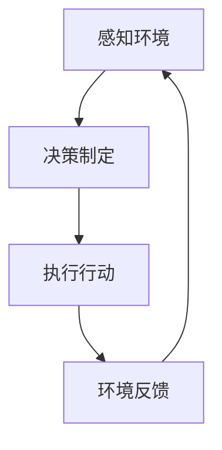

# 构建AI Agent常见挑战及解决方案

> 关键词：AI Agent、构建挑战、解决方案、智能体架构、机器学习算法

> 摘要：本文围绕构建AI Agent过程中遇到的常见挑战展开深入探讨，并详细阐述对应的解决方案。首先介绍了相关背景信息，包括目的范围、预期读者等。接着对AI Agent的核心概念与联系进行剖析，给出原理和架构示意图及流程图。阐述了核心算法原理与具体操作步骤，结合Python代码说明。通过数学模型和公式进一步解释。在项目实战部分，提供开发环境搭建、源代码实现及解读。还分析了实际应用场景，推荐了学习资源、开发工具框架和相关论文著作。最后总结未来发展趋势与挑战，提供常见问题解答和扩展阅读参考资料，为构建AI Agent提供全面的技术指导。

## 1. 背景介绍 
### 1.1 目的和范围
随着人工智能技术的飞速发展，AI Agent在各个领域的应用越来越广泛。构建AI Agent旨在创建能够自主感知环境、做出决策并执行行动的智能实体。本文章的目的是深入分析构建AI Agent过程中面临的常见挑战，并提供有效的解决方案。范围涵盖了AI Agent的核心概念、算法原理、实际应用等多个方面，旨在为开发者、研究人员和对AI Agent感兴趣的人士提供全面的技术指导。

### 1.2 预期读者
本文预期读者包括但不限于人工智能开发者、机器学习工程师、软件架构师、研究人员以及对AI Agent技术有兴趣的爱好者。无论是初学者希望了解AI Agent的基础知识，还是有一定经验的专业人士寻求解决构建过程中的难题，都能从本文中获得有价值的信息。

### 1.3 文档结构概述
本文将按照以下结构进行组织：首先介绍背景信息，让读者了解文章的目的和适用范围。接着深入探讨AI Agent的核心概念与联系，包括其原理和架构。然后详细阐述核心算法原理及具体操作步骤，并通过Python代码进行说明。利用数学模型和公式进一步解释相关概念。在项目实战部分，展示开发环境搭建、源代码实现及解读。分析实际应用场景，为读者提供实际应用的思路。推荐学习资源、开发工具框架和相关论文著作，帮助读者进一步深入学习。最后总结未来发展趋势与挑战，提供常见问题解答和扩展阅读参考资料。

### 1.4 术语表
#### 1.4.1 核心术语定义
- **AI Agent（人工智能智能体）**：能够感知环境、根据感知信息做出决策并执行行动的智能实体。它可以是软件程序、机器人或其他形式的智能系统。
- **环境（Environment）**：AI Agent所处的外部世界，包括各种实体、事件和条件。AI Agent通过感知环境获取信息，并对环境产生影响。
- **感知（Perception）**：AI Agent获取环境信息的过程，通常通过传感器或其他信息获取手段实现。
- **决策（Decision-making）**：AI Agent根据感知到的环境信息，运用一定的算法和策略选择合适的行动的过程。
- **行动（Action）**：AI Agent为了实现特定目标而在环境中执行的操作。

#### 1.4.2 相关概念解释
- **强化学习（Reinforcement Learning）**：一种机器学习方法，智能体通过与环境进行交互，根据环境反馈的奖励信号来学习最优的行为策略。
- **知识表示（Knowledge Representation）**：将知识以计算机能够理解和处理的形式进行表示的方法，常见的有逻辑表示、语义网络、框架等。
- **多智能体系统（Multi-Agent System）**：由多个AI Agent组成的系统，这些智能体之间可以进行交互和协作，共同完成复杂的任务。

#### 1.4.3 缩略词列表
- **RL**：Reinforcement Learning（强化学习）
- **ML**：Machine Learning（机器学习）
- **AI**：Artificial Intelligence（人工智能）

## 2. 核心概念与联系 

### 核心概念原理
AI Agent的核心原理基于感知 - 决策 - 行动的循环。AI Agent通过传感器感知环境的状态信息，然后根据内部的决策机制对这些信息进行分析和处理，选择合适的行动，并将行动施加到环境中。环境会根据AI Agent的行动产生新的状态和反馈信号，AI Agent再次感知这些信息，进入下一个循环。

### 架构示意图
```plaintext
+----------------------+
|      AI Agent        |
+----------------------+
|   Perception Module  |
|                      |
|   Decision Module    |
|                      |
|   Action Module      |
+----------------------+
|       Environment    |
+----------------------+
```

### Mermaid流程图


## 3. 核心算法原理 & 具体操作步骤 

### 强化学习算法原理
强化学习是构建AI Agent常用的算法之一。其基本思想是智能体在环境中不断尝试不同的行动，根据环境给予的奖励信号来调整自己的行为策略，以最大化长期累积奖励。

以下是一个简单的Q - learning算法的Python实现示例：

```python
import numpy as np

# 定义环境
class Environment:
    def __init__(self, num_states, num_actions):
        self.num_states = num_states
        self.num_actions = num_actions
        self.current_state = np.random.randint(0, num_states)

    def step(self, action):
        # 简单示例：随机转移到下一个状态
        next_state = np.random.randint(0, self.num_states)
        # 简单奖励函数
        reward = 1 if next_state == 0 else -1
        done = next_state == 0
        return next_state, reward, done

# 定义Q - learning智能体
class QLearningAgent:
    def __init__(self, num_states, num_actions, learning_rate=0.1, discount_factor=0.9):
        self.num_states = num_states
        self.num_actions = num_actions
        self.learning_rate = learning_rate
        self.discount_factor = discount_factor
        self.q_table = np.zeros((num_states, num_actions))

    def choose_action(self, state, epsilon=0.1):
        if np.random.uniform(0, 1) < epsilon:
            # 探索：随机选择一个行动
            action = np.random.randint(0, self.num_actions)
        else:
            # 利用：选择Q值最大的行动
            action = np.argmax(self.q_table[state, :])
        return action

    def update_q_table(self, state, action, reward, next_state):
        # Q - learning更新公式
        max_q_next = np.max(self.q_table[next_state, :])
        self.q_table[state, action] += self.learning_rate * (
            reward + self.discount_factor * max_q_next - self.q_table[state, action]
        )

# 训练智能体
def train_agent():
    num_states = 5
    num_actions = 2
    env = Environment(num_states, num_actions)
    agent = QLearningAgent(num_states, num_actions)

    num_episodes = 1000
    for episode in range(num_episodes):
        state = env.current_state
        done = False
        while not done:
            action = agent.choose_action(state)
            next_state, reward, done = env.step(action)
            agent.update_q_table(state, action, reward, next_state)
            state = next_state

    return agent

# 运行训练
trained_agent = train_agent()
print("Trained Q - table:")
print(trained_agent.q_table)
```

### 具体操作步骤
1. **初始化环境和智能体**：创建环境对象和智能体对象，初始化Q表。
2. **选择行动**：智能体根据当前状态，使用epsilon - greedy策略选择行动。
3. **执行行动并获取反馈**：智能体执行选择的行动，环境返回下一个状态、奖励和是否完成的信息。
4. **更新Q表**：智能体根据Q - learning更新公式更新Q表。
5. **重复步骤2 - 4**：直到达到最大训练轮数或满足终止条件。

## 4. 数学模型和公式 & 详细讲解 & 举例说明 

### Q - learning更新公式
Q - learning的核心更新公式为：

$$
Q(s, a) \leftarrow Q(s, a) + \alpha \left[ r + \gamma \max_{a'} Q(s', a') - Q(s, a) \right]
$$

其中：
- $Q(s, a)$ 表示在状态 $s$ 下采取行动 $a$ 的Q值。
- $\alpha$ 是学习率，控制每次更新的步长。
- $r$ 是执行行动 $a$ 后从环境中获得的即时奖励。
- $\gamma$ 是折扣因子，用于权衡即时奖励和未来奖励的重要性。
- $s'$ 是执行行动 $a$ 后转移到的下一个状态。
- $\max_{a'} Q(s', a')$ 表示在下一个状态 $s'$ 下所有可能行动的最大Q值。

### 详细讲解
Q - learning的目标是学习一个最优的Q函数，使得智能体在每个状态下选择的行动能够最大化长期累积奖励。更新公式的含义是：当前状态 - 行动对的Q值 $Q(s, a)$ 会根据即时奖励 $r$ 和下一个状态的最大Q值 $\max_{a'} Q(s', a')$ 进行更新。学习率 $\alpha$ 控制了每次更新的幅度，折扣因子 $\gamma$ 则决定了未来奖励的重要程度。

### 举例说明
假设智能体处于状态 $s = 1$，选择行动 $a = 0$，获得即时奖励 $r = 1$，转移到下一个状态 $s' = 2$。当前 $Q(1, 0) = 0.2$，$\max_{a'} Q(2, a') = 0.5$，学习率 $\alpha = 0.1$，折扣因子 $\gamma = 0.9$。

根据更新公式：

$$
\begin{align*}
Q(1, 0) &\leftarrow 0.2 + 0.1 \times [1 + 0.9 \times 0.5 - 0.2] \\
&= 0.2 + 0.1 \times (1 + 0.45 - 0.2) \\
&= 0.2 + 0.1 \times 1.25 \\
&= 0.2 + 0.125 \\
&= 0.325
\end{align*}
$$

更新后，$Q(1, 0)$ 的值变为 $0.325$。

## 5. 项目实战：代码实际案例和详细解释说明 

### 5.1  开发环境搭建
#### 安装Python
首先需要安装Python，建议使用Python 3.7及以上版本。可以从Python官方网站（https://www.python.org/downloads/）下载安装包，按照安装向导进行安装。

#### 安装必要的库
在命令行中使用以下命令安装必要的库：
```sh
pip install numpy
```

### 5.2  源代码详细实现和代码解读
```python
import numpy as np

# 定义环境
class Environment:
    def __init__(self, num_states, num_actions):
        # 初始化状态数量和行动数量
        self.num_states = num_states
        self.num_actions = num_actions
        # 随机初始化当前状态
        self.current_state = np.random.randint(0, num_states)

    def step(self, action):
        # 简单示例：随机转移到下一个状态
        next_state = np.random.randint(0, self.num_states)
        # 简单奖励函数
        reward = 1 if next_state == 0 else -1
        # 判断是否完成
        done = next_state == 0
        return next_state, reward, done

# 定义Q - learning智能体
class QLearningAgent:
    def __init__(self, num_states, num_actions, learning_rate=0.1, discount_factor=0.9):
        # 初始化状态数量和行动数量
        self.num_states = num_states
        self.num_actions = num_actions
        # 初始化学习率和折扣因子
        self.learning_rate = learning_rate
        self.discount_factor = discount_factor
        # 初始化Q表，所有值为0
        self.q_table = np.zeros((num_states, num_actions))

    def choose_action(self, state, epsilon=0.1):
        if np.random.uniform(0, 1) < epsilon:
            # 探索：随机选择一个行动
            action = np.random.randint(0, self.num_actions)
        else:
            # 利用：选择Q值最大的行动
            action = np.argmax(self.q_table[state, :])
        return action

    def update_q_table(self, state, action, reward, next_state):
        # Q - learning更新公式
        max_q_next = np.max(self.q_table[next_state, :])
        self.q_table[state, action] += self.learning_rate * (
            reward + self.discount_factor * max_q_next - self.q_table[state, action]
        )

# 训练智能体
def train_agent():
    num_states = 5
    num_actions = 2
    # 创建环境对象
    env = Environment(num_states, num_actions)
    # 创建智能体对象
    agent = QLearningAgent(num_states, num_actions)

    num_episodes = 1000
    for episode in range(num_episodes):
        # 获取当前状态
        state = env.current_state
        done = False
        while not done:
            # 选择行动
            action = agent.choose_action(state)
            # 执行行动并获取反馈
            next_state, reward, done = env.step(action)
            # 更新Q表
            agent.update_q_table(state, action, reward, next_state)
            state = next_state

    return agent

# 运行训练
trained_agent = train_agent()
print("Trained Q - table:")
print(trained_agent.q_table)
```

### 5.3  代码解读与分析
- **Environment类**：模拟环境，包含状态转移和奖励机制。`__init__` 方法初始化环境的状态数量和行动数量，并随机选择一个初始状态。`step` 方法根据智能体的行动返回下一个状态、奖励和是否完成的信息。
- **QLearningAgent类**：实现Q - learning智能体。`__init__` 方法初始化状态数量、行动数量、学习率、折扣因子和Q表。`choose_action` 方法使用epsilon - greedy策略选择行动。`update_q_table` 方法根据Q - learning更新公式更新Q表。
- **train_agent函数**：训练智能体。创建环境和智能体对象，进行多轮训练，每轮训练中智能体不断选择行动、执行行动、获取反馈并更新Q表。
- 最后，打印训练后的Q表。

## 6. 实际应用场景 
### 游戏领域
在游戏中，AI Agent可以作为游戏角色的智能控制者。例如，在策略游戏中，AI Agent可以根据游戏局势做出决策，如选择建造建筑、训练部队等。在竞技游戏中，AI Agent可以与人类玩家进行对战，通过学习和优化策略来提高自己的游戏水平。

### 机器人领域
在机器人应用中，AI Agent可以控制机器人的行为。例如，在自主导航机器人中，AI Agent可以根据传感器获取的环境信息，如障碍物位置、地图信息等，做出决策，规划机器人的移动路径。在服务机器人中，AI Agent可以根据用户的需求，提供相应的服务，如语音交互、物品递送等。

### 金融领域
在金融领域，AI Agent可以用于投资决策。例如，AI Agent可以分析市场数据、公司财务报表等信息，预测股票价格走势，帮助投资者做出投资决策。在风险管理中，AI Agent可以监测市场风险，及时发出预警信号。

### 医疗领域
在医疗领域，AI Agent可以辅助医生进行诊断和治疗决策。例如，AI Agent可以分析患者的病历、检查报告等信息，提供可能的诊断结果和治疗方案建议。在医疗机器人中，AI Agent可以控制机器人的操作，如手术机器人的精确操作。

## 7. 工具和资源推荐
### 7.1 学习资源推荐
#### 7.1.1 书籍推荐
- 《强化学习：原理与Python实现》：详细介绍了强化学习的基本原理和算法，并通过Python代码实现了多个实际案例。
- 《人工智能：一种现代的方法》：全面介绍了人工智能的各个领域，包括AI Agent、机器学习、自然语言处理等，是人工智能领域的经典教材。
- 《动手学深度学习》：以深度学习为核心，介绍了深度学习的基本概念、算法和应用，通过大量的代码示例帮助读者快速掌握深度学习技术。

#### 7.1.2 在线课程
- Coursera上的“Reinforcement Learning Specialization”：由知名教授授课，系统地介绍了强化学习的理论和实践。
- edX上的“Artificial Intelligence”：涵盖了人工智能的多个方面，包括AI Agent的设计和实现。
- 哔哩哔哩上的一些开源的人工智能课程，如李沐老师的“动手学深度学习”系列课程，讲解生动易懂，适合初学者。

#### 7.1.3 技术博客和网站
- Towards Data Science：发布了大量关于人工智能、机器学习的技术文章，涵盖了最新的研究成果和实践经验。
- Medium上的人工智能相关专栏：有很多专业人士分享自己的研究和实践经验，提供了丰富的学习资源。
- OpenAI的官方博客：发布了OpenAI在人工智能领域的最新研究成果和技术进展。

### 7.2 开发工具框架推荐
#### 7.2.1 IDE和编辑器
- PyCharm：一款专业的Python集成开发环境，提供了丰富的代码编辑、调试和项目管理功能。
- Jupyter Notebook：交互式的开发环境，适合进行数据分析、模型训练和实验验证。
- Visual Studio Code：轻量级的代码编辑器，支持多种编程语言，有丰富的插件扩展功能。

#### 7.2.2 调试和性能分析工具
- PDB：Python自带的调试器，可以帮助开发者逐行调试代码，查找问题。
- TensorBoard：用于可视化深度学习模型的训练过程和性能指标，方便开发者进行模型调优。
- cProfile：Python的性能分析工具，可以分析代码的运行时间和函数调用情况，帮助开发者找出性能瓶颈。

#### 7.2.3 相关框架和库
- TensorFlow：Google开发的深度学习框架，提供了丰富的深度学习模型和工具，支持分布式训练。
- PyTorch：Facebook开发的深度学习框架，具有动态图的优势，易于使用和调试。
- Stable Baselines3：基于PyTorch的强化学习库，提供了多种强化学习算法的实现，方便开发者快速进行强化学习实验。

### 7.3 相关论文著作推荐
#### 7.3.1 经典论文
- “Q - learning”：由Watkins和Dayan发表，首次提出了Q - learning算法，是强化学习领域的经典论文。
- “Playing Atari with Deep Reinforcement Learning”：由DeepMind团队发表，提出了深度Q网络（DQN）算法，将深度学习与强化学习相结合，在Atari游戏上取得了很好的效果。
- “Mastering the Game of Go with Deep Neural Networks and Tree Search”：同样由DeepMind团队发表，介绍了AlphaGo的实现原理，展示了深度学习和强化学习在复杂游戏中的强大应用。

#### 7.3.2 最新研究成果
- 关注顶级学术会议如NeurIPS、ICML、AAAI等的最新论文，这些会议收录了人工智能领域的最新研究成果，包括AI Agent的设计和优化、新的强化学习算法等。
- 阅读知名研究机构如OpenAI、DeepMind等发布的技术报告和研究论文，了解他们在AI Agent领域的最新进展。

#### 7.3.3 应用案例分析
- 分析一些实际应用中AI Agent的成功案例，如Google的自动驾驶汽车、阿里巴巴的智能客服等。了解这些案例中AI Agent的设计思路、算法选择和实现细节，以及如何解决实际应用中遇到的问题。

## 8. 总结：未来发展趋势与挑战
### 未来发展趋势
- **多智能体协作**：未来的AI Agent系统将越来越多地涉及多个智能体之间的协作。多智能体系统可以解决更复杂的任务，如智能交通系统中多个自动驾驶汽车的协同行驶、工业生产中多个机器人的协作作业等。
- **与人类的交互融合**：AI Agent将更加注重与人类的交互和融合。例如，开发具有自然语言理解和生成能力的AI Agent，能够与人类进行更加自然、流畅的对话；设计能够理解人类情感和意图的AI Agent，提供更加个性化的服务。
- **跨领域应用**：AI Agent将在更多的领域得到应用，如农业、教育、文化艺术等。通过结合不同领域的知识和数据，AI Agent可以为这些领域带来新的发展机遇。

### 挑战
- **智能体的安全性和可靠性**：随着AI Agent在关键领域的应用越来越广泛，其安全性和可靠性成为了重要的挑战。例如，在自动驾驶汽车中，AI Agent的决策失误可能导致严重的交通事故；在医疗领域，AI Agent的诊断错误可能影响患者的治疗效果。
- **数据隐私和伦理问题**：AI Agent的训练和运行需要大量的数据，这些数据可能包含用户的隐私信息。如何保护数据隐私，避免数据滥用，以及如何解决AI Agent带来的伦理问题，如偏见、歧视等，是需要解决的重要问题。
- **算法的可解释性**：许多深度学习和强化学习算法是黑盒模型，其决策过程难以解释。在一些关键应用场景中，如医疗诊断、金融决策等，需要AI Agent能够解释其决策依据，以便人类用户能够信任和接受其决策结果。

## 9. 附录：常见问题与解答
### 问题1：构建AI Agent时，如何选择合适的算法？
解答：选择合适的算法需要考虑多个因素，如任务的性质、数据的特点、计算资源等。如果任务是离散的、状态和行动空间较小，可以考虑使用传统的强化学习算法，如Q - learning。如果任务是连续的、状态和行动空间较大，可以使用深度强化学习算法，如DDPG、PPO等。如果任务需要处理序列数据，可以考虑使用循环神经网络（RNN）或长短期记忆网络（LSTM）。

### 问题2：如何提高AI Agent的学习效率？
解答：可以从以下几个方面提高AI Agent的学习效率：
- 优化算法参数：通过调整学习率、折扣因子等参数，找到最优的参数组合。
- 增加训练数据：提供更多的训练数据可以帮助AI Agent学习到更丰富的模式和规律。
- 使用经验回放：在强化学习中，经验回放可以提高数据的利用率，减少数据之间的相关性。
- 采用多线程或分布式训练：利用多核CPU或GPU进行并行计算，加快训练速度。

### 问题3：AI Agent在实际应用中容易出现哪些问题？
解答：AI Agent在实际应用中容易出现以下问题：
- 过拟合：AI Agent在训练数据上表现良好，但在测试数据或实际应用中表现不佳。
- 欠拟合：AI Agent无法学习到数据中的复杂模式和规律，导致性能低下。
- 环境适应性差：AI Agent在训练环境中表现良好，但在实际环境中由于环境的变化而无法正常工作。
- 安全漏洞：AI Agent可能存在安全漏洞，如被攻击、被恶意利用等。

### 问题4：如何评估AI Agent的性能？
解答：评估AI Agent的性能可以从以下几个方面进行：
- 奖励值：在强化学习中，奖励值是衡量AI Agent性能的重要指标。可以计算AI Agent在训练过程中的平均奖励值，以及在测试环境中的累积奖励值。
- 成功率：对于一些具有明确目标的任务，可以计算AI Agent完成任务的成功率。
- 准确率：在分类、预测等任务中，可以计算AI Agent的预测准确率。
- 响应时间：对于实时性要求较高的任务，需要考虑AI Agent的响应时间。

## 10. 扩展阅读 & 参考资料
- Sutton, R. S., & Barto, A. G. (2018). Reinforcement learning: An introduction. MIT press.
- Goodfellow, I. J., Bengio, Y., & Courville, A. (2016). Deep learning. MIT press.
- OpenAI官方文档：https://openai.com/docs/
- TensorFlow官方文档：https://www.tensorflow.org/guide
- PyTorch官方文档：https://pytorch.org/docs/stable/index.html

作者：AI天才研究院/AI Genius Institute & 禅与计算机程序设计艺术 /Zen And The Art of Computer Programming