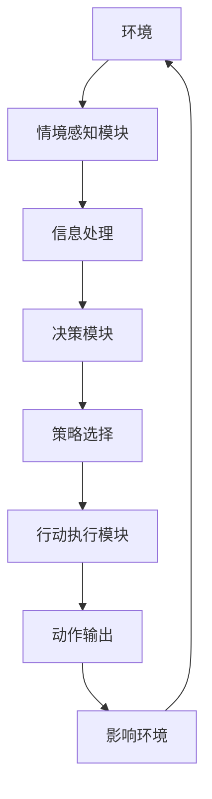

# 构建AI Agent的情境感知能力：环境适应性

> 关键词：AI Agent、情境感知能力、环境适应性、智能决策、机器学习

> 摘要：本文聚焦于构建AI Agent的情境感知能力，着重探讨其环境适应性。首先介绍了相关背景，包括目的、预期读者、文档结构和术语表。接着阐述了核心概念及联系，通过文本示意图和Mermaid流程图进行清晰展示。详细讲解了核心算法原理，并给出Python源代码示例。对数学模型和公式进行了深入分析与举例说明。通过项目实战，包括开发环境搭建、源代码实现与解读，展示了如何在实际中构建具有环境适应性的AI Agent。列举了实际应用场景，推荐了学习资源、开发工具框架和相关论文著作。最后总结了未来发展趋势与挑战，还提供了常见问题解答和扩展阅读参考资料，旨在为读者全面深入地理解和构建具有环境适应性的AI Agent提供指导。

## 1. 背景介绍 
### 1.1 目的和范围
随着人工智能技术的不断发展，AI Agent在各个领域的应用日益广泛。构建具有情境感知能力和环境适应性的AI Agent，能够使其更加智能地与环境进行交互，做出更合理的决策。本文的目的在于深入探讨如何构建AI Agent的情境感知能力以实现良好的环境适应性，涵盖了从理论概念到实际应用的多个方面，包括核心算法原理、数学模型、项目实战等内容。范围涉及AI Agent在不同环境下的感知、理解和应对机制，以及相关技术的具体实现和应用。

### 1.2 预期读者
本文预期读者包括人工智能领域的研究人员、开发者、学生，以及对AI Agent技术感兴趣的专业人士。对于想要深入了解如何构建具有环境适应性的AI Agent的读者，本文将提供系统的知识和实践指导。对于初学者，可以帮助他们建立起对AI Agent情境感知和环境适应性的基本概念；对于有一定经验的开发者和研究人员，能够为他们的进一步研究和实践提供新的思路和方法。

### 1.3 文档结构概述
本文将按照以下结构进行阐述：首先介绍背景信息，让读者了解本文的目的、适用人群和整体结构。接着详细讲解核心概念与联系，通过示意图和流程图直观展示相关原理。然后深入探讨核心算法原理和具体操作步骤，结合Python代码进行说明。对数学模型和公式进行分析并举例，帮助读者理解其内在逻辑。通过项目实战，从开发环境搭建到源代码实现和解读，展示如何将理论应用于实际。列举实际应用场景，让读者了解该技术的实际用途。推荐学习资源、开发工具框架和相关论文著作，为读者提供进一步学习和研究的方向。最后总结未来发展趋势与挑战，提供常见问题解答和扩展阅读参考资料。

### 1.4 术语表
#### 1.4.1 核心术语定义
- **AI Agent**：人工智能代理，是一种能够感知环境、进行决策并采取行动以实现特定目标的智能实体。它可以是软件程序、机器人或其他具有智能行为的系统。
- **情境感知能力**：指AI Agent能够感知和理解其所处环境的各种信息和情境的能力，包括物理环境、社会环境等方面的信息。
- **环境适应性**：AI Agent能够根据不同的环境条件和变化，调整自身的行为和决策，以更好地适应环境并实现目标的能力。

#### 1.4.2 相关概念解释
- **感知**：AI Agent通过各种传感器获取环境信息的过程，例如摄像头获取图像信息、麦克风获取声音信息等。
- **决策**：基于感知到的环境信息，AI Agent运用一定的算法和模型，选择最优的行动方案的过程。
- **行动**：AI Agent根据决策结果，采取具体的行为或操作，以影响环境或实现目标。

#### 1.4.3 缩略词列表
- **ML**：Machine Learning，机器学习，是一门多领域交叉学科，涉及概率论、统计学、逼近论、凸分析、算法复杂度理论等多门学科。它专门研究计算机怎样模拟或实现人类的学习行为，以获取新的知识或技能，重新组织已有的知识结构使之不断改善自身的性能。
- **RL**：Reinforcement Learning，强化学习，是一种机器学习范式，智能体通过与环境进行交互，根据环境反馈的奖励信号来学习最优的行为策略。
- **CNN**：Convolutional Neural Network，卷积神经网络，是一种专门为处理具有网格结构数据（如图像、音频等）而设计的深度学习模型，通过卷积层、池化层等操作提取数据的特征。

## 2. 核心概念与联系 
### 核心概念原理
AI Agent的情境感知能力和环境适应性是紧密相关的概念。情境感知是基础，它使AI Agent能够获取环境的相关信息，包括环境的状态、特征和变化等。通过对这些信息的处理和分析，AI Agent可以理解当前所处的情境。而环境适应性则是在情境感知的基础上，根据不同的情境做出相应的决策和行动，以适应环境的变化。

例如，在一个智能家居环境中，AI Agent可以通过各种传感器感知房间的温度、湿度、光线等信息。当感知到温度过高时，它可以理解当前的情境是房间过热，然后根据预先设定的规则或通过学习得到的策略，做出打开空调的决策，以适应环境并调节温度。

### 架构的文本示意图
```plaintext
+----------------------+
|       AI Agent       |
| +------------------+ |
| | 情境感知模块    | |
| |  - 传感器输入    | |
| |  - 信息处理      | |
| +------------------+ |
| +------------------+ |
| | 决策模块        | |
| |  - 算法模型      | |
| |  - 策略选择      | |
| +------------------+ |
| +------------------+ |
| | 行动执行模块    | |
| |  - 动作输出      | |
| +------------------+ |
+----------------------+
|       环境         |
|  - 物理环境         |
|  - 社会环境         |
|  - 环境变化         |
+----------------------+
```
这个示意图展示了AI Agent的基本架构，包括情境感知模块、决策模块和行动执行模块，以及与环境的交互关系。情境感知模块负责从环境中获取信息，决策模块根据感知到的信息进行决策，行动执行模块将决策转化为具体的行动，对环境产生影响。

### Mermaid流程图

该流程图清晰地展示了AI Agent与环境之间的循环交互过程。环境的信息被情境感知模块获取，经过信息处理后传递给决策模块，决策模块进行策略选择，行动执行模块执行相应的动作，动作输出对环境产生影响，环境的变化又会再次被情境感知模块感知，形成一个闭环。

## 3. 核心算法原理 & 具体操作步骤 
### 核心算法原理
在构建具有环境适应性的AI Agent时，常用的算法包括机器学习算法和强化学习算法。下面以强化学习算法为例进行详细讲解。

强化学习的基本思想是智能体（AI Agent）通过与环境进行交互，不断尝试不同的行动，并根据环境反馈的奖励信号来学习最优的行为策略。智能体的目标是在长期内最大化累积奖励。

### 具体操作步骤
#### 步骤1：定义环境和状态空间
首先，需要明确AI Agent所处的环境，以及环境的状态表示。状态空间是所有可能的环境状态的集合。例如，在一个简单的迷宫环境中，状态可以表示为智能体在迷宫中的位置。

```python
import numpy as np

# 定义迷宫环境
maze = np.array([
    [0, 0, 0, 0],
    [0, 1, 1, 0],
    [0, 1, 0, 0],
    [0, 0, 0, 2]
])

# 定义状态空间
state_space = [(i, j) for i in range(maze.shape[0]) for j in range(maze.shape[1])]
```

#### 步骤2：定义动作空间
动作空间是AI Agent可以采取的所有可能行动的集合。在迷宫环境中，动作可以包括向上、向下、向左、向右移动。

```python
# 定义动作空间
action_space = ['up', 'down', 'left', 'right']
```

#### 步骤3：定义奖励函数
奖励函数用于评估智能体采取某个行动后所处的状态的好坏。在迷宫环境中，到达目标位置可以给予正奖励，撞到墙壁或陷入死胡同可以给予负奖励。

```python
def reward_function(state, action):
    x, y = state
    if action == 'up':
        new_x, new_y = x - 1, y
    elif action == 'down':
        new_x, new_y = x + 1, y
    elif action == 'left':
        new_x, new_y = x, y - 1
    elif action == 'right':
        new_x, new_y = x, y + 1
    
    if new_x < 0 or new_x >= maze.shape[0] or new_y < 0 or new_y >= maze.shape[1] or maze[new_x, new_y] == 1:
        return -1  # 撞到墙壁或越界
    elif maze[new_x, new_y] == 2:
        return 10  # 到达目标位置
    else:
        return -0.1  # 普通移动
```

#### 步骤4：初始化策略和价值函数
在强化学习中，策略是指智能体在每个状态下选择行动的规则，价值函数是指智能体在某个状态下的预期累积奖励。可以使用Q - 学习算法来学习最优策略和价值函数。

```python
# 初始化Q表
Q = {}
for state in state_space:
    for action in action_space:
        Q[(state, action)] = 0

# 定义学习率和折扣因子
alpha = 0.1
gamma = 0.9
```

#### 步骤5：训练智能体
通过不断地与环境进行交互，智能体根据当前状态选择行动，获取奖励，并更新Q表。

```python
# 训练智能体
num_episodes = 1000
for episode in range(num_episodes):
    # 初始化状态
    state = (0, 0)
    done = False
    while not done:
        # 根据Q表选择行动
        if np.random.uniform(0, 1) < 0.1:  # 探索率
            action = np.random.choice(action_space)
        else:
            q_values = [Q[(state, a)] for a in action_space]
            action = action_space[np.argmax(q_values)]
        
        # 获取奖励
        reward = reward_function(state, action)
        
        # 更新状态
        x, y = state
        if action == 'up':
            new_x, new_y = x - 1, y
        elif action == 'down':
            new_x, new_y = x + 1, y
        elif action == 'left':
            new_x, new_y = x, y - 1
        elif action == 'right':
            new_x, new_y = x, y + 1
        
        if new_x < 0 or new_x >= maze.shape[0] or new_y < 0 or new_y >= maze.shape[1] or maze[new_x, new_y] == 1:
            new_state = state
        else:
            new_state = (new_x, new_y)
        
        # 更新Q表
        q_values = [Q[(new_state, a)] for a in action_space]
        max_q = np.max(q_values)
        Q[(state, action)] = Q[(state, action)] + alpha * (reward + gamma * max_q - Q[(state, action)])
        
        # 判断是否到达目标位置
        if maze[new_state] == 2:
            done = True
        state = new_state
```

## 4. 数学模型和公式 & 详细讲解 & 举例说明 
### 数学模型
在强化学习中，常用的数学模型是马尔可夫决策过程（MDP）。马尔可夫决策过程可以用一个五元组 $(S, A, P, R, \gamma)$ 来表示，其中：
- $S$ 是状态空间，表示所有可能的环境状态的集合。
- $A$ 是动作空间，表示智能体可以采取的所有可能行动的集合。
- $P$ 是状态转移概率函数，表示在状态 $s$ 采取行动 $a$ 后转移到状态 $s'$ 的概率，即 $P(s'|s, a)$。
- $R$ 是奖励函数，表示在状态 $s$ 采取行动 $a$ 后获得的即时奖励，即 $R(s, a)$。
- $\gamma$ 是折扣因子，取值范围为 $[0, 1]$，用于权衡即时奖励和未来奖励的重要性。

### 公式
#### 状态价值函数
状态价值函数 $V(s)$ 表示在状态 $s$ 下，遵循某个策略 $\pi$ 时的预期累积奖励，其计算公式为：
$$V^{\pi}(s) = \mathbb{E}_{\pi}\left[\sum_{t = 0}^{\infty}\gamma^{t}R(S_{t}, A_{t})\big|S_{0} = s\right]$$
其中，$\mathbb{E}_{\pi}$ 表示在策略 $\pi$ 下的期望，$S_{t}$ 表示在时间步 $t$ 的状态，$A_{t}$ 表示在时间步 $t$ 采取的行动。

#### 动作价值函数
动作价值函数 $Q(s, a)$ 表示在状态 $s$ 采取行动 $a$ 后，遵循某个策略 $\pi$ 时的预期累积奖励，其计算公式为：
$$Q^{\pi}(s, a) = \mathbb{E}_{\pi}\left[\sum_{t = 0}^{\infty}\gamma^{t}R(S_{t}, A_{t})\big|S_{0} = s, A_{0} = a\right]$$

#### Bellman方程
Bellman方程描述了状态价值函数和动作价值函数之间的关系。对于状态价值函数，Bellman方程为：
$$V^{\pi}(s) = \sum_{a \in A}\pi(a|s)\sum_{s' \in S}P(s'|s, a)\left[R(s, a) + \gamma V^{\pi}(s')\right]$$
对于动作价值函数，Bellman方程为：
$$Q^{\pi}(s, a) = \sum_{s' \in S}P(s'|s, a)\left[R(s, a) + \gamma\sum_{a' \in A}\pi(a'|s')Q^{\pi}(s', a')\right]$$

### 详细讲解
状态价值函数 $V(s)$ 表示从状态 $s$ 开始，按照策略 $\pi$ 行动所能获得的长期累积奖励的期望。动作价值函数 $Q(s, a)$ 则进一步考虑了在状态 $s$ 下采取特定行动 $a$ 后的长期累积奖励期望。

Bellman方程的核心思想是将当前状态的价值（或动作价值）表示为即时奖励和下一个状态的价值（或动作价值）的加权和。通过不断迭代求解Bellman方程，可以得到最优的状态价值函数和动作价值函数，从而确定最优策略。

### 举例说明
考虑一个简单的两状态、两动作的马尔可夫决策过程。状态空间 $S = \{s_1, s_2\}$，动作空间 $A = \{a_1, a_2\}$。状态转移概率和奖励函数如下：
- $P(s_1|s_1, a_1) = 0.8$，$P(s_2|s_1, a_1) = 0.2$，$R(s_1, a_1) = 1$
- $P(s_1|s_1, a_2) = 0.3$，$P(s_2|s_1, a_2) = 0.7$，$R(s_1, a_2) = 2$
- $P(s_1|s_2, a_1) = 0.6$，$P(s_2|s_2, a_1) = 0.4$，$R(s_2, a_1) = 3$
- $P(s_1|s_2, a_2) = 0.1$，$P(s_2|s_2, a_2) = 0.9$，$R(s_2, a_2) = 4$

假设折扣因子 $\gamma = 0.9$，策略 $\pi$ 是随机策略，即 $\pi(a_1|s) = \pi(a_2|s) = 0.5$ 对于所有 $s \in S$。

根据Bellman方程计算状态 $s_1$ 的价值：
$$
\begin{align*}
V^{\pi}(s_1) &= \sum_{a \in A}\pi(a|s_1)\sum_{s' \in S}P(s'|s_1, a)\left[R(s_1, a) + \gamma V^{\pi}(s')\right]\\
&= 0.5\times\left(0.8\times\left[1 + 0.9V^{\pi}(s_1)\right] + 0.2\times\left[1 + 0.9V^{\pi}(s_2)\right]\right) + 0.5\times\left(0.3\times\left[2 + 0.9V^{\pi}(s_1)\right] + 0.7\times\left[2 + 0.9V^{\pi}(s_2)\right]\right)
\end{align*}
$$
同理可以计算 $V^{\pi}(s_2)$。通过迭代求解这些方程，可以得到 $V^{\pi}(s_1)$ 和 $V^{\pi}(s_2)$ 的值。

## 5. 项目实战：代码实际案例和详细解释说明 
### 5.1  开发环境搭建
#### 安装Python
首先，确保你已经安装了Python。推荐使用Python 3.6及以上版本。可以从Python官方网站（https://www.python.org/downloads/） 下载并安装适合你操作系统的Python版本。

#### 安装必要的库
在本项目中，需要使用 `numpy` 库进行数值计算。可以使用以下命令安装：
```sh
pip install numpy
```

### 5.2  源代码详细实现和代码解读
以下是一个完整的Python代码示例，用于实现一个简单的具有环境适应性的AI Agent，通过强化学习算法在迷宫环境中寻找目标位置。

```python
import numpy as np

# 定义迷宫环境
maze = np.array([
    [0, 0, 0, 0],
    [0, 1, 1, 0],
    [0, 1, 0, 0],
    [0, 0, 0, 2]
])

# 定义状态空间
state_space = [(i, j) for i in range(maze.shape[0]) for j in range(maze.shape[1])]

# 定义动作空间
action_space = ['up', 'down', 'left', 'right']

# 定义奖励函数
def reward_function(state, action):
    x, y = state
    if action == 'up':
        new_x, new_y = x - 1, y
    elif action == 'down':
        new_x, new_y = x + 1, y
    elif action == 'left':
        new_x, new_y = x, y - 1
    elif action == 'right':
        new_x, new_y = x, y + 1
    
    if new_x < 0 or new_x >= maze.shape[0] or new_y < 0 or new_y >= maze.shape[1] or maze[new_x, new_y] == 1:
        return -1  # 撞到墙壁或越界
    elif maze[new_x, new_y] == 2:
        return 10  # 到达目标位置
    else:
        return -0.1  # 普通移动

# 初始化Q表
Q = {}
for state in state_space:
    for action in action_space:
        Q[(state, action)] = 0

# 定义学习率和折扣因子
alpha = 0.1
gamma = 0.9

# 训练智能体
num_episodes = 1000
for episode in range(num_episodes):
    # 初始化状态
    state = (0, 0)
    done = False
    while not done:
        # 根据Q表选择行动
        if np.random.uniform(0, 1) < 0.1:  # 探索率
            action = np.random.choice(action_space)
        else:
            q_values = [Q[(state, a)] for a in action_space]
            action = action_space[np.argmax(q_values)]
        
        # 获取奖励
        reward = reward_function(state, action)
        
        # 更新状态
        x, y = state
        if action == 'up':
            new_x, new_y = x - 1, y
        elif action == 'down':
            new_x, new_y = x + 1, y
        elif action == 'left':
            new_x, new_y = x, y - 1
        elif action == 'right':
            new_x, new_y = x, y + 1
        
        if new_x < 0 or new_x >= maze.shape[0] or new_y < 0 or new_y >= maze.shape[1] or maze[new_x, new_y] == 1:
            new_state = state
        else:
            new_state = (new_x, new_y)
        
        # 更新Q表
        q_values = [Q[(new_state, a)] for a in action_space]
        max_q = np.max(q_values)
        Q[(state, action)] = Q[(state, action)] + alpha * (reward + gamma * max_q - Q[(state, action)])
        
        # 判断是否到达目标位置
        if maze[new_state] == 2:
            done = True
        state = new_state

# 测试智能体
state = (0, 0)
done = False
while not done:
    q_values = [Q[(state, a)] for a in action_space]
    action = action_space[np.argmax(q_values)]
    x, y = state
    if action == 'up':
        new_x, new_y = x - 1, y
    elif action == 'down':
        new_x, new_y = x + 1, y
    elif action == 'left':
        new_x, new_y = x, y - 1
    elif action == 'right':
        new_x, new_y = x, y + 1
    
    if new_x < 0 or new_x >= maze.shape[0] or new_y < 0 or new_y >= maze.shape[1] or maze[new_x, new_y] == 1:
        new_state = state
    else:
        new_state = (new_x, new_y)
    
    print(f"当前状态: {state}, 采取行动: {action}, 新状态: {new_state}")
    
    if maze[new_state] == 2:
        done = True
    state = new_state

print("到达目标位置！")
```

### 5.3  代码解读与分析
#### 迷宫环境定义
通过 `numpy` 数组 `maze` 定义了一个简单的迷宫环境，其中 `0` 表示可通行区域，`1` 表示墙壁，`2` 表示目标位置。

#### 状态空间和动作空间
状态空间 `state_space` 是迷宫中所有可能位置的集合，动作空间 `action_space` 包含了智能体可以采取的四个行动：向上、向下、向左、向右。

#### 奖励函数
`reward_function` 函数根据当前状态和采取的行动，计算智能体获得的奖励。撞到墙壁或越界给予 -1 的奖励，到达目标位置给予 10 的奖励，普通移动给予 -0.1 的奖励。

#### Q表初始化
`Q` 表是一个字典，用于存储每个状态 - 动作对的Q值。初始时，所有Q值都设为 0。

#### 训练过程
在训练过程中，智能体通过与环境进行交互，不断更新Q表。使用 $\epsilon$-贪心策略选择行动，其中 $\epsilon$ 是探索率，在本代码中设为 0.1。每次行动后，根据奖励和下一个状态的最大Q值更新当前状态 - 动作对的Q值。

#### 测试过程
训练完成后，智能体根据Q表选择最优行动，从初始状态开始移动，直到到达目标位置。在移动过程中，打印出当前状态、采取的行动和新状态。

通过这个项目实战，我们可以看到如何使用强化学习算法构建一个具有环境适应性的AI Agent，使其能够在迷宫环境中找到目标位置。

## 6. 实际应用场景 
### 智能家居
在智能家居系统中，AI Agent可以通过各种传感器（如温度传感器、湿度传感器、光线传感器等）感知环境信息，根据不同的情境自动调整家居设备的运行状态。例如，当感知到室内温度过高时，自动打开空调；当光线较暗时，自动打开灯光。通过不断学习用户的使用习惯和环境变化，AI Agent可以更好地适应不同的环境，提供更加个性化的服务。

### 自动驾驶
自动驾驶汽车中的AI Agent需要具备强大的情境感知能力和环境适应性。它通过摄像头、雷达、激光雷达等传感器感知周围的交通环境，包括道路状况、其他车辆的位置和速度、行人的动态等。根据这些信息，AI Agent可以做出决策，如加速、减速、转弯等，以确保行驶的安全和高效。在不同的天气条件（如雨天、雪天）和道路场景（如高速公路、城市街道）下，AI Agent需要能够调整自己的行为策略，适应环境的变化。

### 工业自动化
在工业生产中，AI Agent可以用于监控和控制生产过程。通过传感器感知生产设备的运行状态、原材料的供应情况、产品的质量等信息，AI Agent可以及时发现生产过程中的异常情况，并采取相应的措施进行调整。例如，当设备出现故障时，自动停止生产并发出警报；当原材料供应不足时，自动调整生产计划。通过对不同生产环境和工况的适应，AI Agent可以提高生产效率和产品质量。

### 智能客服
智能客服系统中的AI Agent可以通过自然语言处理技术感知用户的问题和意图，根据不同的情境提供相应的解决方案。在与用户的交互过程中，AI Agent可以学习用户的偏好和历史记录，不断优化自己的回答策略。例如，对于常见问题，提供快速准确的答案；对于复杂问题，引导用户提供更多信息或转接人工客服。通过适应不同用户的需求和情境，AI Agent可以提高用户满意度和服务效率。

## 7. 工具和资源推荐
### 7.1 学习资源推荐
#### 7.1.1 书籍推荐
- 《人工智能：一种现代的方法》（Artificial Intelligence: A Modern Approach）：这本书是人工智能领域的经典教材，全面介绍了人工智能的各个方面，包括搜索算法、知识表示、机器学习、自然语言处理等。对于理解AI Agent的基本原理和技术有很大的帮助。
- 《强化学习：原理与Python实现》（Reinforcement Learning: An Introduction）：由强化学习领域的两位权威学者Richard S. Sutton和Andrew G. Barto所著，系统地介绍了强化学习的理论和算法。书中包含了大量的示例和代码，适合初学者和有一定基础的读者深入学习强化学习。

#### 7.1.2 在线课程
- Coursera上的“人工智能基础”（Foundations of Artificial Intelligence）课程：该课程由哥伦比亚大学的教授授课，涵盖了人工智能的基本概念、算法和应用。通过视频讲座、编程作业和考试等方式，帮助学习者掌握人工智能的基础知识。
- edX上的“强化学习”（Reinforcement Learning）课程：由加州大学伯克利分校的教授授课，深入讲解了强化学习的理论和实践。课程内容包括马尔可夫决策过程、Q - 学习、策略梯度算法等，适合对强化学习感兴趣的学习者。

#### 7.1.3 技术博客和网站
- Medium上的人工智能相关博客：Medium上有很多优秀的人工智能博主，他们会分享最新的研究成果、技术应用和实践经验。例如，“Towards Data Science” 是一个专注于数据科学和人工智能的博客社区，上面有很多高质量的文章。
- OpenAI的官方博客：OpenAI是人工智能领域的知名研究机构，其官方博客会发布最新的研究成果和技术进展。通过阅读OpenAI的博客，可以了解到人工智能领域的前沿动态。

### 7.2 开发工具框架推荐
#### 7.2.1 IDE和编辑器
- PyCharm：是一款专门为Python开发设计的集成开发环境（IDE），具有强大的代码编辑、调试、自动补全和版本控制等功能。对于开发AI Agent的Python代码非常方便。
- Jupyter Notebook：是一个交互式的开发环境，支持Python、R等多种编程语言。通过Jupyter Notebook，可以将代码、文本、图表等内容集成在一起，方便进行数据分析和模型实验。

#### 7.2.2 调试和性能分析工具
- PDB：Python自带的调试器，可以帮助开发者在代码中设置断点、单步执行、查看变量值等，方便进行代码调试。
- cProfile：Python的性能分析工具，可以统计代码中各个函数的执行时间和调用次数，帮助开发者找出代码中的性能瓶颈。

#### 7.2.3 相关框架和库
- TensorFlow：是一个开源的机器学习框架，由Google开发。TensorFlow提供了丰富的工具和接口，支持深度学习模型的构建、训练和部署。在构建AI Agent时，可以使用TensorFlow实现神经网络模型。
- PyTorch：是另一个流行的深度学习框架，由Facebook开发。PyTorch具有动态图的特点，易于使用和调试。很多研究人员和开发者喜欢使用PyTorch进行深度学习研究和开发。

### 7.3 相关论文著作推荐
#### 7.3.1 经典论文
- “Q - learning”：由Chris Watkins和Peter Dayan在1992年发表的论文，首次提出了Q - 学习算法。Q - 学习是一种无模型的强化学习算法，通过迭代更新Q表来学习最优策略。
- “Policy Gradient Methods for Reinforcement Learning with Function Approximation”：由Richard S. Sutton等人在2000年发表的论文，提出了策略梯度算法。策略梯度算法直接对策略进行优化，避免了Q - 学习中需要估计Q值的问题。

#### 7.3.2 最新研究成果
- 每年的NeurIPS（神经信息处理系统大会）、ICML（国际机器学习会议）等顶级学术会议上都会发表很多关于人工智能和强化学习的最新研究成果。可以关注这些会议的论文，了解该领域的前沿动态。
- 一些知名的学术期刊，如Journal of Artificial Intelligence Research（JAIR）、Artificial Intelligence等，也会发表高质量的人工智能研究论文。

#### 7.3.3 应用案例分析
- 《AI Superpowers: China, Silicon Valley, and the New World Order》：这本书由李开复所著，通过多个实际案例分析了人工智能在不同领域的应用，包括医疗、金融、交通等。书中还探讨了人工智能对社会和经济的影响。
- 一些企业的技术博客和报告也会分享他们在AI Agent应用方面的实践经验和案例分析。例如，Google、Microsoft等公司的技术博客上会有很多关于人工智能应用的文章。

## 8. 总结：未来发展趋势与挑战
### 未来发展趋势
#### 多模态感知
未来的AI Agent将具备更强大的多模态感知能力，不仅能够感知视觉、听觉信息，还能感知触觉、嗅觉等多种信息。通过融合多种模态的信息，AI Agent可以更全面地理解环境，做出更准确的决策。例如，在智能家居中，AI Agent可以通过视觉感知房间的布局和物品摆放，通过听觉感知用户的语音指令，通过触觉感知门窗的开关状态等，从而提供更加智能和个性化的服务。

#### 自主学习和进化
AI Agent将具备更强的自主学习和进化能力。它们可以在没有人类干预的情况下，通过与环境的交互不断学习新的知识和技能，适应环境的变化。例如，在自动驾驶领域，AI Agent可以在实际行驶过程中不断学习新的驾驶场景和规则，提高自己的驾驶水平。同时，AI Agent还可以通过遗传算法等技术进行进化，不断优化自己的性能。

#### 与人类的深度协作
未来的AI Agent将与人类进行更深度的协作。它们可以理解人类的意图和情感，与人类进行自然流畅的交互。例如，在医疗领域，AI Agent可以辅助医生进行诊断和治疗，根据患者的症状和病历提供建议；在教育领域，AI Agent可以作为学习伙伴，根据学生的学习情况提供个性化的学习方案。

### 挑战
#### 数据隐私和安全
随着AI Agent对环境信息的感知和处理能力不断增强，数据隐私和安全问题变得越来越重要。AI Agent需要收集和处理大量的用户数据，如个人信息、行为习惯等。如果这些数据被泄露或滥用，将会对用户的隐私和安全造成威胁。因此，需要加强数据隐私保护和安全管理，采用加密技术、访问控制等手段确保数据的安全。

#### 算法可解释性
目前，很多AI Agent采用的是深度学习等复杂的算法，这些算法的决策过程往往难以解释。在一些关键领域，如医疗、金融等，算法的可解释性非常重要。医生和金融从业者需要了解AI Agent做出决策的依据，以便做出正确的判断。因此，需要研究和开发具有可解释性的算法，提高AI Agent决策的透明度和可信度。

#### 伦理和法律问题
AI Agent的广泛应用也带来了一系列的伦理和法律问题。例如，当AI Agent在自动驾驶过程中发生事故时，责任应该如何划分；当AI Agent做出不道德的决策时，应该如何处理。这些问题需要建立相应的伦理准则和法律框架来规范AI Agent的行为，确保其应用符合人类的价值观和利益。

## 9. 附录：常见问题与解答
### 问题1：AI Agent的情境感知能力和环境适应性有什么区别和联系？
解答：情境感知能力是指AI Agent能够感知和理解其所处环境的各种信息和情境的能力，是获取环境信息的基础。环境适应性则是在情境感知的基础上，根据不同的情境做出相应的决策和行动，以适应环境的变化。两者紧密相关，情境感知是实现环境适应性的前提，而环境适应性是情境感知的目的。

### 问题2：强化学习算法在构建AI Agent的环境适应性中有什么优势？
解答：强化学习算法的优势在于它可以让AI Agent通过与环境的交互不断学习最优的行为策略。在不同的环境中，AI Agent可以根据环境反馈的奖励信号调整自己的行动，逐渐适应环境的变化。与传统的基于规则的方法相比，强化学习算法具有更强的灵活性和自适应性。

### 问题3：如何评估AI Agent的环境适应性？
解答：可以从多个方面评估AI Agent的环境适应性。例如，可以观察AI Agent在不同环境条件下的任务完成率，即AI Agent成功完成任务的次数与总尝试次数的比例；还可以评估AI Agent在环境变化时的响应速度和调整能力，即AI Agent能够多快地适应环境的变化并做出正确的决策。此外，还可以考虑AI Agent的资源利用率，如能源消耗、计算资源占用等。

### 问题4：在实际应用中，如何解决AI Agent数据隐私和安全问题？
解答：可以采取以下措施解决AI Agent数据隐私和安全问题。首先，采用加密技术对数据进行加密，确保数据在传输和存储过程中的安全性。其次，建立严格的访问控制机制，只有授权的人员才能访问和处理数据。此外，还可以对数据进行匿名化处理，去除数据中的敏感信息。同时，定期对AI Agent进行安全审计和漏洞检测，及时发现和修复安全问题。

## 10. 扩展阅读 & 参考资料
### 扩展阅读
- 《深度学习》（Deep Learning）：由Ian Goodfellow、Yoshua Bengio和Aaron Courville所著，深入介绍了深度学习的理论和技术。对于想要进一步了解深度学习在AI Agent中的应用的读者，这本书是很好的参考资料。
- 《机器人学导论》（Introduction to Robotics）：由John J. Craig所著，介绍了机器人学的基本概念、运动学、动力学等内容。对于研究机器人形式的AI Agent的读者，这本书可以提供相关的基础知识。

### 参考资料
- 本文中引用的相关论文和书籍的具体信息。
- 相关开源项目的代码和文档，如OpenAI Gym（https://gym.openai.com/） 是一个用于开发和比较强化学习算法的工具包，其中包含了很多不同的环境和示例代码。

作者：AI天才研究院/AI Genius Institute & 禅与计算机程序设计艺术 /Zen And The Art of Computer Programming