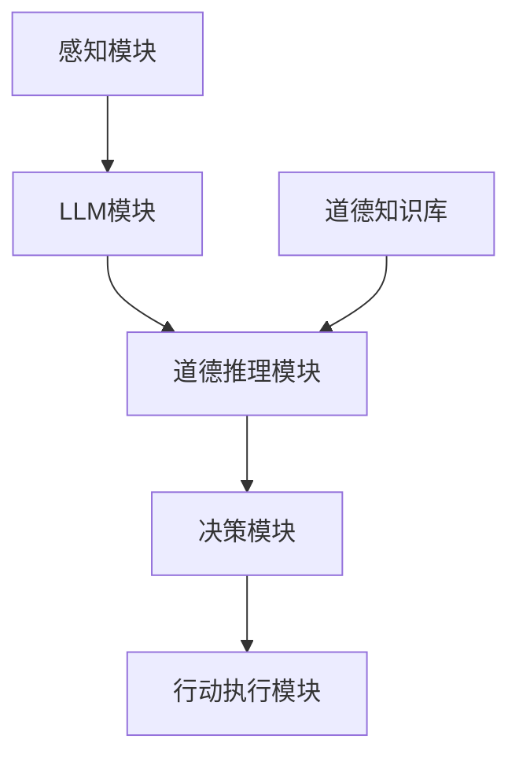

# 构建LLM支持的AI Agent道德推理系统

> 关键词：LLM（大语言模型）、AI Agent、道德推理系统、人工智能伦理、决策机制

> 摘要：本文聚焦于构建LLM支持的AI Agent道德推理系统。随着人工智能技术的飞速发展，AI Agent在各个领域的应用日益广泛，其道德决策能力的重要性愈发凸显。大语言模型（LLM）凭借其强大的语言理解和生成能力，为AI Agent的道德推理提供了有力支持。文章深入探讨了相关核心概念、算法原理、数学模型，通过项目实战展示了系统的实现过程，分析了实际应用场景，推荐了学习和开发的工具资源，最后对未来发展趋势与挑战进行了总结。

## 1. 背景介绍 
### 1.1 目的和范围
在当今数字化时代，AI Agent已经成为众多领域的关键技术，如自动驾驶、医疗诊断、金融服务等。然而，AI Agent在做出决策时可能面临各种道德困境，例如自动驾驶汽车在紧急情况下如何权衡乘客和行人的安全。构建LLM支持的AI Agent道德推理系统的目的在于赋予AI Agent更智能、更符合道德规范的决策能力，减少因不道德决策带来的风险和负面影响。本文章的范围涵盖了从核心概念的阐述到实际应用场景的分析，旨在为研究人员和开发者提供全面的技术指导。

### 1.2 预期读者
本文预期读者包括人工智能领域的研究人员、开发者、伦理学家、政策制定者以及对AI道德推理感兴趣的相关人士。研究人员可以从中获取新的研究思路和方法，开发者能够学习到具体的实现技术，伦理学家可以从技术角度思考AI道德问题，政策制定者可以依据相关内容制定更合理的政策。

### 1.3 文档结构概述
本文首先介绍背景信息，包括目的、预期读者和文档结构。接着阐述核心概念与联系，展示相关原理和架构。然后详细讲解核心算法原理及具体操作步骤，给出数学模型和公式。通过项目实战，呈现代码实现和详细解释。分析实际应用场景，推荐相关工具和资源。最后总结未来发展趋势与挑战，提供常见问题解答和扩展阅读参考资料。

### 1.4 术语表
#### 1.4.1 核心术语定义
- **LLM（大语言模型）**：是一种基于深度学习的语言模型，通过在大规模文本数据上进行训练，能够学习到语言的模式和语义信息，具备强大的语言理解和生成能力。
- **AI Agent（人工智能智能体）**：是能够感知环境、进行决策并采取行动以实现特定目标的智能实体。
- **道德推理系统**：是一种能够让AI Agent在面对道德困境时，依据一定的道德准则和推理机制做出合理决策的系统。

#### 1.4.2 相关概念解释
- **道德困境**：指在决策过程中，不同的道德原则相互冲突，使得难以做出单一的、完全符合道德标准的决策情况。
- **道德准则**：是一系列规定行为是否符合道德要求的原则和规范，如功利主义、义务论等。

#### 1.4.3 缩略词列表
- **LLM**：Large Language Model（大语言模型）
- **AI**：Artificial Intelligence（人工智能）

## 2. 核心概念与联系 
### 核心概念原理
#### LLM的工作原理
LLM通常基于Transformer架构，通过多头自注意力机制学习文本中的上下文信息。其训练过程包括预训练和微调两个阶段。在预训练阶段，模型在大规模无标注文本数据上学习语言的通用模式；在微调阶段，模型在特定任务的标注数据上进行调整，以适应具体的应用场景。

#### AI Agent的决策机制
AI Agent通过感知环境获取信息，将这些信息输入到决策模块。决策模块根据预设的目标和策略，结合环境信息进行推理和计算，最终输出决策结果并执行相应的行动。

#### 道德推理系统的作用
道德推理系统在AI Agent的决策过程中引入道德因素。它能够对决策的道德性进行评估，当面临道德困境时，依据道德准则进行推理和判断，帮助AI Agent做出更符合道德规范的决策。

### 架构的文本示意图
一个LLM支持的AI Agent道德推理系统主要由以下几个部分组成：
1. **感知模块**：负责收集环境信息，如传感器数据、文本信息等。
2. **LLM模块**：对感知到的信息进行处理和理解，生成相关的语义表示。
3. **道德知识库**：存储各种道德准则和案例，为道德推理提供依据。
4. **道德推理模块**：结合LLM的输出和道德知识库的内容，进行道德推理和判断。
5. **决策模块**：根据道德推理的结果和AI Agent的目标，做出最终的决策。
6. **行动执行模块**：执行决策模块输出的行动。

### Mermaid流程图


## 3. 核心算法原理 & 具体操作步骤 
### 核心算法原理
在LLM支持的AI Agent道德推理系统中，主要涉及到文本处理、道德推理和决策算法。以下是基于Python的详细阐述：

#### 文本处理算法
我们可以使用Hugging Face的Transformers库来处理文本。以下是一个简单的示例，展示如何使用预训练的LLM进行文本编码：
```python
from transformers import AutoTokenizer, AutoModel

# 加载预训练的模型和分词器
tokenizer = AutoTokenizer.from_pretrained('bert-base-uncased')
model = AutoModel.from_pretrained('bert-base-uncased')

# 输入文本
text = "This is an example sentence."

# 对文本进行分词
inputs = tokenizer(text, return_tensors='pt')

# 输入模型进行编码
outputs = model(**inputs)

# 获取编码后的向量表示
embedding = outputs.last_hidden_state.mean(dim=1)
print(embedding)
```
在这个示例中，我们使用了BERT模型进行文本编码。首先，加载预训练的分词器和模型。然后，对输入文本进行分词，将其转换为模型可以接受的输入格式。最后，将输入传递给模型，获取编码后的向量表示。

#### 道德推理算法
道德推理可以基于规则或机器学习方法。以下是一个简单的基于规则的道德推理示例：
```python
# 定义道德规则
moral_rules = {
    "do_no_harm": "避免对他人造成伤害",
    "respect_autonomy": "尊重他人的自主选择"
}

# 定义决策场景
scenario = "AI Agent需要决定是否推荐一种有副作用的药物"

# 进行道德推理
def moral_reasoning(scenario):
    if "有副作用的药物" in scenario:
        if "可能对患者造成伤害" in scenario:
            return moral_rules["do_no_harm"]
        else:
            return moral_rules["respect_autonomy"]
    else:
        return "无明确道德准则适用"

# 执行道德推理
result = moral_reasoning(scenario)
print(result)
```
在这个示例中，我们定义了两条道德规则：“do_no_harm”和“respect_autonomy”。然后，根据决策场景的描述，判断是否违反了这些规则，并返回相应的道德准则。

#### 决策算法
决策算法可以结合道德推理的结果和AI Agent的目标进行决策。以下是一个简单的决策示例：
```python
# 定义AI Agent的目标
agent_goal = "提高患者的治疗效果"

# 定义决策函数
def decision_making(moral_result, agent_goal):
    if moral_result == moral_rules["do_no_harm"]:
        if agent_goal == "提高患者的治疗效果":
            return "进一步评估药物的风险和收益"
        else:
            return "谨慎考虑推荐药物"
    elif moral_result == moral_rules["respect_autonomy"]:
        return "提供充分信息让患者自主选择"
    else:
        return "按常规流程决策"

# 执行决策
decision = decision_making(result, agent_goal)
print(decision)
```
在这个示例中，我们根据道德推理的结果和AI Agent的目标，做出最终的决策。

### 具体操作步骤
1. **数据收集和预处理**：收集相关的环境信息和道德案例数据，并进行清洗和标注。
2. **模型选择和训练**：选择合适的LLM模型，并在收集的数据上进行微调。
3. **道德知识库构建**：整理和存储各种道德准则和案例。
4. **道德推理模块实现**：根据选择的道德推理算法，实现道德推理模块。
5. **决策模块实现**：结合道德推理结果和AI Agent的目标，实现决策模块。
6. **系统集成和测试**：将各个模块集成到一起，并进行测试和优化。

## 4. 数学模型和公式 & 详细讲解 & 举例说明 
### 文本编码的数学模型
在文本处理中，LLM通常使用Transformer架构进行文本编码。Transformer的核心是多头自注意力机制，其数学公式如下：

$$\text{Attention}(Q, K, V) = \text{softmax}(\frac{QK^T}{\sqrt{d_k}})V$$

其中，$Q$ 是查询矩阵，$K$ 是键矩阵，$V$ 是值矩阵，$d_k$ 是键向量的维度。多头自注意力机制是将多个自注意力头的结果拼接在一起，然后通过一个线性变换得到最终的输出：

$$\text{MultiHead}(Q, K, V) = \text{Concat}(\text{head}_1, \cdots, \text{head}_h)W^O$$

其中，$\text{head}_i = \text{Attention}(QW_i^Q, KW_i^K, VW_i^V)$，$W_i^Q$、$W_i^K$、$W_i^V$ 和 $W^O$ 是可学习的参数矩阵。

### 道德推理的数学模型
基于规则的道德推理可以表示为一个逻辑判断过程。假设我们有 $n$ 条道德规则 $R = \{r_1, r_2, \cdots, r_n\}$，决策场景 $S$ 可以用一个特征向量 $\mathbf{x}$ 表示。对于每条规则 $r_i$，可以定义一个规则函数 $f_i(\mathbf{x})$，其输出为布尔值，表示决策场景是否满足该规则。道德推理的结果可以表示为：

$$\text{Result} = \arg\max_{i} f_i(\mathbf{x})$$

### 举例说明
假设我们有两条道德规则：$r_1$ 表示“避免对他人造成伤害”，$r_2$ 表示“尊重他人的自主选择”。决策场景 $S$ 是“AI Agent需要决定是否推荐一种有副作用的药物，且可能对患者造成伤害”。我们可以将决策场景表示为一个特征向量 $\mathbf{x} = [1, 0]$，其中第一个元素表示是否可能对他人造成伤害，第二个元素表示是否涉及他人的自主选择。规则函数可以定义为：

$$f_1(\mathbf{x}) = \begin{cases}
1, & \text{if } x_1 = 1 \\
0, & \text{otherwise}
\end{cases}$$

$$f_2(\mathbf{x}) = \begin{cases}
1, & \text{if } x_2 = 1 \\
0, & \text{otherwise}
\end{cases}$$

根据上述公式，$f_1(\mathbf{x}) = 1$，$f_2(\mathbf{x}) = 0$，所以道德推理的结果是 $r_1$，即“避免对他人造成伤害”。

## 5. 项目实战：代码实际案例和详细解释说明 
### 5.1  开发环境搭建
#### 安装Python
首先，确保你已经安装了Python 3.7或更高版本。可以从Python官方网站（https://www.python.org/downloads/） 下载并安装。

#### 安装必要的库
使用pip安装以下必要的库：
```sh
pip install transformers torch numpy
```

### 5.2  源代码详细实现和代码解读
以下是一个完整的LLM支持的AI Agent道德推理系统的示例代码：
```python
from transformers import AutoTokenizer, AutoModel
import torch

# 加载预训练的模型和分词器
tokenizer = AutoTokenizer.from_pretrained('bert-base-uncased')
model = AutoModel.from_pretrained('bert-base-uncased')

# 定义道德规则
moral_rules = {
    "do_no_harm": "避免对他人造成伤害",
    "respect_autonomy": "尊重他人的自主选择"
}

# 定义决策场景
scenario = "AI Agent需要决定是否推荐一种有副作用的药物，且可能对患者造成伤害"

# 文本编码函数
def text_encoding(text):
    inputs = tokenizer(text, return_tensors='pt')
    outputs = model(**inputs)
    embedding = outputs.last_hidden_state.mean(dim=1)
    return embedding

# 道德推理函数
def moral_reasoning(scenario):
    if "有副作用的药物" in scenario:
        if "可能对患者造成伤害" in scenario:
            return moral_rules["do_no_harm"]
        else:
            return moral_rules["respect_autonomy"]
    else:
        return "无明确道德准则适用"

# 定义AI Agent的目标
agent_goal = "提高患者的治疗效果"

# 决策函数
def decision_making(moral_result, agent_goal):
    if moral_result == moral_rules["do_no_harm"]:
        if agent_goal == "提高患者的治疗效果":
            return "进一步评估药物的风险和收益"
        else:
            return "谨慎考虑推荐药物"
    elif moral_result == moral_rules["respect_autonomy"]:
        return "提供充分信息让患者自主选择"
    else:
        return "按常规流程决策"

# 主函数
def main():
    # 文本编码
    embedding = text_encoding(scenario)
    print("文本编码向量:", embedding)

    # 道德推理
    moral_result = moral_reasoning(scenario)
    print("道德推理结果:", moral_result)

    # 决策
    decision = decision_making(moral_result, agent_goal)
    print("最终决策:", decision)

if __name__ == "__main__":
    main()
```
### 5.3  代码解读与分析
1. **文本编码部分**：`text_encoding` 函数使用预训练的BERT模型对输入的决策场景进行编码，将文本转换为向量表示。
2. **道德推理部分**：`moral_reasoning` 函数根据决策场景的描述，判断是否违反了预设的道德规则，并返回相应的道德准则。
3. **决策部分**：`decision_making` 函数结合道德推理的结果和AI Agent的目标，做出最终的决策。
4. **主函数**：`main` 函数依次调用文本编码、道德推理和决策函数，并输出相应的结果。

## 6. 实际应用场景 
### 自动驾驶
在自动驾驶领域，AI Agent需要在复杂的交通环境中做出决策。例如，当面临突发情况时，自动驾驶汽车需要在保护乘客安全和避免对行人造成伤害之间进行权衡。LLM支持的AI Agent道德推理系统可以帮助自动驾驶汽车在这种道德困境中做出更合理的决策。

### 医疗诊断
在医疗诊断中，AI Agent可能需要决定是否推荐某种治疗方案。如果治疗方案有副作用，可能会对患者造成伤害，此时道德推理系统可以依据道德准则，帮助医生和AI Agent做出更符合道德规范的决策，如进一步评估风险和收益，或者提供充分信息让患者自主选择。

### 金融服务
在金融服务领域，AI Agent可能会根据用户的财务状况和风险偏好提供投资建议。道德推理系统可以确保AI Agent在提供建议时，遵守公平、公正、透明的原则，避免误导用户或进行不道德的金融行为。

## 7. 工具和资源推荐
### 7.1 学习资源推荐
#### 7.1.1 书籍推荐
- 《人工智能伦理》：全面介绍了人工智能领域的伦理问题和相关理论。
- 《深度学习》：详细讲解了深度学习的基本原理和算法，是学习LLM的重要参考书籍。

#### 7.1.2 在线课程
- Coursera上的“人工智能基础”课程：提供了人工智能的基础知识和实践经验。
- edX上的“深度学习专项课程”：深入讲解了深度学习的各个方面，包括Transformer架构和LLM。

#### 7.1.3 技术博客和网站
- Hugging Face博客：提供了关于Transformer模型和自然语言处理的最新研究成果和技术分享。
- arXiv：一个预印本平台，包含了大量的人工智能和机器学习领域的研究论文。

### 7.2 开发工具框架推荐
#### 7.2.1 IDE和编辑器
- PyCharm：一个功能强大的Python集成开发环境，提供了代码编辑、调试、版本控制等功能。
- Visual Studio Code：一个轻量级的代码编辑器，支持多种编程语言和插件扩展。

#### 7.2.2 调试和性能分析工具
- PDB：Python自带的调试工具，可以帮助开发者定位和解决代码中的问题。
- PyTorch Profiler：用于分析PyTorch模型的性能，找出性能瓶颈。

#### 7.2.3 相关框架和库
- Transformers：Hugging Face开发的自然语言处理库，提供了多种预训练的LLM模型和工具。
- PyTorch：一个开源的深度学习框架，广泛用于自然语言处理和计算机视觉等领域。

### 7.3 相关论文著作推荐
#### 7.3.1 经典论文
- “Attention Is All You Need”：介绍了Transformer架构，是现代LLM的基础。
- “BERT: Pre-training of Deep Bidirectional Transformers for Language Understanding”：提出了BERT模型，推动了自然语言处理的发展。

#### 7.3.2 最新研究成果
- 关注顶级学术会议如NeurIPS、ICML、ACL等的最新论文，了解LLM和AI道德推理的最新研究进展。

#### 7.3.3 应用案例分析
- 研究实际应用中的AI道德决策案例，如自动驾驶事故的分析报告，从中学习如何构建更有效的道德推理系统。

## 8. 总结：未来发展趋势与挑战
### 未来发展趋势
- **多模态融合**：未来的LLM支持的AI Agent道德推理系统将不仅仅局限于文本处理，还会融合图像、语音等多模态信息，以更全面地理解决策场景。
- **个性化道德推理**：根据不同用户的价值观和道德偏好，实现个性化的道德推理和决策。
- **与人类的协作**：AI Agent将与人类更紧密地协作，共同进行道德决策，提高决策的可靠性和可接受性。

### 挑战
- **道德准则的多样性**：不同文化、不同群体的道德准则存在差异，如何在系统中统一和平衡这些差异是一个挑战。
- **数据隐私和安全**：道德推理系统需要处理大量的用户数据，如何保护数据的隐私和安全是至关重要的问题。
- **可解释性**：AI Agent的道德决策需要具有可解释性，以便用户理解和信任决策结果，但目前LLM的黑盒性质给可解释性带来了挑战。

## 9. 附录：常见问题与解答
### 问题1：如何选择合适的LLM模型？
解答：选择LLM模型时，需要考虑模型的性能、计算资源、应用场景等因素。对于一般的自然语言处理任务，可以选择BERT、GPT等预训练模型；对于特定领域的任务，可以选择相应领域的预训练模型或在通用模型的基础上进行微调。

### 问题2：道德推理系统的准确性如何保证？
解答：可以通过以下方法保证道德推理系统的准确性：使用高质量的道德知识库，进行充分的训练和测试，引入人类专家的反馈和监督等。

### 问题3：如何处理道德规则之间的冲突？
解答：可以采用优先级排序、权重分配等方法来处理道德规则之间的冲突。在实际应用中，需要根据具体情况进行调整和优化。

## 10. 扩展阅读 & 参考资料
- 《人工智能：一种现代方法》
- “Ethics of Artificial Intelligence and Robotics” by Vincent C. Müller
- Hugging Face官方文档：https://huggingface.co/docs/transformers/index
- PyTorch官方文档：https://pytorch.org/docs/stable/index.html

作者：AI天才研究院/AI Genius Institute & 禅与计算机程序设计艺术 /Zen And The Art of Computer Programming