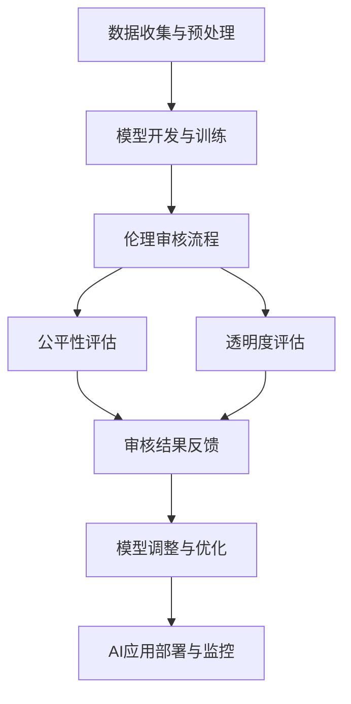

# 构建企业级AI伦理审核框架：确保AI应用的公平性与透明度

> 关键词：企业级AI、伦理审核框架、公平性、透明度、AI应用

> 摘要：本文聚焦于构建企业级AI伦理审核框架，以保障AI应用的公平性与透明度。首先介绍了该研究的背景，包括目的、预期读者、文档结构和相关术语。接着阐述了核心概念及联系，通过文本示意图和Mermaid流程图展示原理与架构。详细讲解了核心算法原理和具体操作步骤，并辅以Python代码说明。给出了相关数学模型和公式，结合实际例子进行解释。通过项目实战，展示了开发环境搭建、源代码实现与解读。探讨了实际应用场景，推荐了学习资源、开发工具框架和相关论文著作。最后总结了未来发展趋势与挑战，提供了常见问题解答和扩展阅读参考资料，旨在为企业构建有效的AI伦理审核框架提供全面的指导。

## 1. 背景介绍 
### 1.1 目的和范围
在当今数字化时代，人工智能（AI）技术在企业中得到了广泛应用，从客户服务到决策支持，AI正深刻地改变着企业的运营模式。然而，AI系统可能存在偏见、缺乏透明度等伦理问题，这些问题不仅会影响用户体验，还可能引发法律和社会风险。本研究的目的是构建一个企业级AI伦理审核框架，确保AI应用在开发、部署和使用过程中遵循公平性和透明度原则。

本框架的范围涵盖了各种类型的AI应用，包括机器学习模型、深度学习算法、自然语言处理系统等。同时，该框架适用于不同规模和行业的企业，旨在为企业提供一套通用的、可操作的伦理审核方法。

### 1.2 预期读者
本文的预期读者包括企业的技术管理人员、AI开发人员、数据科学家、伦理专家以及对AI伦理问题感兴趣的研究人员。技术管理人员可以通过本框架了解如何在企业中实施AI伦理审核，确保企业的AI应用符合伦理标准；AI开发人员和数据科学家可以从中学习如何在开发过程中考虑伦理因素，提高AI系统的公平性和透明度；伦理专家可以借助本框架评估企业的AI伦理实践；研究人员可以将本框架作为进一步研究的基础。

### 1.3 文档结构概述
本文将按照以下结构进行组织：首先介绍相关背景知识，包括目的、预期读者、文档结构和术语表；接着阐述核心概念与联系，通过文本示意图和Mermaid流程图展示AI伦理审核框架的原理和架构；然后详细讲解核心算法原理和具体操作步骤，并给出Python代码示例；再介绍相关的数学模型和公式，结合实际例子进行说明；通过项目实战展示如何在实际中应用该框架，包括开发环境搭建、源代码实现和代码解读；探讨该框架的实际应用场景；推荐学习资源、开发工具框架和相关论文著作；最后总结未来发展趋势与挑战，提供常见问题解答和扩展阅读参考资料。

### 1.4 术语表
#### 1.4.1 核心术语定义
- **AI伦理审核框架**：一套用于评估和确保AI应用符合伦理原则的方法和流程，包括公平性、透明度、隐私保护等方面。
- **公平性**：指AI系统在处理不同群体的数据时，不产生偏见或歧视，能够公平地对待每个个体或群体。
- **透明度**：指AI系统的决策过程和算法逻辑能够被用户和利益相关者理解和审查，避免黑盒操作。
- **AI应用**：基于人工智能技术开发的各种软件系统或服务，如智能推荐系统、图像识别系统等。

#### 1.4.2 相关概念解释
- **偏见**：AI系统在数据收集、模型训练或决策过程中，对某些群体或特征存在不公正的偏好或歧视。
- **可解释性**：指AI系统的决策结果能够通过合理的解释和说明，让用户和利益相关者理解其背后的原因。
- **数据隐私**：保护用户数据的保密性、完整性和可用性，防止数据被非法获取、使用或泄露。

#### 1.4.3 缩略词列表
- **AI**：Artificial Intelligence，人工智能
- **ML**：Machine Learning，机器学习
- **DL**：Deep Learning，深度学习
- **NLP**：Natural Language Processing，自然语言处理

## 2. 核心概念与联系 
### 核心概念原理
企业级AI伦理审核框架的核心原理是通过一系列的评估指标和审核流程，确保AI应用在公平性和透明度方面达到伦理标准。公平性主要涉及到AI系统在不同群体（如性别、种族、年龄等）之间的公正对待，避免因数据偏差或算法设计问题导致的歧视。透明度则强调AI系统的决策过程和算法逻辑的可解释性，让用户和利益相关者能够理解系统是如何做出决策的。

### 架构的文本示意图
以下是企业级AI伦理审核框架的架构示意图：

```plaintext
|---------------------|
|  数据收集与预处理   |
|---------------------|
|       |             |
|       v             |
|  模型开发与训练    |
|---------------------|
|       |             |
|       v             |
|  伦理审核流程      |
|---------------------|
| 公平性评估 | 透明度评估 |
|---------------------|
|       |             |
|       v             |
|  审核结果反馈      |
|---------------------|
|       |             |
|       v             |
|  模型调整与优化    |
|---------------------|
|       |             |
|       v             |
|  AI应用部署与监控  |
|---------------------|
```

### Mermaid流程图


从流程图可以看出，整个框架是一个循环的过程。首先进行数据收集和预处理，然后进行模型开发和训练。接着进入伦理审核流程，分别进行公平性评估和透明度评估。根据审核结果反馈，对模型进行调整和优化。最后将优化后的模型部署到实际应用中，并进行持续监控，确保AI应用始终符合伦理标准。

## 3. 核心算法原理 & 具体操作步骤 
### 核心算法原理
在AI伦理审核框架中，公平性评估和透明度评估是两个核心环节。下面分别介绍这两个环节的核心算法原理。

#### 公平性评估算法
公平性评估的核心目标是检测AI系统是否对不同群体存在偏见。一种常用的方法是计算不同群体之间的统计差异。例如，对于一个二分类模型，可以计算不同群体的准确率、召回率等指标，并比较它们之间的差异。如果差异超过一定阈值，则认为模型存在偏见。

以下是一个简单的Python代码示例，用于计算不同群体的准确率差异：
```python
import numpy as np

def calculate_accuracy_difference(y_true_group1, y_pred_group1, y_true_group2, y_pred_group2):
    accuracy_group1 = np.mean(y_true_group1 == y_pred_group1)
    accuracy_group2 = np.mean(y_true_group2 == y_pred_group2)
    difference = abs(accuracy_group1 - accuracy_group2)
    return difference

# 示例数据
y_true_group1 = np.array([1, 0, 1, 0])
y_pred_group1 = np.array([1, 1, 1, 0])
y_true_group2 = np.array([0, 1, 0, 1])
y_pred_group2 = np.array([0, 0, 0, 1])

difference = calculate_accuracy_difference(y_true_group1, y_pred_group1, y_true_group2, y_pred_group2)
print(f"Accuracy difference: {difference}")
```
在上述代码中，`calculate_accuracy_difference` 函数接受两个群体的真实标签和预测标签作为输入，计算并返回两个群体之间的准确率差异。

#### 透明度评估算法
透明度评估的核心是让AI系统的决策过程可解释。一种常用的方法是使用可解释性模型，如决策树、线性回归等。这些模型的决策规则相对简单，容易理解。另外，还可以使用特征重要性分析来解释模型的决策。例如，通过计算每个特征对模型输出的贡献程度，来了解哪些特征对决策影响最大。

以下是一个使用决策树模型进行特征重要性分析的Python代码示例：
```python
from sklearn.datasets import load_iris
from sklearn.tree import DecisionTreeClassifier
import matplotlib.pyplot as plt

# 加载数据集
iris = load_iris()
X = iris.data
y = iris.target

# 训练决策树模型
model = DecisionTreeClassifier()
model.fit(X, y)

# 获取特征重要性
feature_importances = model.feature_importances_

# 绘制特征重要性图
plt.bar(iris.feature_names, feature_importances)
plt.xlabel('Features')
plt.ylabel('Importance')
plt.title('Feature Importance in Decision Tree Model')
plt.show()
```
在上述代码中，首先加载鸢尾花数据集，然后训练一个决策树模型。接着获取模型的特征重要性，并使用柱状图进行可视化展示。

### 具体操作步骤
#### 数据准备
- 收集与AI应用相关的数据，包括训练数据、测试数据等。
- 对数据进行预处理，如数据清洗、特征工程等，确保数据的质量和一致性。

#### 模型开发与训练
- 选择合适的AI模型，如机器学习模型或深度学习模型。
- 使用准备好的数据对模型进行训练和调优。

#### 伦理审核
- 进行公平性评估，计算不同群体之间的统计差异，检测模型是否存在偏见。
- 进行透明度评估，使用可解释性模型或特征重要性分析等方法，解释模型的决策过程。

#### 审核结果反馈与模型调整
- 根据审核结果，判断模型是否符合伦理标准。如果不符合，需要对模型进行调整和优化。
- 调整的方法包括重新选择特征、调整模型参数、使用更公平的算法等。

#### 应用部署与监控
- 将优化后的模型部署到实际应用中。
- 持续监控AI应用的运行情况，定期进行伦理审核，确保模型始终符合伦理标准。

## 4. 数学模型和公式 & 详细讲解 & 举例说明 
### 公平性评估的数学模型和公式
#### 统计均等性差异（Statistical Parity Difference）
统计均等性差异用于衡量不同群体之间的接受率差异。假设我们有两个群体 $G_1$ 和 $G_2$，$P(Y = 1|G = G_1)$ 表示群体 $G_1$ 中被分类为正类的概率，$P(Y = 1|G = G_2)$ 表示群体 $G_2$ 中被分类为正类的概率。统计均等性差异的计算公式为：

$$SPD = P(Y = 1|G = G_1) - P(Y = 1|G = G_2)$$

如果 $SPD$ 的绝对值接近 0，则说明模型在两个群体之间的接受率较为公平；如果 $SPD$ 的绝对值较大，则说明模型存在偏见。

#### 示例说明
假设我们有一个贷款审批模型，$G_1$ 表示男性群体，$G_2$ 表示女性群体。在男性群体中，有 100 人申请贷款，其中 60 人获得批准，即 $P(Y = 1|G = G_1) = \frac{60}{100} = 0.6$；在女性群体中，有 80 人申请贷款，其中 30 人获得批准，即 $P(Y = 1|G = G_2) = \frac{30}{80} = 0.375$。则统计均等性差异为：

$$SPD = 0.6 - 0.375 = 0.225$$

由于 $SPD$ 的值较大，说明该贷款审批模型可能存在对女性群体的偏见。

### 透明度评估的数学模型和公式
#### 特征重要性计算
在决策树模型中，特征重要性可以通过基尼不纯度（Gini impurity）或信息增益（Information gain）来计算。以基尼不纯度为例，特征 $X_j$ 的重要性 $I(X_j)$ 可以通过以下公式计算：

$$I(X_j) = \sum_{t \in T} \frac{N_t}{N} \left[ G(t) - G(t_{left}) - G(t_{right}) \right]$$

其中，$T$ 表示决策树中所有使用特征 $X_j$ 进行分裂的节点集合，$N_t$ 表示节点 $t$ 中的样本数量，$N$ 表示所有样本的数量，$G(t)$ 表示节点 $t$ 的基尼不纯度，$G(t_{left})$ 和 $G(t_{right})$ 分别表示节点 $t$ 分裂后的左子节点和右子节点的基尼不纯度。

#### 示例说明
假设我们有一个决策树模型，用于预测客户是否会购买某种产品。模型使用了三个特征：年龄、收入和性别。通过计算，得到年龄特征的重要性为 0.4，收入特征的重要性为 0.3，性别特征的重要性为 0.2。这说明在该模型的决策过程中，年龄特征对预测结果的影响最大，其次是收入特征，性别特征的影响相对较小。

## 5. 项目实战：代码实际案例和详细解释说明 
### 5.1  开发环境搭建
#### 安装Python和相关库
首先，确保你已经安装了Python 3.x 版本。然后，使用以下命令安装所需的库：
```sh
pip install numpy pandas scikit-learn matplotlib
```
- `numpy`：用于数值计算。
- `pandas`：用于数据处理和分析。
- `scikit-learn`：提供了各种机器学习算法和工具。
- `matplotlib`：用于数据可视化。

#### 下载数据集
本项目使用的是成人收入数据集（Adult Income Dataset），可以从UCI机器学习库中下载。下载后，将数据集保存为 `adult.csv` 文件。

### 5.2  源代码详细实现和代码解读
```python
import pandas as pd
from sklearn.model_selection import train_test_split
from sklearn.tree import DecisionTreeClassifier
from sklearn.metrics import accuracy_score

# 读取数据集
data = pd.read_csv('adult.csv')

# 数据预处理
# 处理缺失值
data = data.replace('?', pd.NA)
data = data.dropna()

# 特征选择和编码
features = data.drop('income', axis=1)
target = data['income']
features = pd.get_dummies(features)

# 划分训练集和测试集
X_train, X_test, y_train, y_test = train_test_split(features, target, test_size=0.2, random_state=42)

# 训练决策树模型
model = DecisionTreeClassifier()
model.fit(X_train, y_train)

# 预测
y_pred = model.predict(X_test)

# 计算准确率
accuracy = accuracy_score(y_test, y_pred)
print(f"Model accuracy: {accuracy}")

# 公平性评估
# 假设我们关注性别特征的公平性
male_indices = X_test['sex_Male'] == 1
female_indices = X_test['sex_Male'] == 0

y_true_male = y_test[male_indices]
y_pred_male = y_pred[male_indices]
y_true_female = y_test[female_indices]
y_pred_female = y_pred[female_indices]

accuracy_male = accuracy_score(y_true_male, y_pred_male)
accuracy_female = accuracy_score(y_true_female, y_pred_female)
accuracy_difference = abs(accuracy_male - accuracy_female)
print(f"Accuracy difference between male and female: {accuracy_difference}")

# 透明度评估
# 特征重要性分析
feature_importances = model.feature_importances_
feature_names = features.columns
feature_importance_df = pd.DataFrame({'Feature': feature_names, 'Importance': feature_importances})
feature_importance_df = feature_importance_df.sort_values(by='Importance', ascending=False)
print(feature_importance_df.head(10))
```

### 5.3  代码解读与分析
#### 数据读取和预处理
- 使用 `pandas` 库的 `read_csv` 函数读取数据集。
- 处理缺失值，将 `?` 替换为 `pd.NA`，并删除包含缺失值的行。
- 使用 `pd.get_dummies` 函数对特征进行编码，将分类特征转换为数值特征。

#### 模型训练和预测
- 使用 `train_test_split` 函数将数据集划分为训练集和测试集。
- 训练一个决策树模型，并使用训练集进行拟合。
- 使用测试集进行预测，并计算模型的准确率。

#### 公平性评估
- 假设我们关注性别特征的公平性，根据 `sex_Male` 特征将测试集分为男性和女性两个群体。
- 分别计算男性和女性群体的准确率，并计算两者之间的差异。

#### 透明度评估
- 使用 `model.feature_importances_` 方法获取模型的特征重要性。
- 将特征重要性存储在 `DataFrame` 中，并按重要性降序排序，打印前 10 个重要的特征。

## 6. 实际应用场景 
### 金融领域
在金融领域，AI技术被广泛应用于贷款审批、信用评分等业务。通过构建企业级AI伦理审核框架，可以确保贷款审批模型在不同性别、种族等群体之间公平对待，避免因偏见导致的不公平贷款决策。同时，提高模型的透明度，让客户能够理解自己的信用评分是如何计算的，增强客户对金融机构的信任。

### 医疗领域
在医疗领域，AI技术可用于疾病诊断、治疗方案推荐等。伦理审核框架可以保证AI诊断模型在不同年龄段、地域等群体之间的公平性，避免因数据偏差导致的误诊。此外，提高模型的透明度可以让医生更好地理解AI模型的决策依据，从而更准确地进行临床决策。

### 招聘领域
在招聘过程中，AI技术可以用于筛选简历、评估候选人等。通过伦理审核框架，可以确保招聘模型在不同性别、学历等群体之间公平筛选，避免因偏见导致的人才流失。同时，让候选人了解招聘模型的评估标准，提高招聘过程的透明度和公正性。

## 7. 工具和资源推荐
### 7.1 学习资源推荐
#### 7.1.1 书籍推荐
- 《人工智能伦理》：本书全面介绍了人工智能伦理的基本概念、理论和实践，探讨了AI技术带来的伦理挑战和应对策略。
- 《可解释的机器学习》：详细讲解了如何让机器学习模型具有可解释性，介绍了各种可解释性方法和工具。
- 《数据挖掘：概念与技术》：涵盖了数据挖掘的基本概念、算法和应用，对于理解AI模型的数据处理和特征工程有很大帮助。

#### 7.1.2 在线课程
- Coursera上的“AI Ethics”课程：由知名高校的教授授课，系统地介绍了AI伦理的相关知识和案例。
- edX上的“Interpretability and Explainability in Machine Learning”课程：专注于机器学习模型的可解释性，提供了丰富的实践案例和代码示例。

#### 7.1.3 技术博客和网站
- Medium上的AI伦理相关博客：有许多AI领域的专家和从业者分享他们在AI伦理方面的研究和实践经验。
- AI Ethics.org：一个专门的AI伦理网站，提供了最新的AI伦理研究成果、案例分析和政策解读。

### 7.2 开发工具框架推荐
#### 7.2.1 IDE和编辑器
- PyCharm：一款专业的Python集成开发环境，提供了丰富的代码编辑、调试和版本控制功能。
- Jupyter Notebook：一个交互式的编程环境，适合进行数据探索、模型开发和可视化展示。

#### 7.2.2 调试和性能分析工具
- TensorBoard：一个用于可视化和分析深度学习模型训练过程的工具，可以帮助开发者监控模型的性能和参数变化。
- Scikit-learn的`GridSearchCV`：用于模型调优和参数搜索，可以自动寻找最优的模型参数组合。

#### 7.2.3 相关框架和库
- AIF360：一个专门用于AI公平性评估和缓解的开源库，提供了各种公平性指标和算法。
- LIME：一个用于模型可解释性的开源库，可以对任何机器学习模型进行局部可解释性分析。

### 7.3 相关论文著作推荐
#### 7.3.1 经典论文
- “Fairness in Machine Learning”：该论文深入探讨了机器学习中的公平性问题，提出了一系列公平性评估指标和算法。
- “Interpretable Machine Learning: A Guide for Making Black Box Models Explainable”：系统地介绍了可解释机器学习的方法和技术，为提高AI模型的透明度提供了理论基础。

#### 7.3.2 最新研究成果
- 关注顶级学术会议如NeurIPS、ICML等上发表的关于AI伦理的最新研究论文，了解该领域的前沿动态。

#### 7.3.3 应用案例分析
- 一些知名企业如Google、Microsoft等发布的关于AI伦理应用案例的报告，可以学习他们在实际项目中如何应用伦理审核框架。

## 8. 总结：未来发展趋势与挑战
### 未来发展趋势
- **法规和标准的完善**：随着AI技术的广泛应用，政府和监管机构将制定更加严格的AI伦理法规和标准，企业需要遵守这些法规，构建更加完善的伦理审核框架。
- **技术的不断创新**：未来，将出现更多的AI伦理审核技术和工具，如自动化审核系统、基于区块链的透明度解决方案等，提高伦理审核的效率和准确性。
- **跨学科合作的加强**：AI伦理问题涉及到计算机科学、伦理学、法学等多个学科，未来将加强跨学科合作，共同解决AI伦理挑战。

### 挑战
- **数据隐私和安全问题**：在进行伦理审核时，需要处理大量的用户数据，如何保护数据的隐私和安全是一个重要挑战。
- **伦理标准的多样性**：不同地区、不同文化背景下的伦理标准可能存在差异，如何制定一套通用的、可接受的伦理标准是一个难题。
- **AI技术的复杂性**：随着AI技术的不断发展，模型的复杂性越来越高，如何对复杂的AI模型进行有效的伦理审核是一个挑战。

## 9. 附录：常见问题与解答
### 问题1：如何确定公平性评估的阈值？
公平性评估的阈值没有一个固定的标准，通常需要根据具体的应用场景和业务需求来确定。可以参考相关的行业标准或法规，也可以通过实验和经验来确定一个合适的阈值。

### 问题2：如何提高AI模型的透明度？
可以使用可解释性模型，如决策树、线性回归等；进行特征重要性分析，了解哪些特征对模型决策影响最大；使用局部可解释性方法，如LIME，对模型的具体决策进行解释。

### 问题3：AI伦理审核框架是否会增加企业的成本？
在短期内，构建和实施AI伦理审核框架可能会增加企业的成本，包括人力、物力和时间成本。但从长期来看，遵守伦理标准可以提高企业的声誉和竞争力，减少潜在的法律风险和社会风险，从而带来更大的收益。

## 10. 扩展阅读 & 参考资料
### 扩展阅读
- 《AI 3.0》：探讨了人工智能的发展现状和未来趋势，以及AI技术带来的社会和伦理问题。
- 《The Alignment Problem: Machine Learning and Human Values》：深入研究了AI系统与人类价值观的对齐问题，提出了一些解决方案和思考方向。

### 参考资料
- UCI Machine Learning Repository: https://archive.ics.uci.edu/ml/index.php
- AIF360 Documentation: https://aif360.readthedocs.io/en/latest/
- LIME Documentation: https://lime-ml.readthedocs.io/en/latest/

作者：AI天才研究院/AI Genius Institute & 禅与计算机程序设计艺术 /Zen And The Art of Computer Programming