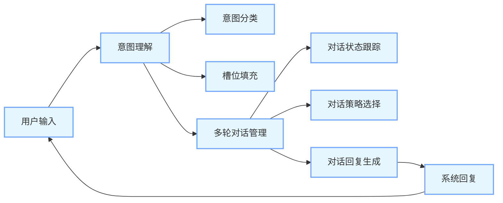

# 构建企业级对话系统：多轮对话管理与意图理解

> 关键词：企业级对话系统、多轮对话管理、意图理解、自然语言处理、人工智能

> 摘要：本文聚焦于构建企业级对话系统，着重探讨多轮对话管理与意图理解这两个关键方面。首先介绍了构建此类对话系统的背景信息，包括目的、预期读者等内容。接着深入讲解了多轮对话管理和意图理解的核心概念及其联系，通过文本示意图和 Mermaid 流程图进行直观展示。阐述了相关核心算法原理并给出 Python 代码示例，分析了其中涉及的数学模型和公式。通过项目实战案例，详细说明了开发环境搭建、源代码实现及解读。同时列举了该技术的实际应用场景，推荐了学习所需的工具和资源。最后总结了未来发展趋势与挑战，并对常见问题进行了解答，为企业级对话系统的构建提供了全面而深入的技术指导。

## 1. 背景介绍 
### 1.1 目的和范围
随着人工智能技术的飞速发展，企业级对话系统在客户服务、智能助手等领域发挥着越来越重要的作用。构建企业级对话系统的目的在于为企业提供高效、智能的交互方式，提升客户满意度和企业运营效率。本文的范围涵盖了企业级对话系统中多轮对话管理和意图理解的核心技术，包括其原理、算法、实现步骤以及实际应用等方面。

### 1.2 预期读者
本文预期读者包括从事自然语言处理、人工智能相关领域的技术人员，如程序员、软件架构师等；企业中负责数字化转型、客户服务系统建设的管理人员；以及对企业级对话系统感兴趣的研究人员和爱好者。

### 1.3 文档结构概述
本文将按照以下结构进行阐述：首先介绍核心概念与联系，帮助读者建立对多轮对话管理和意图理解的基本认识；接着详细讲解核心算法原理和具体操作步骤，并给出 Python 代码示例；然后分析其中涉及的数学模型和公式；通过项目实战案例展示如何将理论应用到实际开发中；列举实际应用场景，说明该技术的实用性；推荐相关的工具和资源，为读者进一步学习提供帮助；最后总结未来发展趋势与挑战，解答常见问题，并提供扩展阅读和参考资料。

### 1.4 术语表
#### 1.4.1 核心术语定义
- **企业级对话系统**：为企业定制开发的，能够与用户进行自然语言交互的智能系统，可应用于客户服务、销售支持等多个业务场景。
- **多轮对话管理**：在对话过程中，对多轮交互进行有效组织和协调，确保对话的连贯性和逻辑性，能够根据历史对话信息做出合理响应。
- **意图理解**：分析用户输入的自然语言文本，识别其背后的真实意图，如查询信息、执行操作等。

#### 1.4.2 相关概念解释
- **自然语言处理（NLP）**：是计算机科学与语言学的交叉领域，旨在让计算机能够理解、处理和生成自然语言。企业级对话系统的多轮对话管理和意图理解都依赖于 NLP 技术。
- **对话状态跟踪**：在多轮对话中，记录和更新对话的当前状态，包括用户的历史意图、提供的信息等，以便系统做出准确的响应。

#### 1.4.3 缩略词列表
- **NLP**：Natural Language Processing（自然语言处理）
- **ML**：Machine Learning（机器学习）
- **DL**：Deep Learning（深度学习）

## 2. 核心概念与联系 

### 多轮对话管理核心概念
多轮对话管理是企业级对话系统的重要组成部分，它负责处理用户与系统之间的多轮交互。在实际对话中，用户的需求往往不能在一轮对话中完全表达清楚，需要通过多轮交互逐步明确。多轮对话管理的主要任务包括对话状态跟踪、对话策略选择和对话回复生成。

对话状态跟踪是指记录和更新对话的当前状态，包括用户的历史意图、提供的信息以及系统的响应等。通过对话状态跟踪，系统可以了解对话的上下文，从而做出更准确的响应。

对话策略选择是根据当前对话状态和用户的最新输入，选择合适的对话策略。对话策略可以是直接回答用户的问题、询问用户更多信息、引导用户进行下一步操作等。

对话回复生成是根据选择的对话策略，生成合适的自然语言回复。回复应该符合自然语言的表达习惯，并且能够准确传达系统的意图。

### 意图理解核心概念
意图理解是指分析用户输入的自然语言文本，识别其背后的真实意图。在企业级对话系统中，准确的意图理解是系统能够正确响应用户的关键。意图理解的主要任务包括意图分类和槽位填充。

意图分类是将用户的输入文本分类到预定义的意图类别中。例如，在一个客服对话系统中，预定义的意图类别可以包括查询产品信息、投诉、申请退款等。

槽位填充是指从用户的输入文本中提取与意图相关的关键信息。例如，在用户查询产品信息的意图中，槽位可以包括产品名称、型号、价格等。

### 核心概念联系
多轮对话管理和意图理解是相互关联、相互影响的。意图理解为多轮对话管理提供了基础，只有准确理解用户的意图，多轮对话管理才能根据意图选择合适的对话策略。而多轮对话管理则可以帮助意图理解更准确地识别用户的意图，通过多轮交互获取更多的上下文信息，从而提高意图理解的准确率。

### 文本示意图
```plaintext
企业级对话系统
├── 多轮对话管理
│   ├── 对话状态跟踪
│   │   └── 记录对话历史信息
│   ├── 对话策略选择
│   │   └── 根据状态和输入选择策略
│   └── 对话回复生成
│       └── 根据策略生成回复
├── 意图理解
│   ├── 意图分类
│   │   └── 将输入分类到意图类别
│   └── 槽位填充
│       └── 提取关键信息
```

### Mermaid 流程图


## 3. 核心算法原理 & 具体操作步骤 

### 意图理解算法原理
#### 意图分类算法 - 朴素贝叶斯分类器
朴素贝叶斯分类器是一种基于贝叶斯定理的简单概率分类器，它假设特征之间相互独立。在意图分类中，我们可以将用户输入的文本看作是一个特征向量，每个特征表示文本中的一个词或短语。

朴素贝叶斯分类器的核心思想是计算每个意图类别在给定文本下的后验概率，然后选择后验概率最大的类别作为预测结果。根据贝叶斯定理，后验概率可以表示为：

$$P(c|x)=\frac{P(x|c)P(c)}{P(x)}$$

其中，$P(c|x)$ 是在文本 $x$ 下意图类别 $c$ 的后验概率，$P(x|c)$ 是在意图类别 $c$ 下文本 $x$ 的似然概率，$P(c)$ 是意图类别 $c$ 的先验概率，$P(x)$ 是文本 $x$ 的概率。

由于 $P(x)$ 对于所有意图类别都是相同的，因此在实际计算中可以忽略。朴素贝叶斯分类器选择后验概率最大的意图类别作为预测结果：

$$\hat{c}=\arg\max_{c\in C}P(x|c)P(c)$$

其中，$C$ 是所有意图类别的集合。

#### Python 代码实现
```python
import numpy as np
from sklearn.feature_extraction.text import CountVectorizer
from sklearn.naive_bayes import MultinomialNB

# 训练数据
corpus = [
    "我想查询产品 A 的价格",
    "我要投诉你们的服务",
    "我想申请退款"
]
labels = ["查询产品信息", "投诉", "申请退款"]

# 特征提取
vectorizer = CountVectorizer()
X = vectorizer.fit_transform(corpus)

# 训练模型
clf = MultinomialNB()
clf.fit(X, labels)

# 测试数据
test_text = "我想知道产品 B 的价格"
test_X = vectorizer.transform([test_text])

# 预测
predicted_label = clf.predict(test_X)
print("预测意图类别:", predicted_label[0])
```

#### 槽位填充算法 - 条件随机场（CRF）
条件随机场是一种用于序列标注的概率图模型，在槽位填充中，我们可以将用户输入的文本看作是一个序列，每个词或短语看作是一个序列元素，槽位标签看作是元素的标注。

条件随机场的核心思想是通过定义特征函数来计算序列的条件概率，然后选择条件概率最大的标注序列作为预测结果。

#### Python 代码实现
```python
import sklearn_crfsuite
from sklearn_crfsuite import metrics

# 训练数据
train_data = [
    [("我", "O"), ("想", "O"), ("查询", "O"), ("产品", "B-产品名称"), ("A", "I-产品名称"), ("的", "O"), ("价格", "B-产品属性")],
    [("我", "O"), ("要", "O"), ("投诉", "O"), ("你们", "O"), ("的", "O"), ("服务", "B-投诉内容")],
    [("我", "O"), ("想", "O"), ("申请", "O"), ("退款", "B-操作")]
]

# 特征提取函数
def word2features(sent, i):
    word = sent[i][0]
    features = {
        'bias': 1.0,
        'word.lower()': word.lower(),
        'word.isupper()': word.isupper(),
        'word.istitle()': word.istitle(),
        'word.isdigit()': word.isdigit()
    }
    if i > 0:
        word1 = sent[i-1][0]
        features.update({
            '-1:word.lower()': word1.lower(),
            '-1:word.istitle()': word1.istitle(),
            '-1:word.isupper()': word1.isupper()
        })
    else:
        features['BOS'] = True
    if i < len(sent)-1:
        word1 = sent[i+1][0]
        features.update({
            '+1:word.lower()': word1.lower(),
            '+1:word.istitle()': word1.istitle(),
            '+1:word.isupper()': word1.isupper()
        })
    else:
        features['EOS'] = True
    return features

def sent2features(sent):
    return [word2features(sent, i) for i in range(len(sent))]

def sent2labels(sent):
    return [label for token, label in sent]

X_train = [sent2features(s) for s in train_data]
y_train = [sent2labels(s) for s in train_data]

# 训练模型
crf = sklearn_crfsuite.CRF(
    algorithm='lbfgs',
    c1=0.1,
    c2=0.1,
    max_iterations=100,
    all_possible_transitions=True
)
crf.fit(X_train, y_train)

# 测试数据
test_sent = [("我", "O"), ("想", "O"), ("知道", "O"), ("产品", "B-产品名称"), ("B", "I-产品名称"), ("的", "O"), ("价格", "B-产品属性")]
X_test = [sent2features(test_sent)]
y_pred = crf.predict(X_test)
print("预测槽位标签:", y_pred[0])
```

### 多轮对话管理算法原理
#### 基于规则的对话管理
基于规则的对话管理是一种简单直观的方法，它通过预先定义的规则来处理对话。规则可以是条件语句、状态转移图等形式。

例如，在一个查询产品信息的对话系统中，可以定义以下规则：
- 如果用户意图是查询产品信息，但未提供产品名称，则询问用户产品名称。
- 如果用户提供了产品名称，则查询该产品的信息并回复用户。

#### Python 代码实现
```python
# 对话状态定义
dialogue_state = {
    "user_intent": None,
    "product_name": None
}

# 规则定义
def process_user_input(input_text):
    # 简单的意图理解，假设这里已经有意图分类结果
    if "查询产品信息" in input_text:
        dialogue_state["user_intent"] = "查询产品信息"
        if "产品" in input_text:
            # 简单的槽位填充，假设可以提取产品名称
            product_name = input_text.split("产品")[1].strip()
            dialogue_state["product_name"] = product_name
            return f"以下是 {product_name} 的信息：[具体信息]"
        else:
            return "请问您想查询哪个产品的信息？"
    else:
        return "抱歉，我不理解您的意思。"

# 模拟用户输入
user_input = "我想查询产品信息"
response = process_user_input(user_input)
print("系统回复:", response)
```

## 4. 数学模型和公式 & 详细讲解 & 举例说明 

### 意图理解中的数学模型
#### 朴素贝叶斯分类器的数学模型
在意图分类中使用的朴素贝叶斯分类器，其核心数学模型是贝叶斯定理：

$$P(c|x)=\frac{P(x|c)P(c)}{P(x)}$$

其中，$P(c|x)$ 表示在给定文本 $x$ 的情况下，意图类别 $c$ 的后验概率；$P(x|c)$ 表示在意图类别 $c$ 的情况下，文本 $x$ 出现的似然概率；$P(c)$ 表示意图类别 $c$ 的先验概率；$P(x)$ 表示文本 $x$ 出现的概率。

在实际应用中，由于 $P(x)$ 对于所有意图类别都是相同的，因此可以忽略，只需要计算 $P(x|c)P(c)$ 并选择最大值对应的意图类别。

假设我们有三个意图类别 $C = \{c_1, c_2, c_3\}$，文本 $x$ 由三个词 $x_1, x_2, x_3$ 组成。根据朴素贝叶斯的特征独立性假设，$P(x|c)$ 可以表示为：

$$P(x|c)=P(x_1|c)P(x_2|c)P(x_3|c)$$

例如，假设我们已经通过训练数据统计得到以下概率：

- $P(c_1) = 0.3$，$P(c_2) = 0.5$，$P(c_3) = 0.2$
- $P(x_1|c_1) = 0.2$，$P(x_1|c_2) = 0.3$，$P(x_1|c_3) = 0.1$
- $P(x_2|c_1) = 0.4$，$P(x_2|c_2) = 0.2$，$P(x_2|c_3) = 0.3$
- $P(x_3|c_1) = 0.3$，$P(x_3|c_2) = 0.1$，$P(x_3|c_3) = 0.4$

则对于意图类别 $c_1$：

$$P(x|c_1)P(c_1)=P(x_1|c_1)P(x_2|c_1)P(x_3|c_1)P(c_1)=0.2\times0.4\times0.3\times0.3 = 0.0072$$

对于意图类别 $c_2$：

$$P(x|c_2)P(c_2)=P(x_1|c_2)P(x_2|c_2)P(x_3|c_2)P(c_2)=0.3\times0.2\times0.1\times0.5 = 0.003$$

对于意图类别 $c_3$：

$$P(x|c_3)P(c_3)=P(x_1|c_3)P(x_2|c_3)P(x_3|c_3)P(c_3)=0.1\times0.3\times0.4\times0.2 = 0.0024$$

由于 $0.0072$ 最大，因此预测文本 $x$ 的意图类别为 $c_1$。

#### 条件随机场的数学模型
条件随机场（CRF）是一种用于序列标注的概率图模型，其核心是计算条件概率 $P(y|x)$，其中 $x$ 是输入序列，$y$ 是标注序列。

CRF 通过定义特征函数 $f_k(x, y, i)$ 来计算条件概率，特征函数可以表示序列中某个位置的特征信息。条件概率可以表示为：

$$P(y|x)=\frac{1}{Z(x)}\exp\left(\sum_{k=1}^{K}\lambda_k\sum_{i=1}^{n}f_k(x, y, i)\right)$$

其中，$Z(x)$ 是归一化因子，$\lambda_k$ 是特征函数 $f_k$ 的权重，$n$ 是序列的长度。

例如，在槽位填充中，输入序列 $x$ 是用户输入的文本，标注序列 $y$ 是槽位标签。特征函数 $f_k(x, y, i)$ 可以表示第 $i$ 个词的词性、是否为大写等特征。

### 多轮对话管理中的数学模型
#### 基于马尔可夫决策过程（MDP）的对话管理
在复杂的多轮对话管理中，可以使用马尔可夫决策过程（MDP）来建模。MDP 由一个四元组 $(S, A, P, R)$ 组成，其中：
- $S$ 是状态集合，表示对话的所有可能状态。
- $A$ 是动作集合，表示系统可以采取的所有动作，如回复用户、询问信息等。
- $P(s'|s, a)$ 是状态转移概率，表示在状态 $s$ 下采取动作 $a$ 后转移到状态 $s'$ 的概率。
- $R(s, a)$ 是奖励函数，表示在状态 $s$ 下采取动作 $a$ 所获得的奖励。

对话管理的目标是找到一个最优策略 $\pi(s)$，使得长期累积奖励最大。最优策略可以通过动态规划、强化学习等方法求解。

例如，假设对话系统有三个状态 $S = \{s_1, s_2, s_3\}$，三个动作 $A = \{a_1, a_2, a_3\}$，状态转移概率和奖励函数如下：

| $s$ | $a$ | $s'$ | $P(s'|s, a)$ | $R(s, a)$ |
| --- | --- | --- | --- | --- |
| $s_1$ | $a_1$ | $s_2$ | 0.8 | 10 |
| $s_1$ | $a_1$ | $s_3$ | 0.2 | -5 |
| $s_1$ | $a_2$ | $s_1$ | 1.0 | 0 |
|... |... |... |... |... |

通过求解 MDP，可以得到在每个状态下应该采取的最优动作，从而实现高效的对话管理。

## 5. 项目实战：代码实际案例和详细解释说明 

### 5.1  开发环境搭建
#### 操作系统
建议使用 Linux 或 macOS 操作系统，因为它们对 Python 和相关开发工具的支持较好。Windows 系统也可以使用，但可能需要额外的配置。

#### Python 环境
安装 Python 3.6 或以上版本。可以从 Python 官方网站（https://www.python.org/downloads/）下载安装包进行安装。

#### 依赖库安装
使用 `pip` 命令安装项目所需的依赖库：
```sh
pip install scikit-learn sklearn-crfsuite numpy
```

### 5.2  源代码详细实现和代码解读
#### 完整代码示例
```python
import numpy as np
from sklearn.feature_extraction.text import CountVectorizer
from sklearn.naive_bayes import MultinomialNB
import sklearn_crfsuite
from sklearn_crfsuite import metrics

# 意图分类训练数据
corpus = [
    "我想查询产品 A 的价格",
    "我要投诉你们的服务",
    "我想申请退款"
]
labels = ["查询产品信息", "投诉", "申请退款"]

# 特征提取
vectorizer = CountVectorizer()
X = vectorizer.fit_transform(corpus)

# 训练意图分类模型
clf = MultinomialNB()
clf.fit(X, labels)

# 槽位填充训练数据
train_data = [
    [("我", "O"), ("想", "O"), ("查询", "O"), ("产品", "B-产品名称"), ("A", "I-产品名称"), ("的", "O"), ("价格", "B-产品属性")],
    [("我", "O"), ("要", "O"), ("投诉", "O"), ("你们", "O"), ("的", "O"), ("服务", "B-投诉内容")],
    [("我", "O"), ("想", "O"), ("申请", "O"), ("退款", "B-操作")]
]

# 特征提取函数
def word2features(sent, i):
    word = sent[i][0]
    features = {
        'bias': 1.0,
        'word.lower()': word.lower(),
        'word.isupper()': word.isupper(),
        'word.istitle()': word.istitle(),
        'word.isdigit()': word.isdigit()
    }
    if i > 0:
        word1 = sent[i-1][0]
        features.update({
            '-1:word.lower()': word1.lower(),
            '-1:word.istitle()': word1.istitle(),
            '-1:word.isupper()': word1.isupper()
        })
    else:
        features['BOS'] = True
    if i < len(sent)-1:
        word1 = sent[i+1][0]
        features.update({
            '+1:word.lower()': word1.lower(),
            '+1:word.istitle()': word1.istitle(),
            '+1:word.isupper()': word1.isupper()
        })
    else:
        features['EOS'] = True
    return features

def sent2features(sent):
    return [word2features(sent, i) for i in range(len(sent))]

def sent2labels(sent):
    return [label for token, label in sent]

X_train = [sent2features(s) for s in train_data]
y_train = [sent2labels(s) for s in train_data]

# 训练槽位填充模型
crf = sklearn_crfsuite.CRF(
    algorithm='lbfgs',
    c1=0.1,
    c2=0.1,
    max_iterations=100,
    all_possible_transitions=True
)
crf.fit(X_train, y_train)

# 多轮对话管理
dialogue_state = {
    "user_intent": None,
    "product_name": None
}

def process_user_input(input_text):
    # 意图分类
    test_X = vectorizer.transform([input_text])
    predicted_intent = clf.predict(test_X)[0]
    dialogue_state["user_intent"] = predicted_intent

    if predicted_intent == "查询产品信息":
        # 槽位填充
        sent = [(word, "O") for word in input_text.split()]
        X_test = [sent2features(sent)]
        y_pred = crf.predict(X_test)[0]
        product_name = ""
        for i in range(len(y_pred)):
            if y_pred[i].startswith("B-产品名称"):
                product_name = sent[i][0]
                j = i + 1
                while j < len(y_pred) and y_pred[j].startswith("I-产品名称"):
                    product_name += " " + sent[j][0]
                    j += 1
                break
        dialogue_state["product_name"] = product_name

        if product_name:
            return f"以下是 {product_name} 的信息：[具体信息]"
        else:
            return "请问您想查询哪个产品的信息？"
    elif predicted_intent == "投诉":
        return "请您详细描述一下投诉的内容。"
    elif predicted_intent == "申请退款":
        return "请您提供订单编号，我们会尽快处理。"
    else:
        return "抱歉，我不理解您的意思。"

# 模拟用户输入
user_input = "我想查询产品信息"
response = process_user_input(user_input)
print("系统回复:", response)
```

#### 代码解读
1. **意图分类部分**：
    - 使用 `CountVectorizer` 对训练文本进行特征提取，将文本转换为词频向量。
    - 使用 `MultinomialNB` 训练朴素贝叶斯分类器，对用户输入的文本进行意图分类。

2. **槽位填充部分**：
    - 定义 `word2features` 函数提取每个词的特征，包括词的大小写、是否为数字等。
    - 使用 `sklearn_crfsuite.CRF` 训练条件随机场模型，对用户输入的文本进行槽位填充。

3. **多轮对话管理部分**：
    - 定义 `dialogue_state` 字典记录对话状态，包括用户意图和产品名称。
    - `process_user_input` 函数根据用户输入进行意图分类和槽位填充，然后根据对话状态生成相应的回复。

### 5.3  代码解读与分析
#### 优点
- **简单易懂**：使用了常见的机器学习算法，代码结构清晰，易于理解和修改。
- **可扩展性**：可以通过增加训练数据和修改规则来扩展系统的功能，适应不同的业务场景。

#### 缺点
- **依赖训练数据**：模型的性能高度依赖于训练数据的质量和数量，如果训练数据不足或不全面，可能会导致分类和填充的准确率下降。
- **缺乏灵活性**：基于规则的对话管理方法在处理复杂对话时可能会显得不够灵活，无法应对一些意外情况。

## 6. 实际应用场景 
### 客户服务
企业级对话系统可以应用于客户服务领域，通过多轮对话管理和意图理解，自动回答客户的问题，处理投诉和退款申请等。例如，当客户咨询产品信息时，系统可以通过多轮交互了解客户的具体需求，然后提供准确的信息；当客户投诉时，系统可以引导客户详细描述问题，并及时将问题反馈给相关部门。

### 智能助手
在企业内部，智能助手可以帮助员工快速获取信息、执行任务。例如，员工可以通过与智能助手对话，查询公司的规章制度、申请请假、查询会议安排等。智能助手通过准确理解员工的意图，提供相应的服务，提高员工的工作效率。

### 销售支持
对话系统可以在销售过程中为销售人员提供支持。例如，当潜在客户与销售人员进行沟通时，对话系统可以实时分析客户的意图，为销售人员提供建议和提示，帮助销售人员更好地了解客户需求，提高销售成功率。

### 教育培训
在教育培训领域，对话系统可以作为智能学习伙伴，与学生进行互动。例如，学生可以向对话系统提问，系统通过多轮对话引导学生深入思考，解答学生的疑惑，提供学习资源和建议。

## 7. 工具和资源推荐
### 7.1 学习资源推荐
#### 7.1.1 书籍推荐
- 《自然语言处理入门》：作者何晗，本书系统介绍了自然语言处理的基础知识和常用算法，适合初学者入门。
- 《深度学习》：作者 Ian Goodfellow、Yoshua Bengio 和 Aaron Courville，这本书是深度学习领域的经典教材，涵盖了深度学习的基本原理、算法和应用。
- 《Python 自然语言处理》：作者 Steven Bird、Ewan Klein 和 Edward Loper，本书介绍了如何使用 Python 进行自然语言处理，通过大量的实例代码帮助读者掌握相关技术。

#### 7.1.2 在线课程
- Coursera 上的 “Natural Language Processing Specialization”：由深度学习领域的知名学者授课，系统介绍了自然语言处理的各个方面，包括词嵌入、序列模型、机器翻译等。
- 网易云课堂上的 “人工智能基础：自然语言处理”：课程内容丰富，讲解详细，适合零基础的学习者。

#### 7.1.3 技术博客和网站
- 博客园：有很多自然语言处理领域的技术博客，作者会分享自己的研究成果和实践经验。
- 开源中国：提供了大量的开源项目和技术文章，对于学习和实践自然语言处理很有帮助。
- Hugging Face：是一个专注于自然语言处理的开源社区，提供了丰富的预训练模型和工具。

### 7.2 开发工具框架推荐
#### 7.2.1 IDE和编辑器
- PyCharm：是一款专业的 Python 集成开发环境，具有代码编辑、调试、版本控制等功能，适合开发复杂的 Python 项目。
- Visual Studio Code：是一款轻量级的代码编辑器，支持多种编程语言，通过安装插件可以实现丰富的功能，如代码格式化、语法检查等。

#### 7.2.2 调试和性能分析工具
- PDB：是 Python 自带的调试工具，可以帮助开发者定位代码中的问题。
- cProfile：是 Python 的性能分析工具，可以分析代码的运行时间和函数调用情况，帮助开发者优化代码性能。

#### 7.2.3 相关框架和库
- TensorFlow：是 Google 开发的深度学习框架，提供了丰富的神经网络模型和工具，可用于意图分类、槽位填充等任务。
- PyTorch：是 Facebook 开发的深度学习框架，具有动态图的特点，易于使用和调试，在自然语言处理领域得到了广泛应用。
- NLTK：是 Python 的自然语言处理工具包，提供了丰富的语料库和工具，可用于文本预处理、词性标注等任务。

### 7.3 相关论文著作推荐
#### 7.3.1 经典论文
- “A Neural Probabilistic Language Model”：提出了神经概率语言模型，为深度学习在自然语言处理中的应用奠定了基础。
- “Attention Is All You Need”：介绍了 Transformer 模型，该模型在自然语言处理领域取得了巨大的成功。

#### 7.3.2 最新研究成果
- ACL（Association for Computational Linguistics）会议论文集：收录了自然语言处理领域的最新研究成果，包括意图理解、多轮对话管理等方面的研究。
- EMNLP（Conference on Empirical Methods in Natural Language Processing）会议论文集：也是自然语言处理领域的重要会议，展示了很多前沿的研究工作。

#### 7.3.3 应用案例分析
- 《企业级人工智能应用案例集》：收集了多个企业在人工智能领域的应用案例，包括对话系统的构建和应用，对于了解实际应用场景和解决方案很有帮助。

## 8. 总结：未来发展趋势与挑战
### 未来发展趋势
#### 融合多模态信息
未来的企业级对话系统将不仅仅依赖于文本信息，还会融合语音、图像、视频等多模态信息。例如，用户可以通过语音与系统进行交互，系统可以识别用户的表情和手势，从而提供更加自然和丰富的交互体验。

#### 强化学习在对话管理中的应用
强化学习可以帮助对话系统在与用户的交互中不断学习和优化策略，提高对话的质量和效率。未来，强化学习将在多轮对话管理中得到更广泛的应用，使对话系统能够更好地适应不同用户的需求。

#### 个性化对话服务
随着大数据和人工智能技术的发展，对话系统将能够根据用户的历史行为、偏好等信息提供个性化的服务。例如，为用户推荐符合其兴趣的产品信息、提供个性化的学习建议等。

### 挑战
#### 数据质量和隐私问题
企业级对话系统的训练需要大量高质量的数据，但数据的收集和标注是一项耗时耗力的工作。同时，数据隐私问题也需要引起重视，如何在保护用户隐私的前提下收集和使用数据是一个挑战。

#### 复杂语义理解
自然语言具有丰富的语义和语境，理解用户的复杂语义仍然是一个难题。例如，处理隐喻、反语、歧义等语言现象，需要对话系统具备更强大的语义理解能力。

#### 跨领域知识融合
在实际应用中，对话系统可能需要处理多个领域的知识，如金融、医疗、教育等。如何将不同领域的知识进行融合，使对话系统能够在多个领域提供准确的服务，是一个亟待解决的问题。

## 9. 附录：常见问题与解答
### 问题 1：如何提高意图分类的准确率？
解答：可以从以下几个方面提高意图分类的准确率：
- 增加训练数据的数量和质量，确保训练数据能够覆盖各种可能的意图。
- 选择合适的特征提取方法和分类算法，如使用词嵌入技术代替词频向量，使用深度学习模型代替传统的机器学习模型。
- 进行数据增强，如对训练数据进行随机替换、插入、删除等操作，增加数据的多样性。

### 问题 2：槽位填充的准确率不高怎么办？
解答：可以尝试以下方法提高槽位填充的准确率：
- 增加训练数据的数量和多样性，特别是包含各种槽位的样本。
- 优化特征提取函数，考虑更多的上下文信息和语义信息。
- 使用更复杂的模型，如基于深度学习的序列标注模型，如 BiLSTM-CRF。

### 问题 3：如何处理多轮对话中的上下文信息？
解答：可以使用对话状态跟踪技术来记录和更新对话的上下文信息。对话状态可以包括用户的历史意图、提供的信息、系统的回复等。在每一轮对话中，根据当前对话状态和用户的最新输入，选择合适的对话策略和生成回复。

### 问题 4：企业级对话系统的部署需要注意什么？
解答：企业级对话系统的部署需要注意以下几点：
- 确保服务器的性能能够满足系统的需求，特别是在高并发情况下。
- 进行安全防护，防止系统受到攻击和数据泄露。
- 进行性能优化，如使用缓存技术、异步处理等，提高系统的响应速度。

## 10. 扩展阅读 & 参考资料
### 扩展阅读
- 《人工智能：现代方法》：全面介绍了人工智能的各个领域，包括自然语言处理、机器学习、知识表示等。
- 《统计自然语言处理基础》：深入讲解了统计自然语言处理的理论和方法，对于理解意图理解和多轮对话管理的数学模型很有帮助。

### 参考资料
- [Scikit-learn 官方文档](https://scikit-learn.org/stable/)
- [Sklearn-crfsuite 官方文档](https://sklearn-crfsuite.readthedocs.io/en/latest/)
- [TensorFlow 官方文档](https://www.tensorflow.org/api_docs)
- [PyTorch 官方文档](https://pytorch.org/docs/stable/index.html)

作者：AI天才研究院/AI Genius Institute & 禅与计算机程序设计艺术 /Zen And The Art of Computer Programming