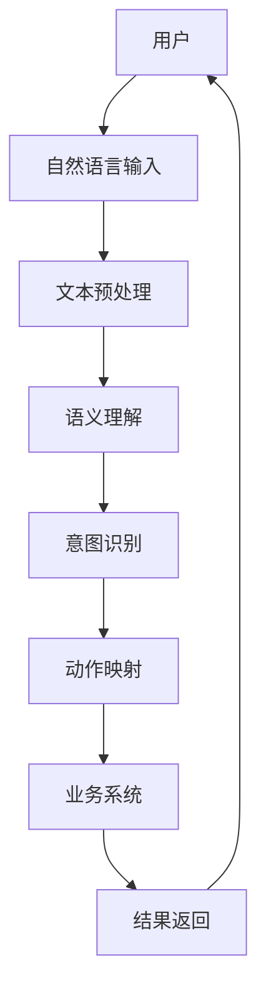

# 构建企业级自然语言接口：简化复杂业务系统操作

> 关键词：企业级自然语言接口、复杂业务系统、自然语言处理、人机交互、简化操作

> 摘要：本文围绕构建企业级自然语言接口展开，旨在探讨如何通过该接口简化复杂业务系统的操作。首先介绍了构建自然语言接口的背景信息，包括目的、预期读者、文档结构等。接着阐述了核心概念与联系，展示了相关的原理和架构。详细讲解了核心算法原理及具体操作步骤，结合Python代码进行说明。深入探讨了数学模型和公式，并举例分析。通过项目实战展示了代码实际案例和详细解释。介绍了自然语言接口在不同场景下的实际应用，推荐了相关的工具和资源。最后总结了未来发展趋势与挑战，提供了常见问题与解答以及扩展阅读和参考资料，为企业构建自然语言接口提供全面且深入的技术指导。

## 1. 背景介绍 
### 1.1 目的和范围
在当今数字化的时代，企业的业务系统日益复杂，涵盖了众多的功能和操作流程。这使得用户在使用这些系统时面临着较高的学习成本和操作难度，降低了工作效率。构建企业级自然语言接口的目的在于打破传统的命令式或图形化操作方式的限制，让用户能够使用自然语言与业务系统进行交互，从而简化操作流程，提高工作效率和用户体验。

本文章的范围主要聚焦于企业级自然语言接口的构建技术，包括核心概念、算法原理、数学模型、项目实战、实际应用场景等方面。同时，也会介绍相关的工具和资源，为企业在实际构建过程中提供全面的技术支持和参考。

### 1.2 预期读者
本文的预期读者主要包括企业的技术管理人员、软件架构师、程序员、人工智能开发者等。对于那些希望通过自然语言接口来优化企业业务系统操作的企业决策者和业务人员，本文也具有一定的参考价值。此外，对自然语言处理技术感兴趣的研究人员和学生也可以从本文中获取相关的知识和技术信息。

### 1.3 文档结构概述
本文共分为十个部分。第一部分为背景介绍，主要阐述构建企业级自然语言接口的目的、预期读者和文档结构。第二部分介绍核心概念与联系，包括自然语言接口的原理和架构。第三部分详细讲解核心算法原理及具体操作步骤，并通过Python代码进行说明。第四部分深入探讨数学模型和公式，并举例分析。第五部分是项目实战，展示代码实际案例和详细解释。第六部分介绍自然语言接口的实际应用场景。第七部分推荐相关的工具和资源。第八部分总结未来发展趋势与挑战。第九部分是附录，提供常见问题与解答。第十部分为扩展阅读和参考资料，方便读者进一步深入学习和研究。

### 1.4 术语表
#### 1.4.1 核心术语定义
- **企业级自然语言接口**：是一种允许用户使用自然语言与企业业务系统进行交互的接口，它能够理解用户的自然语言输入，并将其转化为系统能够执行的操作指令。
- **自然语言处理（NLP）**：是计算机科学与人工智能领域中的一个重要方向，主要研究如何让计算机理解、处理和生成人类语言。
- **人机交互（HCI）**：是研究人与计算机之间通过某种交互方式进行信息传递的一门学科，自然语言接口是人机交互的一种重要形式。
- **语义理解**：是自然语言处理中的一个关键任务，旨在理解文本的语义信息，包括词汇、句子和篇章的含义。
- **意图识别**：是指从用户的自然语言输入中识别出用户的意图，例如查询信息、执行操作等。

#### 1.4.2 相关概念解释
- **深度学习**：是一种基于人工神经网络的机器学习方法，在自然语言处理领域取得了显著的成果。深度学习模型可以自动从大量的数据中学习语言的特征和模式，从而实现对自然语言的理解和处理。
- **知识图谱**：是一种语义网络，用于表示实体之间的关系和知识。在自然语言接口中，知识图谱可以帮助系统更好地理解用户的查询意图，提供更准确的回答和操作建议。
- **对话管理**：是自然语言接口中的一个重要模块，用于管理用户与系统之间的对话流程。对话管理模块可以根据用户的输入和历史对话信息，决定系统的响应策略，确保对话的连贯性和逻辑性。

#### 1.4.3 缩略词列表
- **NLP**：Natural Language Processing（自然语言处理）
- **HCI**：Human - Computer Interaction（人机交互）
- **API**：Application Programming Interface（应用程序编程接口）
- **RNN**：Recurrent Neural Network（循环神经网络）
- **LSTM**：Long Short - Term Memory（长短期记忆网络）
- **GRU**：Gated Recurrent Unit（门控循环单元）
- **Transformer**：一种基于注意力机制的深度学习模型

## 2. 核心概念与联系 
### 核心概念原理
企业级自然语言接口的核心原理是将自然语言处理技术应用于企业业务系统的交互中。其主要包括以下几个关键步骤：

1. **自然语言输入**：用户使用自然语言表达自己的需求或指令，例如“查询上个月的销售数据”。
2. **文本预处理**：对用户输入的自然语言文本进行预处理，包括去除停用词、词法分析、词性标注等操作，以提高后续处理的效率和准确性。
3. **语义理解**：通过自然语言处理技术，对预处理后的文本进行语义分析，理解用户的意图和语义信息。这可能涉及到词汇语义、句法结构和篇章语义的分析。
4. **意图识别**：从语义理解的结果中识别出用户的意图，例如查询信息、执行操作、请求帮助等。
5. **动作映射**：将用户的意图映射到企业业务系统中的具体操作或功能，例如调用某个API接口来查询销售数据。
6. **系统执行**：系统根据动作映射的结果，执行相应的操作，并将执行结果返回给用户。

### 架构的文本示意图
```plaintext
用户 -> 自然语言输入 -> 文本预处理模块 -> 语义理解模块 -> 意图识别模块 -> 动作映射模块 -> 业务系统 -> 结果返回 -> 用户
```

### Mermaid流程图


## 3. 核心算法原理 & 具体操作步骤 
### 核心算法原理
在企业级自然语言接口中，常用的核心算法包括词嵌入算法、循环神经网络（RNN）及其变体（如LSTM、GRU）、Transformer等。下面以Transformer为例进行详细讲解。

Transformer是一种基于注意力机制的深度学习模型，它通过多头注意力机制能够捕捉输入序列中不同位置之间的依赖关系。Transformer主要由编码器和解码器组成，编码器用于对输入序列进行编码，解码器用于生成输出序列。

### 具体操作步骤
#### 步骤1：数据准备
首先需要准备用于训练的数据集，数据集应包含用户的自然语言输入和对应的意图标签或操作指令。将数据集划分为训练集、验证集和测试集。

#### 步骤2：文本预处理
对输入的文本进行预处理，包括分词、去除停用词、词法分析等操作。将文本转换为词向量序列，常用的词嵌入方法有Word2Vec、GloVe等。

#### 步骤3：模型构建
使用深度学习框架（如PyTorch或TensorFlow）构建Transformer模型。定义模型的输入层、编码器、解码器和输出层。

#### 步骤4：模型训练
使用训练集对模型进行训练，通过反向传播算法更新模型的参数，以最小化损失函数。在训练过程中，可以使用验证集进行模型的评估和调优。

#### 步骤5：模型评估
使用测试集对训练好的模型进行评估，计算模型的准确率、召回率、F1值等指标，评估模型的性能。

#### 步骤6：部署和应用
将训练好的模型部署到企业业务系统中，实现自然语言接口的功能。用户可以通过自然语言输入与系统进行交互，系统根据用户的输入进行相应的处理和操作。

### Python源代码实现
以下是一个使用PyTorch实现简单Transformer模型的示例代码：

```python
import torch
import torch.nn as nn
import torch.optim as optim

# 定义Transformer模型
class TransformerModel(nn.Module):
    def __init__(self, vocab_size, d_model, nhead, num_layers, max_seq_length):
        super(TransformerModel, self).__init__()
        self.embedding = nn.Embedding(vocab_size, d_model)
        self.positional_encoding = nn.Parameter(torch.zeros(1, max_seq_length, d_model))
        self.transformer_encoder = nn.TransformerEncoder(
            nn.TransformerEncoderLayer(d_model, nhead), num_layers
        )
        self.fc = nn.Linear(d_model, 1)  # 假设是二分类问题

    def forward(self, x):
        x = self.embedding(x)
        x += self.positional_encoding[:, :x.size(1), :]
        x = self.transformer_encoder(x)
        x = x.mean(dim=1)
        x = self.fc(x)
        return x

# 数据准备
vocab_size = 1000
d_model = 128
nhead = 4
num_layers = 2
max_seq_length = 50
model = TransformerModel(vocab_size, d_model, nhead, num_layers, max_seq_length)

# 定义损失函数和优化器
criterion = nn.BCEWithLogitsLoss()
optimizer = optim.Adam(model.parameters(), lr=0.001)

# 模拟训练数据
input_data = torch.randint(0, vocab_size, (10, max_seq_length))
target_data = torch.randint(0, 2, (10, 1)).float()

# 训练模型
for epoch in range(10):
    optimizer.zero_grad()
    output = model(input_data)
    loss = criterion(output, target_data)
    loss.backward()
    optimizer.step()
    print(f'Epoch {epoch + 1}, Loss: {loss.item()}')
```

## 4. 数学模型和公式 & 详细讲解 & 举例说明 
### 词嵌入
词嵌入是将文本中的单词转换为低维向量的过程。常用的词嵌入方法有Word2Vec和GloVe。以Word2Vec为例，其基于神经网络的原理，通过预测上下文单词来学习单词的向量表示。

Word2Vec有两种主要的模型架构：CBOW（Continuous Bag - of - Words）和Skip - gram。

#### CBOW模型
CBOW模型的目标是根据上下文单词预测中心单词。其数学模型可以表示为：

$$P(w_{t}|w_{t - c},\cdots,w_{t - 1},w_{t+1},\cdots,w_{t + c})=\frac{\exp(v_{w_{t}}'\cdot h)}{\sum_{w\in V}\exp(v_{w}'\cdot h)}$$

其中，$w_{t}$ 是中心单词，$w_{t - c},\cdots,w_{t - 1},w_{t+1},\cdots,w_{t + c}$ 是上下文单词，$c$ 是上下文窗口的大小，$V$ 是词汇表，$v_{w}$ 是单词 $w$ 的输入向量，$v_{w}'$ 是单词 $w$ 的输出向量，$h$ 是上下文单词向量的平均值。

#### Skip - gram模型
Skip - gram模型的目标是根据中心单词预测上下文单词。其数学模型可以表示为：

$$P(w_{O}|w_{I})=\frac{\exp(v_{w_{O}}'\cdot v_{w_{I}})}{\sum_{w\in V}\exp(v_{w}'\cdot v_{w_{I}})}$$

其中，$w_{I}$ 是中心单词，$w_{O}$ 是上下文单词。

### 注意力机制
注意力机制是Transformer模型的核心。多头注意力机制可以表示为：

$$\text{MultiHead}(Q, K, V)=\text{Concat}(\text{head}_{1},\cdots,\text{head}_{h})W^{O}$$

其中，$\text{head}_{i}=\text{Attention}(QW_{i}^{Q}, KW_{i}^{K}, VW_{i}^{V})$，$\text{Attention}(Q, K, V)=\text{softmax}(\frac{QK^{T}}{\sqrt{d_{k}}})V$

$Q$ 是查询矩阵，$K$ 是键矩阵，$V$ 是值矩阵，$W_{i}^{Q}$，$W_{i}^{K}$，$W_{i}^{V}$ 和 $W^{O}$ 是可学习的权重矩阵，$d_{k}$ 是键向量的维度。

### 举例说明
假设我们有一个句子 “The cat is on the mat”，使用Word2Vec将每个单词转换为向量。例如，“cat” 可能被转换为一个128维的向量 $\vec{v}_{\text{cat}}$。

在Transformer模型中，对于输入的单词向量序列，通过多头注意力机制计算每个位置的注意力权重。假设输入序列为 $[x_{1},x_{2},\cdots,x_{n}]$，计算查询矩阵 $Q$、键矩阵 $K$ 和值矩阵 $V$，然后根据注意力公式计算注意力权重，最后得到加权求和的输出。

## 5. 项目实战：代码实际案例和详细解释说明 
### 5.1  开发环境搭建
#### 安装Python
首先需要安装Python，建议使用Python 3.7及以上版本。可以从Python官方网站（https://www.python.org/downloads/）下载并安装。

#### 安装深度学习框架
本文使用PyTorch作为深度学习框架，可以根据自己的需求选择合适的版本进行安装。例如，使用以下命令安装CPU版本的PyTorch：

```sh
pip install torch torchvision
```

#### 安装自然语言处理库
安装一些常用的自然语言处理库，如NLTK、SpaCy等。可以使用以下命令进行安装：

```sh
pip install nltk spacy
```

### 5.2  源代码详细实现和代码解读
以下是一个简单的企业级自然语言接口的项目实战代码示例，用于实现简单的意图识别功能。

```python
import torch
import torch.nn as nn
import torch.optim as optim
from torch.utils.data import Dataset, DataLoader
import nltk
from nltk.tokenize import word_tokenize
import numpy as np
import pandas as pd
from sklearn.model_selection import train_test_split

# 数据预处理
nltk.download('punkt')

# 定义数据集类
class IntentDataset(Dataset):
    def __init__(self, texts, labels, vocab):
        self.texts = texts
        self.labels = labels
        self.vocab = vocab

    def __len__(self):
        return len(self.texts)

    def __getitem__(self, idx):
        text = self.texts[idx]
        label = self.labels[idx]
        tokens = word_tokenize(text.lower())
        input_ids = [self.vocab.get(token, 0) for token in tokens]
        return torch.tensor(input_ids), torch.tensor(label)

# 定义简单的神经网络模型
class IntentModel(nn.Module):
    def __init__(self, vocab_size, embedding_dim, hidden_dim, output_dim):
        super(IntentModel, self).__init__()
        self.embedding = nn.Embedding(vocab_size, embedding_dim)
        self.fc1 = nn.Linear(embedding_dim, hidden_dim)
        self.relu = nn.ReLU()
        self.fc2 = nn.Linear(hidden_dim, output_dim)

    def forward(self, x):
        x = self.embedding(x)
        x = x.mean(dim=1)
        x = self.fc1(x)
        x = self.relu(x)
        x = self.fc2(x)
        return x

# 数据加载和预处理
data = pd.read_csv('intent_data.csv')
texts = data['text'].tolist()
labels = data['label'].tolist()

# 构建词汇表
vocab = {}
for text in texts:
    tokens = word_tokenize(text.lower())
    for token in tokens:
        if token not in vocab:
            vocab[token] = len(vocab) + 1

# 划分训练集和测试集
train_texts, test_texts, train_labels, test_labels = train_test_split(texts, labels, test_size=0.2, random_state=42)

# 创建数据集和数据加载器
train_dataset = IntentDataset(train_texts, train_labels, vocab)
train_dataloader = DataLoader(train_dataset, batch_size=32, shuffle=True)

test_dataset = IntentDataset(test_texts, test_labels, vocab)
test_dataloader = DataLoader(test_dataset, batch_size=32, shuffle=False)

# 模型初始化
vocab_size = len(vocab) + 1
embedding_dim = 100
hidden_dim = 64
output_dim = len(set(labels))
model = IntentModel(vocab_size, embedding_dim, hidden_dim, output_dim)

# 定义损失函数和优化器
criterion = nn.CrossEntropyLoss()
optimizer = optim.Adam(model.parameters(), lr=0.001)

# 训练模型
num_epochs = 10
for epoch in range(num_epochs):
    model.train()
    for inputs, labels in train_dataloader:
        optimizer.zero_grad()
        outputs = model(inputs)
        loss = criterion(outputs, labels)
        loss.backward()
        optimizer.step()
    print(f'Epoch {epoch + 1}, Loss: {loss.item()}')

# 评估模型
model.eval()
correct = 0
total = 0
with torch.no_grad():
    for inputs, labels in test_dataloader:
        outputs = model(inputs)
        _, predicted = torch.max(outputs.data, 1)
        total += labels.size(0)
        correct += (predicted == labels).sum().item()

print(f'Accuracy: {100 * correct / total}%')
```

### 5.3  代码解读与分析
#### 数据预处理部分
- `nltk.download('punkt')`：下载NLTK的分词器数据。
- `IntentDataset` 类：自定义数据集类，用于将文本数据转换为模型可以处理的输入格式。
- 构建词汇表：遍历所有文本，将每个单词映射到一个唯一的整数ID。

#### 模型定义部分
- `IntentModel` 类：定义了一个简单的神经网络模型，包括嵌入层、全连接层和激活函数。

#### 训练和评估部分
- 使用 `CrossEntropyLoss` 作为损失函数，`Adam` 作为优化器。
- 训练模型：通过多个epoch的训练，不断更新模型的参数。
- 评估模型：在测试集上计算模型的准确率。

## 6. 实际应用场景 
### 客户服务
在企业的客户服务场景中，自然语言接口可以让客户使用自然语言描述问题和需求，系统自动识别客户的意图，并提供相应的解决方案或转接给人工客服。例如，客户可以说 “我想查询我的订单状态”，系统可以自动查询订单信息并返回给客户。

### 业务流程自动化
在企业的业务流程中，自然语言接口可以简化操作流程，提高工作效率。例如，员工可以使用自然语言下达指令，如 “生成上个月的销售报表”，系统可以自动调用相应的业务逻辑，生成销售报表。

### 智能助手
企业可以开发自己的智能助手，员工可以通过自然语言与智能助手进行交互，获取信息、执行任务等。例如，员工可以问 “今天有哪些重要会议”，智能助手可以查询日程安排并返回相关信息。

### 数据分析和决策支持
自然语言接口可以让业务人员使用自然语言进行数据分析和查询，而不需要编写复杂的SQL语句或使用专业的数据分析工具。例如，业务人员可以说 “分析过去一年各地区的销售业绩”，系统可以自动进行数据分析并生成可视化报表，为决策提供支持。

## 7. 工具和资源推荐
### 7.1 学习资源推荐
#### 7.1.1 书籍推荐
- 《自然语言处理入门》：作者何晗，本书适合初学者，系统地介绍了自然语言处理的基本概念、算法和技术。
- 《深度学习》：作者Ian Goodfellow、Yoshua Bengio和Aaron Courville，这本书是深度学习领域的经典著作，涵盖了深度学习的理论和实践。
- 《Python自然语言处理》：作者Steven Bird、Ewan Klein和Edward Loper，本书介绍了如何使用Python进行自然语言处理，包含了丰富的实例代码。

#### 7.1.2 在线课程
- Coursera上的 “Natural Language Processing Specialization”：由顶尖大学的教授授课，系统地介绍了自然语言处理的各个方面。
- edX上的 “Deep Learning for Natural Language Processing”：深入讲解了深度学习在自然语言处理中的应用。
- 哔哩哔哩上有许多自然语言处理的教学视频，适合初学者快速入门。

#### 7.1.3 技术博客和网站
- Medium：上面有很多关于自然语言处理和人工智能的技术文章，涵盖了最新的研究成果和实践经验。
- arXiv：是一个预印本平台，提供了大量的自然语言处理领域的研究论文。
- Hugging Face Blog：Hugging Face是自然语言处理领域的知名公司，其博客上有很多关于Transformer模型和预训练语言模型的技术文章。

### 7.2 开发工具框架推荐
#### 7.2.1 IDE和编辑器
- PyCharm：是一款专业的Python集成开发环境，提供了丰富的功能和插件，方便开发和调试自然语言处理项目。
- Visual Studio Code：是一款轻量级的代码编辑器，支持多种编程语言和插件，适合快速开发和调试。

#### 7.2.2 调试和性能分析工具
- TensorBoard：是TensorFlow的可视化工具，可以用于可视化训练过程中的损失函数、准确率等指标，帮助调试和优化模型。
- PyTorch Profiler：可以用于分析PyTorch模型的性能瓶颈，帮助优化模型的训练和推理速度。

#### 7.2.3 相关框架和库
- PyTorch：是一个开源的深度学习框架，提供了丰富的深度学习模型和工具，适合自然语言处理任务的开发。
- TensorFlow：是另一个广泛使用的深度学习框架，具有强大的分布式训练和部署能力。
- Transformers：是Hugging Face开发的一个自然语言处理库，提供了多种预训练的语言模型，如BERT、GPT等，可以方便地进行迁移学习。

### 7.3 相关论文著作推荐
#### 7.3.1 经典论文
- “Attention Is All You Need”：提出了Transformer模型，是自然语言处理领域的经典论文。
- “Efficient Estimation of Word Representations in Vector Space”：介绍了Word2Vec模型，是词嵌入领域的重要论文。
- “GloVe: Global Vectors for Word Representation”：提出了GloVe词嵌入方法，在自然语言处理中得到了广泛应用。

#### 7.3.2 最新研究成果
- 关注ACL（Association for Computational Linguistics）、EMNLP（Conference on Empirical Methods in Natural Language Processing）等自然语言处理领域的顶级会议，了解最新的研究成果。
- 在arXiv上搜索相关的预印本论文，获取最新的研究动态。

#### 7.3.3 应用案例分析
- 一些企业和研究机构会发布自然语言处理在实际应用中的案例分析，例如Google、Microsoft等公司的技术博客，从中可以学习到自然语言处理在不同场景下的应用经验和技术方案。

## 8. 总结：未来发展趋势与挑战
### 未来发展趋势
- **多模态融合**：未来的自然语言接口将不仅仅局限于文本输入，还将融合语音、图像、视频等多种模态的信息，提供更加丰富和自然的交互方式。
- **个性化交互**：根据用户的历史交互记录和偏好，为用户提供个性化的服务和推荐，提高用户体验。
- **与知识图谱的深度融合**：通过与知识图谱的深度融合，自然语言接口可以更好地理解用户的查询意图，提供更准确和全面的回答。
- **低资源语言支持**：随着全球化的发展，对低资源语言的自然语言处理需求将不断增加，未来的自然语言接口将支持更多的语言。

### 挑战
- **语义理解的准确性**：自然语言具有丰富的语义和歧义性，如何提高语义理解的准确性是自然语言接口面临的一个重要挑战。
- **数据隐私和安全**：企业级自然语言接口需要处理大量的用户数据，如何保障数据的隐私和安全是一个关键问题。
- **可解释性**：深度学习模型在自然语言处理中取得了很好的效果，但这些模型往往缺乏可解释性，如何提高模型的可解释性是一个亟待解决的问题。
- **跨领域应用**：不同的业务领域具有不同的语言特点和业务逻辑，如何实现自然语言接口在跨领域的应用是一个挑战。

## 9. 附录：常见问题与解答
### 问题1：自然语言接口的准确率如何提高？
解答：可以通过以下方法提高自然语言接口的准确率：
- 增加训练数据的数量和质量，提高模型的泛化能力。
- 选择合适的模型架构和算法，例如使用Transformer等先进的模型。
- 进行数据增强和模型调优，如调整超参数、使用正则化方法等。

### 问题2：如何处理自然语言中的歧义性？
解答：可以采用以下方法处理自然语言中的歧义性：
- 结合上下文信息进行分析，通过对话管理模块记录历史对话信息，帮助消除歧义。
- 使用知识图谱，利用知识图谱中的知识和关系来辅助理解文本的语义。
- 采用多轮对话的方式，通过进一步询问用户来明确用户的意图。

### 问题3：自然语言接口的性能如何优化？
解答：可以从以下几个方面优化自然语言接口的性能：
- 优化模型的架构和参数，减少模型的计算量。
- 使用硬件加速，如GPU、TPU等。
- 采用异步处理和缓存技术，提高系统的响应速度。

### 问题4：如何保障自然语言接口的数据隐私和安全？
解答：可以采取以下措施保障数据隐私和安全：
- 对用户数据进行加密处理，防止数据泄露。
- 遵循相关的法律法规和行业标准，如GDPR等。
- 对系统进行安全审计和漏洞修复，防止黑客攻击。

## 10. 扩展阅读 & 参考资料
### 扩展阅读
- 《人工智能时代的语言与智能》：进一步探讨了自然语言处理在人工智能时代的发展和应用。
- 《智能时代》：介绍了人工智能对各个领域的影响和变革，包括自然语言接口在企业中的应用。

### 参考资料
- 相关的学术论文和研究报告，如ACL、EMNLP等会议的论文。
- 开源项目和代码库，如GitHub上的自然语言处理相关项目。
- 官方文档和技术手册，如PyTorch、TensorFlow、Transformers等框架的官方文档。

作者：AI天才研究院/AI Genius Institute & 禅与计算机程序设计艺术 /Zen And The Art of Computer Programming