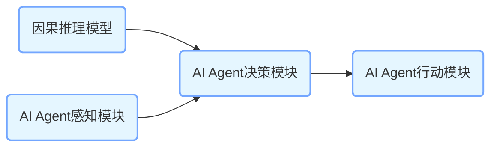

# 构建具有因果推理能力的AI Agent

> 关键词：因果推理、AI Agent、因果模型、算法原理、项目实战

> 摘要：本文围绕构建具有因果推理能力的AI Agent展开，详细介绍了因果推理和AI Agent的核心概念及其联系，阐述了实现因果推理的核心算法原理和具体操作步骤，用数学模型和公式对因果推理进行了深入讲解。通过项目实战展示了如何开发具有因果推理能力的AI Agent，探讨了其实际应用场景。同时，推荐了相关的学习资源、开发工具框架以及论文著作。最后对具有因果推理能力的AI Agent的未来发展趋势与挑战进行了总结，并提供了常见问题解答和扩展阅读参考资料，旨在为开发者和研究者提供全面且深入的技术指导。

## 1. 背景介绍 
### 1.1 目的和范围
本文章的目的在于全面且深入地探讨如何构建具有因果推理能力的AI Agent。在当今人工智能快速发展的时代，传统的AI系统往往只能处理相关性，而缺乏对因果关系的理解。具有因果推理能力的AI Agent能够更好地理解事件之间的因果联系，做出更具解释性和可靠性的决策。我们将涵盖因果推理的基本概念、实现因果推理的核心算法、数学模型，以及通过项目实战展示如何在实际开发中构建这样的AI Agent。同时，会探讨其在不同领域的应用场景，并提供相关的学习资源和工具推荐。

### 1.2 预期读者
本文预期读者包括人工智能领域的开发者、研究人员，以及对因果推理和AI Agent感兴趣的技术爱好者。对于初学者，文章会从基础概念入手，逐步引导读者理解因果推理和AI Agent的相关知识；对于有一定经验的开发者和研究人员，文章会深入探讨核心算法原理、数学模型和实际应用案例，为他们的研究和开发工作提供有价值的参考。

### 1.3 文档结构概述
本文将按照以下结构进行组织：首先介绍因果推理和AI Agent的核心概念及其联系，通过文本示意图和Mermaid流程图进行直观展示；接着详细阐述实现因果推理的核心算法原理，并给出具体的Python操作步骤；然后用数学模型和公式对因果推理进行深入讲解，并举例说明；通过项目实战，包括开发环境搭建、源代码实现和代码解读，展示如何构建具有因果推理能力的AI Agent；探讨其实际应用场景；推荐相关的学习资源、开发工具框架和论文著作；最后总结具有因果推理能力的AI Agent的未来发展趋势与挑战，提供常见问题解答和扩展阅读参考资料。

### 1.4 术语表
#### 1.4.1 核心术语定义
- **因果推理（Causal Reasoning）**：是指从观察到的数据中推断出变量之间的因果关系，而不仅仅是相关性。它试图回答“如果改变某个变量，会对其他变量产生什么影响”的问题。
- **AI Agent（人工智能智能体）**：是一种能够感知环境、进行决策并采取行动以实现特定目标的软件或硬件实体。具有因果推理能力的AI Agent能够利用因果关系来做出更明智的决策。
- **因果模型（Causal Model）**：是一种用于表示变量之间因果关系的数学模型，常见的有结构因果模型（Structural Causal Model，SCM）。

#### 1.4.2 相关概念解释
- **相关性（Correlation）**：表示两个或多个变量之间的统计关联程度，但相关性并不意味着因果关系。例如，冰淇淋销量和游泳溺水人数可能存在正相关，但它们之间并没有因果联系，而是都受到气温的影响。
- **干预（Intervention）**：在因果推理中，干预是指主动改变某个变量的值，以观察对其他变量的影响。与观察不同，干预可以帮助我们确定因果关系。

#### 1.4.3 缩略词列表
- **SCM**：Structural Causal Model，结构因果模型
- **DAG**：Directed Acyclic Graph，有向无环图

## 2. 核心概念与联系 
### 核心概念原理
#### 因果推理
因果推理的核心目标是从数据中识别出变量之间的因果关系。传统的机器学习方法主要关注数据的相关性，而因果推理旨在揭示变量之间的因果机制。例如，在医学领域，我们不仅想知道某种药物和疾病康复之间的相关性，更想知道使用该药物是否真的能导致疾病康复，即确定药物和康复之间的因果关系。

结构因果模型（SCM）是因果推理中常用的模型，它由一组变量和描述这些变量之间因果关系的函数组成。一个SCM可以用一个有向无环图（DAG）来表示，其中节点表示变量，边表示因果关系。例如，在一个简单的SCM中，变量 $X$ 可能是“吸烟”，变量 $Y$ 可能是“肺癌”，如果存在从 $X$ 到 $Y$ 的边，就表示吸烟可能是导致肺癌的原因。

#### AI Agent
AI Agent是一个能够感知环境、进行决策并采取行动的实体。它通常包括三个主要部分：感知模块、决策模块和行动模块。感知模块负责收集环境信息，决策模块根据感知到的信息和预设的目标进行决策，行动模块则执行决策结果。具有因果推理能力的AI Agent在决策模块中引入了因果推理机制，能够根据因果关系做出更合理的决策。

### 核心概念联系
因果推理和AI Agent的联系在于，因果推理为AI Agent提供了更强大的决策能力。传统的AI Agent在决策时可能只考虑数据的相关性，而具有因果推理能力的AI Agent能够考虑变量之间的因果关系，从而做出更具解释性和可靠性的决策。例如，在自动驾驶场景中，传统的AI Agent可能根据车辆的速度和前方障碍物的距离之间的相关性来做出刹车决策，而具有因果推理能力的AI Agent能够分析速度、刹车系统状态、道路条件等变量之间的因果关系，从而更准确地决定何时刹车以及刹车的力度。

### 文本示意图
```plaintext
            +------------------+
            |   因果推理模型   |
            |  (如SCM, DAG)    |
            +------------------+
                   |
                   |  提供因果关系信息
                   v
+---------------------+       +------------------+
|   AI Agent决策模块   |  ----> |  AI Agent行动模块 |
| (结合因果推理决策)  |       +------------------+
+---------------------+
           ^
           |  感知环境信息
           |
+------------------+
|  AI Agent感知模块 |
+------------------+
```

### Mermaid流程图


## 3. 核心算法原理 & 具体操作步骤 
### 核心算法原理
在构建具有因果推理能力的AI Agent时，一个常用的算法是基于结构因果模型（SCM）的因果推理算法。下面我们将详细介绍这个算法的原理。

#### 结构因果模型（SCM）
一个SCM由三个主要部分组成：
- **内生变量（Endogenous Variables）**：这些变量的值由模型中的其他变量决定。
- **外生变量（Exogenous Variables）**：这些变量的值由模型外部的因素决定。
- **结构方程（Structural Equations）**：描述内生变量如何依赖于其他变量（包括内生变量和外生变量）。

例如，考虑一个简单的SCM，其中有两个内生变量 $X$ 和 $Y$，一个外生变量 $U$。结构方程可以表示为：
$X = f_X(U)$
$Y = f_Y(X, U)$

其中 $f_X$ 和 $f_Y$ 是一些函数。

#### 因果推理算法步骤
1. **因果图构建**：根据领域知识或数据挖掘技术，构建一个有向无环图（DAG）来表示变量之间的因果关系。
2. **结构方程估计**：使用数据来估计结构方程中的参数。
3. **干预分析**：通过对某些变量进行干预，预测其他变量的变化。

### 具体操作步骤（Python实现）
下面是一个简单的Python示例，展示如何使用`pymc3`库进行因果推理。假设我们有一个简单的因果关系：$X$ 影响 $Y$，并且我们有一些观测数据。

```python
import numpy as np
import pymc3 as pm
import arviz as az

# 生成一些观测数据
np.random.seed(123)
n_samples = 100
X = np.random.normal(0, 1, n_samples)
Y = 2 * X + np.random.normal(0, 1, n_samples)

# 构建因果模型
with pm.Model() as causal_model:
    # 定义先验分布
    beta = pm.Normal('beta', mu=0, sd=10)
    sigma = pm.HalfNormal('sigma', sd=1)
    
    # 定义似然函数
    mu = beta * X
    Y_obs = pm.Normal('Y_obs', mu=mu, sd=sigma, observed=Y)
    
    # 采样
    trace = pm.sample(2000, tune=1000, cores=2)

# 查看结果
az.plot_trace(trace)
az.summary(trace)
```

### 代码解释
1. **数据生成**：我们生成了一些观测数据，其中 $Y$ 是 $X$ 的线性函数加上一些噪声。
2. **模型构建**：使用`pymc3`库构建一个因果模型。我们定义了先验分布（`beta`和`sigma`），并根据结构方程 $Y = \beta X + \epsilon$ 定义了似然函数。
3. **采样**：使用`pm.sample`函数进行采样，得到后验分布。
4. **结果查看**：使用`arviz`库查看采样结果，包括绘制跟踪图和总结统计信息。

## 4. 数学模型和公式 & 详细讲解 & 举例说明 
### 结构因果模型（SCM）的数学表示
一个结构因果模型可以用一个四元组 $\langle \mathbf{U}, \mathbf{V}, \mathbf{F}, P(\mathbf{U}) \rangle$ 来表示，其中：
- $\mathbf{U}$ 是外生变量的集合。
- $\mathbf{V}$ 是内生变量的集合。
- $\mathbf{F}$ 是一组结构方程，每个方程描述一个内生变量如何依赖于其他变量。
- $P(\mathbf{U})$ 是外生变量的概率分布。

### 因果效应的估计
在因果推理中，我们通常关心的是干预某个变量对其他变量的影响。一个常用的因果效应度量是平均因果效应（Average Causal Effect，ACE）。

假设我们有两个变量 $X$ 和 $Y$，我们想估计干预 $X$ 对 $Y$ 的影响。ACE 可以定义为：
$$ACE = E[Y|do(X = 1)] - E[Y|do(X = 0)]$$

其中 $do(X = x)$ 表示对变量 $X$ 进行干预，将其值设置为 $x$。

### 举例说明
考虑一个简单的医学研究，我们想知道某种药物（$X$）对疾病康复（$Y$）的影响。我们有以下观测数据：

| 药物使用（$X$） | 疾病康复（$Y$） |
| --- | --- |
| 0 | 0 |
| 0 | 1 |
| 1 | 1 |
| 1 | 1 |

为了估计 ACE，我们可以使用后门调整公式。假设存在一个混杂变量 $Z$（例如年龄），后门调整公式可以表示为：
$$E[Y|do(X = x)] = \sum_{z} E[Y|X = x, Z = z] P(Z = z)$$

假设我们已经估计出了条件期望 $E[Y|X = x, Z = z]$ 和概率分布 $P(Z = z)$，我们可以计算出 $E[Y|do(X = 1)]$ 和 $E[Y|do(X = 0)]$，然后计算 ACE。

```python
# 假设我们已经估计出了条件期望和概率分布
E_Y_X1_Z = np.array([0.2, 0.8])  # E[Y|X = 1, Z = z]
E_Y_X0_Z = np.array([0.1, 0.3])  # E[Y|X = 0, Z = z]
P_Z = np.array([0.6, 0.4])  # P(Z = z)

# 计算 E[Y|do(X = 1)] 和 E[Y|do(X = 0)]
E_Y_doX1 = np.sum(E_Y_X1_Z * P_Z)
E_Y_doX0 = np.sum(E_Y_X0_Z * P_Z)

# 计算 ACE
ACE = E_Y_doX1 - E_Y_doX0
print("Average Causal Effect (ACE):", ACE)
```

在这个例子中，我们通过后门调整公式估计了药物对疾病康复的平均因果效应。

## 5. 项目实战：代码实际案例和详细解释说明 
### 5.1  开发环境搭建
#### 操作系统
我们可以选择常见的操作系统，如Windows、Linux（如Ubuntu）或macOS。这里以Ubuntu 20.04为例进行说明。

#### Python环境
首先，确保你已经安装了Python 3.7或更高版本。可以使用以下命令检查Python版本：
```bash
python3 --version
```

如果没有安装Python，可以使用以下命令进行安装：
```bash
sudo apt update
sudo apt install python3 python3-pip
```

#### 安装必要的库
我们需要安装一些Python库，包括`pymc3`、`arviz`、`numpy`等。可以使用以下命令进行安装：
```bash
pip install pymc3 arviz numpy
```

### 5.2  源代码详细实现和代码解读
#### 项目背景
假设我们要构建一个具有因果推理能力的AI Agent来帮助医生决定是否给患者使用某种药物。我们有一些患者的数据，包括患者的年龄、病情严重程度、是否使用药物以及是否康复。

#### 源代码实现
```python
import numpy as np
import pymc3 as pm
import arviz as az

# 生成一些模拟数据
np.random.seed(123)
n_patients = 200
age = np.random.normal(50, 10, n_patients)
severity = np.random.normal(5, 2, n_patients)
drug_used = np.random.binomial(1, 0.5, n_patients)
recovery = np.random.binomial(1, 0.8 * drug_used + 0.1 * severity - 0.01 * age, n_patients)

# 构建因果模型
with pm.Model() as drug_model:
    # 定义先验分布
    beta_age = pm.Normal('beta_age', mu=0, sd=10)
    beta_severity = pm.Normal('beta_severity', mu=0, sd=10)
    beta_drug = pm.Normal('beta_drug', mu=0, sd=10)
    sigma = pm.HalfNormal('sigma', sd=1)
    
    # 定义线性组合
    mu = beta_age * age + beta_severity * severity + beta_drug * drug_used
    
    # 定义似然函数
    recovery_obs = pm.Bernoulli('recovery_obs', logit_p=mu, observed=recovery)
    
    # 采样
    trace = pm.sample(2000, tune=1000, cores=2)

# 查看结果
az.plot_trace(trace)
az.summary(trace)

# 进行干预分析
with drug_model:
    # 假设所有患者都使用药物
    drug_used_all = np.ones(n_patients)
    mu_all_drug = beta_age * age + beta_severity * severity + beta_drug * drug_used_all
    recovery_all_drug = pm.Bernoulli('recovery_all_drug', logit_p=mu_all_drug)
    
    # 假设所有患者都不使用药物
    drug_used_none = np.zeros(n_patients)
    mu_none_drug = beta_age * age + beta_severity * severity + beta_drug * drug_used_none
    recovery_none_drug = pm.Bernoulli('recovery_none_drug', logit_p=mu_none_drug)
    
    # 采样干预结果
    trace_intervention = pm.sample_posterior_predictive(trace, samples=1000, var_names=['recovery_all_drug', 'recovery_none_drug'])

# 计算平均因果效应
recovery_all_drug_mean = np.mean(trace_intervention['recovery_all_drug'], axis=0)
recovery_none_drug_mean = np.mean(trace_intervention['recovery_none_drug'], axis=0)
ace = np.mean(recovery_all_drug_mean - recovery_none_drug_mean)
print("Average Causal Effect (ACE):", ace)
```

#### 代码解读
1. **数据生成**：我们生成了一些模拟的患者数据，包括年龄、病情严重程度、是否使用药物和是否康复。
2. **模型构建**：使用`pymc3`库构建一个因果模型。我们定义了先验分布（`beta_age`、`beta_severity`、`beta_drug`和`sigma`），并根据线性组合 $\mu = \beta_{age} \times age + \beta_{severity} \times severity + \beta_{drug} \times drug\_used$ 定义了似然函数。
3. **采样**：使用`pm.sample`函数进行采样，得到后验分布。
4. **结果查看**：使用`arviz`库查看采样结果，包括绘制跟踪图和总结统计信息。
5. **干预分析**：我们进行了干预分析，分别假设所有患者都使用药物和所有患者都不使用药物，然后采样干预结果。
6. **计算平均因果效应**：根据干预结果计算平均因果效应。

### 5.3  代码解读与分析
#### 模型假设
在这个项目中，我们假设患者的康复情况可以用一个线性组合来表示，即 $logit(P(recovery)) = \beta_{age} \times age + \beta_{severity} \times severity + \beta_{drug} \times drug\_used$。这个假设可能并不完全符合实际情况，但在一定程度上可以简化问题。

#### 因果效应估计
通过干预分析和计算平均因果效应，我们可以估计药物对患者康复的影响。如果ACE的值为正，说明使用药物对患者康复有积极的影响；如果ACE的值为负，说明使用药物对患者康复有消极的影响。

#### 局限性
这个项目存在一些局限性。例如，我们使用的是模拟数据，可能与实际情况存在偏差；我们的模型假设比较简单，可能无法准确地描述复杂的因果关系。在实际应用中，我们需要使用真实的数据，并根据具体情况选择更合适的模型。

## 6. 实际应用场景 
### 医疗领域
在医疗领域，具有因果推理能力的AI Agent可以帮助医生做出更合理的治疗决策。例如，医生可以使用AI Agent分析患者的基因数据、临床症状、治疗历史等信息，推断不同治疗方案与治疗效果之间的因果关系，从而选择最适合患者的治疗方案。此外，AI Agent还可以用于药物研发，通过分析大量的临床试验数据，找出药物的作用机制和潜在的副作用。

### 金融领域
在金融领域，AI Agent可以用于风险评估和投资决策。例如，通过分析市场数据、宏观经济指标、企业财务报表等信息，AI Agent可以推断不同因素与金融风险之间的因果关系，帮助投资者制定更合理的投资策略。此外，AI Agent还可以用于信用评估，通过分析借款人的信用历史、收入情况、负债情况等信息，评估借款人的违约风险。

### 交通领域
在交通领域，AI Agent可以用于交通流量控制和自动驾驶。例如，通过分析交通传感器数据、天气数据、时间信息等，AI Agent可以推断不同因素与交通流量之间的因果关系，从而优化交通信号控制策略，减少交通拥堵。在自动驾驶中，AI Agent可以根据周围环境信息和交通规则，推断不同驾驶行为与安全风险之间的因果关系，做出更安全、合理的驾驶决策。

### 教育领域
在教育领域，AI Agent可以用于个性化学习和教学评估。例如，通过分析学生的学习行为数据、成绩数据、兴趣爱好等信息，AI Agent可以推断不同教学方法与学习效果之间的因果关系，为学生提供个性化的学习建议。此外，AI Agent还可以用于教学评估，通过分析教师的教学行为数据和学生的学习成果，评估教师的教学质量，为教师提供改进建议。

## 7. 工具和资源推荐
### 7.1 学习资源推荐
#### 7.1.1 书籍推荐
- 《Causal Inference in Statistics: A Primer》：这本书由Judea Pearl、Madelyn Glymour和Nicholas P. Jewell合著，是一本入门级的因果推理书籍，介绍了因果推理的基本概念、方法和应用。
- 《Elements of Causal Inference: Foundations and Learning Algorithms》：这本书由Jonas Peters、Dominik Janzing和Bernhard Schölkopf合著，深入介绍了因果推理的理论和算法，适合有一定数学基础的读者。
- 《Artificial Intelligence: A Modern Approach》：这本书由Stuart Russell和Peter Norvig合著，是一本经典的人工智能教材，其中包含了关于AI Agent和因果推理的章节。

#### 7.1.2 在线课程
- Coursera上的“Causal Graphical Models”课程：该课程由Judea Pearl的学生授课，介绍了因果图模型的基本概念和应用。
- edX上的“Probability-The Science of Uncertainty and Data”课程：该课程涵盖了概率论和统计学的基础知识，对于理解因果推理非常有帮助。
- Udemy上的“Artificial Intelligence A-Z™: Learn How To Build An AI”课程：该课程介绍了人工智能的基本概念和应用，包括AI Agent的构建。

#### 7.1.3 技术博客和网站
- Causal Inference Initiative（CII）网站：该网站提供了因果推理领域的最新研究成果、论文和资源。
- Towards Data Science：这是一个数据科学和人工智能领域的技术博客，经常发布关于因果推理和AI Agent的文章。
- Medium上的“Causal AI”专栏：该专栏专注于因果人工智能的研究和应用，分享了许多有价值的文章和案例。

### 7.2 开发工具框架推荐
#### 7.2.1 IDE和编辑器
- PyCharm：是一款专业的Python集成开发环境，提供了丰富的代码编辑、调试和项目管理功能。
- Jupyter Notebook：是一个交互式的开发环境，适合进行数据分析和模型开发，支持Python、R等多种编程语言。
- Visual Studio Code：是一款轻量级的代码编辑器，支持多种编程语言和插件，具有强大的代码编辑和调试功能。

#### 7.2.2 调试和性能分析工具
- PDB：是Python自带的调试工具，可以帮助开发者定位代码中的错误。
- cProfile：是Python的性能分析工具，可以分析代码的运行时间和内存使用情况。
- TensorBoard：是TensorFlow的可视化工具，可以用于可视化模型的训练过程和性能指标。

#### 7.2.3 相关框架和库
- `pymc3`：是一个Python库，用于贝叶斯统计建模和概率编程，支持因果推理模型的构建和采样。
- `DoWhy`：是一个Python库，专门用于因果推理，提供了一系列的因果推理方法和工具。
- `EconML`：是一个Python库，用于估计因果效应和进行政策评估，结合了机器学习和经济学的方法。

### 7.3 相关论文著作推荐
#### 7.3.1 经典论文
- “Causal diagrams for empirical research” by Judea Pearl：这篇论文介绍了因果图模型的基本概念和应用，是因果推理领域的经典之作。
- “The central role of the propensity score in observational studies for causal effects” by Paul R. Rosenbaum and Donald B. Rubin：这篇论文介绍了倾向得分在因果效应估计中的应用，是因果推理领域的重要论文。
- “Estimating causal effects of treatments in randomized and nonrandomized studies” by Donald B. Rubin：这篇论文介绍了潜在结果框架和因果效应估计的方法，是因果推理领域的经典论文。

#### 7.3.2 最新研究成果
- “Causal Representation Learning” by Bernhard Schölkopf et al.：这篇论文探讨了因果表示学习的问题，提出了一种新的因果推理方法。
- “Discovering causal signals in images” by Yoshua Bengio et al.：这篇论文研究了如何从图像数据中发现因果信号，是因果推理在计算机视觉领域的最新研究成果。
- “Causal inference for reinforcement learning” by Nan Jiang and Alekh Agarwal：这篇论文研究了因果推理在强化学习中的应用，提出了一种新的强化学习算法。

#### 7.3.3 应用案例分析
- “Causal inference in healthcare: A review” by S. T. M. van der Pas et al.：这篇论文综述了因果推理在医疗领域的应用案例，包括药物疗效评估、疾病预测等。
- “Causal inference in finance: A survey” by P. R. Hahn et al.：这篇论文综述了因果推理在金融领域的应用案例，包括风险评估、投资决策等。
- “Causal inference in transportation: A review” by M. H. Habib et al.：这篇论文综述了因果推理在交通领域的应用案例，包括交通流量控制、自动驾驶等。

## 8. 总结：未来发展趋势与挑战
### 未来发展趋势
#### 与深度学习的融合
未来，具有因果推理能力的AI Agent将与深度学习技术更加紧密地融合。深度学习在处理大规模数据和复杂模式方面具有强大的能力，而因果推理可以为深度学习模型提供更具解释性和可靠性的决策依据。例如，在图像识别和自然语言处理领域，将因果推理引入深度学习模型可以帮助模型更好地理解数据背后的因果关系，提高模型的性能和可解释性。

#### 跨领域应用拓展
随着因果推理技术的不断发展，具有因果推理能力的AI Agent将在更多领域得到应用。除了医疗、金融、交通和教育领域，还将在环境科学、社会科学、工业制造等领域发挥重要作用。例如，在环境科学中，AI Agent可以分析环境因素与生态系统变化之间的因果关系，为环境保护和可持续发展提供决策支持。

#### 因果表示学习的发展
因果表示学习是因果推理领域的一个新兴研究方向，旨在从数据中学习到能够反映因果关系的表示。未来，因果表示学习将得到更深入的研究和发展，为构建具有因果推理能力的AI Agent提供更有效的方法和技术。

### 挑战
#### 数据质量和可用性
因果推理需要大量高质量的数据来估计因果效应和构建因果模型。然而，在实际应用中，数据往往存在噪声、缺失值和偏差等问题，这会影响因果推理的准确性和可靠性。此外，一些领域的数据可能受到隐私和安全等因素的限制，难以获取和使用。

#### 模型复杂性和可解释性
构建具有因果推理能力的AI Agent通常需要使用复杂的模型和算法，这会增加模型的复杂性和计算成本。同时，复杂的模型往往缺乏可解释性，难以理解和解释模型的决策过程和结果。在实际应用中，需要在模型的准确性和可解释性之间找到平衡。

#### 因果关系的识别和验证
在实际应用中，识别和验证变量之间的因果关系是一个具有挑战性的问题。因果关系往往受到多种因素的影响，而且有些因果关系可能是隐藏的或间接的。此外，因果关系的验证需要进行严格的实验和分析，这在一些情况下是难以实现的。

## 9. 附录：常见问题与解答
### 问题1：因果推理和相关性分析有什么区别？
相关性分析主要关注变量之间的统计关联程度，它只能告诉我们两个变量是否同时变化，但不能确定它们之间是否存在因果关系。例如，冰淇淋销量和游泳溺水人数可能存在正相关，但它们之间并没有因果联系，而是都受到气温的影响。因果推理则试图从数据中识别出变量之间的因果关系，回答“如果改变某个变量，会对其他变量产生什么影响”的问题。

### 问题2：如何判断一个因果模型的好坏？
判断一个因果模型的好坏可以从以下几个方面考虑：
- **拟合优度**：模型是否能够很好地拟合观测数据。可以使用一些统计指标，如均方误差（MSE）、决定系数（$R^2$）等来评估模型的拟合优度。
- **因果效应估计的准确性**：模型估计的因果效应是否与实际情况相符。可以通过进行实验或比较不同模型的估计结果来评估因果效应估计的准确性。
- **可解释性**：模型是否具有可解释性，即是否能够清晰地解释变量之间的因果关系。一个好的因果模型应该能够提供合理的解释，帮助人们理解因果机制。
- **稳定性**：模型在不同数据集或不同环境下的表现是否稳定。一个好的因果模型应该具有较好的稳定性，能够在不同情况下都给出可靠的结果。

### 问题3：在实际应用中，如何处理因果推理中的混杂因素？
混杂因素是指同时影响原因变量和结果变量的因素，它们会干扰因果效应的估计。在实际应用中，可以采用以下方法处理混杂因素：
- **随机化实验**：通过随机分配实验对象到不同的处理组，可以平衡混杂因素的影响，从而更准确地估计因果效应。
- **匹配方法**：根据混杂因素的值，将处理组和对照组的实验对象进行匹配，使得两组在混杂因素上尽可能相似，然后再比较两组的结果。
- **倾向得分匹配**：通过计算每个实验对象接受处理的概率（倾向得分），然后根据倾向得分进行匹配，以控制混杂因素的影响。
- **调整方法**：在因果模型中加入混杂因素作为协变量，通过回归分析等方法调整混杂因素的影响。

### 问题4：具有因果推理能力的AI Agent需要具备哪些技术和知识？
具有因果推理能力的AI Agent需要具备以下技术和知识：
- **因果推理理论**：了解因果推理的基本概念、方法和模型，如结构因果模型、因果图模型、潜在结果框架等。
- **机器学习和统计学**：掌握机器学习和统计学的基础知识，如回归分析、分类算法、贝叶斯统计等，用于数据处理、模型构建和因果效应估计。
- **编程技能**：具备一定的编程技能，如Python，用于实现因果推理算法和构建AI Agent。
- **领域知识**：了解具体应用领域的知识，如医疗、金融、交通等，以便更好地理解问题和构建合适的因果模型。

## 10. 扩展阅读 & 参考资料
### 扩展阅读
- 《The Book of Why: The New Science of Cause and Effect》 by Judea Pearl and Dana Mackenzie：这本书由因果推理领域的权威专家Judea Pearl所著，以通俗易懂的语言介绍了因果推理的历史、理论和应用，适合广大读者阅读。
- 《Causal Inference: What If》 by Miguel A. Hernán and James M. Robins：这本书详细介绍了因果推理的方法和技术，包括潜在结果框架、因果图模型、倾向得分匹配等，是一本非常实用的因果推理教材。
- 《Reinforcement Learning: An Introduction》 by Richard S. Sutton and Andrew G. Barto：这本书介绍了强化学习的基本概念、算法和应用，其中涉及到因果推理在强化学习中的应用，对于理解具有因果推理能力的AI Agent在强化学习中的应用有很大帮助。

### 参考资料
- Pearl, J. (2009). Causality: Models, reasoning, and inference. Cambridge University Press.
- Rubin, D. B. (1974). Estimating causal effects of treatments in randomized and nonrandomized studies. Journal of Educational Psychology, 66(5), 688-701.
- Rosenbaum, P. R., & Rubin, D. B. (1983). The central role of the propensity score in observational studies for causal effects. Biometrika, 70(1), 41-55.

作者：AI天才研究院/AI Genius Institute & 禅与计算机程序设计艺术 /Zen And The Art of Computer Programming