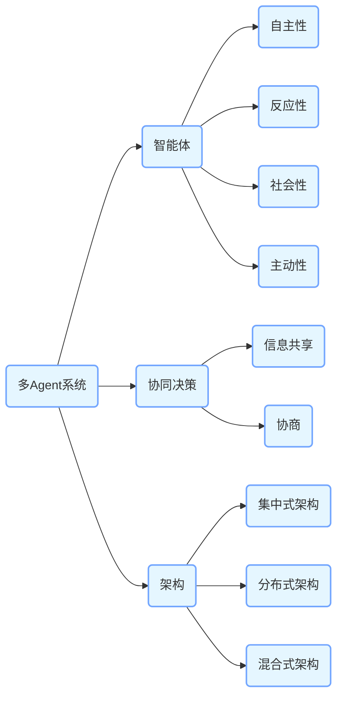

# 构建具有多Agent协同决策能力的系统

> 关键词：多Agent系统、协同决策、智能体交互、分布式决策、决策算法

> 摘要：本文聚焦于构建具有多Agent协同决策能力的系统。详细阐述了多Agent系统的核心概念、协同决策的原理与架构，深入分析了相关的核心算法原理并给出Python源代码示例。通过数学模型和公式对决策过程进行精确描述，结合实际项目案例展示系统的开发与实现。同时探讨了多Agent协同决策系统在不同领域的实际应用场景，推荐了学习资源、开发工具和相关论文著作。最后总结了该领域的未来发展趋势与挑战，并提供常见问题解答和扩展阅读参考资料。

## 1. 背景介绍 
### 1.1 目的和范围
多Agent系统（Multi-Agent System, MAS）是由多个自主的智能体（Agent）组成的系统，这些智能体能够通过交互和协作来完成单个智能体难以完成的复杂任务。构建具有多Agent协同决策能力的系统的目的在于提高系统的整体性能、灵活性和适应性，以应对复杂多变的环境和任务需求。本文的范围涵盖了多Agent协同决策系统的核心概念、算法原理、数学模型、项目实战、应用场景以及相关的工具和资源推荐等方面。

### 1.2 预期读者
本文预期读者包括计算机科学、人工智能、控制科学等领域的研究人员、开发者，以及对多Agent系统和协同决策感兴趣的技术爱好者。对于正在从事相关项目开发的工程师，本文可以提供理论支持和实践指导；对于初学者，本文可以作为入门学习的参考资料。

### 1.3 文档结构概述
本文将按照以下结构进行组织：首先介绍多Agent协同决策系统的背景和核心概念，包括智能体的定义、协同决策的原理和架构；接着详细阐述核心算法原理，并给出Python源代码示例；然后通过数学模型和公式对决策过程进行分析；之后结合实际项目案例展示系统的开发与实现；再探讨系统的实际应用场景；推荐相关的学习资源、开发工具和论文著作；最后总结该领域的未来发展趋势与挑战，提供常见问题解答和扩展阅读参考资料。

### 1.4 术语表
#### 1.4.1 核心术语定义
- **智能体（Agent）**：具有自主性、反应性、社会性和主动性的实体，能够感知环境并根据自身的目标和知识进行决策和行动。
- **多Agent系统（Multi-Agent System, MAS）**：由多个智能体组成的系统，智能体之间通过交互和协作来完成系统的整体任务。
- **协同决策（Collaborative Decision-Making）**：多个智能体在信息共享的基础上，通过协商和合作来共同做出决策的过程。
- **分布式决策（Distributed Decision-Making）**：决策过程分散在多个智能体中进行，每个智能体根据局部信息和与其他智能体的交互来做出决策。

#### 1.4.2 相关概念解释
- **智能体的自主性**：智能体能够在没有外界直接干预的情况下自主地感知环境、进行决策和行动。
- **智能体的反应性**：智能体能够对环境的变化做出及时的反应，调整自己的行为。
- **智能体的社会性**：智能体能够与其他智能体进行交互和协作，通过信息共享和协商来完成共同的任务。
- **智能体的主动性**：智能体能够主动地追求自己的目标，采取行动来改变环境。

#### 1.4.3 缩略词列表
- MAS：Multi-Agent System，多Agent系统
- AI：Artificial Intelligence，人工智能
- RL：Reinforcement Learning，强化学习
- GA：Genetic Algorithm，遗传算法

## 2. 核心概念与联系 
### 2.1 智能体的定义与特性
智能体是多Agent系统的基本组成单元，它具有以下特性：
- **自主性**：智能体能够独立地感知环境、进行决策和行动，不受其他智能体或外界的直接控制。例如，在一个机器人协作系统中，每个机器人可以自主地感知周围的障碍物和目标位置，然后根据自己的算法规划路径并移动。
- **反应性**：智能体能够对环境的变化做出及时的反应。当环境中的某些因素发生变化时，智能体可以调整自己的行为以适应新的情况。比如，在一个智能家居系统中，温度传感器检测到室内温度升高，智能体可以自动调节空调的温度。
- **社会性**：智能体能够与其他智能体进行交互和协作。通过信息共享和协商，多个智能体可以共同完成一个复杂的任务。例如，在一个物流配送系统中，多个运输智能体可以通过交流货物信息和运输能力，合理分配运输任务。
- **主动性**：智能体能够主动地追求自己的目标。它可以根据自己的内部状态和环境信息，采取积极的行动来实现目标。比如，一个智能销售代理可以主动寻找潜在客户，推销产品。

### 2.2 协同决策的原理
协同决策是多Agent系统中的一个关键过程，其原理基于智能体之间的信息共享和协商。在协同决策过程中，每个智能体首先根据自己的局部信息和目标生成一个初步的决策方案，然后将这些方案与其他智能体进行共享。通过交流和协商，智能体可以考虑其他智能体的意见和需求，对自己的决策方案进行调整，最终达成一个共同的决策。

例如，在一个城市交通管理系统中，多个交通控制智能体分别负责不同路段的交通信号控制。每个智能体根据自己路段的交通流量信息生成一个信号控制方案，然后将这些方案发送给其他智能体。通过协商，智能体可以根据整个城市的交通状况，调整自己的信号控制方案，以实现交通流畅的目标。

### 2.3 多Agent系统的架构
多Agent系统的架构描述了智能体之间的组织方式和交互模式。常见的架构包括以下几种：
- **集中式架构**：在集中式架构中，有一个中央控制智能体负责收集所有智能体的信息，并做出全局决策。其他智能体只负责执行中央控制智能体的指令。这种架构的优点是决策效率高，缺点是中央控制智能体的负担重，系统的可靠性和灵活性较差。
- **分布式架构**：在分布式架构中，智能体之间通过网络进行平等的交互和协作，没有中央控制智能体。每个智能体根据自己的局部信息和与其他智能体的交互来做出决策。这种架构的优点是系统的可靠性和灵活性高，缺点是决策过程复杂，需要更多的通信和协调。
- **混合式架构**：混合式架构结合了集中式架构和分布式架构的优点。在混合式架构中，有一些智能体负责收集和处理全局信息，做出部分决策，其他智能体则在局部范围内进行自主决策和协作。这种架构可以在保证决策效率的同时，提高系统的可靠性和灵活性。

### 2.4 核心概念的文本示意图
```plaintext
多Agent系统
├── 智能体
│   ├── 自主性
│   ├── 反应性
│   ├── 社会性
│   └── 主动性
├── 协同决策
│   ├── 信息共享
│   └── 协商
└── 架构
    ├── 集中式架构
    ├── 分布式架构
    └── 混合式架构
```

### 2.5 Mermaid流程图


## 3. 核心算法原理 & 具体操作步骤 
### 3.1 协商算法
协商算法是协同决策过程中的核心算法之一，用于智能体之间的信息交流和决策调整。常见的协商算法包括合同网协议（Contract Net Protocol, CNP）和基于效用的协商算法。

#### 3.1.1 合同网协议
合同网协议是一种经典的协商算法，其基本思想是将任务分解为多个子任务，通过招标和投标的方式将子任务分配给合适的智能体。具体步骤如下：
1. **任务发布**：任务发起智能体（Manager）将任务分解为多个子任务，并发布招标信息，包括子任务的描述、要求和截止时间等。
2. **投标**：其他智能体（Contractors）收到招标信息后，根据自己的能力和资源评估是否能够完成子任务，并向任务发起智能体提交投标信息，包括投标价格、完成时间等。
3. **中标选择**：任务发起智能体根据投标信息选择最合适的智能体作为中标者，并向中标者发送中标通知。
4. **任务执行**：中标者收到中标通知后，开始执行子任务，并在任务完成后向任务发起智能体报告结果。

以下是一个简单的Python代码示例，模拟合同网协议的任务分配过程：
```python
import random

# 任务类
class Task:
    def __init__(self, id, description):
        self.id = id
        self.description = description

# 智能体类
class Agent:
    def __init__(self, id):
        self.id = id
        self.capability = random.randint(1, 10)  # 智能体的能力

    def bid(self, task):
        # 根据任务和自身能力生成投标价格
        price = 100 / self.capability
        return price

# 任务发起智能体类
class ManagerAgent(Agent):
    def __init__(self, id):
        super().__init__(id)
        self.tasks = []
        self.contractors = []

    def publish_task(self, task):
        self.tasks.append(task)
        bids = {}
        for contractor in self.contractors:
            bid_price = contractor.bid(task)
            bids[contractor.id] = bid_price
        # 选择中标者
        winner_id = min(bids, key=bids.get)
        print(f"Task {task.id} is assigned to Agent {winner_id} with price {bids[winner_id]}")

# 主程序
if __name__ == "__main__":
    manager = ManagerAgent(0)
    agents = [Agent(i) for i in range(1, 5)]
    manager.contractors = agents
    task = Task(1, "Sample task")
    manager.publish_task(task)
```

#### 3.1.2 基于效用的协商算法
基于效用的协商算法是另一种常见的协商算法，其基本思想是每个智能体根据自己的效用函数评估不同决策方案的效用值，通过协商找到一个使所有智能体的总效用最大的决策方案。具体步骤如下：
1. **方案生成**：每个智能体根据自己的局部信息和目标生成一组决策方案，并计算每个方案的效用值。
2. **方案交换**：智能体之间交换自己的决策方案和效用值信息。
3. **协商调整**：智能体根据其他智能体的方案和效用值信息，调整自己的决策方案，以提高总效用。
4. **达成共识**：重复步骤2和3，直到所有智能体达成共识，选择一个共同的决策方案。

### 3.2 分布式优化算法
分布式优化算法用于在分布式环境中求解最优决策方案。常见的分布式优化算法包括分布式梯度下降算法和分布式遗传算法。

#### 3.2.1 分布式梯度下降算法
分布式梯度下降算法是一种基于梯度的优化算法，其基本思想是每个智能体根据自己的局部数据计算梯度，并与其他智能体进行通信，更新全局模型的参数。具体步骤如下：
1. **初始化**：所有智能体初始化全局模型的参数。
2. **局部计算**：每个智能体根据自己的局部数据计算梯度。
3. **通信与更新**：智能体之间交换梯度信息，计算全局梯度，并更新全局模型的参数。
4. **重复步骤2和3**：直到满足收敛条件。

以下是一个简单的Python代码示例，模拟分布式梯度下降算法：
```python
import numpy as np

# 智能体类
class DistributedAgent:
    def __init__(self, id, data):
        self.id = id
        self.data = data
        self.weights = np.random.rand(2)  # 初始化权重

    def compute_gradient(self):
        # 计算局部梯度
        X = self.data[:, :-1]
        y = self.data[:, -1]
        predictions = np.dot(X, self.weights)
        error = predictions - y
        gradient = np.dot(X.T, error) / len(X)
        return gradient

    def update_weights(self, global_gradient, learning_rate):
        # 更新权重
        self.weights -= learning_rate * global_gradient

# 主程序
if __name__ == "__main__":
    # 生成数据
    data = np.random.rand(100, 3)
    data[:, -1] = np.dot(data[:, :-1], [2, 3]) + np.random.randn(100) * 0.1
    agents = [DistributedAgent(i, data[i*20:(i+1)*20]) for i in range(5)]
    learning_rate = 0.01
    num_iterations = 100
    for iteration in range(num_iterations):
        gradients = [agent.compute_gradient() for agent in agents]
        global_gradient = np.mean(gradients, axis=0)
        for agent in agents:
            agent.update_weights(global_gradient, learning_rate)
    print("Final weights:", agents[0].weights)
```

#### 3.2.2 分布式遗传算法
分布式遗传算法是一种基于遗传算法的分布式优化算法，其基本思想是将种群分布在多个智能体中，每个智能体独立地进行遗传操作，然后通过通信交换个体信息，更新全局种群。具体步骤如下：
1. **初始化**：所有智能体初始化自己的局部种群。
2. **局部遗传操作**：每个智能体在自己的局部种群中进行选择、交叉和变异操作，生成新一代个体。
3. **通信与合并**：智能体之间交换个体信息，合并局部种群，生成全局种群。
4. **重复步骤2和3**：直到满足收敛条件。

## 4. 数学模型和公式 & 详细讲解 & 举例说明 
### 4.1 效用函数
效用函数是基于效用的协商算法中的核心概念，用于衡量决策方案对智能体的价值。设 $A$ 是所有智能体的集合，$S$ 是所有决策方案的集合，对于每个智能体 $a \in A$，其效用函数 $u_a: S \to \mathbb{R}$ 定义了决策方案 $s \in S$ 对智能体 $a$ 的效用值。

假设我们有两个智能体 $a_1$ 和 $a_2$，以及三个决策方案 $s_1$、$s_2$ 和 $s_3$。智能体 $a_1$ 的效用函数为 $u_{a_1}(s) = 2x + y$，智能体 $a_2$ 的效用函数为 $u_{a_2}(s) = x + 3y$，其中 $x$ 和 $y$ 是决策方案 $s$ 的两个属性。决策方案 $s_1 = (1, 2)$，$s_2 = (2, 1)$，$s_3 = (3, 0)$。则智能体 $a_1$ 对各决策方案的效用值为：
- $u_{a_1}(s_1) = 2\times1 + 2 = 4$
- $u_{a_1}(s_2) = 2\times2 + 1 = 5$
- $u_{a_1}(s_3) = 2\times3 + 0 = 6$

智能体 $a_2$ 对各决策方案的效用值为：
- $u_{a_2}(s_1) = 1 + 3\times2 = 7$
- $u_{a_2}(s_2) = 2 + 3\times1 = 5$
- $u_{a_2}(s_3) = 3 + 3\times0 = 3$

### 4.2 分布式优化目标函数
在分布式优化问题中，我们通常需要求解一个全局目标函数的最优解。设 $f: \mathbb{R}^n \to \mathbb{R}$ 是全局目标函数，$x \in \mathbb{R}^n$ 是决策变量。每个智能体 $a \in A$ 有自己的局部目标函数 $f_a: \mathbb{R}^n \to \mathbb{R}$，全局目标函数可以表示为局部目标函数的和：
$$f(x) = \sum_{a \in A} f_a(x)$$

例如，在分布式机器学习中，全局目标函数可以是所有训练数据的损失函数之和，每个智能体的局部目标函数是其本地训练数据的损失函数。

### 4.3 梯度计算
在分布式梯度下降算法中，每个智能体需要计算自己的局部梯度。设 $f_a(x)$ 是智能体 $a$ 的局部目标函数，其梯度 $\nabla f_a(x)$ 定义为：
$$\nabla f_a(x) = \begin{bmatrix} \frac{\partial f_a(x)}{\partial x_1} \\ \frac{\partial f_a(x)}{\partial x_2} \\ \vdots \\ \frac{\partial f_a(x)}{\partial x_n} \end{bmatrix}$$

全局梯度 $\nabla f(x)$ 可以通过对所有智能体的局部梯度求平均得到：
$$\nabla f(x) = \frac{1}{|A|} \sum_{a \in A} \nabla f_a(x)$$

### 4.4 遗传算法中的适应度函数
在分布式遗传算法中，每个个体的适应度函数用于衡量其在种群中的优劣程度。设 $P$ 是种群，$p \in P$ 是一个个体，适应度函数 $F: P \to \mathbb{R}$ 定义了个体 $p$ 的适应度值。在优化问题中，适应度函数通常与目标函数相关，例如在最大化问题中，适应度函数可以直接取目标函数的值。

例如，在求解函数 $f(x) = -x^2 + 10x$ 的最大值问题中，适应度函数可以定义为 $F(x) = -x^2 + 10x$。

## 5. 项目实战：代码实际案例和详细解释说明 
### 5.1  开发环境搭建
本项目使用Python语言进行开发，需要安装以下库：
- **NumPy**：用于数值计算。
- **Matplotlib**：用于数据可视化。

可以使用以下命令安装这些库：
```sh
pip install numpy matplotlib
```

### 5.2  源代码详细实现和代码解读
以下是一个简单的多Agent协同决策系统的代码示例，模拟多个智能体通过协商选择最优决策方案的过程。

```python
import numpy as np

# 智能体类
class Agent:
    def __init__(self, id, utility_function):
        self.id = id
        self.utility_function = utility_function
        self.preferred_solution = None

    def evaluate_solutions(self, solutions):
        # 评估所有决策方案的效用值
        utilities = [self.utility_function(s) for s in solutions]
        self.preferred_solution = solutions[np.argmax(utilities)]
        return utilities

    def communicate(self, other_agents, solutions):
        # 与其他智能体进行通信，协商选择最优决策方案
        all_preferred_solutions = []
        for agent in other_agents:
            agent.evaluate_solutions(solutions)
            all_preferred_solutions.append(agent.preferred_solution)
        # 统计每个决策方案被选择的次数
        solution_counts = {tuple(s): 0 for s in solutions}
        for solution in all_preferred_solutions:
            solution_counts[tuple(solution)] += 1
        # 选择被选择次数最多的决策方案
        best_solution = max(solution_counts, key=solution_counts.get)
        return np.array(best_solution)

# 定义效用函数
def utility_function_1(solution):
    return solution[0] + 2 * solution[1]

def utility_function_2(solution):
    return 2 * solution[0] + solution[1]

# 主程序
if __name__ == "__main__":
    # 定义决策方案
    solutions = np.array([[1, 2], [2, 1], [3, 0]])
    # 创建智能体
    agent1 = Agent(1, utility_function_1)
    agent2 = Agent(2, utility_function_2)
    agents = [agent1, agent2]
    # 进行协商
    best_solution = agent1.communicate(agents, solutions)
    print("Best solution:", best_solution)
```

### 5.3  代码解读与分析
- **智能体类（Agent）**：该类表示一个智能体，包含智能体的ID、效用函数和首选决策方案。`evaluate_solutions` 方法用于评估所有决策方案的效用值，并选择效用值最大的方案作为首选方案。`communicate` 方法用于与其他智能体进行通信，统计每个决策方案被选择的次数，选择被选择次数最多的方案作为最优决策方案。
- **效用函数**：`utility_function_1` 和 `utility_function_2` 分别是两个智能体的效用函数，用于计算决策方案的效用值。
- **主程序**：首先定义了一组决策方案，然后创建了两个智能体，并调用 `communicate` 方法进行协商，最终输出最优决策方案。

通过这个简单的示例，我们可以看到多Agent协同决策系统的基本工作流程：每个智能体根据自己的效用函数评估决策方案，然后通过通信和协商选择最优方案。

## 6. 实际应用场景 
### 6.1 智能交通系统
在智能交通系统中，多Agent协同决策系统可以用于交通流量控制、车辆路径规划和自动驾驶等方面。例如，多个交通控制智能体可以根据实时交通流量信息，通过协同决策调整交通信号灯的时间，以提高交通流畅性。多个自动驾驶车辆可以通过通信和协作，避免碰撞，优化行驶路径。

### 6.2 物流配送系统
在物流配送系统中，多Agent协同决策系统可以用于货物分配、车辆调度和仓库管理等方面。例如，多个运输智能体可以根据货物的重量、体积、目的地等信息，通过协商分配运输任务。仓库管理智能体可以根据库存信息和订单需求，协同决策货物的存储和出库策略。

### 6.3 智能家居系统
在智能家居系统中，多Agent协同决策系统可以用于能源管理、环境控制和设备自动化等方面。例如，多个智能设备（如空调、灯光、窗帘等）可以作为智能体，根据室内温度、光照强度、人员活动等信息，通过协同决策自动调节设备的运行状态，以实现能源节约和舒适的居住环境。

### 6.4 工业生产系统
在工业生产系统中，多Agent协同决策系统可以用于生产调度、质量控制和设备维护等方面。例如，多个生产设备智能体可以根据生产任务的优先级、设备的状态和资源可用性，通过协同决策安排生产计划。质量控制智能体可以通过通信和协作，实时监测产品质量，及时发现和解决问题。

## 7. 工具和资源推荐
### 7.1 学习资源推荐
#### 7.1.1 书籍推荐
- 《Multiagent Systems: Algorithmic, Game-Theoretic, and Logical Foundations》：这本书全面介绍了多Agent系统的理论和算法，包括智能体的建模、交互协议、决策算法等方面的内容。
- 《An Introduction to MultiAgent Systems》：本书是多Agent系统领域的经典教材，详细介绍了多Agent系统的基本概念、体系结构、通信和协作机制等内容。
- 《Artificial Intelligence: A Modern Approach》：虽然不是专门针对多Agent系统的书籍，但其中包含了大量关于人工智能和智能体的基础知识，对于理解多Agent系统的原理和应用有很大帮助。

#### 7.1.2 在线课程
- Coursera上的“Multiagent Systems”课程：由知名教授授课，系统地介绍了多Agent系统的理论和实践知识。
- edX上的“Artificial Intelligence: Searching, Reasoning, and Acting in Complex Environments”课程：该课程涵盖了人工智能和多Agent系统的相关内容，包括搜索算法、推理技术和智能体决策等方面的知识。

#### 7.1.3 技术博客和网站
- Multiagent Systems Wiki：一个专门介绍多Agent系统的维基网站，包含了多Agent系统的各种概念、算法和应用案例等信息。
- AI Stack Exchange：一个人工智能领域的问答社区，用户可以在上面提问和回答关于多Agent系统的问题，获取最新的技术信息和解决方案。

### 7.2 开发工具框架推荐
#### 7.2.1 IDE和编辑器
- PyCharm：一款专业的Python集成开发环境，提供了丰富的代码编辑、调试和测试功能，适合开发多Agent系统的Python代码。
- Visual Studio Code：一款轻量级的代码编辑器，支持多种编程语言和插件扩展，可用于快速开发和调试多Agent系统的代码。

#### 7.2.2 调试和性能分析工具
- PDB：Python自带的调试器，可以帮助开发者逐行调试代码，查找和解决问题。
- cProfile：Python的性能分析工具，可以分析代码的执行时间和内存使用情况，帮助开发者优化代码性能。

#### 7.2.3 相关框架和库
- Mesa：一个用于构建基于智能体的模型的Python框架，提供了丰富的智能体建模和模拟工具，可用于快速开发多Agent系统。
- JADE（Java Agent DEvelopment Framework）：一个用Java实现的多Agent系统开发框架，提供了智能体的通信、协作和管理等功能，适合开发大规模的多Agent系统。

### 7.3 相关论文著作推荐
#### 7.3.1 经典论文
- “Contract Net Protocol: High-Level Communication and Control in a Distributed Problem Solver”：该论文介绍了合同网协议，是多Agent系统中协商算法的经典之作。
- “Distributed Optimization in Multi-Agent Systems”：论文详细讨论了分布式优化算法在多Agent系统中的应用，为分布式决策提供了理论基础。

#### 7.3.2 最新研究成果
- 可以关注顶级人工智能会议（如AAAI、IJCAI）和期刊（如Journal of Artificial Intelligence Research）上发表的关于多Agent协同决策的最新研究论文，了解该领域的前沿技术和发展趋势。

#### 7.3.3 应用案例分析
- 一些实际应用领域的学术会议和期刊（如IEEE Transactions on Intelligent Transportation Systems、IEEE Transactions on Automation Science and Engineering）上会发表多Agent协同决策系统在智能交通、工业生产等领域的应用案例分析，这些案例可以为实际项目开发提供参考。

## 8. 总结：未来发展趋势与挑战
### 8.1 未来发展趋势
- **与其他技术的融合**：多Agent协同决策系统将与人工智能的其他技术（如深度学习、强化学习）以及物联网、区块链等技术进行深度融合，以提高系统的智能水平和安全性。例如，结合深度学习可以使智能体更好地处理复杂的感知和决策任务；结合区块链可以实现智能体之间的可信交互和数据共享。
- **应用领域的拓展**：随着技术的不断发展，多Agent协同决策系统将在更多的领域得到应用，如医疗保健、金融服务、教育等。例如，在医疗保健领域，多个医疗智能体可以协同诊断疾病、制定治疗方案；在金融服务领域，多个投资智能体可以根据市场情况协同进行投资决策。
- **大规模和复杂系统的构建**：未来的多Agent协同决策系统将朝着大规模和复杂系统的方向发展，涉及更多的智能体和更复杂的交互关系。这将需要开发更高效的算法和架构，以提高系统的可扩展性和鲁棒性。

### 8.2 挑战
- **通信和协调开销**：在多Agent系统中，智能体之间的通信和协调需要消耗大量的资源和时间，尤其是在大规模系统中。如何降低通信和协调开销，提高系统的效率是一个重要的挑战。
- **冲突解决**：由于智能体的目标和利益可能存在冲突，如何在协同决策过程中解决这些冲突，达成共识是一个关键问题。需要开发有效的冲突解决机制和协商算法。
- **安全性和可靠性**：多Agent协同决策系统涉及大量的敏感信息和重要决策，如何保障系统的安全性和可靠性是一个不容忽视的问题。需要研究智能体的身份认证、数据加密、故障容错等技术。

## 9. 附录：常见问题与解答
### 9.1 多Agent系统和传统系统有什么区别？
多Agent系统与传统系统的主要区别在于智能体的自主性和协作性。在传统系统中，各个组件通常是被动地执行预先设定的任务，缺乏自主性和灵活性。而在多Agent系统中，每个智能体都具有自主性，能够根据环境变化和自身目标自主地进行决策和行动。同时，智能体之间可以通过通信和协作来完成复杂的任务，提高系统的整体性能。

### 9.2 如何选择合适的协商算法？
选择合适的协商算法需要考虑多个因素，如任务的性质、智能体的数量、通信成本等。如果任务可以分解为多个子任务，且需要高效地分配任务，可以选择合同网协议；如果需要在多个决策方案中找到一个最优方案，且智能体之间需要进行复杂的协商，可以选择基于效用的协商算法。

### 9.3 多Agent系统的可扩展性如何保证？
为了保证多Agent系统的可扩展性，可以采用分布式架构，将决策过程分散在多个智能体中进行，减少中央控制的负担。同时，需要开发高效的通信协议和算法，以降低通信开销。此外，还可以采用模块化设计，使系统可以方便地添加或删除智能体。

### 9.4 如何评估多Agent协同决策系统的性能？
可以从多个方面评估多Agent协同决策系统的性能，如决策的准确性、决策的效率、系统的稳定性等。决策的准确性可以通过比较决策结果与最优解的差距来评估；决策的效率可以通过决策所需的时间和通信开销来评估；系统的稳定性可以通过系统在面对干扰和故障时的表现来评估。

## 10. 扩展阅读 & 参考资料
- Shoham, Yoav, and Kevin Leyton-Brown. Multiagent Systems: Algorithmic, Game-Theoretic, and Logical Foundations. Cambridge University Press, 2008.
- Wooldridge, Michael. An Introduction to MultiAgent Systems. John Wiley & Sons, 2009.
- Russell, Stuart J., and Peter Norvig. Artificial Intelligence: A Modern Approach. Pearson, 2020.
- Smith, Reid G. "Contract Net Protocol: High-Level Communication and Control in a Distributed Problem Solver." IEEE Transactions on Computers, vol. C-29, no. 12, 1980, pp. 1104-1113.
- Olfati-Saber, Reza, et al. "Consensus and Cooperation in Networked Multi-Agent Systems." Proceedings of the IEEE, vol. 95, no. 1, 2007, pp. 215-233.

作者：AI天才研究院/AI Genius Institute & 禅与计算机程序设计艺术 /Zen And The Art of Computer Programming