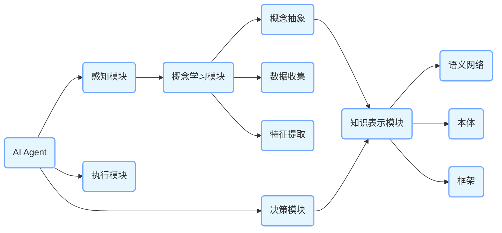

# 构建具有概念学习能力的AI Agent

> 关键词：AI Agent、概念学习能力、机器学习、知识表示、认知智能

> 摘要：本文围绕构建具有概念学习能力的AI Agent展开深入探讨。首先介绍了相关背景，包括目的范围、预期读者等内容。接着详细阐述了核心概念与联系，给出原理和架构的示意图及流程图。通过Python源代码讲解核心算法原理与具体操作步骤，同时给出数学模型和公式并举例说明。以实际项目为例，展示代码实现与解读。探讨了实际应用场景，推荐了学习、开发工具框架及相关论文著作。最后总结未来发展趋势与挑战，提供常见问题解答和扩展阅读参考资料，旨在为构建此类AI Agent提供全面且深入的技术指导。

## 1. 背景介绍 
### 1.1 目的和范围
在当今人工智能飞速发展的时代，构建具有概念学习能力的AI Agent具有重要的意义。传统的AI系统往往在特定任务上表现出色，但缺乏对概念的深入理解和学习能力。具有概念学习能力的AI Agent能够自主地从数据中抽象出概念，理解事物之间的关系，从而在更广泛的场景中灵活应用知识。

本文的范围涵盖了构建具有概念学习能力的AI Agent的各个方面，包括核心概念的解释、算法原理的阐述、实际项目的开发以及相关工具和资源的推荐等。旨在为开发者、研究人员和对人工智能感兴趣的读者提供一个全面的指南，帮助他们了解如何构建这样的AI Agent。

### 1.2 预期读者
本文的预期读者包括但不限于以下几类人群：
- 人工智能开发者：希望了解如何将概念学习能力融入到自己的AI Agent开发中，提升Agent的智能水平。
- 研究人员：对认知智能、机器学习等领域感兴趣，想要深入研究概念学习的理论和方法。
- 计算机科学专业的学生：作为学习人工智能相关课程的参考资料，帮助他们更好地理解概念学习的原理和应用。
- 对人工智能技术有一定了解的爱好者：希望进一步了解具有概念学习能力的AI Agent的工作原理和发展前景。

### 1.3 文档结构概述
本文将按照以下结构进行组织：
- 核心概念与联系：介绍与构建具有概念学习能力的AI Agent相关的核心概念，包括AI Agent、概念学习等，并展示它们之间的联系。
- 核心算法原理 & 具体操作步骤：详细讲解实现概念学习的核心算法原理，并给出具体的操作步骤，同时使用Python源代码进行示例。
- 数学模型和公式 & 详细讲解 & 举例说明：通过数学模型和公式来描述概念学习的过程，并结合实际例子进行详细讲解。
- 项目实战：代码实际案例和详细解释说明：以一个实际项目为例，展示如何开发具有概念学习能力的AI Agent，包括开发环境搭建、源代码实现和代码解读。
- 实际应用场景：探讨具有概念学习能力的AI Agent在不同领域的实际应用场景。
- 工具和资源推荐：推荐一些学习、开发和研究所需的工具和资源，包括书籍、在线课程、开发工具框架和相关论文著作等。
- 总结：未来发展趋势与挑战：总结具有概念学习能力的AI Agent的发展趋势，并分析面临的挑战。
- 附录：常见问题与解答：提供一些常见问题的解答，帮助读者更好地理解本文的内容。
- 扩展阅读 & 参考资料：列出一些扩展阅读的资料和参考文献，方便读者进一步深入研究。

### 1.4 术语表
#### 1.4.1 核心术语定义
- **AI Agent**：是一种能够感知环境、做出决策并采取行动以实现特定目标的智能实体。它可以是软件程序、机器人等形式。
- **概念学习**：指的是从数据中发现和抽象出概念的过程。概念是对一类事物的本质特征的概括和描述。
- **知识表示**：是将知识以计算机能够理解和处理的形式进行表示的方法。常见的知识表示方法包括语义网络、框架、本体等。
- **认知智能**：是人工智能的一个高级阶段，强调机器具有类似于人类的认知能力，如理解、推理、学习等。

#### 1.4.2 相关概念解释
- **机器学习**：是一门多领域交叉学科，涉及概率论、统计学、逼近论、凸分析、算法复杂度理论等多门学科。它专门研究计算机怎样模拟或实现人类的学习行为，以获取新的知识或技能，重新组织已有的知识结构使之不断改善自身的性能。
- **深度学习**：是机器学习的一个分支领域，它是一种基于对数据进行表征学习的方法。深度学习通过构建具有很多层的神经网络模型，自动从数据中学习到复杂的特征和模式。
- **强化学习**：是一类机器学习算法，用于智能体（Agent）在环境中通过与环境进行交互，以最大化累积奖励的方式来学习最优策略。

#### 1.4.3 缩略词列表
- **AI**：Artificial Intelligence，人工智能
- **ML**：Machine Learning，机器学习
- **DL**：Deep Learning，深度学习
- **RL**：Reinforcement Learning，强化学习

## 2. 核心概念与联系 
### 核心概念原理
#### AI Agent
AI Agent是一个能够感知环境、做出决策并采取行动的实体。它通常由感知模块、决策模块和执行模块组成。感知模块负责收集环境信息，决策模块根据感知到的信息和自身的目标做出决策，执行模块则根据决策采取相应的行动。

#### 概念学习
概念学习是从数据中发现和抽象出概念的过程。在概念学习中，我们通常会给定一组样本数据，每个样本都有一些特征和对应的标签。概念学习的目标是找到一个能够准确描述这些样本的概念表示，使得对于新的样本，我们能够根据这个概念表示来预测其标签。

#### 知识表示
知识表示是将知识以计算机能够理解和处理的形式进行表示的方法。对于具有概念学习能力的AI Agent来说，知识表示非常重要，因为它需要将学习到的概念以合适的方式存储和管理，以便在决策过程中能够快速地检索和使用。

### 架构的文本示意图
```plaintext
            +-------------------+
            |    AI Agent       |
            +-------------------+
            |  - 感知模块       |
            |  - 决策模块       |
            |  - 执行模块       |
            +-------------------+
                    |
                    |  感知环境信息
                    v
            +-------------------+
            |   概念学习模块    |
            +-------------------+
            |  - 数据收集       |
            |  - 特征提取       |
            |  - 概念抽象       |
            +-------------------+
                    |
                    |  学习到的概念
                    v
            +-------------------+
            |   知识表示模块    |
            +-------------------+
            |  - 语义网络       |
            |  - 本体           |
            |  - 框架           |
            +-------------------+
```

### Mermaid流程图


这个流程图展示了具有概念学习能力的AI Agent的整体架构。AI Agent通过感知模块收集环境信息，将其传递给概念学习模块。概念学习模块进行数据收集、特征提取和概念抽象等操作，学习到的概念存储在知识表示模块中。决策模块在做出决策时会参考知识表示模块中的知识。

## 3. 核心算法原理 & 具体操作步骤 
### 核心算法原理
在构建具有概念学习能力的AI Agent中，一种常用的方法是基于机器学习的分类算法。这里我们以决策树算法为例进行讲解。

决策树是一种基于树结构进行决策的模型，它通过对数据的特征进行递归划分，将数据空间划分为不同的区域，每个区域对应一个类别。决策树的构建过程可以看作是一个概念学习的过程，它从数据中学习到了不同特征与类别之间的关系。

### 具体操作步骤
#### 步骤1：数据收集
首先，我们需要收集与目标概念相关的数据。这些数据可以是结构化的，也可以是非结构化的。例如，如果我们要构建一个能够识别水果类别的AI Agent，我们可以收集各种水果的特征数据，如颜色、形状、大小等，以及对应的类别标签。

#### 步骤2：数据预处理
收集到的数据可能存在噪声、缺失值等问题，需要进行预处理。常见的预处理操作包括数据清洗、特征选择、数据归一化等。

#### 步骤3：构建决策树
使用预处理后的数据来构建决策树。决策树的构建过程通常采用贪心算法，每次选择一个最优的特征进行划分，直到满足停止条件为止。

#### 步骤4：模型评估
使用测试数据对构建好的决策树模型进行评估，计算模型的准确率、召回率等指标，评估模型的性能。

#### 步骤5：模型应用
将评估通过的决策树模型应用到实际的AI Agent中，让AI Agent根据输入的特征数据进行分类决策。

### Python源代码示例
```python
from sklearn.datasets import load_iris
from sklearn.model_selection import train_test_split
from sklearn.tree import DecisionTreeClassifier
from sklearn.metrics import accuracy_score

# 步骤1：数据收集
iris = load_iris()
X = iris.data
y = iris.target

# 步骤2：数据预处理
# 这里使用train_test_split函数将数据划分为训练集和测试集
X_train, X_test, y_train, y_test = train_test_split(X, y, test_size=0.3, random_state=42)

# 步骤3：构建决策树
clf = DecisionTreeClassifier()
clf.fit(X_train, y_train)

# 步骤4：模型评估
y_pred = clf.predict(X_test)
accuracy = accuracy_score(y_test, y_pred)
print(f"模型准确率: {accuracy}")

# 步骤5：模型应用
new_sample = [[5.1, 3.5, 1.4, 0.2]]
predicted_class = clf.predict(new_sample)
print(f"预测类别: {iris.target_names[predicted_class][0]}")
```

在这个示例中，我们使用了鸢尾花数据集来构建一个决策树分类器。首先，我们将数据集划分为训练集和测试集，然后使用训练集来训练决策树模型。接着，我们使用测试集来评估模型的准确率。最后，我们使用训练好的模型对一个新的样本进行分类预测。

## 4. 数学模型和公式 & 详细讲解 & 举例说明 
### 决策树的信息增益公式
在决策树的构建过程中，我们通常使用信息增益来选择最优的特征进行划分。信息增益的计算公式如下：

$$
IG(D, A) = H(D) - \sum_{v \in Values(A)} \frac{|D^v|}{|D|} H(D^v)
$$

其中：
- $IG(D, A)$ 表示特征 $A$ 对数据集 $D$ 的信息增益。
- $H(D)$ 表示数据集 $D$ 的信息熵。
- $Values(A)$ 表示特征 $A$ 的所有可能取值。
- $D^v$ 表示数据集 $D$ 中特征 $A$ 取值为 $v$ 的子集。
- $|D|$ 表示数据集 $D$ 的样本数量。
- $|D^v|$ 表示子集 $D^v$ 的样本数量。

### 信息熵的计算公式
信息熵是衡量数据集不确定性的一个指标，其计算公式如下：

$$
H(D) = - \sum_{k=1}^{K} p_k \log_2 p_k
$$

其中：
- $H(D)$ 表示数据集 $D$ 的信息熵。
- $K$ 表示数据集 $D$ 中类别的数量。
- $p_k$ 表示数据集 $D$ 中属于第 $k$ 类别的样本所占的比例。

### 详细讲解
信息增益的思想是，通过选择一个特征进行划分，使得划分后的子集的信息熵尽可能小，从而使得数据集的不确定性降低。信息增益越大，说明使用该特征进行划分能够获得更多的信息，即该特征对分类的贡献越大。

### 举例说明
假设我们有一个数据集 $D$，包含 10 个样本，分为两类：正类和负类，其中正类有 6 个样本，负类有 4 个样本。

首先，计算数据集 $D$ 的信息熵：

$$
p_1 = \frac{6}{10} = 0.6, \quad p_2 = \frac{4}{10} = 0.4
$$

$$
H(D) = - (0.6 \log_2 0.6 + 0.4 \log_2 0.4) \approx 0.971
$$

假设我们有一个特征 $A$，它有两个取值：$v_1$ 和 $v_2$。特征 $A$ 取值为 $v_1$ 的子集 $D^{v_1}$ 包含 6 个样本，其中正类有 4 个，负类有 2 个；特征 $A$ 取值为 $v_2$ 的子集 $D^{v_2}$ 包含 4 个样本，其中正类有 2 个，负类有 2 个。

计算子集 $D^{v_1}$ 的信息熵：

$$
p_{11} = \frac{4}{6} \approx 0.667, \quad p_{12} = \frac{2}{6} \approx 0.333
$$

$$
H(D^{v_1}) = - (0.667 \log_2 0.667 + 0.333 \log_2 0.333) \approx 0.918
$$

计算子集 $D^{v_2}$ 的信息熵：

$$
p_{21} = \frac{2}{4} = 0.5, \quad p_{22} = \frac{2}{4} = 0.5
$$

$$
H(D^{v_2}) = - (0.5 \log_2 0.5 + 0.5 \log_2 0.5) = 1
$$

计算特征 $A$ 对数据集 $D$ 的信息增益：

$$
IG(D, A) = H(D) - \left(\frac{6}{10} H(D^{v_1}) + \frac{4}{10} H(D^{v_2})\right)
$$

$$
= 0.971 - \left(\frac{6}{10} \times 0.918 + \frac{4}{10} \times 1\right) \approx 0.02
$$

通过计算信息增益，我们可以比较不同特征对数据集的划分能力，选择信息增益最大的特征进行划分。

## 5. 项目实战：代码实际案例和详细解释说明 
### 5.1  开发环境搭建
#### 安装Python
首先，我们需要安装Python环境。可以从Python官方网站（https://www.python.org/downloads/）下载适合你操作系统的Python安装包，并按照安装向导进行安装。

#### 安装必要的库
我们需要安装一些必要的Python库，如`scikit-learn`、`numpy`、`pandas`等。可以使用`pip`命令来安装这些库：

```sh
pip install scikit-learn numpy pandas
```

### 5.2  源代码详细实现和代码解读
```python
import pandas as pd
from sklearn.model_selection import train_test_split
from sklearn.tree import DecisionTreeClassifier
from sklearn.metrics import accuracy_score

# 步骤1：数据收集
# 假设我们有一个包含水果特征和类别的CSV文件
data = pd.read_csv('fruits.csv')

# 步骤2：数据预处理
# 分离特征和标签
X = data.drop('fruit_label', axis=1)
y = data['fruit_label']

# 将数据划分为训练集和测试集
X_train, X_test, y_train, y_test = train_test_split(X, y, test_size=0.3, random_state=42)

# 步骤3：构建决策树
clf = DecisionTreeClassifier()
clf.fit(X_train, y_train)

# 步骤4：模型评估
y_pred = clf.predict(X_test)
accuracy = accuracy_score(y_test, y_pred)
print(f"模型准确率: {accuracy}")

# 步骤5：模型应用
new_sample = pd.DataFrame({
    'feature1': [1],
    'feature2': [2],
    'feature3': [3]
})
predicted_class = clf.predict(new_sample)
print(f"预测类别: {predicted_class[0]}")
```

### 代码解读与分析
#### 数据收集
我们使用`pandas`库的`read_csv`函数从CSV文件中读取数据。假设CSV文件包含水果的特征和对应的类别标签。

#### 数据预处理
使用`drop`方法分离特征和标签，然后使用`train_test_split`函数将数据划分为训练集和测试集。

#### 构建决策树
使用`DecisionTreeClassifier`类创建一个决策树分类器，并使用训练集数据进行训练。

#### 模型评估
使用训练好的模型对测试集数据进行预测，并使用`accuracy_score`函数计算模型的准确率。

#### 模型应用
创建一个新的样本数据，使用训练好的模型对其进行分类预测，并输出预测结果。

## 6. 实际应用场景 
### 智能客服
具有概念学习能力的AI Agent可以应用于智能客服系统中。它能够从大量的用户咨询数据中学习到各种问题的概念和解决方案，当有新的用户咨询时，能够快速理解问题的本质，并提供准确的答案。例如，在电商平台的智能客服中，AI Agent可以学习到商品的类别、属性、常见问题等概念，帮助用户解决关于商品的咨询。

### 医疗诊断
在医疗领域，AI Agent可以通过学习医学知识和病例数据，掌握各种疾病的概念和特征。当面对患者的症状描述时，能够进行初步的诊断和建议。例如，根据患者的症状、检查结果等信息，AI Agent可以判断可能的疾病类型，并提供相应的治疗建议。

### 金融风险评估
在金融领域，AI Agent可以学习到不同金融产品、客户行为和市场情况的概念。通过对客户的信用记录、财务状况等数据的分析，评估客户的信用风险和投资风险。例如，银行可以使用AI Agent来评估贷款申请人的信用风险，决定是否批准贷款。

### 自动驾驶
在自动驾驶领域，AI Agent需要学习到各种交通规则、道路标志和障碍物的概念。通过对传感器收集到的数据进行分析，AI Agent可以做出决策，如加速、减速、转弯等。例如，当遇到红灯时，AI Agent能够识别红灯的概念，并做出停车的决策。

## 7. 工具和资源推荐
### 7.1 学习资源推荐
#### 7.1.1 书籍推荐
- 《机器学习》（周志华著）：这本书是机器学习领域的经典教材，系统地介绍了机器学习的基本概念、算法和应用。
- 《深度学习》（Ian Goodfellow、Yoshua Bengio和Aaron Courville著）：全面介绍了深度学习的理论和实践，适合对深度学习感兴趣的读者。
- 《人工智能：一种现代的方法》（Stuart Russell和Peter Norvig著）：是人工智能领域的权威教材，涵盖了人工智能的各个方面，包括搜索、知识表示、机器学习等。

#### 7.1.2 在线课程
- Coursera上的“机器学习”课程（Andrew Ng教授授课）：这是一门非常经典的机器学习课程，适合初学者入门。
- edX上的“深度学习微硕士项目”：提供了深度学习的系统学习课程，包括多个专题。
- 中国大学MOOC上的“人工智能基础”课程：由国内知名高校的教授授课，内容丰富，适合国内学生学习。

#### 7.1.3 技术博客和网站
- Medium：上面有很多人工智能领域的优秀博客文章，涵盖了最新的研究成果和技术应用。
- arXiv：是一个预印本服务器，提供了大量的人工智能相关的研究论文。
- 机器之心：专注于人工智能领域的资讯和技术分享，提供了很多有价值的文章和报告。

### 7.2 开发工具框架推荐
#### 7.2.1 IDE和编辑器
- PyCharm：是一款专门为Python开发设计的集成开发环境，提供了丰富的功能和插件，方便开发和调试。
- Jupyter Notebook：是一个交互式的开发环境，适合进行数据分析和模型实验。
- Visual Studio Code：是一款轻量级的代码编辑器，支持多种编程语言，并且有丰富的插件扩展。

#### 7.2.2 调试和性能分析工具
- TensorBoard：是TensorFlow提供的一个可视化工具，用于监控和分析深度学习模型的训练过程。
- Py-Spy：是一个Python性能分析工具，可以帮助我们找出代码中的性能瓶颈。
- cProfile：是Python标准库中的一个性能分析模块，可以对Python程序进行详细的性能分析。

#### 7.2.3 相关框架和库
- TensorFlow：是一个开源的深度学习框架，由Google开发，提供了丰富的工具和接口，用于构建和训练深度学习模型。
- PyTorch：是另一个流行的深度学习框架，由Facebook开发，具有动态图的特点，易于使用和调试。
- Scikit-learn：是一个用于机器学习的Python库，提供了各种机器学习算法和工具，适合初学者快速上手。

### 7.3 相关论文著作推荐
#### 7.3.1 经典论文
- "A Decision-Theoretic Generalization of On-Line Learning and an Application to Boosting"（Yoav Freund和Robert E. Schapire著）：介绍了AdaBoost算法，是机器学习领域的经典论文。
- "ImageNet Classification with Deep Convolutional Neural Networks"（Alex Krizhevsky、Ilya Sutskever和Geoffrey E. Hinton著）：提出了AlexNet模型，开启了深度学习在计算机视觉领域的应用热潮。
- "Attention Is All You Need"（Ashish Vaswani等人著）：提出了Transformer模型，在自然语言处理领域取得了巨大的成功。

#### 7.3.2 最新研究成果
- 在arXiv上可以找到很多关于概念学习、认知智能等领域的最新研究论文。关注一些知名的人工智能会议，如NeurIPS、ICML、CVPR等，这些会议上会发表很多前沿的研究成果。

#### 7.3.3 应用案例分析
- 《人工智能案例集》：收集了人工智能在各个领域的应用案例，通过实际案例分析，帮助读者了解人工智能的实际应用和解决方案。

## 8. 总结：未来发展趋势与挑战
### 未来发展趋势
- **融合多种学习方式**：未来的具有概念学习能力的AI Agent将融合多种学习方式，如监督学习、无监督学习、强化学习等，以提高学习的效率和效果。例如，通过无监督学习发现数据中的潜在概念，再使用监督学习对概念进行分类和标注。
- **与认知科学的结合**：进一步与认知科学相结合，借鉴人类的认知机制，提高AI Agent的认知智能水平。例如，模拟人类的注意力机制、记忆机制等，使AI Agent能够更高效地学习和处理信息。
- **跨领域应用**：将在更多的跨领域场景中得到应用，如医疗与金融的结合、教育与娱乐的结合等。通过整合不同领域的知识和数据，AI Agent能够提供更全面、更个性化的服务。
- **自主进化能力**：具备更强的自主进化能力，能够在不断变化的环境中自动调整和优化自己的学习策略和决策模型。例如，当遇到新的概念或数据模式时，能够自动学习和适应。

### 挑战
- **数据质量和隐私问题**：概念学习需要大量高质量的数据，但数据的收集、标注和管理存在一定的困难。同时，数据隐私问题也是一个重要的挑战，如何在保护用户隐私的前提下进行有效的概念学习是需要解决的问题。
- **计算资源和效率**：一些复杂的概念学习算法需要大量的计算资源和时间，如何提高算法的计算效率，减少计算资源的消耗是一个关键挑战。
- **知识表示和推理的复杂性**：随着学习到的概念和知识的增加，知识表示和推理的复杂性也会增加。如何有效地表示和管理知识，以及如何进行高效的推理是需要研究的问题。
- **可解释性和可靠性**：AI Agent的决策过程往往是黑盒的，缺乏可解释性。在一些关键领域，如医疗、金融等，需要AI Agent能够提供可解释的决策结果，同时保证决策的可靠性和安全性。

## 9. 附录：常见问题与解答
### 问题1：概念学习和传统机器学习有什么区别？
概念学习更强调从数据中抽象出概念，理解事物的本质特征和关系。而传统机器学习更侧重于对数据进行分类、回归等任务，可能不涉及对概念的深入理解。概念学习可以为传统机器学习提供更高级的知识表示和推理能力。

### 问题2：如何评估一个具有概念学习能力的AI Agent的性能？
可以从多个方面进行评估，如概念学习的准确率、召回率、F1值等指标，评估其对概念的分类和识别能力。还可以评估其在实际应用场景中的表现，如智能客服的响应准确率、医疗诊断的正确性等。

### 问题3：在构建具有概念学习能力的AI Agent时，如何选择合适的知识表示方法？
需要根据具体的应用场景和需求来选择。如果需要表示概念之间的语义关系，可以选择语义网络或本体；如果需要表示对象的属性和行为，可以选择框架。同时，还需要考虑知识表示方法的可扩展性、可维护性和计算效率等因素。

### 问题4：具有概念学习能力的AI Agent能否完全替代人类的认知和决策？
目前还不能完全替代。虽然AI Agent在某些方面可以表现出很高的智能水平，但人类具有独特的创造力、情感理解和社会认知能力。AI Agent可以作为人类的辅助工具，帮助人类更高效地处理信息和做出决策，但在复杂的社会和情感场景中，人类的判断和决策仍然是不可或缺的。

## 10. 扩展阅读 & 参考资料
### 扩展阅读
- 《认知计算：智能信息系统原理与应用》：深入探讨了认知计算的原理和应用，对于理解具有概念学习能力的AI Agent的认知机制有很大的帮助。
- 《人工智能哲学》：从哲学的角度探讨了人工智能的本质、发展和影响，有助于我们从更宏观的层面思考AI Agent的发展。

### 参考资料
- 周志华. 机器学习. 清华大学出版社, 2016.
- Ian Goodfellow, Yoshua Bengio, Aaron Courville. Deep Learning. MIT Press, 2016.
- Stuart Russell, Peter Norvig. Artificial Intelligence: A Modern Approach. Pearson, 2020.

作者：AI天才研究院/AI Genius Institute & 禅与计算机程序设计艺术 /Zen And The Art of Computer Programming