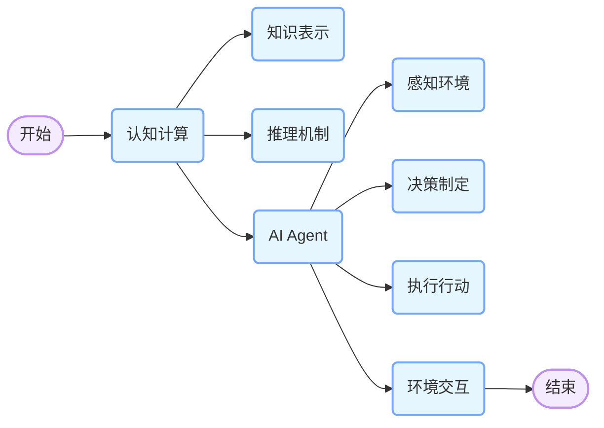

# 构建具有认知计算能力的AI Agent

> 关键词：认知计算、AI Agent、知识表示、推理机制、机器学习

> 摘要：本文围绕构建具有认知计算能力的AI Agent展开深入探讨。首先介绍了相关背景知识，包括目的、预期读者等。接着详细阐述了核心概念与联系，通过文本示意图和Mermaid流程图清晰展示其架构。对核心算法原理和具体操作步骤进行了分析，并给出Python源代码示例。同时讲解了数学模型和公式，辅以实际例子说明。通过项目实战，从开发环境搭建到源代码实现及解读，让读者了解如何在实际中构建。还介绍了实际应用场景、推荐了相关工具和资源。最后总结了未来发展趋势与挑战，解答常见问题，并提供扩展阅读和参考资料，旨在为读者全面呈现构建具有认知计算能力的AI Agent的技术体系。

## 1. 背景介绍 
### 1.1 目的和范围
构建具有认知计算能力的AI Agent的目的在于让智能体能够像人类一样理解、学习和推理，从而在复杂的环境中做出更加智能和合理的决策。其范围涵盖了多个领域，包括但不限于自然语言处理、计算机视觉、智能机器人等。通过赋予AI Agent认知计算能力，我们期望它能够处理不确定性信息、进行知识表示和推理，以解决现实世界中的各种复杂问题。

### 1.2 预期读者
本文的预期读者包括对人工智能技术感兴趣的研究人员、开发人员、学生以及相关领域的从业者。对于那些希望深入了解认知计算和AI Agent技术，并尝试在实际项目中应用的人来说，本文将提供有价值的参考。

### 1.3 文档结构概述
本文将按照以下结构进行组织：首先介绍核心概念与联系，包括认知计算和AI Agent的基本原理和架构；接着阐述核心算法原理和具体操作步骤，并给出Python代码示例；然后讲解相关的数学模型和公式，并举例说明；通过项目实战，详细介绍开发环境搭建、源代码实现和代码解读；介绍实际应用场景；推荐相关的工具和资源；总结未来发展趋势与挑战；解答常见问题；最后提供扩展阅读和参考资料。

### 1.4 术语表
#### 1.4.1 核心术语定义
- **认知计算**：是一种模拟人类认知过程的计算模式，它能够处理自然语言、图像等非结构化数据，理解上下文，进行学习和推理。
- **AI Agent**：是一种能够感知环境、进行决策并采取行动的智能实体，它可以与环境进行交互，以实现特定的目标。
- **知识表示**：是指将知识以某种形式表示出来，以便计算机能够处理和利用。常见的知识表示方法包括语义网络、框架、本体等。
- **推理机制**：是指根据已知的知识和规则，推导出新的知识和结论的过程。常见的推理机制包括演绎推理、归纳推理和溯因推理等。

#### 1.4.2 相关概念解释
- **机器学习**：是一门多领域交叉学科，涉及概率论、统计学、逼近论、凸分析、算法复杂度理论等多门学科。它专门研究计算机怎样模拟或实现人类的学习行为，以获取新的知识或技能，重新组织已有的知识结构使之不断改善自身的性能。
- **深度学习**：是机器学习的一个分支领域，它是一种基于对数据进行表征学习的方法。深度学习通过构建具有很多层的神经网络模型，自动从数据中学习特征和模式。

#### 1.4.3 缩略词列表
- **NLP**：Natural Language Processing，自然语言处理
- **CV**：Computer Vision，计算机视觉
- **ML**：Machine Learning，机器学习
- **DL**：Deep Learning，深度学习

## 2. 核心概念与联系 

### 核心概念原理
认知计算和AI Agent是两个紧密相关的概念。认知计算为AI Agent提供了智能决策的基础，它使AI Agent能够理解环境中的信息，进行知识的获取和推理。AI Agent则是认知计算的具体实现载体，通过感知环境、处理信息和执行行动，将认知计算的能力应用到实际场景中。

知识表示是认知计算和AI Agent的重要组成部分。通过合适的知识表示方法，AI Agent可以将获取到的信息转化为计算机能够处理的形式，从而进行推理和决策。推理机制则是基于知识表示的基础上，根据已知的知识和规则，推导出新的知识和结论。

### 架构的文本示意图
```plaintext
             +---------------------+
             |     认知计算层      |
             | 知识表示与推理机制  |
             +---------------------+
                     |
                     v
             +---------------------+
             |      AI Agent层     |
             | 感知 - 决策 - 行动  |
             +---------------------+
                     |
                     v
             +---------------------+
             |      环境交互层     |
             | 与外部环境交互      |
             +---------------------+
```

### Mermaid流程图


## 3. 核心算法原理 & 具体操作步骤 

### 核心算法原理
构建具有认知计算能力的AI Agent涉及到多个核心算法，其中包括知识表示算法、推理算法和机器学习算法等。

知识表示算法用于将知识以合适的形式表示出来，常见的知识表示方法有语义网络、框架和本体等。语义网络是一种用节点和边来表示概念和概念之间关系的图结构，它可以直观地表示知识的语义信息。框架是一种用于表示固定格式知识的结构，它由槽和槽值组成，可以方便地表示对象的属性和关系。本体是一种对领域知识进行形式化描述的模型，它定义了领域中的概念、概念之间的关系和规则，能够提供更加精确和严谨的知识表示。

推理算法用于根据已知的知识和规则，推导出新的知识和结论。常见的推理算法有演绎推理、归纳推理和溯因推理等。演绎推理是从一般到特殊的推理过程，它根据已知的前提和规则，推导出必然的结论。归纳推理是从特殊到一般的推理过程，它通过对多个具体实例的观察和分析，归纳出一般性的规律和结论。溯因推理是从结果到原因的推理过程，它根据已知的结果和一些可能的原因，推测出最有可能的原因。

机器学习算法用于让AI Agent从数据中学习和获取知识，常见的机器学习算法有监督学习、无监督学习和强化学习等。监督学习是一种有标签的学习方法，它通过对带有标签的训练数据进行学习，建立输入和输出之间的映射关系。无监督学习是一种无标签的学习方法，它通过对无标签的训练数据进行学习，发现数据中的模式和结构。强化学习是一种通过与环境进行交互来学习的方法，它根据环境的反馈信号，调整自己的行为策略，以最大化累积奖励。

### 具体操作步骤
#### 步骤1：知识获取
通过各种途径获取与任务相关的知识，包括文本数据、图像数据、传感器数据等。可以使用网络爬虫、数据采集工具等获取数据，也可以从知识库、数据库等数据源中提取知识。

#### 步骤2：知识表示
选择合适的知识表示方法，将获取到的知识表示为计算机能够处理的形式。例如，如果使用语义网络表示知识，可以使用图数据库来存储和管理语义网络。

#### 步骤3：推理机制设计
根据任务的需求和知识表示的形式，设计合适的推理机制。例如，如果使用演绎推理，可以使用规则引擎来实现推理过程。

#### 步骤4：机器学习模型训练
如果需要使用机器学习算法来让AI Agent学习和获取知识，可以选择合适的机器学习模型，并使用训练数据对模型进行训练。例如，如果使用监督学习，可以使用深度学习框架如TensorFlow或PyTorch来构建和训练模型。

#### 步骤5：AI Agent实现
将知识表示、推理机制和机器学习模型集成到AI Agent中，实现AI Agent的感知、决策和行动功能。可以使用编程语言如Python来实现AI Agent。

#### 步骤6：测试和优化
对AI Agent进行测试，评估其性能和效果。根据测试结果，对AI Agent进行优化和改进，提高其性能和效果。

### Python源代码示例
以下是一个简单的Python示例，演示了如何使用规则引擎进行演绎推理：
```python
from pyknow import *

# 定义事实类
class Animal(Fact):
    pass

# 定义规则类
class IsMammal(Rule):
    # 规则前提
    @Rule(Animal(has_hair=True))
    def is_mammal(self):
        print("这是一种哺乳动物。")

# 创建知识库
knowledge_base = KnowledgeEngine()
knowledge_base.reset()

# 添加事实
knowledge_base.declare(Animal(has_hair=True))

# 运行规则引擎
knowledge_base.run()
```
在这个示例中，我们使用了`pyknow`库来实现规则引擎。首先定义了一个事实类`Animal`，表示动物的属性。然后定义了一个规则类`IsMammal`，当动物具有毛发属性时，规则触发，输出“这是一种哺乳动物。”。最后，创建知识库，添加事实，并运行规则引擎。

## 4. 数学模型和公式 & 详细讲解 & 举例说明 

### 知识表示的数学模型
#### 语义网络
语义网络可以用图论的数学模型来表示。设语义网络为 $G=(V, E)$，其中 $V$ 是节点的集合，表示概念；$E$ 是边的集合，表示概念之间的关系。边可以带有标签，用于表示关系的类型。

例如，有一个简单的语义网络，包含三个节点：“猫”、“哺乳动物”和“宠物”，以及两条边：“猫 - 是一种 - 哺乳动物”和“猫 - 可以作为 - 宠物”。用数学模型表示为：
$V = \{猫, 哺乳动物, 宠物\}$
$E = \{(猫, 哺乳动物, 是一种), (猫, 宠物, 可以作为)\}$

#### 框架
框架可以用对象和属性的数学模型来表示。设框架为 $F=(O, A)$，其中 $O$ 是对象的集合，表示框架所描述的事物；$A$ 是属性的集合，表示对象的特征和关系。每个属性可以有一个或多个值。

例如，有一个描述“汽车”的框架，包含对象“汽车”和属性“品牌”、“颜色”、“价格”等。用数学模型表示为：
$O = \{汽车\}$
$A = \{(汽车, 品牌, 丰田), (汽车, 颜色, 红色), (汽车, 价格, 20000美元)\}$

#### 本体
本体可以用描述逻辑的数学模型来表示。描述逻辑是一种基于一阶逻辑的知识表示语言，它通过概念、角色和个体来描述领域知识。设本体为 $O=(C, R, I)$，其中 $C$ 是概念的集合，表示领域中的类别；$R$ 是角色的集合，表示概念之间的关系；$I$ 是个体的集合，表示领域中的具体实例。

例如，有一个描述“动物”的本体，包含概念“哺乳动物”、“鸟类”，角色“是一种”，个体“猫”、“狗”、“鸽子”等。用数学模型表示为：
$C = \{哺乳动物, 鸟类\}$
$R = \{(猫, 哺乳动物, 是一种), (狗, 哺乳动物, 是一种), (鸽子, 鸟类, 是一种)\}$
$I = \{猫, 狗, 鸽子\}$

### 推理机制的数学模型
#### 演绎推理
演绎推理可以用逻辑推理的数学模型来表示。设前提为 $P_1, P_2, \cdots, P_n$，规则为 $R$，结论为 $Q$。演绎推理的过程可以表示为：
$P_1 \land P_2 \land \cdots \land P_n \land R \Rightarrow Q$

例如，已知前提“所有的猫都是哺乳动物”（规则）和“Tom是一只猫”（前提），可以推出结论“Tom是一种哺乳动物”。用数学模型表示为：
$(\forall x)(猫(x) \Rightarrow 哺乳动物(x)) \land 猫(Tom) \Rightarrow 哺乳动物(Tom)$

#### 归纳推理
归纳推理可以用概率统计的数学模型来表示。设观察到的实例为 $x_1, x_2, \cdots, x_n$，每个实例具有属性 $A$ 的概率为 $P(A|x_i)$。归纳推理的过程可以表示为：
$\frac{1}{n} \sum_{i=1}^{n} P(A|x_i) \approx P(A)$

例如，观察到10只猫，其中8只猫喜欢吃鱼，那么可以归纳出猫喜欢吃鱼的概率约为 $\frac{8}{10} = 0.8$。

#### 溯因推理
溯因推理可以用贝叶斯定理的数学模型来表示。设结果为 $E$，原因有 $C_1, C_2, \cdots, C_n$，每个原因的先验概率为 $P(C_i)$，在每个原因下结果发生的条件概率为 $P(E|C_i)$。根据贝叶斯定理，每个原因的后验概率为：
$P(C_i|E) = \frac{P(E|C_i)P(C_i)}{\sum_{j=1}^{n} P(E|C_j)P(C_j)}$

例如，已知某地区下雨（结果 $E$），可能的原因有“云量多”（原因 $C_1$）和“气温下降”（原因 $C_2$）。已知 $P(C_1) = 0.6$，$P(C_2) = 0.4$，$P(E|C_1) = 0.8$，$P(E|C_2) = 0.7$。则可以计算出在下雨的情况下，“云量多”的后验概率为：
$P(C_1|E) = \frac{0.8 \times 0.6}{0.8 \times 0.6 + 0.7 \times 0.4} \approx 0.63$

## 5. 项目实战：代码实际案例和详细解释说明 

### 5.1  开发环境搭建
#### 安装Python
首先需要安装Python编程语言。可以从Python官方网站（https://www.python.org/downloads/）下载适合自己操作系统的Python安装包，并按照安装向导进行安装。

#### 安装必要的库
在构建具有认知计算能力的AI Agent时，需要使用一些Python库。可以使用`pip`命令来安装这些库，例如：
```bash
pip install pyknow tensorflow numpy pandas
```
其中，`pyknow`用于实现规则引擎，`tensorflow`用于构建和训练机器学习模型，`numpy`和`pandas`用于数据处理和分析。

### 5.2  源代码详细实现和代码解读
以下是一个完整的项目示例，实现了一个简单的具有认知计算能力的AI Agent，用于判断动物是否为哺乳动物：
```python
from pyknow import *
import numpy as np
import pandas as pd
import tensorflow as tf
from tensorflow.keras.models import Sequential
from tensorflow.keras.layers import Dense

# 定义事实类
class Animal(Fact):
    pass

# 定义规则类
class IsMammal(Rule):
    # 规则前提
    @Rule(Animal(has_hair=True))
    def is_mammal(self):
        print("这是一种哺乳动物。")

# 创建知识库
knowledge_base = KnowledgeEngine()
knowledge_base.reset()

# 添加事实
knowledge_base.declare(Animal(has_hair=True))

# 运行规则引擎
knowledge_base.run()

# 机器学习部分：训练一个简单的神经网络来判断动物是否为哺乳动物
# 生成一些示例数据
data = {
    'has_hair': [True, True, False, False],
    'is_mammal': [True, True, False, False]
}
df = pd.DataFrame(data)

# 准备数据
X = df[['has_hair']].astype(int).values
y = df['is_mammal'].astype(int).values

# 构建神经网络模型
model = Sequential()
model.add(Dense(10, input_dim=1, activation='relu'))
model.add(Dense(1, activation='sigmoid'))

# 编译模型
model.compile(loss='binary_crossentropy', optimizer='adam', metrics=['accuracy'])

# 训练模型
model.fit(X, y, epochs=100, batch_size=1)

# 预测新数据
new_data = np.array([[1]])
prediction = model.predict(new_data)
if prediction[0][0] > 0.5:
    print("预测结果：这是一种哺乳动物。")
else:
    print("预测结果：这不是一种哺乳动物。")
```
### 代码解读
#### 规则引擎部分
- `Animal`类：定义了一个事实类，表示动物的属性。
- `IsMammal`类：定义了一个规则类，当动物具有毛发属性时，规则触发，输出“这是一种哺乳动物。”。
- `KnowledgeEngine`：创建了一个知识库，并添加了事实，运行规则引擎。

#### 机器学习部分
- 数据生成：使用`pandas`库生成了一些示例数据，包含动物是否有毛发和是否为哺乳动物的信息。
- 数据准备：将数据转换为适合神经网络输入的格式。
- 模型构建：使用`tensorflow.keras`库构建了一个简单的神经网络模型，包含一个输入层、一个隐藏层和一个输出层。
- 模型编译：使用`binary_crossentropy`损失函数和`adam`优化器编译模型。
- 模型训练：使用训练数据对模型进行训练。
- 模型预测：使用训练好的模型对新数据进行预测，并输出预测结果。

### 5.3  代码解读与分析
通过这个项目示例，我们可以看到如何将规则引擎和机器学习算法结合起来，构建一个具有认知计算能力的AI Agent。规则引擎可以处理一些确定性的知识和规则，而机器学习算法可以从数据中学习和获取知识，处理一些不确定性的信息。两者结合可以提高AI Agent的智能水平和决策能力。

## 6. 实际应用场景 
### 智能客服
具有认知计算能力的AI Agent可以应用于智能客服领域。它可以理解用户的问题，通过知识表示和推理机制，从知识库中查找相关的答案。同时，它还可以通过机器学习算法，不断学习用户的问题和答案，提高回答的准确性和效率。

### 智能医疗
在智能医疗领域，AI Agent可以帮助医生进行疾病诊断和治疗方案推荐。它可以分析患者的病历、检查报告等信息，结合医学知识和临床经验，进行推理和判断，为医生提供决策支持。

### 智能交通
在智能交通领域，AI Agent可以用于交通流量预测、交通信号控制等。它可以感知交通环境中的信息，如车辆数量、车速等，通过推理和决策，优化交通信号的配时，提高交通效率。

### 智能教育
在智能教育领域，AI Agent可以作为学习助手，为学生提供个性化的学习建议和辅导。它可以了解学生的学习情况和需求，通过知识表示和推理机制，为学生推荐适合的学习资源和学习方法。

## 7. 工具和资源推荐
### 7.1 学习资源推荐
#### 7.1.1 书籍推荐
- 《人工智能：一种现代的方法》：这本书是人工智能领域的经典教材，全面介绍了人工智能的基本概念、算法和应用。
- 《机器学习》：由周志华教授编写，系统地介绍了机器学习的基本理论和方法。
- 《深度学习》：由Ian Goodfellow、Yoshua Bengio和Aaron Courville编写，是深度学习领域的权威著作。

#### 7.1.2 在线课程
- Coursera上的“人工智能基础”课程：由知名高校的教授授课，讲解人工智能的基本概念和算法。
- edX上的“深度学习专项课程”：由Andrew Ng教授授课，深入介绍深度学习的理论和实践。
- 中国大学MOOC上的“机器学习”课程：由国内知名高校的教师授课，适合初学者学习机器学习。

#### 7.1.3 技术博客和网站
- Medium：上面有很多人工智能领域的技术文章和案例分享。
- arXiv：提供了大量的人工智能领域的学术论文。
- AI研习社：专注于人工智能技术的交流和分享，有很多优质的技术文章和视频教程。

### 7.2 开发工具框架推荐
#### 7.2.1 IDE和编辑器
- PyCharm：是一款专门为Python开发设计的集成开发环境，具有代码编辑、调试、版本控制等功能。
- Jupyter Notebook：是一个交互式的开发环境，适合进行数据分析和机器学习实验。
- Visual Studio Code：是一款轻量级的代码编辑器，支持多种编程语言和插件扩展。

#### 7.2.2 调试和性能分析工具
- TensorBoard：是TensorFlow的可视化工具，可以用于查看模型的训练过程、性能指标等。
- Py-Spy：是一个Python性能分析工具，可以帮助开发者找出代码中的性能瓶颈。
- PDB：是Python自带的调试器，可以用于调试Python代码。

#### 7.2.3 相关框架和库
- TensorFlow：是一个开源的机器学习框架，广泛应用于深度学习领域。
- PyTorch：是另一个流行的深度学习框架，具有动态图和易于使用的特点。
- Scikit-learn：是一个用于机器学习的Python库，提供了各种机器学习算法和工具。

### 7.3 相关论文著作推荐
#### 7.3.1 经典论文
- “A Logical Calculus of the Ideas Immanent in Nervous Activity”：由Warren McCulloch和Walter Pitts发表，提出了人工神经网络的基本模型。
- “Learning Representations by Back-propagating Errors”：由David Rumelhart、Geoffrey Hinton和Ronald Williams发表，介绍了反向传播算法，推动了神经网络的发展。
- “ImageNet Classification with Deep Convolutional Neural Networks”：由Alex Krizhevsky、Ilya Sutskever和Geoffrey Hinton发表，提出了AlexNet，开启了深度学习在计算机视觉领域的应用。

#### 7.3.2 最新研究成果
- 关注顶级学术会议如NeurIPS、ICML、CVPR等的最新论文，了解人工智能领域的最新研究动态。
- 关注知名研究机构如OpenAI、DeepMind等的研究成果。

#### 7.3.3 应用案例分析
- 研究一些实际应用案例，如AlphaGo、Siri等，了解人工智能技术在实际场景中的应用和实现方法。

## 8. 总结：未来发展趋势与挑战
### 未来发展趋势
#### 多模态融合
未来的AI Agent将能够处理多种模态的信息，如文本、图像、语音等，实现更加全面和深入的认知。通过多模态融合，AI Agent可以更好地理解人类的意图和环境信息，提高决策的准确性和智能水平。

#### 知识图谱与认知计算的结合
知识图谱可以为AI Agent提供更加丰富和结构化的知识表示，结合认知计算的推理机制，AI Agent可以进行更加复杂和深入的推理和决策。知识图谱与认知计算的结合将是未来AI Agent发展的重要方向。

#### 自主学习和进化
未来的AI Agent将具备更强的自主学习和进化能力，能够在不断与环境交互的过程中，自动学习和适应新的知识和技能。通过自主学习和进化，AI Agent可以不断提高自己的性能和能力，更好地应对复杂多变的环境。

### 挑战
#### 数据隐私和安全
随着AI Agent的广泛应用，数据隐私和安全问题将变得更加突出。AI Agent需要处理大量的个人和敏感数据，如果这些数据被泄露或滥用，将给用户带来严重的损失。因此，如何保障数据的隐私和安全是未来AI Agent发展面临的重要挑战。

#### 可解释性和透明度
AI Agent的决策过程往往是基于复杂的机器学习模型和算法，其决策结果难以解释和理解。在一些关键领域，如医疗、金融等，可解释性和透明度是非常重要的。因此，如何提高AI Agent的可解释性和透明度是未来需要解决的问题。

#### 伦理和法律问题
AI Agent的发展也带来了一系列的伦理和法律问题，如责任界定、道德规范等。例如，当AI Agent做出错误的决策导致损失时，责任应该由谁来承担？如何确保AI Agent的行为符合道德和法律规范？这些问题需要我们认真思考和解决。

## 9. 附录：常见问题与解答
### 问题1：什么是认知计算？
认知计算是一种模拟人类认知过程的计算模式，它能够处理自然语言、图像等非结构化数据，理解上下文，进行学习和推理。

### 问题2：AI Agent和传统程序有什么区别？
AI Agent具有感知环境、进行决策和采取行动的能力，它可以与环境进行交互，以实现特定的目标。而传统程序通常是按照预设的规则和流程执行，缺乏自主决策和学习的能力。

### 问题3：如何选择合适的知识表示方法？
选择合适的知识表示方法需要考虑任务的需求、知识的特点和计算机的处理能力等因素。例如，如果知识具有较强的语义信息，可以选择语义网络；如果知识具有固定的格式，可以选择框架；如果需要进行精确和严谨的知识表示，可以选择本体。

### 问题4：机器学习和认知计算有什么关系？
机器学习是认知计算的重要组成部分，它可以让AI Agent从数据中学习和获取知识。认知计算则为机器学习提供了更高级的智能决策和推理能力，两者相互补充，共同推动AI Agent的发展。

### 问题5：如何提高AI Agent的性能和效果？
可以通过优化知识表示和推理机制、选择合适的机器学习模型和算法、增加训练数据的数量和质量等方法来提高AI Agent的性能和效果。同时，还需要对AI Agent进行不断的测试和优化，根据实际应用场景进行调整和改进。

## 10. 扩展阅读 & 参考资料
### 扩展阅读
- 《人工智能时代的人类未来》：探讨了人工智能对人类社会和未来发展的影响。
- 《智能时代》：介绍了智能技术在各个领域的应用和发展趋势。
- 《大数据时代》：讲述了大数据对社会和经济的变革作用。

### 参考资料
- 《人工智能：一种现代的方法》（第4版），Stuart Russell, Peter Norvig著
- 《机器学习》，周志华著
- 《深度学习》，Ian Goodfellow, Yoshua Bengio, Aaron Courville著
- TensorFlow官方文档：https://www.tensorflow.org/
- PyTorch官方文档：https://pytorch.org/
- Scikit-learn官方文档：https://scikit-learn.org/

作者：AI天才研究院/AI Genius Institute & 禅与计算机程序设计艺术 /Zen And The Art of Computer Programming