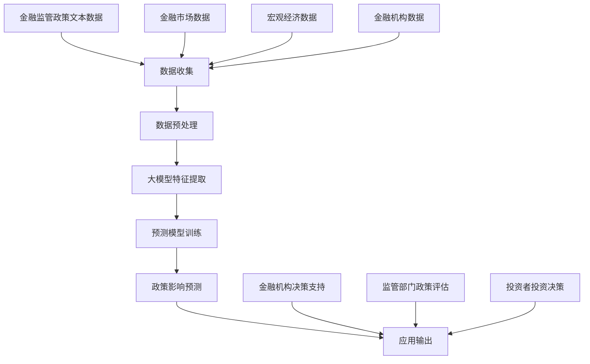

# 构建基于大模型的金融监管政策影响预测平台

> 关键词：大模型、金融监管政策、影响预测平台、自然语言处理、机器学习

> 摘要：本文旨在探讨如何构建一个基于大模型的金融监管政策影响预测平台。首先介绍了构建该平台的背景，包括目的、预期读者、文档结构和相关术语。接着阐述了核心概念，如大模型、金融监管政策分析等，并给出了相应的原理和架构示意图以及流程图。详细讲解了核心算法原理，通过 Python 代码进行说明，同时给出了相关的数学模型和公式，并举例分析。通过项目实战，展示了开发环境搭建、源代码实现和代码解读。探讨了该平台的实际应用场景，推荐了学习资源、开发工具框架和相关论文著作。最后总结了未来发展趋势与挑战，解答了常见问题并提供了扩展阅读和参考资料。

## 1. 背景介绍 
### 1.1 目的和范围
金融市场的稳定对于国家经济的健康发展至关重要。金融监管政策的出台旨在规范金融市场行为、防范金融风险，但政策的实施往往会对金融机构、市场参与者和整个经济体系产生广泛而复杂的影响。构建基于大模型的金融监管政策影响预测平台的目的在于利用先进的人工智能技术，特别是大模型的强大能力，对金融监管政策的潜在影响进行准确、及时的预测，为金融机构、监管部门和投资者提供决策支持。

本平台的范围涵盖了对各类金融监管政策的分析和影响预测，包括但不限于货币政策、财政政策、行业监管政策等。同时，预测的影响指标包括金融市场的价格波动、金融机构的业务绩效、宏观经济指标的变化等。

### 1.2 预期读者
- **金融机构从业者**：如银行、证券、保险等金融机构的管理人员、分析师和交易员，他们可以利用平台的预测结果制定业务策略、评估风险和进行投资决策。
- **金融监管部门人员**：包括央行、银保监会、证监会等监管机构的工作人员，平台可以帮助他们更好地评估政策的有效性和潜在影响，优化监管政策的制定和实施。
- **投资者**：个人和机构投资者可以通过平台了解金融监管政策对市场的影响，调整投资组合，降低投资风险。
- **学术研究人员**：对金融市场、人工智能和政策分析等领域感兴趣的学者可以将平台作为研究工具，开展相关的学术研究。

### 1.3 文档结构概述
本文将按照以下结构进行组织：
- **核心概念与联系**：介绍大模型、金融监管政策分析等核心概念，以及它们之间的联系，同时给出原理和架构示意图以及流程图。
- **核心算法原理 & 具体操作步骤**：详细讲解平台所使用的核心算法原理，并通过 Python 代码展示具体的操作步骤。
- **数学模型和公式 & 详细讲解 & 举例说明**：给出用于政策影响预测的数学模型和公式，并进行详细讲解和举例分析。
- **项目实战：代码实际案例和详细解释说明**：通过一个具体的项目实战，展示平台的开发过程，包括开发环境搭建、源代码实现和代码解读。
- **实际应用场景**：探讨平台在金融市场中的实际应用场景。
- **工具和资源推荐**：推荐学习资源、开发工具框架和相关论文著作。
- **总结：未来发展趋势与挑战**：总结平台的未来发展趋势和面临的挑战。
- **附录：常见问题与解答**：解答读者可能遇到的常见问题。
- **扩展阅读 & 参考资料**：提供扩展阅读的建议和相关的参考资料。

### 1.4 术语表
#### 1.4.1 核心术语定义
- **大模型**：指具有大量参数和强大计算能力的人工智能模型，如 GPT 系列、BERT 等，能够处理自然语言、图像等多种类型的数据。
- **金融监管政策**：政府或监管机构为了维护金融市场的稳定、保护投资者利益、防范金融风险而制定的一系列规则和措施。
- **政策影响预测**：通过对金融监管政策的分析和建模，预测政策实施后对金融市场、金融机构和宏观经济的影响。
- **自然语言处理（NLP）**：研究如何让计算机理解和处理人类语言的技术，包括文本分类、情感分析、命名实体识别等任务。
- **机器学习**：一门多领域交叉学科，涉及概率论、统计学、逼近论、凸分析、算法复杂度理论等多门学科。它专门研究计算机怎样模拟或实现人类的学习行为，以获取新的知识或技能，重新组织已有的知识结构使之不断改善自身的性能。

#### 1.4.2 相关概念解释
- **大模型在金融领域的应用**：大模型可以用于金融文本分析、风险评估、市场预测等多个方面。例如，通过对金融新闻、研报等文本的分析，大模型可以提取关键信息，预测市场趋势。
- **金融监管政策的特点**：金融监管政策具有权威性、强制性、时效性和复杂性等特点。政策的制定和实施受到多种因素的影响，如宏观经济形势、金融市场状况、政治因素等。
- **政策影响的传导机制**：金融监管政策的影响通过多种渠道传导到金融市场和实体经济中，如利率渠道、信贷渠道、资产价格渠道等。了解政策影响的传导机制对于准确预测政策影响至关重要。

#### 1.4.3 缩略词列表
- **NLP**：Natural Language Processing（自然语言处理）
- **ML**：Machine Learning（机器学习）
- **GPT**：Generative Pretrained Transformer（生成式预训练变换器）
- **BERT**：Bidirectional Encoder Representations from Transformers（基于变换器的双向编码器表示）

## 2. 核心概念与联系 

### 核心概念原理
#### 大模型原理
大模型通常基于深度学习架构，如 Transformer 架构。Transformer 架构引入了自注意力机制（Self - Attention Mechanism），能够捕捉输入序列中不同位置之间的依赖关系。以 GPT 为例，它是一种基于 Transformer 解码器的生成式模型，通过在大规模文本数据上进行无监督预训练，学习到语言的通用模式和知识。在预训练过程中，模型的目标是根据前文预测下一个单词，从而优化模型的参数。在微调阶段，可以针对具体的任务，如文本分类、问答系统等，使用少量的标注数据对模型进行进一步训练，使其适应特定的应用场景。

#### 金融监管政策分析原理
金融监管政策分析主要涉及对政策文本的理解和解读。首先，需要对政策文本进行预处理，包括分词、去除停用词、词性标注等操作，将文本转化为计算机能够处理的形式。然后，利用自然语言处理技术，如文本分类、命名实体识别、情感分析等，提取政策的关键信息，如政策的目标、适用范围、具体措施等。同时，结合金融领域的知识和数据，分析政策对金融市场和金融机构的潜在影响。

### 架构的文本示意图
```plaintext
基于大模型的金融监管政策影响预测平台架构

数据层
|-- 金融监管政策文本数据
|-- 金融市场数据（价格、交易量等）
|-- 宏观经济数据（GDP、CPI 等）
|-- 金融机构数据（财务报表、业务数据等）

预处理层
|-- 文本预处理（分词、去除停用词、词性标注）
|-- 数据清洗（去除噪声、异常值处理）
|-- 特征工程（提取文本特征、数值特征）

大模型层
|-- 预训练大模型（如 GPT、BERT）
|-- 微调大模型以适应政策分析任务

预测层
|-- 构建预测模型（如机器学习模型、深度学习模型）
|-- 输入预处理后的数据和大模型输出的特征
|-- 输出政策影响预测结果

应用层
|-- 金融机构决策支持
|-- 监管部门政策评估
|-- 投资者投资决策
```

### Mermaid 流程图


## 3. 核心算法原理 & 具体操作步骤 

### 核心算法原理
本平台主要使用大模型进行文本特征提取，结合机器学习算法进行政策影响预测。具体来说，使用 BERT 模型进行金融监管政策文本的特征提取。BERT 模型通过双向编码器对输入的文本进行编码，能够捕捉文本的上下文信息，得到每个单词的语义表示。然后，将这些语义表示进行拼接或池化操作，得到整个文本的特征向量。

在得到文本特征向量后，使用随机森林算法进行政策影响预测。随机森林是一种集成学习算法，它由多个决策树组成。每个决策树在不同的样本子集和特征子集上进行训练，最后通过投票或平均的方式综合多个决策树的预测结果。随机森林具有较好的泛化能力和抗过拟合能力。

### 具体操作步骤及 Python 代码实现

#### 步骤 1：安装必要的库
```python
!pip install transformers scikit-learn pandas numpy
```

#### 步骤 2：加载金融监管政策文本数据和标签数据
```python
import pandas as pd

# 假设数据存储在 CSV 文件中，包含 'policy_text' 和 'impact_label' 两列
data = pd.read_csv('financial_policy_data.csv')
policy_texts = data['policy_text'].tolist()
impact_labels = data['impact_label'].tolist()
```

#### 步骤 3：使用 BERT 模型进行文本特征提取
```python
from transformers import BertTokenizer, BertModel
import torch

# 加载预训练的 BERT 模型和分词器
tokenizer = BertTokenizer.from_pretrained('bert-base-chinese')
model = BertModel.from_pretrained('bert-base-chinese')

# 对文本进行分词和编码
input_ids = []
attention_masks = []

for text in policy_texts:
    encoded_dict = tokenizer.encode_plus(
                        text,                      # 输入文本
                        add_special_tokens = True, # 添加特殊标记 [CLS] 和 [SEP]
                        max_length = 128,          # 最大序列长度
                        pad_to_max_length = True,  # 填充到最大长度
                        return_attention_mask = True,   # 返回注意力掩码
                        return_tensors = 'pt',     # 返回 PyTorch 张量
                   )
    
    input_ids.append(encoded_dict['input_ids'])
    attention_masks.append(encoded_dict['attention_mask'])

# 将列表转换为张量
input_ids = torch.cat(input_ids, dim=0)
attention_masks = torch.cat(attention_masks, dim=0)

# 使用 BERT 模型提取特征
with torch.no_grad():
    outputs = model(input_ids, attention_mask=attention_masks)

# 获取 [CLS] 标记的输出作为文本特征
features = outputs[0][:, 0, :].numpy()
```

#### 步骤 4：划分训练集和测试集
```python
from sklearn.model_selection import train_test_split

X_train, X_test, y_train, y_test = train_test_split(features, impact_labels, test_size=0.2, random_state=42)
```

#### 步骤 5：使用随机森林算法进行模型训练和预测
```python
from sklearn.ensemble import RandomForestClassifier
from sklearn.metrics import accuracy_score

# 创建随机森林分类器
rf_classifier = RandomForestClassifier(n_estimators=100, random_state=42)

# 训练模型
rf_classifier.fit(X_train, y_train)

# 进行预测
y_pred = rf_classifier.predict(X_test)

# 计算准确率
accuracy = accuracy_score(y_test, y_pred)
print(f"模型准确率: {accuracy}")
```

## 4. 数学模型和公式 & 详细讲解 & 举例说明 

### BERT 模型的数学原理
BERT 模型基于 Transformer 架构，其核心是自注意力机制。自注意力机制的数学公式如下：

给定输入序列 $X = [x_1, x_2,..., x_n]$，其中 $x_i$ 是第 $i$ 个单词的嵌入向量。首先，将输入向量分别乘以三个不同的权重矩阵 $W^Q$、$W^K$ 和 $W^V$，得到查询向量 $Q$、键向量 $K$ 和值向量 $V$：

$$Q = XW^Q$$
$$K = XW^K$$
$$V = XW^V$$

然后，计算注意力分数：

$$Attention(Q, K, V) = softmax(\frac{QK^T}{\sqrt{d_k}})V$$

其中，$d_k$ 是键向量的维度，$softmax$ 函数用于将注意力分数归一化到 $[0, 1]$ 区间。

BERT 模型通过多层的自注意力机制和前馈神经网络对输入序列进行编码，最终得到每个单词的上下文表示。

### 随机森林算法的数学原理
随机森林由多个决策树组成，每个决策树的训练过程如下：

#### 数据采样
从原始训练数据中随机有放回地采样 $n$ 个样本，形成一个新的训练子集。这个过程称为自助采样（Bootstrap Sampling）。

#### 特征采样
在每个决策树的节点分裂时，从所有特征中随机选择 $m$ 个特征，然后在这 $m$ 个特征中选择最优的分裂特征。

#### 决策树构建
使用选定的训练子集和特征子集构建决策树。决策树的每个节点根据某个特征的取值进行分裂，直到满足停止条件（如节点中的样本数小于某个阈值）。

#### 预测
对于一个新的样本，每个决策树都给出一个预测结果，随机森林通过投票（分类问题）或平均（回归问题）的方式综合多个决策树的预测结果。

### 举例说明
假设我们有一个包含 100 条金融监管政策文本的数据集，每条文本对应一个政策影响标签（如正面影响、负面影响、无影响）。我们使用 BERT 模型将这些文本转换为特征向量，每个特征向量的维度为 768。然后，将这些特征向量划分为训练集和测试集，训练集包含 80 条样本，测试集包含 20 条样本。

使用随机森林算法在训练集上进行训练，设置决策树的数量为 100。训练完成后，在测试集上进行预测，得到预测结果。通过比较预测结果和真实标签，计算模型的准确率。例如，如果预测正确的样本数为 16，则模型的准确率为 $\frac{16}{20} = 0.8$。

## 5. 项目实战：代码实际案例和详细解释说明 

### 5.1  开发环境搭建
#### 操作系统
建议使用 Linux 系统，如 Ubuntu 18.04 或更高版本，因为 Linux 系统在开发和部署机器学习项目方面具有良好的稳定性和兼容性。

#### Python 环境
安装 Python 3.7 或更高版本。可以使用 Anaconda 来管理 Python 环境，它提供了方便的包管理和环境切换功能。

#### 安装必要的库
在终端中执行以下命令安装所需的库：
```bash
pip install transformers scikit-learn pandas numpy torch
```

### 5.2  源代码详细实现和代码解读
以下是一个完整的项目实战代码示例，结合了前面介绍的步骤：

```python
import pandas as pd
from transformers import BertTokenizer, BertModel
import torch
from sklearn.model_selection import train_test_split
from sklearn.ensemble import RandomForestClassifier
from sklearn.metrics import accuracy_score

# 步骤 1：加载金融监管政策文本数据和标签数据
data = pd.read_csv('financial_policy_data.csv')
policy_texts = data['policy_text'].tolist()
impact_labels = data['impact_label'].tolist()

# 步骤 2：使用 BERT 模型进行文本特征提取
tokenizer = BertTokenizer.from_pretrained('bert-base-chinese')
model = BertModel.from_pretrained('bert-base-chinese')

input_ids = []
attention_masks = []

for text in policy_texts:
    encoded_dict = tokenizer.encode_plus(
                        text,
                        add_special_tokens = True,
                        max_length = 128,
                        pad_to_max_length = True,
                        return_attention_mask = True,
                        return_tensors = 'pt',
                   )
    
    input_ids.append(encoded_dict['input_ids'])
    attention_masks.append(encoded_dict['attention_mask'])

input_ids = torch.cat(input_ids, dim=0)
attention_masks = torch.cat(attention_masks, dim=0)

with torch.no_grad():
    outputs = model(input_ids, attention_mask=attention_masks)

features = outputs[0][:, 0, :].numpy()

# 步骤 3：划分训练集和测试集
X_train, X_test, y_train, y_test = train_test_split(features, impact_labels, test_size=0.2, random_state=42)

# 步骤 4：使用随机森林算法进行模型训练和预测
rf_classifier = RandomForestClassifier(n_estimators=100, random_state=42)
rf_classifier.fit(X_train, y_train)

y_pred = rf_classifier.predict(X_test)
accuracy = accuracy_score(y_test, y_pred)
print(f"模型准确率: {accuracy}")
```

### 代码解读与分析
- **数据加载**：使用 `pandas` 库读取存储在 CSV 文件中的金融监管政策文本数据和对应的影响标签。
- **文本特征提取**：使用 `transformers` 库中的 `BertTokenizer` 和 `BertModel` 对政策文本进行分词和编码，然后提取 `[CLS]` 标记的输出作为文本特征。
- **数据集划分**：使用 `sklearn` 库中的 `train_test_split` 函数将特征向量和标签划分为训练集和测试集，测试集占总数据的 20%。
- **模型训练和预测**：使用 `sklearn` 库中的 `RandomForestClassifier` 构建随机森林分类器，在训练集上进行训练，然后在测试集上进行预测，最后计算模型的准确率。

## 6. 实际应用场景 
### 金融机构决策支持
金融机构可以利用该平台预测金融监管政策对自身业务的影响，如信贷业务、投资业务等。例如，银行可以根据政策影响预测结果调整信贷额度、优化贷款结构，降低潜在风险。证券公司可以根据政策对市场的影响调整投资策略，选择更具潜力的投资标的。

### 监管部门政策评估
监管部门可以使用该平台评估新出台的金融监管政策的有效性和潜在影响。通过预测政策对金融市场和金融机构的影响，监管部门可以及时调整政策措施，确保政策的实施达到预期目标，同时避免对市场造成过度冲击。

### 投资者投资决策
投资者可以借助该平台了解金融监管政策对市场的影响，调整投资组合。例如，当预测到某项政策将对某个行业产生负面影响时，投资者可以减少对该行业相关股票的投资，转而投资其他更具潜力的行业。

## 7. 工具和资源推荐
### 7.1 学习资源推荐
#### 7.1.1 书籍推荐
- 《深度学习》（Deep Learning）：由 Ian Goodfellow、Yoshua Bengio 和 Aaron Courville 所著，是深度学习领域的经典教材，涵盖了深度学习的基本原理、算法和应用。
- 《Python 机器学习》（Python Machine Learning）：由 Sebastian Raschka 和 Vahid Mirjalili 所著，介绍了使用 Python 进行机器学习的方法和技巧，包括各种机器学习算法的实现和应用。
- 《自然语言处理入门》：由何晗所著，适合初学者入门自然语言处理领域，介绍了自然语言处理的基本概念、算法和应用。

#### 7.1.2 在线课程
- Coursera 上的“深度学习专项课程”（Deep Learning Specialization）：由 Andrew Ng 教授授课，包括深度学习基础、卷积神经网络、循环神经网络等多个模块，是学习深度学习的优质课程。
- edX 上的“自然语言处理”（Natural Language Processing）：由哥伦比亚大学教授授课，介绍了自然语言处理的核心技术和应用。
- 中国大学 MOOC 上的“机器学习”：由周志华教授授课，系统地介绍了机器学习的基本概念、算法和理论。

#### 7.1.3 技术博客和网站
- Medium：上面有很多关于人工智能、机器学习和自然语言处理的技术博客和文章，作者来自世界各地的技术专家和研究人员。
- Towards Data Science：专注于数据科学和机器学习领域的技术博客，提供了很多实用的教程和案例分析。
- arXiv：是一个开放的预印本数据库，包含了大量的学术论文，涵盖了人工智能、机器学习等多个领域的最新研究成果。

### 7.2 开发工具框架推荐
#### 7.2.1 IDE和编辑器
- PyCharm：是一款专门为 Python 开发设计的集成开发环境（IDE），提供了丰富的功能，如代码编辑、调试、版本控制等，适合专业的 Python 开发者。
- Jupyter Notebook：是一个交互式的开发环境，支持 Python、R 等多种编程语言，适合进行数据探索、模型训练和可视化等工作。
- Visual Studio Code：是一款轻量级的代码编辑器，支持多种编程语言和插件扩展，具有良好的开发体验和社区支持。

#### 7.2.2 调试和性能分析工具
- TensorBoard：是 TensorFlow 提供的一个可视化工具，可以用于监控模型的训练过程、查看模型的结构和性能指标等。
- Py-Spy：是一个用于分析 Python 程序性能的工具，可以实时查看 Python 程序的 CPU 使用率、函数调用时间等信息，帮助开发者找出性能瓶颈。
- PDB：是 Python 自带的调试器，可以用于调试 Python 代码，设置断点、查看变量值等。

#### 7.2.3 相关框架和库
- Transformers：由 Hugging Face 开发的一个自然语言处理库，提供了多种预训练的大模型，如 GPT、BERT 等，方便开发者进行文本处理和模型微调。
- Scikit-learn：是一个常用的机器学习库，提供了各种机器学习算法的实现，如分类、回归、聚类等，同时还提供了数据预处理、模型评估等工具。
- PyTorch：是一个开源的深度学习框架，具有动态图的特点，易于使用和调试，广泛应用于学术界和工业界。

### 7.3 相关论文著作推荐
#### 7.3.1 经典论文
- “Attention Is All You Need”：提出了 Transformer 架构，是自然语言处理领域的重要突破，为后续的大模型发展奠定了基础。
- “BERT: Pre-training of Deep Bidirectional Transformers for Language Understanding”：介绍了 BERT 模型的预训练和微调方法，在自然语言处理任务中取得了优异的成绩。
- “Random Forests”：详细介绍了随机森林算法的原理和应用，是集成学习领域的经典论文。

#### 7.3.2 最新研究成果
- 关注 arXiv 上关于金融领域和人工智能交叉研究的最新论文，了解大模型在金融监管政策分析和预测方面的最新研究进展。
- 参加国际顶级的人工智能和金融学术会议，如 NeurIPS、ICML、ACM SIGKDD 等，获取最新的研究成果和技术趋势。

#### 7.3.3 应用案例分析
- 查阅金融机构和监管部门发布的报告和研究成果，了解他们在实际应用中使用大模型进行金融监管政策影响预测的案例和经验。
- 关注行业媒体和财经网站的报道，了解大模型在金融市场中的实际应用情况和效果。

## 8. 总结：未来发展趋势与挑战
### 未来发展趋势
- **模型融合与创新**：未来可能会将多种大模型和机器学习算法进行融合，以提高政策影响预测的准确性和可靠性。同时，随着技术的不断发展，可能会出现新的模型架构和算法，为金融监管政策分析带来新的突破。
- **多模态数据融合**：除了文本数据，还可以结合图像、音频、视频等多模态数据进行政策影响分析。例如，通过分析金融市场的可视化数据和政策相关的视频报道，获取更全面的信息，提高预测的精度。
- **实时预测与动态调整**：随着金融市场的快速变化，对政策影响的实时预测需求将越来越高。未来的平台将具备实时数据处理和动态调整预测模型的能力，及时反映政策变化对市场的影响。
- **与区块链技术结合**：区块链技术具有去中心化、不可篡改等特点，可以为金融监管政策的实施和评估提供更可靠的保障。将大模型与区块链技术结合，可以实现政策数据的安全共享和透明监管。

### 挑战
- **数据质量和隐私问题**：金融监管政策数据和相关的金融市场数据往往具有敏感性和隐私性，如何在保证数据质量的前提下，保护数据的隐私和安全是一个重要的挑战。同时，数据的不完整性、噪声和偏差也会影响模型的训练和预测效果。
- **模型解释性和可信赖性**：大模型通常是黑盒模型，其决策过程难以解释。在金融监管领域，模型的解释性和可信赖性至关重要。如何让模型的预测结果具有可解释性，让决策者能够理解和信任模型的输出，是需要解决的问题。
- **计算资源和成本**：大模型的训练和推理需要大量的计算资源和时间，成本较高。如何优化模型的结构和算法，降低计算成本，提高平台的运行效率，是实际应用中面临的挑战。
- **政策复杂性和不确定性**：金融监管政策具有复杂性和不确定性，政策的实施效果受到多种因素的影响，如宏观经济形势、市场参与者的行为等。如何准确地捕捉政策的复杂性和不确定性，提高预测的准确性，是一个具有挑战性的问题。

## 9. 附录：常见问题与解答
### 问题 1：如何选择合适的大模型进行金融监管政策分析？
答：选择合适的大模型需要考虑多个因素，如模型的性能、适用领域、计算资源等。对于金融监管政策分析，可以选择在自然语言处理任务中表现优异的模型，如 BERT、GPT 等。同时，需要根据具体的任务需求和数据特点进行微调，以提高模型的准确性和适用性。

### 问题 2：数据预处理的步骤有哪些？
答：数据预处理的步骤通常包括文本清洗、分词、去除停用词、词性标注、特征提取等。对于金融监管政策文本数据，还需要进行专业术语的识别和处理。在处理数值数据时，需要进行数据清洗、归一化、标准化等操作。

### 问题 3：如何评估模型的性能？
答：可以使用多种指标来评估模型的性能，如准确率、召回率、F1 值、均方误差等。对于分类问题，常用准确率、召回率和 F1 值来评估模型的性能；对于回归问题，常用均方误差、平均绝对误差等指标来评估模型的性能。同时，还可以使用交叉验证等方法来评估模型的泛化能力。

### 问题 4：如何处理数据不平衡问题？
答：数据不平衡是指数据集中不同类别的样本数量差异较大的问题。可以采用以下方法处理数据不平衡问题：
- **采样方法**：包括过采样（如 SMOTE 算法）和欠采样（如随机欠采样），通过增加少数类样本或减少多数类样本的数量来平衡数据集。
- **调整模型权重**：在模型训练时，调整不同类别的样本权重，使得少数类样本的权重更高，从而提高模型对少数类样本的关注度。
- **使用代价敏感学习算法**：一些机器学习算法支持代价敏感学习，可以通过设置不同类别的误分类代价来处理数据不平衡问题。

## 10. 扩展阅读 & 参考资料
### 扩展阅读
- 《人工智能时代的金融风险管理》：探讨了人工智能技术在金融风险管理中的应用和挑战，为理解金融监管政策与风险管理的关系提供了深入的视角。
- 《金融科技前沿：技术驱动的金融创新》：介绍了金融科技领域的最新技术和应用案例，包括大模型在金融领域的应用实践。
- 《数据驱动的金融决策》：强调了数据在金融决策中的重要性，以及如何利用数据分析和机器学习技术进行金融决策。

### 参考资料
- Hugging Face 官方文档：https://huggingface.co/docs
- Scikit-learn 官方文档：https://scikit-learn.org/stable/documentation.html
- PyTorch 官方文档：https://pytorch.org/docs/stable/index.html

作者：AI天才研究院/AI Genius Institute & 禅与计算机程序设计艺术 /Zen And The Art of Computer Programming