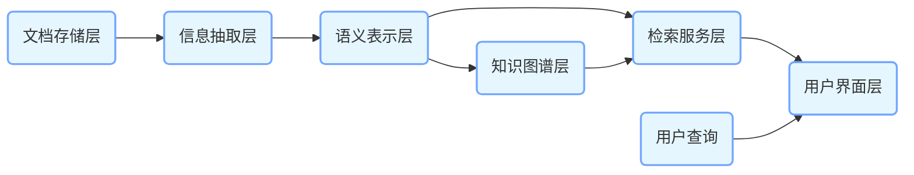

# 构建智能企业文档管理系统：语义检索与知识链接

> 关键词：智能企业文档管理系统、语义检索、知识链接、信息抽取、知识图谱

> 摘要：本文围绕构建智能企业文档管理系统展开，聚焦语义检索与知识链接两大核心功能。详细介绍了相关的核心概念、算法原理、数学模型，通过项目实战展示了系统的具体实现过程，探讨了其实际应用场景，推荐了学习资源、开发工具和相关论文著作。最后对智能企业文档管理系统的未来发展趋势与挑战进行了总结，并提供了常见问题解答及扩展阅读参考资料，旨在为企业构建高效的文档管理系统提供全面的技术指导。

## 1. 背景介绍 
### 1.1 目的和范围
在当今数字化时代，企业积累了大量的文档资料，如合同、报告、技术文档等。传统的文档管理系统主要基于关键词匹配进行检索，难以理解文档的语义信息，导致检索结果的准确性和相关性较低。本文章的目的是探讨如何构建一个智能企业文档管理系统，引入语义检索和知识链接技术，提高文档检索的准确性和效率，实现文档之间的知识关联，为企业提供更智能的知识管理解决方案。

本文的范围涵盖了智能企业文档管理系统的核心概念、算法原理、数学模型、项目实战、实际应用场景、工具和资源推荐等方面，旨在为企业和开发者提供一个全面的技术指南。

### 1.2 预期读者
本文预期读者包括企业的信息管理人员、IT技术人员、文档管理系统开发者、人工智能研究人员以及对智能文档管理感兴趣的专业人士。这些读者可以从本文中获取构建智能企业文档管理系统的相关知识和技术，为实际工作提供参考。

### 1.3 文档结构概述
本文将按照以下结构进行组织：
- 核心概念与联系：介绍语义检索、知识链接等核心概念，以及它们之间的联系，并通过文本示意图和Mermaid流程图进行展示。
- 核心算法原理 & 具体操作步骤：详细讲解语义检索和知识链接所涉及的核心算法原理，并使用Python源代码进行阐述。
- 数学模型和公式 & 详细讲解 & 举例说明：介绍相关的数学模型和公式，并通过具体例子进行说明。
- 项目实战：代码实际案例和详细解释说明：通过一个实际项目案例，展示智能企业文档管理系统的开发过程，包括开发环境搭建、源代码实现和代码解读。
- 实际应用场景：探讨智能企业文档管理系统在企业中的实际应用场景。
- 工具和资源推荐：推荐学习资源、开发工具和相关论文著作。
- 总结：未来发展趋势与挑战：对智能企业文档管理系统的未来发展趋势进行总结，并分析可能面临的挑战。
- 附录：常见问题与解答：提供常见问题的解答。
- 扩展阅读 & 参考资料：提供相关的扩展阅读资料和参考书目。

### 1.4 术语表
#### 1.4.1 核心术语定义
- **语义检索**：基于文档的语义信息进行检索，而不仅仅是关键词匹配，能够理解用户查询的语义意图，提供更准确的检索结果。
- **知识链接**：将文档中的相关知识进行关联，形成知识网络，便于用户在浏览文档时发现相关的知识信息。
- **知识图谱**：一种基于图的数据结构，用于表示实体之间的关系，在智能文档管理系统中可用于存储和管理文档中的知识信息。
- **信息抽取**：从文档中提取有用的信息，如实体、关系等，为语义检索和知识链接提供基础数据。

#### 1.4.2 相关概念解释
- **词向量**：将词语表示为向量的形式，使得词语在向量空间中具有语义信息，便于进行语义计算。
- **相似度计算**：用于衡量两个对象（如词语、文档）之间的相似程度，在语义检索中用于判断查询与文档的相关性。
- **命名实体识别**：识别文档中的命名实体，如人名、地名、组织机构名等，是信息抽取的重要任务之一。

#### 1.4.3 缩略词列表
- **NLP**：Natural Language Processing，自然语言处理
- **TF-IDF**：Term Frequency-Inverse Document Frequency，词频 - 逆文档频率
- **BERT**：Bidirectional Encoder Representations from Transformers，基于变换器的双向编码器表示

## 2. 核心概念与联系 

### 核心概念原理
#### 语义检索
语义检索的核心思想是理解文本的语义信息，而不仅仅依赖于关键词匹配。它通过将查询和文档表示为语义向量，然后计算它们之间的相似度来确定相关性。在自然语言处理中，通常使用词向量模型（如Word2Vec、BERT等）将文本转换为向量表示。例如，对于查询“人工智能的应用领域”和文档“人工智能在医疗领域的应用”，语义检索能够理解它们在语义上的相关性，即使查询和文档中没有完全相同的关键词。

#### 知识链接
知识链接是将文档中的相关知识进行关联，形成知识网络。它通过信息抽取技术从文档中提取实体和关系，然后将这些实体和关系存储在知识图谱中。当用户浏览文档时，可以通过知识图谱发现相关的知识信息。例如，在一篇关于苹果公司的文档中，知识链接可以将苹果公司与它的产品（如iPhone、MacBook等）、竞争对手（如三星、华为等）进行关联，使用户能够更全面地了解相关知识。

### 架构的文本示意图
智能企业文档管理系统的架构主要包括以下几个部分：
- **文档存储层**：用于存储企业的文档资料，可以是文件系统、数据库等。
- **信息抽取层**：对文档进行信息抽取，提取实体、关系等信息，为语义检索和知识链接提供基础数据。
- **语义表示层**：将文档和查询转换为语义向量表示，以便进行相似度计算。
- **知识图谱层**：存储和管理文档中的知识信息，实现知识链接。
- **检索服务层**：提供语义检索服务，根据用户的查询返回相关的文档。
- **用户界面层**：用户与系统进行交互的界面，包括查询输入、检索结果展示等。

### Mermaid 流程图


## 3. 核心算法原理 & 具体操作步骤 

### 语义检索算法原理
#### TF-IDF算法
TF-IDF（Term Frequency-Inverse Document Frequency）是一种常用的文本特征提取方法，用于衡量一个词语在文档中的重要性。其计算公式如下：
- 词频（TF）：表示词语在文档中出现的频率，计算公式为 $TF_{t,d}=\frac{f_{t,d}}{\sum_{i}f_{i,d}}$，其中 $f_{t,d}$ 表示词语 $t$ 在文档 $d$ 中出现的次数，$\sum_{i}f_{i,d}$ 表示文档 $d$ 中所有词语出现的总次数。
- 逆文档频率（IDF）：表示词语在整个文档集合中的普遍重要性，计算公式为 $IDF_{t}=\log\frac{N}{n_{t}}$，其中 $N$ 表示文档集合中的文档总数，$n_{t}$ 表示包含词语 $t$ 的文档数。
- TF-IDF值：$TF - IDF_{t,d}=TF_{t,d}\times IDF_{t}$

#### Python代码实现
```python
from sklearn.feature_extraction.text import TfidfVectorizer
import numpy as np

# 示例文档集合
documents = [
    "人工智能的应用领域",
    "人工智能在医疗领域的应用",
    "机器学习是人工智能的一个分支"
]

# 创建TF-IDF向量器
vectorizer = TfidfVectorizer()

# 计算文档的TF-IDF向量
tfidf_matrix = vectorizer.fit_transform(documents)

# 示例查询
query = "人工智能的应用"

# 将查询转换为TF-IDF向量
query_vector = vectorizer.transform([query])

# 计算查询与文档的相似度
from sklearn.metrics.pairwise import cosine_similarity
similarities = cosine_similarity(query_vector, tfidf_matrix)

# 输出相似度结果
for i, doc in enumerate(documents):
    print(f"文档 '{doc}' 与查询的相似度: {similarities[0][i]}")
```

### 知识链接算法原理
#### 命名实体识别（NER）
命名实体识别是信息抽取的重要任务之一，用于识别文档中的命名实体，如人名、地名、组织机构名等。常用的命名实体识别模型有基于规则的模型、基于机器学习的模型（如条件随机场CRF）和基于深度学习的模型（如BERT）。

#### 关系抽取
关系抽取用于识别文档中实体之间的关系，例如“苹果公司生产iPhone”，其中“苹果公司”和“iPhone”是实体，“生产”是它们之间的关系。关系抽取可以基于规则、机器学习或深度学习方法实现。

#### Python代码实现（使用spaCy进行命名实体识别）
```python
import spacy

# 加载英文语言模型
nlp = spacy.load("en_core_web_sm")

# 示例文本
text = "Apple Inc. is a technology company based in Cupertino, California. It was founded by Steve Jobs, Steve Wozniak, and Ronald Wayne."

# 处理文本
doc = nlp(text)

# 输出命名实体
for ent in doc.ents:
    print(f"实体: {ent.text}, 类型: {ent.label_}")
```

## 4. 数学模型和公式 & 详细讲解 & 举例说明 

### 词向量模型
#### Word2Vec
Word2Vec是一种常用的词向量模型，它通过神经网络学习词语的分布式表示。Word2Vec有两种训练模型：CBOW（Continuous Bag-of-Words）和Skip-gram。

##### CBOW模型
CBOW模型的目标是根据上下文词语预测中心词语。其数学模型可以表示为：
$$\hat{w}=\underset{w\in V}{\mathrm{argmax}}\ P(w|c_{1},c_{2},\cdots,c_{n})$$
其中，$\hat{w}$ 是预测的中心词语，$V$ 是词汇表，$c_{1},c_{2},\cdots,c_{n}$ 是上下文词语。

##### Skip-gram模型
Skip-gram模型的目标是根据中心词语预测上下文词语。其数学模型可以表示为：
$$\hat{c}_{i}=\underset{c\in V}{\mathrm{argmax}}\ P(c|w)$$
其中，$\hat{c}_{i}$ 是预测的上下文词语，$w$ 是中心词语。

#### 举例说明
假设我们有一个句子“我喜欢人工智能”，使用Word2Vec将词语转换为向量。训练完成后，“人工智能”这个词语会被表示为一个向量，例如 $[0.1, 0.2, 0.3, \cdots]$，这个向量包含了“人工智能”的语义信息。

### 相似度计算
#### 余弦相似度
余弦相似度用于衡量两个向量之间的夹角余弦值，其计算公式为：
$$\cos(\theta)=\frac{\mathbf{A}\cdot\mathbf{B}}{\|\mathbf{A}\|\|\mathbf{B}\|}$$
其中，$\mathbf{A}$ 和 $\mathbf{B}$ 是两个向量，$\mathbf{A}\cdot\mathbf{B}$ 是它们的点积，$\|\mathbf{A}\|$ 和 $\|\mathbf{B}\|$ 分别是它们的模。

#### 举例说明
假设我们有两个向量 $\mathbf{A}=[1, 2, 3]$ 和 $\mathbf{B}=[2, 4, 6]$，则它们的余弦相似度为：
$$\cos(\theta)=\frac{1\times2 + 2\times4 + 3\times6}{\sqrt{1^2 + 2^2 + 3^2}\sqrt{2^2 + 4^2 + 6^2}}=\frac{2 + 8 + 18}{\sqrt{14}\sqrt{56}}=\frac{28}{\sqrt{14\times56}} = 1$$
这表明两个向量的方向完全相同，相似度为1。

## 5. 项目实战：代码实际案例和详细解释说明 

### 5.1  开发环境搭建
#### 操作系统
推荐使用Linux系统，如Ubuntu 18.04或更高版本，也可以使用Windows 10或macOS。

#### 编程语言
使用Python 3.7或更高版本，Python具有丰富的自然语言处理库和工具，便于开发智能文档管理系统。

#### 依赖库安装
```bash
pip install numpy pandas scikit-learn spacy
python -m spacy download en_core_web_sm
```

### 5.2  源代码详细实现和代码解读
#### 文档预处理
```python
import re
import string
import nltk
from nltk.corpus import stopwords
from nltk.stem import WordNetLemmatizer

nltk.download('stopwords')
nltk.download('wordnet')

def preprocess_text(text):
    # 转换为小写
    text = text.lower()
    # 去除标点符号
    text = text.translate(str.maketrans('', '', string.punctuation))
    # 去除数字
    text = re.sub(r'\d+', '', text)
    # 分词
    tokens = text.split()
    # 去除停用词
    stop_words = set(stopwords.words('english'))
    tokens = [token for token in tokens if token not in stop_words]
    # 词形还原
    lemmatizer = WordNetLemmatizer()
    tokens = [lemmatizer.lemmatize(token) for token in tokens]
    # 合并词语
    preprocessed_text = ' '.join(tokens)
    return preprocessed_text

# 示例文本
text = "This is an example sentence for text preprocessing!"
preprocessed_text = preprocess_text(text)
print(f"预处理后的文本: {preprocessed_text}")
```
代码解读：
- `preprocess_text` 函数用于对文本进行预处理，包括转换为小写、去除标点符号、数字、停用词，以及词形还原等操作。
- `nltk` 库提供了停用词列表和词形还原工具，方便进行文本预处理。

#### 语义检索实现
```python
from sklearn.feature_extraction.text import TfidfVectorizer
from sklearn.metrics.pairwise import cosine_similarity

# 示例文档集合
documents = [
    "Artificial intelligence has many applications",
    "AI is widely used in healthcare",
    "Machine learning is a branch of AI"
]

# 预处理文档
preprocessed_documents = [preprocess_text(doc) for doc in documents]

# 创建TF-IDF向量器
vectorizer = TfidfVectorizer()

# 计算文档的TF-IDF向量
tfidf_matrix = vectorizer.fit_transform(preprocessed_documents)

# 示例查询
query = "AI applications"

# 预处理查询
preprocessed_query = preprocess_text(query)

# 将查询转换为TF-IDF向量
query_vector = vectorizer.transform([preprocessed_query])

# 计算查询与文档的相似度
similarities = cosine_similarity(query_vector, tfidf_matrix)

# 输出相似度结果
for i, doc in enumerate(documents):
    print(f"文档 '{doc}' 与查询的相似度: {similarities[0][i]}")
```
代码解读：
- 首先对文档集合和查询进行预处理，然后使用 `TfidfVectorizer` 计算文档和查询的TF-IDF向量。
- 使用 `cosine_similarity` 计算查询与文档的相似度，并输出结果。

### 5.3  代码解读与分析
#### 文档预处理的重要性
文档预处理可以去除文本中的噪声信息，如标点符号、数字、停用词等，同时进行词形还原，将词语转换为其基本形式。这样可以减少文本的维度，提高语义检索的准确性。

#### TF-IDF向量的作用
TF-IDF向量可以衡量词语在文档中的重要性，通过计算查询和文档的TF-IDF向量的相似度，可以判断它们之间的相关性。TF-IDF算法简单有效，适用于大多数文本检索场景。

#### 相似度计算的意义
相似度计算是语义检索的核心步骤，通过计算查询和文档的相似度，可以筛选出与查询相关的文档。余弦相似度是一种常用的相似度计算方法，它可以衡量两个向量的方向相似性。

## 6. 实际应用场景 
### 企业知识管理
智能企业文档管理系统可以帮助企业更好地管理和利用内部的文档资料。员工可以通过语义检索快速找到所需的文档，同时通过知识链接发现相关的知识信息，提高工作效率和知识共享水平。

### 客户服务
在客户服务领域，智能文档管理系统可以用于构建智能客服知识库。客服人员可以通过语义检索快速找到相关的解决方案，为客户提供更准确、高效的服务。

### 法律合规
在法律合规领域，企业需要管理大量的法律文档和合规要求。智能文档管理系统可以帮助企业进行文档的分类、检索和知识链接，确保企业遵守相关的法律法规。

### 科研领域
在科研领域，研究人员需要处理大量的学术文献。智能文档管理系统可以帮助研究人员进行文献检索和知识发现，促进科研工作的开展。

## 7. 工具和资源推荐
### 7.1 学习资源推荐
#### 7.1.1 书籍推荐
- 《自然语言处理入门》：介绍了自然语言处理的基本概念、算法和技术，适合初学者入门。
- 《Python自然语言处理实战》：通过实际案例介绍了如何使用Python进行自然语言处理，具有很强的实践性。
- 《知识图谱：方法、实践与应用》：详细介绍了知识图谱的构建方法、应用场景和相关技术。

#### 7.1.2 在线课程
- Coursera上的“Natural Language Processing Specialization”：由知名大学教授授课，系统介绍了自然语言处理的各个方面。
- edX上的“Artificial Intelligence for Natural Language Processing”：讲解了人工智能在自然语言处理中的应用。
- 中国大学MOOC上的“自然语言处理”：国内高校开设的课程，结合了理论和实践。

#### 7.1.3 技术博客和网站
- 博客园：有很多自然语言处理和人工智能相关的技术博客，分享了最新的技术动态和实践经验。
- 开源中国：提供了丰富的开源项目和技术文章，对学习和开发有很大帮助。
- Towards Data Science：专注于数据科学和人工智能领域，有很多高质量的技术文章。

### 7.2 开发工具框架推荐
#### 7.2.1 IDE和编辑器
- PyCharm：一款功能强大的Python集成开发环境，提供了代码编辑、调试、版本控制等功能。
- Visual Studio Code：轻量级的代码编辑器，支持多种编程语言，有丰富的插件扩展。

#### 7.2.2 调试和性能分析工具
- pdb：Python自带的调试工具，可以帮助开发者进行代码调试。
- cProfile：Python的性能分析工具，可以分析代码的运行时间和函数调用情况。

#### 7.2.3 相关框架和库
- spaCy：一个快速、高效的自然语言处理库，提供了命名实体识别、词性标注等功能。
- NLTK：自然语言工具包，包含了丰富的语料库和工具，适合初学者学习和实践。
- Transformers：由Hugging Face开发的深度学习框架，提供了预训练的语言模型，如BERT、GPT等。

### 7.3 相关论文著作推荐
#### 7.3.1 经典论文
- “Efficient Estimation of Word Representations in Vector Space”：介绍了Word2Vec模型的原理和实现方法。
- “BERT: Pre-training of Deep Bidirectional Transformers for Language Understanding”：提出了BERT模型，在自然语言处理领域取得了显著的成果。

#### 7.3.2 最新研究成果
- 关注ACL（Association for Computational Linguistics）、EMNLP（Conference on Empirical Methods in Natural Language Processing）等自然语言处理领域的顶级会议，了解最新的研究成果。

#### 7.3.3 应用案例分析
- 一些企业和研究机构会发布智能文档管理系统的应用案例分析，如谷歌、微软等公司的相关研究报告，可以从中学习实际应用中的经验和技巧。

## 8. 总结：未来发展趋势与挑战
### 未来发展趋势
#### 多模态融合
未来的智能企业文档管理系统将不仅仅局限于文本信息，还会融合图像、音频、视频等多模态信息，提供更丰富的知识管理服务。例如，在文档中可以嵌入相关的图片、视频，通过图像识别和语音识别技术实现多模态的语义检索和知识链接。

#### 深度学习的应用
深度学习技术将在智能文档管理系统中得到更广泛的应用。除了现有的BERT等预训练模型，未来还会出现更强大的模型，能够更好地理解文档的语义信息，提高语义检索和知识链接的准确性。

#### 智能化推荐
系统将具备更强大的智能化推荐功能，根据用户的历史行为和偏好，自动推荐相关的文档和知识信息。例如，当用户浏览一篇关于人工智能的文档时，系统可以推荐相关的研究报告、案例分析等。

### 挑战
#### 数据质量和隐私保护
智能文档管理系统需要大量的高质量数据进行训练和学习，但数据的收集、标注和管理面临着诸多挑战。同时，企业文档中包含大量的敏感信息，如何在保证系统性能的前提下，保护数据的隐私和安全是一个重要的问题。

#### 语义理解的准确性
虽然自然语言处理技术取得了很大的进展，但语义理解仍然是一个难题。不同的人对同一文本可能有不同的理解，如何提高系统对语义的准确理解，是智能文档管理系统面临的挑战之一。

#### 系统的可扩展性和性能
随着企业文档数量的不断增加，系统的可扩展性和性能成为关键问题。如何设计一个高效、可扩展的系统架构，保证系统在大规模数据下的稳定运行，是需要解决的问题。

## 9. 附录：常见问题与解答
### 问题1：语义检索和关键词检索有什么区别？
关键词检索主要基于文本中的关键词匹配，只考虑词语的字面形式，不理解文本的语义信息。而语义检索能够理解文本的语义意图，即使查询和文档中没有完全相同的关键词，也能找到相关的文档。

### 问题2：知识图谱在智能文档管理系统中有什么作用？
知识图谱可以存储和管理文档中的知识信息，实现文档之间的知识链接。通过知识图谱，用户可以在浏览文档时发现相关的知识信息，提高知识的关联性和利用效率。

### 问题3：如何选择合适的词向量模型？
选择合适的词向量模型需要考虑多个因素，如数据规模、任务类型、计算资源等。对于小规模数据和简单任务，可以选择Word2Vec等模型；对于大规模数据和复杂任务，可以考虑使用BERT等预训练模型。

### 问题4：智能文档管理系统的开发难度大吗？
智能文档管理系统的开发涉及到自然语言处理、机器学习、数据库等多个领域的知识，开发难度相对较大。但随着开源工具和框架的不断发展，开发难度在逐渐降低。开发者可以利用现有的工具和框架，结合实际需求进行开发。

## 10. 扩展阅读 & 参考资料
### 扩展阅读
- 《人工智能：现代方法》：全面介绍了人工智能的基本概念、算法和应用，对理解智能文档管理系统的相关技术有很大帮助。
- 《大数据时代：生活、工作与思维的大变革》：探讨了大数据时代的特点和挑战，对于理解企业文档管理系统的数据处理和应用有一定的启示。

### 参考资料
- 相关的学术论文和研究报告，如ACL、EMNLP等会议的论文集。
- 开源项目的文档和代码，如spaCy、NLTK、Transformers等项目的官方文档。

作者：AI天才研究院/AI Genius Institute & 禅与计算机程序设计艺术 /Zen And The Art of Computer Programming