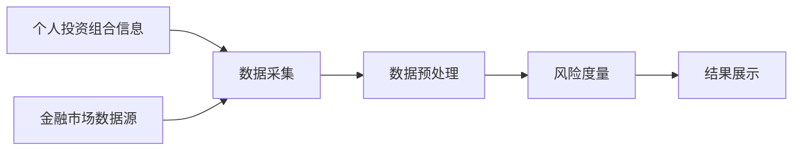

# 构建智能化的个人投资组合尾部风险评估系统

> 关键词：个人投资组合、尾部风险评估、智能化系统、风险度量、金融科技

> 摘要：本文聚焦于构建智能化的个人投资组合尾部风险评估系统。在金融市场日益复杂多变的背景下，个人投资者面临着诸多不确定性和尾部风险。通过深入研究尾部风险的相关理论和评估方法，结合先进的人工智能与数据分析技术，旨在开发出一套能够精准、高效地评估个人投资组合尾部风险的系统。文章详细阐述了系统的核心概念、算法原理、数学模型，通过项目实战展示系统的具体实现和应用，并探讨了其实际应用场景、推荐了相关工具和资源，最后对未来发展趋势与挑战进行了总结，以期为个人投资者和相关从业者提供有价值的参考。

## 1. 背景介绍 
### 1.1 目的和范围
在当今金融市场中，个人投资者的投资组合面临着各种风险，其中尾部风险尤为关键。尾部风险是指发生概率极低但一旦发生将造成巨大损失的事件。构建智能化的个人投资组合尾部风险评估系统的目的在于帮助个人投资者更好地识别、度量和管理投资组合中的尾部风险，从而做出更合理的投资决策。

本系统的范围涵盖了常见的金融资产，如股票、债券、基金等，适用于不同投资规模和风险偏好的个人投资者。通过对历史数据的分析和建模，结合实时市场信息，系统能够对个人投资组合的尾部风险进行动态评估。

### 1.2 预期读者
本文的预期读者包括个人投资者、金融从业者（如投资顾问、风险分析师等）、金融科技开发者以及对金融风险管理和人工智能应用感兴趣的研究人员。个人投资者可以借助本系统更好地管理自己的投资组合，金融从业者可以将其作为风险评估的工具和参考，金融科技开发者可以从中获取技术实现的思路和方法，研究人员可以在相关领域进行更深入的研究和探索。

### 1.3 文档结构概述
本文将按照以下结构展开：首先介绍系统构建的背景和相关概念，包括尾部风险的定义和与投资组合的联系；接着阐述核心算法原理和具体操作步骤，通过Python代码详细说明；然后介绍数学模型和公式，并举例说明；通过项目实战展示系统的开发环境搭建、源代码实现和代码解读；探讨系统的实际应用场景；推荐相关的工具和资源；总结未来发展趋势与挑战；最后提供常见问题与解答和扩展阅读及参考资料。

### 1.4 术语表
#### 1.4.1 核心术语定义
- **个人投资组合**：个人投资者持有的各种金融资产的集合，包括股票、债券、基金等，旨在实现投资目标和风险分散。
- **尾部风险**：指在概率分布的尾部发生的极端事件所带来的风险，通常具有低概率和高损失的特点。
- **风险度量**：对投资组合面临的风险进行量化的过程和方法，常见的风险度量指标有VaR（Value at Risk，在险价值）、CVaR（Conditional Value at Risk，条件在险价值）等。
- **智能化系统**：利用人工智能、机器学习等技术，能够自动学习、分析和决策的系统。

#### 1.4.2 相关概念解释
- **金融资产**：具有价值并能在金融市场上交易的资产，如股票代表对公司的所有权，债券是发行人向投资者发行的债务凭证，基金是由基金管理人管理的集合投资工具。
- **概率分布**：描述随机变量取值的概率规律的函数，在金融领域常用于描述资产收益率的分布。尾部通常指概率分布的两端，极端事件发生在尾部区域。
- **风险管理**：识别、评估和应对风险的过程，旨在降低风险对投资组合的影响，实现投资目标。

#### 1.4.3 缩略词列表
- **VaR**：Value at Risk，在险价值，是一种常用的风险度量指标，表示在一定的置信水平下，投资组合在未来一定时间内可能遭受的最大损失。
- **CVaR**：Conditional Value at Risk，条件在险价值，也称为预期尾部损失，是指在损失超过VaR的条件下的平均损失。
- **AI**：Artificial Intelligence，人工智能，是研究、开发用于模拟、延伸和扩展人的智能的理论、方法、技术及应用系统的一门新的技术科学。
- **ML**：Machine Learning，机器学习，是人工智能的一个分支，旨在让计算机通过数据学习模式和规律，从而做出预测和决策。

## 2. 核心概念与联系 

### 2.1 尾部风险的概念
尾部风险是金融市场中一个重要的概念。在金融资产收益率的概率分布中，大部分时间资产收益率围绕均值波动，但存在极小概率出现极端的收益或损失情况，这些极端情况就发生在概率分布的尾部。例如，2008年的全球金融危机，股票市场大幅下跌，许多投资者遭受了巨大损失，这种情况就是典型的尾部风险事件。

### 2.2 个人投资组合与尾部风险的关系
个人投资组合的尾部风险不仅取决于组合中单个资产的尾部风险，还与资产之间的相关性有关。不同资产之间的相关性会影响投资组合的风险分散效果。如果投资组合中的资产相关性较高，当市场出现极端事件时，这些资产可能同时遭受损失，从而增加了投资组合的尾部风险；反之，如果资产之间相关性较低，投资组合可以在一定程度上分散尾部风险。

### 2.3 核心概念原理和架构的文本示意图
个人投资组合尾部风险评估系统的核心原理是通过收集和分析个人投资组合中各种资产的历史数据和实时市场信息，利用风险度量模型对投资组合的尾部风险进行评估。系统架构主要包括数据采集模块、数据预处理模块、风险度量模块和结果展示模块。

数据采集模块负责从金融市场数据源获取个人投资组合中各种资产的历史价格、收益率等数据；数据预处理模块对采集到的数据进行清洗、转换和归一化等操作，以提高数据质量；风险度量模块利用选定的风险度量模型（如VaR、CVaR等）对投资组合的尾部风险进行计算；结果展示模块将计算得到的尾部风险评估结果以直观的图表和报表形式展示给用户。

### 2.4 Mermaid 流程图


## 3. 核心算法原理 & 具体操作步骤 

### 3.1 风险度量方法概述
常见的风险度量方法有VaR和CVaR。VaR是一种基于概率统计的风险度量指标，它表示在一定的置信水平下，投资组合在未来一定时间内可能遭受的最大损失。CVaR则是在VaR的基础上进一步考虑了损失超过VaR的情况，它表示在损失超过VaR的条件下的平均损失，能够更全面地反映尾部风险。

### 3.2 VaR算法原理及Python实现
#### 3.2.1 算法原理
VaR的计算方法有历史模拟法、参数法和蒙特卡罗模拟法等。这里以历史模拟法为例进行介绍。历史模拟法的基本思想是利用历史数据来估计未来的风险。具体步骤如下：
1. 收集投资组合中各种资产的历史收益率数据。
2. 计算投资组合的历史收益率。
3. 将历史收益率从小到大排序。
4. 根据选定的置信水平，确定对应的分位数，该分位数对应的收益率即为VaR。

#### 3.2.2 Python实现
```python
import numpy as np

def calculate_var(portfolio_returns, confidence_level=0.95):
    """
    计算投资组合的VaR（历史模拟法）
    :param portfolio_returns: 投资组合的历史收益率数组
    :param confidence_level: 置信水平，默认为0.95
    :return: VaR值
    """
    sorted_returns = np.sort(portfolio_returns)
    index = int((1 - confidence_level) * len(sorted_returns))
    var = -sorted_returns[index]
    return var

# 示例数据
portfolio_returns = np.array([0.01, -0.02, 0.03, -0.05, 0.02, -0.01])
confidence_level = 0.95
var = calculate_var(portfolio_returns, confidence_level)
print(f"VaR值（置信水平{confidence_level}）: {var}")
```

### 3.3 CVaR算法原理及Python实现
#### 3.3.1 算法原理
CVaR的计算是在VaR的基础上进行的。具体步骤如下：
1. 计算投资组合的VaR。
2. 找出损失超过VaR的所有收益率数据。
3. 计算这些收益率数据的平均值，该平均值即为CVaR。

#### 3.3.2 Python实现
```python
import numpy as np

def calculate_cvar(portfolio_returns, confidence_level=0.95):
    """
    计算投资组合的CVaR
    :param portfolio_returns: 投资组合的历史收益率数组
    :param confidence_level: 置信水平，默认为0.95
    :return: CVaR值
    """
    sorted_returns = np.sort(portfolio_returns)
    index = int((1 - confidence_level) * len(sorted_returns))
    var = -sorted_returns[index]
    tail_returns = sorted_returns[:index]
    cvar = -np.mean(tail_returns)
    return cvar

# 示例数据
portfolio_returns = np.array([0.01, -0.02, 0.03, -0.05, 0.02, -0.01])
confidence_level = 0.95
cvar = calculate_cvar(portfolio_returns, confidence_level)
print(f"CVaR值（置信水平{confidence_level}）: {cvar}")
```

### 3.4 具体操作步骤
1. **数据收集**：从金融市场数据源（如雅虎财经、Wind等）获取个人投资组合中各种资产的历史价格数据。
2. **数据处理**：计算资产的收益率，将不同资产的收益率组合成投资组合的收益率序列。
3. **风险度量**：使用上述Python代码计算投资组合的VaR和CVaR。
4. **结果分析**：根据计算得到的VaR和CVaR值，分析投资组合的尾部风险水平，并根据风险水平调整投资组合。

## 4. 数学模型和公式 & 详细讲解 & 举例说明 

### 4.1 VaR的数学模型和公式
#### 4.1.1 历史模拟法
设 $R_1, R_2, \cdots, R_n$ 为投资组合的历史收益率序列，将其从小到大排序得到 $R_{(1)}, R_{(2)}, \cdots, R_{(n)}$。对于置信水平 $c$，VaR的计算公式为：
$$VaR_c = -R_{(k)}$$
其中 $k = \lfloor(1 - c)n\rfloor$，$\lfloor\cdot\rfloor$ 表示向下取整。

#### 4.1.2 举例说明
假设有一个投资组合的历史收益率序列为 $R = [-0.02, 0.01, 0.03, -0.05, 0.02, -0.01]$，置信水平 $c = 0.95$，$n = 6$。
首先对收益率序列进行排序：$R_{(1)} = -0.05, R_{(2)} = -0.02, R_{(3)} = -0.01, R_{(4)} = 0.01, R_{(5)} = 0.02, R_{(6)} = 0.03$。
$k = \lfloor(1 - 0.95) \times 6\rfloor = \lfloor0.3\rfloor = 0$（这里由于样本量较小，实际应用中样本量通常较大），$VaR_{0.95} = -R_{(1)} = 0.05$。

### 4.2 CVaR的数学模型和公式
#### 4.2.1 公式推导
设 $VaR_c$ 为置信水平 $c$ 下的VaR值，$R_1, R_2, \cdots, R_n$ 为投资组合的历史收益率序列。CVaR的计算公式为：
$$CVaR_c = -\frac{1}{n(1 - c)}\sum_{i: R_i < -VaR_c} R_i$$

#### 4.2.2 举例说明
继续使用上述投资组合的历史收益率序列，$VaR_{0.95} = 0.05$。损失超过VaR的收益率为 $-0.05$，$CVaR_{0.95} = -(-0.05) = 0.05$。

## 5. 项目实战：代码实际案例和详细解释说明 

### 5.1  开发环境搭建
#### 5.1.1 操作系统
可以选择Windows、Linux或macOS等常见的操作系统。

#### 5.1.2 Python环境
安装Python 3.x版本，可以从Python官方网站（https://www.python.org/downloads/）下载安装。

#### 5.1.3 依赖库安装
使用pip安装必要的依赖库，如numpy、pandas、matplotlib等。
```bash
pip install numpy pandas matplotlib
```

### 5.2  源代码详细实现和代码解读
```python
import numpy as np
import pandas as pd
import matplotlib.pyplot as plt

# 数据收集和处理
def collect_and_process_data():
    # 示例数据：模拟投资组合中两种资产的历史价格数据
    asset1_prices = np.array([100, 102, 105, 103, 106, 108])
    asset2_prices = np.array([200, 203, 205, 202, 207, 209])

    # 计算收益率
    asset1_returns = np.diff(asset1_prices) / asset1_prices[:-1]
    asset2_returns = np.diff(asset2_prices) / asset2_prices[:-1]

    # 假设投资组合中两种资产的权重分别为0.6和0.4
    weights = np.array([0.6, 0.4])
    portfolio_returns = weights[0] * asset1_returns + weights[1] * asset2_returns

    return portfolio_returns

# 计算VaR和CVaR
def calculate_risk_metrics(portfolio_returns, confidence_level=0.95):
    sorted_returns = np.sort(portfolio_returns)
    index = int((1 - confidence_level) * len(sorted_returns))
    var = -sorted_returns[index]
    tail_returns = sorted_returns[:index]
    cvar = -np.mean(tail_returns)
    return var, cvar

# 结果展示
def plot_results(portfolio_returns, var, cvar):
    plt.figure(figsize=(10, 6))
    plt.hist(portfolio_returns, bins=20, density=True, alpha=0.7, label='Portfolio Returns')
    plt.axvline(-var, color='r', linestyle='--', label=f'VaR ({confidence_level})')
    plt.axvline(-cvar, color='g', linestyle='--', label=f'CVaR ({confidence_level})')
    plt.xlabel('Returns')
    plt.ylabel('Density')
    plt.title('Portfolio Returns with VaR and CVaR')
    plt.legend()
    plt.show()

# 主函数
def main():
    portfolio_returns = collect_and_process_data()
    var, cvar = calculate_risk_metrics(portfolio_returns)
    print(f"VaR值（置信水平0.95）: {var}")
    print(f"CVaR值（置信水平0.95）: {cvar}")
    plot_results(portfolio_returns, var, cvar)

if __name__ == "__main__":
    main()
```

### 5.3  代码解读与分析
- **数据收集和处理**：`collect_and_process_data` 函数模拟了投资组合中两种资产的历史价格数据，并计算了它们的收益率。然后根据资产的权重计算了投资组合的收益率。
- **计算VaR和CVaR**：`calculate_risk_metrics` 函数使用历史模拟法计算投资组合的VaR和CVaR。
- **结果展示**：`plot_results` 函数使用matplotlib库绘制了投资组合收益率的直方图，并标记了VaR和CVaR的位置，以便直观地观察尾部风险。
- **主函数**：`main` 函数调用上述函数，完成数据处理、风险度量和结果展示的整个流程。

## 6. 实际应用场景 
### 6.1 个人投资者
个人投资者可以使用智能化的个人投资组合尾部风险评估系统来评估自己的投资组合的尾部风险水平。根据评估结果，投资者可以调整投资组合的资产配置，降低尾部风险。例如，如果系统评估显示投资组合的尾部风险过高，投资者可以减少高风险资产的比例，增加低风险资产的比例。

### 6.2 投资顾问
投资顾问可以利用该系统为客户提供更专业的投资建议。通过对客户投资组合的尾部风险评估，投资顾问可以帮助客户制定更合理的投资策略，满足客户的风险偏好和投资目标。

### 6.3 金融机构
金融机构可以将该系统应用于风险管理和产品设计。在风险管理方面，系统可以帮助金融机构识别和评估投资组合的尾部风险，采取相应的风险控制措施。在产品设计方面，金融机构可以根据不同客户的风险偏好，设计出更符合客户需求的金融产品。

## 7. 工具和资源推荐
### 7.1 学习资源推荐
#### 7.1.1 书籍推荐
- 《金融风险管理师（FRM）考试手册》：全面介绍了金融风险管理的理论和方法，包括尾部风险的度量和管理。
- 《投资组合管理：理论与应用》：详细阐述了投资组合管理的原理和实践，对个人投资组合的风险评估和优化有深入的讲解。
- 《Python金融大数据分析》：介绍了如何使用Python进行金融数据分析和建模，对于实现智能化的个人投资组合尾部风险评估系统有很大的帮助。

#### 7.1.2 在线课程
- Coursera上的“Financial Markets”：由耶鲁大学教授罗伯特·席勒（Robert Shiller）授课，讲解了金融市场的基本原理和投资策略。
- edX上的“Introduction to Financial Engineering and Risk Management”：介绍了金融工程和风险管理的基础知识和方法。
- 中国大学MOOC上的“金融风险管理”：国内高校教授讲解金融风险管理的理论和实践。

#### 7.1.3 技术博客和网站
- QuantNet：一个专注于量化金融的社区，提供了丰富的金融量化知识和技术文章。
- Towards Data Science：一个数据科学和机器学习的博客平台，有很多关于金融数据分析和风险评估的文章。
- 雪球网：国内知名的投资交流社区，有很多投资者分享的投资经验和风险评估方法。

### 7.2 开发工具框架推荐
#### 7.2.1 IDE和编辑器
- PyCharm：一款专业的Python集成开发环境，提供了丰富的代码编辑、调试和项目管理功能。
- Jupyter Notebook：一个交互式的开发环境，适合进行数据探索和模型验证。
- Visual Studio Code：一款轻量级的代码编辑器，支持多种编程语言和插件扩展。

#### 7.2.2 调试和性能分析工具
- pdb：Python自带的调试器，可以帮助开发者调试代码中的错误。
- cProfile：Python的性能分析工具，可以分析代码的执行时间和函数调用次数，帮助优化代码性能。
- Py-Spy：一个轻量级的Python性能分析工具，可以实时分析Python程序的性能。

#### 7.2.3 相关框架和库
- numpy：Python的数值计算库，提供了高效的数组操作和数学函数。
- pandas：Python的数据处理和分析库，方便进行数据清洗、转换和统计分析。
- scikit-learn：Python的机器学习库，提供了各种机器学习算法和工具，可用于风险预测和建模。

### 7.3 相关论文著作推荐
#### 7.3.1 经典论文
- “Value at Risk: The New Benchmark for Managing Financial Risk” by Philippe Jorion：介绍了VaR的概念和计算方法，是金融风险管理领域的经典论文。
- “Conditional Value-at-Risk for General Loss Distributions” by Rockafellar and Uryasev：提出了CVaR的概念和计算方法，对尾部风险的度量有重要贡献。

#### 7.3.2 最新研究成果
- 关注《Journal of Financial Economics》、《Review of Financial Studies》等金融领域的顶级期刊，获取关于尾部风险评估和管理的最新研究成果。

#### 7.3.3 应用案例分析
- 一些金融机构和研究机构会发布关于个人投资组合尾部风险评估的应用案例，可以通过相关网站和报告进行学习和参考。

## 8. 总结：未来发展趋势与挑战
### 8.1 未来发展趋势
- **人工智能和机器学习的深度应用**：未来，人工智能和机器学习技术将在个人投资组合尾部风险评估系统中得到更深入的应用。例如，使用深度学习模型对金融市场的复杂模式进行学习和预测，提高尾部风险评估的准确性和及时性。
- **实时风险评估**：随着金融市场的实时数据获取技术的发展，系统将能够实现实时的尾部风险评估。投资者可以及时了解投资组合的风险状况，做出更及时的投资决策。
- **个性化风险评估**：系统将能够根据个人投资者的风险偏好、投资目标和财务状况等因素，提供更个性化的尾部风险评估和投资建议。

### 8.2 挑战
- **数据质量和可用性**：准确的尾部风险评估需要大量高质量的历史数据和实时市场信息。然而，金融数据往往存在噪声、缺失值和异常值等问题，数据的可用性也受到数据源和数据获取成本的限制。
- **模型的准确性和稳定性**：现有的风险度量模型在处理极端事件时可能存在局限性，模型的准确性和稳定性需要进一步提高。同时，金融市场的不断变化也对模型的适应性提出了挑战。
- **法规和监管**：金融行业受到严格的法规和监管，个人投资组合尾部风险评估系统的开发和应用需要遵守相关的法规和规定，确保系统的合规性。

## 9. 附录：常见问题与解答
### 9.1 如何选择合适的置信水平？
置信水平的选择取决于投资者的风险偏好。较高的置信水平意味着更保守的风险评估，即更关注极端事件的发生；较低的置信水平则相对更激进。一般来说，常见的置信水平有0.95和0.99。

### 9.2 历史模拟法有哪些局限性？
历史模拟法的局限性在于它假设未来的市场情况与历史相似，而金融市场是不断变化的，历史数据可能无法完全反映未来的极端事件。此外，历史模拟法对于小样本数据的估计可能不准确。

### 9.3 如何提高系统的性能？
可以通过优化算法、减少数据处理时间、采用并行计算等方法提高系统的性能。同时，选择合适的硬件设备和优化代码结构也有助于提高系统的性能。

## 10. 扩展阅读 & 参考资料
- [1] Jorion, P. (2007). Value at Risk: The New Benchmark for Managing Financial Risk. McGraw-Hill.
- [2] Rockafellar, R. T., & Uryasev, S. (2000). Conditional Value-at-Risk for General Loss Distributions. Journal of Banking & Finance, 24(7), 1443-1471.
- [3] 钱晓磊. 金融风险管理[M]. 机械工业出版社, 2018.
- [4] 雅虎财经官网：https://finance.yahoo.com/
- [5] Wind金融终端官网：https://www.wind.com.cn/

作者：AI天才研究院/AI Genius Institute & 禅与计算机程序设计艺术 /Zen And The Art of Computer Programming