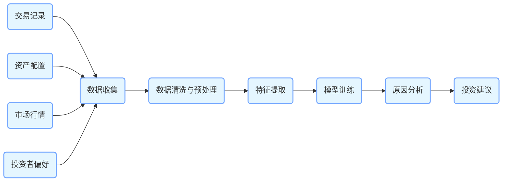

# 构建智能化的个人投资风格漂移原因分析系统

> 关键词：智能化、个人投资风格漂移、原因分析系统、机器学习、数据分析

> 摘要：本文聚焦于构建智能化的个人投资风格漂移原因分析系统。首先介绍了该系统构建的背景，包括目的、预期读者等内容。接着阐述了核心概念及联系，详细讲解了核心算法原理与具体操作步骤，并结合数学模型和公式进行说明。通过项目实战，给出了代码实际案例及详细解释。同时探讨了该系统的实际应用场景，推荐了相关的工具和资源。最后总结了未来发展趋势与挑战，还设置了附录解答常见问题，并提供了扩展阅读和参考资料，旨在为投资者和相关从业者提供一个全面且深入的关于构建此类系统的指导。

## 1. 背景介绍 
### 1.1 目的和范围
随着金融市场的不断发展和变化，个人投资者的投资风格也常常发生漂移。投资风格漂移可能会影响投资组合的风险和收益特征，进而影响投资者的长期投资目标。构建智能化的个人投资风格漂移原因分析系统的主要目的是帮助投资者更好地理解自己投资风格发生变化的原因，以便能够及时调整投资策略，实现更稳健的投资回报。

本系统的范围主要涵盖个人投资者在股票、基金等常见金融市场的投资行为。通过对投资者的交易记录、资产配置、市场环境等多方面数据的分析，挖掘投资风格漂移的潜在原因。

### 1.2 预期读者
- **个人投资者**：希望通过了解自己投资风格漂移的原因，优化投资组合，提高投资收益。
- **金融分析师**：借助系统分析结果，为客户提供更专业的投资建议。
- **金融科技企业开发者**：为开发相关金融分析软件或平台提供参考和技术思路。

### 1.3 文档结构概述
本文将按照以下结构进行阐述：首先介绍核心概念与联系，明确投资风格漂移等关键概念的原理和架构；接着详细讲解核心算法原理和具体操作步骤，并给出相应的 Python 代码；然后介绍数学模型和公式，并举例说明；通过项目实战展示代码实际案例和详细解释；探讨系统的实际应用场景；推荐相关的工具和资源；总结未来发展趋势与挑战；设置附录解答常见问题；最后提供扩展阅读和参考资料。

### 1.4 术语表
#### 1.4.1 核心术语定义
- **个人投资风格**：个人投资者在投资过程中表现出的相对稳定的投资偏好和行为模式，如价值投资、成长投资、均衡投资等。
- **投资风格漂移**：个人投资者的投资风格在一段时间内发生显著变化，偏离了原有的投资偏好和行为模式。
- **智能化分析系统**：利用人工智能技术，如机器学习、数据分析等，对投资数据进行自动处理和分析，以发现投资风格漂移原因的系统。

#### 1.4.2 相关概念解释
- **机器学习**：一门多领域交叉学科，涉及概率论、统计学、逼近论、凸分析、算法复杂度理论等多门学科。它专门研究计算机怎样模拟或实现人类的学习行为，以获取新的知识或技能，重新组织已有的知识结构使之不断改善自身的性能。在本系统中，机器学习算法可用于对投资数据进行分类、预测和关联分析等。
- **数据分析**：指用适当的统计分析方法对收集来的大量数据进行分析，将它们加以汇总和理解并消化，以求最大化地开发数据的功能，发挥数据的作用。在本系统中，数据分析可用于挖掘投资数据中的潜在信息和规律。

#### 1.4.3 缩略词列表
- **ML**：Machine Learning，机器学习
- **AI**：Artificial Intelligence，人工智能
- **PCA**：Principal Component Analysis，主成分分析

## 2. 核心概念与联系 

### 核心概念原理
个人投资风格漂移原因分析系统的核心原理是通过收集和整合个人投资者的多源数据，运用数据分析和机器学习技术，挖掘投资风格漂移与各种因素之间的关联。具体来说，系统会收集投资者的交易记录、资产配置、市场行情等数据，对这些数据进行清洗和预处理，然后利用机器学习算法进行特征提取和模型训练，最终找出导致投资风格漂移的关键因素。

### 架构示意图


在这个架构中，数据收集模块负责收集各种与投资相关的数据，包括交易记录、资产配置、市场行情和投资者偏好等。数据清洗与预处理模块对收集到的数据进行清洗和转换，以提高数据质量。特征提取模块从预处理后的数据中提取有价值的特征，用于模型训练。模型训练模块利用机器学习算法对特征数据进行训练，构建投资风格漂移原因分析模型。原因分析模块根据训练好的模型，分析导致投资风格漂移的原因。最后，根据分析结果生成投资建议，帮助投资者调整投资策略。

## 3. 核心算法原理 & 具体操作步骤 

### 核心算法原理
本系统主要使用决策树算法进行投资风格漂移原因分析。决策树是一种基于树结构进行决策的机器学习算法，它可以将数据集按照不同的特征进行划分，形成一棵决策树。每个内部节点表示一个特征上的测试，每个分支表示一个测试输出，每个叶节点表示一个类别或值。

决策树算法的核心思想是通过递归地选择最优特征进行划分，使得划分后的数据集在各个分支上的纯度尽可能高。常用的特征选择指标有信息增益、信息增益比和基尼指数等。

### 具体操作步骤
1. **数据收集**：收集个人投资者的交易记录、资产配置、市场行情等数据。
2. **数据清洗与预处理**：对收集到的数据进行清洗，去除缺失值、异常值等，然后进行数据标准化和编码等预处理操作。
3. **特征提取**：从预处理后的数据中提取与投资风格漂移相关的特征，如交易频率、持仓时间、资产集中度等。
4. **模型训练**：使用决策树算法对特征数据进行训练，构建投资风格漂移原因分析模型。
5. **模型评估**：使用测试数据集对训练好的模型进行评估，计算模型的准确率、召回率等指标。
6. **原因分析**：根据训练好的模型，分析导致投资风格漂移的关键因素。

### Python 代码实现
```python
import pandas as pd
from sklearn.model_selection import train_test_split
from sklearn.tree import DecisionTreeClassifier
from sklearn.metrics import accuracy_score

# 数据收集和预处理
data = pd.read_csv('investment_data.csv')  # 假设数据存储在 CSV 文件中
X = data.drop('style_drift', axis=1)  # 特征数据
y = data['style_drift']  # 标签数据

# 划分训练集和测试集
X_train, X_test, y_train, y_test = train_test_split(X, y, test_size=0.2, random_state=42)

# 模型训练
model = DecisionTreeClassifier()
model.fit(X_train, y_train)

# 模型预测
y_pred = model.predict(X_test)

# 模型评估
accuracy = accuracy_score(y_test, y_pred)
print(f"模型准确率: {accuracy}")

# 原因分析
feature_importances = model.feature_importances_
feature_names = X.columns
for i in range(len(feature_names)):
    print(f"{feature_names[i]} 的重要性: {feature_importances[i]}")
```

在上述代码中，首先使用 `pandas` 库读取投资数据，然后将数据划分为特征数据 `X` 和标签数据 `y`。接着使用 `train_test_split` 函数将数据划分为训练集和测试集。使用 `DecisionTreeClassifier` 类构建决策树模型，并使用训练集数据进行训练。使用训练好的模型对测试集数据进行预测，并计算模型的准确率。最后，通过 `feature_importances_` 属性获取每个特征的重要性，分析导致投资风格漂移的关键因素。

## 4. 数学模型和公式 & 详细讲解 & 举例说明 

### 信息增益
信息增益是决策树算法中常用的特征选择指标之一，它衡量了使用某个特征进行划分后，数据集的纯度提升程度。信息增益的计算公式如下：
$$
IG(D, A) = H(D) - H(D|A)
$$
其中，$IG(D, A)$ 表示使用特征 $A$ 对数据集 $D$ 进行划分的信息增益，$H(D)$ 表示数据集 $D$ 的信息熵，$H(D|A)$ 表示在已知特征 $A$ 的条件下，数据集 $D$ 的条件熵。

信息熵的计算公式如下：
$$
H(D) = -\sum_{k=1}^{K}p_k\log_2p_k
$$
其中，$K$ 表示数据集 $D$ 中类别标签的数量，$p_k$ 表示第 $k$ 个类别标签在数据集 $D$ 中出现的概率。

条件熵的计算公式如下：
$$
H(D|A) = \sum_{i=1}^{n}\frac{|D_i|}{|D|}H(D_i)
$$
其中，$n$ 表示特征 $A$ 的取值个数，$D_i$ 表示特征 $A$ 取值为第 $i$ 个值的数据集，$|D_i|$ 表示数据集 $D_i$ 的样本数量，$|D|$ 表示数据集 $D$ 的样本数量。

### 举例说明
假设我们有一个投资数据集 $D$，包含 10 个样本，其中 6 个样本的投资风格发生了漂移（标记为 1），4 个样本的投资风格未发生漂移（标记为 0）。现在我们考虑使用特征 $A$ 进行划分，特征 $A$ 有两个取值：$A_1$ 和 $A_2$。划分后，$A_1$ 对应的数据集 $D_1$ 包含 6 个样本，其中 4 个样本的投资风格发生了漂移，2 个样本的投资风格未发生漂移；$A_2$ 对应的数据集 $D_2$ 包含 4 个样本，其中 2 个样本的投资风格发生了漂移，2 个样本的投资风格未发生漂移。

首先计算数据集 $D$ 的信息熵：
$$
p_0 = \frac{4}{10} = 0.4, p_1 = \frac{6}{10} = 0.6
$$
$$
H(D) = -0.4\log_20.4 - 0.6\log_20.6 \approx 0.971
$$

然后计算数据集 $D_1$ 和 $D_2$ 的信息熵：
$$
p_{01} = \frac{2}{6} \approx 0.333, p_{11} = \frac{4}{6} \approx 0.667
$$
$$
H(D_1) = -0.333\log_20.333 - 0.667\log_20.667 \approx 0.918
$$
$$
p_{02} = \frac{2}{4} = 0.5, p_{12} = \frac{2}{4} = 0.5
$$
$$
H(D_2) = -0.5\log_20.5 - 0.5\log_20.5 = 1
$$

接着计算条件熵 $H(D|A)$：
$$
H(D|A) = \frac{6}{10}H(D_1) + \frac{4}{10}H(D_2) = \frac{6}{10} \times 0.918 + \frac{4}{10} \times 1 \approx 0.951
$$

最后计算信息增益 $IG(D, A)$：
$$
IG(D, A) = H(D) - H(D|A) = 0.971 - 0.951 = 0.02
$$

通过计算信息增益，我们可以评估使用特征 $A$ 进行划分的效果。信息增益越大，说明使用该特征进行划分后，数据集的纯度提升程度越高。

## 5. 项目实战：代码实际案例和详细解释说明 

### 5.1  开发环境搭建
- **操作系统**：推荐使用 Windows 10、macOS 或 Linux 系统。
- **Python 版本**：建议使用 Python 3.7 及以上版本。
- **开发工具**：可以使用 PyCharm、Jupyter Notebook 等开发工具。
- **所需库**：安装 `pandas`、`scikit-learn` 等库，可以使用以下命令进行安装：
```sh
pip install pandas scikit-learn
```

### 5.2  源代码详细实现和代码解读
```python
import pandas as pd
from sklearn.model_selection import train_test_split
from sklearn.tree import DecisionTreeClassifier
from sklearn.metrics import accuracy_score, classification_report
import matplotlib.pyplot as plt
from sklearn.tree import plot_tree

# 数据加载和预处理
def load_and_preprocess_data(file_path):
    data = pd.read_csv(file_path)
    # 处理缺失值
    data = data.dropna()
    # 分离特征和标签
    X = data.drop('style_drift', axis=1)
    y = data['style_drift']
    return X, y

# 模型训练和评估
def train_and_evaluate_model(X, y):
    # 划分训练集和测试集
    X_train, X_test, y_train, y_test = train_test_split(X, y, test_size=0.2, random_state=42)
    # 创建决策树模型
    model = DecisionTreeClassifier()
    # 模型训练
    model.fit(X_train, y_train)
    # 模型预测
    y_pred = model.predict(X_test)
    # 模型评估
    accuracy = accuracy_score(y_test, y_pred)
    report = classification_report(y_test, y_pred)
    print(f"模型准确率: {accuracy}")
    print("分类报告:")
    print(report)
    return model

# 可视化决策树
def visualize_decision_tree(model, feature_names):
    plt.figure(figsize=(20, 10))
    plot_tree(model, feature_names=feature_names, filled=True)
    plt.show()

# 主函数
def main():
    file_path = 'investment_data.csv'
    X, y = load_and_preprocess_data(file_path)
    model = train_and_evaluate_model(X, y)
    feature_names = X.columns
    visualize_decision_tree(model, feature_names)

if __name__ == "__main__":
    main()
```

### 代码解读与分析
- **数据加载和预处理**：`load_and_preprocess_data` 函数用于加载投资数据，并处理缺失值。然后将数据分离为特征数据 `X` 和标签数据 `y`。
- **模型训练和评估**：`train_and_evaluate_model` 函数将数据划分为训练集和测试集，使用决策树模型进行训练，并对模型进行评估。打印模型的准确率和分类报告。
- **可视化决策树**：`visualize_decision_tree` 函数使用 `matplotlib` 库和 `plot_tree` 函数将决策树模型可视化，帮助我们直观地理解模型的决策过程。
- **主函数**：`main` 函数调用上述函数，完成数据加载、模型训练、评估和可视化等操作。

## 6. 实际应用场景 
### 个人投资者自我分析
个人投资者可以使用该系统分析自己投资风格漂移的原因，了解自己在不同市场环境下的投资行为变化。例如，当市场行情发生剧烈波动时，投资者可能会不自觉地改变投资风格，通过系统分析可以找出导致这种变化的具体因素，如对某些行业的过度关注、恐慌情绪等。投资者可以根据分析结果调整自己的投资策略，避免因投资风格漂移而带来的风险。

### 金融机构客户服务
金融机构可以将该系统集成到客户服务平台中，为客户提供个性化的投资分析报告。通过分析客户的投资风格漂移原因，金融机构可以为客户提供更精准的投资建议，提高客户满意度和忠诚度。例如，对于投资风格漂移较大的客户，金融机构可以建议客户重新审视自己的投资目标和风险承受能力，调整投资组合。

### 金融监管机构风险监测
金融监管机构可以使用该系统对个人投资者的投资行为进行监测，及时发现潜在的金融风险。例如，当大量投资者同时出现投资风格漂移时，可能预示着市场存在不稳定因素。监管机构可以根据系统分析结果采取相应的监管措施，维护金融市场的稳定。

## 7. 工具和资源推荐
### 7.1 学习资源推荐
#### 7.1.1 书籍推荐
- 《机器学习》（周志华）：全面介绍了机器学习的基本概念、算法和应用，是学习机器学习的经典教材。
- 《Python 数据分析实战》（Sebastian Raschka）：结合 Python 语言，详细介绍了数据分析的方法和技巧，适合初学者入门。
- 《金融数据分析与挖掘》（Ruppert D.）：介绍了金融数据的特点和分析方法，以及如何使用数据分析和挖掘技术解决金融问题。

#### 7.1.2 在线课程
- Coursera 上的“Machine Learning”（Andrew Ng）：由斯坦福大学教授 Andrew Ng 主讲，是一门非常经典的机器学习课程。
- edX 上的“Data Science MicroMasters Program”：提供了一系列数据科学相关的课程，包括数据分析、机器学习、深度学习等。
- 网易云课堂上的“Python 金融数据分析实战”：结合金融领域的实际案例，介绍了如何使用 Python 进行金融数据分析。

#### 7.1.3 技术博客和网站
- 博客园：汇聚了大量的技术博客文章，涵盖了机器学习、数据分析等多个领域。
- 知乎：有很多关于金融科技、投资分析等方面的讨论和分享，可以从中获取很多有用的信息。
- Kaggle：一个数据科学竞赛平台，上面有很多金融数据分析相关的竞赛和数据集，可以通过参与竞赛提高自己的数据分析能力。

### 7.2 开发工具框架推荐
#### 7.2.1 IDE和编辑器
- PyCharm：一款专门为 Python 开发设计的集成开发环境，具有代码编辑、调试、自动补全、代码分析等功能，适合专业开发者使用。
- Jupyter Notebook：一个交互式的开发环境，可以将代码、文本、图表等内容整合在一起，方便进行数据分析和模型验证。
- Visual Studio Code：一款轻量级的代码编辑器，支持多种编程语言，具有丰富的插件生态系统，可以通过安装插件扩展其功能。

#### 7.2.2 调试和性能分析工具
- PDB：Python 自带的调试工具，可以在代码中设置断点，逐步执行代码，查看变量的值和程序的执行流程。
- cProfile：Python 标准库中的性能分析工具，可以统计程序中各个函数的执行时间和调用次数，帮助我们找出程序的性能瓶颈。
- Scikit-learn 的 `GridSearchCV`：用于模型调优的工具，可以通过网格搜索的方式寻找最优的模型参数。

#### 7.2.3 相关框架和库
- Pandas：一个强大的数据分析库，提供了数据结构和数据分析工具，方便进行数据清洗、预处理和分析。
- Scikit-learn：一个常用的机器学习库，提供了各种机器学习算法和工具，如分类、回归、聚类等。
- Matplotlib：一个用于数据可视化的库，可以绘制各种类型的图表，如折线图、柱状图、散点图等。

### 7.3 相关论文著作推荐
#### 7.3.1 经典论文
- “A Decision-Theoretic Generalization of On-Line Learning and an Application to Boosting”（Freund Y., Schapire R. E.）：介绍了 AdaBoost 算法的原理和应用，是机器学习领域的经典论文之一。
- “The Elements of Statistical Learning: Data Mining, Inference, and Prediction”（Hastie T., Tibshirani R., Friedman J.）：系统地介绍了统计学习的基本理论和方法，是学习机器学习和数据分析的重要参考书籍。
- “Financial Risk Prediction Using Machine Learning Techniques”（Bloznelis M., Gine E.）：探讨了如何使用机器学习技术进行金融风险预测，为金融领域的数据分析提供了重要的理论支持。

#### 7.3.2 最新研究成果
- 可以关注《Journal of Financial Economics》、《Review of Financial Studies》等金融领域的顶级期刊，以及《Journal of Machine Learning Research》、《Artificial Intelligence》等机器学习领域的知名期刊，了解最新的研究成果。
- 参加国际金融科技会议和机器学习会议，如 ACM SIGKDD、NeurIPS 等，与领域内的专家和学者交流，获取最新的研究动态。

#### 7.3.3 应用案例分析
- 《金融科技前沿应用案例》：收集了金融科技领域的各种应用案例，包括投资分析、风险管理、信贷评估等方面，可以从中学习到实际应用中的经验和方法。
- 各大金融机构和科技公司的官方网站，会发布一些关于金融科技应用的案例和报告，可以关注这些信息，了解行业的最新动态。

## 8. 总结：未来发展趋势与挑战
### 未来发展趋势
- **智能化程度不断提高**：随着人工智能技术的不断发展，个人投资风格漂移原因分析系统将更加智能化。系统将能够自动学习和适应不同投资者的投资行为和市场环境变化，提供更精准的分析结果和投资建议。
- **多源数据融合**：未来的系统将不仅仅依赖于传统的金融数据，还将融合社交媒体数据、新闻资讯数据等多源数据，从更广泛的角度分析投资风格漂移的原因。例如，通过分析社交媒体上的投资者情绪和热点话题，可以更好地理解投资者的心理变化对投资风格的影响。
- **个性化服务增强**：系统将为每个投资者提供个性化的分析报告和投资建议，根据投资者的投资目标、风险承受能力、投资经验等因素进行定制化服务。这样可以更好地满足投资者的个性化需求，提高投资决策的准确性和有效性。

### 挑战
- **数据质量和隐私问题**：系统的分析结果依赖于高质量的数据，但金融数据往往存在噪声、缺失值等问题，需要进行有效的数据清洗和预处理。同时，投资者的个人数据涉及隐私问题，如何在保证数据安全和隐私的前提下，充分利用数据进行分析是一个重要的挑战。
- **模型解释性**：机器学习模型，尤其是深度学习模型，往往具有较高的复杂度，其决策过程难以解释。在金融领域，模型的解释性非常重要，投资者需要了解系统是如何得出分析结果的。因此，如何提高模型的解释性是一个亟待解决的问题。
- **市场环境变化**：金融市场是一个复杂多变的系统，市场环境的变化可能导致投资风格漂移的原因发生改变。系统需要能够及时适应市场环境的变化，不断更新和优化模型，以保证分析结果的准确性和有效性。

## 9. 附录：常见问题与解答
### 问题 1：系统分析结果的准确性如何保证？
答：系统的分析结果准确性取决于多个因素，包括数据质量、特征选择、模型训练等。为了保证分析结果的准确性，我们需要对数据进行严格的清洗和预处理，选择合适的特征，并使用交叉验证等方法对模型进行评估和优化。同时，我们还需要不断更新和优化模型，以适应市场环境的变化。

### 问题 2：系统是否可以应用于其他金融市场？
答：系统的基本原理和方法可以应用于其他金融市场，如债券市场、期货市场等。但不同金融市场的特点和数据结构可能有所不同，需要对系统进行相应的调整和优化。例如，在债券市场中，可能需要考虑债券的信用评级、利率期限结构等因素。

### 问题 3：如何使用系统提供的投资建议？
答：系统提供的投资建议是基于数据分析和模型预测得出的，但投资决策还需要考虑投资者的个人情况和市场环境等因素。投资者应该将系统提供的投资建议作为参考，结合自己的投资目标、风险承受能力和投资经验等因素，做出合理的投资决策。

## 10. 扩展阅读 & 参考资料
### 扩展阅读
- 《量化投资：策略与技术》（丁鹏）：介绍了量化投资的基本概念、策略和技术，对于深入理解投资分析和决策有很大的帮助。
- 《人工智能时代的金融科技》（黄益平）：探讨了人工智能技术在金融领域的应用和发展趋势，为金融科技的研究和实践提供了新的思路。
- 《金融大数据分析》（王汉生）：详细介绍了金融大数据的特点和分析方法，以及如何使用大数据技术解决金融问题。

### 参考资料
- 相关金融数据库和 API，如 Wind 数据库、Tushare 等。
- 机器学习和数据分析相关的开源代码库，如 GitHub 上的相关项目。
- 金融监管机构发布的政策文件和报告，如中国人民银行、中国证监会等发布的相关文件。

作者：AI天才研究院/AI Genius Institute & 禅与计算机程序设计艺术 /Zen And The Art of Computer Programming