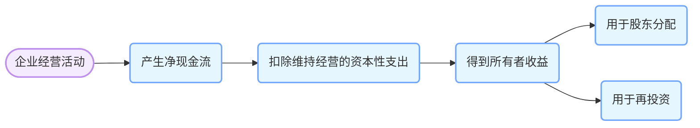

# 查尔斯·布兰登的所有者收益：股东视角的价值评估

> 关键词：查尔斯·布兰登、所有者收益、股东视角、价值评估、现金流分析

> 摘要：本文聚焦于查尔斯·布兰登提出的所有者收益概念，从股东视角出发深入探讨其在企业价值评估中的应用。首先介绍了所有者收益概念提出的背景和相关术语，阐述了核心概念及其联系，并给出了原理和架构的示意图与流程图。接着详细讲解了基于所有者收益进行价值评估的核心算法原理，用Python代码进行了实现，同时给出了相关的数学模型和公式并举例说明。通过项目实战案例，展示了如何搭建开发环境、实现源代码并进行解读分析。探讨了所有者收益在实际应用中的场景，推荐了学习该领域知识的工具和资源，包括书籍、在线课程、开发工具等。最后总结了未来发展趋势与挑战，解答了常见问题并提供了扩展阅读和参考资料，旨在为股东进行企业价值评估提供全面且深入的指导。

## 1. 背景介绍 
### 1.1 目的和范围
在企业投资和价值评估领域，准确衡量企业为股东创造的真实价值至关重要。查尔斯·布兰登提出的所有者收益概念，为股东提供了一个独特且实用的视角来评估企业价值。本文的目的在于深入剖析所有者收益的内涵、计算方法及其在股东价值评估中的应用，探讨其在不同市场环境和企业类型下的有效性和局限性。范围涵盖所有者收益的理论基础、核心算法、数学模型，以及通过实际案例展示其在项目实战中的应用，同时分析其在各种实际场景中的应用情况，并为相关研究和实践提供工具和资源推荐。

### 1.2 预期读者
本文预期读者主要包括对企业价值评估和投资决策感兴趣的股东、投资者、金融分析师、企业管理人员以及相关领域的研究人员。无论是专业的投资人士寻求更精准的评估方法，还是企业管理者希望从股东视角了解企业价值，亦或是研究人员探索企业价值评估的新理论和方法，都能从本文中获得有价值的信息和启示。

### 1.3 文档结构概述
本文共分为十个部分。第一部分为背景介绍，阐述了文章的目的、预期读者和文档结构，同时对相关术语进行了定义和解释。第二部分讲解核心概念与联系，通过文本示意图和Mermaid流程图展示所有者收益与其他相关概念的关系。第三部分详细介绍核心算法原理，并使用Python源代码进行说明。第四部分给出数学模型和公式，进行详细讲解并举例说明。第五部分通过项目实战，展示开发环境搭建、源代码实现和代码解读分析。第六部分探讨实际应用场景。第七部分推荐学习所需的工具和资源，包括书籍、在线课程、开发工具等。第八部分总结未来发展趋势与挑战。第九部分解答常见问题。第十部分提供扩展阅读和参考资料。

### 1.4 术语表
#### 1.4.1 核心术语定义
- **所有者收益**：指企业在一定期间内，能够向股东自由分配的现金流量。它考虑了企业维持现有经营水平所需的资本支出，反映了企业实际为股东创造的可支配财富。
- **净现金流**：企业在一定会计期间内，现金流入与现金流出的差额，是衡量企业现金收支状况的重要指标。
- **资本性支出**：企业为了维持或扩大生产经营规模，购置固定资产、无形资产等长期资产所发生的支出。

#### 1.4.2 相关概念解释
- **股东视角**：从股东的利益和需求出发，关注企业为股东创造价值的能力，包括企业的盈利能力、现金创造能力以及对股东的回报等方面。
- **价值评估**：通过一定的方法和模型，对企业的整体价值或股权价值进行估算，为投资决策、并购重组等提供参考依据。

#### 1.4.3 缩略词列表
- **FCF**：Free Cash Flow，自由现金流，与所有者收益概念密切相关，在某些情况下可近似认为是所有者收益。

## 2. 核心概念与联系 
### 核心概念原理
所有者收益的核心原理是基于股东对企业真实可支配现金的关注。企业的经营活动会产生现金流入，但同时也需要进行必要的资本支出以维持企业的正常运营和发展。所有者收益就是在扣除了维持现有经营水平所需的资本支出后，企业能够自由分配给股东的现金流量。它反映了企业在不损害未来经营能力的前提下，为股东创造的实际经济利益。

### 架构的文本示意图
```plaintext
企业经营活动
|
|-- 产生净现金流
|
|-- 扣除维持经营的资本性支出
|
|-- 得到所有者收益
|
|-- 用于股东分配或再投资
```

### Mermaid 流程图


## 3. 核心算法原理 & 具体操作步骤 
### 核心算法原理
所有者收益的计算主要基于以下公式：

所有者收益 = 净现金流 - 维持经营的资本性支出

其中，净现金流可以从企业的现金流量表中获取，通常为经营活动产生的现金流量净额。维持经营的资本性支出则需要对企业的固定资产投资、无形资产购置等进行分析和估算，以确定为了维持企业现有经营水平所需的资本投入。

### 具体操作步骤
1. **获取净现金流数据**：从企业的财务报表中找到经营活动产生的现金流量净额，这是计算所有者收益的基础数据。
2. **估算维持经营的资本性支出**：
    - 分析企业的历史资本支出情况，了解其在固定资产、无形资产等方面的投资规律。
    - 考虑企业所处行业的特点和发展趋势，判断未来维持经营所需的资本投入水平。
    - 可以参考同行业其他企业的资本支出情况，进行合理的估算。
3. **计算所有者收益**：将净现金流减去估算的维持经营的资本性支出，得到企业的所有者收益。

### Python 源代码实现
```python
def calculate_owner_earnings(net_cash_flow, capital_expenditure):
    """
    计算所有者收益
    :param net_cash_flow: 净现金流
    :param capital_expenditure: 维持经营的资本性支出
    :return: 所有者收益
    """
    return net_cash_flow - capital_expenditure

# 示例数据
net_cash_flow = 1000000  # 净现金流为 100 万
capital_expenditure = 200000  # 维持经营的资本性支出为 20 万

owner_earnings = calculate_owner_earnings(net_cash_flow, capital_expenditure)
print(f"所有者收益为: {owner_earnings}")
```
### 代码解释
上述代码定义了一个名为 `calculate_owner_earnings` 的函数，该函数接受两个参数：`net_cash_flow` 表示净现金流，`capital_expenditure` 表示维持经营的资本性支出。函数内部通过简单的减法运算计算所有者收益，并将结果返回。在示例中，我们假设净现金流为 100 万，维持经营的资本性支出为 20 万，调用函数计算得到所有者收益并打印输出。

## 4. 数学模型和公式 & 详细讲解 & 举例说明 
### 数学模型和公式
所有者收益的数学模型可以表示为：

$$OE = NC - CE$$

其中，$OE$ 表示所有者收益（Owner Earnings），$NC$ 表示净现金流（Net Cash Flow），$CE$ 表示维持经营的资本性支出（Capital Expenditure）。

### 详细讲解
净现金流 $NC$ 反映了企业在一定期间内通过经营活动实际获得的现金流入与现金流出的差额，是企业现金创造能力的重要体现。维持经营的资本性支出 $CE$ 是为了确保企业能够持续正常运营，保持现有生产能力和市场竞争力所需的资本投入。从净现金流中扣除这部分支出后，得到的所有者收益 $OE$ 才是企业真正可以自由分配给股东的现金流量。

### 举例说明
假设一家制造企业在某一年度的经营活动产生的现金流量净额为 500 万元，经过分析估算，为了维持现有生产设备的正常运转和生产规模，需要投入 100 万元用于设备更新和维护等资本性支出。则该企业在这一年度的所有者收益为：

$$OE = 500 - 100 = 400 \text{（万元）}$$

这意味着在扣除维持经营所需的资本支出后，企业在该年度有 400 万元的现金可以自由分配给股东，或者用于企业的再投资以实现进一步的发展。

## 5. 项目实战：代码实际案例和详细解释说明 
### 5.1  开发环境搭建
#### 操作系统
可以选择常见的操作系统，如 Windows、Linux 或 macOS。这里以 Windows 10 为例进行说明。

#### 编程语言和环境
使用 Python 作为开发语言，建议安装 Python 3.7 及以上版本。可以从 Python 官方网站（https://www.python.org/downloads/）下载安装包进行安装。安装完成后，配置好环境变量，确保可以在命令行中正常使用 Python。

#### 开发工具
推荐使用 PyCharm 作为集成开发环境（IDE），它提供了丰富的功能，如代码编辑、调试、自动补全、版本控制等。可以从 JetBrains 官方网站（https://www.jetbrains.com/pycharm/download/）下载适合自己操作系统的版本进行安装。

#### 所需库的安装
在项目中，我们可能需要使用一些第三方库来处理财务数据，如 Pandas 用于数据处理和分析，Numpy 用于数值计算。可以使用以下命令在命令行中安装这些库：

```sh
pip install pandas numpy
```

### 5.2  源代码详细实现和代码解读
#### 数据准备
假设我们有一个包含企业净现金流和资本性支出数据的 CSV 文件 `financial_data.csv`，文件内容如下：

| 年份 | 净现金流 | 资本性支出 |
|------|----------|------------|
| 2018 | 800000   | 150000     |
| 2019 | 900000   | 180000     |
| 2020 | 1000000  | 200000     |
| 2021 | 1100000  | 220000     |
| 2022 | 1200000  | 250000     |

#### 代码实现
```python
import pandas as pd

def calculate_owner_earnings(net_cash_flow, capital_expenditure):
    """
    计算所有者收益
    :param net_cash_flow: 净现金流
    :param capital_expenditure: 维持经营的资本性支出
    :return: 所有者收益
    """
    return net_cash_flow - capital_expenditure

def analyze_financial_data(file_path):
    """
    分析财务数据，计算每年的所有者收益
    :param file_path: 财务数据文件路径
    :return: 包含所有者收益的 DataFrame
    """
    # 读取 CSV 文件
    data = pd.read_csv(file_path)
    
    # 计算每年的所有者收益
    data['所有者收益'] = calculate_owner_earnings(data['净现金流'], data['资本性支出'])
    
    return data

# 调用函数进行数据分析
file_path = 'financial_data.csv'
result = analyze_financial_data(file_path)

# 打印结果
print(result)
```

#### 代码解读
1. **导入必要的库**：导入 `pandas` 库用于数据处理和分析。
2. **定义计算所有者收益的函数**：`calculate_owner_earnings` 函数接受净现金流和资本性支出作为参数，返回计算得到的所有者收益。
3. **定义分析财务数据的函数**：`analyze_financial_data` 函数接受财务数据文件的路径作为参数，使用 `pandas` 的 `read_csv` 函数读取 CSV 文件，然后调用 `calculate_owner_earnings` 函数计算每年的所有者收益，并将结果添加到 DataFrame 中，最后返回包含所有者收益的 DataFrame。
4. **调用函数进行数据分析**：指定财务数据文件的路径，调用 `analyze_financial_data` 函数进行数据分析，并将结果存储在 `result` 变量中。
5. **打印结果**：打印包含所有者收益的 DataFrame，展示每年的净现金流、资本性支出和所有者收益数据。

### 5.3  代码解读与分析
#### 数据处理流程
代码通过 `pandas` 库读取 CSV 文件中的财务数据，将其存储在 DataFrame 中。然后，对 DataFrame 中的每一行数据，调用 `calculate_owner_earnings` 函数计算所有者收益，并将结果添加到新的列中。最后，返回包含所有者收益的 DataFrame，方便后续的分析和可视化。

#### 代码的可扩展性
该代码具有一定的可扩展性。如果需要处理更复杂的财务数据，例如包含多个企业的财务数据，可以修改 `analyze_financial_data` 函数，添加对不同企业数据的分组处理逻辑。如果需要进行更深入的数据分析，例如计算所有者收益的增长率、平均值等，可以在返回 DataFrame 后，使用 `pandas` 提供的各种统计方法进行进一步的计算。

## 6. 实际应用场景 
### 投资决策
在股票投资中，股东可以使用所有者收益来评估企业的真实价值。通过比较不同企业的所有者收益水平及其增长趋势，投资者可以选择具有较高投资价值的企业。例如，如果一家企业的所有者收益持续增长，说明该企业具有较强的盈利能力和现金创造能力，可能是一个较好的投资标的。

### 企业估值
在企业并购、重组等交易中，所有者收益可以作为一种重要的估值指标。通过预测企业未来的所有者收益，并使用适当的折现率将其折现到当前，得到企业的内在价值。这种估值方法考虑了企业的现金创造能力和资本支出情况，更能反映企业的真实价值。

### 业绩评估
企业管理者可以使用所有者收益来评估企业的经营业绩。与传统的会计利润指标相比，所有者收益更注重企业的现金流量和实际为股东创造的价值。通过分析所有者收益的变化情况，管理者可以了解企业的经营效率和盈利能力，发现经营过程中存在的问题，并采取相应的措施进行改进。

### 分红政策制定
股东和企业管理者在制定分红政策时，可以参考所有者收益的水平。如果企业的所有者收益较高，说明企业有足够的现金可以分配给股东，此时可以适当提高分红比例；反之，如果所有者收益较低，企业可能需要保留更多的现金用于再投资，以维持企业的发展。

## 7. 工具和资源推荐
### 7.1 学习资源推荐
#### 7.1.1 书籍推荐
- 《聪明的投资者》（The Intelligent Investor）：作者本杰明·格雷厄姆（Benjamin Graham），被誉为投资领域的圣经，书中介绍了价值投资的基本理念和方法，对理解所有者收益和企业价值评估具有重要的指导意义。
- 《巴菲特致股东的信：股份公司教程》（Letters to Shareholders of Berkshire Hathaway）：作者沃伦·巴菲特（Warren Buffett），收录了巴菲特多年来写给股东的信，其中包含了他对企业价值评估、投资决策等方面的深刻见解，对学习所有者收益的应用有很大的帮助。
- 《财务报表分析与证券定价》（Financial Statement Analysis and Security Valuation）：作者斯蒂芬·佩因曼（Stephen H. Penman），系统地介绍了财务报表分析的方法和技术，以及如何利用财务信息进行证券定价，对于深入理解所有者收益的计算和应用具有重要的参考价值。

#### 7.1.2 在线课程
- Coursera 平台上的“财务分析与决策”课程：由知名教授授课，涵盖了财务报表分析、财务比率分析、企业估值等内容，通过案例分析和实践操作，帮助学员掌握财务分析的方法和技巧，理解所有者收益在企业价值评估中的应用。
- edX 平台上的“投资学原理”课程：介绍了投资领域的基本概念、理论和方法，包括股票投资、债券投资、投资组合管理等内容，其中涉及到企业价值评估和所有者收益的相关知识，适合对投资感兴趣的学员学习。

#### 7.1.3 技术博客和网站
- Seeking Alpha（https://seekingalpha.com/）：一个提供金融市场分析和投资建议的网站，上面有许多专业的分析师和投资者分享对企业的分析和研究报告，其中不乏关于所有者收益和企业价值评估的内容。
- 雪球（https://xueqiu.com/）：国内知名的投资社区，聚集了大量的投资者和金融从业者，用户可以在上面交流投资经验、分享研究成果，了解关于所有者收益和企业价值评估的最新观点和案例。

### 7.2 开发工具框架推荐
#### 7.2.1 IDE和编辑器
- PyCharm：功能强大的 Python 集成开发环境，提供了丰富的代码编辑、调试、自动补全、版本控制等功能，适合进行 Python 数据分析和开发。
- Jupyter Notebook：一个交互式的开发环境，支持 Python、R 等多种编程语言，方便进行数据探索、分析和可视化，对于处理财务数据和进行所有者收益的计算和分析非常有用。

#### 7.2.2 调试和性能分析工具
- PDB：Python 内置的调试器，可以帮助开发者在代码运行过程中进行调试，定位和解决问题。
- cProfile：Python 标准库中的性能分析工具，可以统计代码中各个函数的执行时间和调用次数，帮助开发者优化代码性能。

#### 7.2.3 相关框架和库
- Pandas：用于数据处理和分析的 Python 库，提供了高效的数据结构和数据操作方法，适合处理财务数据和进行所有者收益的计算和分析。
- Numpy：用于数值计算的 Python 库，提供了丰富的数值计算函数和数据结构，在处理大规模财务数据时可以提高计算效率。
- Matplotlib：用于数据可视化的 Python 库，可以绘制各种类型的图表，如折线图、柱状图、散点图等，帮助开发者直观地展示财务数据和所有者收益的变化情况。

### 7.3 相关论文著作推荐
#### 7.3.1 经典论文
- “The Theory of Investment Value” by John Burr Williams：该论文提出了现金流折现模型，为企业价值评估提供了重要的理论基础，对理解所有者收益的概念和应用具有重要的启示作用。
- “Financial Ratios, Discriminant Analysis and the Prediction of Corporate Bankruptcy” by Edward I. Altman：该论文介绍了 Altman Z-Score 模型，用于预测企业破产的可能性，在企业财务分析和价值评估中具有广泛的应用，与所有者收益的分析和评估也有一定的关联。

#### 7.3.2 最新研究成果
- 近年来，一些学者在所有者收益的计算方法、应用范围和影响因素等方面进行了深入的研究。例如，有研究探讨了如何更准确地估算维持经营的资本性支出，以及所有者收益在不同行业和市场环境下的变化规律。可以通过学术数据库（如知网、万方、Web of Science 等）搜索相关的研究论文，了解该领域的最新研究成果。

#### 7.3.3 应用案例分析
- 一些专业的金融研究机构和咨询公司会发布关于企业价值评估和所有者收益应用的案例分析报告。例如，麦肯锡公司的研究报告中经常会涉及到对企业财务状况和价值的分析，其中可能会包括所有者收益的计算和应用案例。可以通过这些案例分析，学习如何在实际项目中运用所有者收益进行企业价值评估和投资决策。

## 8. 总结：未来发展趋势与挑战
### 未来发展趋势
#### 智能化分析工具的应用
随着人工智能和机器学习技术的不断发展，未来可能会出现更多智能化的分析工具，用于计算和分析所有者收益。这些工具可以自动处理大量的财务数据，提高计算的准确性和效率，同时还可以通过机器学习算法对企业的未来所有者收益进行预测，为投资者和企业管理者提供更有价值的决策支持。

#### 跨学科融合的趋势
所有者收益的评估不仅涉及到财务领域的知识，还与经济学、管理学、统计学等多个学科密切相关。未来，跨学科融合的趋势将更加明显，研究者和从业者需要综合运用多个学科的理论和方法，才能更准确地评估企业的所有者收益和价值。

#### 国际标准和规范的完善
随着全球经济一体化的发展，企业的跨国投资和并购活动日益频繁。为了提高所有者收益评估的可比性和一致性，未来可能会制定更加统一的国际标准和规范。这些标准和规范将有助于投资者和企业管理者在全球范围内进行企业价值评估和投资决策。

### 挑战
#### 数据质量和可靠性
所有者收益的计算依赖于准确的财务数据，然而，财务数据的质量和可靠性可能会受到多种因素的影响，如企业的会计政策选择、财务造假等。如何获取高质量、可靠的财务数据，并对其进行有效的验证和分析，是所有者收益评估面临的一个重要挑战。

#### 资本性支出的估算难度
维持经营的资本性支出是计算所有者收益的关键因素之一，但准确估算这部分支出并不容易。企业的资本性支出受到多种因素的影响，如技术进步、市场竞争、行业发展趋势等，这些因素的不确定性增加了资本性支出估算的难度。

#### 市场环境的不确定性
所有者收益的评估和应用需要考虑市场环境的变化，如宏观经济形势、行业竞争格局、政策法规等。市场环境的不确定性使得企业的未来现金流量和资本支出具有较大的波动性，增加了所有者收益评估的难度和风险。

## 9. 附录：常见问题与解答
### 问题 1：所有者收益与净利润有什么区别？
净利润是按照会计准则计算得出的企业盈利指标，它考虑了企业的收入、成本、费用等因素，但没有考虑企业的现金流量和资本支出情况。而所有者收益则更注重企业的现金创造能力和实际为股东创造的可支配财富，它扣除了维持经营所需的资本性支出，更能反映企业的真实价值。

### 问题 2：如何准确估算维持经营的资本性支出？
估算维持经营的资本性支出需要综合考虑企业的历史资本支出情况、行业特点、技术进步等因素。可以参考企业的固定资产折旧政策、设备更新计划等，分析企业为了维持现有生产能力和市场竞争力所需的资本投入。同时，也可以参考同行业其他企业的资本支出情况，进行合理的估算。

### 问题 3：所有者收益在不同行业的应用有什么差异？
不同行业的企业在经营模式、资本结构、技术水平等方面存在差异，因此所有者收益在不同行业的应用也会有所不同。例如，制造业企业通常需要大量的固定资产投资，资本性支出较高，所有者收益的计算和评估需要更加关注固定资产的更新和维护；而服务业企业的资本性支出相对较低，所有者收益的计算可能更多地关注企业的经营现金流和市场份额。

### 问题 4：所有者收益可以用于短期投资决策吗？
所有者收益主要反映企业的长期价值创造能力，更适合用于长期投资决策。在短期投资决策中，市场情绪、宏观经济政策等因素可能对股价产生较大的影响，而所有者收益的变化相对较为缓慢。因此，在短期投资决策中，需要综合考虑多种因素，不能仅仅依赖所有者收益指标。

## 10. 扩展阅读 & 参考资料
### 扩展阅读
- 《估值：难点、解决方案及相关案例》（Valuation: Measuring and Managing the Value of Companies）：本书详细介绍了企业估值的方法和技术，包括现金流折现模型、相对估值法等，对深入理解所有者收益在企业估值中的应用具有重要的参考价值。
- 《投资最重要的事》（The Most Important Thing Illuminated: Uncommon Sense for the Thoughtful Investor）：作者霍华德·马克斯（Howard Marks）分享了自己在投资领域的经验和见解，强调了理解企业价值和风险的重要性，对于学习所有者收益和投资决策具有一定的启发作用。

### 参考资料
- 企业财务报表：企业的年度报告、季度报告等财务报表是获取净现金流和资本性支出数据的重要来源。
- 财经新闻和研究报告：财经媒体和研究机构发布的新闻和研究报告可以提供有关企业经营状况、行业发展趋势等方面的信息，有助于分析和评估所有者收益。
- 学术数据库：如知网、万方、Web of Science 等学术数据库，可以搜索到关于所有者收益和企业价值评估的相关学术论文，了解该领域的最新研究成果和理论方法。

作者：AI天才研究院/AI Genius Institute & 禅与计算机程序设计艺术 /Zen And The Art of Computer Programming