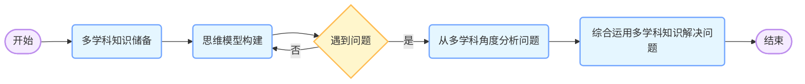

# 查理芒格的跨学科思维方法

> 关键词：查理芒格、跨学科思维方法、多学科知识、决策、认知升级

> 摘要：本文深入探讨了查理芒格的跨学科思维方法。查理芒格作为投资界的传奇人物，其跨学科思维方法对解决复杂问题、做出明智决策具有重大意义。文章从背景介绍入手，阐述了该思维方法的目的、适用读者、文档结构等。接着详细解析了核心概念与联系，包括其原理和架构，并给出了直观的示意图和流程图。在核心算法原理部分，用Python代码辅助说明思维流程。通过数学模型和公式进一步剖析其内在逻辑，并举例说明。项目实战环节展示了如何在实际中运用该思维方法，包括开发环境搭建、代码实现和解读。同时探讨了其实际应用场景，推荐了相关的学习资源、开发工具和论文著作。最后总结了该思维方法的未来发展趋势与挑战，解答常见问题，并提供扩展阅读和参考资料，帮助读者全面深入理解查理芒格的跨学科思维方法。

## 1. 背景介绍 
### 1.1 目的和范围
查理芒格的跨学科思维方法旨在打破学科之间的壁垒，将多个学科的知识和方法融合起来，以更全面、深入地理解和解决现实世界中的复杂问题。本文章的目的在于详细解析这一思维方法，让读者了解其原理、操作步骤和实际应用。范围涵盖了从基本概念的讲解到在不同领域的具体运用，包括投资、商业决策、日常生活等多个方面。

### 1.2 预期读者
本文预期读者包括对投资、商业决策、个人成长等领域感兴趣的人士，无论是专业的投资者、企业管理者，还是普通的学生和职场人士，都能从查理芒格的跨学科思维方法中获得启发，提升自己解决问题的能力和决策水平。

### 1.3 文档结构概述
本文将按照以下结构展开：首先介绍跨学科思维方法的核心概念与联系，让读者对其有初步的认识；接着阐述核心算法原理和具体操作步骤，通过Python代码详细说明；然后用数学模型和公式进一步剖析其内在逻辑，并举例说明；在项目实战部分，展示如何在实际中运用该思维方法；探讨其实际应用场景；推荐相关的学习资源、开发工具和论文著作；最后总结未来发展趋势与挑战，解答常见问题，并提供扩展阅读和参考资料。

### 1.4 术语表
#### 1.4.1 核心术语定义
- **跨学科思维方法**：指将不同学科的知识、理论和方法进行整合，运用到具体问题的分析和解决中，以获得更全面、深入的理解和更有效的解决方案。
- **思维模型**：是对现实世界中事物或现象的一种抽象表示，它可以帮助我们简化复杂的问题，更好地理解和预测事物的发展。
- **格栅理论**：查理芒格提出的一种思维模型，将不同学科的重要理论和原理比喻成格栅的一根根木条，通过将这些木条组合起来，形成一个完整的思维框架，用于分析和解决问题。

#### 1.4.2 相关概念解释
- **学科融合**：不同学科之间相互交流、相互渗透，形成新的知识和方法。跨学科思维方法是学科融合在思维层面的体现。
- **多元思维**：从多个角度、多个层面思考问题，避免单一思维方式的局限性。跨学科思维方法是多元思维的一种具体实现方式。

#### 1.4.3 缩略词列表
本文暂无缩略词。

## 2. 核心概念与联系 

### 核心概念原理
查理芒格的跨学科思维方法基于这样一个原理：现实世界中的问题往往是复杂的，单一学科的知识和方法往往无法全面、深入地解决这些问题。因此，需要将多个学科的知识和方法融合起来，形成一个综合性的思维框架。

例如，在投资领域，不仅需要掌握经济学、金融学的知识，还需要了解心理学、社会学、历史学等学科的知识。经济学和金融学可以帮助我们分析市场趋势、评估企业价值；心理学可以帮助我们理解投资者的行为和心理，避免受到情绪的影响；社会学和历史学可以帮助我们了解社会发展的规律和趋势，为投资决策提供更宏观的视角。

### 架构的文本示意图
```plaintext
跨学科思维方法
|-- 多学科知识储备
|   |-- 自然科学（物理学、化学、生物学等）
|   |-- 社会科学（经济学、金融学、心理学等）
|   |-- 人文科学（历史学、哲学、文学等）
|-- 思维模型构建
|   |-- 各学科重要理论和原理
|   |-- 格栅理论
|-- 问题分析与解决
|   |-- 从多个学科角度分析问题
|   |-- 综合运用多学科知识解决问题
```

### Mermaid 流程图


这个流程图展示了跨学科思维方法的基本流程。首先需要进行多学科知识储备，然后构建思维模型。当遇到问题时，从多个学科的角度对问题进行分析，最后综合运用多学科的知识来解决问题。如果没有遇到问题，则继续完善思维模型。

## 3. 核心算法原理 & 具体操作步骤 

### 核心算法原理
我们可以将跨学科思维方法的核心算法原理用以下步骤来表示：

1. **知识收集**：从多个学科中收集相关的知识和信息。
2. **模型构建**：将收集到的知识和信息转化为思维模型。
3. **问题映射**：将实际问题映射到已构建的思维模型中。
4. **多学科分析**：从多个学科的角度对问题进行分析。
5. **综合决策**：综合多学科的分析结果，做出决策。

### Python 代码实现
```python
# 模拟多学科知识储备
knowledge_base = {
    "economics": ["Supply and demand theory", "Cost - benefit analysis"],
    "psychology": ["Cognitive biases", "Motivation theory"],
    "history": ["Historical trends", "Lessons from the past"]
}

# 模拟思维模型构建
def build_models(knowledge_base):
    models = {}
    for subject, knowledge_list in knowledge_base.items():
        for knowledge in knowledge_list:
            models[knowledge] = subject
    return models

# 模拟问题映射和多学科分析
def analyze_problem(problem, models):
    relevant_knowledge = []
    for knowledge, subject in models.items():
        if knowledge.lower() in problem.lower():
            relevant_knowledge.append((knowledge, subject))
    return relevant_knowledge

# 模拟综合决策
def make_decision(analysis_result):
    decision = "Based on the following knowledge from different disciplines: "
    for knowledge, subject in analysis_result:
        decision += f"{knowledge} from {subject}, "
    decision = decision.rstrip(", ")
    return decision

# 示例问题
problem = "We need to make a business decision considering supply and demand and cognitive biases."

# 构建思维模型
models = build_models(knowledge_base)

# 分析问题
analysis_result = analyze_problem(problem, models)

# 做出决策
decision = make_decision(analysis_result)

print(decision)
```

### 代码解释
1. **知识收集**：通过 `knowledge_base` 字典模拟了从经济学、心理学和历史学三个学科中收集的知识和信息。
2. **模型构建**：`build_models` 函数将收集到的知识和信息转化为思维模型，用一个字典表示，键为知识，值为所属学科。
3. **问题映射**：`analyze_problem` 函数将实际问题与已构建的思维模型进行匹配，找出与问题相关的知识和所属学科。
4. **多学科分析**：在 `analyze_problem` 函数中，通过遍历思维模型，找出与问题相关的知识，实现了从多个学科的角度对问题进行分析。
5. **综合决策**：`make_decision` 函数综合多学科的分析结果，生成一个决策信息。

## 4. 数学模型和公式 & 详细讲解 & 举例说明 

### 数学模型
我们可以用一个简单的数学模型来表示跨学科思维方法。假设我们有 $n$ 个学科，每个学科有 $m_i$ 个知识要素，用向量 $\mathbf{K}_i$ 表示第 $i$ 个学科的知识要素集合，其中 $\mathbf{K}_i = (k_{i1}, k_{i2}, \cdots, k_{im_i})$。

问题 $P$ 可以表示为一个向量 $\mathbf{P} = (p_1, p_2, \cdots, p_s)$，其中 $p_j$ 是问题的一个特征。

我们可以定义一个关联函数 $f(\mathbf{P}, \mathbf{K}_i)$ 来表示问题 $P$ 与第 $i$ 个学科的知识要素集合 $\mathbf{K}_i$ 的关联程度。

最终的决策 $D$ 可以表示为：

$$D = g(f(\mathbf{P}, \mathbf{K}_1), f(\mathbf{P}, \mathbf{K}_2), \cdots, f(\mathbf{P}, \mathbf{K}_n))$$

其中 $g$ 是一个综合函数，用于综合各个学科的关联程度，做出决策。

### 详细讲解
- **知识要素集合**：每个学科都有其独特的知识要素，这些知识要素可以是理论、原理、方法等。例如，经济学的知识要素可能包括供求理论、成本效益分析等；心理学的知识要素可能包括认知偏差、动机理论等。
- **问题特征**：问题可以分解为多个特征，这些特征可以帮助我们从不同的角度理解问题。例如，在商业决策中，问题的特征可能包括市场需求、竞争状况、成本结构等。
- **关联函数**：关联函数用于衡量问题与各个学科的知识要素集合的关联程度。关联程度越高，说明该学科的知识对解决问题越有帮助。关联函数可以根据具体情况进行定义，例如可以使用相似度计算、匹配度计算等方法。
- **综合函数**：综合函数用于综合各个学科的关联程度，做出最终的决策。综合函数可以是加权求和、投票等方法。

### 举例说明
假设我们要解决一个关于新产品定价的问题 $P$，问题的特征包括市场需求、成本结构、竞争对手价格等。

我们有三个学科的知识要素集合：
- 经济学：$\mathbf{K}_1 =$ (供求理论, 成本效益分析)
- 心理学：$\mathbf{K}_2 =$ (消费者心理定价策略, 价格敏感度)
- 市场营销学：$\mathbf{K}_3 =$ (市场定位, 品牌价值)

我们可以定义关联函数 $f$ 为特征匹配度，即如果问题的某个特征与某个学科的知识要素匹配，则关联程度为 1，否则为 0。

例如，问题 $P$ 的市场需求特征与经济学的供求理论匹配，成本结构特征与经济学的成本效益分析匹配，消费者心理特征与心理学的消费者心理定价策略匹配，品牌定位特征与市场营销学的市场定位匹配。

则 $f(\mathbf{P}, \mathbf{K}_1) = 2$，$f(\mathbf{P}, \mathbf{K}_2) = 1$，$f(\mathbf{P}, \mathbf{K}_3) = 1$。

假设综合函数 $g$ 为加权求和，权重分别为 $w_1 = 0.5$，$w_2 = 0.25$，$w_3 = 0.25$。

则最终的决策 $D$ 为：

$$D = 0.5\times2 + 0.25\times1 + 0.25\times1 = 1.5$$

这个结果表示在定价决策中，经济学的知识起到了主要作用，同时也需要考虑心理学和市场营销学的知识。

## 5. 项目实战：代码实际案例和详细解释说明 

### 5.1 开发环境搭建
在这个项目实战中，我们将使用 Python 语言进行开发。以下是搭建开发环境的步骤：

1. **安装 Python**：从 Python 官方网站（https://www.python.org/downloads/）下载并安装 Python 3.x 版本。
2. **安装开发工具**：推荐使用 PyCharm 作为开发工具，它是一款功能强大的 Python 集成开发环境（IDE）。可以从 JetBrains 官方网站（https://www.jetbrains.com/pycharm/download/）下载并安装。
3. **创建虚拟环境**：为了避免不同项目之间的依赖冲突，建议创建一个虚拟环境。可以使用 `venv` 模块来创建虚拟环境。在命令行中执行以下命令：
```sh
python -m venv myenv
```
其中 `myenv` 是虚拟环境的名称。
4. **激活虚拟环境**：在命令行中执行以下命令激活虚拟环境：
- 在 Windows 系统中：
```sh
myenv\Scripts\activate
```
- 在 Linux 或 macOS 系统中：
```sh
source myenv/bin/activate
```

### 5.2 源代码详细实现和代码解读
```python
# 模拟多学科知识储备
knowledge_base = {
    "economics": ["Supply and demand theory", "Cost - benefit analysis"],
    "psychology": ["Cognitive biases", "Motivation theory"],
    "history": ["Historical trends", "Lessons from the past"]
}

# 模拟思维模型构建
def build_models(knowledge_base):
    models = {}
    for subject, knowledge_list in knowledge_base.items():
        for knowledge in knowledge_list:
            models[knowledge] = subject
    return models

# 模拟问题映射和多学科分析
def analyze_problem(problem, models):
    relevant_knowledge = []
    for knowledge, subject in models.items():
        if knowledge.lower() in problem.lower():
            relevant_knowledge.append((knowledge, subject))
    return relevant_knowledge

# 模拟综合决策
def make_decision(analysis_result):
    decision = "Based on the following knowledge from different disciplines: "
    for knowledge, subject in analysis_result:
        decision += f"{knowledge} from {subject}, "
    decision = decision.rstrip(", ")
    return decision

# 主函数
def main():
    # 示例问题
    problem = "We need to make a business decision considering supply and demand and cognitive biases."

    # 构建思维模型
    models = build_models(knowledge_base)

    # 分析问题
    analysis_result = analyze_problem(problem, models)

    # 做出决策
    decision = make_decision(analysis_result)

    print(decision)

if __name__ == "__main__":
    main()
```

### 代码解读与分析
1. **知识储备**：`knowledge_base` 字典模拟了从经济学、心理学和历史学三个学科中收集的知识和信息。每个学科对应一个知识列表。
2. **思维模型构建**：`build_models` 函数将知识储备转化为思维模型。通过遍历 `knowledge_base` 字典，将每个知识与其所属学科关联起来，存储在 `models` 字典中。
3. **问题分析**：`analyze_problem` 函数将实际问题与思维模型进行匹配。通过遍历 `models` 字典，检查问题中是否包含某个知识，如果包含，则将该知识及其所属学科添加到 `relevant_knowledge` 列表中。
4. **综合决策**：`make_decision` 函数根据问题分析的结果，生成一个决策信息。将相关知识及其所属学科拼接成一个字符串，并去除末尾的逗号。
5. **主函数**：`main` 函数是程序的入口点。定义了一个示例问题，调用 `build_models` 函数构建思维模型，调用 `analyze_problem` 函数分析问题，调用 `make_decision` 函数做出决策，并打印决策信息。

通过这个项目实战，我们可以看到如何运用跨学科思维方法来解决实际问题。在实际应用中，我们可以根据具体问题和需求，扩展知识储备和思维模型，提高决策的准确性和有效性。

## 6. 实际应用场景 
### 投资领域
在投资领域，跨学科思维方法具有重要的应用价值。投资者不仅需要掌握经济学、金融学的知识，还需要了解心理学、社会学、历史学等学科的知识。

- **经济学和金融学**：可以帮助投资者分析市场趋势、评估企业价值。例如，通过供求理论分析市场的供需关系，通过财务分析评估企业的盈利能力和财务状况。
- **心理学**：可以帮助投资者理解投资者的行为和心理，避免受到情绪的影响。例如，了解认知偏差可以帮助投资者避免盲目跟风、过度自信等错误决策。
- **社会学和历史学**：可以帮助投资者了解社会发展的规律和趋势，为投资决策提供更宏观的视角。例如，研究历史上的经济周期和市场波动，可以帮助投资者更好地应对当前的市场变化。

### 商业决策领域
在商业决策中，跨学科思维方法可以帮助企业管理者全面、深入地分析问题，做出更明智的决策。

- **市场营销**：需要结合心理学、社会学等学科的知识，了解消费者的需求和行为，制定有效的营销策略。例如，通过消费者心理定价策略，根据消费者的心理预期和价格敏感度来制定产品价格。
- **战略规划**：需要考虑经济学、政治学、历史学等学科的知识，了解宏观经济环境、政策法规和行业发展趋势，制定企业的战略规划。例如，研究历史上的企业兴衰，可以为企业的战略决策提供借鉴。

### 日常生活领域
在日常生活中，跨学科思维方法也可以帮助我们更好地解决问题、做出决策。

- **健康管理**：需要结合生物学、医学、心理学等学科的知识，了解人体的生理和心理机制，制定合理的健康管理计划。例如，了解营养学知识可以帮助我们合理饮食，了解心理学知识可以帮助我们缓解压力。
- **人际关系**：需要运用社会学、心理学等学科的知识，了解人际交往的规律和技巧，提高人际交往能力。例如，了解人际关系中的互惠原则和沟通技巧，可以帮助我们建立良好的人际关系。

## 7. 工具和资源推荐
### 7.1 学习资源推荐
#### 7.1.1 书籍推荐
- 《穷查理宝典：查理·芒格的智慧箴言录》：这是一本全面介绍查理芒格的投资理念、思维方法和人生哲学的书籍，是学习跨学科思维方法的必读之书。
- 《思考，快与慢》：作者丹尼尔·卡尼曼是诺贝尔经济学奖得主，这本书介绍了人类思维的两种模式：快思考和慢思考，以及它们在决策中的作用，对理解跨学科思维方法中的心理学原理有很大帮助。
- 《人类简史：从动物到上帝》：这本书从历史学、生物学、社会学等多个学科的角度，讲述了人类从原始石器时代到 21 世纪的发展历程，拓宽了读者的视野，有助于培养跨学科思维。

#### 7.1.2 在线课程
- Coursera 上的“Model Thinking”课程：由密歇根大学的 Scott E. Page 教授讲授，介绍了多种思维模型，包括跨学科思维模型，帮助学习者提高解决问题的能力。
- edX 上的“Introduction to Probability - The Science of Uncertainty and Data”课程：概率论是多个学科的基础，学习这门课程可以帮助学习者掌握跨学科思维方法中的数学工具。

#### 7.1.3 技术博客和网站
- Farnam Street：这是一个专注于思维模型和决策方法的博客，提供了丰富的跨学科思维相关的文章和资源。
- Marginal Revolution：由经济学家 Tyler Cowen 和 Alex Tabarrok 创办的博客，涵盖了经济学、政治学、文化等多个领域的内容，有助于培养跨学科思维。

### 7.2 开发工具框架推荐
#### 7.2.1 IDE和编辑器
- PyCharm：功能强大的 Python 集成开发环境，提供了代码编辑、调试、版本控制等多种功能，适合 Python 开发。
- Jupyter Notebook：交互式的开发环境，支持多种编程语言，适合数据分析和模型验证。

#### 7.2.2 调试和性能分析工具
- PDB：Python 自带的调试工具，可以帮助开发者定位和解决代码中的问题。
- cProfile：Python 标准库中的性能分析工具，可以帮助开发者分析代码的性能瓶颈。

#### 7.2.3 相关框架和库
- Pandas：用于数据处理和分析的 Python 库，提供了丰富的数据结构和数据分析工具。
- NumPy：用于科学计算的 Python 库，提供了高效的数组操作和数学函数。

### 7.3 相关论文著作推荐
#### 7.3.1 经典论文
- “The Folly of Fools: The Logic of Deceit and Self - Deception in Human Life” by Robert Trivers：探讨了人类的欺骗和自我欺骗行为，对理解跨学科思维方法中的心理学原理有重要意义。
- “The Structure of Scientific Revolutions” by Thomas S. Kuhn：介绍了科学发展的范式转换理论，对理解不同学科之间的关系和知识的发展有启发作用。

#### 7.3.2 最新研究成果
- 可以通过学术搜索引擎（如 Google Scholar、IEEE Xplore 等）搜索跨学科思维方法、多学科融合等相关主题的最新研究论文。

#### 7.3.3 应用案例分析
- 《The Innovator's Dilemma: When New Technologies Cause Great Firms to Fail》 by Clayton M. Christensen：通过多个商业案例分析了创新者的困境，展示了如何运用跨学科思维方法解决企业面临的问题。

## 8. 总结：未来发展趋势与挑战
### 未来发展趋势
- **更广泛的学科融合**：随着科技的不断发展和社会的不断进步，跨学科思维方法将越来越受到重视，学科之间的融合将更加广泛和深入。例如，人工智能与生物学、医学的融合将推动生物医学工程的发展；经济学与心理学、社会学的融合将为行为经济学的发展提供新的动力。
- **智能化工具的应用**：人工智能和大数据技术的发展将为跨学科思维方法的应用提供更强大的工具。例如，智能决策系统可以通过整合多个学科的知识和数据，为决策者提供更准确、更全面的决策建议；知识图谱技术可以帮助人们更好地理解不同学科之间的关系和知识的结构。
- **跨学科教育的普及**：越来越多的学校和教育机构将开始重视跨学科教育，培养学生的跨学科思维能力。例如，开设跨学科课程、组织跨学科项目等，让学生在学习过程中接触到不同学科的知识和方法，提高他们解决复杂问题的能力。

### 挑战
- **知识储备的难度**：跨学科思维方法需要掌握多个学科的知识和方法，这对个人的学习能力和时间精力提出了很高的要求。如何在有限的时间内掌握足够的多学科知识，是一个需要解决的问题。
- **学科之间的沟通障碍**：不同学科有不同的语言、概念和方法，这导致学科之间的沟通存在一定的障碍。如何打破学科之间的壁垒，实现有效的沟通和协作，是跨学科思维方法应用中的一个挑战。
- **思维方式的转变**：人们在长期的学习和工作中，往往形成了固定的思维方式和习惯。要实现跨学科思维，需要打破原有的思维模式，接受新的思维方式和方法，这对个人的思维能力和认知水平提出了挑战。

## 9. 附录：常见问题与解答
### 问题 1：跨学科思维方法是否适用于所有问题？
解答：跨学科思维方法并不是适用于所有问题。对于一些简单的、单一学科就能解决的问题，不需要运用跨学科思维方法。但对于复杂的、涉及多个领域的问题，跨学科思维方法可以提供更全面、深入的解决方案。

### 问题 2：如何快速掌握多个学科的知识？
解答：可以采用以下方法快速掌握多个学科的知识：
- 选择核心知识：每个学科都有其核心的理论和方法，先掌握这些核心知识，可以快速了解该学科的基本框架。
- 结合实际应用：将所学的知识应用到实际问题中，通过实践来加深对知识的理解和掌握。
- 利用在线资源：网络上有丰富的学习资源，如在线课程、学术论文、技术博客等，可以利用这些资源快速获取知识。

### 问题 3：如何判断在解决问题时需要运用哪些学科的知识？
解答：可以从以下几个方面判断在解决问题时需要运用哪些学科的知识：
- 问题的本质：分析问题的本质和特征，确定问题涉及的领域和方面。
- 已有知识和经验：根据自己已有的知识和经验，判断哪些学科的知识可能对解决问题有帮助。
- 相关案例和研究：参考类似问题的解决案例和相关研究，了解在解决这些问题时运用了哪些学科的知识。

## 10. 扩展阅读 & 参考资料
### 扩展阅读
- 《万物解释者：复杂事物的极简说明书》：用简单的语言解释复杂的事物，培养跨学科的表达和理解能力。
- 《枪炮、病菌与钢铁：人类社会的命运》：从生物学、历史学、地理学等多个学科的角度，探讨了人类社会发展的差异和原因。

### 参考资料
- 《穷查理宝典：查理·芒格的智慧箴言录》
- 《思考，快与慢》
- Coursera 上的“Model Thinking”课程
- edX 上的“Introduction to Probability - The Science of Uncertainty and Data”课程
- Farnam Street 博客
- Marginal Revolution 博客

作者：AI天才研究院/AI Genius Institute & 禅与计算机程序设计艺术 /Zen And The Art of Computer Programming