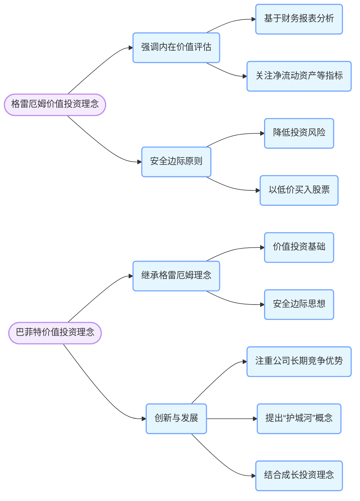

# 格雷厄姆到巴菲特：价值投资理念的演变

> 关键词：价值投资、格雷厄姆、巴菲特、投资理念演变、安全边际

> 摘要：本文深入探讨了价值投资理念从格雷厄姆时代到巴菲特时代的演变过程。详细介绍了格雷厄姆价值投资理念的核心概念、算法原理及数学模型，通过项目实战案例展示其应用。接着分析了巴菲特对格雷厄姆理念的继承与创新，阐述了不同阶段投资理念的特点及适用场景。同时，推荐了学习价值投资的工具和资源，最后总结了价值投资未来的发展趋势与挑战，并对常见问题进行了解答。

## 1. 背景介绍 
### 1.1 目的和范围
价值投资作为一种重要的投资策略，自诞生以来对金融市场产生了深远影响。本文旨在梳理价值投资理念从格雷厄姆到巴菲特的演变过程，深入剖析每个阶段的核心思想、方法和特点。通过对相关理论和实践案例的研究，帮助投资者更好地理解价值投资的本质，掌握不同阶段价值投资理念的应用，为实际投资决策提供参考。范围涵盖了格雷厄姆和巴菲特的投资理论、经典案例以及他们对价值投资理念的传承与发展。

### 1.2 预期读者
本文预期读者包括对价值投资感兴趣的投资者、金融专业学生、研究金融市场的学者以及从事投资相关工作的专业人士。无论是初学者希望了解价值投资的基本概念，还是有一定经验的投资者寻求深入理解价值投资理念的演变，都能从本文中获得有价值的信息。

### 1.3 文档结构概述
本文首先介绍价值投资理念演变的背景信息，包括目的、预期读者和文档结构。接着阐述格雷厄姆和巴菲特价值投资理念的核心概念及它们之间的联系，并通过文本示意图和 Mermaid 流程图进行展示。然后详细讲解核心算法原理和具体操作步骤，结合 Python 代码进行说明。之后介绍相关的数学模型和公式，并举例说明。通过项目实战案例，展示价值投资理念在实际中的应用，包括开发环境搭建、源代码实现和代码解读。分析价值投资的实际应用场景，推荐学习价值投资的工具和资源，包括书籍、在线课程、技术博客、开发工具、框架和相关论文。最后总结价值投资未来的发展趋势与挑战，解答常见问题，并提供扩展阅读和参考资料。

### 1.4 术语表
#### 1.4.1 核心术语定义
- **价值投资**：一种通过对资产内在价值的分析，以低于内在价值的价格买入资产，并在价格回归或超过内在价值时卖出以获取收益的投资策略。
- **安全边际**：指股票的市场价格低于其内在价值的幅度，是价值投资的重要原则之一，用于降低投资风险。
- **内在价值**：资产本身所具有的价值，是基于公司的基本面、盈利能力、现金流等因素进行评估的结果。

#### 1.4.2 相关概念解释
- **净流动资产**：指流动资产减去全部负债后的余额，是格雷厄姆评估公司价值的重要指标之一。
- **护城河**：巴菲特提出的概念，指企业拥有的一种可持续的竞争优势，能够保护企业的长期盈利能力。

#### 1.4.3 缩略词列表
- **EPS**：Earnings Per Share，每股收益，反映公司盈利能力的指标。
- **PE**：Price-to-Earnings Ratio，市盈率，用于衡量股票价格相对于每股收益的倍数。

## 2. 核心概念与联系 

### 格雷厄姆价值投资核心概念
格雷厄姆被称为“价值投资之父”，他的价值投资理念主要基于对公司内在价值的评估和安全边际的原则。其核心思想是通过深入分析公司的财务报表，寻找那些市场价格低于其内在价值的股票进行投资。格雷厄姆认为，股票的市场价格会受到市场情绪等因素的影响而波动，但从长期来看，价格会回归到内在价值。

### 巴菲特价值投资核心概念
巴菲特继承了格雷厄姆的价值投资理念，但在此基础上进行了创新和发展。巴菲特更注重公司的长期竞争优势和管理层的能力，提出了“护城河”的概念。他认为，具有宽阔“护城河”的公司能够在长期竞争中保持优势，为股东创造持续的价值。

### 两者的联系与演变
巴菲特是格雷厄姆的学生，他早期的投资实践深受格雷厄姆的影响，遵循“烟蒂股”投资策略，即寻找那些价格低廉、几乎没有价值但仍有一定剩余价值的股票。随着投资经验的积累，巴菲特逐渐认识到仅仅关注公司的价格和资产价值是不够的，开始更加注重公司的质量和长期发展潜力。他将格雷厄姆的价值投资理念与费雪的成长投资理念相结合，形成了自己独特的投资风格。

### 文本示意图
```plaintext
格雷厄姆价值投资理念
|-- 强调内在价值评估
|   |-- 基于财务报表分析
|   |-- 关注净流动资产等指标
|-- 安全边际原则
|   |-- 降低投资风险
|   |-- 以低价买入股票

巴菲特价值投资理念
|-- 继承格雷厄姆理念
|   |-- 价值投资基础
|   |-- 安全边际思想
|-- 创新与发展
|   |-- 注重公司长期竞争优势
|   |-- 提出“护城河”概念
|   |-- 结合成长投资理念
```

### Mermaid 流程图


## 3. 核心算法原理 & 具体操作步骤 

### 格雷厄姆的净流动资产估值法
#### 算法原理
格雷厄姆认为，当股票的市场价格低于其净流动资产的一定比例时，该股票具有投资价值。净流动资产的计算公式为：

净流动资产 = 流动资产 - 全部负债

格雷厄姆建议，当股票价格低于净流动资产的三分之二时，可以考虑买入。

#### Python 代码实现
```python
def net_current_asset_value(current_assets, total_liabilities):
    """
    计算净流动资产
    :param current_assets: 流动资产
    :param total_liabilities: 全部负债
    :return: 净流动资产
    """
    return current_assets - total_liabilities

def is_graham_stock(stock_price, current_assets, total_liabilities):
    """
    判断股票是否符合格雷厄姆的投资标准
    :param stock_price: 股票价格
    :param current_assets: 流动资产
    :param total_liabilities: 全部负债
    :return: True 或 False
    """
    nca = net_current_asset_value(current_assets, total_liabilities)
    threshold = nca * 2 / 3
    return stock_price < threshold

# 示例数据
current_assets = 1000000
total_liabilities = 500000
stock_price = 200000

if is_graham_stock(stock_price, current_assets, total_liabilities):
    print("该股票符合格雷厄姆的投资标准")
else:
    print("该股票不符合格雷厄姆的投资标准")
```

### 巴菲特的内在价值评估法
#### 算法原理
巴菲特认为，公司的内在价值是其未来现金流的折现价值。计算内在价值的公式为：

$$V = \sum_{t=1}^{n} \frac{CF_t}{(1 + r)^t}$$

其中，$V$ 表示内在价值，$CF_t$ 表示第 $t$ 期的现金流，$r$ 表示折现率，$n$ 表示预测的期数。

#### Python 代码实现
```python
def intrinsic_value(cash_flows, discount_rate):
    """
    计算公司的内在价值
    :param cash_flows: 未来现金流列表
    :param discount_rate: 折现率
    :return: 内在价值
    """
    value = 0
    for t, cf in enumerate(cash_flows, start=1):
        value += cf / ((1 + discount_rate) ** t)
    return value

# 示例数据
cash_flows = [100000, 120000, 130000, 150000, 160000]
discount_rate = 0.1

iv = intrinsic_value(cash_flows, discount_rate)
print(f"公司的内在价值为: {iv}")
```

### 具体操作步骤
#### 格雷厄姆方法操作步骤
1. 收集公司的财务报表，获取流动资产和全部负债的数据。
2. 计算净流动资产。
3. 查找股票的市场价格。
4. 判断股票价格是否低于净流动资产的三分之二，如果是，则考虑买入。

#### 巴菲特方法操作步骤
1. 对公司的未来现金流进行预测，可以根据公司的历史业绩、行业发展趋势等因素进行估算。
2. 确定折现率，折现率的选择通常考虑无风险利率、市场风险溢价等因素。
3. 使用上述公式计算公司的内在价值。
4. 将内在价值与股票的市场价格进行比较，如果市场价格低于内在价值，且公司具有良好的竞争优势和管理层，考虑买入。

## 4. 数学模型和公式 & 详细讲解 & 举例说明 

### 格雷厄姆的投资公式
#### 公式
格雷厄姆提出了一个简单的股票估值公式：

$$V = EPS \times (8.5 + 2g)$$

其中，$V$ 表示股票的内在价值，$EPS$ 表示每股收益，$g$ 表示预期的长期增长率。

#### 详细讲解
这个公式的核心思想是将每股收益与一个与增长率相关的系数相乘，得到股票的内在价值。系数 $8.5$ 是格雷厄姆认为的零增长公司的合理市盈率，$2g$ 表示增长率对市盈率的影响。

#### 举例说明
假设某公司的每股收益为 $5$ 元，预期的长期增长率为 $10\%$，则该股票的内在价值为：

$$V = 5 \times (8.5 + 2 \times 10) = 5 \times 28.5 = 142.5$$（元）

### 巴菲特的现金流折现模型
#### 公式
前面已经介绍过，现金流折现模型的公式为：

$$V = \sum_{t=1}^{n} \frac{CF_t}{(1 + r)^t}$$

#### 详细讲解
这个公式的原理是将公司未来各期的现金流按照一定的折现率折现到当前时刻，然后求和得到公司的内在价值。折现率 $r$ 反映了资金的时间价值和投资的风险，较高的折现率表示对未来现金流的不确定性要求更高的补偿。

#### 举例说明
假设某公司未来 5 年的现金流分别为 $100$ 万元、$120$ 万元、$130$ 万元、$150$ 万元、$160$ 万元，折现率为 $10\%$，则该公司的内在价值为：

$$V = \frac{100}{(1 + 0.1)^1} + \frac{120}{(1 + 0.1)^2} + \frac{130}{(1 + 0.1)^3} + \frac{150}{(1 + 0.1)^4} + \frac{160}{(1 + 0.1)^5}$$

```python
cash_flows = [100, 120, 130, 150, 160]
discount_rate = 0.1
value = 0
for t, cf in enumerate(cash_flows, start=1):
    value += cf / ((1 + discount_rate) ** t)
print(f"公司的内在价值为: {value} 万元")
```

## 5. 项目实战：代码实际案例和详细解释说明 

### 5.1  开发环境搭建
#### 安装 Python
首先需要安装 Python 环境，建议使用 Python 3.7 及以上版本。可以从 Python 官方网站（https://www.python.org/downloads/）下载安装包，按照安装向导进行安装。

#### 安装必要的库
在项目中，我们需要使用一些 Python 库来处理数据和进行计算，如 `pandas` 用于数据处理，`numpy` 用于数值计算。可以使用以下命令进行安装：

```sh
pip install pandas numpy
```

### 5.2  源代码详细实现和代码解读
#### 格雷厄姆投资策略实现
```python
import pandas as pd

# 模拟获取公司财务数据
data = {
    '公司名称': ['A公司', 'B公司', 'C公司'],
    '流动资产': [1000000, 1200000, 800000],
    '全部负债': [500000, 600000, 400000],
    '股票价格': [200000, 300000, 150000]
}

df = pd.DataFrame(data)

# 定义净流动资产计算函数
def net_current_asset_value(current_assets, total_liabilities):
    return current_assets - total_liabilities

# 定义判断是否符合格雷厄姆投资标准的函数
def is_graham_stock(stock_price, current_assets, total_liabilities):
    nca = net_current_asset_value(current_assets, total_liabilities)
    threshold = nca * 2 / 3
    return stock_price < threshold

# 应用函数到数据框
df['符合格雷厄姆标准'] = df.apply(lambda row: is_graham_stock(row['股票价格'], row['流动资产'], row['全部负债']), axis=1)

print(df)
```

#### 代码解读
1. 首先，使用 `pandas` 库创建一个数据框 `df`，模拟存储公司的财务数据和股票价格。
2. 定义 `net_current_asset_value` 函数用于计算净流动资产。
3. 定义 `is_graham_stock` 函数用于判断股票是否符合格雷厄姆的投资标准。
4. 使用 `apply` 方法将 `is_graham_stock` 函数应用到数据框的每一行，添加一个新的列 `符合格雷厄姆标准` 来标记是否符合投资标准。
5. 最后，打印数据框。

#### 巴菲特投资策略实现
```python
import numpy as np

# 模拟获取公司未来现金流数据
cash_flows = [100, 120, 130, 150, 160]
discount_rate = 0.1

# 定义内在价值计算函数
def intrinsic_value(cash_flows, discount_rate):
    value = 0
    for t, cf in enumerate(cash_flows, start=1):
        value += cf / ((1 + discount_rate) ** t)
    return value

# 计算内在价值
iv = intrinsic_value(cash_flows, discount_rate)

# 模拟股票市场价格
market_price = 500

# 判断是否值得投资
if iv > market_price:
    print("该股票值得投资")
else:
    print("该股票不值得投资")
```

#### 代码解读
1. 定义一个列表 `cash_flows` 存储公司未来的现金流数据，以及折现率 `discount_rate`。
2. 定义 `intrinsic_value` 函数用于计算公司的内在价值。
3. 调用 `intrinsic_value` 函数计算内在价值 `iv`。
4. 模拟一个股票的市场价格 `market_price`。
5. 比较内在价值和市场价格，如果内在价值大于市场价格，则认为该股票值得投资，否则不值得投资。

### 5.3  代码解读与分析
#### 格雷厄姆策略代码分析
- 优点：代码简单易懂，通过 `pandas` 库可以方便地处理和分析大量的公司财务数据。使用函数封装计算逻辑，提高了代码的复用性。
- 缺点：数据是模拟的，实际应用中需要从真实的数据源获取财务数据。判断标准比较单一，只考虑了净流动资产和股票价格的关系，没有考虑公司的其他因素。

#### 巴菲特策略代码分析
- 优点：实现了现金流折现模型的基本计算，能够计算公司的内在价值并进行投资判断。代码结构清晰，易于理解和修改。
- 缺点：未来现金流的预测是一个复杂的问题，代码中使用的是模拟数据，实际应用中需要进行更准确的预测。折现率的选择也比较主观，会对计算结果产生较大影响。

## 6. 实际应用场景 
### 格雷厄姆价值投资的应用场景
- **市场低迷时期**：在市场整体下跌、投资者情绪悲观时，很多股票的价格会大幅下跌，可能会出现符合格雷厄姆投资标准的“烟蒂股”。此时，采用格雷厄姆的投资策略，寻找那些价格低于净流动资产的股票进行投资，有可能获得较好的收益。
- **小型和中型公司**：小型和中型公司的市场关注度相对较低，其股票价格可能更容易被低估。格雷厄姆的方法侧重于对公司财务数据的分析，对于这类公司的价值评估有一定的优势。

### 巴菲特价值投资的应用场景
- **长期投资**：巴菲特的投资理念强调长期持有具有竞争优势的公司股票。对于那些有耐心、追求长期稳定收益的投资者来说，采用巴菲特的投资策略，选择具有宽阔“护城河”的公司进行长期投资，是一种不错的选择。
- **优质蓝筹股**：大型的优质蓝筹股通常具有较强的盈利能力、稳定的现金流和良好的品牌形象，符合巴菲特对公司质量的要求。在投资这类股票时，可以运用巴菲特的内在价值评估方法，判断其是否具有投资价值。

### 价值投资理念在不同市场环境中的应用
- **牛市**：在牛市中，市场整体估值较高，符合格雷厄姆标准的“烟蒂股”可能较少。此时，可以采用巴菲特的方法，关注那些具有长期增长潜力的优质公司，即使其价格相对较高，但如果内在价值也很高，仍然可以考虑投资。
- **熊市**：熊市中市场恐慌情绪蔓延，股票价格普遍下跌。可以结合格雷厄姆和巴菲特的理念，一方面寻找价格严重低估的股票，另一方面关注那些在熊市中仍能保持竞争力的公司，等待市场反弹。

## 7. 工具和资源推荐
### 7.1 学习资源推荐
#### 7.1.1 书籍推荐
- 《聪明的投资者》（The Intelligent Investor）：格雷厄姆的经典著作，被誉为价值投资的“圣经”，详细阐述了价值投资的基本理念和方法。
- 《证券分析》（Security Analysis）：同样是格雷厄姆的重要著作，对证券分析的理论和实践进行了系统的介绍，是价值投资者的必读之书。
- 《巴菲特致股东的信：股份公司教程》（Letters to Shareholders of Berkshire Hathaway）：收录了巴菲特多年来致股东的信，通过这些信件可以深入了解巴菲特的投资思想和管理理念。

#### 7.1.2 在线课程
- Coursera 上的“投资学原理”（Principles of Investing）：该课程涵盖了投资的基本概念、理论和方法，包括价值投资的相关内容，由知名教授授课，课程质量较高。
- Udemy 上的“价值投资实战课程”（Value Investing Masterclass）：通过实际案例讲解价值投资的分析方法和投资策略，适合有一定基础的投资者学习。

#### 7.1.3 技术博客和网站
- 雪球（https://xueqiu.com/）：国内知名的投资社区，汇聚了众多投资者和投资专家，提供丰富的股票分析、投资策略和市场资讯。
- Seeking Alpha（https://seekingalpha.com/）：国外的投资研究网站，提供大量的股票分析报告和投资观点，对于学习价值投资有很大的帮助。

### 7.2 开发工具框架推荐
#### 7.2.1 IDE和编辑器
- PyCharm：一款专业的 Python 集成开发环境，具有强大的代码编辑、调试和项目管理功能，适合开发和调试价值投资相关的 Python 代码。
- Jupyter Notebook：一个交互式的开发环境，支持 Python 等多种编程语言，方便进行数据探索、分析和可视化，对于进行价值投资的数据处理和模型计算非常有用。

#### 7.2.2 调试和性能分析工具
- PDB：Python 自带的调试器，可以帮助开发者逐行调试代码，查找和解决代码中的问题。
- cProfile：Python 的性能分析工具，可以分析代码的运行时间和函数调用情况，帮助优化代码性能。

#### 7.2.3 相关框架和库
- Pandas：用于数据处理和分析的 Python 库，提供了高效的数据结构和数据操作方法，适合处理和分析公司的财务数据。
- Numpy：用于数值计算的 Python 库，提供了强大的数组和矩阵运算功能，在计算内在价值等数值计算中非常有用。

### 7.3 相关论文著作推荐
#### 7.3.1 经典论文
- 《格雷厄姆 - 多德都市的超级投资者们》（The Superinvestors of Graham-and-Doddsville）：巴菲特撰写的论文，通过实际案例证明了价值投资的有效性。
- 《有效市场假说》（Efficient Markets Hypothesis）：探讨了市场效率和股票价格的关系，对于理解价值投资的理论基础有重要意义。

#### 7.3.2 最新研究成果
- 可以关注金融领域的顶级学术期刊，如《金融经济学杂志》（Journal of Financial Economics）、《金融研究评论》（Review of Financial Studies）等，了解价值投资领域的最新研究动态。

#### 7.3.3 应用案例分析
- 《巴菲特的投资组合：集中投资策略的秘密》（The Warren Buffett Portfolio: Mastering the Power of the Focus Investment Strategy）：通过分析巴菲特的投资组合，介绍了集中投资策略的应用和优势。

## 8. 总结：未来发展趋势与挑战
### 未来发展趋势
- **与科技融合**：随着科技的不断发展，价值投资将越来越多地与大数据、人工智能等技术相结合。通过运用大数据分析公司的财务数据、市场数据和行业数据，以及利用人工智能算法进行投资决策和风险评估，提高价值投资的效率和准确性。
- **全球投资**：经济全球化的趋势使得投资者有更多的机会进行全球投资。价值投资者将更加关注全球范围内的优质公司，寻找具有投资价值的股票，扩大投资视野和范围。
- **社会责任投资**：越来越多的投资者开始关注公司的社会责任和可持续发展。未来，价值投资可能会将公司的社会责任因素纳入投资决策的考虑范围，选择那些具有良好社会形象和可持续发展能力的公司进行投资。

### 挑战
- **信息过载**：在信息时代，投资者面临着海量的信息。如何从众多的信息中筛选出有价值的信息，准确评估公司的内在价值，是价值投资者面临的一大挑战。
- **市场变化快速**：金融市场的变化越来越快速和复杂，宏观经济环境、政策法规、行业竞争等因素都会对公司的价值产生影响。价值投资者需要及时调整投资策略，适应市场的变化。
- **估值难度增加**：随着科技的发展和商业模式的创新，一些新兴行业的公司估值变得更加困难。传统的估值方法可能无法准确评估这些公司的内在价值，需要探索新的估值方法和模型。

## 9. 附录：常见问题与解答
### 问题 1：价值投资适合所有投资者吗？
解答：价值投资并不适合所有投资者。价值投资需要投资者具备一定的财务知识和分析能力，能够对公司的基本面进行深入研究。同时，价值投资强调长期持有，需要投资者有足够的耐心和定力。对于那些追求短期高收益、缺乏专业知识和耐心的投资者来说，价值投资可能不是最佳选择。

### 问题 2：如何确定公司的内在价值？
解答：确定公司的内在价值是一个复杂的过程，没有一种绝对准确的方法。常见的方法包括现金流折现模型、市盈率法、市净率法等。在实际应用中，需要综合考虑公司的财务状况、盈利能力、行业前景、竞争优势等因素，并结合多种估值方法进行评估。同时，要注意估值的主观性和不确定性，对估值结果进行合理的调整和判断。

### 问题 3：价值投资和成长投资有什么区别？
解答：价值投资侧重于寻找被市场低估的股票，关注股票的价格与内在价值的差距，强调安全边际。而成长投资则更关注公司的未来成长潜力，愿意为具有高成长潜力的公司支付较高的价格。价值投资通常选择业绩稳定、分红较高的公司，而成长投资则更倾向于新兴行业和具有创新能力的公司。

### 问题 4：巴菲特的投资策略可以复制吗？
解答：巴菲特的投资策略有其独特的特点和成功经验，但很难完全复制。巴菲特具有卓越的投资眼光、深厚的商业洞察力和长期的投资经验，这些因素是难以模仿的。不过，投资者可以学习巴菲特的投资理念和方法，结合自己的实际情况进行投资实践。同时，要注意市场环境的变化，灵活运用投资策略。

## 10. 扩展阅读 & 参考资料
### 扩展阅读
- 《财务报表分析与证券定价》（Financial Statement Analysis and Security Valuation）：深入介绍了财务报表分析的方法和技巧，以及如何运用财务报表进行证券定价，对于价值投资者有很大的帮助。
- 《漫步华尔街》（A Random Walk Down Wall Street）：探讨了股票市场的有效性和投资策略，对价值投资和其他投资策略进行了比较和分析。

### 参考资料
- Graham, Benjamin. The Intelligent Investor. HarperBusiness, 2003.
- Buffett, Warren E. Letters to Shareholders of Berkshire Hathaway. Berkshire Hathaway Inc., various years.
- Fama, Eugene F., and Kenneth R. French. "The Cross-Section of Expected Stock Returns." The Journal of Finance, Vol. 47, No. 2 (1992), pp. 427 - 465.

作者：AI天才研究院/AI Genius Institute & 禅与计算机程序设计艺术 /Zen And The Art of Computer Programming