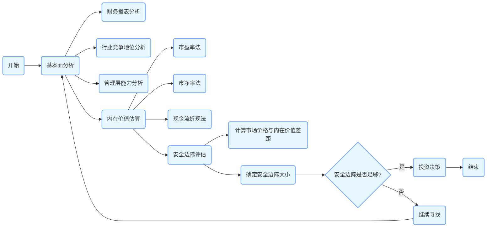

# 格雷厄姆特价股票理论在平台经济时代的新思考

> 关键词：格雷厄姆特价股票理论、平台经济时代、价值投资、股票估值、新思考

> 摘要：本文深入探讨了格雷厄姆特价股票理论在平台经济时代的适应性与发展。首先介绍了格雷厄姆特价股票理论的背景和核心要点，分析了平台经济时代的特点及其对传统股票估值理论的挑战。接着详细阐述了在新经济环境下对该理论的新思考，包括对平台企业价值评估的新方法和考量因素。通过实际案例分析展示了理论应用的具体情况，同时探讨了理论在新时代面临的机遇与挑战。最后对未来发展趋势进行了展望，旨在为投资者在平台经济时代运用格雷厄姆特价股票理论提供有益的参考和指导。

## 1. 背景介绍 
### 1.1 目的和范围
本研究的目的在于深入探究格雷厄姆特价股票理论在平台经济时代的有效性、适应性以及需要做出的调整。随着互联网技术的飞速发展，平台经济逐渐崛起并成为经济发展的重要力量。传统的股票估值理论在面对平台企业时面临诸多挑战，因此有必要重新审视格雷厄姆特价股票理论，挖掘其在新经济环境下的价值和应用方式。本研究的范围涵盖了格雷厄姆特价股票理论的基本原理、平台经济的特点和发展趋势、平台企业的估值方法以及该理论在实际投资中的应用案例等方面。

### 1.2 预期读者
本文预期读者包括对股票投资有兴趣的个人投资者、专业的金融分析师、投资机构的研究人员以及从事金融学术研究的学者。对于个人投资者来说，了解格雷厄姆特价股票理论在平台经济时代的新思考有助于他们在投资决策中做出更明智的选择；专业金融分析师和投资机构研究人员可以从中获取新的分析思路和方法，提升对平台企业股票的估值和投资建议的准确性；金融学术研究学者则可以将本文作为进一步深入研究的参考，推动相关理论的发展和完善。

### 1.3 文档结构概述
本文共分为十个部分。第一部分为背景介绍，阐述了研究的目的、预期读者和文档结构概述，并对相关术语进行了解释。第二部分介绍了格雷厄姆特价股票理论的核心概念与联系，包括其原理、架构以及与其他投资理论的关系。第三部分详细讲解了该理论的核心算法原理和具体操作步骤，通过 Python 源代码进行了阐述。第四部分介绍了相关的数学模型和公式，并进行了详细讲解和举例说明。第五部分通过项目实战，展示了代码实际案例并进行了详细的解释说明。第六部分探讨了该理论在平台经济时代的实际应用场景。第七部分推荐了相关的学习资源、开发工具框架和论文著作。第八部分总结了未来发展趋势与挑战。第九部分为附录，解答了常见问题。第十部分提供了扩展阅读和参考资料。

### 1.4 术语表
#### 1.4.1 核心术语定义
- **格雷厄姆特价股票理论**：由本杰明·格雷厄姆（Benjamin Graham）提出的一种价值投资理论，强调通过分析股票的内在价值，寻找价格低于内在价值的股票进行投资，以获取长期稳定的收益。
- **平台经济**：一种基于数字技术，由数据驱动、平台支撑、网络协同的经济活动单元所构成的新经济系统，是基于数字平台的各种经济关系的总称。
- **内在价值**：股票所代表的企业的真实价值，是由企业的资产、盈利能力、现金流等多种因素决定的。
- **安全边际**：股票的市场价格低于其内在价值的部分，是格雷厄姆投资理论中的重要概念，用于降低投资风险。

#### 1.4.2 相关概念解释
- **价值投资**：一种投资策略，强调通过对企业基本面的分析，寻找被市场低估的股票进行投资，以获取长期的资本增值。
- **成长投资**：一种侧重于寻找具有高成长潜力的企业进行投资的策略，通常更关注企业的未来发展前景和盈利增长速度。
- **股票估值**：对股票的内在价值进行评估的过程，常用的方法包括市盈率法、市净率法、现金流折现法等。

#### 1.4.3 缩略词列表
- **PE**：市盈率（Price - Earnings Ratio），是股票价格与每股收益的比值，用于衡量股票的估值水平。
- **PB**：市净率（Price - Book Ratio），是股票价格与每股净资产的比值，反映了市场对企业净资产的估值。
- **DCF**：现金流折现法（Discounted Cash Flow），一种通过预测企业未来的现金流并将其折现到当前的估值方法。

## 2. 核心概念与联系 

### 2.1 格雷厄姆特价股票理论的核心原理
格雷厄姆特价股票理论的核心思想是寻找价格低于内在价值的股票，即具有安全边际的股票进行投资。该理论认为，股票市场存在着短期的非理性波动，导致股票价格可能偏离其内在价值。投资者可以通过对企业的财务报表、资产状况、盈利能力等基本面因素的分析，估算出股票的内在价值，然后与市场价格进行比较。当市场价格低于内在价值时，股票被认为是被低估的，具有投资价值。

### 2.2 理论架构
格雷厄姆特价股票理论的架构可以分为三个主要部分：基本面分析、内在价值估算和安全边际评估。

- **基本面分析**：通过对企业的财务报表、行业竞争地位、管理层能力等方面的分析，了解企业的经营状况和发展前景。
- **内在价值估算**：运用各种估值方法，如市盈率法、市净率法、现金流折现法等，估算股票的内在价值。
- **安全边际评估**：计算股票的市场价格与内在价值之间的差距，确定安全边际的大小。安全边际越大，投资风险越低。

### 2.3 文本示意图
```plaintext
格雷厄姆特价股票理论
|
|-- 基本面分析
|   |-- 财务报表分析
|   |-- 行业竞争地位分析
|   |-- 管理层能力分析
|
|-- 内在价值估算
|   |-- 市盈率法
|   |-- 市净率法
|   |-- 现金流折现法
|
|-- 安全边际评估
|   |-- 计算市场价格与内在价值差距
|   |-- 确定安全边际大小
```

### 2.4 Mermaid 流程图


### 2.5 与其他投资理论的联系
格雷厄姆特价股票理论与其他投资理论，如成长投资理论、技术分析理论等存在着一定的联系和区别。

- **与成长投资理论的联系**：成长投资理论侧重于寻找具有高成长潜力的企业进行投资，而格雷厄姆特价股票理论也关注企业的发展前景，但更强调股票的价格与内在价值的关系。两者可以相互补充，投资者可以在寻找成长型企业的同时，关注其股票的估值是否合理。
- **与技术分析理论的区别**：技术分析理论主要通过分析股票的价格走势、成交量等技术指标来预测股票的未来走势，而格雷厄姆特价股票理论则更注重企业的基本面分析和内在价值评估。技术分析理论更适用于短期投资，而格雷厄姆特价股票理论更适合长期投资。

## 3. 核心算法原理 & 具体操作步骤 

### 3.1 核心算法原理
格雷厄姆特价股票理论的核心算法主要涉及到内在价值的估算和安全边际的计算。下面分别介绍几种常见的内在价值估算方法。

#### 3.1.1 市盈率法
市盈率法是一种简单常用的估值方法，其基本原理是通过比较股票的市盈率与行业平均市盈率或历史市盈率，来判断股票的估值是否合理。计算公式如下：

$$V = EPS \times PE$$

其中，$V$ 表示股票的内在价值，$EPS$ 表示每股收益，$PE$ 表示市盈率。

#### 3.1.2 市净率法
市净率法是通过比较股票的市净率与行业平均市净率或历史市净率，来评估股票的估值水平。计算公式如下：

$$V = BVPS \times PB$$

其中，$V$ 表示股票的内在价值，$BVPS$ 表示每股净资产，$PB$ 表示市净率。

#### 3.1.3 现金流折现法
现金流折现法是一种较为复杂但更准确的估值方法，其基本原理是将企业未来的现金流折现到当前，得到企业的内在价值。计算公式如下：

$$V = \sum_{t=1}^{n} \frac{FCF_t}{(1 + r)^t}$$

其中，$V$ 表示股票的内在价值，$FCF_t$ 表示第 $t$ 期的自由现金流，$r$ 表示折现率，$n$ 表示预测期数。

### 3.2 具体操作步骤

#### 3.2.1 数据收集
首先需要收集企业的财务报表数据，包括资产负债表、利润表和现金流量表等。同时，还需要收集行业相关数据，如行业平均市盈率、市净率等。

#### 3.2.2 基本面分析
对企业的财务报表进行分析，了解企业的资产状况、盈利能力、偿债能力等。同时，分析企业的行业竞争地位、管理层能力等因素，评估企业的发展前景。

#### 3.2.3 内在价值估算
根据收集到的数据，选择合适的估值方法估算股票的内在价值。可以同时使用多种估值方法，以提高估值的准确性。

#### 3.2.4 安全边际计算
计算股票的市场价格与内在价值之间的差距，确定安全边际的大小。安全边际的计算公式如下：

$$安全边际 = \frac{内在价值 - 市场价格}{内在价值} \times 100\%$$

#### 3.2.5 投资决策
根据安全边际的大小，做出投资决策。一般来说，安全边际越大，投资风险越低，投资价值越高。

### 3.3 Python 源代码实现

```python
import pandas as pd

# 市盈率法估算内在价值
def pe_valuation(eps, pe):
    """
    市盈率法估算内在价值
    :param eps: 每股收益
    :param pe: 市盈率
    :return: 内在价值
    """
    return eps * pe

# 市净率法估算内在价值
def pb_valuation(bvps, pb):
    """
    市净率法估算内在价值
    :param bvps: 每股净资产
    :param pb: 市净率
    :return: 内在价值
    """
    return bvps * pb

# 现金流折现法估算内在价值
def dcf_valuation(fcf_list, discount_rate):
    """
    现金流折现法估算内在价值
    :param fcf_list: 自由现金流列表
    :param discount_rate: 折现率
    :return: 内在价值
    """
    value = 0
    for i, fcf in enumerate(fcf_list):
        value += fcf / (1 + discount_rate) ** (i + 1)
    return value

# 计算安全边际
def safety_margin(intrinsic_value, market_price):
    """
    计算安全边际
    :param intrinsic_value: 内在价值
    :param market_price: 市场价格
    :return: 安全边际
    """
    return (intrinsic_value - market_price) / intrinsic_value * 100

# 示例数据
eps = 2.0  # 每股收益
pe = 15    # 市盈率
bvps = 10  # 每股净资产
pb = 1.5   # 市净率
fcf_list = [100, 120, 140, 160, 180]  # 自由现金流列表
discount_rate = 0.1  # 折现率
market_price = 25    # 市场价格

# 估算内在价值
pe_value = pe_valuation(eps, pe)
pb_value = pb_valuation(bvps, pb)
dcf_value = dcf_valuation(fcf_list, discount_rate)

# 计算安全边际
pe_safety_margin = safety_margin(pe_value, market_price)
pb_safety_margin = safety_margin(pb_value, market_price)
dcf_safety_margin = safety_margin(dcf_value, market_price)

# 输出结果
print(f"市盈率法估算的内在价值: {pe_value}")
print(f"市净率法估算的内在价值: {pb_value}")
print(f"现金流折现法估算的内在价值: {dcf_value}")
print(f"市盈率法计算的安全边际: {pe_safety_margin}%")
print(f"市净率法计算的安全边际: {pb_safety_margin}%")
print(f"现金流折现法计算的安全边际: {dcf_safety_margin}%")
```

### 3.4 代码解释
- `pe_valuation` 函数：根据每股收益和市盈率，使用市盈率法估算股票的内在价值。
- `pb_valuation` 函数：根据每股净资产和市净率，使用市净率法估算股票的内在价值。
- `dcf_valuation` 函数：根据自由现金流列表和折现率，使用现金流折现法估算股票的内在价值。
- `safety_margin` 函数：根据内在价值和市场价格，计算股票的安全边际。
- 示例数据部分：定义了每股收益、市盈率、每股净资产、市净率、自由现金流列表、折现率和市场价格等示例数据。
- 估算内在价值部分：分别使用市盈率法、市净率法和现金流折现法估算股票的内在价值。
- 计算安全边际部分：分别使用三种估值方法计算的内在价值和市场价格，计算股票的安全边际。
- 输出结果部分：输出三种估值方法估算的内在价值和计算的安全边际。

## 4. 数学模型和公式 & 详细讲解 & 举例说明 

### 4.1 市盈率法
#### 4.1.1 数学模型和公式
市盈率法的数学模型和公式如下：

$$V = EPS \times PE$$

其中，$V$ 表示股票的内在价值，$EPS$ 表示每股收益，$PE$ 表示市盈率。

#### 4.1.2 详细讲解
市盈率是股票价格与每股收益的比值，反映了市场对企业盈利能力的预期。市盈率法的基本原理是，通过比较股票的市盈率与行业平均市盈率或历史市盈率，来判断股票的估值是否合理。如果股票的市盈率低于行业平均市盈率或历史市盈率，说明股票可能被低估，具有投资价值。

#### 4.1.3 举例说明
假设某公司的每股收益为 $2$ 元，行业平均市盈率为 $15$ 倍。则该公司股票的内在价值为：

$$V = EPS \times PE = 2 \times 15 = 30$$（元）

如果该公司股票的市场价格为 $25$ 元，则安全边际为：

$$安全边际 = \frac{30 - 25}{30} \times 100\% \approx 16.67\%$$

### 4.2 市净率法
#### 4.2.1 数学模型和公式
市净率法的数学模型和公式如下：

$$V = BVPS \times PB$$

其中，$V$ 表示股票的内在价值，$BVPS$ 表示每股净资产，$PB$ 表示市净率。

#### 4.2.2 详细讲解
市净率是股票价格与每股净资产的比值，反映了市场对企业净资产的估值。市净率法的基本原理是，通过比较股票的市净率与行业平均市净率或历史市净率，来评估股票的估值水平。如果股票的市净率低于行业平均市净率或历史市净率，说明股票可能被低估，具有投资价值。

#### 4.2.3 举例说明
假设某公司的每股净资产为 $10$ 元，行业平均市净率为 $1.5$ 倍。则该公司股票的内在价值为：

$$V = BVPS \times PB = 10 \times 1.5 = 15$$（元）

如果该公司股票的市场价格为 $12$ 元，则安全边际为：

$$安全边际 = \frac{15 - 12}{15} \times 100\% = 20\%$$

### 4.3 现金流折现法
#### 4.3.1 数学模型和公式
现金流折现法的数学模型和公式如下：

$$V = \sum_{t=1}^{n} \frac{FCF_t}{(1 + r)^t}$$

其中，$V$ 表示股票的内在价值，$FCF_t$ 表示第 $t$ 期的自由现金流，$r$ 表示折现率，$n$ 表示预测期数。

#### 4.3.2 详细讲解
现金流折现法的基本原理是，将企业未来的现金流折现到当前，得到企业的内在价值。自由现金流是指企业在满足了所有必要的资本支出和运营资金需求后，剩余的可自由支配的现金流量。折现率是反映资金时间价值和投资风险的参数，一般可以使用企业的加权平均资本成本（WACC）作为折现率。

#### 4.3.3 举例说明
假设某公司未来五年的自由现金流分别为 $100$ 万元、$120$ 万元、$140$ 万元、$160$ 万元和 $180$ 万元，折现率为 $10\%$。则该公司股票的内在价值为：

$$V = \frac{100}{(1 + 0.1)^1} + \frac{120}{(1 + 0.1)^2} + \frac{140}{(1 + 0.1)^3} + \frac{160}{(1 + 0.1)^4} + \frac{180}{(1 + 0.1)^5}$$

$$V \approx 90.91 + 99.17 + 105.18 + 109.28 + 111.73 = 516.27$$（万元）

如果该公司股票的市场价格对应的企业价值为 $450$ 万元，则安全边际为：

$$安全边际 = \frac{516.27 - 450}{516.27} \times 100\% \approx 12.83\%$$

## 5. 项目实战：代码实际案例和详细解释说明 

### 5.1  开发环境搭建
在进行项目实战之前，需要搭建相应的开发环境。以下是具体的步骤：

#### 5.1.1 安装 Python
首先需要安装 Python 编程语言。可以从 Python 官方网站（https://www.python.org/downloads/） 下载适合自己操作系统的 Python 安装包，并按照安装向导进行安装。

#### 5.1.2 安装必要的库
在项目中，我们需要使用 `pandas` 库来处理数据。可以使用以下命令来安装 `pandas` 库：

```sh
pip install pandas
```

#### 5.1.3 选择开发工具
可以选择自己喜欢的开发工具，如 PyCharm、Jupyter Notebook 等。这里以 Jupyter Notebook 为例，可以使用以下命令来安装 Jupyter Notebook：

```sh
pip install jupyter
```

安装完成后，可以使用以下命令启动 Jupyter Notebook：

```sh
jupyter notebook
```

### 5.2  源代码详细实现和代码解读
以下是一个完整的项目实战代码示例，用于演示如何使用格雷厄姆特价股票理论对股票进行估值和安全边际计算。

```python
import pandas as pd

# 市盈率法估算内在价值
def pe_valuation(eps, pe):
    """
    市盈率法估算内在价值
    :param eps: 每股收益
    :param pe: 市盈率
    :return: 内在价值
    """
    return eps * pe

# 市净率法估算内在价值
def pb_valuation(bvps, pb):
    """
    市净率法估算内在价值
    :param bvps: 每股净资产
    :param pb: 市净率
    :return: 内在价值
    """
    return bvps * pb

# 现金流折现法估算内在价值
def dcf_valuation(fcf_list, discount_rate):
    """
    现金流折现法估算内在价值
    :param fcf_list: 自由现金流列表
    :param discount_rate: 折现率
    :return: 内在价值
    """
    value = 0
    for i, fcf in enumerate(fcf_list):
        value += fcf / (1 + discount_rate) ** (i + 1)
    return value

# 计算安全边际
def safety_margin(intrinsic_value, market_price):
    """
    计算安全边际
    :param intrinsic_value: 内在价值
    :param market_price: 市场价格
    :return: 安全边际
    """
    return (intrinsic_value - market_price) / intrinsic_value * 100

# 读取数据
data = {
    '股票代码': ['000001', '000002', '000003'],
    '每股收益': [2.0, 1.5, 1.8],
    '市盈率': [15, 12, 13],
    '每股净资产': [10, 8, 9],
    '市净率': [1.5, 1.2, 1.3],
    '自由现金流列表': [[100, 120, 140, 160, 180], [80, 100, 120, 140, 160], [90, 110, 130, 150, 170]],
    '折现率': [0.1, 0.1, 0.1],
    '市场价格': [25, 18, 22]
}
df = pd.DataFrame(data)

# 计算内在价值和安全边际
df['市盈率法内在价值'] = df.apply(lambda row: pe_valuation(row['每股收益'], row['市盈率']), axis=1)
df['市净率法内在价值'] = df.apply(lambda row: pb_valuation(row['每股净资产'], row['市净率']), axis=1)
df['现金流折现法内在价值'] = df.apply(lambda row: dcf_valuation(row['自由现金流列表'], row['折现率']), axis=1)
df['市盈率法安全边际'] = df.apply(lambda row: safety_margin(row['市盈率法内在价值'], row['市场价格']), axis=1)
df['市净率法安全边际'] = df.apply(lambda row: safety_margin(row['市净率法内在价值'], row['市场价格']), axis=1)
df['现金流折现法安全边际'] = df.apply(lambda row: safety_margin(row['现金流折现法内在价值'], row['市场价格']), axis=1)

# 输出结果
print(df[['股票代码', '市盈率法内在价值', '市净率法内在价值', '现金流折现法内在价值', '市盈率法安全边际', '市净率法安全边际', '现金流折现法安全边际']])
```

### 5.3  代码解读与分析
- **函数定义部分**：定义了 `pe_valuation`、`pb_valuation`、`dcf_valuation` 和 `safety_margin` 四个函数，分别用于市盈率法、市净率法、现金流折现法估算内在价值和计算安全边际。
- **数据读取部分**：使用字典 `data` 定义了示例数据，并使用 `pandas` 库的 `DataFrame` 函数将数据转换为数据框 `df`。
- **计算内在价值和安全边际部分**：使用 `apply` 函数对数据框的每一行应用相应的函数，计算三种估值方法的内在价值和安全边际，并将结果添加到数据框中。
- **输出结果部分**：输出数据框中与内在价值和安全边际相关的列，方便查看计算结果。

通过这个项目实战，我们可以看到如何使用 Python 代码实现格雷厄姆特价股票理论的核心算法，并对多只股票进行估值和安全边际计算。

## 6. 实际应用场景 
### 6.1 个人投资者的投资决策
对于个人投资者来说，格雷厄姆特价股票理论在平台经济时代仍然具有重要的指导意义。在选择投资平台企业的股票时，个人投资者可以运用该理论对股票进行估值和安全边际计算，以判断股票是否具有投资价值。例如，当某平台企业的股票价格大幅下跌时，投资者可以通过分析其财务报表、行业竞争地位等基本面因素，估算其内在价值。如果计算得出的安全边际较大，说明股票可能被低估，投资者可以考虑买入该股票。

### 6.2 投资机构的资产配置
投资机构在进行资产配置时，也可以参考格雷厄姆特价股票理论。在选择平台企业股票作为投资标的时，投资机构可以使用该理论对不同的平台企业进行评估和比较，选择具有较高安全边际和投资价值的股票纳入投资组合。同时，投资机构还可以根据市场情况和企业发展变化，动态调整投资组合，以实现资产的保值增值。

### 6.3 企业的并购重组
在企业的并购重组活动中，格雷厄姆特价股票理论可以帮助企业评估目标企业的价值。通过对目标企业的基本面分析和内在价值估算，企业可以确定合理的并购价格，避免过高的收购成本。例如，在平台企业的并购中，收购方可以使用该理论评估被收购方的价值，以确保并购交易的合理性和可行性。

### 6.4 金融监管机构的监管
金融监管机构可以运用格雷厄姆特价股票理论对平台企业的股票市场进行监管。通过对平台企业股票的估值和安全边际监测，监管机构可以及时发现市场中的异常波动和潜在风险，采取相应的监管措施，维护市场的稳定和健康发展。例如，当某平台企业的股票价格出现大幅波动时，监管机构可以要求企业提供详细的财务信息和经营情况说明，并运用该理论进行评估，以判断是否存在市场操纵等违法行为。

## 7. 工具和资源推荐
### 7.1 学习资源推荐
#### 7.1.1 书籍推荐
- 《聪明的投资者》（The Intelligent Investor）：本杰明·格雷厄姆的经典著作，详细阐述了价值投资的理念和方法，是学习格雷厄姆特价股票理论的必读之书。
- 《证券分析》（Security Analysis）：同样是本杰明·格雷厄姆的著作，对证券的估值和分析进行了深入探讨，为投资者提供了系统的投资分析框架。
- 《财务报表分析与证券定价》（Financial Statement Analysis and Security Valuation）：该书结合财务报表分析和证券定价理论，帮助读者理解如何通过财务报表评估企业的价值，对运用格雷厄姆特价股票理论进行股票估值具有重要的参考价值。

#### 7.1.2 在线课程
- Coursera 平台上的“Financial Markets”课程：由耶鲁大学教授罗伯特·席勒（Robert Shiller）主讲，涵盖了金融市场的基本原理和投资策略，包括价值投资的相关内容。
- edX 平台上的“Introduction to Finance”课程：该课程介绍了金融领域的基础知识和投资分析方法，对理解格雷厄姆特价股票理论的背景和应用有一定的帮助。
- 中国大学 MOOC 上的“公司金融”课程：国内高校开设的课程，系统讲解了公司金融的理论和实践，包括股票估值和投资决策等内容。

#### 7.1.3 技术博客和网站
- Seeking Alpha（https://seekingalpha.com/）：一个提供金融市场分析和投资建议的网站，有许多专业的分析师和投资者分享对股票的研究和看法，其中不乏关于价值投资和格雷厄姆特价股票理论的讨论。
- ValueWalk（https://www.valuewalk.com/）：专注于价值投资领域的博客网站，提供了丰富的价值投资案例和分析文章，有助于深入学习格雷厄姆特价股票理论的应用。
- 雪球（https://xueqiu.com/）：国内知名的投资交流社区，有大量的投资者分享投资经验和对股票的分析，在平台经济时代的股票投资讨论中可以获取很多有价值的信息。

### 7.2 开发工具框架推荐
#### 7.2.1 IDE和编辑器
- PyCharm：一款专业的 Python 集成开发环境，提供了丰富的代码编辑、调试和项目管理功能，适合开发和运行与格雷厄姆特价股票理论相关的 Python 代码。
- Jupyter Notebook：一个交互式的开发环境，支持多种编程语言，尤其适合进行数据分析和可视化。在使用 Python 实现股票估值算法和展示计算结果时，Jupyter Notebook 可以方便地进行代码编写、运行和结果展示。
- Visual Studio Code：一款轻量级的代码编辑器，支持多种编程语言和插件扩展。可以通过安装 Python 相关插件，实现高效的 Python 代码开发和调试。

#### 7.2.2 调试和性能分析工具
- pdb：Python 内置的调试工具，可以在代码中设置断点，逐行执行代码，查看变量的值和程序的执行流程，帮助调试与格雷厄姆特价股票理论相关的 Python 代码。
- cProfile：Python 标准库中的性能分析工具，可以分析代码的执行时间和函数调用次数，帮助优化代码性能。
- Py-Spy：一个跨平台的 Python 性能分析工具，可以实时分析 Python 程序的性能，找出性能瓶颈。

#### 7.2.3 相关框架和库
- pandas：一个强大的数据处理和分析库，提供了丰富的数据结构和数据处理方法，适合处理和分析股票相关的数据，如财务报表数据、市场价格数据等。
- numpy：一个用于科学计算的 Python 库，提供了高效的数组操作和数学函数，在实现股票估值算法时可以提高计算效率。
- matplotlib：一个用于数据可视化的 Python 库，可以将股票的估值结果和安全边际等数据以图表的形式展示出来，方便分析和理解。

### 7.3 相关论文著作推荐
#### 7.3.1 经典论文
- Benjamin Graham and David Dodd, "Security Analysis" (1934): 该论文是格雷厄姆和多德的经典著作，奠定了价值投资的理论基础，详细阐述了股票估值的方法和原则，对格雷厄姆特价股票理论的形成和发展具有重要意义。
- Eugene F. Fama and Kenneth R. French, "The Cross - Section of Expected Stock Returns" (1992): 该论文提出了著名的 Fama - French 三因子模型，对股票的预期收益率进行了深入研究，为股票估值和投资分析提供了新的视角和方法。
- Stephen A. Ross, "The Arbitrage Theory of Capital Asset Pricing" (1976): 该论文提出了套利定价理论（APT），是对资本资产定价模型（CAPM）的扩展和改进，对理解股票的定价机制和投资风险具有重要的参考价值。

#### 7.3.2 最新研究成果
- 在学术数据库如 SSRN（https://papers.ssrn.com/sol3/）、JSTOR（https://www.jstor.org/） 等平台上，可以搜索到关于平台经济时代股票估值和投资策略的最新研究成果。这些研究通常关注平台企业的特点和发展趋势，探讨如何在新经济环境下应用传统的投资理论进行股票分析和决策。
- 一些知名学术期刊，如《Journal of Finance》、《Review of Financial Studies》、《Journal of Financial Economics》等，也会发表关于股票估值、价值投资和平台经济的前沿研究论文，可以及时了解该领域的最新动态和研究进展。

#### 7.3.3 应用案例分析
- 许多金融研究机构和投资咨询公司会发布关于股票投资的应用案例分析报告。例如，麦肯锡公司（McKinsey & Company）、波士顿咨询集团（Boston Consulting Group）等会对不同行业的企业进行深入研究和分析，包括平台企业的投资价值评估和投资策略建议。这些案例分析可以帮助读者更好地理解格雷厄姆特价股票理论在实际投资中的应用。
- 一些财经媒体，如《金融时报》（Financial Times）、《华尔街日报》（The Wall Street Journal）等，也会报道一些成功的投资案例和投资策略分析，从中可以获取关于平台经济时代股票投资的实际经验和教训。

## 8. 总结：未来发展趋势与挑战
### 8.1 未来发展趋势
#### 8.1.1 与科技的深度融合
随着人工智能、大数据、区块链等技术的不断发展，格雷厄姆特价股票理论在平台经济时代将与这些技术深度融合。例如，利用人工智能和大数据技术可以更高效地收集和分析企业的财务数据、市场数据和行业数据，提高股票估值的准确性和效率。区块链技术可以保证数据的真实性和不可篡改，为投资决策提供更可靠的依据。

#### 8.1.2 注重平台企业的创新能力
在平台经济时代，平台企业的创新能力将成为影响其价值的重要因素。未来，格雷厄姆特价股票理论在评估平台企业价值时，将更加注重企业的创新能力，包括技术创新、商业模式创新等方面。投资者将更加关注平台企业的研发投入、专利数量、创新团队等指标，以评估企业的未来发展潜力。

#### 8.1.3 全球化投资趋势
随着全球经济一体化的发展，平台企业的业务范围越来越广泛，投资者的投资视野也将更加全球化。格雷厄姆特价股票理论将在全球范围内得到更广泛的应用，投资者将在全球市场中寻找具有投资价值的平台企业股票。同时，不同国家和地区的经济、政治和文化差异也将给投资决策带来新的挑战和机遇。

### 8.2 挑战
#### 8.2.1 平台企业估值的复杂性
平台企业具有独特的商业模式和盈利模式，其价值评估比传统企业更加复杂。例如，平台企业的用户数量、用户活跃度、网络效应等因素对其价值的影响难以准确量化。此外，平台企业的技术更新换代快，市场竞争激烈，未来的发展前景存在较大的不确定性，这给股票估值带来了很大的挑战。

#### 8.2.2 数据质量和可靠性
在运用格雷厄姆特价股票理论进行股票估值时，需要大量的企业财务数据、市场数据和行业数据。然而，数据的质量和可靠性存在一定的问题。例如，企业财务报表可能存在虚假陈述、数据遗漏等问题，市场数据可能存在噪声和偏差。这些问题会影响股票估值的准确性和投资决策的可靠性。

#### 8.2.3 市场的非理性波动
股票市场存在着非理性波动，市场情绪和投资者行为会对股票价格产生很大的影响。在平台经济时代，由于平台企业的发展速度快、市场关注度高，其股票价格更容易受到市场情绪的影响，出现大幅波动。这使得投资者难以准确判断股票的内在价值和安全边际，增加了投资风险。

## 9. 附录：常见问题与解答
### 9.1 格雷厄姆特价股票理论在平台经济时代是否仍然适用？
格雷厄姆特价股票理论的核心思想是寻找价格低于内在价值的股票，这一思想在平台经济时代仍然具有重要的指导意义。虽然平台企业具有独特的商业模式和特点，但通过合理调整估值方法和考量因素，仍然可以运用该理论对平台企业的股票进行估值和投资决策。

### 9.2 如何准确估算平台企业的内在价值？
估算平台企业的内在价值需要综合考虑多个因素，包括企业的财务状况、用户数量、用户活跃度、网络效应、技术创新能力等。可以采用多种估值方法，如市盈率法、市净率法、现金流折现法等，并结合行业特点和市场情况进行调整。同时，还需要关注平台企业的未来发展趋势和潜在风险，以提高估值的准确性。

### 9.3 安全边际的大小如何确定？
安全边际的大小没有固定的标准，通常取决于投资者的风险偏好和投资目标。一般来说，安全边际越大，投资风险越低。投资者可以根据自己的风险承受能力和市场情况，确定一个合理的安全边际阈值。例如，一些保守的投资者可能要求安全边际达到 30% 以上才会考虑投资。

### 9.4 如何应对平台企业估值的复杂性？
应对平台企业估值的复杂性需要不断学习和研究平台经济的特点和规律，掌握新的估值方法和技术。同时，要加强对企业的基本面分析，深入了解企业的商业模式、竞争优势和发展前景。此外，还可以参考专业机构的研究报告和分析意见，提高估值的准确性和可靠性。

### 9.5 如何处理数据质量和可靠性问题？
处理数据质量和可靠性问题需要多方面的努力。投资者可以通过多个渠道收集数据，进行数据比对和验证，以确保数据的准确性。同时，要关注数据的来源和权威性，优先选择官方发布的数据和专业机构的研究报告。此外，还可以运用数据分析技术对数据进行清洗和处理，去除噪声和异常值。

## 10. 扩展阅读 & 参考资料
### 10.1 扩展阅读
- 《平台战略：正在席卷全球的商业模式革命》：该书详细介绍了平台经济的商业模式和发展趋势，对理解平台企业的特点和价值具有重要的帮助。
- 《创新者的窘境》：探讨了企业在创新过程中面临的挑战和机遇，对于分析平台企业的创新能力和发展前景有一定的启示。
- 《资本的规则》：从法律和金融的角度分析了资本市场的运行规则和投资策略，有助于深入理解股票投资的相关问题。

### 10.2 参考资料
- 本杰明·格雷厄姆. 《聪明的投资者》. 人民邮电出版社.
- 本杰明·格雷厄姆, 大卫·多德. 《证券分析》. 海南出版社.
- Eugene F. Fama, Kenneth R. French. "The Cross - Section of Expected Stock Returns". The Journal of Finance, 1992.
- Stephen A. Ross. "The Arbitrage Theory of Capital Asset Pricing". Journal of Economic Theory, 1976.

作者：AI天才研究院/AI Genius Institute & 禅与计算机程序设计艺术 /Zen And The Art of Computer Programming