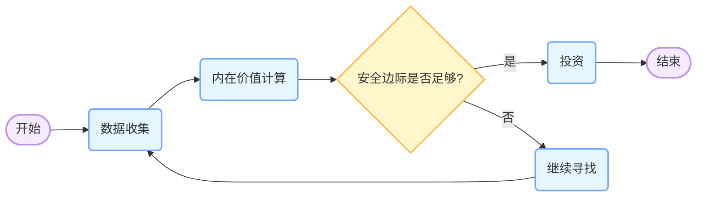

# 格雷厄姆特价股票理论在新兴产业中的应用

> 关键词：格雷厄姆特价股票理论、新兴产业、价值投资、股票分析、市场评估

> 摘要：本文聚焦于格雷厄姆特价股票理论在新兴产业中的应用。首先介绍了该理论的背景及相关概念，阐述其核心思想与架构。接着深入剖析核心算法原理，并通过Python代码进行详细说明。同时给出相关数学模型和公式，结合实例进行讲解。在项目实战部分，展示了开发环境搭建、源代码实现与解读。还探讨了该理论在新兴产业中的实际应用场景，推荐了学习资源、开发工具框架以及相关论文著作。最后总结了未来发展趋势与挑战，并提供常见问题解答和扩展阅读参考资料，旨在为投资者在新兴产业运用格雷厄姆特价股票理论提供全面而深入的指导。

## 1. 背景介绍 
### 1.1 目的和范围
本文章的主要目的是深入探讨格雷厄姆特价股票理论在新兴产业中的应用。随着科技的飞速发展，新兴产业如人工智能、生物技术、新能源等不断涌现，这些产业具有高增长潜力但同时也伴随着高风险和不确定性。格雷厄姆特价股票理论作为价值投资的经典理论，旨在寻找被市场低估的股票，为投资者提供安全边际。然而，新兴产业的特点与传统产业有很大不同，这就需要我们重新审视该理论在新兴产业中的适用性和应用方法。本文将从理论原理、算法实现、实际案例等多个方面进行分析，为投资者在新兴产业中运用该理论进行股票投资提供参考。

### 1.2 预期读者
本文预期读者包括对股票投资感兴趣的个人投资者、金融行业从业者、投资研究人员以及相关专业的学生。无论是初学者希望了解格雷厄姆特价股票理论在新兴产业中的应用方法，还是有一定经验的投资者想要深入研究如何在新兴市场中运用该理论进行资产配置，都能从本文中获得有价值的信息。

### 1.3 文档结构概述
本文将按照以下结构进行组织：首先介绍核心概念与联系，包括格雷厄姆特价股票理论的原理和架构，并通过文本示意图和Mermaid流程图进行展示；接着详细阐述核心算法原理，使用Python源代码进行具体操作步骤的说明；然后给出相关的数学模型和公式，并结合实际例子进行讲解；在项目实战部分，会介绍开发环境搭建、源代码详细实现和代码解读；之后探讨该理论在新兴产业中的实际应用场景；再推荐学习资源、开发工具框架以及相关论文著作；最后总结未来发展趋势与挑战，提供常见问题解答和扩展阅读参考资料。

### 1.4 术语表
#### 1.4.1 核心术语定义
- **格雷厄姆特价股票理论**：由本杰明·格雷厄姆提出的价值投资理论，核心思想是寻找那些价格低于其内在价值的股票，通过分析公司的财务报表和基本面信息，评估股票的内在价值，当股票价格低于内在价值一定程度时，认为该股票具有投资价值。
- **新兴产业**：指随着新的科研成果和新兴技术的发明、应用而出现的新的部门和行业，如人工智能、生物技术、新能源、新材料等，具有高创新性、高增长性、高风险性等特点。
- **内在价值**：指股票所代表的公司的真实价值，是根据公司的资产、盈利能力、现金流等基本面因素计算得出的价值。
- **安全边际**：指股票的内在价值与市场价格之间的差值，安全边际越大，投资风险越低。

#### 1.4.2 相关概念解释
- **价值投资**：一种投资策略，强调通过分析公司的基本面，寻找被市场低估的股票，长期持有以获取价值回归带来的收益。
- **基本面分析**：通过研究公司的财务报表、行业前景、管理团队等基本面因素，评估公司的内在价值和投资价值。
- **市场效率**：指市场价格反映所有可用信息的程度，有效市场假说认为市场价格能够迅速、准确地反映所有信息，而格雷厄姆特价股票理论则认为市场存在无效性，存在被低估的股票。

#### 1.4.3 缩略词列表
- **PE**：市盈率（Price-to-Earnings Ratio），指股票价格与每股收益的比率，用于衡量股票的估值水平。
- **PB**：市净率（Price-to-Book Ratio），指股票价格与每股净资产的比率，用于衡量股票的估值水平。
- **DCF**：现金流折现法（Discounted Cash Flow），一种计算股票内在价值的方法，通过预测公司未来的现金流，并将其折现到当前时点来计算内在价值。

## 2. 核心概念与联系 

### 格雷厄姆特价股票理论原理
格雷厄姆特价股票理论的核心是寻找被市场低估的股票，即股票的市场价格低于其内在价值。该理论认为，市场有时会出现非理性的波动，导致股票价格偏离其内在价值。投资者可以通过对公司的基本面分析，如财务报表、盈利能力、资产质量等，评估股票的内在价值，当股票价格低于内在价值一定程度时，就可以认为该股票具有投资价值。

### 架构示意图
以下是格雷厄姆特价股票理论在新兴产业中应用的文本示意图：

```plaintext
格雷厄姆特价股票理论在新兴产业中的应用
|-- 核心思想：寻找被低估的新兴产业股票
|   |-- 内在价值评估
|   |   |-- 财务分析（资产、盈利、现金流）
|   |   |-- 行业前景分析
|   |   |-- 竞争优势分析
|   |-- 安全边际计算
|       |-- 内在价值 - 市场价格
|-- 应用流程
|   |-- 数据收集（财务报表、行业报告）
|   |-- 内在价值计算
|   |   |-- 传统方法（PE、PB）
|   |   |-- 现金流折现法（DCF）
|   |-- 安全边际评估
|   |-- 投资决策
```

### Mermaid流程图


## 3. 核心算法原理 & 具体操作步骤 

### 核心算法原理
格雷厄姆特价股票理论的核心算法是计算股票的内在价值和安全边际。常见的计算内在价值的方法有市盈率法（PE）、市净率法（PB）和现金流折现法（DCF）。

#### 市盈率法（PE）
市盈率法是通过公司的每股收益（EPS）和行业平均市盈率（PE）来计算股票的内在价值。公式为：
$$V = EPS \times PE_{avg}$$
其中，$V$ 表示股票的内在价值，$EPS$ 表示每股收益，$PE_{avg}$ 表示行业平均市盈率。

#### 市净率法（PB）
市净率法是通过公司的每股净资产（BVPS）和行业平均市净率（PB）来计算股票的内在价值。公式为：
$$V = BVPS \times PB_{avg}$$
其中，$V$ 表示股票的内在价值，$BVPS$ 表示每股净资产，$PB_{avg}$ 表示行业平均市净率。

#### 现金流折现法（DCF）
现金流折现法是通过预测公司未来的现金流，并将其折现到当前时点来计算股票的内在价值。公式为：
$$V = \sum_{t=1}^{n} \frac{CF_t}{(1 + r)^t} + \frac{TV}{(1 + r)^n}$$
其中，$V$ 表示股票的内在价值，$CF_t$ 表示第 $t$ 年的现金流，$r$ 表示折现率，$n$ 表示预测期数，$TV$ 表示终值。

### 具体操作步骤
以下是使用Python实现上述算法的具体代码：

```python
# 市盈率法计算内在价值
def pe_valuation(eps, pe_avg):
    """
    使用市盈率法计算股票的内在价值
    :param eps: 每股收益
    :param pe_avg: 行业平均市盈率
    :return: 股票的内在价值
    """
    return eps * pe_avg

# 市净率法计算内在价值
def pb_valuation(bvps, pb_avg):
    """
    使用市净率法计算股票的内在价值
    :param bvps: 每股净资产
    :param pb_avg: 行业平均市净率
    :return: 股票的内在价值
    """
    return bvps * pb_avg

# 现金流折现法计算内在价值
def dcf_valuation(cash_flows, discount_rate, terminal_value):
    """
    使用现金流折现法计算股票的内在价值
    :param cash_flows: 未来各年的现金流列表
    :param discount_rate: 折现率
    :param terminal_value: 终值
    :return: 股票的内在价值
    """
    n = len(cash_flows)
    present_value = 0
    for t in range(n):
        present_value += cash_flows[t] / ((1 + discount_rate) ** (t + 1))
    present_value += terminal_value / ((1 + discount_rate) ** n)
    return present_value

# 示例数据
eps = 2.0  # 每股收益
pe_avg = 15  # 行业平均市盈率
bvps = 10.0  # 每股净资产
pb_avg = 2.0  # 行业平均市净率
cash_flows = [100, 120, 150, 180, 200]  # 未来5年的现金流
discount_rate = 0.1  # 折现率
terminal_value = 1000  # 终值

# 计算内在价值
pe_value = pe_valuation(eps, pe_avg)
pb_value = pb_valuation(bvps, pb_avg)
dcf_value = dcf_valuation(cash_flows, discount_rate, terminal_value)

print(f"市盈率法计算的内在价值: {pe_value}")
print(f"市净率法计算的内在价值: {pb_value}")
print(f"现金流折现法计算的内在价值: {dcf_value}")
```

### 代码解释
- `pe_valuation` 函数：接受每股收益和行业平均市盈率作为输入，返回使用市盈率法计算的股票内在价值。
- `pb_valuation` 函数：接受每股净资产和行业平均市净率作为输入，返回使用市净率法计算的股票内在价值。
- `dcf_valuation` 函数：接受未来各年的现金流列表、折现率和终值作为输入，返回使用现金流折现法计算的股票内在价值。
- 示例数据部分：定义了每股收益、行业平均市盈率、每股净资产、行业平均市净率、未来5年的现金流、折现率和终值等数据。
- 计算内在价值部分：分别调用上述三个函数计算不同方法下的股票内在价值，并打印结果。

## 4. 数学模型和公式 & 详细讲解 & 举例说明 

### 市盈率法（PE）
#### 数学公式
$$V = EPS \times PE_{avg}$$

#### 详细讲解
市盈率法是一种简单直观的计算股票内在价值的方法。每股收益（EPS）反映了公司的盈利能力，行业平均市盈率（$PE_{avg}$）反映了市场对该行业的估值水平。通过将每股收益乘以行业平均市盈率，我们可以得到一个大致的股票内在价值。

#### 举例说明
假设一家新兴产业公司的每股收益为 $2$ 元，该行业的平均市盈率为 $15$ 倍。则使用市盈率法计算的该股票的内在价值为：
$$V = 2 \times 15 = 30$$（元）

### 市净率法（PB）
#### 数学公式
$$V = BVPS \times PB_{avg}$$

#### 详细讲解
市净率法主要关注公司的净资产。每股净资产（BVPS）反映了公司每股股票所代表的净资产价值，行业平均市净率（$PB_{avg}$）反映了市场对该行业净资产的估值水平。通过将每股净资产乘以行业平均市净率，我们可以得到股票的内在价值。

#### 举例说明
假设一家新兴产业公司的每股净资产为 $10$ 元，该行业的平均市净率为 $2$ 倍。则使用市净率法计算的该股票的内在价值为：
$$V = 10 \times 2 = 20$$（元）

### 现金流折现法（DCF）
#### 数学公式
$$V = \sum_{t=1}^{n} \frac{CF_t}{(1 + r)^t} + \frac{TV}{(1 + r)^n}$$

#### 详细讲解
现金流折现法是一种更为复杂但也更为准确的计算股票内在价值的方法。它考虑了公司未来的现金流和资金的时间价值。$CF_t$ 表示第 $t$ 年的现金流，$r$ 表示折现率，$n$ 表示预测期数，$TV$ 表示终值。通过将未来各年的现金流折现到当前时点，并加上终值的折现值，我们可以得到股票的内在价值。

#### 举例说明
假设一家新兴产业公司未来5年的现金流分别为 $100$ 万元、$120$ 万元、$150$ 万元、$180$ 万元、$200$ 万元，折现率为 $10\%$，终值为 $1000$ 万元。则使用现金流折现法计算的该股票的内在价值为：

首先计算每年现金流的折现值：
- 第1年：$\frac{100}{(1 + 0.1)^1} \approx 90.91$（万元）
- 第2年：$\frac{120}{(1 + 0.1)^2} \approx 99.17$（万元）
- 第3年：$\frac{150}{(1 + 0.1)^3} \approx 112.70$（万元）
- 第4年：$\frac{180}{(1 + 0.1)^4} \approx 122.94$（万元）
- 第5年：$\frac{200}{(1 + 0.1)^5} \approx 124.18$（万元）

然后计算终值的折现值：
$\frac{1000}{(1 + 0.1)^5} \approx 620.92$（万元）

最后将各年现金流折现值和终值折现值相加：
$V = 90.91 + 99.17 + 112.70 + 122.94 + 124.18 + 620.92 \approx 1170.82$（万元）

## 5. 项目实战：代码实际案例和详细解释说明 

### 5.1  开发环境搭建
#### 操作系统
本项目可以在Windows、Mac OS或Linux操作系统上进行开发。建议使用较新的操作系统版本，以确保兼容性和性能。

#### Python环境
本项目使用Python进行开发，建议使用Python 3.7及以上版本。可以从Python官方网站（https://www.python.org/downloads/）下载并安装Python。

#### 开发工具
可以使用以下开发工具进行代码编写和调试：
- **PyCharm**：一款专业的Python集成开发环境（IDE），提供代码编辑、调试、版本控制等功能。
- **Jupyter Notebook**：一个交互式的开发环境，适合进行数据探索和代码测试。

#### 安装依赖库
本项目需要使用以下Python库：
- `pandas`：用于数据处理和分析。
- `numpy`：用于数值计算。

可以使用以下命令安装这些库：
```sh
pip install pandas numpy
```

### 5.2  源代码详细实现和代码解读
以下是一个完整的项目实战代码，用于计算新兴产业公司股票的内在价值和安全边际：

```python
import pandas as pd
import numpy as np

# 市盈率法计算内在价值
def pe_valuation(eps, pe_avg):
    return eps * pe_avg

# 市净率法计算内在价值
def pb_valuation(bvps, pb_avg):
    return bvps * pb_avg

# 现金流折现法计算内在价值
def dcf_valuation(cash_flows, discount_rate, terminal_value):
    n = len(cash_flows)
    present_value = 0
    for t in range(n):
        present_value += cash_flows[t] / ((1 + discount_rate) ** (t + 1))
    present_value += terminal_value / ((1 + discount_rate) ** n)
    return present_value

# 计算安全边际
def safety_margin(intrinsic_value, market_price):
    return (intrinsic_value - market_price) / intrinsic_value

# 示例数据
data = {
    '公司名称': ['新兴科技公司A', '新兴科技公司B'],
    '每股收益': [2.0, 1.5],
    '每股净资产': [10.0, 8.0],
    '行业平均市盈率': [15, 15],
    '行业平均市净率': [2.0, 2.0],
    '未来现金流': [
        [100, 120, 150, 180, 200],
        [80, 100, 120, 140, 160]
    ],
    '折现率': [0.1, 0.1],
    '终值': [1000, 800],
    '市场价格': [25, 20]
}

df = pd.DataFrame(data)

# 计算内在价值和安全边际
pe_values = []
pb_values = []
dcf_values = []
safety_margins_pe = []
safety_margins_pb = []
safety_margins_dcf = []

for index, row in df.iterrows():
    eps = row['每股收益']
    bvps = row['每股净资产']
    pe_avg = row['行业平均市盈率']
    pb_avg = row['行业平均市净率']
    cash_flows = row['未来现金流']
    discount_rate = row['折现率']
    terminal_value = row['终值']
    market_price = row['市场价格']

    pe_value = pe_valuation(eps, pe_avg)
    pb_value = pb_valuation(bvps, pb_avg)
    dcf_value = dcf_valuation(cash_flows, discount_rate, terminal_value)

    safety_margin_pe = safety_margin(pe_value, market_price)
    safety_margin_pb = safety_margin(pb_value, market_price)
    safety_margin_dcf = safety_margin(dcf_value, market_price)

    pe_values.append(pe_value)
    pb_values.append(pb_value)
    dcf_values.append(dcf_value)
    safety_margins_pe.append(safety_margin_pe)
    safety_margins_pb.append(safety_margin_pb)
    safety_margins_dcf.append(safety_margin_dcf)

df['PE内在价值'] = pe_values
df['PB内在价值'] = pb_values
df['DCF内在价值'] = dcf_values
df['PE安全边际'] = safety_margins_pe
df['PB安全边际'] = safety_margins_pb
df['DCF安全边际'] = safety_margins_dcf

# 输出结果
print(df)
```

### 5.3  代码解读与分析
#### 代码结构
- **函数定义部分**：定义了 `pe_valuation`、`pb_valuation`、`dcf_valuation` 和 `safety_margin` 四个函数，分别用于计算市盈率法、市净率法、现金流折现法的内在价值和安全边际。
- **数据准备部分**：使用字典 `data` 定义了两家新兴科技公司的相关数据，包括每股收益、每股净资产、行业平均市盈率、行业平均市净率、未来现金流、折现率、终值和市场价格。然后使用 `pandas` 库将数据转换为 `DataFrame` 对象。
- **计算部分**：使用 `for` 循环遍历 `DataFrame` 中的每一行，调用上述定义的函数计算每家公司的内在价值和安全边际，并将结果存储在相应的列表中。
- **结果输出部分**：将计算得到的内在价值和安全边际添加到 `DataFrame` 中，并打印输出。

#### 分析
通过这个代码示例，我们可以看到如何使用不同的方法计算新兴产业公司股票的内在价值和安全边际。不同的计算方法可能会得到不同的结果，投资者可以根据自己的需求和判断选择合适的方法。同时，安全边际的计算可以帮助投资者评估投资风险，安全边际越大，投资风险越低。

## 6. 实际应用场景 
### 新兴科技产业
在新兴科技产业中，如人工智能、大数据、云计算等领域，公司的发展速度快，但也面临着较高的不确定性。格雷厄姆特价股票理论可以帮助投资者筛选出那些被市场低估的股票。例如，一些新兴科技公司可能由于短期业绩不佳或市场对其未来发展存在疑虑，导致股票价格下跌。但通过深入分析公司的技术实力、市场前景和财务状况，投资者可以发现其内在价值可能被低估，从而抓住投资机会。

### 生物技术产业
生物技术产业具有研发周期长、投入大、风险高的特点。一些生物技术公司在研发阶段可能没有盈利，但一旦研发成功，将带来巨大的收益。格雷厄姆特价股票理论可以通过对公司的研发管线、专利技术、临床试验进展等方面进行分析，评估其内在价值。当股票价格低于内在价值时，投资者可以考虑投资。

### 新能源产业
随着全球对环境保护和可持续发展的重视，新能源产业如太阳能、风能、电动汽车等得到了快速发展。但新能源产业也面临着技术更新换代快、市场竞争激烈等问题。格雷厄姆特价股票理论可以帮助投资者在众多新能源公司中筛选出具有投资价值的股票。例如，通过分析公司的成本控制能力、市场份额、技术创新能力等因素，评估其内在价值，寻找被低估的投资机会。

## 7. 工具和资源推荐
### 7.1 学习资源推荐
#### 7.1.1 书籍推荐
- 《聪明的投资者》（The Intelligent Investor）：本杰明·格雷厄姆的经典著作，详细阐述了价值投资的理念和方法，是学习格雷厄姆特价股票理论的必读之书。
- 《证券分析》（Security Analysis）：同样是本杰明·格雷厄姆的著作，对证券分析的基本原理和方法进行了系统的介绍，对于深入理解股票估值和投资分析具有重要意义。
- 《财务报表分析与证券定价》（Financial Statement Analysis and Security Valuation）：这本书结合了财务报表分析和证券定价的理论与实践，帮助读者掌握如何通过财务报表评估公司的内在价值。

#### 7.1.2 在线课程
- Coursera上的“投资学原理”（Principles of Investing）课程：由知名教授授课，涵盖了投资学的基本原理和方法，包括价值投资、股票分析等内容。
- Udemy上的“价值投资实战课程”（Value Investing Practical Course）：通过实际案例讲解价值投资的方法和技巧，帮助学员掌握如何运用格雷厄姆特价股票理论进行投资。

#### 7.1.3 技术博客和网站
- 雪球网（https://xueqiu.com/）：国内知名的投资交流平台，提供股票行情、财务数据、投资分析等信息，同时还有很多投资者分享自己的投资经验和见解。
- Seeking Alpha（https://seekingalpha.com/）：国外知名的投资研究网站，提供全球股票市场的分析报告、投资策略等内容，对于了解国际市场和学习价值投资有很大帮助。

### 7.2 开发工具框架推荐
#### 7.2.1 IDE和编辑器
- PyCharm：专业的Python集成开发环境，具有代码编辑、调试、版本控制等功能，适合进行Python项目的开发。
- Jupyter Notebook：交互式的开发环境，适合进行数据探索和代码测试，方便用户快速验证算法和模型。

#### 7.2.2 调试和性能分析工具
- `pdb`：Python自带的调试工具，可以帮助用户在代码运行过程中进行调试，定位问题。
- `cProfile`：Python的性能分析工具，可以帮助用户分析代码的性能瓶颈，优化代码效率。

#### 7.2.3 相关框架和库
- `pandas`：用于数据处理和分析的Python库，提供了高效的数据结构和数据操作方法，方便用户处理财务数据。
- `numpy`：用于数值计算的Python库，提供了高效的数组操作和数学函数，是进行金融计算的常用工具。

### 7.3 相关论文著作推荐
#### 7.3.1 经典论文
- Graham, B., & Dodd, D. L. (1934). Security Analysis. This classic paper laid the foundation for value investing and introduced the concept of intrinsic value.
- Fama, E. F., & French, K. R. (1992). The cross-section of expected stock returns. This paper proposed the Fama-French three-factor model, which has important implications for understanding stock returns.

#### 7.3.2 最新研究成果
- Recent research on the application of value investing in emerging industries has focused on topics such as the impact of technological innovation on stock valuation and the role of risk management in emerging market investments. You can find relevant papers on academic databases such as Google Scholar and SSRN.

#### 7.3.3 应用案例分析
- Case studies of successful value investments in emerging industries can provide valuable insights for investors. You can find such case studies in business magazines, investment research reports, and online investment communities.

## 8. 总结：未来发展趋势与挑战
### 未来发展趋势
- **结合新兴技术**：随着人工智能、机器学习等新兴技术的发展，格雷厄姆特价股票理论在新兴产业中的应用将更加智能化和精准化。例如，利用机器学习算法可以更准确地预测公司的未来现金流和内在价值，提高投资决策的效率和准确性。
- **跨行业融合**：新兴产业之间的边界越来越模糊，不同行业之间的融合趋势越来越明显。格雷厄姆特价股票理论将更加注重跨行业的分析和比较，寻找那些具有跨行业竞争优势和增长潜力的公司。
- **国际化投资**：随着全球经济一体化的发展，投资者将更加关注国际市场上的新兴产业投资机会。格雷厄姆特价股票理论将在国际化投资中发挥重要作用，帮助投资者在全球范围内寻找被低估的股票。

### 挑战
- **新兴产业的不确定性**：新兴产业的发展具有较高的不确定性，技术创新、市场需求、政策法规等因素都可能对公司的发展产生重大影响。这使得准确评估新兴产业公司的内在价值变得更加困难，增加了投资风险。
- **数据质量和可用性**：在新兴产业中，一些公司可能处于发展初期，财务数据不够完善，或者行业数据缺乏标准化和可比性。这给基于财务数据的内在价值评估带来了挑战，需要投资者采用更加灵活和多元化的方法进行分析。
- **市场情绪和短期波动**：新兴产业股票市场往往受到市场情绪和短期波动的影响较大。投资者在运用格雷厄姆特价股票理论进行投资时，需要克服市场情绪的干扰，坚持价值投资的理念，避免盲目跟风和短期投机行为。

## 9. 附录：常见问题与解答
### 问题1：格雷厄姆特价股票理论在新兴产业中的适用性如何？
答：格雷厄姆特价股票理论的核心思想是寻找被低估的股票，这在新兴产业中仍然具有一定的适用性。然而，新兴产业具有高增长、高风险、技术创新快等特点，与传统产业有很大不同。因此，在应用该理论时，需要对传统的估值方法进行适当调整，更加关注公司的技术实力、市场前景、创新能力等因素。

### 问题2：如何确定新兴产业公司的内在价值？
答：确定新兴产业公司的内在价值可以采用多种方法，如市盈率法、市净率法、现金流折现法等。但由于新兴产业的特殊性，这些方法可能存在一定的局限性。在实际应用中，可以结合多种方法进行综合评估，同时考虑公司的技术创新能力、市场份额、行业竞争格局等因素。

### 问题3：安全边际在新兴产业投资中有什么作用？
答：安全边际是格雷厄姆特价股票理论的重要概念之一，它表示股票的内在价值与市场价格之间的差值。在新兴产业投资中，由于行业的不确定性较高，安全边际可以为投资者提供一定的缓冲，降低投资风险。当股票价格低于内在价值一定程度时，投资者可以认为该股票具有足够的安全边际，从而增加投资的成功率。

### 问题4：如何应对新兴产业投资中的不确定性？
答：应对新兴产业投资中的不确定性可以从以下几个方面入手：一是进行充分的研究和分析，了解行业的发展趋势、技术动态和市场需求；二是分散投资，降低单一股票的风险；三是设定合理的投资目标和止损点，避免过度投资和盲目跟风；四是关注政策法规的变化，及时调整投资策略。

## 10. 扩展阅读 & 参考资料
### 扩展阅读
- 《价值投资实战手册》：这本书结合了实际案例，详细介绍了价值投资的方法和技巧，对于初学者和有一定经验的投资者都有很大的帮助。
- 《投资中最简单的事》：作者通过自己的投资经验，分享了一些简单而有效的投资原则和方法，对于理解价值投资的本质具有重要意义。

### 参考资料
- Graham, B. (1949). The Intelligent Investor. HarperBusiness.
- Damodaran, A. (2012). Investment Valuation: Tools and Techniques for Determining the Value of Any Asset. Wiley.
- Fama, E. F., & French, K. R. (1992). The cross-section of expected stock returns. Journal of Finance, 47(2), 427-465.

作者：AI天才研究院/AI Genius Institute & 禅与计算机程序设计艺术 /Zen And The Art of Computer Programming