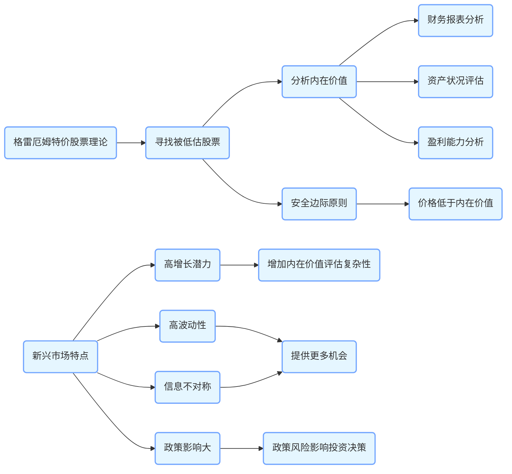

# 格雷厄姆特价股票理论在新兴市场的适用性

> 关键词：格雷厄姆特价股票理论、新兴市场、价值投资、适用性、股票分析

> 摘要：本文旨在深入探讨格雷厄姆特价股票理论在新兴市场的适用性。首先介绍了该理论的背景及相关概念，阐述其核心原理与架构。通过数学模型和公式详细剖析理论要点，并结合Python代码给出具体操作步骤。以实际案例展示理论在新兴市场的应用，分析其在新兴市场不同场景下的表现。同时推荐了学习该理论及进行相关研究的工具和资源。最后总结了理论在新兴市场的未来发展趋势与挑战，解答常见问题并提供扩展阅读和参考资料，帮助读者全面了解格雷厄姆特价股票理论在新兴市场的应用情况。

## 1. 背景介绍 
### 1.1 目的和范围
本研究的主要目的是评估格雷厄姆特价股票理论在新兴市场的适用性。新兴市场具有高增长潜力、高波动性和信息不对称等特点，与格雷厄姆提出该理论时所基于的成熟市场环境存在显著差异。通过对该理论在新兴市场的应用分析，我们希望为投资者在新兴市场的投资决策提供参考，明确该理论在新兴市场的优势和局限性。研究范围涵盖了新兴市场的股票市场特征、格雷厄姆特价股票理论的核心要点以及两者之间的相互关系，并通过实际案例和数据进行验证。

### 1.2 预期读者
本文预期读者包括对价值投资感兴趣的个人投资者、金融分析师、投资机构从业者以及相关领域的研究人员。对于个人投资者，本文可以帮助他们了解如何运用格雷厄姆特价股票理论在新兴市场进行投资；金融分析师和投资机构从业者可以从中获取关于新兴市场投资策略的新视角；研究人员则可以在理论的适用性和改进方面获得有价值的参考。

### 1.3 文档结构概述
本文将按照以下结构展开：首先介绍格雷厄姆特价股票理论和新兴市场的相关核心概念及联系；接着详细阐述该理论的核心算法原理和具体操作步骤，并给出Python代码实现；通过数学模型和公式进一步解释理论要点，并举例说明；然后通过实际项目案例展示该理论在新兴市场的应用；分析该理论在新兴市场的实际应用场景；推荐学习和研究该理论的工具和资源；最后总结理论在新兴市场的未来发展趋势与挑战，解答常见问题并提供扩展阅读和参考资料。

### 1.4 术语表
#### 1.4.1 核心术语定义
- **格雷厄姆特价股票理论**：由本杰明·格雷厄姆提出的一种价值投资理论，强调通过分析股票的内在价值，寻找价格低于内在价值的股票进行投资。
- **新兴市场**：指发展中国家或地区的股票市场，通常具有较高的经济增长率、市场波动性和发展潜力，但也存在市场制度不完善、信息披露不充分等问题。
- **内在价值**：股票所代表的企业的真实价值，通过对企业的财务状况、盈利能力、资产质量等因素进行综合评估得出。
- **安全边际**：股票市场价格与内在价值之间的差额，安全边际越大，投资风险越低。

#### 1.4.2 相关概念解释
- **价值投资**：一种投资策略，基于对股票内在价值的分析，选择被低估的股票进行投资，以获取长期的投资回报。
- **成长投资**：侧重于寻找具有高成长潜力的企业进行投资，更关注企业的未来发展前景而非当前的价值。
- **市场有效性**：指市场价格能够充分反映所有可用信息的程度。新兴市场通常被认为市场有效性较低，存在更多的投资机会。

#### 1.4.3 缩略词列表
- **P/E**：市盈率（Price-to-Earnings Ratio），即股票价格与每股收益的比率，用于衡量股票的估值水平。
- **P/B**：市净率（Price-to-Book Ratio），即股票价格与每股净资产的比率，反映了股票价格相对于净资产的倍数。
- **ROE**：净资产收益率（Return on Equity），衡量企业运用自有资本的效率，反映股东权益的收益水平。

## 2. 核心概念与联系 

### 格雷厄姆特价股票理论核心原理
格雷厄姆特价股票理论的核心在于寻找被市场低估的股票，即股票的市场价格低于其内在价值。该理论认为，市场有时会出现非理性行为，导致股票价格偏离其内在价值。投资者可以通过深入分析企业的财务报表、资产状况、盈利能力等因素，计算出股票的内在价值，并在价格低于内在价值时买入股票，等待市场价格回归内在价值，从而获得投资收益。

### 新兴市场的特点
新兴市场通常具有以下特点：
- **高增长潜力**：新兴市场所在国家或地区的经济处于快速发展阶段，企业具有较高的成长空间。
- **高波动性**：市场规模相对较小，投资者结构不够成熟，容易受到外部因素的影响，导致股票价格波动较大。
- **信息不对称**：市场制度和监管体系不够完善，企业信息披露可能不充分，投资者获取信息的难度较大。
- **政策影响大**：政府的经济政策和监管措施对市场的影响较为显著。

### 两者的联系
格雷厄姆特价股票理论在新兴市场的适用性受到新兴市场特点的影响。一方面，新兴市场的高波动性和信息不对称可能导致更多的股票价格偏离内在价值，为价值投资者提供了更多寻找特价股票的机会。另一方面，新兴市场的高增长潜力也使得企业的内在价值评估更加复杂，需要考虑更多的不确定性因素。同时，政策的频繁变化也增加了投资的风险，需要投资者更加谨慎地运用该理论。

### 文本示意图
```plaintext
格雷厄姆特价股票理论
|--寻找被低估股票
|   |--分析内在价值
|       |--财务报表分析
|       |--资产状况评估
|       |--盈利能力分析
|--安全边际原则
|   |--价格低于内在价值

新兴市场特点
|--高增长潜力
|--高波动性
|--信息不对称
|--政策影响大

联系
|--新兴市场提供更多机会
|--增加内在价值评估复杂性
|--政策风险影响投资决策
```

### Mermaid 流程图


## 3. 核心算法原理 & 具体操作步骤 

### 核心算法原理
格雷厄姆特价股票理论的核心算法主要围绕计算股票的内在价值和评估安全边际展开。一种常见的计算内在价值的方法是使用格雷厄姆公式：

$V = EPS \times (8.5 + 2g)$

其中，$V$ 表示股票的内在价值，$EPS$ 是每股收益，$g$ 是预期的未来增长率。系数 8.5 是格雷厄姆认为的一家无增长公司的合理市盈率，2 是对预期增长率的调整系数。

安全边际的计算方法为：

$安全边际 = \frac{内在价值 - 市场价格}{内在价值}$

### 具体操作步骤
1. **数据收集**：收集目标股票的财务报表，包括资产负债表、利润表和现金流量表，获取每股收益、净资产等关键数据。同时，收集行业数据和宏观经济数据，以评估企业的未来增长率。
2. **计算每股收益（EPS）**：从利润表中获取净利润数据，除以总股本得到每股收益。
3. **估计未来增长率（g）**：可以通过分析企业的历史增长率、行业平均增长率以及宏观经济环境等因素来估计未来增长率。
4. **计算内在价值（V）**：使用格雷厄姆公式计算股票的内在价值。
5. **获取市场价格**：从证券交易所或金融数据提供商获取目标股票的当前市场价格。
6. **计算安全边际**：根据上述公式计算安全边际。
7. **筛选股票**：选择安全边际较大的股票进行投资。

### Python 代码实现
```python
import pandas as pd

def calculate_eps(net_income, total_shares):
    """
    计算每股收益
    :param net_income: 净利润
    :param total_shares: 总股本
    :return: 每股收益
    """
    return net_income / total_shares

def calculate_intrinsic_value(eps, growth_rate):
    """
    使用格雷厄姆公式计算内在价值
    :param eps: 每股收益
    :param growth_rate: 预期未来增长率
    :return: 内在价值
    """
    return eps * (8.5 + 2 * growth_rate)

def calculate_safety_margin(intrinsic_value, market_price):
    """
    计算安全边际
    :param intrinsic_value: 内在价值
    :param market_price: 市场价格
    :return: 安全边际
    """
    return (intrinsic_value - market_price) / intrinsic_value

# 示例数据
net_income = 1000000  # 净利润
total_shares = 100000  # 总股本
growth_rate = 0.1  # 预期未来增长率
market_price = 50  # 市场价格

# 计算每股收益
eps = calculate_eps(net_income, total_shares)
print(f"每股收益: {eps}")

# 计算内在价值
intrinsic_value = calculate_intrinsic_value(eps, growth_rate)
print(f"内在价值: {intrinsic_value}")

# 计算安全边际
safety_margin = calculate_safety_margin(intrinsic_value, market_price)
print(f"安全边际: {safety_margin}")

# 筛选股票示例
stocks = pd.DataFrame({
    '股票代码': ['000001', '000002', '000003'],
    '净利润': [1000000, 2000000, 1500000],
    '总股本': [100000, 200000, 150000],
    '预期增长率': [0.1, 0.15, 0.12],
    '市场价格': [50, 60, 55]
})

stocks['每股收益'] = stocks.apply(lambda row: calculate_eps(row['净利润'], row['总股本']), axis=1)
stocks['内在价值'] = stocks.apply(lambda row: calculate_intrinsic_value(row['每股收益'], row['预期增长率']), axis=1)
stocks['安全边际'] = stocks.apply(lambda row: calculate_safety_margin(row['内在价值'], row['市场价格']), axis=1)

# 筛选安全边际大于 0.2 的股票
selected_stocks = stocks[stocks['安全边际'] > 0.2]
print("筛选后的股票:")
print(selected_stocks)
```

## 4. 数学模型和公式 & 详细讲解 & 举例说明 

### 格雷厄姆公式
$$V = EPS \times (8.5 + 2g)$$

#### 详细讲解
- **$V$（内在价值）**：表示股票的真实价值，是投资者应该关注的核心指标。通过该公式计算出的内在价值可以与市场价格进行比较，判断股票是否被低估。
- **$EPS$（每股收益）**：反映了企业的盈利能力，是净利润除以总股本得到的结果。每股收益越高，说明企业的盈利能力越强。
- **8.5**：格雷厄姆认为一家无增长公司的合理市盈率。这是一个经验值，代表了在没有增长预期的情况下，市场对公司盈利的合理估值倍数。
- **$g$（预期未来增长率）**：衡量企业未来的增长潜力。增长率越高，说明企业的发展前景越好，股票的内在价值也会相应提高。
- **$2$**：是对预期增长率的调整系数，用于放大增长率对内在价值的影响。

#### 举例说明
假设某公司的每股收益为 2 元，预期未来增长率为 15%。根据格雷厄姆公式，该股票的内在价值为：

$$V = 2 \times (8.5 + 2 \times 0.15) = 2 \times (8.5 + 0.3) = 2 \times 8.8 = 17.6$$（元）

如果该股票的当前市场价格为 15 元，那么安全边际为：

$$安全边际 = \frac{17.6 - 15}{17.6} \approx 0.148 = 14.8\%$$

### 安全边际公式
$$安全边际 = \frac{内在价值 - 市场价格}{内在价值}$$

#### 详细讲解
安全边际是格雷厄姆特价股票理论中的重要概念，它反映了投资的风险程度。安全边际越大，说明股票价格低于内在价值的幅度越大，投资的风险越低。当安全边际为正时，意味着股票被低估；当安全边际为负时，股票被高估。

#### 举例说明
继续以上述例子为例，股票的内在价值为 17.6 元，市场价格为 15 元，安全边际为 14.8%。这表明投资者以 15 元的价格买入该股票，相对于其内在价值有一定的折扣，即使未来公司的发展出现一定的偏差，投资者也有一定的缓冲空间。

### 其他相关公式
- **市盈率（P/E）**：
$$P/E = \frac{市场价格}{每股收益}$$

市盈率是衡量股票估值水平的常用指标。一般来说，市盈率越低，股票越被低估。

- **市净率（P/B）**：
$$P/B = \frac{市场价格}{每股净资产}$$

市净率反映了股票价格相对于净资产的倍数。市净率较低的股票可能具有较高的投资价值。

#### 举例说明
假设某股票的市场价格为 20 元，每股收益为 2 元，每股净资产为 10 元。则该股票的市盈率为：

$$P/E = \frac{20}{2} = 10$$

市净率为：

$$P/B = \frac{20}{10} = 2$$

通过与同行业其他股票的市盈率和市净率进行比较，可以判断该股票的估值水平。

## 5. 项目实战：代码实际案例和详细解释说明 

### 5.1  开发环境搭建
#### 操作系统
可以选择 Windows、Linux 或 macOS 操作系统。建议使用较新的版本，以确保系统的稳定性和兼容性。

#### Python 安装
首先需要安装 Python 环境，建议使用 Python 3.7 及以上版本。可以从 Python 官方网站（https://www.python.org/downloads/）下载安装包，按照安装向导进行安装。

#### 依赖库安装
在命令行中使用以下命令安装所需的依赖库：
```sh
pip install pandas
```

### 5.2  源代码详细实现和代码解读
```python
import pandas as pd

def calculate_eps(net_income, total_shares):
    """
    计算每股收益
    :param net_income: 净利润
    :param total_shares: 总股本
    :return: 每股收益
    """
    return net_income / total_shares

def calculate_intrinsic_value(eps, growth_rate):
    """
    使用格雷厄姆公式计算内在价值
    :param eps: 每股收益
    :param growth_rate: 预期未来增长率
    :return: 内在价值
    """
    return eps * (8.5 + 2 * growth_rate)

def calculate_safety_margin(intrinsic_value, market_price):
    """
    计算安全边际
    :param intrinsic_value: 内在价值
    :param market_price: 市场价格
    :return: 安全边际
    """
    return (intrinsic_value - market_price) / intrinsic_value

# 示例数据
stocks = pd.DataFrame({
    '股票代码': ['000001', '000002', '000003'],
    '净利润': [1000000, 2000000, 1500000],
    '总股本': [100000, 200000, 150000],
    '预期增长率': [0.1, 0.15, 0.12],
    '市场价格': [50, 60, 55]
})

# 计算每股收益
stocks['每股收益'] = stocks.apply(lambda row: calculate_eps(row['净利润'], row['总股本']), axis=1)
# 计算内在价值
stocks['内在价值'] = stocks.apply(lambda row: calculate_intrinsic_value(row['每股收益'], row['预期增长率']), axis=1)
# 计算安全边际
stocks['安全边际'] = stocks.apply(lambda row: calculate_safety_margin(row['内在价值'], row['市场价格']), axis=1)

# 筛选安全边际大于 0.2 的股票
selected_stocks = stocks[stocks['安全边际'] > 0.2]
print("筛选后的股票:")
print(selected_stocks)
```

#### 代码解读
1. **导入依赖库**：使用 `import pandas as pd` 导入 `pandas` 库，用于数据处理和分析。
2. **定义函数**：
    - `calculate_eps` 函数：根据净利润和总股本计算每股收益。
    - `calculate_intrinsic_value` 函数：使用格雷厄姆公式计算股票的内在价值。
    - `calculate_safety_margin` 函数：计算股票的安全边际。
3. **创建示例数据**：使用 `pandas` 的 `DataFrame` 结构创建一个包含多只股票信息的数据集，包括股票代码、净利润、总股本、预期增长率和市场价格。
4. **计算指标**：使用 `apply` 方法对每一行数据应用相应的函数，计算每股收益、内在价值和安全边际，并将结果添加到数据集中。
5. **筛选股票**：根据安全边际大于 0.2 的条件筛选出符合要求的股票，并打印结果。

### 5.3  代码解读与分析
#### 优点
- **模块化设计**：将不同的计算逻辑封装在独立的函数中，提高了代码的可读性和可维护性。
- **数据处理方便**：使用 `pandas` 库进行数据处理，能够方便地进行数据的存储、计算和筛选。
- **可扩展性**：可以很容易地扩展代码，例如添加更多的股票信息、调整筛选条件或使用其他计算方法。

#### 局限性
- **数据准确性**：代码中使用的预期增长率是一个估计值，实际情况可能与估计值存在较大偏差，影响内在价值和安全边际的计算结果。
- **模型简化**：格雷厄姆公式是一个简化的模型，没有考虑到企业的所有因素，如行业竞争、宏观经济环境变化等。
- **缺乏实时数据**：示例代码使用的是静态数据，在实际应用中需要实时获取股票的最新信息。

## 6. 实际应用场景 
### 新兴市场投资组合构建
投资者可以运用格雷厄姆特价股票理论在新兴市场构建投资组合。通过筛选出安全边际较大的股票，将资金分散投资于多只股票，降低单一股票的风险。例如，在新兴市场的科技、消费、金融等行业中，寻找被低估的优质股票，按照一定的比例构建投资组合。这样既可以享受新兴市场高增长带来的收益，又可以通过价值投资的方法控制风险。

### 新兴市场股票筛选
对于金融分析师和投资机构来说，可以使用该理论对新兴市场的股票进行筛选。通过分析股票的内在价值和安全边际，快速找出具有投资潜力的股票，为投资决策提供参考。例如，在新兴市场的上市公司中，筛选出市盈率和市净率较低、安全边际较高的股票，进一步深入研究其基本面和发展前景。

### 新兴市场长期投资策略
格雷厄姆特价股票理论强调长期投资，适合在新兴市场采用长期投资策略。新兴市场的企业通常具有较高的成长潜力，但市场波动较大。投资者可以通过寻找被低估的股票并长期持有，等待企业的价值逐渐被市场认可，从而获得长期的投资回报。例如，在新兴市场的一些新兴产业中，如新能源、人工智能等领域，选择具有核心竞争力和成长潜力的企业进行长期投资。

### 新兴市场风险管理
该理论的安全边际概念可以帮助投资者在新兴市场进行风险管理。在市场波动较大的情况下，选择安全边际较大的股票可以降低投资损失的风险。当市场出现下跌时，具有较高安全边际的股票可能具有更强的抗跌能力。例如，在新兴市场遭遇金融危机或宏观经济波动时，持有安全边际较大的股票可以减少投资组合的损失。

## 7. 工具和资源推荐
### 7.1 学习资源推荐
#### 7.1.1 书籍推荐
- 《聪明的投资者》（The Intelligent Investor）：本杰明·格雷厄姆的经典著作，详细阐述了价值投资的理念和方法，是学习格雷厄姆特价股票理论的必读之书。
- 《证券分析》（Security Analysis）：同样是格雷厄姆的重要著作，对股票和债券的分析方法进行了深入探讨，为投资者提供了系统的投资分析框架。
- 《怎样选择成长股》（Common Stocks and Uncommon Profits）：菲利普·费雪的著作，介绍了成长投资的理念和方法，与格雷厄姆的价值投资理论相互补充。

#### 7.1.2 在线课程
- Coursera 上的“投资学原理”（Principles of Investing）课程：由知名教授授课，涵盖了投资学的基本原理和方法，包括价值投资和成长投资。
- edX 上的“金融市场”（Financial Markets）课程：介绍了金融市场的基本概念和运作机制，对理解股票市场和投资决策有很大帮助。
- 中国大学 MOOC 上的“证券投资学”课程：国内高校教师授课，结合中国市场的实际情况，讲解证券投资的理论和实践。

#### 7.1.3 技术博客和网站
- Seeking Alpha：一个专业的金融投资博客网站，提供全球股票市场的分析和评论，有很多关于价值投资的文章和观点。
- ValueWalk：专注于价值投资领域，分享价值投资者的经验和研究成果，提供对上市公司的深入分析。
- 雪球网：国内知名的投资社区，投资者可以在上面交流投资经验、分享研究报告，了解新兴市场的投资动态。

### 7.2 开发工具框架推荐
#### 7.2.1 IDE和编辑器
- PyCharm：一款专业的 Python 集成开发环境，具有代码编辑、调试、自动补全、代码分析等功能，适合开发和调试 Python 投资分析代码。
- Jupyter Notebook：一种交互式的开发环境，支持代码、文本、图表等多种形式的展示，非常适合进行数据分析和可视化，常用于投资研究和模型验证。
- Visual Studio Code：一款轻量级的代码编辑器，支持多种编程语言，通过安装 Python 扩展可以方便地进行 Python 开发。

#### 7.2.2 调试和性能分析工具
- PDB：Python 自带的调试工具，可以在代码中设置断点，逐行调试代码，帮助开发者定位问题。
- cProfile：Python 的性能分析工具，可以分析代码的运行时间和函数调用情况，找出性能瓶颈。
- Py-Spy：一个简单易用的 Python 性能分析工具，可以实时监控 Python 程序的性能，无需修改代码。

#### 7.2.3 相关框架和库
- Pandas：用于数据处理和分析的 Python 库，提供了强大的数据结构和数据操作功能，适用于股票数据的处理和分析。
- NumPy：一个基础的 Python 科学计算库，提供了高效的数组操作和数学函数，常用于数值计算和模型实现。
- Matplotlib：用于数据可视化的 Python 库，可以绘制各种类型的图表，如折线图、柱状图、散点图等，帮助投资者直观地展示数据和分析结果。

### 7.3 相关论文著作推荐
#### 7.3.1 经典论文
- Graham, B., & Dodd, D. L. (1934). Security Analysis. This classic paper laid the foundation for value investing and introduced the concept of intrinsic value.
- Fama, E. F., & French, K. R. (1992). The Cross-Section of Expected Stock Returns. This paper proposed the Fama-French three-factor model, which has had a significant impact on the field of asset pricing.

#### 7.3.2 最新研究成果
- Research on the applicability of Graham's value investing theory in emerging markets: Many scholars have conducted empirical studies on the performance of Graham's theory in emerging markets, exploring its advantages and limitations.
- Studies on the combination of value investing and growth investing: Some researchers have proposed new investment strategies by combining the concepts of value investing and growth investing to adapt to the characteristics of emerging markets.

#### 7.3.3 应用案例分析
- Case studies of successful value investments in emerging markets: These case studies analyze specific investment cases in emerging markets, demonstrating how investors have applied Graham's theory to achieve good investment returns.
- Analysis of the impact of market conditions on value investing in emerging markets: Some papers analyze how factors such as market volatility, information asymmetry, and policy changes affect the application of value investing in emerging markets.

## 8. 总结：未来发展趋势与挑战
### 未来发展趋势
- **与新兴技术结合**：随着人工智能、大数据等新兴技术的发展，格雷厄姆特价股票理论可能会与这些技术相结合。例如，利用大数据分析更多的企业信息，提高内在价值评估的准确性；使用人工智能算法筛选股票，提高投资决策的效率。
- **多元化应用**：该理论可能会在新兴市场的更多领域得到应用，如私募股权投资、风险投资等。投资者可以将价值投资的理念应用到早期项目的投资中，寻找具有潜力的初创企业。
- **国际融合**：随着全球经济一体化的发展，新兴市场与成熟市场的联系日益紧密。格雷厄姆特价股票理论可能会在国际范围内得到更广泛的应用和交流，不同市场的投资者可以相互学习和借鉴。

### 挑战
- **新兴市场变化快速**：新兴市场的经济和市场环境变化迅速，企业的发展和竞争格局也在不断变化。这使得股票的内在价值评估更加困难，需要投资者不断更新知识和分析方法。
- **信息质量和透明度**：新兴市场的信息披露制度和监管体系可能不够完善，信息质量和透明度较低。投资者获取准确、及时的信息难度较大，增加了投资决策的风险。
- **政策不确定性**：新兴市场的政府政策对市场的影响较大，政策的不确定性增加了投资的风险。投资者需要密切关注政策变化，及时调整投资策略。

## 9. 附录：常见问题与解答
### 问题 1：格雷厄姆公式中的预期增长率如何确定？
解答：预期增长率的确定是一个复杂的过程，需要综合考虑多个因素。可以通过分析企业的历史增长率、行业平均增长率、宏观经济环境、企业的竞争优势和发展战略等因素来估计。同时，也可以参考专业分析师的预测和研究报告，但需要注意对这些预测进行批判性分析。

### 问题 2：在新兴市场中，安全边际的合理范围是多少？
解答：安全边际的合理范围没有一个固定的标准，会受到市场环境、行业特点和投资者风险偏好等因素的影响。一般来说，安全边际越大，投资风险越低。在新兴市场中，由于市场波动性较大，建议安全边际在 20% 以上，但具体情况还需要根据实际情况进行判断。

### 问题 3：格雷厄姆特价股票理论是否适用于所有新兴市场的股票？
解答：不是所有新兴市场的股票都适合用格雷厄姆特价股票理论进行分析。该理论更适用于具有稳定盈利、资产质量较好、财务状况健康的企业。对于一些新兴行业的初创企业或高成长企业，由于其未来发展的不确定性较大，内在价值难以准确评估，可能不太适合使用该理论。

### 问题 4：如何获取新兴市场股票的财务数据？
解答：可以通过以下途径获取新兴市场股票的财务数据：
- 证券交易所官方网站：提供上市公司的定期报告和财务报表。
- 金融数据提供商：如 Bloomberg、Wind、东方财富等，提供全面的金融数据和分析工具。
- 上市公司官方网站：可以直接从公司网站上下载其财务报告和相关信息。

## 10. 扩展阅读 & 参考资料
### 扩展阅读
- 《巴菲特之道》（The Warren Buffett Way）：介绍了巴菲特的投资理念和方法，巴菲特是格雷厄姆的学生，其投资策略在一定程度上继承和发展了格雷厄姆的价值投资理论。
- 《金融炼金术》（The Alchemy of Finance）：乔治·索罗斯的著作，探讨了金融市场的反身性原理，对理解市场的非理性行为和投资机会有一定的启发。
- 《投资最重要的事》（The Most Important Thing Illuminated）：霍华德·马克斯的著作，分享了投资中的重要原则和经验，对投资者的思维方式和决策方法有很大的帮助。

### 参考资料
- Graham, B., & Dodd, D. L. (1934). Security Analysis. McGraw-Hill.
- Graham, B. (1949). The Intelligent Investor. Harper & Brothers.
- Fama, E. F., & French, K. R. (1992). The Cross-Section of Expected Stock Returns. Journal of Finance, 47(2), 427-465.

作者：AI天才研究院/AI Genius Institute & 禅与计算机程序设计艺术 /Zen And The Art of Computer Programming