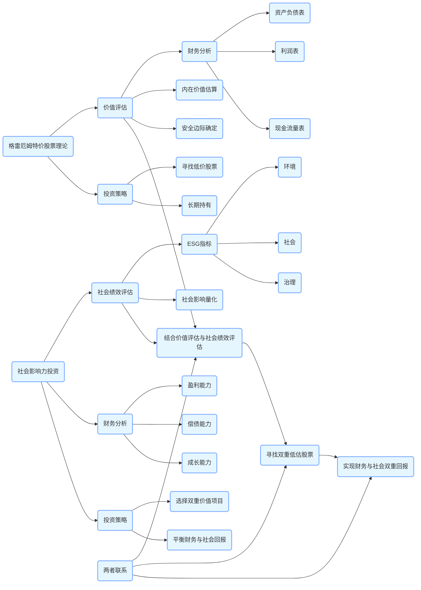

# 格雷厄姆特价股票理论在社会影响力投资中的新应用

> 关键词：格雷厄姆特价股票理论、社会影响力投资、价值评估、投资策略、财务与社会双重回报

> 摘要：本文深入探讨了格雷厄姆特价股票理论在社会影响力投资领域的新应用。首先介绍了该理论及社会影响力投资的背景知识，剖析了两者的核心概念及联系。接着阐述了基于此理论在社会影响力投资中的核心算法原理与具体操作步骤，并用数学模型和公式进行详细说明。通过项目实战案例展示了如何将理论应用于实际投资，分析了其在不同场景下的应用。同时推荐了相关的学习资源、开发工具和研究论文。最后总结了该理论应用的未来发展趋势与挑战，并对常见问题进行了解答，为投资者在社会影响力投资中运用格雷厄姆特价股票理论提供了全面的指导。

## 1. 背景介绍 
### 1.1 目的和范围
本研究旨在探索格雷厄姆特价股票理论在社会影响力投资领域的创新应用。通过深入分析该理论的核心思想，并结合社会影响力投资的特点，为投资者提供一种既能实现财务回报，又能产生积极社会影响的投资策略。研究范围涵盖了理论的原理剖析、实际操作步骤、数学模型构建、项目实战案例分析以及未来发展趋势的探讨等多个方面。

### 1.2 预期读者
本文的预期读者主要包括专业投资者、投资机构从业者、金融研究人员以及对社会影响力投资感兴趣的个人。对于希望在投资中兼顾财务收益和社会价值创造的读者，本文将提供有价值的见解和实用的投资方法。

### 1.3 文档结构概述
本文将按照以下结构进行阐述：首先介绍核心概念与联系，明确格雷厄姆特价股票理论和社会影响力投资的定义及相互关系；接着详细讲解核心算法原理和具体操作步骤，并给出相应的Python代码示例；然后通过数学模型和公式对投资策略进行量化分析；再通过项目实战案例展示理论的实际应用；之后探讨该理论在不同场景下的实际应用；推荐相关的学习资源、开发工具和研究论文；最后总结未来发展趋势与挑战，解答常见问题，并提供扩展阅读和参考资料。

### 1.4 术语表
#### 1.4.1 核心术语定义
- **格雷厄姆特价股票理论**：由本杰明·格雷厄姆提出的一种价值投资理论，强调通过分析股票的内在价值，寻找价格低于内在价值的股票进行投资，以获取长期的超额回报。
- **社会影响力投资**：一种将财务回报与社会和环境效益相结合的投资方式，投资者在追求经济利益的同时，也关注投资项目对社会和环境产生的积极影响。
- **内在价值**：股票所代表的企业的真实价值，通常通过对企业的财务状况、盈利能力、资产质量等因素进行综合分析来估算。
- **安全边际**：股票的市场价格与内在价值之间的差值，安全边际越大，投资的风险越低。

#### 1.4.2 相关概念解释
- **价值投资**：一种投资策略，基于对股票内在价值的评估，选择被低估的股票进行投资，认为市场有时会低估股票的真实价值，投资者可以通过长期持有来获得价值回归带来的收益。
- **社会绩效评估**：对投资项目在社会和环境方面所产生的影响进行量化和定性评估的过程，以确定项目是否符合社会影响力投资的目标。

#### 1.4.3 缩略词列表
- **ESG**：环境（Environmental）、社会（Social）和治理（Governance）的缩写，是评估企业可持续发展和社会责任感的重要指标体系。

## 2. 核心概念与联系 

### 格雷厄姆特价股票理论原理
格雷厄姆特价股票理论的核心思想是，股票市场并非总是有效的，有时会出现股票价格低于其内在价值的情况。投资者可以通过对企业的财务报表、资产负债表、盈利能力等进行深入分析，估算出股票的内在价值。当股票的市场价格低于内在价值时，就存在投资机会，因为市场最终会认识到股票的真实价值，价格会向内在价值回归。

该理论强调安全边际的重要性，即投资者应该在股票价格低于内在价值一定幅度时才进行投资，以降低投资风险。例如，如果估算出某股票的内在价值为每股100元，当市场价格低于80元时，投资者可以考虑买入，这20元的差价就是安全边际。

### 社会影响力投资原理
社会影响力投资的目标是在实现财务回报的同时，为社会和环境带来积极的影响。投资者在选择投资项目时，不仅要考虑项目的财务指标，还要评估其在社会和环境方面的表现。社会影响力投资的领域广泛，包括教育、医疗、环保、扶贫等。

社会影响力投资的评估通常基于ESG指标体系，通过对企业在环境、社会和治理方面的表现进行评估，确定其社会责任感和可持续发展能力。例如，一家企业在减少碳排放、促进员工福利、加强公司治理等方面表现出色，就更有可能成为社会影响力投资的对象。

### 两者的联系
格雷厄姆特价股票理论和社会影响力投资之间存在着一定的联系。在社会影响力投资中，同样可以运用格雷厄姆的价值评估方法，寻找那些既具有良好社会影响力，又被市场低估的企业进行投资。通过结合社会绩效评估和财务分析，可以筛选出具有双重价值的投资项目，实现财务回报和社会价值的双赢。

### 文本示意图
```plaintext
格雷厄姆特价股票理论
|-- 价值评估
|   |-- 财务分析
|   |   |-- 资产负债表
|   |   |-- 利润表
|   |   |-- 现金流量表
|   |-- 内在价值估算
|   |-- 安全边际确定
|
|-- 投资策略
|   |-- 寻找低价股票
|   |-- 长期持有

社会影响力投资
|-- 社会绩效评估
|   |-- ESG指标
|   |   |-- 环境
|   |   |-- 社会
|   |   |-- 治理
|   |-- 社会影响量化
|
|-- 财务分析
|   |-- 盈利能力
|   |-- 偿债能力
|   |-- 成长能力
|
|-- 投资策略
|   |-- 选择双重价值项目
|   |-- 平衡财务与社会回报

两者联系
|-- 结合价值评估与社会绩效评估
|-- 寻找双重低估股票
|-- 实现财务与社会双重回报
```

### Mermaid 流程图


## 3. 核心算法原理 & 具体操作步骤 

### 核心算法原理
在将格雷厄姆特价股票理论应用于社会影响力投资时，核心算法主要包括两个方面：一是对股票的内在价值进行估算，二是对企业的社会影响力进行评估。

#### 内在价值估算
内在价值的估算可以采用多种方法，常见的有股息折现模型（DDM）、自由现金流折现模型（DCF）等。这里以自由现金流折现模型为例，其基本原理是将企业未来的自由现金流按照一定的折现率折现到当前，得到企业的内在价值。

自由现金流（FCF）是指企业在满足了所有运营和投资需求后剩余的现金流量，可以用以下公式计算：

$$FCF = EBIT(1 - T) + Depreciation - Capital Expenditure - \Delta Working Capital$$

其中，$EBIT$ 是息税前利润，$T$ 是所得税税率，$Depreciation$ 是折旧费用，$Capital Expenditure$ 是资本支出，$\Delta Working Capital$ 是营运资金的变化。

企业的内在价值（$V$）可以通过以下公式计算：

$$V = \sum_{t=1}^{n} \frac{FCF_t}{(1 + r)^t} + \frac{TV}{(1 + r)^n}$$

其中，$FCF_t$ 是第 $t$ 年的自由现金流，$r$ 是折现率，$n$ 是预测期，$TV$ 是终值。终值可以采用永续增长模型计算：

$$TV = \frac{FCF_{n+1}}{r - g}$$

其中，$FCF_{n+1}$ 是预测期后第一年的自由现金流，$g$ 是永续增长率。

#### 社会影响力评估
社会影响力评估可以采用定性和定量相结合的方法。定性评估主要通过对企业的社会责任报告、新闻报道、行业评价等进行分析，了解企业在社会和环境方面的表现。定量评估可以采用ESG评分体系，通过对企业在环境、社会和治理方面的各项指标进行量化打分，得到企业的ESG评分。

### 具体操作步骤

#### 步骤1：数据收集
收集企业的财务报表、社会责任报告、行业数据等信息，为后续的分析提供基础。

#### 步骤2：财务分析
对企业的财务报表进行分析，计算各项财务指标，如盈利能力、偿债能力、成长能力等。同时，采用自由现金流折现模型估算企业的内在价值。

以下是一个简单的Python代码示例，用于计算企业的自由现金流和内在价值：

```python
import numpy as np

# 假设数据
ebit = 1000  # 息税前利润
tax_rate = 0.25  # 所得税税率
depreciation = 200  # 折旧费用
capital_expenditure = 300  # 资本支出
working_capital_change = 100  # 营运资金变化
discount_rate = 0.1  # 折现率
growth_rate = 0.03  # 永续增长率
forecast_years = 5  # 预测期

# 计算自由现金流
fcf = ebit * (1 - tax_rate) + depreciation - capital_expenditure - working_capital_change

# 预测未来自由现金流
fcf_forecast = [fcf * (1 + growth_rate) ** i for i in range(forecast_years)]

# 计算终值
terminal_value = fcf_forecast[-1] * (1 + growth_rate) / (discount_rate - growth_rate)

# 计算内在价值
present_values = [fcf_forecast[i] / (1 + discount_rate) ** (i + 1) for i in range(forecast_years)]
present_values.append(terminal_value / (1 + discount_rate) ** forecast_years)
intrinsic_value = sum(present_values)

print(f"企业的自由现金流: {fcf}")
print(f"企业的内在价值: {intrinsic_value}")
```

#### 步骤3：社会影响力评估
采用ESG评分体系对企业的社会影响力进行评估，得到企业的ESG评分。可以参考专业的ESG评级机构的评分标准，也可以自行构建评分体系。

#### 步骤4：筛选投资标的
根据内在价值和ESG评分，筛选出具有双重价值的投资标的。一般来说，选择内在价值被低估且ESG评分较高的企业进行投资。

#### 步骤5：投资决策
在筛选出投资标的后，根据市场情况和自身的投资策略，确定投资金额和投资时机。同时，要密切关注企业的财务状况和社会影响力的变化，及时调整投资组合。

## 4. 数学模型和公式 & 详细讲解 & 举例说明 

### 自由现金流折现模型
自由现金流折现模型（DCF）是估算企业内在价值的常用方法之一，其基本原理是将企业未来的自由现金流按照一定的折现率折现到当前，得到企业的内在价值。

#### 公式推导
自由现金流（FCF）的计算公式为：

$$FCF = EBIT(1 - T) + Depreciation - Capital Expenditure - \Delta Working Capital$$

其中，$EBIT$ 是息税前利润，$T$ 是所得税税率，$Depreciation$ 是折旧费用，$Capital Expenditure$ 是资本支出，$\Delta Working Capital$ 是营运资金的变化。

企业的内在价值（$V$）可以通过以下公式计算：

$$V = \sum_{t=1}^{n} \frac{FCF_t}{(1 + r)^t} + \frac{TV}{(1 + r)^n}$$

其中，$FCF_t$ 是第 $t$ 年的自由现金流，$r$ 是折现率，$n$ 是预测期，$TV$ 是终值。终值可以采用永续增长模型计算：

$$TV = \frac{FCF_{n+1}}{r - g}$$

其中，$FCF_{n+1}$ 是预测期后第一年的自由现金流，$g$ 是永续增长率。

#### 详细讲解
- **自由现金流（FCF）**：自由现金流是企业在满足了所有运营和投资需求后剩余的现金流量，反映了企业的实际盈利能力和现金创造能力。
- **折现率（$r$）**：折现率是将未来现金流量折现到当前的比率，反映了投资者对投资风险的要求。折现率越高，未来现金流量的现值越低。
- **预测期（$n$）**：预测期是指对企业未来自由现金流进行预测的时间段，一般为5 - 10年。预测期的长短会影响企业内在价值的估算结果。
- **终值（$TV$）**：终值是指预测期后企业的价值，采用永续增长模型计算。永续增长率（$g$）是指企业在预测期后保持的长期增长率，一般取值在2% - 3%之间。

#### 举例说明
假设某企业的息税前利润为1000万元，所得税税率为25%，折旧费用为200万元，资本支出为300万元，营运资金变化为100万元。折现率为10%，永续增长率为3%，预测期为5年。

首先，计算企业的自由现金流：

$$FCF = 1000 \times (1 - 0.25) + 200 - 300 - 100 = 550 \text{（万元）}$$

然后，预测未来5年的自由现金流：

$$FCF_1 = 550 \times (1 + 0.03) = 566.5 \text{（万元）}$$
$$FCF_2 = 566.5 \times (1 + 0.03) = 583.495 \text{（万元）}$$
$$FCF_3 = 583.495 \times (1 + 0.03) = 600.99985 \text{（万元）}$$
$$FCF_4 = 600.99985 \times (1 + 0.03) = 619.029846 \text{（万元）}$$
$$FCF_5 = 619.029846 \times (1 + 0.03) = 637.599741 \text{（万元）}$$

接着，计算终值：

$$FCF_6 = 637.599741 \times (1 + 0.03) = 656.727733 \text{（万元）}$$
$$TV = \frac{656.727733}{0.1 - 0.03} = 9381.82476 \text{（万元）}$$

最后，计算企业的内在价值：

$$V = \frac{566.5}{(1 + 0.1)^1} + \frac{583.495}{(1 + 0.1)^2} + \frac{600.99985}{(1 + 0.1)^3} + \frac{619.029846}{(1 + 0.1)^4} + \frac{637.599741}{(1 + 0.1)^5} + \frac{9381.82476}{(1 + 0.1)^5} \approx 7434.42 \text{（万元）}$$

### ESG评分模型
ESG评分模型是评估企业社会影响力的常用方法之一，通过对企业在环境、社会和治理方面的各项指标进行量化打分，得到企业的ESG评分。

#### 公式推导
ESG评分可以采用加权平均的方法计算，公式如下：

$$ESG = w_E \times E + w_S \times S + w_G \times G$$

其中，$ESG$ 是企业的ESG评分，$E$ 是企业的环境评分，$S$ 是企业的社会评分，$G$ 是企业的治理评分，$w_E$、$w_S$、$w_G$ 分别是环境、社会和治理指标的权重，且 $w_E + w_S + w_G = 1$。

#### 详细讲解
- **环境评分（$E$）**：环境评分主要考虑企业在环境保护、资源利用、气候变化等方面的表现，如企业的碳排放、能源消耗、废水处理等指标。
- **社会评分（$S$）**：社会评分主要考虑企业在社会责任、员工福利、社区关系等方面的表现，如企业的员工满意度、公益捐赠、产品质量等指标。
- **治理评分（$G$）**：治理评分主要考虑企业在公司治理、内部控制、风险管理等方面的表现，如企业的董事会结构、高管薪酬、信息披露等指标。
- **权重（$w_E$、$w_S$、$w_G$）**：权重的确定可以根据投资者的偏好和投资目标进行调整，一般来说，环境、社会和治理指标的权重可以分别设置为0.3、0.3、0.4。

#### 举例说明
假设某企业的环境评分 $E = 80$ 分，社会评分 $S = 70$ 分，治理评分 $G = 90$ 分，环境、社会和治理指标的权重分别为 $w_E = 0.3$、$w_S = 0.3$、$w_G = 0.4$。

则该企业的ESG评分计算如下：

$$ESG = 0.3 \times 80 + 0.3 \times 70 + 0.4 \times 90 = 81 \text{（分）}$$

## 5. 项目实战：代码实际案例和详细解释说明 

### 5.1  开发环境搭建
在进行项目实战之前，需要搭建相应的开发环境。以下是具体的搭建步骤：

#### 安装Python
首先，需要安装Python编程语言。可以从Python官方网站（https://www.python.org/downloads/）下载适合自己操作系统的Python安装包，并按照安装向导进行安装。

#### 安装必要的库
在Python环境中，需要安装一些必要的库来进行数据处理、财务分析和可视化。可以使用以下命令来安装这些库：

```sh
pip install pandas numpy matplotlib scipy
```

- **pandas**：用于数据处理和分析，提供了强大的数据结构和数据操作功能。
- **numpy**：用于数值计算，提供了高效的数组和矩阵运算功能。
- **matplotlib**：用于数据可视化，提供了丰富的绘图工具。
- **scipy**：用于科学计算，提供了优化、插值、统计等功能。

### 5.2  源代码详细实现和代码解读

#### 数据收集和预处理
首先，需要收集企业的财务数据和ESG数据。这里假设已经将数据存储在CSV文件中，可以使用pandas库来读取和处理数据。

```python
import pandas as pd

# 读取财务数据
financial_data = pd.read_csv('financial_data.csv')

# 读取ESG数据
esg_data = pd.read_csv('esg_data.csv')

# 数据预处理
# 处理缺失值
financial_data = financial_data.fillna(0)
esg_data = esg_data.fillna(0)

# 合并数据
merged_data = pd.merge(financial_data, esg_data, on='company_id')

print(merged_data.head())
```

代码解读：
- 首先，使用`pd.read_csv`函数读取财务数据和ESG数据。
- 然后，使用`fillna`方法处理数据中的缺失值，将缺失值填充为0。
- 最后，使用`pd.merge`函数将财务数据和ESG数据按照`company_id`进行合并。

#### 内在价值估算
接下来，使用自由现金流折现模型估算企业的内在价值。

```python
import numpy as np

def calculate_fcf(ebit, tax_rate, depreciation, capital_expenditure, working_capital_change):
    return ebit * (1 - tax_rate) + depreciation - capital_expenditure - working_capital_change

def calculate_intrinsic_value(fcf, discount_rate, growth_rate, forecast_years):
    fcf_forecast = [fcf * (1 + growth_rate) ** i for i in range(forecast_years)]
    terminal_value = fcf_forecast[-1] * (1 + growth_rate) / (discount_rate - growth_rate)
    present_values = [fcf_forecast[i] / (1 + discount_rate) ** (i + 1) for i in range(forecast_years)]
    present_values.append(terminal_value / (1 + discount_rate) ** forecast_years)
    return sum(present_values)

# 假设参数
discount_rate = 0.1
growth_rate = 0.03
forecast_years = 5

# 计算自由现金流和内在价值
merged_data['fcf'] = merged_data.apply(lambda row: calculate_fcf(row['ebit'], row['tax_rate'], row['depreciation'], row['capital_expenditure'], row['working_capital_change']), axis=1)
merged_data['intrinsic_value'] = merged_data.apply(lambda row: calculate_intrinsic_value(row['fcf'], discount_rate, growth_rate, forecast_years), axis=1)

print(merged_data[['company_id', 'fcf', 'intrinsic_value']].head())
```

代码解读：
- 定义了`calculate_fcf`函数和`calculate_intrinsic_value`函数，分别用于计算自由现金流和内在价值。
- 假设了折现率、永续增长率和预测期。
- 使用`apply`方法对合并后的数据进行逐行计算，得到每个企业的自由现金流和内在价值。

#### 社会影响力评估
使用ESG评分模型对企业的社会影响力进行评估。

```python
def calculate_esg_score(environment_score, social_score, governance_score):
    weights = [0.3, 0.3, 0.4]
    return weights[0] * environment_score + weights[1] * social_score + weights[2] * governance_score

# 计算ESG评分
merged_data['esg_score'] = merged_data.apply(lambda row: calculate_esg_score(row['environment_score'], row['social_score'], row['governance_score']), axis=1)

print(merged_data[['company_id', 'esg_score']].head())
```

代码解读：
- 定义了`calculate_esg_score`函数，用于计算ESG评分。
- 使用`apply`方法对合并后的数据进行逐行计算，得到每个企业的ESG评分。

#### 筛选投资标的
根据内在价值和ESG评分，筛选出具有双重价值的投资标的。

```python
# 筛选条件
market_price = merged_data['market_price']
intrinsic_value = merged_data['intrinsic_value']
esg_score = merged_data['esg_score']

# 筛选出内在价值被低估且ESG评分较高的企业
selected_companies = merged_data[(intrinsic_value > market_price) & (esg_score > 80)]

print(selected_companies[['company_id', 'market_price', 'intrinsic_value', 'esg_score']])
```

代码解读：
- 定义了筛选条件，即内在价值大于市场价格且ESG评分大于80分。
- 使用布尔索引筛选出符合条件的企业。

### 5.3  代码解读与分析
通过以上代码，我们完成了从数据收集、预处理到内在价值估算、社会影响力评估，再到投资标的筛选的整个过程。

在数据收集和预处理阶段，我们使用pandas库读取和处理数据，确保数据的完整性和一致性。在内在价值估算阶段，我们使用自由现金流折现模型计算企业的内在价值，考虑了企业的盈利能力和现金创造能力。在社会影响力评估阶段，我们使用ESG评分模型计算企业的ESG评分，评估了企业在环境、社会和治理方面的表现。最后，根据内在价值和ESG评分筛选出具有双重价值的投资标的。

需要注意的是，以上代码只是一个简单的示例，实际应用中可能需要根据具体情况进行调整和优化。例如，在数据收集阶段，可能需要使用更复杂的数据源和数据清洗方法；在内在价值估算阶段，可能需要使用更精确的模型和参数；在社会影响力评估阶段，可能需要使用更全面的ESG指标体系。

## 6. 实际应用场景 
### 专业投资机构
专业投资机构可以将格雷厄姆特价股票理论与社会影响力投资相结合，开发出具有特色的投资产品。例如，设立专门的社会影响力投资基金，通过筛选那些既被市场低估又具有良好社会影响力的企业进行投资，为投资者提供财务回报和社会价值的双重收益。同时，投资机构可以利用自身的专业优势，对投资项目进行深入的研究和分析，提高投资决策的准确性和有效性。

### 企业社会责任投资
企业可以将社会影响力投资纳入自身的战略规划，通过投资具有社会责任感的企业或项目，实现企业的社会责任目标。例如，一家环保企业可以投资于新能源、节能减排等领域的企业，既可以获得财务回报，又可以推动行业的可持续发展。此外，企业还可以通过投资社会影响力项目，提升自身的品牌形象和社会声誉。

### 个人投资者
个人投资者可以在投资组合中加入社会影响力投资元素，选择那些符合自己价值观和投资目标的企业进行投资。例如，一位关注环境保护的个人投资者可以选择投资于环保科技企业或清洁能源项目。通过参与社会影响力投资，个人投资者不仅可以实现资产的增值，还可以为社会和环境做出贡献。

### 政府引导投资
政府可以通过制定相关政策和法规，引导社会资本投向社会影响力投资领域。例如，政府可以给予社会影响力投资项目税收优惠、财政补贴等支持，降低投资风险，提高投资回报率。此外，政府还可以设立专门的社会影响力投资基金，引导社会资本参与重大社会和环境项目的投资。

## 7. 工具和资源推荐
### 7.1 学习资源推荐
#### 7.1.1 书籍推荐
- 《聪明的投资者》（The Intelligent Investor）：本杰明·格雷厄姆的经典著作，详细阐述了价值投资的理念和方法，是价值投资者的必读之书。
- 《社会影响力投资：改变世界的金融力量》（Impact Investing: Transforming How We Make Money While Making a Difference）：全面介绍了社会影响力投资的概念、理论和实践，为投资者提供了深入了解该领域的机会。
- 《可持续投资：ESG投资的理论与实践》（Sustainable Investing: The Art of Long-Term Performance）：探讨了ESG投资的原理、方法和策略，对社会影响力投资的评估和决策具有重要的参考价值。

#### 7.1.2 在线课程
- Coursera上的“价值投资原理”（Principles of Value Investing）课程：由知名教授授课，系统介绍了价值投资的基本原理和分析方法。
- edX上的“社会影响力投资：创造社会和环境价值”（Impact Investing: Creating Social and Environmental Value）课程：深入探讨了社会影响力投资的理论和实践，提供了丰富的案例分析和实践经验。
- Udemy上的“ESG投资与可持续金融”（ESG Investing and Sustainable Finance）课程：讲解了ESG投资的概念、评估方法和投资策略，帮助投资者掌握ESG投资的核心要点。

#### 7.1.3 技术博客和网站
- Seeking Alpha（https://seekingalpha.com/）：一个知名的投资研究网站，提供了大量的股票分析、投资策略和市场评论，对价值投资和社会影响力投资有深入的研究和报道。
- ImpactAlpha（https://impactalpha.com/）：专注于社会影响力投资领域的媒体平台，提供了最新的行业动态、投资案例和研究报告，是了解社会影响力投资的重要渠道。
- ESG Clarity（https://www.esgclarity.com/）：专门报道ESG投资和可持续金融的网站，提供了丰富的ESG数据、分析和评论，有助于投资者了解企业的ESG表现。

### 7.2 开发工具框架推荐
#### 7.2.1 IDE和编辑器
- PyCharm：一款专业的Python集成开发环境，提供了丰富的代码编辑、调试和项目管理功能，适合进行Python数据分析和投资策略开发。
- Jupyter Notebook：一个交互式的编程环境，支持多种编程语言，方便进行数据探索、可视化和模型开发，是数据分析和机器学习领域常用的工具。
- Visual Studio Code：一款轻量级的代码编辑器，支持多种编程语言和插件扩展，具有丰富的代码编辑和调试功能，适合进行快速开发和代码编写。

#### 7.2.2 调试和性能分析工具
- PDB：Python自带的调试器，可以帮助开发者在代码运行过程中进行调试和排查问题。
- cProfile：Python的性能分析工具，可以分析代码的运行时间和函数调用情况，帮助开发者优化代码性能。
- Py-Spy：一个跨平台的Python性能分析工具，可以实时监测Python程序的性能，找出性能瓶颈。

#### 7.2.3 相关框架和库
- pandas：用于数据处理和分析的Python库，提供了强大的数据结构和数据操作功能，是数据分析和投资研究的必备工具。
- numpy：用于数值计算的Python库，提供了高效的数组和矩阵运算功能，广泛应用于科学计算和机器学习领域。
- scikit-learn：一个常用的机器学习库，提供了丰富的机器学习算法和工具，可用于投资预测和风险评估。

### 7.3 相关论文著作推荐
#### 7.3.1 经典论文
- Graham, B., & Dodd, D. L. (1934). Security Analysis. This classic work lays the foundation for value investing and provides a comprehensive framework for analyzing stocks and bonds.
- Porter, M. E., & Kramer, M. R. (2011). Creating shared value. Harvard Business Review, 89(1/2), 62-77. This paper introduces the concept of creating shared value, which emphasizes the integration of business and social goals.

#### 7.3.2 最新研究成果
- Borgers, A., Derwall, J., Koedijk, K., & ter Horst, J. R. (2015). Responsible investing: The ESG–alpha debate. Journal of Portfolio Management, 41(2), 93-107. This study examines the relationship between ESG factors and investment performance.
- Renneboog, L., Ter Horst, J. R., & Zhang, C. (2008). The price of ethics and the ethics of price. Journal of Banking & Finance, 32(1), 179-194. This paper analyzes the impact of ethical investing on stock prices and returns.

#### 7.3.3 应用案例分析
- Bridges Fund Management. (2019). Impact Investing: A Guide to Understanding and Implementing Impact Strategies. This report provides practical guidance on impact investing and includes a number of real-world case studies.
- Global Impact Investing Network (GIIN). (2020). Annual Impact Investor Survey. This survey provides insights into the trends and practices of impact investors around the world.

## 8. 总结：未来发展趋势与挑战
### 未来发展趋势
- **市场规模扩大**：随着社会对可持续发展和社会责任的关注度不断提高，社会影响力投资的市场规模有望持续扩大。越来越多的投资者将认识到社会影响力投资的价值，愿意将资金投入到具有社会和环境效益的项目中。
- **技术应用增强**：人工智能、大数据、区块链等技术将在社会影响力投资领域得到更广泛的应用。例如，通过人工智能和大数据分析，可以更准确地评估企业的社会影响力和财务状况；利用区块链技术，可以实现投资项目的透明化和可追溯性。
- **标准和规范完善**：随着社会影响力投资的发展，相关的标准和规范将不断完善。例如，ESG评级体系将更加科学和统一，社会影响力评估方法将更加成熟和可靠。这将有助于提高社会影响力投资的透明度和可比性，促进市场的健康发展。
- **跨领域合作加强**：社会影响力投资将与其他领域进行更深入的合作，如慈善、政府政策、金融创新等。例如，慈善组织可以与投资机构合作，共同开展社会影响力投资项目；政府可以通过制定政策和法规，引导社会资本投向社会影响力投资领域；金融机构可以创新金融产品和服务，满足社会影响力投资的需求。

### 挑战
- **评估难度大**：社会影响力的评估是社会影响力投资面临的一大挑战。社会影响力具有多样性、复杂性和长期性的特点，难以用单一的指标进行量化和评估。目前，虽然有一些ESG评级体系和社会影响力评估方法，但仍然存在一定的局限性。
- **财务回报与社会影响平衡**：在社会影响力投资中，如何平衡财务回报和社会影响是一个关键问题。一些社会影响力项目可能具有较高的社会价值，但财务回报较低；而一些财务回报较高的项目可能对社会和环境的影响较小。投资者需要在两者之间找到一个平衡点，实现财务和社会的双重目标。
- **信息不对称**：社会影响力投资领域存在信息不对称的问题。企业的社会和环境信息披露不够充分和透明，投资者难以获取准确的信息来评估企业的社会影响力和投资价值。此外，市场上缺乏统一的信息平台和数据标准，也增加了投资者获取和分析信息的难度。
- **政策支持不足**：虽然政府对社会影响力投资的关注度不断提高，但目前相关的政策支持还不够完善。例如，缺乏税收优惠、财政补贴等激励措施，投资项目的审批程序较为繁琐，这些都制约了社会影响力投资的发展。

## 9. 附录：常见问题与解答
### 1. 格雷厄姆特价股票理论在社会影响力投资中的应用与传统价值投资有何不同？
传统价值投资主要关注股票的财务价值，通过分析企业的财务报表和基本面，寻找被低估的股票进行投资。而格雷厄姆特价股票理论在社会影响力投资中的应用，不仅关注股票的财务价值，还关注企业的社会影响力。投资者在选择投资标的时，会综合考虑企业的内在价值和社会绩效，寻找那些既被市场低估又具有良好社会影响力的企业进行投资。

### 2. 如何评估企业的社会影响力？
评估企业的社会影响力可以采用定性和定量相结合的方法。定性评估主要通过对企业的社会责任报告、新闻报道、行业评价等进行分析，了解企业在社会和环境方面的表现。定量评估可以采用ESG评分体系，通过对企业在环境、社会和治理方面的各项指标进行量化打分，得到企业的ESG评分。此外，还可以通过实地调研、问卷调查等方式，了解企业的社会影响力。

### 3. 社会影响力投资的财务回报如何？
社会影响力投资的财务回报因投资项目而异。一些社会影响力项目可能具有较高的财务回报，与传统投资项目相当甚至更高；而一些项目可能由于其社会和环境目标的限制，财务回报相对较低。总体来说，社会影响力投资的目标是在实现财务回报的同时，为社会和环境带来积极的影响。投资者可以通过合理的投资组合和风险管理，实现财务回报和社会影响的平衡。

### 4. 如何选择适合自己的社会影响力投资项目？
选择适合自己的社会影响力投资项目需要考虑多个因素。首先，要明确自己的投资目标和价值观，确定自己关注的社会和环境领域。其次，要对投资项目进行深入的研究和分析，了解项目的财务状况、社会影响力、管理团队等情况。此外，还可以参考专业的投资机构和评级机构的建议，选择具有良好信誉和业绩的投资项目。

### 5. 社会影响力投资的风险有哪些？
社会影响力投资的风险与传统投资类似，包括市场风险、信用风险、流动性风险等。此外，社会影响力投资还面临一些特殊的风险，如社会和环境风险、政策风险等。例如，企业的社会和环境表现可能会受到政策变化、社会舆论等因素的影响，从而对投资项目的价值产生不利影响。投资者在进行社会影响力投资时，需要充分了解投资项目的风险特征，并采取相应的风险管理措施。

## 10. 扩展阅读 & 参考资料
### 扩展阅读
- 《金融科技与社会影响力投资》：探讨了金融科技在社会影响力投资领域的应用和创新，为投资者提供了新的思路和方法。
- 《可持续发展金融前沿》：介绍了可持续发展金融的最新理论和实践，对社会影响力投资的发展趋势和未来方向进行了深入分析。
- 《社会企业与社会影响力投资》：研究了社会企业的发展模式和社会影响力投资的运作机制，为投资者提供了实践案例和经验借鉴。

### 参考资料
- Graham, B. (1949). The Intelligent Investor. HarperBusiness.
- Global Impact Investing Network (GIIN). (2021). Impact Investing Landscape Report.
- MSCI. (2021). ESG Ratings Methodology.
- Sustainalytics. (2021). ESG Risk Ratings Methodology.

作者：AI天才研究院/AI Genius Institute & 禅与计算机程序设计艺术 /Zen And The Art of Computer Programming