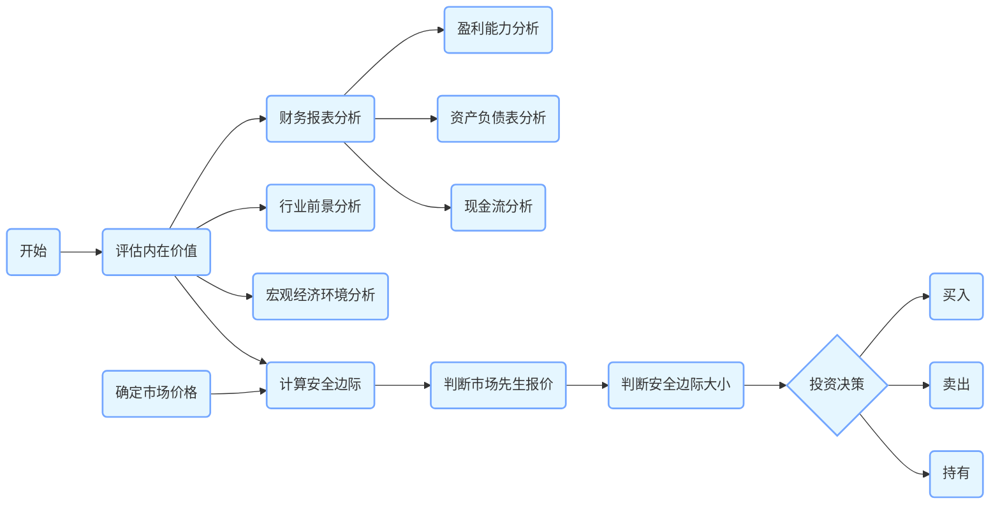

# 格雷厄姆特价股票理论对投资者教育的启示

> 关键词：格雷厄姆特价股票理论、投资者教育、价值投资、安全边际、市场波动

> 摘要：本文深入探讨了格雷厄姆特价股票理论对投资者教育的重要启示。首先介绍了该理论的背景，包括其目的、适用范围、预期读者和文档结构等。接着阐述了格雷厄姆特价股票理论的核心概念，如安全边际、内在价值等，并通过文本示意图和Mermaid流程图展示其架构。详细讲解了相关的核心算法原理及具体操作步骤，运用Python代码进行示例。分析了该理论背后的数学模型和公式，并举例说明。通过项目实战，给出代码实际案例并进行详细解释。探讨了该理论在实际投资场景中的应用，推荐了相关的学习资源、开发工具框架和论文著作。最后总结了未来发展趋势与挑战，解答常见问题并提供扩展阅读和参考资料，旨在为投资者教育提供全面且深入的指导。

## 1. 背景介绍 
### 1.1 目的和范围
格雷厄姆特价股票理论是价值投资领域的经典理论，其目的在于帮助投资者识别那些被市场低估的股票，从而获得长期稳定的投资回报。本文章的范围将围绕该理论展开，深入分析其对投资者教育的多方面启示，包括投资理念、投资方法和风险控制等。通过对该理论的研究，为投资者提供系统的知识和实用的策略，以提高投资者的投资素养和决策能力。

### 1.2 预期读者
本文预期读者主要包括各类投资者，无论是初入投资市场的新手，还是有一定投资经验的专业人士，都能从本文中获得有价值的信息。对于新手投资者，本文可以作为入门的学习资料，帮助他们建立正确的投资观念和方法；对于专业投资者，本文可以提供新的思路和视角，进一步完善他们的投资策略。此外，金融专业的学生、研究人员以及对投资教育感兴趣的人士也可以从本文中获取相关的知识和见解。

### 1.3 文档结构概述
本文将按照以下结构进行阐述：首先介绍格雷厄姆特价股票理论的背景信息，包括目的、预期读者和文档结构等；接着详细讲解该理论的核心概念及其相互联系，通过文本示意图和Mermaid流程图展示其架构；然后分析核心算法原理和具体操作步骤，运用Python代码进行说明；阐述该理论背后的数学模型和公式，并举例说明；通过项目实战，给出代码实际案例并进行详细解释；探讨该理论在实际投资场景中的应用；推荐相关的学习资源、开发工具框架和论文著作；最后总结未来发展趋势与挑战，解答常见问题并提供扩展阅读和参考资料。

### 1.4 术语表
#### 1.4.1 核心术语定义
- **格雷厄姆特价股票理论**：由本杰明·格雷厄姆提出的一种价值投资理论，强调通过分析股票的内在价值和市场价格，寻找被市场低估的股票进行投资。
- **安全边际**：指股票的内在价值与市场价格之间的差距，是格雷厄姆投资理论的核心概念之一，用于衡量投资的风险程度。
- **内在价值**：股票所代表的企业的真实价值，是根据企业的财务状况、盈利能力、发展前景等因素综合评估得出的。
- **市场价格**：股票在证券市场上的交易价格，受市场供求关系、投资者情绪等多种因素影响。

#### 1.4.2 相关概念解释
- **价值投资**：一种投资策略，基于对股票内在价值的分析，选择被低估的股票进行投资，注重长期投资回报。
- **基本面分析**：通过研究企业的财务报表、行业前景、宏观经济环境等基本面因素，评估股票的内在价值。
- **市场波动**：股票市场价格的上下波动，是由市场供求关系、宏观经济因素、政策变化等多种因素引起的。

#### 1.4.3 缩略词列表
- **PE**：市盈率（Price-to-Earnings Ratio），是股票价格与每股盈利的比率，用于衡量股票的估值水平。
- **PB**：市净率（Price-to-Book Ratio），是股票价格与每股净资产的比率，反映了股票的市场价格相对于其账面价值的高低。

## 2. 核心概念与联系 
### 核心概念原理
格雷厄姆特价股票理论的核心在于寻找被市场低估的股票，其基于以下几个重要概念：
- **内在价值**：股票的内在价值是该理论的基础。它是企业未来现金流的折现值，反映了企业的真实价值。格雷厄姆认为，企业的内在价值可以通过对其财务报表、盈利能力、资产状况等基本面因素的分析来估算。例如，一家具有稳定盈利能力、良好资产负债表和广阔发展前景的企业，其内在价值通常较高。
- **安全边际**：安全边际是格雷厄姆投资理论的关键概念。它是指股票的内在价值与市场价格之间的差距。当市场价格低于内在价值时，就存在安全边际。安全边际为投资者提供了一定的缓冲，即使企业未来的发展不如预期，投资者也能在一定程度上避免损失。例如，如果一只股票的内在价值为每股100元，而市场价格仅为每股80元，那么安全边际就是20元。
- **市场先生**：格雷厄姆将股票市场比喻为“市场先生”。市场先生每天都会给出不同的股票报价，有时报价过高，有时报价过低。投资者不应被市场先生的情绪所左右，而应根据股票的内在价值进行投资决策。例如，当市场先生给出的报价远远低于股票的内在价值时，投资者应该抓住机会买入；当市场先生给出的报价远远高于股票的内在价值时，投资者应该考虑卖出。

### 架构的文本示意图
```plaintext
格雷厄姆特价股票理论
|-- 内在价值评估
|   |-- 财务报表分析
|   |   |-- 盈利能力分析
|   |   |-- 资产负债表分析
|   |   |-- 现金流分析
|   |-- 行业前景分析
|   |-- 宏观经济环境分析
|-- 安全边际计算
|   |-- 内在价值估算
|   |-- 市场价格确定
|   |-- 安全边际差值
|-- 投资决策
|   |-- 市场先生报价判断
|   |-- 安全边际大小判断
|   |-- 买入或卖出决策
```

### Mermaid流程图


## 3. 核心算法原理 & 具体操作步骤 
### 核心算法原理
格雷厄姆特价股票理论的核心算法主要围绕内在价值的估算和安全边际的计算。内在价值的估算可以采用多种方法，其中一种常见的方法是基于企业的盈利和资产状况进行估算。例如，格雷厄姆提出了一个简单的公式来估算股票的内在价值：

$V = EPS \times (8.5 + 2g)$

其中，$V$ 表示股票的内在价值，$EPS$ 表示每股盈利，$g$ 表示企业的预期增长率。

安全边际的计算则是通过比较内在价值和市场价格来实现的。安全边际的计算公式为：

$安全边际 = \frac{内在价值 - 市场价格}{内在价值} \times 100\%$

### 具体操作步骤
#### 步骤1：收集数据
收集目标企业的财务报表，包括利润表、资产负债表和现金流量表，以及行业和宏观经济数据。这些数据可以从证券交易所网站、企业官方网站、金融数据提供商等渠道获取。

#### 步骤2：分析财务报表
- **盈利能力分析**：计算企业的毛利率、净利率、ROE（净资产收益率）等指标，评估企业的盈利能力。例如，毛利率较高的企业通常具有较强的市场竞争力。
- **资产负债表分析**：分析企业的资产负债率、流动比率、速动比率等指标，评估企业的财务状况和偿债能力。例如，资产负债率较低的企业通常财务风险较小。
- **现金流分析**：分析企业的经营活动现金流、投资活动现金流和筹资活动现金流，评估企业的现金创造能力和资金运用效率。例如，经营活动现金流持续为正的企业通常具有较好的盈利能力和稳定性。

#### 步骤3：估算内在价值
根据收集到的数据和分析结果，运用上述公式或其他合适的方法估算股票的内在价值。在估算过程中，需要对企业的预期增长率进行合理的预测，可以参考行业平均增长率、企业历史增长率和分析师的预测等。

#### 步骤4：确定市场价格
通过证券交易所网站或金融数据提供商获取目标股票的当前市场价格。

#### 步骤5：计算安全边际
根据内在价值和市场价格，运用上述公式计算安全边际。

#### 步骤6：做出投资决策
根据安全边际的大小和市场先生的报价，做出投资决策。一般来说，当安全边际较大时，表明股票被低估，投资者可以考虑买入；当安全边际较小时，表明股票可能被高估，投资者可以考虑卖出或持有。

### Python源代码示例
```python
# 定义函数估算内在价值
def estimate_intrinsic_value(eps, g):
    """
    估算股票的内在价值
    :param eps: 每股盈利
    :param g: 预期增长率
    :return: 内在价值
    """
    return eps * (8.5 + 2 * g)

# 定义函数计算安全边际
def calculate_safety_margin(intrinsic_value, market_price):
    """
    计算安全边际
    :param intrinsic_value: 内在价值
    :param market_price: 市场价格
    :return: 安全边际
    """
    return ((intrinsic_value - market_price) / intrinsic_value) * 100

# 示例数据
eps = 5  # 每股盈利
g = 0.1  # 预期增长率
market_price = 40  # 市场价格

# 估算内在价值
intrinsic_value = estimate_intrinsic_value(eps, g)
print(f"估算的内在价值: {intrinsic_value} 元")

# 计算安全边际
safety_margin = calculate_safety_margin(intrinsic_value, market_price)
print(f"安全边际: {safety_margin:.2f}%")

# 根据安全边际做出投资决策
if safety_margin > 30:
    print("安全边际较大，建议买入")
elif safety_margin < 10:
    print("安全边际较小，建议卖出或持有")
else:
    print("安全边际适中，可根据其他因素进一步判断")
```

## 4. 数学模型和公式 & 详细讲解 & 举例说明 
### 数学模型和公式
#### 内在价值估算公式
如前文所述，格雷厄姆提出的内在价值估算公式为：

$V = EPS \times (8.5 + 2g)$

其中，$V$ 表示股票的内在价值，$EPS$ 表示每股盈利，$g$ 表示企业的预期增长率。这个公式的理论基础是，股票的价值应该与其盈利能力和增长潜力相关。$8.5$ 是一个经验系数，代表了在没有增长的情况下，股票的合理市盈率；$2g$ 则是考虑了企业的增长因素，将预期增长率纳入了内在价值的计算中。

#### 安全边际计算公式
安全边际的计算公式为：

$安全边际 = \frac{内在价值 - 市场价格}{内在价值} \times 100\%$

安全边际反映了股票的市场价格相对于其内在价值的折扣程度。安全边际越大，说明股票被低估的程度越高，投资风险越小；安全边际越小，说明股票被高估的程度越高，投资风险越大。

### 详细讲解
#### 内在价值估算公式讲解
- **每股盈利（EPS）**：每股盈利是企业净利润除以总股本得到的结果，反映了企业每股股票的盈利能力。EPS 越高，说明企业的盈利能力越强，股票的内在价值也可能越高。
- **预期增长率（g）**：预期增长率是对企业未来盈利增长速度的预测。预期增长率的确定需要综合考虑多种因素，如行业发展趋势、企业的竞争优势、市场需求等。预期增长率越高，股票的内在价值也会相应提高。
- **经验系数 8.5**：8.5 是格雷厄姆根据历史数据和经验总结出来的一个系数，代表了在没有增长的情况下，股票的合理市盈率。这个系数并不是绝对的，不同的行业和市场环境可能会有所不同。

#### 安全边际计算公式讲解
- **内在价值**：是通过对企业基本面的分析和估算得出的股票的真实价值。
- **市场价格**：是股票在证券市场上的实际交易价格，受市场供求关系、投资者情绪等多种因素影响。
- **安全边际**：通过比较内在价值和市场价格，计算出股票的市场价格相对于其内在价值的折扣程度。安全边际为投资者提供了一定的缓冲，即使企业未来的发展不如预期，投资者也能在一定程度上避免损失。

### 举例说明
假设某公司的每股盈利（EPS）为 3 元，预期增长率（g）为 0.1（即 10%），当前市场价格为 35 元。

#### 步骤1：估算内在价值
根据内在价值估算公式：

$V = EPS \times (8.5 + 2g)$

$V = 3 \times (8.5 + 2 \times 0.1)$

$V = 3 \times (8.5 + 0.2)$

$V = 3 \times 8.7$

$V = 26.1$（元）

#### 步骤2：计算安全边际
根据安全边际计算公式：

$安全边际 = \frac{内在价值 - 市场价格}{内在价值} \times 100\%$

$安全边际 = \frac{26.1 - 35}{26.1} \times 100\%$

$安全边际 = \frac{-8.9}{26.1} \times 100\%$

$安全边际 \approx -34.1\%$

#### 步骤3：分析结果
由于安全边际为负数，说明该股票的市场价格高于其内在价值，股票被高估。在这种情况下，投资者应该谨慎考虑是否买入该股票，或者考虑卖出持有的该股票。

## 5. 项目实战：代码实际案例和详细解释说明 
### 5.1  开发环境搭建
#### 安装 Python
首先，需要安装 Python 编程语言。可以从 Python 官方网站（https://www.python.org/downloads/）下载适合自己操作系统的 Python 安装包，并按照安装向导进行安装。

#### 安装必要的库
在项目中，需要使用一些 Python 库来进行数据处理和分析。可以使用以下命令安装这些库：

```sh
pip install pandas numpy yfinance matplotlib
```

- **pandas**：用于数据处理和分析，提供了高效的数据结构和数据分析工具。
- **numpy**：用于科学计算，提供了高性能的多维数组对象和各种数学函数。
- **yfinance**：用于从雅虎财经获取股票数据。
- **matplotlib**：用于数据可视化，提供了丰富的绘图功能。

### 5.2  源代码详细实现和代码解读
```python
import yfinance as yf
import pandas as pd
import numpy as np
import matplotlib.pyplot as plt

# 定义函数估算内在价值
def estimate_intrinsic_value(eps, g):
    """
    估算股票的内在价值
    :param eps: 每股盈利
    :param g: 预期增长率
    :return: 内在价值
    """
    return eps * (8.5 + 2 * g)

# 定义函数计算安全边际
def calculate_safety_margin(intrinsic_value, market_price):
    """
    计算安全边际
    :param intrinsic_value: 内在价值
    :param market_price: 市场价格
    :return: 安全边际
    """
    return ((intrinsic_value - market_price) / intrinsic_value) * 100

# 定义函数获取股票数据
def get_stock_data(ticker, start_date, end_date):
    """
    获取股票数据
    :param ticker: 股票代码
    :param start_date: 开始日期
    :param end_date: 结束日期
    :return: 股票数据
    """
    stock = yf.download(ticker, start=start_date, end=end_date)
    return stock

# 示例数据
ticker = 'AAPL'  # 苹果公司股票代码
start_date = '2020-01-01'
end_date = '2023-01-01'
eps = 5  # 每股盈利
g = 0.1  # 预期增长率

# 获取股票数据
stock_data = get_stock_data(ticker, start_date, end_date)

# 提取最后一个交易日的收盘价作为市场价格
market_price = stock_data['Close'][-1]

# 估算内在价值
intrinsic_value = estimate_intrinsic_value(eps, g)
print(f"估算的内在价值: {intrinsic_value} 元")

# 计算安全边际
safety_margin = calculate_safety_margin(intrinsic_value, market_price)
print(f"安全边际: {safety_margin:.2f}%")

# 根据安全边际做出投资决策
if safety_margin > 30:
    print("安全边际较大，建议买入")
elif safety_margin < 10:
    print("安全边际较小，建议卖出或持有")
else:
    print("安全边际适中，可根据其他因素进一步判断")

# 绘制股票价格走势图
plt.figure(figsize=(12, 6))
plt.plot(stock_data['Close'])
plt.title(f'{ticker} Stock Price')
plt.xlabel('Date')
plt.ylabel('Price')
plt.grid(True)
plt.show()
```

### 代码解读与分析
#### 函数定义部分
- **estimate_intrinsic_value**：该函数根据每股盈利和预期增长率估算股票的内在价值，使用了格雷厄姆的内在价值估算公式。
- **calculate_safety_margin**：该函数根据内在价值和市场价格计算安全边际，使用了安全边际计算公式。
- **get_stock_data**：该函数使用 yfinance 库从雅虎财经获取指定股票在指定日期范围内的历史数据。

#### 主程序部分
- 定义了示例数据，包括股票代码、开始日期、结束日期、每股盈利和预期增长率。
- 调用 get_stock_data 函数获取股票数据。
- 提取最后一个交易日的收盘价作为市场价格。
- 调用 estimate_intrinsic_value 函数估算内在价值。
- 调用 calculate_safety_margin 函数计算安全边际。
- 根据安全边际的大小做出投资决策并输出结果。
- 使用 matplotlib 库绘制股票价格走势图，帮助投资者直观地观察股票价格的变化趋势。

## 6. 实际应用场景 
### 个人投资者
对于个人投资者来说，格雷厄姆特价股票理论可以帮助他们建立正确的投资观念和方法。个人投资者通常缺乏专业的投资知识和经验，容易受到市场情绪的影响。通过学习格雷厄姆特价股票理论，个人投资者可以学会如何分析股票的内在价值和安全边际，避免盲目跟风投资。例如，当市场出现恐慌性下跌时，个人投资者可以根据该理论寻找被低估的股票进行投资，从而获得长期稳定的回报。

### 机构投资者
机构投资者如基金公司、保险公司等，管理着大量的资金，需要寻找安全、稳定的投资机会。格雷厄姆特价股票理论可以为机构投资者提供一种有效的投资策略。机构投资者可以利用专业的研究团队和数据分析工具，对大量的股票进行筛选和分析，寻找具有较高安全边际的股票进行投资。例如，一些价值型基金就是基于格雷厄姆的价值投资理念进行投资组合的构建。

### 投资教育机构
投资教育机构可以将格雷厄姆特价股票理论作为重要的教学内容，向学员传授正确的投资知识和方法。通过案例分析、模拟交易等方式，让学员深入理解该理论的核心概念和应用方法。投资教育机构还可以组织学员进行实地调研和企业分析，提高学员的实践能力和投资素养。

### 金融监管机构
金融监管机构可以借鉴格雷厄姆特价股票理论的理念，加强对证券市场的监管。通过要求上市公司披露真实、准确的财务信息，提高市场的透明度，保护投资者的合法权益。金融监管机构还可以加强对投资者的教育，引导投资者树立正确的投资观念，避免过度投机和盲目跟风。

## 7. 工具和资源推荐
### 7.1 学习资源推荐
#### 7.1.1 书籍推荐
- 《聪明的投资者》（The Intelligent Investor）：本杰明·格雷厄姆的经典著作，被誉为投资界的“圣经”。书中详细阐述了格雷厄姆的价值投资理念和方法，对投资者具有重要的指导意义。
- 《证券分析》（Security Analysis）：同样是本杰明·格雷厄姆的著作，是价值投资领域的奠基之作。该书系统地介绍了证券分析的基本原理和方法，对股票、债券等证券的估值和投资分析进行了深入探讨。
- 《巴菲特致股东的信：股份公司教程》（Letters to Shareholders of Berkshire Hathaway）：沃伦·巴菲特是格雷厄姆的学生和追随者，该书收录了巴菲特历年致股东的信，从中可以学习到巴菲特的投资理念和方法，以及他对格雷厄姆价值投资理论的实践和发展。

#### 7.1.2 在线课程
- Coursera 上的“投资学原理”（Principles of Investing）：该课程由知名高校的教授授课，系统地介绍了投资学的基本原理和方法，包括价值投资、资产定价、投资组合管理等内容。
- edX 上的“金融市场”（Financial Markets）：由耶鲁大学教授罗伯特·席勒（Robert Shiller）授课，该课程涵盖了金融市场的各个方面，包括股票市场、债券市场、衍生品市场等，对投资者了解金融市场的运作机制和投资策略具有重要的帮助。
- 网易云课堂上的“价值投资实战训练营”：该课程结合实际案例，详细讲解了价值投资的理论和方法，包括如何分析企业的基本面、估算内在价值、计算安全边际等内容，适合有一定投资基础的学员学习。

#### 7.1.3 技术博客和网站
- 雪球网（https://xueqiu.com/）：国内知名的投资社区，汇聚了大量的投资者和投资专家。在雪球网上可以找到各种投资分析文章、研究报告和投资策略分享，还可以与其他投资者进行交流和讨论。
- 价值投资网（https://www.value-investing.net/）：专注于价值投资领域的网站，提供了丰富的价值投资知识和资源，包括格雷厄姆、巴菲特等价值投资大师的理论和实践经验，以及企业基本面分析、财务报表解读等内容。
- Seeking Alpha（https://seekingalpha.com/）：国外知名的投资研究网站，提供了全球范围内的股票分析、投资策略和市场评论等内容。该网站上有很多专业的投资分析师和投资者分享自己的观点和研究成果，对投资者了解国际市场和获取投资信息具有重要的参考价值。

### 7.2 开发工具框架推荐
#### 7.2.1 IDE和编辑器
- PyCharm：一款专业的 Python 集成开发环境（IDE），提供了丰富的代码编辑、调试、分析等功能，适合开发复杂的 Python 项目。
- Jupyter Notebook：一种交互式的开发环境，支持 Python、R 等多种编程语言。Jupyter Notebook 可以将代码、文本、图表等内容整合在一起，方便进行数据分析和可视化展示。
- Visual Studio Code：一款轻量级的代码编辑器，支持多种编程语言和插件扩展。Visual Studio Code 具有丰富的代码编辑功能和强大的调试功能，适合快速开发和调试 Python 代码。

#### 7.2.2 调试和性能分析工具
- pdb：Python 内置的调试工具，可以帮助开发者在代码中设置断点、单步执行代码、查看变量值等，方便进行代码调试。
- cProfile：Python 标准库中的性能分析工具，可以统计代码中各个函数的执行时间和调用次数，帮助开发者找出代码中的性能瓶颈。
- Py-Spy：一个用于 Python 代码性能分析的工具，可以实时监测 Python 进程的 CPU 使用率和函数调用情况，帮助开发者快速定位性能问题。

#### 7.2.3 相关框架和库
- pandas：用于数据处理和分析的 Python 库，提供了高效的数据结构和数据分析工具，如 DataFrame、Series 等，方便进行数据清洗、转换和统计分析。
- numpy：用于科学计算的 Python 库，提供了高性能的多维数组对象和各种数学函数，是很多数据分析和机器学习库的基础。
- yfinance：用于从雅虎财经获取股票数据的 Python 库，提供了简单易用的接口，可以方便地获取股票的历史数据、实时数据等。
- matplotlib：用于数据可视化的 Python 库，提供了丰富的绘图功能，如折线图、柱状图、散点图等，方便将数据分析结果进行可视化展示。

### 7.3 相关论文著作推荐
#### 7.3.1 经典论文
- 《The Theory of Investment Value》（投资价值理论）：由约翰·伯尔·威廉姆斯（John Burr Williams）撰写，该论文提出了现金流折现模型（DCF），为股票估值提供了重要的理论基础。
- 《Capital Asset Pricing Model: Theory and Evidence》（资本资产定价模型：理论与证据）：由威廉·夏普（William Sharpe）等学者撰写，该论文提出了资本资产定价模型（CAPM），用于描述资产的预期收益率与系统性风险之间的关系。
- 《Efficient Capital Markets: A Review of Theory and Empirical Work》（有效资本市场：理论与实证研究综述）：由尤金·法玛（Eugene F. Fama）撰写，该论文提出了有效市场假说（EMH），对证券市场的有效性进行了深入探讨。

#### 7.3.2 最新研究成果
- 《Factor Investing: From Academic Theory to Industry Practice》（因子投资：从学术理论到行业实践）：该研究探讨了因子投资的理论和实践应用，分析了各种因子（如价值因子、规模因子、动量因子等）在投资组合中的作用。
- 《Behavioral Finance: An Overview》（行为金融学综述）：该研究综合介绍了行为金融学的理论和研究成果，分析了投资者的心理和行为因素对投资决策的影响。
- 《Machine Learning in Finance: Applications and Challenges》（机器学习在金融领域的应用与挑战）：该研究探讨了机器学习技术在金融领域的应用，如风险评估、投资预测、算法交易等，并分析了应用过程中面临的挑战和问题。

#### 7.3.3 应用案例分析
- 《Value Investing in Practice: Case Studies from Around the World》（价值投资实践：全球案例分析）：该著作通过实际案例分析，展示了价值投资在不同市场环境和行业中的应用，为投资者提供了宝贵的实践经验。
- 《Buffett's Investment Philosophy: Case Studies of Berkshire Hathaway's Investments》（巴菲特的投资哲学：伯克希尔·哈撒韦投资案例分析）：该著作深入分析了巴菲特的投资哲学和投资策略，通过对伯克希尔·哈撒韦公司的投资案例进行研究，揭示了巴菲特成功的投资秘诀。
- 《Quantitative Value Investing: A Practitioner's Guide》（量化价值投资：实践者指南）：该著作介绍了量化价值投资的方法和策略，通过实际案例展示了如何运用量化技术进行价值投资，提高投资效率和收益。

## 8. 总结：未来发展趋势与挑战
### 未来发展趋势
#### 与科技融合
随着科技的不断发展，格雷厄姆特价股票理论将与人工智能、大数据等技术深度融合。通过利用人工智能算法和大数据分析，可以更准确地估算股票的内在价值和安全边际，提高投资决策的效率和准确性。例如，利用机器学习算法对企业的财务数据、市场数据等进行分析，挖掘潜在的投资机会。

#### 全球化投资
随着全球经济一体化的发展，投资者的投资范围将越来越广泛。格雷厄姆特价股票理论将在全球范围内得到更广泛的应用，投资者可以通过比较不同国家和地区的股票市场，寻找被低估的股票进行投资。同时，全球化投资也将带来更多的挑战，如不同国家和地区的法律法规、会计制度、文化差异等。

#### 社会责任投资
未来，社会责任投资将成为投资领域的一个重要趋势。投资者不仅关注股票的财务表现，还将关注企业的社会责任履行情况，如环境保护、员工福利、社会公益等。格雷厄姆特价股票理论可以与社会责任投资相结合，寻找那些既具有投资价值又具有良好社会责任形象的企业进行投资。

### 挑战
#### 市场有效性增强
随着市场的不断发展和完善，市场有效性逐渐增强。股票价格更能及时、准确地反映企业的内在价值，寻找被低估的股票变得更加困难。投资者需要不断提高自己的分析能力和投资技巧，才能在市场中找到具有投资价值的股票。

#### 宏观经济不确定性增加
全球宏观经济环境的不确定性增加，如经济衰退、通货膨胀、利率波动等，给投资带来了更大的风险。格雷厄姆特价股票理论主要基于企业的基本面分析，对宏观经济因素的考虑相对较少。投资者需要在运用该理论的同时，关注宏观经济环境的变化，及时调整投资策略。

#### 信息过载
在信息时代，投资者面临着海量的信息。如何从众多的信息中筛选出有价值的信息，是投资者面临的一个重要挑战。同时，信息的真实性和可靠性也需要投资者进行仔细甄别，避免受到虚假信息的误导。

## 9. 附录：常见问题与解答
### 问题1：格雷厄姆特价股票理论是否适用于所有市场？
解答：格雷厄姆特价股票理论的核心思想是寻找被低估的股票，这种理念在大多数市场都具有一定的适用性。然而，不同市场的特点和环境可能会有所不同，如新兴市场的波动性较大、信息透明度较低等，这可能会增加运用该理论的难度。因此，在不同市场中运用该理论时，需要结合市场的实际情况进行适当的调整和改进。

### 问题2：如何准确估算股票的内在价值？
解答：估算股票的内在价值是一个复杂的过程，需要综合考虑多种因素。可以采用多种方法进行估算，如现金流折现模型、市盈率法、市净率法等。同时，需要对企业的财务报表、行业前景、宏观经济环境等进行深入分析，以获取准确的数据和信息。在估算过程中，还需要对一些关键参数进行合理的预测，如预期增长率、折现率等。由于这些参数的预测存在一定的不确定性，因此估算出的内在价值也只是一个大致的范围，而不是一个精确的值。

### 问题3：安全边际的大小应该如何确定？
解答：安全边际的大小没有一个固定的标准，它取决于投资者的风险偏好和投资目标。一般来说，风险偏好较低的投资者可以选择较大的安全边际，以降低投资风险；风险偏好较高的投资者可以选择较小的安全边际，以获取更高的投资回报。同时，安全边际的大小还需要结合市场环境和股票的具体情况进行判断。在市场处于低迷时期，股票价格普遍较低，安全边际可能会相对较大；在市场处于繁荣时期，股票价格普遍较高，安全边际可能会相对较小。

### 问题4：格雷厄姆特价股票理论与其他投资理论有什么区别？
解答：与其他投资理论相比，格雷厄姆特价股票理论更注重股票的内在价值和安全边际。一些投资理论如技术分析主要关注股票价格的走势和成交量等技术指标，而对股票的基本面分析相对较少；而格雷厄姆特价股票理论则强调通过对企业的基本面分析来估算股票的内在价值，并根据安全边际来做出投资决策。此外，该理论更注重长期投资，追求长期稳定的回报，而不是短期的投机收益。

## 10. 扩展阅读 & 参考资料
### 扩展阅读
- 《漫步华尔街》（A Random Walk Down Wall Street）：该书介绍了各种投资理论和投资策略，对有效市场假说进行了深入探讨，为投资者提供了全面的投资知识和视角。
- 《金融炼金术》（The Alchemy of Finance）：乔治·索罗斯的著作，书中阐述了他的反身性理论，分析了金融市场的运行机制和投资者的心理因素对市场的影响。
- 《黑天鹅：如何应对不可预知的未来》（The Black Swan: The Impact of the Highly Improbable）：纳西姆·尼古拉斯·塔勒布的著作，该书强调了不确定性和意外事件对金融市场和投资决策的影响，提醒投资者要做好应对黑天鹅事件的准备。

### 参考资料
- Benjamin Graham. The Intelligent Investor. HarperBusiness, 2003.
- Benjamin Graham, David Dodd. Security Analysis. McGraw-Hill, 1934.
- Warren Buffett. Letters to Shareholders of Berkshire Hathaway. Berkshire Hathaway, Inc.
- Eugene F. Fama. Efficient Capital Markets: A Review of Theory and Empirical Work. The Journal of Finance, 1970.
- William Sharpe. Capital Asset Pricing Model: Theory and Evidence. The Journal of Finance, 1964.

作者：AI天才研究院/AI Genius Institute & 禅与计算机程序设计艺术 /Zen And The Art of Computer Programming