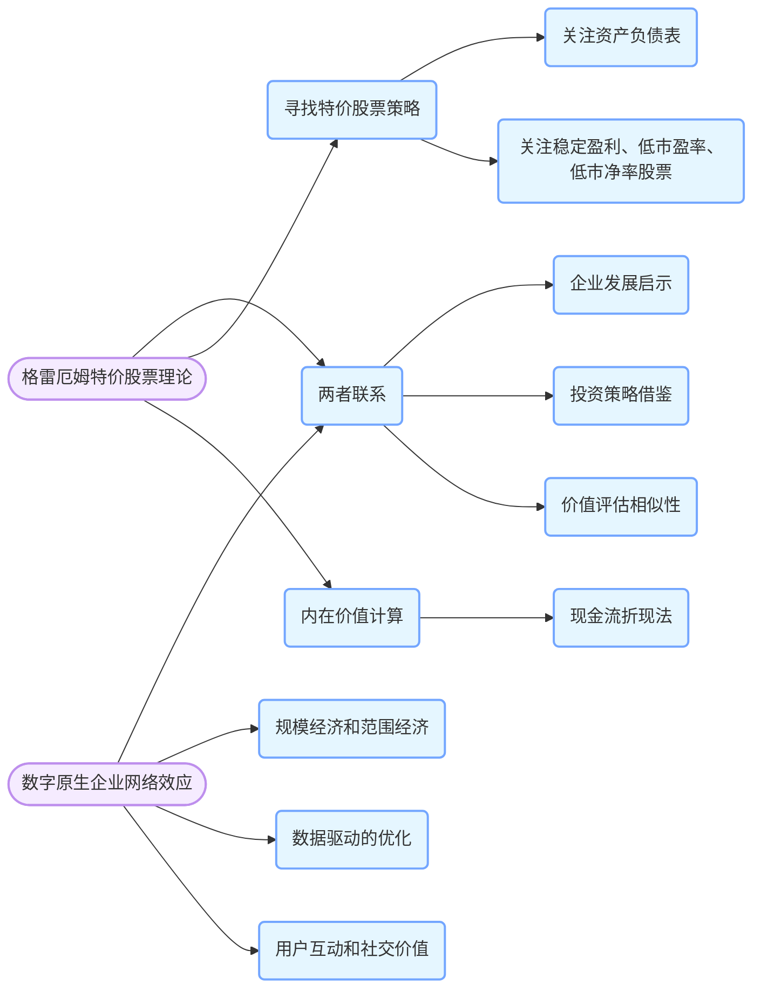

# 格雷厄姆特价股票理论对数字原生企业网络效应的启示

> 关键词：格雷厄姆特价股票理论、数字原生企业、网络效应、价值评估、企业发展策略

> 摘要：本文旨在探讨格雷厄姆特价股票理论如何为数字原生企业的网络效应发展提供启示。首先介绍了格雷厄姆特价股票理论的背景和核心概念，以及数字原生企业网络效应的相关内容。接着详细分析了两者之间的联系，并阐述了核心算法原理及操作步骤。通过数学模型和公式对相关概念进行量化说明，并给出实际案例。进一步探讨了该理论在数字原生企业中的实际应用场景，推荐了学习、开发工具和相关论文资源。最后总结了未来数字原生企业在网络效应发展方面的趋势与挑战，同时解答了常见问题并提供扩展阅读和参考资料，以期为数字原生企业在利用网络效应实现发展提供有价值的思路。

## 1. 背景介绍 
### 1.1 目的和范围
本研究的主要目的是深入探究格雷厄姆特价股票理论对数字原生企业网络效应的启示。在当今数字化时代，数字原生企业凭借其独特的网络效应在市场中迅速崛起，但如何准确评估和利用网络效应以实现企业的可持续发展仍是一个关键问题。格雷厄姆特价股票理论作为经典的价值投资理论，其核心思想对于理解数字原生企业的价值创造和发展具有一定的借鉴意义。本研究将涵盖该理论的基本原理、数字原生企业网络效应的特点，以及两者之间的关联和实际应用。

### 1.2 预期读者
本文的预期读者包括数字原生企业的管理者、投资者、研究数字经济和企业战略的学者，以及对价值投资理论和数字经济感兴趣的专业人士。通过阅读本文，读者可以获得关于如何将传统金融理论应用于数字经济领域的新视角，从而更好地理解数字原生企业的发展规律和价值评估方法。

### 1.3 文档结构概述
本文将按照以下结构进行阐述：首先介绍相关背景和术语，然后详细讲解格雷厄姆特价股票理论和数字原生企业网络效应的核心概念及其联系，接着阐述核心算法原理和具体操作步骤，通过数学模型和公式进行量化分析，并给出实际案例进行说明。之后探讨该理论在数字原生企业中的实际应用场景，推荐相关的学习资源、开发工具和论文著作。最后总结未来发展趋势与挑战，解答常见问题并提供扩展阅读和参考资料。

### 1.4 术语表
#### 1.4.1 核心术语定义
- **格雷厄姆特价股票理论**：由本杰明·格雷厄姆提出的一种价值投资理论，该理论强调通过分析股票的内在价值，寻找价格低于其内在价值的股票进行投资，以获取长期稳定的收益。
- **数字原生企业**：指那些从诞生之初就基于数字技术和互联网平台开展业务的企业，其运营模式、产品和服务都高度依赖数字化技术。
- **网络效应**：指产品或服务的价值随着使用该产品或服务的用户数量的增加而增加的现象。在数字原生企业中，网络效应表现为用户数量的增长会带来更多的用户价值和企业价值。

#### 1.4.2 相关概念解释
- **内在价值**：指股票或企业的真实价值，它基于企业的基本面因素，如资产、盈利、现金流等进行评估。
- **市场价格**：指股票或企业在市场上的交易价格，它受到供求关系、市场情绪等多种因素的影响。
- **梅特卡夫定律**：是网络效应的一个重要理论，该定律指出网络的价值与网络节点数的平方成正比，即随着网络用户数量的增加，网络的价值呈指数级增长。

#### 1.4.3 缩略词列表
- **DCF**：Discounted Cash Flow，现金流折现法，一种用于评估企业内在价值的方法。
- **ROI**：Return on Investment，投资回报率，衡量投资收益的指标。

## 2. 核心概念与联系 

### 2.1 格雷厄姆特价股票理论原理
格雷厄姆特价股票理论的核心是寻找被市场低估的股票。其基本原理是通过对企业的财务报表进行深入分析，计算出企业的内在价值，然后将其与股票的市场价格进行比较。如果市场价格低于内在价值，那么该股票就被认为是被低估的，具有投资价值。

#### 内在价值的计算方法
内在价值的计算通常基于企业的资产、盈利和现金流等因素。一种常见的方法是使用现金流折现法（DCF），该方法将企业未来的现金流折现到当前，以得到企业的内在价值。具体公式如下：
$$V = \sum_{t=1}^{n} \frac{CF_t}{(1 + r)^t}$$
其中，$V$ 表示企业的内在价值，$CF_t$ 表示第 $t$ 期的现金流，$r$ 表示折现率，$n$ 表示预测期数。

#### 寻找特价股票的策略
格雷厄姆认为，市场价格往往会受到短期因素的影响而偏离企业的内在价值。因此，投资者应该关注那些具有稳定盈利能力、低市盈率、低市净率的股票。同时，投资者还应该关注企业的资产负债表，确保企业具有足够的偿债能力。

### 2.2 数字原生企业网络效应原理
数字原生企业的网络效应是指随着用户数量的增加，产品或服务的价值也会随之增加。这种效应主要源于以下几个方面：

#### 用户互动和社交价值
在数字平台上，用户之间可以进行互动和交流，分享信息和资源。随着用户数量的增加，这种互动和社交价值也会不断提升，吸引更多的用户加入。

#### 数据驱动的优化
数字原生企业可以通过收集和分析用户数据，不断优化产品和服务。随着用户数量的增加，企业可以获得更多的数据，从而提高优化的效果，进一步提升产品和服务的价值。

#### 规模经济和范围经济
随着用户数量的增加，数字原生企业可以实现规模经济和范围经济。例如，企业可以通过扩大用户规模降低单位成本，同时可以通过拓展产品线或服务领域增加收入来源。

### 2.3 两者之间的联系
格雷厄姆特价股票理论和数字原生企业网络效应之间存在着一定的联系。具体表现在以下几个方面：

#### 价值评估的相似性
无论是评估股票的内在价值还是数字原生企业的价值，都需要考虑企业的基本面因素和未来发展潜力。在评估数字原生企业时，网络效应是一个重要的考虑因素，它可以影响企业的未来现金流和盈利能力。

#### 投资策略的借鉴
格雷厄姆特价股票理论强调寻找被市场低估的投资机会。在数字原生企业领域，也存在一些具有强大网络效应但市场价格尚未充分反映其价值的企业。投资者可以借鉴格雷厄姆的投资策略，寻找这些被低估的数字原生企业进行投资。

#### 企业发展的启示
数字原生企业可以借鉴格雷厄姆特价股票理论的思想，注重提升自身的内在价值。通过不断优化产品和服务，增强网络效应，提高企业的盈利能力和市场竞争力，从而实现企业的可持续发展。

### 2.4 文本示意图
```plaintext
格雷厄姆特价股票理论
|-- 内在价值计算
|   |-- 现金流折现法
|-- 寻找特价股票策略
|   |-- 关注稳定盈利、低市盈率、低市净率股票
|   |-- 关注资产负债表

数字原生企业网络效应
|-- 用户互动和社交价值
|-- 数据驱动的优化
|-- 规模经济和范围经济

两者联系
|-- 价值评估相似性
|-- 投资策略借鉴
|-- 企业发展启示
```

### 2.5 Mermaid 流程图


## 3. 核心算法原理 & 具体操作步骤 

### 3.1 格雷厄姆特价股票理论核心算法原理
#### 计算内在价值的 Python 实现
```python
import numpy as np

def calculate_intrinsic_value(cash_flows, discount_rate):
    """
    计算企业的内在价值
    :param cash_flows: 未来各期的现金流列表
    :param discount_rate: 折现率
    :return: 企业的内在价值
    """
    periods = len(cash_flows)
    present_values = []
    for t in range(periods):
        present_value = cash_flows[t] / ((1 + discount_rate) ** (t + 1))
        present_values.append(present_value)
    intrinsic_value = np.sum(present_values)
    return intrinsic_value

# 示例数据
cash_flows = [100, 120, 150, 180, 200]
discount_rate = 0.1

intrinsic_value = calculate_intrinsic_value(cash_flows, discount_rate)
print(f"企业的内在价值为: {intrinsic_value}")
```
在上述代码中，我们定义了一个 `calculate_intrinsic_value` 函数，该函数接受未来各期的现金流列表和折现率作为输入，通过现金流折现法计算企业的内在价值。

#### 寻找特价股票的操作步骤
1. **收集企业财务数据**：收集目标企业的财务报表，包括资产负债表、利润表和现金流量表。
2. **计算内在价值**：使用上述计算内在价值的方法，对企业的内在价值进行估算。
3. **比较市场价格和内在价值**：获取目标股票的市场价格，将其与计算得到的内在价值进行比较。如果市场价格低于内在价值，则该股票可能是被低估的。
4. **评估企业基本面**：除了内在价值和市场价格的比较，还需要评估企业的基本面因素，如盈利能力、偿债能力、行业竞争力等。

### 3.2 数字原生企业网络效应评估算法原理
#### 基于梅特卡夫定律的网络价值计算
梅特卡夫定律指出网络的价值与网络节点数的平方成正比。我们可以使用以下 Python 代码来计算数字原生企业的网络价值：
```python
def calculate_network_value(num_users, value_per_user):
    """
    基于梅特卡夫定律计算网络价值
    :param num_users: 用户数量
    :param value_per_user: 每个用户的平均价值
    :return: 网络价值
    """
    network_value = value_per_user * (num_users ** 2)
    return network_value

# 示例数据
num_users = 1000
value_per_user = 10

network_value = calculate_network_value(num_users, value_per_user)
print(f"数字原生企业的网络价值为: {network_value}")
```
在上述代码中，我们定义了一个 `calculate_network_value` 函数，该函数接受用户数量和每个用户的平均价值作为输入，根据梅特卡夫定律计算数字原生企业的网络价值。

#### 评估网络效应的操作步骤
1. **确定用户数量**：通过市场调研、数据分析等方法，确定数字原生企业的用户数量。
2. **估算每个用户的平均价值**：分析用户的消费行为、付费意愿等因素，估算每个用户的平均价值。
3. **计算网络价值**：使用上述基于梅特卡夫定律的计算方法，计算数字原生企业的网络价值。
4. **评估网络效应的可持续性**：考虑市场竞争、技术发展等因素，评估数字原生企业网络效应的可持续性。

### 3.3 结合两者的算法思路
在评估数字原生企业的投资价值时，可以结合格雷厄姆特价股票理论和网络效应评估方法。具体步骤如下：
1. **计算数字原生企业的内在价值**：使用现金流折现法等方法，计算数字原生企业的内在价值。
2. **评估网络效应**：使用基于梅特卡夫定律的方法，评估数字原生企业的网络价值。
3. **综合考虑内在价值和网络价值**：将内在价值和网络价值进行综合考虑，确定数字原生企业的整体价值。
4. **比较市场价格和整体价值**：将数字原生企业的市场价格与计算得到的整体价值进行比较，判断是否存在投资机会。

以下是一个简单的 Python 示例代码：
```python
# 计算内在价值
cash_flows = [200, 250, 300, 350, 400]
discount_rate = 0.1
intrinsic_value = calculate_intrinsic_value(cash_flows, discount_rate)

# 评估网络效应
num_users = 2000
value_per_user = 15
network_value = calculate_network_value(num_users, value_per_user)

# 综合考虑内在价值和网络价值
total_value = intrinsic_value + network_value

# 假设市场价格为 5000
market_price = 5000

if market_price < total_value:
    print("该数字原生企业可能被低估，存在投资机会。")
else:
    print("该数字原生企业市场价格可能已反映其价值，投资需谨慎。")
```
在上述代码中，我们首先计算了数字原生企业的内在价值和网络价值，然后将两者相加得到整体价值。最后，将市场价格与整体价值进行比较，判断是否存在投资机会。

## 4. 数学模型和公式 & 详细讲解 & 举例说明 

### 4.1 格雷厄姆特价股票理论数学模型
#### 现金流折现法公式
现金流折现法（DCF）是计算企业内在价值的常用方法，其公式为：
$$V = \sum_{t=1}^{n} \frac{CF_t}{(1 + r)^t}$$
其中，$V$ 表示企业的内在价值，$CF_t$ 表示第 $t$ 期的现金流，$r$ 表示折现率，$n$ 表示预测期数。

#### 公式详细讲解
- **现金流（$CF_t$）**：指企业在未来各期产生的现金流入减去现金流出后的净额。现金流是企业价值的核心驱动因素，它反映了企业的盈利能力和现金创造能力。
- **折现率（$r$）**：是将未来现金流折现到当前的比率，它反映了资金的时间价值和投资的风险。折现率通常由无风险利率和风险溢价组成，无风险利率一般可以参考国债收益率，风险溢价则根据企业的行业特点、财务状况等因素进行确定。
- **预测期数（$n$）**：是指预测企业现金流的时间范围。预测期数的确定需要考虑企业的行业特点、发展阶段等因素，一般可以根据企业的历史数据和未来发展规划进行估计。

#### 举例说明
假设某企业未来 5 年的现金流分别为 100 万元、120 万元、150 万元、180 万元和 200 万元，折现率为 10%。则该企业的内在价值计算如下：
$$
\begin{align*}
V &= \frac{100}{(1 + 0.1)^1} + \frac{120}{(1 + 0.1)^2} + \frac{150}{(1 + 0.1)^3} + \frac{180}{(1 + 0.1)^4} + \frac{200}{(1 + 0.1)^5}\\
&= \frac{100}{1.1} + \frac{120}{1.21} + \frac{150}{1.331} + \frac{180}{1.4641} + \frac{200}{1.61051}\\
&\approx 90.91 + 99.17 + 112.69 + 122.94 + 124.18\\
&= 549.89 \text{（万元）}
\end{align*}
$$

### 4.2 数字原生企业网络效应数学模型
#### 梅特卡夫定律公式
梅特卡夫定律指出网络的价值与网络节点数的平方成正比，其公式为：
$$V_n = kN^2$$
其中，$V_n$ 表示网络的价值，$N$ 表示网络节点数（即用户数量），$k$ 表示每个用户的平均价值。

#### 公式详细讲解
- **网络节点数（$N$）**：在数字原生企业中，网络节点数通常指用户数量。随着用户数量的增加，网络的价值呈指数级增长。
- **每个用户的平均价值（$k$）**：指每个用户为网络带来的平均价值。它受到用户的消费行为、付费意愿、使用频率等因素的影响。

#### 举例说明
假设某数字原生企业有 1000 个用户，每个用户的平均价值为 10 元。则该企业的网络价值计算如下：
$$V_n = 10 \times 1000^2 = 10000000 \text{（元）}$$

### 4.3 结合两者的数学模型
在评估数字原生企业的投资价值时，可以将格雷厄姆特价股票理论和网络效应评估方法相结合，得到以下数学模型：
$$V_{total} = V + V_n$$
其中，$V_{total}$ 表示数字原生企业的整体价值，$V$ 表示企业的内在价值，$V_n$ 表示企业的网络价值。

#### 举例说明
假设某数字原生企业的内在价值为 500 万元，用户数量为 2000 个，每个用户的平均价值为 15 元。则该企业的网络价值为：
$$V_n = 15 \times 2000^2 = 60000000 \text{（元）} = 6000 \text{（万元）}$$
该企业的整体价值为：
$$V_{total} = 500 + 6000 = 6500 \text{（万元）}$$

## 5. 项目实战：代码实际案例和详细解释说明 

### 5.1 开发环境搭建
#### 安装 Python
首先，需要安装 Python 编程语言。可以从 Python 官方网站（https://www.python.org/downloads/）下载适合自己操作系统的 Python 安装包，并按照安装向导进行安装。

#### 安装必要的库
在本项目中，我们需要使用 `numpy` 库进行数值计算。可以使用以下命令安装 `numpy` 库：
```sh
pip install numpy
```

### 5.2 源代码详细实现和代码解读
```python
import numpy as np

# 计算内在价值的函数
def calculate_intrinsic_value(cash_flows, discount_rate):
    """
    计算企业的内在价值
    :param cash_flows: 未来各期的现金流列表
    :param discount_rate: 折现率
    :return: 企业的内在价值
    """
    periods = len(cash_flows)
    present_values = []
    for t in range(periods):
        present_value = cash_flows[t] / ((1 + discount_rate) ** (t + 1))
        present_values.append(present_value)
    intrinsic_value = np.sum(present_values)
    return intrinsic_value

# 基于梅特卡夫定律计算网络价值的函数
def calculate_network_value(num_users, value_per_user):
    """
    基于梅特卡夫定律计算网络价值
    :param num_users: 用户数量
    :param value_per_user: 每个用户的平均价值
    :return: 网络价值
    """
    network_value = value_per_user * (num_users ** 2)
    return network_value

# 主函数
def main():
    # 示例数据 - 现金流
    cash_flows = [200, 250, 300, 350, 400]
    # 折现率
    discount_rate = 0.1
    # 计算内在价值
    intrinsic_value = calculate_intrinsic_value(cash_flows, discount_rate)

    # 示例数据 - 用户数量
    num_users = 2000
    # 每个用户的平均价值
    value_per_user = 15
    # 计算网络价值
    network_value = calculate_network_value(num_users, value_per_user)

    # 综合考虑内在价值和网络价值
    total_value = intrinsic_value + network_value

    # 假设市场价格为 5000
    market_price = 5000

    if market_price < total_value:
        print("该数字原生企业可能被低估，存在投资机会。")
    else:
        print("该数字原生企业市场价格可能已反映其价值，投资需谨慎。")

if __name__ == "__main__":
    main()
```

#### 代码解读
1. **导入必要的库**：导入 `numpy` 库，用于进行数值计算。
2. **定义计算内在价值的函数**：`calculate_intrinsic_value` 函数接受未来各期的现金流列表和折现率作为输入，通过现金流折现法计算企业的内在价值。
3. **定义计算网络价值的函数**：`calculate_network_value` 函数接受用户数量和每个用户的平均价值作为输入，根据梅特卡夫定律计算数字原生企业的网络价值。
4. **主函数**：在主函数中，我们首先定义了示例数据，包括现金流、折现率、用户数量和每个用户的平均价值。然后分别调用 `calculate_intrinsic_value` 和 `calculate_network_value` 函数计算内在价值和网络价值。接着将两者相加得到整体价值，并与假设的市场价格进行比较，根据比较结果输出投资建议。

### 5.3 代码解读与分析
#### 代码的优点
- **模块化设计**：代码采用了模块化设计，将计算内在价值和网络价值的功能分别封装在不同的函数中，提高了代码的可读性和可维护性。
- **易于扩展**：如果需要对代码进行扩展，例如添加更多的评估指标或修改计算方法，只需要在相应的函数中进行修改即可，不会影响其他部分的代码。
- **示例数据清晰**：代码中使用了清晰的示例数据，方便读者理解代码的功能和使用方法。

#### 代码的局限性
- **数据假设简化**：代码中使用的示例数据是简化的假设，实际应用中需要根据具体情况收集和处理数据。
- **模型简单**：代码中使用的现金流折现法和梅特卡夫定律是比较简单的模型，实际评估中可能需要考虑更多的因素和更复杂的模型。
- **缺乏数据验证**：代码中没有对输入数据进行验证，实际应用中需要对数据的合理性和准确性进行验证。

## 6. 实际应用场景 
### 6.1 投资者决策
对于投资者来说，格雷厄姆特价股票理论对数字原生企业网络效应的启示可以帮助他们更好地评估数字原生企业的投资价值。投资者可以通过分析数字原生企业的内在价值和网络效应，寻找被市场低估的投资机会。例如，当一个数字原生企业具有强大的网络效应，但市场价格尚未充分反映其价值时，投资者可以考虑买入该企业的股票，以获取长期的投资回报。

### 6.2 企业战略规划
数字原生企业在制定战略规划时，可以借鉴格雷厄姆特价股票理论的思想，注重提升自身的内在价值。企业可以通过不断优化产品和服务，增强网络效应，提高用户数量和用户价值，从而实现企业的可持续发展。例如，企业可以加大研发投入，提升产品的性能和用户体验；开展市场营销活动，吸引更多的用户加入；加强数据分析和运营管理，提高企业的效率和盈利能力。

### 6.3 行业分析和研究
在行业分析和研究中，格雷厄姆特价股票理论和数字原生企业网络效应的结合可以为分析师提供新的视角和方法。分析师可以通过比较不同数字原生企业的内在价值和网络效应，评估行业的竞争格局和发展趋势。例如，分析师可以分析哪些企业具有更强的网络效应，哪些企业的内在价值被低估，从而为投资者和企业提供有价值的建议。

### 6.4 并购和重组决策
在企业并购和重组决策中，评估目标企业的价值是关键。格雷厄姆特价股票理论和数字原生企业网络效应的结合可以帮助企业更准确地评估目标企业的价值。例如，当一家企业考虑并购另一家数字原生企业时，可以通过分析目标企业的内在价值和网络效应，确定合理的并购价格。同时，企业还可以考虑如何整合目标企业的网络资源，实现协同效应，提升自身的市场竞争力。

## 7. 工具和资源推荐
### 7.1 学习资源推荐
#### 7.1.1 书籍推荐
- 《聪明的投资者》（The Intelligent Investor）：本杰明·格雷厄姆的经典著作，详细阐述了价值投资的理念和方法，是学习格雷厄姆特价股票理论的必读之书。
- 《网络效应：如何推动平台、产品和初创企业的指数级增长》（The Business of Platforms: Strategy in the Age of Digital Competition, Innovation, and Power）：深入探讨了网络效应的原理和应用，对于理解数字原生企业的发展具有重要的参考价值。
- 《数字经济：中国创新增长新动能》：介绍了数字经济的发展趋势和应用场景，帮助读者了解数字原生企业的发展背景和机遇。

#### 7.1.2 在线课程
- Coursera 上的“投资学原理”（Principles of Investing）课程：由知名教授授课，系统讲解了投资学的基本原理和方法，包括价值投资理论。
- edX 上的“数字经济与商业模式创新”（Digital Economy and Business Model Innovation）课程：介绍了数字经济的发展趋势和商业模式创新，对于理解数字原生企业的运营模式具有重要的帮助。
- Udemy 上的“网络效应与平台战略”（Network Effects and Platform Strategy）课程：深入探讨了网络效应的原理和平台战略的制定，适合对数字原生企业网络效应感兴趣的学习者。

#### 7.1.3 技术博客和网站
- Seeking Alpha：一个知名的投资研究网站，提供了大量关于股票投资和企业分析的文章和研究报告，对于学习格雷厄姆特价股票理论和分析数字原生企业具有重要的参考价值。
- TechCrunch：专注于科技行业的新闻和分析，报道了数字原生企业的最新动态和发展趋势，是了解数字经济领域的重要渠道。
- Medium 上的一些技术博客：如 Towards Data Science 等，经常发布关于数据分析、机器学习和数字经济的文章，对于学习相关技术和理论具有一定的帮助。

### 7.2 开发工具框架推荐
#### 7.2.1 IDE和编辑器
- PyCharm：一款专业的 Python 集成开发环境（IDE），提供了丰富的功能和工具，适合开发 Python 项目。
- Jupyter Notebook：一个交互式的开发环境，支持多种编程语言，适合进行数据分析和模型验证。
- Visual Studio Code：一款轻量级的代码编辑器，支持多种编程语言和插件扩展，适合快速开发和调试代码。

#### 7.2.2 调试和性能分析工具
- pdb：Python 自带的调试工具，可以帮助开发者定位和解决代码中的问题。
- cProfile：Python 标准库中的性能分析工具，可以分析代码的执行时间和函数调用情况，帮助开发者优化代码性能。
- Py-Spy：一个跨平台的 Python 性能分析工具，可以实时监控 Python 程序的性能，找出性能瓶颈。

#### 7.2.3 相关框架和库
- NumPy：一个用于科学计算的 Python 库，提供了高效的数组操作和数学函数，适合进行数值计算和数据分析。
- Pandas：一个用于数据处理和分析的 Python 库，提供了丰富的数据结构和数据操作方法，适合处理和分析各种类型的数据。
- Scikit-learn：一个用于机器学习的 Python 库，提供了多种机器学习算法和工具，适合进行数据建模和预测分析。

### 7.3 相关论文著作推荐
#### 7.3.1 经典论文
- “The Theory of Investment Value”（投资价值理论）：本杰明·格雷厄姆和大卫·多德的经典论文，奠定了价值投资理论的基础。
- “Network Externalities, Competition, and Compatibility”（网络外部性、竞争与兼容性）：该论文首次提出了网络外部性的概念，对于理解网络效应具有重要的意义。
- “Platform Competition in Two-Sided Markets”（双边市场中的平台竞争）：深入研究了双边市场中平台企业的竞争策略和市场结构，对于理解数字原生企业的商业模式具有重要的参考价值。

#### 7.3.2 最新研究成果
- “The Economics of Digital Platforms”（数字平台经济学）：该研究探讨了数字平台的经济特性和发展规律，为数字原生企业的研究提供了新的视角和方法。
- “Network Effects and the Dynamics of Platform Competition”（网络效应与平台竞争的动态变化）：研究了网络效应在平台竞争中的作用和影响，对于理解数字原生企业的竞争格局具有重要的意义。
- “Value Creation and Capture in Digital Platform Ecosystems”（数字平台生态系统中的价值创造和捕获）：分析了数字平台生态系统中企业的价值创造和捕获机制，为数字原生企业的战略制定提供了理论支持。

#### 7.3.3 应用案例分析
- “Case Studies in Digital Platform Strategy”（数字平台战略案例研究）：通过实际案例分析，介绍了数字平台企业的战略制定和实施方法，对于理解数字原生企业的运营管理具有重要的参考价值。
- “The Rise of Digital Natives: Case Studies in Disruptive Innovation”（数字原生企业的崛起：颠覆性创新案例研究）：研究了数字原生企业在不同行业的崛起和发展，分析了它们的创新模式和竞争优势。
- “Platform Business Models: Case Studies from the Sharing Economy”（平台商业模式：共享经济案例研究）：通过共享经济领域的案例，探讨了平台商业模式的特点和发展趋势，对于理解数字原生企业的商业模式创新具有重要的启示。

## 8. 总结：未来发展趋势与挑战
### 8.1 未来发展趋势
#### 数字原生企业网络效应的强化
随着数字技术的不断发展和普及，数字原生企业的网络效应将进一步强化。用户数量的增长将带来更多的用户价值和企业价值，数字原生企业将通过不断优化产品和服务，提高用户体验，吸引更多的用户加入，从而实现网络效应的指数级增长。

#### 跨行业融合与生态系统构建
数字原生企业将越来越多地与传统行业进行融合，构建跨行业的生态系统。通过整合不同行业的资源和优势，数字原生企业可以创造出更多的价值和机会。例如，互联网企业与金融企业的融合，创造出了互联网金融这一新兴领域。

#### 人工智能和大数据的应用
人工智能和大数据技术将在数字原生企业中得到更广泛的应用。通过分析用户数据，数字原生企业可以更好地了解用户需求，优化产品和服务，提高用户满意度。同时，人工智能技术还可以帮助数字原生企业实现自动化运营和决策，提高企业的效率和竞争力。

#### 全球化发展
数字原生企业具有天然的全球化属性，随着互联网的普及和全球贸易的自由化，数字原生企业将越来越多地走向全球市场。通过拓展国际市场，数字原生企业可以获得更多的用户和资源，实现更大的发展。

### 8.2 挑战
#### 数据隐私和安全问题
数字原生企业高度依赖用户数据，数据隐私和安全问题成为了数字原生企业面临的重要挑战。一旦用户数据泄露，不仅会损害用户的利益，还会影响企业的声誉和竞争力。因此，数字原生企业需要加强数据安全管理，保护用户数据的隐私和安全。

#### 市场竞争加剧
随着数字经济的发展，数字原生企业的数量不断增加，市场竞争也日益激烈。数字原生企业需要不断创新和优化产品和服务，提高用户体验，才能在激烈的市场竞争中脱颖而出。同时，数字原生企业还需要应对来自传统企业的竞争，传统企业也在不断数字化转型，进入数字经济领域。

#### 监管政策的不确定性
数字经济是一个新兴的领域，监管政策还不够完善和成熟。数字原生企业面临着监管政策的不确定性，监管政策的变化可能会对企业的发展产生重大影响。因此，数字原生企业需要密切关注监管政策的变化，积极与监管部门沟通，合规经营。

#### 技术创新的压力
数字技术发展迅速，数字原生企业需要不断进行技术创新，才能保持竞争力。技术创新需要大量的研发投入和人才支持，对于一些小型数字原生企业来说，技术创新的压力较大。同时，技术创新也存在一定的风险，新技术的应用可能会带来新的问题和挑战。

## 9. 附录：常见问题与解答
### 9.1 格雷厄姆特价股票理论是否适用于所有数字原生企业？
格雷厄姆特价股票理论的核心思想是寻找被市场低估的投资机会，其基本原理对于评估数字原生企业的投资价值具有一定的借鉴意义。然而，数字原生企业具有独特的特点，如网络效应、快速发展和高不确定性等，因此在应用该理论时需要进行适当的调整和补充。例如，在评估数字原生企业的内在价值时，需要考虑网络效应带来的额外价值；在预测企业未来现金流时，需要考虑行业的发展趋势和企业的竞争优势。

### 9.2 如何准确评估数字原生企业的网络效应？
评估数字原生企业的网络效应是一个复杂的问题，需要综合考虑多个因素。可以从以下几个方面入手：
- **用户数量和增长趋势**：用户数量是衡量网络效应的重要指标之一，同时需要关注用户数量的增长趋势。快速增长的用户数量通常意味着强大的网络效应。
- **用户活跃度和粘性**：除了用户数量，还需要考虑用户的活跃度和粘性。活跃用户和高粘性用户能够为企业带来更多的价值和口碑，增强网络效应。
- **数据驱动的优化能力**：数字原生企业可以通过收集和分析用户数据，不断优化产品和服务。评估企业的数据驱动的优化能力可以了解企业是否能够充分利用网络效应，提升用户价值。
- **行业竞争格局**：考虑行业内其他竞争对手的情况，分析企业在竞争中的优势和劣势。如果企业能够在竞争中脱颖而出，吸引更多的用户，说明其网络效应较强。

### 9.3 数字原生企业的内在价值和网络价值如何平衡？
在评估数字原生企业的投资价值时，需要综合考虑内在价值和网络价值。内在价值反映了企业的基本面因素，如资产、盈利和现金流等；网络价值则反映了企业的网络效应带来的额外价值。平衡两者的关键在于根据企业的发展阶段和行业特点进行合理的权重分配。

- **对于处于早期发展阶段的数字原生企业**：网络价值可能更为重要，因为此时企业的盈利能力可能较弱，但具有较大的发展潜力。在这种情况下，可以适当提高网络价值的权重。
- **对于处于成熟阶段的数字原生企业**：内在价值可能更为重要，因为此时企业的盈利能力相对稳定，网络效应已经得到了一定的体现。在这种情况下，可以适当提高内在价值的权重。

### 9.4 如何应对数字原生企业面临的数据隐私和安全问题？
数字原生企业可以采取以下措施应对数据隐私和安全问题：
- **加强数据安全管理**：建立完善的数据安全管理制度，包括数据加密、访问控制、备份恢复等措施，确保用户数据的安全。
- **合规经营**：遵守相关的数据隐私和安全法规，如《通用数据保护条例》（GDPR）等，保护用户的合法权益。
- **加强技术研发**：不断投入研发资源，提升数据安全技术水平，防范数据泄露和攻击。
- **提高员工安全意识**：对员工进行数据安全培训，提高员工的数据安全意识，避免因人为因素导致的数据泄露。

### 9.5 数字原生企业如何在激烈的市场竞争中保持优势？
数字原生企业可以通过以下方式在激烈的市场竞争中保持优势：
- **持续创新**：不断进行技术创新和商业模式创新，推出具有竞争力的产品和服务，满足用户不断变化的需求。
- **提升用户体验**：注重用户体验，优化产品和服务的设计和运营，提高用户满意度和忠诚度。
- **加强品牌建设**：通过品牌建设，提升企业的知名度和美誉度，树立良好的品牌形象。
- **拓展业务领域**：根据市场需求和自身优势，拓展业务领域，实现多元化发展，降低单一业务的风险。
- **加强合作与联盟**：与其他企业进行合作与联盟，整合资源，实现优势互补，共同应对市场竞争。

## 10. 扩展阅读 & 参考资料
### 扩展阅读
- 《创新者的窘境》（The Innovator's Dilemma）：该书探讨了企业在创新过程中面临的困境和挑战，对于理解数字原生企业的创新和发展具有重要的启示。
- 《平台革命：改变世界的商业模式》（Platform Revolution: How Networked Markets Are Transforming the Economy - and How to Make Them Work for You）：深入研究了平台商业模式的特点和发展趋势，对于理解数字原生企业的平台战略具有重要的参考价值。
- 《指数型组织：打造独角兽公司的11个最强属性》（Exponential Organizations: Why New Organizations Are Ten Times Better, Faster, and Cheaper Than Yours (and What to Do About It)）：介绍了指数型组织的概念和特点，对于理解数字原生企业的快速发展和增长具有重要的帮助。

### 参考资料
- Graham, B., & Dodd, D. (1934). Security Analysis. McGraw-Hill.
- Shapiro, C., & Varian, H. R. (1999). Information Rules: A Strategic Guide to the Network Economy. Harvard Business School Press.
- Parker, G. G., Van Alstyne, M. W., & Choudary, S. P. (2016). Platform Revolution: How Networked Markets Are Transforming the Economy - and How to Make Them Work for You. W. W. Norton & Company.

作者：AI天才研究院/AI Genius Institute & 禅与计算机程序设计艺术 /Zen And The Art of Computer Programming