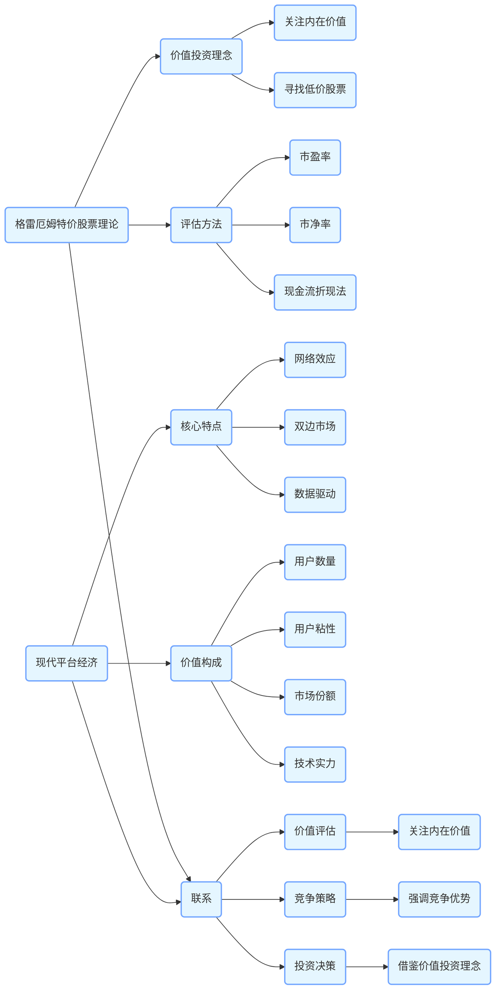

# 格雷厄姆特价股票理论对现代平台经济的启示

> 关键词：格雷厄姆特价股票理论、现代平台经济、价值投资、市场效率、竞争优势、用户价值、长期发展

> 摘要：本文旨在探讨格雷厄姆特价股票理论对现代平台经济的启示。首先介绍了格雷厄姆特价股票理论的背景和核心概念，包括其价值投资的理念和评估方法。接着分析了现代平台经济的特点和发展趋势。然后从多个角度阐述了该理论对平台经济的启示，如价值评估、竞争策略、用户价值挖掘等。通过数学模型和实际案例进一步说明这些启示的应用。最后总结了未来平台经济发展的趋势与挑战，并对常见问题进行解答。希望通过本文的研究，能为平台经济的参与者提供有价值的参考，促进平台经济的健康发展。

## 1. 背景介绍 
### 1.1 目的和范围
本研究的目的是深入探究格雷厄姆特价股票理论在现代平台经济领域的应用和启示。通过对该理论的剖析，结合现代平台经济的特点和发展现状，挖掘出可借鉴的思想和方法，为平台经济的运营者、投资者以及相关研究人员提供新的思路和理论支持。研究范围涵盖了格雷厄姆特价股票理论的基本原理、现代平台经济的各个方面，包括平台的商业模式、市场竞争、用户行为等，以及两者之间的联系和相互影响。

### 1.2 预期读者
本文预期读者包括平台经济领域的从业者，如平台运营者、创业者等，他们可以从文中获取有关平台价值评估、竞争策略制定等方面的启示；投资者，包括股票投资者、风险投资者等，有助于他们更好地理解平台经济的投资价值和风险；学术界的研究人员，为他们的学术研究提供新的视角和理论参考；以及对平台经济和价值投资感兴趣的一般读者。

### 1.3 文档结构概述
本文首先介绍了研究的背景，包括目的、预期读者和文档结构概述，以及相关术语的定义和解释。接着阐述了格雷厄姆特价股票理论和现代平台经济的核心概念及其联系，通过文本示意图和 Mermaid 流程图进行直观展示。然后详细讲解了核心算法原理和具体操作步骤，使用 Python 源代码进行说明。之后介绍了相关的数学模型和公式，并通过举例进行详细讲解。再通过项目实战，展示代码实际案例并进行详细解释。随后探讨了该理论在现代平台经济中的实际应用场景。接着推荐了相关的学习资源、开发工具框架和论文著作。最后总结了未来发展趋势与挑战，解答了常见问题，并提供了扩展阅读和参考资料。

### 1.4 术语表
#### 1.4.1 核心术语定义
- **格雷厄姆特价股票理论**：由本杰明·格雷厄姆提出的一种价值投资理论，强调通过对股票内在价值的评估，寻找价格低于其内在价值的股票进行投资。
- **现代平台经济**：基于互联网技术，通过搭建平台连接供需双方，实现资源优化配置和价值创造的一种经济模式。
- **价值投资**：一种投资策略，注重对投资对象内在价值的分析，以低于内在价值的价格买入，长期持有以获取收益。
- **内在价值**：资产在未来所能产生的现金流的现值。
- **平台网络效应**：随着平台用户数量的增加，平台的价值和用户的收益也随之增加的现象。

#### 1.4.2 相关概念解释
- **护城河理论**：由沃伦·巴菲特提出，指企业拥有的可持续竞争优势，如同城堡周围的护城河，能够保护企业的市场份额和利润。在平台经济中，网络效应、品牌、技术等都可能构成平台的护城河。
- **用户粘性**：用户对平台的依赖程度和忠诚度，通常通过用户的活跃度、留存率等指标来衡量。
- **双边市场**：平台经济中常见的一种市场结构，平台同时服务于两类或多类不同的用户群体，通过促进不同群体之间的交易和互动来实现价值创造。

#### 1.4.3 缩略词列表
- **P/E**：市盈率（Price - Earnings Ratio），即股票价格与每股收益的比率，用于衡量股票的估值水平。
- **P/B**：市净率（Price - Book Ratio），即股票价格与每股净资产的比率，反映了市场对公司净资产的估值。
- **DCF**：现金流折现法（Discounted Cash Flow），一种用于评估资产内在价值的方法，通过预测资产未来的现金流并折现到当前来计算其价值。

## 2. 核心概念与联系 

### 格雷厄姆特价股票理论核心概念
格雷厄姆特价股票理论的核心是价值投资。格雷厄姆认为，股票市场存在着价格波动，而股票的内在价值是相对稳定的。投资者的任务就是通过对公司的财务状况、经营业绩等基本面因素的分析，评估出股票的内在价值，然后寻找那些价格低于内在价值的股票进行投资。他提出了一系列的评估方法和指标，如市盈率、市净率等，来筛选出具有投资价值的股票。

### 现代平台经济核心概念
现代平台经济是一种基于互联网技术的新型经济模式。平台作为连接供需双方的中介，通过提供信息、交易、支付等服务，促进了资源的优化配置和价值的创造。平台经济具有网络效应、双边市场、数据驱动等特点。网络效应使得平台的价值随着用户数量的增加而呈指数级增长；双边市场则要求平台同时满足不同用户群体的需求，实现供需的平衡；数据驱动则使得平台能够更好地了解用户需求，提供个性化的服务。

### 核心概念的联系
格雷厄姆特价股票理论和现代平台经济之间存在着多方面的联系。在价值评估方面，两者都强调对内在价值的关注。在平台经济中，平台的内在价值可以通过其用户数量、用户粘性、市场份额、技术实力等因素来评估，就像股票的内在价值可以通过公司的财务指标来评估一样。在竞争策略方面，格雷厄姆强调寻找具有竞争优势的公司，而在平台经济中，平台也需要构建自己的竞争优势，如网络效应、品牌、技术等，以实现长期的发展。在投资决策方面，投资者在选择投资平台时，也可以借鉴格雷厄姆的价值投资理念，寻找那些价格被低估的平台进行投资。

### 文本示意图
```plaintext
格雷厄姆特价股票理论
|-- 价值投资理念
|   |-- 关注内在价值
|   |-- 寻找价格低于内在价值的股票
|-- 评估方法
|   |-- 市盈率
|   |-- 市净率
|   |-- 现金流折现法

现代平台经济
|-- 核心特点
|   |-- 网络效应
|   |-- 双边市场
|   |-- 数据驱动
|-- 价值构成
|   |-- 用户数量
|   |-- 用户粘性
|   |-- 市场份额
|   |-- 技术实力

联系
|-- 价值评估
|   |-- 都关注内在价值
|-- 竞争策略
|   |-- 都强调竞争优势
|-- 投资决策
|   |-- 可借鉴价值投资理念
```

### Mermaid 流程图


## 3. 核心算法原理 & 具体操作步骤 

### 格雷厄姆的价值评估算法原理
格雷厄姆提出了多种价值评估方法，其中一种经典的方法是基于市盈率和市净率的评估。他认为，股票的合理价格应该与其盈利能力和净资产相关。具体来说，他提出了一个简单的公式：
$$V = EPS \times (8.5 + 2g) \times \frac{4.4}{Y}$$
其中，$V$ 是股票的内在价值，$EPS$ 是每股收益，$g$ 是预期的长期增长率，$Y$ 是当前的 AAA 级债券收益率，8.5 是一个经验常数。

### Python 代码实现
```python
def graham_value(EPS, g, Y):
    """
    计算格雷厄姆的股票内在价值
    :param EPS: 每股收益
    :param g: 预期的长期增长率
    :param Y: 当前的 AAA 级债券收益率
    :return: 股票的内在价值
    """
    return EPS * (8.5 + 2 * g) * (4.4 / Y)

# 示例数据
EPS = 2.0
g = 0.1
Y = 0.03

# 计算内在价值
value = graham_value(EPS, g, Y)
print(f"股票的内在价值为: {value}")
```

### 具体操作步骤
1. **数据收集**：收集目标股票的每股收益（EPS）、预期的长期增长率（g）和当前的 AAA 级债券收益率（Y）。
2. **参数估计**：对于预期的长期增长率（g），可以通过分析公司的历史业绩、行业发展趋势等因素进行估计。当前的 AAA 级债券收益率（Y）可以从金融数据提供商处获取。
3. **计算内在价值**：将收集到的数据代入格雷厄姆的公式中，计算出股票的内在价值。
4. **比较价格与内在价值**：将计算出的内在价值与当前股票的市场价格进行比较。如果市场价格低于内在价值，则该股票可能被低估，具有投资价值。

### 对平台经济的启示及应用步骤
在平台经济中，可以借鉴格雷厄姆的价值评估方法，对平台的价值进行评估。具体步骤如下：
1. **确定平台的“收益”指标**：在平台经济中，“收益”可以表现为平台的收入、利润、用户数量、用户活跃度等指标。选择合适的指标来衡量平台的盈利能力和发展潜力。
2. **估计平台的“增长率”**：分析平台的历史数据、市场趋势、竞争环境等因素，估计平台未来的增长率。
3. **确定“债券收益率”类似指标**：可以选择市场的无风险利率或行业的平均收益率作为类似指标。
4. **计算平台的内在价值**：根据确定的指标和估计的参数，使用类似的公式计算平台的内在价值。
5. **比较价格与内在价值**：将平台的市场估值（如市值、融资估值等）与计算出的内在价值进行比较，判断平台是否被低估。

## 4. 数学模型和公式 & 详细讲解 & 举例说明 

### 现金流折现法（DCF）模型
现金流折现法是一种常用的价值评估方法，其基本原理是将资产未来的现金流折现到当前，以计算其内在价值。公式如下：
$$V = \sum_{t = 1}^{n} \frac{CF_t}{(1 + r)^t}$$
其中，$V$ 是资产的内在价值，$CF_t$ 是第 $t$ 期的现金流，$r$ 是折现率，$n$ 是现金流的预测期数。

### 详细讲解
- **现金流预测**：准确预测资产未来的现金流是 DCF 模型的关键。对于平台经济来说，现金流可以包括平台的收入、成本、利润等。在预测现金流时，需要考虑平台的业务模式、市场竞争、用户增长等因素。
- **折现率确定**：折现率反映了投资者对资产风险的预期。一般来说，折现率越高，资产的现值越低。在平台经济中，折现率可以根据市场的无风险利率、行业的风险溢价等因素来确定。
- **预测期数选择**：预测期数的选择需要根据资产的特点和市场情况来确定。对于平台经济来说，由于其发展速度较快，预测期数可以相对较短，一般为 5 - 10 年。

### 举例说明
假设一个平台在未来 5 年的现金流分别为 100 万元、120 万元、150 万元、180 万元和 200 万元，折现率为 10%。则该平台的内在价值为：
$$V = \frac{100}{(1 + 0.1)^1} + \frac{120}{(1 + 0.1)^2} + \frac{150}{(1 + 0.1)^3} + \frac{180}{(1 + 0.1)^4} + \frac{200}{(1 + 0.1)^5}$$
```python
import numpy as np

cash_flows = np.array([100, 120, 150, 180, 200])
discount_rate = 0.1
years = np.arange(1, len(cash_flows) + 1)

present_values = cash_flows / (1 + discount_rate) ** years
intrinsic_value = present_values.sum()

print(f"平台的内在价值为: {intrinsic_value} 万元")
```

### 对平台经济的启示
在平台经济中，DCF 模型可以用于评估平台的投资价值、制定战略规划等。通过预测平台未来的现金流，可以更好地了解平台的发展潜力和风险。同时，折现率的确定也可以反映出平台的风险水平，帮助投资者做出更明智的决策。

## 5. 项目实战：代码实际案例和详细解释说明 

### 5.1  开发环境搭建
- **编程语言**：Python 3.x
- **开发工具**：可以选择 PyCharm、Jupyter Notebook 等。
- **所需库**：`numpy`、`pandas` 等，用于数据处理和计算。可以使用以下命令进行安装：
```sh
pip install numpy pandas
```

### 5.2  源代码详细实现和代码解读
以下是一个使用 DCF 模型评估平台价值的完整代码示例：
```python
import numpy as np
import pandas as pd

def dcf_valuation(cash_flows, discount_rate, terminal_growth_rate=None, terminal_year=None):
    """
    使用现金流折现法评估平台价值
    :param cash_flows: 未来各期的现金流列表
    :param discount_rate: 折现率
    :param terminal_growth_rate: 终值期的增长率（可选）
    :param terminal_year: 终值期开始的年份（可选）
    :return: 平台的内在价值
    """
    years = np.arange(1, len(cash_flows) + 1)
    present_values = cash_flows / (1 + discount_rate) ** years

    if terminal_growth_rate is not None and terminal_year is not None:
        # 计算终值
        last_cash_flow = cash_flows[terminal_year - 1]
        terminal_value = last_cash_flow * (1 + terminal_growth_rate) / (discount_rate - terminal_growth_rate)
        terminal_present_value = terminal_value / (1 + discount_rate) ** terminal_year
        present_values[-1] += terminal_present_value

    intrinsic_value = present_values.sum()
    return intrinsic_value

# 示例数据
cash_flows = np.array([100, 120, 150, 180, 200])
discount_rate = 0.1
terminal_growth_rate = 0.03
terminal_year = 5

# 计算平台的内在价值
intrinsic_value = dcf_valuation(cash_flows, discount_rate, terminal_growth_rate, terminal_year)
print(f"平台的内在价值为: {intrinsic_value} 万元")
```
### 代码解读
1. **函数定义**：`dcf_valuation` 函数接受四个参数：`cash_flows` 表示未来各期的现金流列表，`discount_rate` 表示折现率，`terminal_growth_rate` 表示终值期的增长率（可选），`terminal_year` 表示终值期开始的年份（可选）。
2. **现金流折现计算**：使用 `numpy` 数组计算各期现金流的现值，并将其存储在 `present_values` 数组中。
3. **终值计算（可选）**：如果提供了 `terminal_growth_rate` 和 `terminal_year` 参数，则计算终值并将其折现成现值，添加到最后一期的现值中。
4. **内在价值计算**：将各期的现值相加，得到平台的内在价值。

### 5.3  代码解读与分析
- **优点**：该代码实现了一个简单的 DCF 模型，可以根据不同的现金流预测和折现率计算平台的内在价值。同时，支持终值的计算，考虑了平台的长期发展。
