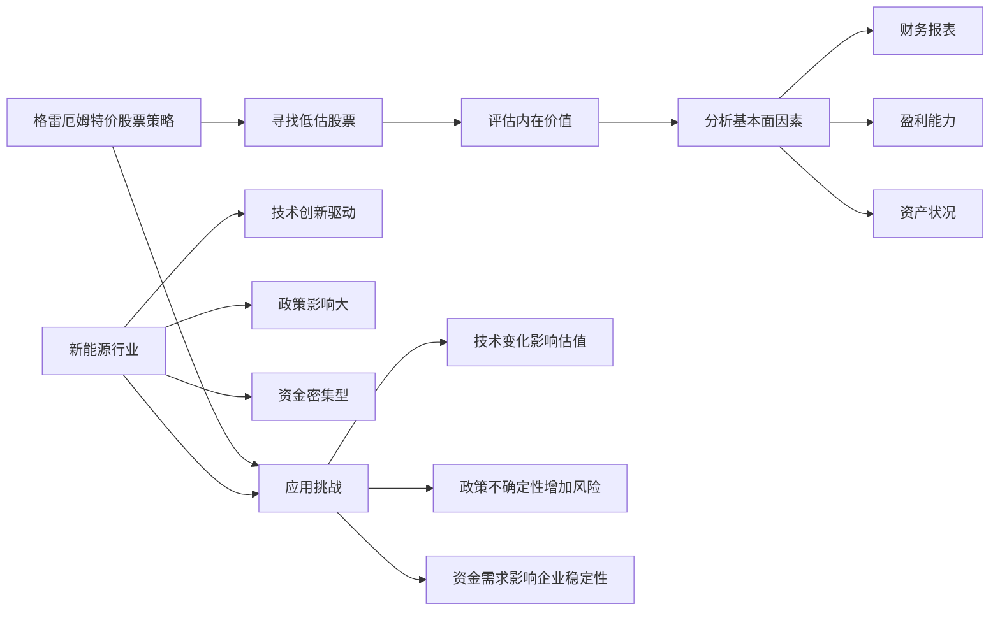

# 格雷厄姆特价股票策略在新能源行业的应用挑战

> 关键词：格雷厄姆特价股票策略、新能源行业、应用挑战、价值投资、股票分析

> 摘要：本文聚焦于格雷厄姆特价股票策略在新能源行业的应用挑战。首先介绍了该策略的背景知识以及新能源行业的发展现状，阐述了研究的目的、范围、预期读者等。接着深入剖析了格雷厄姆特价股票策略的核心概念与原理，通过 Python 代码展示了其算法原理及操作步骤，并结合数学模型和公式进行详细讲解。在项目实战部分，给出了开发环境搭建、源代码实现及解读。随后探讨了该策略在新能源行业的实际应用场景，推荐了相关的学习资源、开发工具框架和论文著作。最后总结了未来发展趋势与挑战，并对常见问题进行了解答，为投资者和研究者提供了全面的参考。

## 1. 背景介绍 
### 1.1 目的和范围
本研究旨在深入探讨格雷厄姆特价股票策略在新能源行业应用时所面临的挑战。格雷厄姆特价股票策略作为价值投资的经典方法，长期以来在传统行业中被广泛应用并取得了一定成效。然而，新能源行业具有独特的发展特点和市场环境，该策略能否直接应用以及会遇到哪些问题值得深入研究。研究范围涵盖了新能源行业的各个细分领域，包括太阳能、风能、水能、生物能等，分析该策略在不同细分领域应用时的共性和个性挑战。

### 1.2 预期读者
本文的预期读者主要包括金融投资者，尤其是对价值投资和新能源行业感兴趣的个人和机构投资者，他们希望通过了解该策略在新能源行业的应用挑战，优化投资决策。同时，也适合金融研究人员和学者，为他们在相关领域的学术研究提供参考。此外，新能源行业的从业者也可以从本文中了解金融投资策略与行业发展的关联，为企业的战略规划提供思路。

### 1.3 文档结构概述
本文首先介绍研究的背景信息，包括目的、范围、预期读者和文档结构。接着阐述格雷厄姆特价股票策略的核心概念与联系，通过文本示意图和 Mermaid 流程图进行直观展示。然后详细讲解核心算法原理和具体操作步骤，并结合 Python 代码进行说明。之后介绍相关的数学模型和公式，并举例说明。在项目实战部分，给出开发环境搭建、源代码实现和代码解读。随后探讨该策略在新能源行业的实际应用场景，推荐相关的工具和资源。最后总结未来发展趋势与挑战，解答常见问题，并提供扩展阅读和参考资料。

### 1.4 术语表
#### 1.4.1 核心术语定义
- **格雷厄姆特价股票策略**：由本杰明·格雷厄姆提出的一种价值投资策略，其核心思想是寻找价格低于内在价值的股票进行投资，强调通过对公司财务报表等基本面因素的分析来评估股票的价值。
- **新能源行业**：指利用新技术和新材料开发利用传统能源之外的各种能源形式的行业，主要包括太阳能、风能、水能、生物能等可再生能源的开发、生产和应用。
- **内在价值**：指股票所代表的公司的真实价值，通常通过对公司的资产、盈利能力、现金流等因素进行综合评估得出。

#### 1.4.2 相关概念解释
- **价值投资**：一种投资理念，强调通过分析股票的内在价值，寻找被市场低估的股票进行投资，以获取长期的投资回报。
- **基本面分析**：通过研究公司的财务报表、行业前景、管理层能力等基本面因素，评估公司的价值和发展潜力，为投资决策提供依据。

#### 1.4.3 缩略词列表
- **PE**：市盈率（Price-to-Earnings Ratio），指股票价格与每股盈利的比率，用于衡量股票的估值水平。
- **PB**：市净率（Price-to-Book Ratio），指股票价格与每股净资产的比率，反映了市场对公司净资产的估值。

## 2. 核心概念与联系 

### 格雷厄姆特价股票策略原理
格雷厄姆特价股票策略的核心原理是基于价值投资的理念，认为市场有时会对股票进行错误定价，导致股票价格低于其内在价值。投资者可以通过深入分析公司的基本面，如财务报表、盈利能力、资产状况等，找出这些被低估的股票，并在价格回归内在价值时获得投资收益。

具体来说，格雷厄姆提出了一些评估股票价值的指标和方法，例如：
- **低市盈率（PE）**：市盈率是衡量股票估值的常用指标，低市盈率意味着股票价格相对较低，可能被市场低估。
- **低市净率（PB）**：市净率反映了股票价格与公司净资产的关系，低市净率表示股票价格相对净资产较低，具有一定的安全边际。
- **股息率**：股息率是指股息与股票价格的比率，较高的股息率意味着投资者可以获得更多的现金回报。

### 新能源行业特点
新能源行业具有以下特点：
- **技术创新驱动**：新能源行业的发展高度依赖技术创新，新技术的出现可能会改变行业的竞争格局。例如，太阳能光伏技术的不断进步，使得光伏发电成本不断降低，提高了太阳能在能源市场的竞争力。
- **政策影响大**：新能源行业的发展受到政府政策的大力支持，政策的变化对行业的发展具有重要影响。例如，政府的补贴政策可以促进新能源项目的建设和发展，而政策的调整可能会导致行业发展速度的变化。
- **资金密集型**：新能源项目的建设和运营需要大量的资金投入，如风力发电场、太阳能电站的建设等。这使得新能源企业对资金的需求较大，融资能力成为企业发展的关键因素之一。

### 核心概念联系示意图


该流程图展示了格雷厄姆特价股票策略、新能源行业和应用挑战之间的联系。格雷厄姆特价股票策略的核心是寻找低估股票，需要通过分析基本面因素来评估内在价值。新能源行业具有技术创新驱动、政策影响大、资金密集型等特点，这些特点导致了该策略在新能源行业应用时面临技术变化影响估值、政策不确定性增加风险、资金需求影响企业稳定性等挑战。

## 3. 核心算法原理 & 具体操作步骤 

### 核心算法原理
格雷厄姆特价股票策略的核心算法是通过计算一系列财务指标来评估股票的价值，并筛选出被低估的股票。以下是主要的财务指标及其计算方法：

#### 市盈率（PE）
市盈率是指股票价格与每股盈利的比率，计算公式为：
$$PE = \frac{股价}{每股盈利}$$

#### 市净率（PB）
市净率是指股票价格与每股净资产的比率，计算公式为：
$$PB = \frac{股价}{每股净资产}$$

#### 股息率
股息率是指股息与股票价格的比率，计算公式为：
$$股息率 = \frac{每股股息}{股价} \times 100\%$$

### 具体操作步骤
以下是使用 Python 实现格雷厄姆特价股票策略的具体操作步骤：

```python
import pandas as pd

# 假设我们有一个包含股票信息的 DataFrame，列名为 '股价', '每股盈利', '每股净资产', '每股股息'
data = {
    '股价': [10, 20, 30, 40],
    '每股盈利': [1, 2, 3, 4],
    '每股净资产': [5, 10, 15, 20],
    '每股股息': [0.5, 1, 1.5, 2]
}
df = pd.DataFrame(data)

# 计算市盈率
df['PE'] = df['股价'] / df['每股盈利']

# 计算市净率
df['PB'] = df['股价'] / df['每股净资产']

# 计算股息率
df['股息率'] = (df['每股股息'] / df['股价']) * 100

# 筛选出低市盈率、低市净率和高股息率的股票
low_pe = df[df['PE'] < 15]
low_pb = low_pe[low_pe['PB'] < 1.5]
high_dividend = low_pb[low_pb['股息率'] > 3]

print(high_dividend)
```

### 代码解释
1. **数据准备**：首先创建一个包含股票信息的 DataFrame，其中包含股价、每股盈利、每股净资产和每股股息等列。
2. **指标计算**：使用 DataFrame 的算术运算方法计算市盈率、市净率和股息率，并将结果添加到 DataFrame 中。
3. **股票筛选**：根据格雷厄姆的标准，筛选出市盈率低于 15、市净率低于 1.5 和股息率高于 3% 的股票。
4. **结果输出**：打印筛选后的股票信息。

## 4. 数学模型和公式 & 详细讲解 & 举例说明 

### 数学模型和公式
#### 内在价值评估模型
格雷厄姆提出了一个简单的内在价值评估公式：
$$V = EPS \times (8.5 + 2g)$$
其中，$V$ 表示股票的内在价值，$EPS$ 表示每股盈利，$g$ 表示预期的未来增长率。

#### 安全边际公式
安全边际是指股票价格与内在价值之间的差距，计算公式为：
$$安全边际 = \frac{内在价值 - 股价}{内在价值} \times 100\%$$

### 详细讲解
#### 内在价值评估模型
内在价值评估模型的核心思想是通过每股盈利和预期增长率来估算股票的内在价值。其中，8.5 是一个经验系数，代表了一个稳定增长的公司的最低市盈率。2g 表示根据预期增长率对市盈率的调整，预期增长率越高，市盈率也应该越高。

#### 安全边际公式
安全边际反映了股票投资的风险程度。安全边际越高，意味着股票价格低于内在价值的幅度越大，投资风险越小。当安全边际大于一定比例时，投资者可以认为该股票具有投资价值。

### 举例说明
假设某新能源公司的每股盈利为 2 元，预期未来增长率为 10%。根据内在价值评估公式，该股票的内在价值为：
$$V = 2 \times (8.5 + 2 \times 10) = 2 \times 28.5 = 57$$（元）

如果该股票的当前价格为 40 元，则安全边际为：
$$安全边际 = \frac{57 - 40}{57} \times 100\% \approx 29.8\%$$

由于安全边际较高，说明该股票可能被低估，具有一定的投资价值。

## 5. 项目实战：代码实际案例和详细解释说明 

### 5.1  开发环境搭建
为了实现格雷厄姆特价股票策略在新能源行业的应用，我们需要搭建以下开发环境：

#### Python 安装
首先，确保你已经安装了 Python 3.x 版本。你可以从 Python 官方网站（https://www.python.org/downloads/）下载并安装适合你操作系统的 Python 版本。

#### 必要的库安装
我们需要安装一些必要的 Python 库，包括 pandas、numpy 等。可以使用以下命令进行安装：
```sh
pip install pandas numpy
```

### 5.2  源代码详细实现和代码解读
以下是一个完整的 Python 代码示例，用于筛选新能源行业中符合格雷厄姆特价股票策略的股票：

```python
import pandas as pd
import numpy as np

# 模拟新能源行业股票数据
data = {
    '股票代码': ['000001', '000002', '000003', '000004'],
    '股价': [10, 20, 30, 40],
    '每股盈利': [1, 2, 3, 4],
    '每股净资产': [5, 10, 15, 20],
    '每股股息': [0.5, 1, 1.5, 2],
    '预期增长率': [0.1, 0.2, 0.3, 0.4]
}
df = pd.DataFrame(data)

# 计算市盈率
df['PE'] = df['股价'] / df['每股盈利']

# 计算市净率
df['PB'] = df['股价'] / df['每股净资产']

# 计算股息率
df['股息率'] = (df['每股股息'] / df['股价']) * 100

# 计算内在价值
df['内在价值'] = df['每股盈利'] * (8.5 + 2 * df['预期增长率'])

# 计算安全边际
df['安全边际'] = ((df['内在价值'] - df['股价']) / df['内在价值']) * 100

# 筛选符合条件的股票
low_pe = df[df['PE'] < 15]
low_pb = low_pe[low_pe['PB'] < 1.5]
high_dividend = low_pb[low_pb['股息率'] > 3]
high_margin = high_dividend[high_dividend['安全边际'] > 20]

print(high_margin)
```

### 5.3  代码解读与分析
1. **数据模拟**：首先，我们使用字典模拟了新能源行业的股票数据，包括股票代码、股价、每股盈利、每股净资产、每股股息和预期增长率等信息，并将其转换为 DataFrame 对象。
2. **指标计算**：使用 DataFrame 的算术运算方法计算市盈率、市净率、股息率、内在价值和安全边际等指标，并将结果添加到 DataFrame 中。
3. **股票筛选**：根据格雷厄姆的标准，筛选出市盈率低于 15、市净率低于 1.5、股息率高于 3% 和安全边际高于 20% 的股票。
4. **结果输出**：打印筛选后的股票信息。

通过以上代码，我们可以筛选出新能源行业中符合格雷厄姆特价股票策略的股票，为投资决策提供参考。

## 6. 实际应用场景 
### 个人投资者
对于个人投资者来说，格雷厄姆特价股票策略在新能源行业的应用可以帮助他们寻找被低估的新能源股票，实现资产的增值。个人投资者可以通过分析新能源公司的财务报表和行业前景，筛选出符合策略标准的股票进行投资。例如，一些小型的新能源企业可能由于市场关注度较低，股价被低估，个人投资者可以通过该策略发现这些投资机会。

### 机构投资者
机构投资者如基金公司、保险公司等，也可以运用该策略进行资产配置。机构投资者通常具有更专业的研究团队和更丰富的资源，他们可以对新能源行业进行更深入的研究和分析，筛选出具有投资价值的股票构建投资组合。例如，一些新能源主题基金可以采用格雷厄姆特价股票策略，选择被低估的新能源股票作为投资标的，为投资者带来收益。

### 企业战略规划
新能源企业也可以借鉴格雷厄姆特价股票策略的思想，进行自身的战略规划。企业可以通过分析自身的财务状况和市场估值，评估自身的价值和发展潜力。如果企业发现自身的股价被低估，可以采取一些措施来提升企业的价值，如加强技术创新、优化财务管理等。同时，企业也可以通过分析竞争对手的财务状况和估值，制定相应的竞争策略。

## 7. 工具和资源推荐
### 7.1 学习资源推荐
#### 7.1.1 书籍推荐
- 《聪明的投资者》（The Intelligent Investor）：本杰明·格雷厄姆的经典著作，详细阐述了价值投资的理念和方法，是学习格雷厄姆特价股票策略的必读之书。
- 《证券分析》（Security Analysis）：同样是本杰明·格雷厄姆的著作，对证券分析的理论和实践进行了系统的介绍，为投资者提供了深入分析股票价值的方法和工具。
- 《新能源技术与应用》：介绍了新能源行业的发展现状、技术原理和应用前景，帮助读者了解新能源行业的基本知识。

#### 7.1.2 在线课程
- Coursera 上的“价值投资基础”课程：由知名教授授课，系统介绍了价值投资的理论和实践，包括格雷厄姆特价股票策略的应用。
- edX 上的“新能源技术与市场”课程：讲解了新能源行业的技术发展和市场趋势，为投资者提供了了解新能源行业的视角。

#### 7.1.3 技术博客和网站
- 雪球网：一个专业的财经社区，提供了丰富的股票分析和投资策略分享，投资者可以在上面了解其他投资者对新能源股票的看法和分析。
- 东方财富网：提供了全面的金融数据和资讯，包括新能源行业的相关信息和股票行情，方便投资者进行数据查询和分析。

### 7.2 开发工具框架推荐
#### 7.2.1 IDE和编辑器
- PyCharm：一款专业的 Python 集成开发环境，提供了丰富的代码编辑、调试和项目管理功能，适合开发和调试与股票分析相关的 Python 代码。
- Jupyter Notebook：一个交互式的开发环境，支持 Python 代码的编写、运行和可视化展示，方便进行数据分析和模型验证。

#### 7.2.2 调试和性能分析工具
- pdb：Python 自带的调试工具，可以帮助开发者逐行调试代码，查找代码中的错误。
- cProfile：Python 的性能分析工具，可以分析代码的运行时间和资源消耗情况，帮助开发者优化代码性能。

#### 7.2.3 相关框架和库
- pandas：一个强大的数据分析库，提供了 DataFrame 等数据结构和丰富的数据分析方法，方便进行股票数据的处理和分析。
- numpy：一个用于科学计算的库，提供了高效的数组操作和数学函数，为股票分析中的数值计算提供支持。

### 7.3 相关论文著作推荐
#### 7.3.1 经典论文
- Graham, Benjamin, and David L. Dodd. "Security Analysis." McGraw-Hill, 1934. 该论文是价值投资领域的经典之作，详细阐述了证券分析的理论和方法，对格雷厄姆特价股票策略的发展产生了深远影响。
- Fama, Eugene F., and Kenneth R. French. "The Cross-Section of Expected Stock Returns." Journal of Finance 47, no. 2 (1992): 427-465. 该论文提出了著名的 Fama-French 三因子模型，对股票收益的影响因素进行了深入研究，为股票投资分析提供了重要的理论基础。

#### 7.3.2 最新研究成果
- 近年来，随着新能源行业的快速发展，有许多关于新能源行业投资和估值的研究成果。例如，一些研究探讨了新能源行业的技术创新对企业价值的影响，以及政策变化对新能源股票价格的影响等。
#### 7.3.3 应用案例分析
- 可以通过查阅一些金融研究报告和案例分析，了解格雷厄姆特价股票策略在新能源行业的实际应用案例。例如，一些研究机构会对新能源企业进行财务分析和估值，并评估该策略在这些企业中的应用效果。

## 8. 总结：未来发展趋势与挑战
### 未来发展趋势
#### 技术创新推动行业发展
新能源行业将继续受益于技术创新的推动，太阳能、风能等新能源技术将不断进步，成本将进一步降低，市场竞争力将不断提高。这将为新能源企业带来更多的发展机遇，也为格雷厄姆特价股票策略在该行业的应用提供了更多的选择。

#### 政策支持持续加强
随着全球对环境保护和可持续发展的重视，各国政府将继续加强对新能源行业的政策支持。政策的持续利好将促进新能源行业的快速发展，提高新能源企业的盈利能力和市场估值。

#### 市场竞争加剧
随着新能源行业的发展，市场竞争将日益激烈。新能源企业需要不断提升自身的技术实力和管理水平，以在竞争中脱颖而出。这将导致行业内企业的分化加剧，一些优质企业的价值将得到进一步体现，而一些竞争力较弱的企业可能面临淘汰。

### 挑战
#### 技术变化影响估值
新能源行业技术创新速度快，新技术的出现可能会导致现有企业的技术优势丧失，从而影响企业的盈利能力和估值。格雷厄姆特价股票策略主要基于历史财务数据进行估值，难以准确预测技术变化对企业价值的影响，这给该策略的应用带来了挑战。

#### 政策不确定性增加风险
新能源行业的发展高度依赖政府政策的支持，政策的变化可能会对行业的发展产生重大影响。例如，政府补贴政策的调整、碳排放政策的变化等都可能导致新能源企业的盈利状况发生变化。政策的不确定性增加了投资的风险，使得格雷厄姆特价股票策略在应用时需要更加谨慎。

#### 资金需求影响企业稳定性
新能源项目的建设和运营需要大量的资金投入，新能源企业的资金需求较大。如果企业的融资能力不足，可能会影响项目的建设进度和企业的正常运营。此外，资金成本的变化也会对企业的盈利能力产生影响。格雷厄姆特价股票策略在评估企业价值时，需要充分考虑企业的资金状况和融资风险。

## 9. 附录：常见问题与解答
### 问题 1：格雷厄姆特价股票策略是否适用于所有新能源企业？
解答：格雷厄姆特价股票策略并不适用于所有新能源企业。该策略主要适用于那些具有稳定盈利、资产状况良好的企业。然而，新能源行业中一些处于初创阶段的企业可能尚未实现盈利，或者盈利不稳定，这些企业可能不适合使用该策略进行评估。此外，一些技术创新型企业的价值可能更多地体现在未来的发展潜力上，而不是当前的财务指标，该策略也难以准确评估其价值。

### 问题 2：如何获取新能源企业的财务数据？
解答：可以通过以下途径获取新能源企业的财务数据：
- 证券交易所网站：如上海证券交易所、深圳证券交易所等，这些网站会公布上市公司的定期报告和财务报表。
- 金融数据提供商：如东方财富网、同花顺等，这些平台提供了丰富的金融数据和资讯，包括新能源企业的财务数据。
- 企业官方网站：新能源企业的官方网站通常会公布企业的财务报告和相关信息。

### 问题 3：在应用格雷厄姆特价股票策略时，如何考虑新能源行业的特殊性？
解答：在应用格雷厄姆特价股票策略时，需要考虑新能源行业的特殊性。例如，由于新能源行业技术创新速度快，需要关注企业的研发投入和技术储备情况，评估企业的技术竞争力和未来发展潜力。此外，政策因素对新能源行业的影响较大，需要关注政府的相关政策，如补贴政策、碳排放政策等，评估政策变化对企业盈利和估值的影响。同时，新能源企业的资金需求较大，需要关注企业的资金状况和融资能力，评估企业的财务稳定性。

## 10. 扩展阅读 & 参考资料
- 格雷厄姆, 本杰明. 《聪明的投资者》. 人民邮电出版社, 2019.
- 夏普, 威廉 F., 等. 《投资学》. 机械工业出版社, 2017.
- 新能源行业发展报告（各年份）
- 相关金融研究报告和学术论文

作者：AI天才研究院/AI Genius Institute & 禅与计算机程序设计艺术 /Zen And The Art of Computer Programming