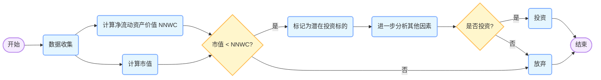

# 格雷厄姆的净净股票策略：寻找极度低估的公司

> 关键词：格雷厄姆、净净股票策略、极度低估公司、价值投资、财务分析

> 摘要：本文深入探讨了格雷厄姆的净净股票策略，旨在帮助投资者寻找市场中极度低估的公司。首先介绍了该策略提出的背景，明确目的和范围，阐述预期读者和文档结构。接着详细解析核心概念，给出原理和架构的文本示意图及 Mermaid 流程图。通过 Python 代码阐述核心算法原理和具体操作步骤，并给出相关数学模型和公式。在项目实战部分，搭建开发环境，展示源代码实现并进行详细解读。同时探讨了该策略的实际应用场景，推荐了学习资源、开发工具框架和相关论文著作。最后总结未来发展趋势与挑战，解答常见问题并提供扩展阅读和参考资料。

## 1. 背景介绍 
### 1.1 目的和范围
本部分旨在全面剖析格雷厄姆的净净股票策略，深入探究其背后的原理、操作方法以及实际应用价值。范围涵盖该策略的核心概念、算法原理、数学模型、实际案例分析，以及相关的学习资源和工具推荐等方面。通过对这些内容的研究，帮助投资者更好地理解和运用净净股票策略，在股票市场中寻找那些被极度低估的公司，从而实现投资收益的最大化。

### 1.2 预期读者
本文主要面向对价值投资感兴趣的投资者，包括个人投资者、专业投资机构的从业者等。同时，也适合金融专业的学生、研究人员以及对股票市场分析方法有深入学习需求的人士阅读。对于那些希望掌握一种有效的股票筛选策略，以发掘潜在投资机会的读者来说，本文将提供有价值的参考。

### 1.3 文档结构概述
本文将按照以下结构展开：首先介绍净净股票策略的背景信息，包括目的、预期读者和文档结构等。接着阐述核心概念，通过文本示意图和 Mermaid 流程图展示其原理和架构。然后详细讲解核心算法原理和具体操作步骤，运用 Python 代码进行说明。之后给出相关的数学模型和公式，并举例说明。在项目实战部分，介绍开发环境搭建、源代码实现和代码解读。再探讨该策略的实际应用场景，推荐学习资源、开发工具框架和相关论文著作。最后总结未来发展趋势与挑战，解答常见问题并提供扩展阅读和参考资料。

### 1.4 术语表
#### 1.4.1 核心术语定义
- **净净股票策略**：由本杰明·格雷厄姆提出的一种价值投资策略，通过计算公司的净流动资产价值（Net-Net Working Capital，NNWC），并与公司的市值进行比较，寻找市值低于净流动资产价值的公司，认为这些公司被市场极度低估，具有投资价值。
- **净流动资产价值（NNWC）**：公司的流动资产减去全部负债后的价值。计算公式为：$NNWC = 流动资产 - 全部负债$。
- **市值**：指一家上市公司的发行股份按市场价格计算出来的股票总价值，其计算方法为每股股票的市场价格乘以发行总股数。

#### 1.4.2 相关概念解释
- **价值投资**：一种投资理念，强调通过对公司基本面的分析，寻找被市场低估的股票，以低于其内在价值的价格买入，并长期持有，等待市场对其价值的重新发现，从而获得投资收益。
- **基本面分析**：通过对公司的财务报表、行业前景、管理层能力等方面进行分析，评估公司的内在价值和投资价值。

#### 1.4.3 缩略词列表
- **NNWC**：Net-Net Working Capital，净流动资产价值

## 2. 核心概念与联系 
### 核心概念原理
格雷厄姆的净净股票策略基于价值投资的理念，认为市场有时会出现定价错误，导致一些公司的股票价格低于其实际的内在价值。净净股票策略通过关注公司的净流动资产价值来评估其内在价值。净流动资产价值是公司在清算时，扣除全部负债后，能够剩余的可变现资产价值。如果一家公司的市值低于其净流动资产价值，意味着投资者可以以低于公司清算价值的价格购买该公司的股票，从理论上讲，即使公司立即清算，投资者也能获得盈利。

### 架构的文本示意图
```plaintext
净净股票策略
|-- 核心目标：寻找市值低于净流动资产价值的公司
|-- 数据收集
|   |-- 公司财务报表（资产负债表、利润表等）
|   |-- 股票市场数据（股价、总股本等）
|-- 计算净流动资产价值（NNWC）
|   |-- 提取流动资产数据
|   |-- 提取全部负债数据
|   |-- 计算 NNWC = 流动资产 - 全部负债
|-- 计算市值
|   |-- 获取股票价格
|   |-- 获取总股本
|   |-- 计算市值 = 股票价格 × 总股本
|-- 比较市值和 NNWC
|   |-- 如果市值 < NNWC，标记为潜在投资标的
|-- 投资决策
|   |-- 进一步分析潜在投资标的的其他因素（行业前景、管理层能力等）
|   |-- 决定是否投资
```

### Mermaid 流程图


## 3. 核心算法原理 & 具体操作步骤 
### 核心算法原理
净净股票策略的核心算法是计算公司的净流动资产价值（NNWC）和市值，并比较两者的大小。具体步骤如下：
1. 从公司的财务报表中提取流动资产和全部负债的数据。
2. 计算净流动资产价值：$NNWC = 流动资产 - 全部负债$。
3. 从股票市场数据中获取股票价格和总股本。
4. 计算市值：$市值 = 股票价格 × 总股本$。
5. 比较市值和 NNWC，如果市值小于 NNWC，则该公司被认为是潜在的投资标的。

### 具体操作步骤及 Python 代码实现
以下是使用 Python 实现净净股票策略的示例代码：
```python
import pandas as pd

# 模拟获取公司财务报表数据
def get_financial_data():
    # 假设这里从文件或数据库中读取数据
    # 这里简单模拟数据
    financial_data = {
        '流动资产': [1000000, 2000000, 1500000],
        '全部负债': [500000, 1200000, 800000],
        '股票价格': [10, 20, 15],
        '总股本': [50000, 80000, 60000]
    }
    df = pd.DataFrame(financial_data)
    return df

# 计算净流动资产价值（NNWC）
def calculate_nnwc(df):
    df['NNWC'] = df['流动资产'] - df['全部负债']
    return df

# 计算市值
def calculate_market_cap(df):
    df['市值'] = df['股票价格'] * df['总股本']
    return df

# 筛选潜在投资标的
def filter_potential_stocks(df):
    potential_stocks = df[df['市值'] < df['NNWC']]
    return potential_stocks

# 主函数
def main():
    # 获取财务数据
    df = get_financial_data()
    # 计算 NNWC
    df = calculate_nnwc(df)
    # 计算市值
    df = calculate_market_cap(df)
    # 筛选潜在投资标的
    potential_stocks = filter_potential_stocks(df)
    print("潜在投资标的：")
    print(potential_stocks)

if __name__ == "__main__":
    main()
```
### 代码解释
1. **get_financial_data 函数**：模拟从文件或数据库中获取公司的财务报表数据，包括流动资产、全部负债、股票价格和总股本。
2. **calculate_nnwc 函数**：根据公式 $NNWC = 流动资产 - 全部负债$ 计算净流动资产价值，并将结果添加到 DataFrame 中。
3. **calculate_market_cap 函数**：根据公式 $市值 = 股票价格 × 总股本$ 计算市值，并将结果添加到 DataFrame 中。
4. **filter_potential_stocks 函数**：筛选出市值小于 NNWC 的公司，作为潜在的投资标的。
5. **main 函数**：调用上述函数，完成数据获取、计算和筛选，并打印出潜在投资标的。

## 4. 数学模型和公式 & 详细讲解 & 举例说明 
### 数学模型和公式
- **净流动资产价值（NNWC）的计算公式**：
$$NNWC = 流动资产 - 全部负债$$
- **市值的计算公式**：
$$市值 = 股票价格 × 总股本$$

### 详细讲解
1. **净流动资产价值（NNWC）**：反映了公司在清算时，扣除全部负债后，能够剩余的可变现资产价值。流动资产包括现金、应收账款、存货等，全部负债包括短期负债和长期负债。NNWC 越高，说明公司的资产负债状况越好，潜在的清算价值越高。
2. **市值**：是市场对公司的估值，反映了投资者对公司未来盈利能力和发展前景的预期。如果市值低于 NNWC，意味着市场对公司的估值过低，可能存在投资机会。

### 举例说明
假设一家公司的财务数据如下：
- 流动资产：$2000000$ 元
- 全部负债：$1000000$ 元
- 股票价格：$10$ 元
- 总股本：$100000$ 股

首先，计算净流动资产价值：
$$NNWC = 流动资产 - 全部负债 = 2000000 - 1000000 = 1000000$$（元）

然后，计算市值：
$$市值 = 股票价格 × 总股本 = 10 × 100000 = 1000000$$（元）

在这个例子中，市值等于 NNWC。如果市值小于 NNWC，比如股票价格变为 $8$ 元，那么市值为 $8 × 100000 = 800000$ 元，小于 NNWC 的 $1000000$ 元，该公司就可能是一个潜在的投资标的。

## 5. 项目实战：代码实际案例和详细解释说明 
### 5.1  开发环境搭建
#### 操作系统
可以选择 Windows、Linux 或 macOS 操作系统。

#### Python 环境
安装 Python 3.x 版本，可以从 Python 官方网站（https://www.python.org/downloads/）下载并安装。

#### 依赖库安装
使用以下命令安装所需的 Python 库：
```sh
pip install pandas
```

### 5.2  源代码详细实现和代码解读
以下是一个更完整的项目实战代码示例，假设我们从 CSV 文件中读取公司的财务数据：
```python
import pandas as pd

# 从 CSV 文件中读取财务数据
def read_financial_data(file_path):
    df = pd.read_csv(file_path)
    return df

# 计算净流动资产价值（NNWC）
def calculate_nnwc(df):
    df['NNWC'] = df['流动资产'] - df['全部负债']
    return df

# 计算市值
def calculate_market_cap(df):
    df['市值'] = df['股票价格'] * df['总股本']
    return df

# 筛选潜在投资标的
def filter_potential_stocks(df):
    potential_stocks = df[df['市值'] < df['NNWC']]
    return potential_stocks

# 保存潜在投资标的到 CSV 文件
def save_potential_stocks(potential_stocks, output_file):
    potential_stocks.to_csv(output_file, index=False)

# 主函数
def main():
    # 输入文件路径
    input_file = 'financial_data.csv'
    # 输出文件路径
    output_file = 'potential_stocks.csv'
    # 读取财务数据
    df = read_financial_data(input_file)
    # 计算 NNWC
    df = calculate_nnwc(df)
    # 计算市值
    df = calculate_market_cap(df)
    # 筛选潜在投资标的
    potential_stocks = filter_potential_stocks(df)
    # 保存潜在投资标的到 CSV 文件
    save_potential_stocks(potential_stocks, output_file)
    print("潜在投资标的已保存到", output_file)

if __name__ == "__main__":
    main()
```
### 代码解读
1. **read_financial_data 函数**：从 CSV 文件中读取公司的财务数据，并返回一个 DataFrame 对象。
2. **calculate_nnwc 函数**：计算净流动资产价值，并将结果添加到 DataFrame 中。
3. **calculate_market_cap 函数**：计算市值，并将结果添加到 DataFrame 中。
4. **filter_potential_stocks 函数**：筛选出市值小于 NNWC 的公司，作为潜在的投资标的。
5. **save_potential_stocks 函数**：将潜在投资标的保存到 CSV 文件中。
6. **main 函数**：调用上述函数，完成数据读取、计算、筛选和保存操作。

### 5.3  代码解读与分析
- **数据读取**：使用 `pandas` 库的 `read_csv` 函数从 CSV 文件中读取数据，方便快捷。
- **计算过程**：通过简单的数学运算计算 NNWC 和市值，逻辑清晰。
- **筛选操作**：使用布尔索引筛选出市值小于 NNWC 的公司，简洁高效。
- **数据保存**：使用 `pandas` 库的 `to_csv` 函数将潜在投资标的保存到 CSV 文件中，便于后续分析和使用。

## 6. 实际应用场景 
### 价值投资组合构建
投资者可以使用净净股票策略筛选出潜在的投资标的，将这些股票纳入价值投资组合中。通过分散投资，可以降低单个股票的风险，提高投资组合的整体收益。

### 逆向投资机会挖掘
在市场低迷或行业不景气时，一些公司的股票价格可能会被过度低估。净净股票策略可以帮助投资者发现这些被市场忽视的公司，抓住逆向投资的机会。

### 小型公司投资
小型公司往往更容易被市场低估，因为它们的知名度和关注度相对较低。净净股票策略对于寻找小型公司中的潜在投资机会具有一定的优势。

### 风险控制
通过关注公司的净流动资产价值，投资者可以在一定程度上控制投资风险。即使公司的经营状况不佳，其净流动资产价值也可以作为一种保障。

## 7. 工具和资源推荐
### 7.1 学习资源推荐
#### 7.1.1 书籍推荐
- 《聪明的投资者》（The Intelligent Investor）：本杰明·格雷厄姆的经典著作，详细阐述了价值投资的理念和方法，包括净净股票策略。
- 《证券分析》（Security Analysis）：同样是格雷厄姆的重要著作，对公司的财务分析和估值方法进行了深入探讨。
- 《怎样选择成长股》（Common Stocks and Uncommon Profits）：菲利普·费雪的著作，介绍了寻找成长股的方法，与净净股票策略可以相互补充。

#### 7.1.2 在线课程
- Coursera 上的“投资学原理”（Principles of Investing）课程：由知名教授授课，涵盖了价值投资的基本原理和方法。
- edX 上的“金融市场”（Financial Markets）课程：对股票市场和投资策略进行了全面的讲解。

#### 7.1.3 技术博客和网站
- 价值投资网（ValueInvestorsClub.com）：提供了大量的价值投资案例和分析文章。
- 雪球网（xueqiu.com）：国内知名的投资交流平台，有很多关于价值投资的讨论和分享。

### 7.2 开发工具框架推荐
#### 7.2.1 IDE和编辑器
- PyCharm：功能强大的 Python 集成开发环境，提供代码编辑、调试、版本控制等功能。
- Jupyter Notebook：交互式的开发环境，适合进行数据分析和代码演示。

#### 7.2.2 调试和性能分析工具
- `pdb`：Python 自带的调试工具，可以帮助开发者定位代码中的问题。
- `cProfile`：Python 标准库中的性能分析工具，可以分析代码的运行时间和资源消耗。

#### 7.2.3 相关框架和库
- `pandas`：强大的数据分析库，提供了数据读取、处理和分析的功能。
- `numpy`：用于科学计算的基础库，提供了高效的数组操作和数学函数。

### 7.3 相关论文著作推荐
#### 7.3.1 经典论文
- Benjamin Graham and David Dodd, "Security Analysis" (1934)：奠定了价值投资理论的基础，对净净股票策略有重要的论述。
- Joel Greenblatt, "The Little Book That Beats the Market" (2005)：提出了一种简单有效的价值投资策略，与净净股票策略有一定的关联。

#### 7.3.2 最新研究成果
- 可以关注《金融研究》《经济研究》等学术期刊，以及 SSRN（Social Science Research Network）等平台上的最新研究论文，了解净净股票策略的最新发展和应用。

#### 7.3.3 应用案例分析
- 一些金融研究机构和投资公司会发布关于净净股票策略的应用案例分析报告，可以通过搜索引擎或专业数据库获取这些报告，学习实际应用中的经验和教训。

## 8. 总结：未来发展趋势与挑战
### 未来发展趋势
- **与大数据和人工智能结合**：随着大数据和人工智能技术的发展，投资者可以利用更多的数据和更先进的算法来筛选和分析潜在的净净股票。例如，通过自然语言处理技术分析公司的新闻报道和公告，获取更多的信息。
- **国际化应用**：净净股票策略可以应用于不同国家和地区的股票市场，随着全球金融市场的一体化，该策略的国际化应用前景广阔。
- **与其他投资策略融合**：净净股票策略可以与成长投资、股息投资等其他投资策略相结合，构建更加多元化的投资组合，提高投资收益。

### 挑战
- **数据质量和准确性**：净净股票策略依赖于公司的财务数据，数据的质量和准确性直接影响策略的有效性。在实际应用中，可能会遇到财务数据造假、数据更新不及时等问题。
- **市场有效性**：随着市场的发展和投资者的成熟，市场的有效性可能会提高，净净股票的数量可能会减少，寻找潜在投资标的的难度会增加。
- **行业变化和公司风险**：一些行业可能面临着快速的技术变革和市场竞争，即使公司的市值低于净流动资产价值，也可能存在经营风险。投资者需要对行业和公司进行深入的研究和分析。

## 9. 附录：常见问题与解答
### 问题 1：净净股票策略适用于所有类型的公司吗？
解答：净净股票策略更适用于资产以流动资产为主的公司，如零售、贸易等行业的公司。对于资产以固定资产为主的公司，如制造业、房地产等行业的公司，净净股票策略可能不太适用，因为固定资产的变现价值可能存在较大的不确定性。

### 问题 2：市值低于净流动资产价值的公司一定是好的投资标的吗？
解答：不一定。市值低于净流动资产价值只是一个初步的筛选指标，还需要进一步分析公司的其他因素，如行业前景、管理层能力、公司的竞争力等。有些公司可能存在潜在的问题，导致市场对其估值过低，投资者需要谨慎评估。

### 问题 3：如何获取公司的财务数据？
解答：可以通过以下途径获取公司的财务数据：
- 公司的官方网站：大多数上市公司会在其官方网站上公布定期的财务报告。
- 证券交易所网站：证券交易所会提供上市公司的财务数据和公告。
- 金融数据提供商：如 Wind、东方财富等，提供了丰富的金融数据和分析工具。

### 问题 4：净净股票策略的投资周期一般是多久？
解答：净净股票策略的投资周期没有固定的标准，取决于市场对公司价值的重新发现时间。有些公司可能在短期内就会被市场认可，股价上涨；而有些公司可能需要较长的时间才能实现价值回归。投资者需要根据自己的投资目标和风险承受能力来确定投资周期。

## 10. 扩展阅读 & 参考资料
### 扩展阅读
- 《巴菲特的投资组合》（The Warren Buffett Portfolio）：介绍了巴菲特的投资理念和方法，与格雷厄姆的价值投资理论有一定的传承关系。
- 《漫步华尔街》（A Random Walk Down Wall Street）：对股票市场的有效性和投资策略进行了深入的探讨，为投资者提供了不同的视角。

### 参考资料
- Benjamin Graham, "The Intelligent Investor" (4th Revised Edition), HarperBusiness, 2003.
- Joel Greenblatt, "The Little Book That Beats the Market", John Wiley & Sons, 2005.
- 中国证券监督管理委员会官方网站（https://www.csrc.gov.cn/）
- 上海证券交易所官方网站（https://www.sse.com.cn/）
- 深圳证券交易所官方网站（https://www.szse.cn/）

作者：AI天才研究院/AI Genius Institute & 禅与计算机程序设计艺术 /Zen And The Art of Computer Programming