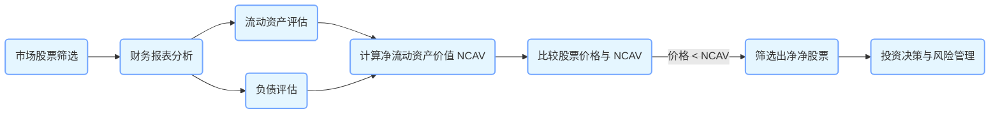

# 格雷厄姆的净净股票策略：寻找极度低估的公司

> 关键词：格雷厄姆、净净股票策略、极度低估公司、价值投资、财务分析

> 摘要：本文深入探讨了格雷厄姆的净净股票策略，旨在帮助投资者寻找市场中极度低估的公司。首先介绍了该策略的背景，包括目的、预期读者、文档结构和相关术语。接着阐述了净净股票策略的核心概念及其联系，通过文本示意图和 Mermaid 流程图进行直观展示。详细讲解了核心算法原理，并给出 Python 代码示例。对涉及的数学模型和公式进行了详细说明和举例。通过项目实战，包括开发环境搭建、源代码实现和代码解读，让读者更好地理解该策略的实际应用。分析了净净股票策略的实际应用场景，推荐了相关的学习资源、开发工具框架和论文著作。最后总结了该策略的未来发展趋势与挑战，并提供常见问题解答和扩展阅读参考资料。

## 1. 背景介绍 
### 1.1 目的和范围
本文章的主要目的是全面且深入地介绍格雷厄姆的净净股票策略。该策略由投资大师本杰明·格雷厄姆（Benjamin Graham）提出，是一种用于寻找被市场极度低估公司的投资方法。我们将详细讲解该策略的核心概念、算法原理、数学模型，通过实际的项目案例展示其应用，并探讨其在不同市场环境下的适用性和局限性。范围涵盖从理论基础到实际操作的各个方面，帮助投资者理解和运用这一策略进行股票投资决策。

### 1.2 预期读者
本文预期读者包括对价值投资感兴趣的个人投资者、金融专业学生、金融分析师以及从事股票投资研究的专业人士。无论是初涉投资领域，希望学习有效投资策略的新手，还是有一定投资经验，想要深入了解价值投资经典策略的专业人士，都能从本文中获得有价值的信息。

### 1.3 文档结构概述
本文将按照以下结构展开：首先介绍净净股票策略的背景知识，包括目的、读者群体和文档结构；接着阐述核心概念及其联系，通过示意图和流程图进行直观呈现；然后详细讲解核心算法原理，并给出 Python 代码实现；对涉及的数学模型和公式进行详细推导和举例说明；通过项目实战展示该策略的实际应用，包括环境搭建、代码实现和解读；分析该策略的实际应用场景；推荐相关的学习资源、开发工具框架和论文著作；最后总结该策略的未来发展趋势与挑战，提供常见问题解答和扩展阅读参考资料。

### 1.4 术语表
#### 1.4.1 核心术语定义
- **净净股票（Net-Net Stocks）**：指那些股票价格低于其净流动资产价值（Net Current Asset Value，NCAV）的股票。净流动资产价值是指公司的流动资产减去全部负债后的价值。
- **净流动资产价值（NCAV）**：计算公式为 $NCAV = 流动资产 - 全部负债$。它反映了公司在清算情况下，股东可能获得的最低价值。
- **价值投资（Value Investing）**：一种投资策略，强调寻找市场中被低估的资产，通过分析公司的基本面，如财务状况、盈利能力等，以低于其内在价值的价格买入股票，等待市场发现其价值并实现价格回归。

#### 1.4.2 相关概念解释
- **流动资产**：指企业可以在一年或者超过一年的一个营业周期内变现或者运用的资产，包括现金、短期投资、应收账款、存货等。
- **负债**：指企业过去的交易或者事项形成的、预期会导致经济利益流出企业的现时义务，包括短期负债和长期负债。
- **清算价值**：指公司在面临破产清算时，将其资产出售变现后，扣除所有负债后股东可能获得的价值。

#### 1.4.3 缩略词列表
- **NCAV**：Net Current Asset Value，净流动资产价值

## 2. 核心概念与联系 

### 核心概念原理
格雷厄姆的净净股票策略基于一个简单而深刻的原理：当股票价格低于公司的净流动资产价值时，意味着市场对该公司的估值过低，存在投资机会。从理论上讲，即使公司立即停止运营并进行清算，股东也有可能获得高于股票市场价格的回报。

净净股票策略的核心在于对公司财务报表的分析，特别是对流动资产和负债的评估。通过计算净流动资产价值，投资者可以确定一个公司的内在价值底线。如果股票价格低于这个底线，那么该股票就被认为是极度低估的。

### 架构的文本示意图
```plaintext
净净股票策略架构

              市场股票筛选
                    |
                    v
          财务报表分析
         /           \
        /             \
流动资产评估       负债评估
        \             /
         \           /
          计算净流动资产价值（NCAV）
                    |
                    v
       比较股票价格与 NCAV
                    |
                    v
       筛选出净净股票（价格 < NCAV）
                    |
                    v
        投资决策与风险管理
```

### Mermaid 流程图


## 3. 核心算法原理 & 具体操作步骤 

### 核心算法原理
净净股票策略的核心算法是计算公司的净流动资产价值（NCAV），并将其与股票市场价格进行比较。具体步骤如下：
1. **获取公司财务数据**：从公司的财务报表中获取流动资产和全部负债的数据。
2. **计算净流动资产价值（NCAV）**：使用公式 $NCAV = 流动资产 - 全部负债$ 计算公司的净流动资产价值。
3. **获取股票市场价格**：通过金融数据提供商或证券交易所获取该公司股票的当前市场价格。
4. **比较股票价格与 NCAV**：如果股票价格低于 NCAV，则该股票被认为是净净股票，具有投资价值。

### Python 代码实现
```python
import pandas as pd

def calculate_ncav(current_assets, total_liabilities):
    """
    计算净流动资产价值（NCAV）
    :param current_assets: 流动资产
    :param total_liabilities: 全部负债
    :return: 净流动资产价值
    """
    return current_assets - total_liabilities

def find_net_net_stocks(financial_data, stock_prices):
    """
    寻找净净股票
    :param financial_data: 包含流动资产和全部负债的财务数据 DataFrame
    :param stock_prices: 包含股票价格的 DataFrame
    :return: 净净股票列表
    """
    net_net_stocks = []
    for index, row in financial_data.iterrows():
        company = index
        current_assets = row['Current Assets']
        total_liabilities = row['Total Liabilities']
        ncav = calculate_ncav(current_assets, total_liabilities)
        stock_price = stock_prices.loc[company, 'Stock Price']
        if stock_price < ncav:
            net_net_stocks.append(company)
    return net_net_stocks

# 示例数据
financial_data = pd.DataFrame({
    'Current Assets': [1000, 2000, 1500],
    'Total Liabilities': [500, 1200, 800]
}, index=['Company A', 'Company B', 'Company C'])

stock_prices = pd.DataFrame({
    'Stock Price': [400, 1300, 600]
}, index=['Company A', 'Company B', 'Company C'])

# 寻找净净股票
net_net_stocks = find_net_net_stocks(financial_data, stock_prices)
print("净净股票列表:", net_net_stocks)
```
### 代码解释
- `calculate_ncav` 函数：接受流动资产和全部负债作为输入，返回净流动资产价值。
- `find_net_net_stocks` 函数：遍历财务数据，计算每个公司的 NCAV，并与股票价格进行比较。如果股票价格低于 NCAV，则将该公司添加到净净股票列表中。
- 示例数据部分：创建了包含三家公司的财务数据和股票价格的 DataFrame。
- 最后调用 `find_net_net_stocks` 函数，输出净净股票列表。

## 4. 数学模型和公式 & 详细讲解 & 举例说明 

### 数学模型和公式
净净股票策略的核心数学模型是计算净流动资产价值（NCAV），公式为：
$$NCAV = 流动资产 - 全部负债$$

### 详细讲解
- **流动资产**：包括现金、短期投资、应收账款、存货等。这些资产通常可以在较短时间内变现，是公司短期内可支配的资源。
- **全部负债**：包括短期负债和长期负债，如应付账款、短期借款、长期债券等。这些是公司需要在未来偿还的债务。
- **净流动资产价值（NCAV）**：反映了公司在清算情况下，扣除所有负债后，股东可能获得的最低价值。如果股票价格低于 NCAV，意味着市场对公司的估值过低，可能存在投资机会。

### 举例说明
假设公司 X 的财务报表显示，其流动资产为 2000 万元，全部负债为 1200 万元。则该公司的净流动资产价值为：
$$NCAV = 2000 - 1200 = 800 \text{（万元）}$$
如果公司 X 的股票总市值为 600 万元，即股票价格低于其净流动资产价值，那么根据净净股票策略，该股票可能被认为是极度低估的，具有投资价值。

## 5. 项目实战：代码实际案例和详细解释说明 

### 5.1  开发环境搭建
#### 安装 Python
首先需要安装 Python 环境，建议使用 Python 3.7 及以上版本。可以从 Python 官方网站（https://www.python.org/downloads/）下载适合你操作系统的安装包，并按照安装向导进行安装。

#### 安装必要的库
使用 `pip` 命令安装所需的库，主要包括 `pandas` 和 `yfinance`。`pandas` 用于数据处理和分析，`yfinance` 用于获取股票市场数据。
```sh
pip install pandas yfinance
```

### 5.2  源代码详细实现和代码解读
```python
import pandas as pd
import yfinance as yf

def get_financial_data(ticker):
    """
    获取公司的财务数据
    :param ticker: 股票代码
    :return: 包含流动资产和全部负债的 DataFrame
    """
    stock = yf.Ticker(ticker)
    balance_sheet = stock.balance_sheet
    current_assets = balance_sheet.loc['Total Current Assets'].iloc[0]
    total_liabilities = balance_sheet.loc['Total Liab'].iloc[0]
    return pd.DataFrame({
        'Current Assets': [current_assets],
        'Total Liabilities': [total_liabilities]
    })

def get_stock_price(ticker):
    """
    获取股票的当前价格
    :param ticker: 股票代码
    :return: 股票当前价格
    """
    stock = yf.Ticker(ticker)
    data = stock.history(period='1d')
    return data['Close'].iloc[0]

def check_net_net_stock(ticker):
    """
    检查股票是否为净净股票
    :param ticker: 股票代码
    :return: 是否为净净股票的布尔值
    """
    financial_data = get_financial_data(ticker)
    current_assets = financial_data['Current Assets'].iloc[0]
    total_liabilities = financial_data['Total Liabilities'].iloc[0]
    ncav = calculate_ncav(current_assets, total_liabilities)
    stock_price = get_stock_price(ticker)
    return stock_price < ncav

# 示例：检查苹果公司（AAPL）是否为净净股票
ticker = 'AAPL'
is_net_net = check_net_net_stock(ticker)
print(f"{ticker} 是否为净净股票: {is_net_net}")
```
### 代码解读
- `get_financial_data` 函数：使用 `yfinance` 库获取指定股票代码公司的资产负债表数据，提取流动资产和全部负债信息，并返回一个包含这些信息的 DataFrame。
- `get_stock_price` 函数：使用 `yfinance` 库获取指定股票代码的当前收盘价。
- `check_net_net_stock` 函数：调用 `get_financial_data` 和 `get_stock_price` 函数，计算净流动资产价值（NCAV），并将股票价格与 NCAV 进行比较，返回该股票是否为净净股票的布尔值。
- 示例部分：检查苹果公司（AAPL）是否为净净股票，并输出结果。

### 5.3  代码解读与分析
- **数据获取**：通过 `yfinance` 库可以方便地获取股票的财务数据和市场价格。但需要注意的是，`yfinance` 库的数据可能存在一定的延迟和误差，在实际应用中可以考虑使用更专业的金融数据提供商。
- **净净股票判断**：通过比较股票价格和 NCAV 来判断股票是否为净净股票。如果股票价格低于 NCAV，则认为该股票具有投资价值。但需要注意的是，净净股票策略并不是绝对的，还需要考虑公司的基本面、行业前景等因素。

## 6. 实际应用场景 
### 价值投资组合构建
投资者可以使用净净股票策略筛选出被市场极度低估的股票，将其纳入价值投资组合中。通过分散投资多只净净股票，可以降低投资风险，同时期待这些股票在市场发现其价值后实现价格上涨，从而获得超额收益。

### 逆向投资策略
净净股票通常是市场上被忽视或不被看好的公司。采用逆向投资策略的投资者可以利用这一特点，在市场对这些公司悲观时买入，等待市场情绪好转和公司基本面改善，从而实现投资回报。

### 小型股和新兴市场投资
在小型股市场和新兴市场中，由于信息不对称和市场效率较低，更容易出现被低估的净净股票。投资者可以将净净股票策略应用于这些市场，寻找潜在的投资机会。

### 并购和重组分析
净净股票的低估值可能吸引潜在的收购者。投资者可以通过分析净净股票，寻找可能成为并购目标的公司。同时，在公司进行重组或资产剥离时，净净股票策略也可以帮助投资者评估公司的内在价值。

## 7. 工具和资源推荐
### 7.1 学习资源推荐
#### 7.1.1 书籍推荐
- 《聪明的投资者》（The Intelligent Investor）：本杰明·格雷厄姆的经典著作，详细阐述了价值投资的理念和方法，包括净净股票策略。
- 《证券分析》（Security Analysis）：同样是格雷厄姆的重要著作，对股票和债券的分析方法进行了深入探讨，是价值投资者的必读之书。
- 《怎样选择成长股》（Common Stocks and Uncommon Profits）：菲利普·费雪（Philip Fisher）的著作，介绍了寻找成长股的方法，与净净股票策略结合可以构建更全面的投资组合。

#### 7.1.2 在线课程
- Coursera 上的“投资学原理”（Principles of Investment）课程：由知名大学教授授课，涵盖了投资理论、股票分析等内容，对理解净净股票策略有很大帮助。
- edX 上的“金融市场”（Financial Markets）课程：耶鲁大学教授罗伯特·席勒（Robert Shiller）主讲，深入讲解了金融市场的运作机制和投资策略。

#### 7.1.3 技术博客和网站
- Seeking Alpha：提供大量的股票分析文章和投资观点，包括对净净股票的研究和讨论。
- GuruFocus：专注于价值投资，提供公司财务数据、估值分析等工具，有助于投资者筛选净净股票。

### 7.2 开发工具框架推荐
#### 7.2.1 IDE和编辑器
- PyCharm：功能强大的 Python 集成开发环境，提供代码编辑、调试、版本控制等功能，适合开发和调试与净净股票策略相关的 Python 代码。
- Jupyter Notebook：交互式的开发环境，适合进行数据分析和可视化，方便投资者对财务数据进行探索和分析。

#### 7.2.2 调试和性能分析工具
- PDB：Python 内置的调试器，可以帮助开发者定位代码中的错误和问题。
- cProfile：Python 的性能分析工具，可以分析代码的运行时间和资源消耗，优化代码性能。

#### 7.2.3 相关框架和库
- Pandas：强大的数据处理和分析库，用于处理和分析财务数据。
- NumPy：提供高效的数值计算功能，与 Pandas 配合使用可以提高数据处理效率。
- yfinance：用于获取股票市场数据的 Python 库，方便投资者获取所需的财务数据和股票价格。

### 7.3 相关论文著作推荐
#### 7.3.1 经典论文
- “The Margin of Safety in Common Stocks”：本杰明·格雷厄姆的论文，详细阐述了价值投资中的安全边际概念，与净净股票策略密切相关。
- “Value Investing: The Use of Historical Financial Statement Information to Separate Winners from Losers”：探讨了如何利用历史财务报表信息进行价值投资，为净净股票策略提供了理论支持。

#### 7.3.2 最新研究成果
- 定期关注《金融研究》（Journal of Financial Economics）、《金融学期刊》（Journal of Finance）等金融领域的顶级期刊，了解关于价值投资和净净股票策略的最新研究成果。

#### 7.3.3 应用案例分析
- 一些金融研究机构和投资公司会发布关于净净股票策略的应用案例分析报告，投资者可以通过阅读这些报告，了解该策略在实际投资中的应用效果和经验教训。

## 8. 总结：未来发展趋势与挑战
### 未来发展趋势
- **与量化投资结合**：随着金融科技的发展，净净股票策略有望与量化投资技术相结合。通过建立更复杂的量化模型，利用大数据和机器学习算法，可以更准确地筛选出具有投资价值的净净股票，提高投资决策的效率和准确性。
- **跨市场和跨资产应用**：净净股票策略可能会从股票市场扩展到其他金融市场，如债券市场、商品市场等。同时，也可以与其他资产配置策略相结合，构建更多元化的投资组合，降低投资风险。
- **智能化投资服务**：随着人工智能和自动化技术的发展，净净股票策略可能会被应用于智能化投资服务中。投资者可以通过智能投资平台，自动筛选净净股票，实现投资组合的自动调整和优化。

### 挑战
- **市场有效性提高**：随着市场信息的传播速度加快和投资者教育水平的提高，市场有效性可能会逐渐提高。这意味着净净股票的出现频率可能会降低，寻找被低估股票的难度会增加。
- **财务数据质量问题**：净净股票策略依赖于公司的财务数据，而财务数据的质量可能存在问题。一些公司可能会通过财务造假等手段来美化财务报表，导致投资者对公司的真实价值判断失误。
- **行业竞争加剧**：随着净净股票策略的普及，越来越多的投资者可能会采用该策略进行投资。这将导致市场竞争加剧，净净股票的投资机会可能会被迅速挖掘，从而降低投资回报率。

## 9. 附录：常见问题与解答
### 净净股票策略一定能赚钱吗？
净净股票策略并不是一种保证能赚钱的投资方法。虽然股票价格低于净流动资产价值可能意味着被低估，但公司的基本面可能存在问题，如经营不善、行业前景不佳等。此外，市场因素也可能导致股票价格长期低于其内在价值。因此，投资者在使用净净股票策略时，还需要进行深入的基本面分析和风险管理。

### 如何获取准确的财务数据？
可以通过以下途径获取准确的财务数据：
- 公司官方网站：上市公司通常会在其官方网站上公布定期财务报告，投资者可以直接从这些报告中获取所需的财务数据。
- 金融数据提供商：如 Bloomberg、Wind 等专业金融数据提供商，提供准确、及时的财务数据和市场信息。
- 证券交易所网站：证券交易所会要求上市公司定期披露财务信息，投资者可以从交易所网站上查询相关数据。

### 净净股票策略适用于所有市场吗？
净净股票策略在不同市场的适用性有所不同。在市场效率较低、信息不对称程度较高的市场，如小型股市场和新兴市场，更容易出现被低估的净净股票，该策略可能更有效。而在市场效率较高的成熟市场，净净股票的出现频率可能较低，需要结合其他投资策略进行综合分析。

## 10. 扩展阅读 & 参考资料
### 扩展阅读
- 《金融炼金术》（The Alchemy of Finance）：乔治·索罗斯（George Soros）的著作，介绍了他的反身性理论和投资哲学，对理解市场波动和投资机会有很大帮助。
- 《黑天鹅》（The Black Swan）：纳西姆·尼古拉斯·塔勒布（Nassim Nicholas Taleb）的著作，探讨了极端事件对金融市场的影响，提醒投资者注意风险管理。

### 参考资料
- Graham, B., & Dodd, D. L. (1934). Security Analysis. McGraw-Hill.
- Graham, B. (1949). The Intelligent Investor. Harper & Brothers.
- Fisher, P. A. (1958). Common Stocks and Uncommon Profits. Harper & Brothers.

作者：AI天才研究院/AI Genius Institute & 禅与计算机程序设计艺术 /Zen And The Art of Computer Programming