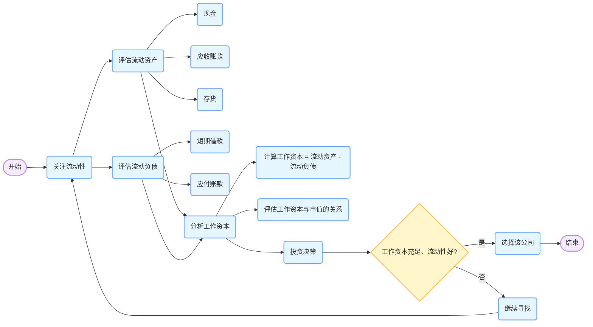

# 格雷厄姆的工作资本策略：关注流动性

> 关键词：格雷厄姆、工作资本策略、流动性、价值投资、财务分析

> 摘要：本文围绕格雷厄姆的工作资本策略展开，深入探讨关注流动性在投资中的重要意义。首先介绍了该策略的背景，包括目的、预期读者、文档结构和相关术语。接着阐述了核心概念与联系，给出原理和架构示意图及流程图。详细讲解了核心算法原理与具体操作步骤，并结合 Python 代码说明。通过数学模型和公式进一步剖析策略的理论基础。以项目实战案例展示代码实现与解读。探讨了该策略的实际应用场景，推荐了学习、开发工具和相关论文资源。最后总结了未来发展趋势与挑战，解答常见问题，并提供扩展阅读和参考资料，旨在帮助投资者深入理解并运用格雷厄姆的工作资本策略。

## 1. 背景介绍 
### 1.1 目的和范围
本文章的主要目的是深入剖析格雷厄姆的工作资本策略，重点聚焦于流动性这一核心要素。通过详细阐述该策略的原理、算法、实际应用等方面，帮助投资者更好地理解和运用这一策略进行投资决策。范围涵盖从理论基础到实际操作的各个环节，包括相关概念的解释、数学模型的推导、Python 代码的实现以及实际案例的分析。

### 1.2 预期读者
预期读者主要包括对价值投资感兴趣的投资者、金融分析师、从事金融相关工作的专业人士以及正在学习金融投资理论的学生。无论您是有一定投资经验的老手，还是刚刚踏入投资领域的新手，都能从本文中获得有价值的信息和启发。

### 1.3 文档结构概述
本文将按照以下结构进行阐述：首先介绍背景知识，包括目的、读者和术语等；接着阐述核心概念与联系，通过示意图和流程图展示策略的原理和架构；然后详细讲解核心算法原理和具体操作步骤，并给出 Python 代码示例；随后介绍数学模型和公式，结合实例进行说明；再通过项目实战展示代码的实际应用和解读；探讨该策略的实际应用场景；推荐相关的学习资源、开发工具和论文著作；最后总结未来发展趋势与挑战，解答常见问题并提供扩展阅读和参考资料。

### 1.4 术语表
#### 1.4.1 核心术语定义
- **格雷厄姆的工作资本策略**：由投资大师本杰明·格雷厄姆提出的一种投资策略，强调关注公司的工作资本情况，通过分析公司的流动资产和流动负债来评估公司的价值和投资潜力。
- **流动性**：指资产能够以合理价格迅速变现的能力。在金融领域，流动性是衡量资产质量和市场效率的重要指标。
- **工作资本**：也称为营运资本，是指企业流动资产减去流动负债后的余额，反映了企业在短期内可用于经营活动的资金。
- **价值投资**：一种投资理念，强调通过分析公司的基本面，寻找被市场低估的股票进行投资，以获取长期的投资回报。

#### 1.4.2 相关概念解释
- **流动资产**：企业在一年内或一个营业周期内能够变现或耗用的资产，包括现金、应收账款、存货等。
- **流动负债**：企业在一年内或一个营业周期内需要偿还的债务，包括短期借款、应付账款等。
- **市净率（PB）**：股票价格与每股净资产的比率，用于衡量股票的估值水平。
- **市盈率（PE）**：股票价格与每股收益的比率，反映了投资者对公司未来盈利的预期。

#### 1.4.3 缩略词列表
- **PB**：市净率（Price-to-Book Ratio）
- **PE**：市盈率（Price-to-Earnings Ratio）
- **WC**：工作资本（Working Capital）

## 2. 核心概念与联系 
### 核心概念原理
格雷厄姆的工作资本策略基于这样一个核心原理：公司的工作资本情况能够反映其短期的财务健康状况和经营能力。流动性是工作资本策略中至关重要的因素，因为具有良好流动性的公司能够更灵活地应对市场变化和突发情况，降低财务风险。

具体来说，当公司的流动资产显著高于流动负债时，意味着公司拥有较多的可变现资产，能够轻松偿还短期债务，并且有足够的资金用于日常经营和业务拓展。相反，如果公司的流动负债过高，而流动资产不足，可能会面临资金周转困难、偿债风险增大等问题。

### 架构的文本示意图
```plaintext
格雷厄姆的工作资本策略
|-- 关注流动性
|   |-- 评估流动资产
|   |   |-- 现金
|   |   |-- 应收账款
|   |   |-- 存货
|   |-- 评估流动负债
|   |   |-- 短期借款
|   |   |-- 应付账款
|-- 分析工作资本
|   |-- 计算工作资本 = 流动资产 - 流动负债
|   |-- 评估工作资本与市值的关系
|-- 投资决策
|   |-- 选择工作资本充足、流动性好的公司
|   |-- 考虑其他因素进行综合评估
```

### Mermaid 流程图


## 3. 核心算法原理 & 具体操作步骤 
### 核心算法原理
格雷厄姆的工作资本策略的核心算法在于计算公司的工作资本，并评估其与公司市值的关系。具体步骤如下：
1. 计算公司的流动资产（$CA$），包括现金、应收账款、存货等。
2. 计算公司的流动负债（$CL$），包括短期借款、应付账款等。
3. 计算工作资本（$WC$）：$WC = CA - CL$。
4. 评估工作资本与市值（$MV$）的关系，通常可以计算工作资本与市值的比率（$WC/MV$）。

### 具体操作步骤
以下是使用 Python 实现上述算法的详细代码：

```python
# 定义一个函数来计算工作资本
def calculate_working_capital(current_assets, current_liabilities):
    """
    该函数用于计算工作资本
    :param current_assets: 流动资产
    :param current_liabilities: 流动负债
    :return: 工作资本
    """
    return current_assets - current_liabilities

# 定义一个函数来计算工作资本与市值的比率
def calculate_wc_to_mv_ratio(working_capital, market_value):
    """
    该函数用于计算工作资本与市值的比率
    :param working_capital: 工作资本
    :param market_value: 市值
    :return: 工作资本与市值的比率
    """
    if market_value == 0:
        return 0
    return working_capital / market_value

# 示例数据
current_assets = 1000000  # 流动资产为 100 万
current_liabilities = 500000  # 流动负债为 50 万
market_value = 2000000  # 市值为 200 万

# 计算工作资本
working_capital = calculate_working_capital(current_assets, current_liabilities)
print(f"工作资本: {working_capital}")

# 计算工作资本与市值的比率
wc_to_mv_ratio = calculate_wc_to_mv_ratio(working_capital, market_value)
print(f"工作资本与市值的比率: {wc_to_mv_ratio}")
```

### 代码解释
- `calculate_working_capital` 函数：该函数接受流动资产和流动负债作为输入，返回工作资本。
- `calculate_wc_to_mv_ratio` 函数：该函数接受工作资本和市值作为输入，返回工作资本与市值的比率。如果市值为 0，则返回 0，以避免除零错误。
- 示例数据：定义了流动资产、流动负债和市值的示例值。
- 计算工作资本：调用 `calculate_working_capital` 函数计算工作资本，并打印结果。
- 计算工作资本与市值的比率：调用 `calculate_wc_to_mv_ratio` 函数计算工作资本与市值的比率，并打印结果。

## 4. 数学模型和公式 & 详细讲解 & 举例说明 
### 数学模型和公式
- **工作资本（$WC$）**：$WC = CA - CL$
其中，$CA$ 表示流动资产，$CL$ 表示流动负债。

- **工作资本与市值的比率（$WC/MV$）**：$WC/MV = \frac{WC}{MV}$
其中，$WC$ 表示工作资本，$MV$ 表示市值。

### 详细讲解
工作资本反映了公司在短期内可用于经营活动的资金，是衡量公司短期财务健康状况的重要指标。当工作资本为正数时，说明公司的流动资产能够覆盖流动负债，具有一定的财务稳定性；当工作资本为负数时，可能意味着公司面临资金周转困难的问题。

工作资本与市值的比率则可以帮助投资者评估公司的价值。一般来说，比率越高，说明公司的工作资本相对市值较大，可能被市场低估，具有较高的投资价值；反之，比率越低，说明公司的工作资本相对市值较小，可能被市场高估。

### 举例说明
假设公司 A 的流动资产为 2000 万元，流动负债为 1000 万元，市值为 5000 万元。则：
- 工作资本（$WC$）：$WC = CA - CL = 2000 - 1000 = 1000$（万元）
- 工作资本与市值的比率（$WC/MV$）：$WC/MV = \frac{WC}{MV} = \frac{1000}{5000} = 0.2$

这意味着公司 A 的工作资本为 1000 万元，工作资本与市值的比率为 0.2。投资者可以根据这个比率与其他公司进行比较，评估公司 A 的投资价值。

## 5. 项目实战：代码实际案例和详细解释说明 
### 5.1  开发环境搭建
为了实现格雷厄姆的工作资本策略的项目实战，我们需要搭建以下开发环境：
- **Python 环境**：建议使用 Python 3.7 及以上版本。可以从 Python 官方网站（https://www.python.org/downloads/）下载并安装。
- **开发工具**：推荐使用 PyCharm 或 Jupyter Notebook 作为开发工具。PyCharm 是一款功能强大的 Python 集成开发环境，适合开发大型项目；Jupyter Notebook 则是一个交互式的开发环境，适合进行数据分析和实验。
- **相关库**：需要安装 `pandas`、`numpy` 等库，用于数据处理和分析。可以使用以下命令进行安装：
```sh
pip install pandas numpy
```

### 5.2  源代码详细实现和代码解读
以下是一个完整的项目实战代码示例，用于计算多只股票的工作资本和工作资本与市值的比率，并筛选出符合条件的股票：

```python
import pandas as pd

# 定义一个函数来计算工作资本和工作资本与市值的比率
def calculate_wc_and_ratio(data):
    """
    该函数用于计算工作资本和工作资本与市值的比率
    :param data: 包含流动资产、流动负债和市值的数据 DataFrame
    :return: 包含工作资本和工作资本与市值的比率的 DataFrame
    """
    data['工作资本'] = data['流动资产'] - data['流动负债']
    data['工作资本与市值的比率'] = data['工作资本'] / data['市值']
    return data

# 示例数据
data = {
    '股票代码': ['AAPL', 'GOOG', 'MSFT'],
    '流动资产': [1000, 2000, 1500],
    '流动负债': [500, 1000, 800],
    '市值': [5000, 8000, 6000]
}
df = pd.DataFrame(data)

# 计算工作资本和工作资本与市值的比率
df = calculate_wc_and_ratio(df)

# 筛选出工作资本与市值的比率大于 0.1 的股票
selected_stocks = df[df['工作资本与市值的比率'] > 0.1]

# 打印筛选结果
print(selected_stocks)
```

### 代码解读与分析
- **导入库**：导入 `pandas` 库，用于数据处理和分析。
- **定义函数**：定义 `calculate_wc_and_ratio` 函数，该函数接受一个包含流动资产、流动负债和市值的数据 `DataFrame` 作为输入，计算工作资本和工作资本与市值的比率，并将结果添加到 `DataFrame` 中。
- **示例数据**：创建一个包含股票代码、流动资产、流动负债和市值的示例数据 `DataFrame`。
- **计算工作资本和比率**：调用 `calculate_wc_and_ratio` 函数，计算工作资本和工作资本与市值的比率，并更新 `DataFrame`。
- **筛选股票**：使用布尔索引筛选出工作资本与市值的比率大于 0.1 的股票。
- **打印结果**：打印筛选结果。

通过这个项目实战，我们可以看到如何使用 Python 和 `pandas` 库来实现格雷厄姆的工作资本策略，并筛选出符合条件的股票。

## 6. 实际应用场景 
格雷厄姆的工作资本策略在实际投资中有广泛的应用场景，以下是一些常见的应用场景：
- **股票筛选**：投资者可以使用该策略筛选出工作资本充足、流动性好的股票。通过计算工作资本和工作资本与市值的比率，选择比率较高的股票进行投资，可能获得较好的投资回报。
- **风险评估**：该策略可以帮助投资者评估公司的财务风险。工作资本不足、流动性差的公司可能面临偿债风险和资金周转困难的问题，投资者可以通过分析工作资本情况，避免投资这类公司。
- **行业比较**：投资者可以使用该策略对不同行业的公司进行比较。不同行业的公司由于经营特点和财务结构的不同，工作资本情况可能存在较大差异。通过比较不同行业公司的工作资本与市值的比率，投资者可以了解各行业的投资价值和风险水平。
- **投资组合管理**：在构建投资组合时，投资者可以考虑纳入一些工作资本充足、流动性好的公司，以降低投资组合的风险。同时，通过分散投资不同行业的公司，可以进一步提高投资组合的稳定性。

## 7. 工具和资源推荐
### 7.1 学习资源推荐
#### 7.1.1 书籍推荐
- 《聪明的投资者》（The Intelligent Investor）：本杰明·格雷厄姆的经典著作，详细介绍了价值投资的理念和方法，包括工作资本策略等内容。
- 《证券分析》（Security Analysis）：同样是格雷厄姆的重要著作，对证券分析的理论和实践进行了系统阐述，是价值投资者的必读之书。
- 《财务报表分析与证券定价》（Financial Statement Analysis and Security Valuation）：这本书从财务报表分析的角度出发，介绍了如何通过分析公司的财务数据来评估公司的价值，对理解格雷厄姆的工作资本策略有很大帮助。

#### 7.1.2 在线课程
- Coursera 上的“投资学原理”（Principles of Investing）课程：该课程由知名教授授课，涵盖了投资学的基本原理和方法，包括价值投资和工作资本策略等内容。
- edX 上的“财务报表分析”（Financial Statement Analysis）课程：该课程重点介绍了如何分析公司的财务报表，对于理解格雷厄姆的工作资本策略的财务分析基础非常有帮助。

#### 7.1.3 技术博客和网站
- Seeking Alpha：一个知名的金融投资博客网站，提供了大量关于股票分析、投资策略等方面的文章和研究报告，其中不乏对格雷厄姆工作资本策略的讨论和应用案例。
- ValueWalk：专注于价值投资领域的博客网站，分享了许多价值投资者的观点和经验，包括对格雷厄姆工作资本策略的深入分析。

### 7.2 开发工具框架推荐
#### 7.2.1 IDE和编辑器
- PyCharm：一款功能强大的 Python 集成开发环境，提供了代码编辑、调试、版本控制等一系列功能，适合开发大型 Python 项目。
- Jupyter Notebook：一个交互式的开发环境，支持 Python、R 等多种编程语言，适合进行数据分析和实验。

#### 7.2.2 调试和性能分析工具
- PySnooper：一个简单易用的 Python 调试工具，可以在不使用断点的情况下输出函数的执行过程和变量的值，方便调试代码。
- cProfile：Python 内置的性能分析工具，可以帮助开发者找出代码中的性能瓶颈，优化代码性能。

#### 7.2.3 相关框架和库
- pandas：一个强大的数据处理和分析库，提供了 DataFrame 等数据结构，方便进行数据清洗、转换和分析。
- numpy：一个用于科学计算的 Python 库，提供了高效的数组操作和数学函数，是许多数据分析和机器学习库的基础。

### 7.3 相关论文著作推荐
#### 7.3.1 经典论文
- “The Theory of Investment Value” by John Burr Williams：该论文提出了现金流折现模型，为价值投资提供了重要的理论基础。
- “Security Analysis” by Benjamin Graham and David Dodd：格雷厄姆和多德的经典著作，奠定了价值投资的理论框架，对工作资本策略等内容进行了详细阐述。

#### 7.3.2 最新研究成果
- 可以关注金融领域的顶级学术期刊，如《Journal of Finance》、《Review of Financial Studies》等，这些期刊上经常发表关于投资策略和财务分析的最新研究成果。

#### 7.3.3 应用案例分析
- 可以参考一些投资研究机构的报告和案例分析，了解格雷厄姆的工作资本策略在实际投资中的应用情况和效果。例如，晨星公司（Morningstar）的研究报告中经常会涉及到对公司财务状况和投资价值的分析。

## 8. 总结：未来发展趋势与挑战
### 未来发展趋势
- **数字化和智能化**：随着科技的不断发展，金融领域也在逐渐向数字化和智能化方向发展。未来，投资者可以利用大数据、人工智能等技术更高效地收集和分析公司的财务数据，应用格雷厄姆的工作资本策略进行投资决策。例如，通过机器学习算法对大量公司的工作资本数据进行分析，挖掘出潜在的投资机会。
- **跨领域融合**：工作资本策略可能会与其他投资策略和理论进行更深入的融合。例如，结合技术分析、宏观经济分析等方法，综合评估公司的投资价值。同时，也可能会与风险管理、资产配置等领域进行融合，构建更加完善的投资体系。
- **国际化应用**：随着全球经济一体化的发展，格雷厄姆的工作资本策略将在更广泛的国际市场得到应用。投资者可以利用该策略在全球范围内筛选优质的投资标的，实现资产的国际化配置。

### 挑战
- **数据质量和准确性**：准确的财务数据是应用工作资本策略的基础。然而，在实际应用中，可能会面临数据质量不高、数据不准确等问题。例如，公司可能会进行财务造假，导致财务数据失真。投资者需要通过多种渠道验证数据的真实性和可靠性。
- **市场环境变化**：市场环境是不断变化的，宏观经济形势、行业竞争格局等因素都会对公司的工作资本情况产生影响。投资者需要及时关注市场环境的变化，调整投资策略。例如，在经济衰退时期，公司的应收账款可能会增加，存货可能会积压，导致工作资本情况恶化。
- **行业差异**：不同行业的公司由于经营特点和财务结构的不同，工作资本情况存在较大差异。投资者需要深入了解不同行业的特点，合理应用工作资本策略。例如，制造业公司的存货占比较高，而服务业公司的应收账款占比较高，在分析工作资本时需要区别对待。

## 9. 附录：常见问题与解答
### 问题 1：工作资本为负数一定意味着公司有问题吗？
不一定。虽然工作资本为负数可能表示公司面临资金周转困难的问题，但在某些情况下，这也可能是公司的一种经营策略。例如，一些大型零售商可能通过与供应商协商延长付款期限，同时加快存货周转速度，从而在一定程度上减少了流动负债，导致工作资本为负数。然而，投资者仍然需要仔细分析公司的财务状况和经营模式，评估这种情况是否可持续。

### 问题 2：工作资本与市值的比率越高越好吗？
一般来说，工作资本与市值的比率越高，说明公司的工作资本相对市值较大，可能被市场低估，具有较高的投资价值。但这并不是绝对的，投资者还需要考虑其他因素，如公司的盈利能力、行业前景等。例如，一些新兴行业的公司可能由于处于快速发展阶段，需要大量的资金投入，导致工作资本相对较低，但公司的盈利能力和发展前景较好，仍然具有投资价值。

### 问题 3：如何获取公司的流动资产、流动负债和市值数据？
可以通过以下几种途径获取公司的相关数据：
- **金融数据提供商**：如 Bloomberg、Wind 等，这些数据提供商提供了丰富的金融数据，包括公司的财务报表数据和市值数据。
- **证券交易所网站**：可以在证券交易所的官方网站上查询上市公司的定期报告，从中获取公司的财务数据。
- **公司官方网站**：公司会在其官方网站上公布定期报告和财务信息，投资者可以直接访问公司网站获取相关数据。

## 10. 扩展阅读 & 参考资料
### 扩展阅读
- 《巴菲特致股东的信：股份公司教程》（The Essays of Warren Buffett: Lessons for Corporate America）：巴菲特是格雷厄姆的学生和追随者，这本书收录了巴菲特历年致股东的信，阐述了他的投资理念和方法，对理解格雷厄姆的工作资本策略有很大的启发。
- 《漫步华尔街》（A Random Walk Down Wall Street）：这本书介绍了各种投资理论和策略，包括价值投资、技术分析等，同时也对市场效率和随机漫步理论进行了探讨，有助于投资者拓宽投资视野。

### 参考资料
- Graham, Benjamin, and David Dodd. Security Analysis. McGraw-Hill, 1934.
- Graham, Benjamin. The Intelligent Investor. HarperBusiness, 1949.
- Williams, John Burr. The Theory of Investment Value. Harvard University Press, 1938.

作者：AI天才研究院/AI Genius Institute & 禅与计算机程序设计艺术 /Zen And The Art of Computer Programming