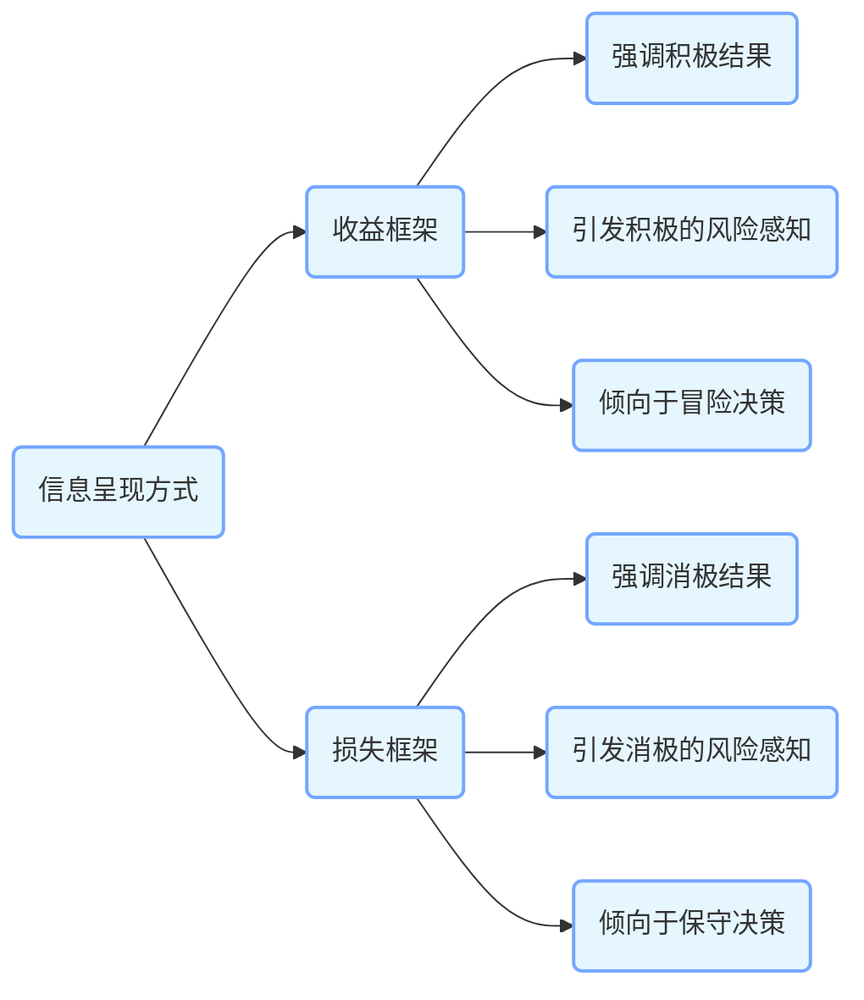

# 框架效应：信息呈现方式如何影响风险感知

> 关键词：框架效应、信息呈现方式、风险感知、决策行为、认知心理学、行为经济学、信息传播

> 摘要：本文深入探讨框架效应这一重要概念，研究信息呈现方式对人们风险感知的影响。通过对框架效应的核心概念、算法原理、数学模型的详细剖析，结合实际项目案例和应用场景，揭示框架效应在不同领域的作用机制。同时，推荐相关学习资源、开发工具和论文著作，总结框架效应的未来发展趋势与挑战，旨在帮助读者全面理解框架效应以及信息呈现方式与风险感知之间的复杂关系，为在决策、营销、政策制定等领域的应用提供理论和实践指导。

## 1. 背景介绍 
### 1.1 目的和范围
本研究的目的在于系统地探究框架效应中信息呈现方式对风险感知的影响机制。范围涵盖了从认知心理学和行为经济学的理论层面，到实际生活中各个领域（如医疗、金融、市场营销等）的具体应用。通过综合多学科的知识和研究方法，全面深入地分析这一现象，为理解人类决策行为和信息传播提供理论支持和实践参考。

### 1.2 预期读者
本文预期读者包括认知心理学、行为经济学、市场营销、公共政策等领域的研究人员和学者，希望深入了解人类决策行为背后原理的学生，以及在实际工作中需要运用信息传播和决策制定技巧的从业者，如市场营销人员、政策制定者、金融分析师等。

### 1.3 文档结构概述
本文首先介绍框架效应的背景信息，包括目的、预期读者和文档结构概述等内容。接着阐述框架效应的核心概念与联系，通过文本示意图和 Mermaid 流程图展示其原理和架构。然后详细讲解核心算法原理和具体操作步骤，并用 Python 源代码进行阐述。之后介绍相关的数学模型和公式，并举例说明。再通过项目实战案例，包括开发环境搭建、源代码实现和代码解读，深入分析框架效应在实际中的应用。随后探讨框架效应的实际应用场景。接着推荐相关的学习资源、开发工具和论文著作。最后总结框架效应的未来发展趋势与挑战，并提供常见问题解答和扩展阅读参考资料。

### 1.4 术语表
#### 1.4.1 核心术语定义
- **框架效应（Framing Effect）**：指人们对一个客观上相同问题的不同描述导致了不同的决策判断。也就是说，信息的呈现方式（框架）会影响人们对风险和收益的感知，从而影响决策行为。
- **风险感知（Risk Perception）**：个体对风险的主观认识和感受，受到多种因素的影响，包括信息呈现方式、个人经验、文化背景等。
- **信息呈现方式（Information Presentation）**：指信息传递给受众的形式和方法，如语言表述、图形展示、数据呈现等。

#### 1.4.2 相关概念解释
- **损失厌恶（Loss Aversion）**：人们面对同样数量的收益和损失时，认为损失更加令他们难以忍受。损失带来的负效用为收益正效用的2至2.5倍。在框架效应中，损失框架和收益框架的不同表述会触发人们的损失厌恶心理，从而影响风险感知和决策。
- **前景理论（Prospect Theory）**：由丹尼尔·卡尼曼（Daniel Kahneman）和阿莫斯·特沃斯基（Amos Tversky）提出，用于解释人们在不确定条件下的决策行为。该理论认为，人们在决策时不是根据最终结果的绝对价值，而是根据结果相对于某个参考点的变化来进行判断。前景理论为框架效应提供了重要的理论基础。

#### 1.4.3 缩略词列表
- **PT**：前景理论（Prospect Theory）

## 2. 核心概念与联系 

### 核心概念原理
框架效应的核心原理在于人们的决策行为受到信息呈现方式的影响。当信息以不同的框架呈现时，人们对风险和收益的感知会发生变化，从而导致不同的决策结果。例如，在医疗决策中，对于同一种治疗方案，如果信息以“存活率”（收益框架）呈现，人们可能更倾向于接受该方案；而如果以“死亡率”（损失框架）呈现，人们可能会更加谨慎或拒绝该方案。

### 架构的文本示意图
```plaintext
信息呈现方式
|
|-- 收益框架
|   |-- 强调积极结果
|   |-- 引发积极的风险感知
|   |-- 影响决策行为（倾向于冒险）
|
|-- 损失框架
|   |-- 强调消极结果
|   |-- 引发消极的风险感知
|   |-- 影响决策行为（倾向于保守）
```

### Mermaid 流程图


## 3. 核心算法原理 & 具体操作步骤 

### 算法原理讲解
虽然框架效应本身不是一个严格意义上的算法，但可以通过模拟和实验来研究其影响机制。下面是一个简单的 Python 代码示例，用于模拟不同框架下人们的决策行为。

```python
import random

# 定义决策函数
def decision_making(frame, positive_outcome_prob, negative_outcome_prob):
    """
    模拟不同框架下的决策行为
    :param frame: 框架类型，'gain' 表示收益框架，'loss' 表示损失框架
    :param positive_outcome_prob: 积极结果的概率
    :param negative_outcome_prob: 消极结果的概率
    :return: 决策结果，True 表示接受，False 表示拒绝
    """
    if frame == 'gain':
        # 在收益框架下，根据积极结果的概率进行决策
        decision_threshold = 0.6  # 决策阈值
        random_number = random.random()
        if random_number < positive_outcome_prob:
            return True
        else:
            return False
    elif frame == 'loss':
        # 在损失框架下，根据消极结果的概率进行决策
        decision_threshold = 0.4  # 决策阈值
        random_number = random.random()
        if random_number < negative_outcome_prob:
            return False
        else:
            return True
    else:
        raise ValueError("Invalid frame type. Must be 'gain' or 'loss'.")

# 模拟不同框架下的决策
positive_outcome_prob = 0.7
negative_outcome_prob = 0.3

# 收益框架下的决策
gain_decision = decision_making('gain', positive_outcome_prob, negative_outcome_prob)
print(f"收益框架下的决策结果: {'接受' if gain_decision else '拒绝'}")

# 损失框架下的决策
loss_decision = decision_making('loss', positive_outcome_prob, negative_outcome_prob)
print(f"损失框架下的决策结果: {'接受' if loss_decision else '拒绝'}")
```

### 具体操作步骤
1. **定义决策函数**：`decision_making` 函数接受框架类型、积极结果的概率和消极结果的概率作为输入，根据不同的框架类型和随机数生成的结果进行决策。
2. **设置概率参数**：定义积极结果的概率 `positive_outcome_prob` 和消极结果的概率 `negative_outcome_prob`。
3. **模拟不同框架下的决策**：分别调用 `decision_making` 函数，传入不同的框架类型（'gain' 或 'loss'），得到决策结果并打印输出。

## 4. 数学模型和公式 & 详细讲解 & 举例说明 

### 前景理论的数学模型
前景理论的价值函数 $v(x)$ 可以表示为：

$$
v(x) = 
\begin{cases}
x^{\alpha} & \text{if } x \geq 0 \\
-\lambda(-x)^{\beta} & \text{if } x < 0
\end{cases}
$$

其中：
- $x$ 表示相对于参考点的收益或损失。
- $\alpha$ 和 $\beta$ 是决定价值函数曲线形状的参数，通常 $0 < \alpha, \beta < 1$，表示价值函数在收益和损失区域都是凹函数，体现了人们对收益和损失的边际敏感度递减。
- $\lambda$ 是损失厌恶系数，$\lambda > 1$，表示损失带来的负效用大于同等收益带来的正效用。

### 详细讲解
前景理论的价值函数描述了人们对收益和损失的主观价值判断。在收益区域（$x \geq 0$），价值函数是凹函数，意味着人们对收益的边际敏感度递减，即随着收益的增加，每增加一单位收益带来的主观价值增加量逐渐减少。在损失区域（$x < 0$），价值函数也是凹函数，且由于损失厌恶系数 $\lambda > 1$，损失带来的负效用大于同等收益带来的正效用，这解释了人们为什么更倾向于避免损失。

### 举例说明
假设 $\alpha = 0.88$，$\beta = 0.88$，$\lambda = 2.25$。当 $x = 100$ 时，收益的主观价值为：

$$
v(100) = 100^{0.88} \approx 63.1
$$

当 $x = -100$ 时，损失的主观价值为：

$$
v(-100) = -2.25 \times (-(-100))^{0.88} \approx -142.0
$$

可以看出，损失 $100$ 带来的负效用（$-142.0$）远大于收益 $100$ 带来的正效用（$63.1$），体现了损失厌恶的特性。

## 5. 项目实战：代码实际案例和详细解释说明 

### 5.1  开发环境搭建
- **Python 环境**：建议使用 Python 3.7 及以上版本。可以从 Python 官方网站（https://www.python.org/downloads/）下载并安装。
- **开发工具**：推荐使用 PyCharm 或 Visual Studio Code 等集成开发环境（IDE），方便编写、调试和运行 Python 代码。

### 5.2  源代码详细实现和代码解读
下面是一个更复杂的 Python 代码示例，用于模拟在不同框架下的医疗决策过程。

```python
import random

# 定义患者类
class Patient:
    def __init__(self, risk_tolerance):
        """
        初始化患者对象
        :param risk_tolerance: 患者的风险承受能力，取值范围为 0 到 1
        """
        self.risk_tolerance = risk_tolerance

    def make_decision(self, treatment_frame, success_rate, failure_rate):
        """
        患者根据治疗方案的框架和成功率、失败率进行决策
        :param treatment_frame: 治疗方案的框架，'gain' 表示收益框架，'loss' 表示损失框架
        :param success_rate: 治疗成功的概率
        :param failure_rate: 治疗失败的概率
        :return: 决策结果，True 表示接受治疗，False 表示拒绝治疗
        """
        if treatment_frame == 'gain':
            # 在收益框架下，根据成功概率和风险承受能力进行决策
            decision_threshold = self.risk_tolerance
            random_number = random.random()
            if random_number < success_rate:
                return True
            else:
                return False
        elif treatment_frame == 'loss':
            # 在损失框架下，根据失败概率和风险承受能力进行决策
            decision_threshold = 1 - self.risk_tolerance
            random_number = random.random()
            if random_number < failure_rate:
                return False
            else:
                return True
        else:
            raise ValueError("Invalid treatment frame. Must be 'gain' or 'loss'.")

# 模拟医疗决策过程
def simulate_medical_decisions(num_patients, success_rate, failure_rate):
    """
    模拟多个患者在不同框架下的医疗决策过程
    :param num_patients: 患者数量
    :param success_rate: 治疗成功的概率
    :param failure_rate: 治疗失败的概率
    :return: 不同框架下接受治疗的患者比例
    """
    gain_accept_count = 0
    loss_accept_count = 0

    for _ in range(num_patients):
        # 随机生成患者的风险承受能力
        risk_tolerance = random.random()
        patient = Patient(risk_tolerance)

        # 收益框架下的决策
        gain_decision = patient.make_decision('gain', success_rate, failure_rate)
        if gain_decision:
            gain_accept_count += 1

        # 损失框架下的决策
        loss_decision = patient.make_decision('loss', success_rate, failure_rate)
        if loss_decision:
            loss_accept_count += 1

    gain_accept_ratio = gain_accept_count / num_patients
    loss_accept_ratio = loss_accept_count / num_patients

    return gain_accept_ratio, loss_accept_ratio

# 设置参数
num_patients = 1000
success_rate = 0.8
failure_rate = 0.2

# 模拟医疗决策
gain_ratio, loss_ratio = simulate_medical_decisions(num_patients, success_rate, failure_rate)

print(f"收益框架下接受治疗的患者比例: {gain_ratio * 100:.2f}%")
print(f"损失框架下接受治疗的患者比例: {loss_ratio * 100:.2f}%")
```

### 5.3  代码解读与分析
- **患者类（`Patient`）**：该类表示一个患者对象，包含患者的风险承受能力属性 `risk_tolerance`。`make_decision` 方法根据治疗方案的框架（收益框架或损失框架）、治疗成功的概率和失败的概率进行决策。
- **模拟医疗决策过程函数（`simulate_medical_decisions`）**：该函数模拟多个患者在不同框架下的医疗决策过程。通过随机生成患者的风险承受能力，调用 `Patient` 类的 `make_decision` 方法进行决策，并统计不同框架下接受治疗的患者数量，最后计算接受治疗的患者比例。
- **主程序**：设置患者数量、治疗成功的概率和失败的概率，调用 `simulate_medical_decisions` 函数进行模拟，并打印不同框架下接受治疗的患者比例。

通过这个代码示例可以看出，不同的信息呈现方式（框架）会影响患者的决策行为，收益框架下接受治疗的患者比例可能会高于损失框架下的比例，这与框架效应的理论相符。

## 6. 实际应用场景 
### 医疗领域
在医疗决策中，医生向患者介绍治疗方案时，信息的呈现方式会影响患者的决策。例如，对于一种癌症治疗方案，如果医生说“这种治疗方案有 80% 的存活率”（收益框架），患者可能更愿意接受治疗；而如果说“这种治疗方案有 20% 的死亡率”（损失框架），患者可能会更加犹豫或拒绝治疗。因此，医生在与患者沟通时，需要考虑信息呈现方式对患者决策的影响，选择合适的框架来传达信息。

### 金融领域
在金融投资中，投资顾问向客户推荐投资产品时，信息的呈现方式也会影响客户的决策。例如，对于一种基金产品，如果投资顾问说“该基金过去一年的收益率为 10%”（收益框架），客户可能更愿意购买；而如果说“该基金过去一年有 90% 的可能性没有达到预期收益”（损失框架），客户可能会更加谨慎。因此，投资顾问需要根据客户的风险偏好和心理特点，选择合适的框架来介绍投资产品。

### 市场营销领域
在市场营销中，商家通过不同的信息呈现方式来影响消费者的购买决策。例如，一款护肤品广告中说“使用这款护肤品，90% 的用户皮肤得到改善”（收益框架），消费者可能更愿意购买；而如果说“不使用这款护肤品，10% 的用户皮肤可能变差”（损失框架），也可能会吸引一些消费者。商家可以根据产品特点和目标受众，灵活运用不同的框架来进行宣传推广。

### 公共政策领域
在公共政策制定和宣传中，信息的呈现方式会影响公众对政策的接受程度。例如，对于一项环保政策，如果宣传说“实施这项政策，我们将有 80% 的机会改善环境质量”（收益框架），公众可能更支持；而如果说“不实施这项政策，有 20% 的可能性环境质量会恶化”（损失框架），也可能会引起公众的重视。政策制定者需要考虑如何通过合适的信息呈现方式来提高政策的支持率和实施效果。

## 7. 工具和资源推荐
### 7.1 学习资源推荐
#### 7.1.1 书籍推荐
- 《思考，快与慢》（*Thinking, Fast and Slow*）：作者丹尼尔·卡尼曼（Daniel Kahneman），这本书介绍了人类思维的两种模式——快思考和慢思考，以及它们如何影响决策行为，其中包括框架效应等重要概念。
- 《助推：如何做出有关健康、财富与幸福的最佳决策》（*Nudge: Improving Decisions About Health, Wealth, and Happiness*）：作者理查德·泰勒（Richard H. Thaler）和卡斯·桑斯坦（Cass R. Sunstein），探讨