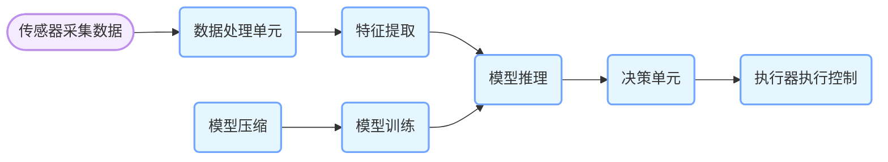

# 模型压缩技术在航天器实时控制系统推理中的前沿应用

> 关键词：模型压缩技术、航天器实时控制系统、推理应用、前沿技术、深度学习

> 摘要：本文聚焦于模型压缩技术在航天器实时控制系统推理中的前沿应用。首先介绍了相关背景，包括研究目的、预期读者等内容。接着阐述了模型压缩技术与航天器实时控制系统的核心概念及联系，给出了原理和架构的示意图与流程图。详细讲解了核心算法原理，并用 Python 代码进行了说明，同时给出了相关数学模型和公式。通过项目实战，展示了开发环境搭建、源代码实现与解读。探讨了实际应用场景，推荐了相关工具和资源。最后总结了未来发展趋势与挑战，并对常见问题进行了解答，提供了扩展阅读和参考资料，旨在为该领域的研究和应用提供全面且深入的指导。

## 1. 背景介绍 
### 1.1 目的和范围
随着航天技术的不断发展，航天器实时控制系统对处理能力和资源利用效率的要求越来越高。模型压缩技术作为一种能够有效减少模型规模、提高推理速度的方法，在航天器实时控制系统推理中具有巨大的应用潜力。本文的目的在于深入探讨模型压缩技术在航天器实时控制系统推理中的前沿应用，详细介绍相关技术原理、算法实现、实际应用案例等内容，为航天领域的科研人员和工程师提供技术参考和指导。研究范围涵盖了模型压缩技术的主要方法，如剪枝、量化、知识蒸馏等，以及这些技术在航天器实时控制系统不同场景下的应用。

### 1.2 预期读者
本文预期读者包括航天领域的科研人员、工程师、相关专业的高校师生以及对模型压缩技术和航天器实时控制系统感兴趣的技术爱好者。对于科研人员和工程师，本文可以为他们在实际项目中应用模型压缩技术提供理论支持和实践指导；对于高校师生，有助于他们深入了解该领域的前沿知识，开展相关的学术研究；对于技术爱好者，可以拓宽他们的技术视野，激发对航天和人工智能交叉领域的兴趣。

### 1.3 文档结构概述
本文共分为十个部分。第一部分为背景介绍，阐述了研究目的、预期读者和文档结构概述。第二部分介绍核心概念与联系，包括模型压缩技术和航天器实时控制系统的基本原理和架构，并给出相应的示意图和流程图。第三部分详细讲解核心算法原理和具体操作步骤，使用 Python 代码进行说明。第四部分给出数学模型和公式，并进行详细讲解和举例说明。第五部分通过项目实战，展示开发环境搭建、源代码实现和代码解读。第六部分探讨实际应用场景。第七部分推荐相关工具和资源，包括学习资源、开发工具框架和相关论文著作。第八部分总结未来发展趋势与挑战。第九部分为附录，解答常见问题。第十部分提供扩展阅读和参考资料。

### 1.4 术语表
#### 1.4.1 核心术语定义
- **模型压缩技术**：指通过各种方法减少深度学习模型的参数数量、降低计算复杂度，同时尽量保持模型性能的技术。常见的方法包括剪枝、量化、知识蒸馏等。
- **航天器实时控制系统**：用于实时监测和控制航天器运行状态的系统，要求具有高度的可靠性、实时性和准确性。
- **推理**：指在训练好的模型上对新数据进行预测或分类的过程。
- **剪枝**：一种模型压缩方法，通过去除模型中对性能影响较小的参数（如权重），减少模型的规模和计算量。
- **量化**：将模型中的浮点数参数转换为低精度的整数或定点数，从而减少模型的存储和计算需求。
- **知识蒸馏**：通过让一个较小的学生模型学习一个较大的教师模型的输出，来提高学生模型的性能，同时减少其规模。

#### 1.4.2 相关概念解释
- **深度学习模型**：基于神经网络的机器学习模型，具有强大的表达能力和学习能力，但通常需要大量的计算资源和存储空间。
- **实时性**：指系统能够在规定的时间内对输入做出响应的能力，对于航天器实时控制系统尤为重要。
- **可靠性**：指系统在规定的条件下和规定的时间内完成规定功能的能力，航天器实时控制系统需要具备极高的可靠性。

#### 1.4.3 缩略词列表
- **CNN**：卷积神经网络（Convolutional Neural Network）
- **RNN**：循环神经网络（Recurrent Neural Network）
- **DNN**：深度神经网络（Deep Neural Network）
- **GPU**：图形处理器（Graphics Processing Unit）
- **CPU**：中央处理器（Central Processing Unit）

## 2. 核心概念与联系 

### 模型压缩技术原理
模型压缩技术的核心目标是在不显著降低模型性能的前提下，减少模型的存储需求和计算复杂度。以下是几种常见的模型压缩技术原理：

#### 剪枝
剪枝的基本思想是识别并去除模型中对输出影响较小的参数。在训练好的模型中，有些参数的绝对值非常小，对模型的预测结果贡献不大。通过设定一个阈值，将绝对值小于该阈值的参数置为零，从而减少模型的参数数量。例如，在一个全连接层中，某些神经元的权重对最终输出的影响较小，将这些权重剪枝后，模型的计算量会相应减少。

#### 量化
量化是将模型中的浮点数参数转换为低精度的整数或定点数。浮点数运算在计算资源和存储方面都有较高的要求，而低精度的整数或定点数运算可以显著减少计算量和存储需求。常见的量化方法包括 8 位量化、4 位量化等。例如，将一个 32 位浮点数权重转换为 8 位整数权重，存储需求可以减少为原来的四分之一。

#### 知识蒸馏
知识蒸馏是一种通过让一个较小的学生模型学习一个较大的教师模型的输出，来提高学生模型性能的方法。教师模型通常是一个复杂、性能较好的模型，学生模型则是一个相对简单的模型。在训练过程中，学生模型不仅要学习训练数据的标签，还要学习教师模型的输出分布，从而获得更好的性能。

### 航天器实时控制系统架构
航天器实时控制系统主要由传感器、数据处理单元、决策单元和执行器组成。传感器负责采集航天器的各种状态信息，如姿态、位置、速度等；数据处理单元对传感器采集到的数据进行预处理和特征提取；决策单元根据处理后的数据和预设的控制策略做出决策；执行器根据决策结果对航天器进行控制。

### 模型压缩技术与航天器实时控制系统的联系
在航天器实时控制系统中，深度学习模型可以用于状态预测、故障诊断等任务。然而，传统的深度学习模型通常具有较大的规模和较高的计算复杂度，难以满足航天器实时控制系统对计算资源和实时性的要求。模型压缩技术可以有效减少模型的规模和计算量，提高模型的推理速度，从而使深度学习模型能够更好地应用于航天器实时控制系统。例如，通过剪枝和量化技术，可以将一个复杂的卷积神经网络模型压缩到适合航天器计算资源的规模，同时保持较高的预测精度。

### 文本示意图
```plaintext
+---------------------+
|  航天器实时控制系统  |
| +-----------------+ |
| |     传感器      | |
| +-----------------+ |
| +-----------------+ |
| |  数据处理单元   | |
| | +-------------+ | |
| | | 特征提取    | | |
| | +-------------+ | |
| | +-------------+ | |
| | | 模型推理    | | |
| | | (压缩模型)  | | |
| | +-------------+ | |
| +-----------------+ |
| +-----------------+ |
| |   决策单元    | |
| +-----------------+ |
| +-----------------+ |
| |    执行器     | |
| +-----------------+ |
+---------------------+
```

### Mermaid 流程图


## 3. 核心算法原理 & 具体操作步骤 

### 剪枝算法原理及 Python 实现
#### 原理
剪枝算法的核心是评估模型中每个参数的重要性，然后去除重要性较低的参数。常用的评估方法是基于参数的绝对值大小，即绝对值较小的参数对模型输出的影响较小，可以被剪枝。

#### Python 代码实现
```python
import torch
import torch.nn as nn

# 定义一个简单的全连接神经网络
class SimpleNet(nn.Module):
    def __init__(self):
        super(SimpleNet, self).__init__()
        self.fc1 = nn.Linear(10, 20)
        self.fc2 = nn.Linear(20, 1)

    def forward(self, x):
        x = torch.relu(self.fc1(x))
        x = self.fc2(x)
        return x

# 初始化模型
model = SimpleNet()

# 剪枝函数
def prune_model(model, threshold):
    for name, param in model.named_parameters():
        if 'weight' in name:
            mask = torch.abs(param.data) > threshold
            param.data *= mask.float()
    return model

# 设定剪枝阈值
threshold = 0.01

# 进行剪枝
pruned_model = prune_model(model, threshold)
```

### 量化算法原理及 Python 实现
#### 原理
量化算法将浮点数参数转换为低精度的整数或定点数。常见的量化方法是线性量化，即将浮点数映射到一个有限的整数范围内。

#### Python 代码实现
```python
import torch
import torch.nn as nn

# 定义量化函数
def quantize_tensor(tensor, bits=8):
    min_val = torch.min(tensor)
    max_val = torch.max(tensor)
    scale = (max_val - min_val) / (2**bits - 1)
    zero_point = torch.round(-min_val / scale)
    quantized_tensor = torch.round(tensor / scale) + zero_point
    return quantized_tensor, scale, zero_point

# 初始化一个张量
tensor = torch.randn(10)

# 进行量化
quantized_tensor, scale, zero_point = quantize_tensor(tensor)
```

### 知识蒸馏算法原理及 Python 实现
#### 原理
知识蒸馏的核心是让学生模型学习教师模型的输出分布。在训练过程中，同时使用训练数据的真实标签和教师模型的输出作为监督信息，让学生模型尽可能接近教师模型的输出。

#### Python 代码实现
```python
import torch
import torch.nn as nn
import torch.optim as optim

# 定义教师模型
class TeacherNet(nn.Module):
    def __init__(self):
        super(TeacherNet, self).__init__()
        self.fc1 = nn.Linear(10, 20)
        self.fc2 = nn.Linear(20, 1)

    def forward(self, x):
        x = torch.relu(self.fc1(x))
        x = self.fc2(x)
        return x

# 定义学生模型
class StudentNet(nn.Module):
    def __init__(self):
        super(StudentNet, self).__init__()
        self.fc1 = nn.Linear(10, 10)
        self.fc2 = nn.Linear(10, 1)

    def forward(self, x):
        x = torch.relu(self.fc1(x))
        x = self.fc2(x)
        return x

# 初始化教师模型和学生模型
teacher_model = TeacherNet()
student_model = StudentNet()

# 定义损失函数和优化器
criterion = nn.MSELoss()
optimizer = optim.Adam(student_model.parameters(), lr=0.001)

# 模拟训练数据
inputs = torch.randn(100, 10)
targets = torch.randn(100, 1)

# 知识蒸馏训练
for epoch in range(100):
    optimizer.zero_grad()
    teacher_outputs = teacher_model(inputs)
    student_outputs = student_model(inputs)
    loss = criterion(student_outputs, teacher_outputs)
    loss.backward()
    optimizer.step()
```

## 4. 数学模型和公式 & 详细讲解 & 举例说明 

### 剪枝数学模型
#### 公式
假设模型的权重矩阵为 $W \in \mathbb{R}^{m \times n}$，剪枝阈值为 $\tau$。剪枝后的权重矩阵 $\tilde{W}$ 可以表示为：
$$
\tilde{W}_{ij} = 
\begin{cases}
W_{ij}, & \text{if } |W_{ij}| > \tau \\
0, & \text{otherwise}
\end{cases}
$$

#### 详细讲解
该公式的含义是，对于权重矩阵 $W$ 中的每个元素 $W_{ij}$，如果其绝对值大于阈值 $\tau$，则保留该元素；否则，将其置为零。通过这种方式，可以去除对模型输出影响较小的参数。

#### 举例说明
假设权重矩阵 $W = \begin{bmatrix} 0.1 & 0.01 \\ 0.2 & 0.001 \end{bmatrix}$，剪枝阈值 $\tau = 0.05$。则剪枝后的权重矩阵 $\tilde{W} = \begin{bmatrix} 0.1 & 0 \\ 0.2 & 0 \end{bmatrix}$。

### 量化数学模型
#### 公式
线性量化的公式如下：
$$
\hat{x} = \text{round}\left(\frac{x - x_{\min}}{S}\right) + Z
$$
其中，$x$ 是原始浮点数，$\hat{x}$ 是量化后的整数，$x_{\min}$ 是 $x$ 的最小值，$S$ 是量化尺度，$Z$ 是零点。量化尺度 $S$ 和零点 $Z$ 的计算公式为：
$$
S = \frac{x_{\max} - x_{\min}}{2^b - 1}
$$
$$
Z = \text{round}\left(-\frac{x_{\min}}{S}\right)
$$
其中，$x_{\max}$ 是 $x$ 的最大值，$b$ 是量化位数。

#### 详细讲解
线性量化的基本思想是将浮点数 $x$ 映射到一个有限的整数范围内。首先，计算量化尺度 $S$ 和零点 $Z$，然后将 $x$ 减去最小值 $x_{\min}$ 并除以尺度 $S$，再四舍五入得到量化后的整数 $\hat{x}$。

#### 举例说明
假设 $x = [0.1, 0.2, 0.3]$，$x_{\min} = 0.1$，$x_{\max} = 0.3$，量化位数 $b = 8$。则量化尺度 $S = \frac{0.3 - 0.1}{2^8 - 1} \approx 0.00078$，零点 $Z = \text{round}\left(-\frac{0.1}{0.00078}\right) \approx -128$。对于 $x_1 = 0.1$，量化后的整数 $\hat{x}_1 = \text{round}\left(\frac{0.1 - 0.1}{0.00078}\right) - 128 = -128$；对于 $x_2 = 0.2$，$\hat{x}_2 = \text{round}\left(\frac{0.2 - 0.1}{0.00078}\right) - 128 \approx -101$；对于 $x_3 = 0.3$，$\hat{x}_3 = \text{round}\left(\frac{0.3 - 0.1}{0.00078}\right) - 128 \approx -74$。

### 知识蒸馏数学模型
#### 公式
知识蒸馏的损失函数通常由两部分组成：一部分是学生模型输出与教师模型输出之间的损失，另一部分是学生模型输出与真实标签之间的损失。常见的损失函数可以表示为：
$$
L = \alpha L_{KD} + (1 - \alpha) L_{CE}
$$
其中，$L_{KD}$ 是知识蒸馏损失，通常使用均方误差（MSE）或交叉熵损失；$L_{CE}$ 是真实标签的交叉熵损失；$\alpha$ 是一个超参数，用于平衡两部分损失的权重。

#### 详细讲解
知识蒸馏的目标是让学生模型既学习教师模型的输出分布，又学习真实标签。通过调整超参数 $\alpha$，可以控制学生模型对教师模型输出和真实标签的关注程度。当 $\alpha$ 较大时，学生模型更注重学习教师模型的输出；当 $\alpha$ 较小时，学生模型更注重学习真实标签。

#### 举例说明
假设教师模型的输出为 $y_t$，学生模型的输出为 $y_s$，真实标签为 $y$。知识蒸馏损失 $L_{KD} = \text{MSE}(y_s, y_t)$，真实标签的交叉熵损失 $L_{CE} = \text{CE}(y_s, y)$。如果 $\alpha = 0.8$，则总损失 $L = 0.8 \times \text{MSE}(y_s, y_t) + 0.2 \times \text{CE}(y_s, y)$。

## 5. 项目实战：代码实际案例和详细解释说明 

### 5.1  开发环境搭建
#### 操作系统
建议使用 Linux 系统，如 Ubuntu 18.04 或更高版本。Linux 系统具有良好的稳定性和开源生态，适合进行深度学习开发。

#### 编程语言和框架
- **Python**：选择 Python 3.7 或更高版本，Python 是深度学习领域最常用的编程语言，具有丰富的库和工具。
- **PyTorch**：选择 PyTorch 1.7 或更高版本，PyTorch 是一个开源的深度学习框架，提供了丰富的神经网络层和优化算法，方便进行模型开发和训练。

#### 安装步骤
1. 安装 Python：可以从 Python 官方网站下载并安装 Python 3.7 或更高版本。
2. 安装 PyTorch：根据自己的系统和 CUDA 版本，从 PyTorch 官方网站选择合适的安装命令进行安装。例如，对于没有 CUDA 支持的系统，可以使用以下命令安装：
```bash
pip install torch torchvision
```

### 5.2  源代码详细实现和代码解读
#### 项目概述
本项目将实现一个简单的航天器状态预测模型，并使用模型压缩技术对其进行压缩。具体步骤包括：数据准备、模型定义、模型训练、模型压缩和模型推理。

#### 数据准备
假设我们有一个包含航天器状态数据的 CSV 文件，文件中包含多个特征和一个目标变量（如航天器的下一时刻姿态）。我们可以使用 Pandas 库来读取和处理数据。
```python
import pandas as pd
import torch
from torch.utils.data import Dataset, DataLoader

# 定义数据集类
class SpacecraftDataset(Dataset):
    def __init__(self, data_file):
        df = pd.read_csv(data_file)
        self.features = df.drop('target', axis=1).values
        self.targets = df['target'].values

    def __len__(self):
        return len(self.features)

    def __getitem__(self, idx):
        features = torch.tensor(self.features[idx], dtype=torch.float32)
        targets = torch.tensor(self.targets[idx], dtype=torch.float32)
        return features, targets

# 加载数据集
train_dataset = SpacecraftDataset('train_data.csv')
train_dataloader = DataLoader(train_dataset, batch_size=32, shuffle=True)
```

#### 模型定义
定义一个简单的全连接神经网络作为航天器状态预测模型。
```python
import torch.nn as nn

class SpacecraftModel(nn.Module):
    def __init__(self):
        super(SpacecraftModel, self).__init__()
        self.fc1 = nn.Linear(10, 20)
        self.fc2 = nn.Linear(20, 1)

    def forward(self, x):
        x = torch.relu(self.fc1(x))
        x = self.fc2(x)
        return x

# 初始化模型
model = SpacecraftModel()
```

#### 模型训练
使用均方误差损失函数和 Adam 优化器对模型进行训练。
```python
import torch.optim as optim

# 定义损失函数和优化器
criterion = nn.MSELoss()
optimizer = optim.Adam(model.parameters(), lr=0.001)

# 训练模型
for epoch in range(100):
    running_loss = 0.0
    for i, (inputs, targets) in enumerate(train_dataloader):
        optimizer.zero_grad()
        outputs = model(inputs)
        loss = criterion(outputs, targets)
        loss.backward()
        optimizer.step()
        running_loss += loss.item()
    print(f'Epoch {epoch + 1}, Loss: {running_loss / len(train_dataloader)}')
```

#### 模型压缩
使用剪枝和量化技术对训练好的模型进行压缩。
```python
# 剪枝
def prune_model(model, threshold):
    for name, param in model.named_parameters():
        if 'weight' in name:
            mask = torch.abs(param.data) > threshold
            param.data *= mask.float()
    return model

# 设定剪枝阈值
threshold = 0.01

# 进行剪枝
pruned_model = prune_model(model, threshold)

# 量化
def quantize_tensor(tensor, bits=8):
    min_val = torch.min(tensor)
    max_val = torch.max(tensor)
    scale = (max_val - min_val) / (2**bits - 1)
    zero_point = torch.round(-min_val / scale)
    quantized_tensor = torch.round(tensor / scale) + zero_point
    return quantized_tensor, scale, zero_point

# 对模型参数进行量化
for name, param in pruned_model.named_parameters():
    quantized_param, scale, zero_point = quantize_tensor(param.data)
    param.data = quantized_param
```

#### 模型推理
使用压缩后的模型进行推理。
```python
# 加载测试数据
test_dataset = SpacecraftDataset('test_data.csv')
test_dataloader = DataLoader(test_dataset, batch_size=32, shuffle=False)

# 模型推理
pruned_model.eval()
with torch.no_grad():
    for inputs, targets in test_dataloader:
        outputs = pruned_model(inputs)
        print(f'Predicted: {outputs}, Actual: {targets}')
```

### 5.3  代码解读与分析
#### 数据准备部分
- `SpacecraftDataset` 类继承自 `torch.utils.data.Dataset`，用于加载和处理航天器状态数据。通过 `__len__` 和 `__getitem__` 方法，我们可以方便地获取数据集的长度和每个样本。
- `DataLoader` 类用于将数据集划分为多个批次，方便进行批量训练。

#### 模型定义部分
- `SpacecraftModel` 类继承自 `torch.nn.Module`，定义了一个简单的全连接神经网络。通过 `forward` 方法，我们可以定义模型的前向传播过程。

#### 模型训练部分
- `nn.MSELoss` 是均方误差损失函数，用于衡量模型输出与真实标签之间的差异。
- `optim.Adam` 是 Adam 优化器，用于更新模型的参数。
- 在训练过程中，我们通过迭代数据集的每个批次，计算损失并进行反向传播和参数更新。

#### 模型压缩部分
- `prune_model` 函数用于对模型进行剪枝，通过设定阈值去除绝对值较小的参数。
- `quantize_tensor` 函数用于对模型参数进行量化，将浮点数参数转换为低精度的整数。

#### 模型推理部分
- 通过 `eval()` 方法将模型设置为评估模式，关闭梯度计算。
- 使用 `torch.no_grad()` 上下文管理器，避免在推理过程中计算梯度，提高推理速度。

## 6. 实际应用场景 
### 航天器姿态控制
在航天器姿态控制中，需要实时准确地预测航天器的姿态变化。深度学习模型可以根据传感器采集到的姿态数据进行训练，预测下一时刻的姿态。然而，传统的深度学习模型计算复杂度高，难以满足实时性要求。模型压缩技术可以将模型压缩到适合航天器计算资源的规模，同时保持较高的预测精度，从而实现实时姿态控制。

### 故障诊断
航天器在运行过程中可能会出现各种故障，及时准确地诊断故障对于保障航天器的安全运行至关重要。深度学习模型可以通过学习大量的故障数据，实现对航天器故障的诊断。模型压缩技术可以减少模型的存储需求和计算量，使故障诊断系统能够在航天器有限的计算资源下实时运行。

### 轨道预测
轨道预测是航天器任务规划的重要环节，需要根据航天器的当前位置、速度等信息预测其未来的轨道。深度学习模型可以通过学习历史轨道数据，提高轨道预测的精度。模型压缩技术可以提高模型的推理速度，使轨道预测能够在短时间内完成，为航天器的任务规划提供及时的支持。

## 7. 工具和资源推荐
### 7.1 学习资源推荐
#### 7.1.1 书籍推荐
- 《深度学习》（Deep Learning）：由 Ian Goodfellow、Yoshua Bengio 和 Aaron Courville 合著，是深度学习领域的经典教材，涵盖了深度学习的基本原理、算法和应用。
- 《动手学深度学习》（Dive into Deep Learning）：由 Aston Zhang、Zachary C. Lipton、Mu Li 和 Alexander J. Smola 合著，提供了丰富的代码示例和实践指导，适合初学者快速上手深度学习。
- 《神经网络与深度学习》（Neural Networks and Deep Learning）：由 Michael Nielsen 撰写，以通俗易懂的方式介绍了神经网络和深度学习的基本概念和算法。

#### 7.1.2 在线课程
- Coursera 上的《深度学习专项课程》（Deep Learning Specialization）：由 Andrew Ng 教授授课，包括五门课程，全面介绍了深度学习的各个方面。
- edX 上的《使用 PyTorch 进行深度学习》（Introduction to Deep Learning with PyTorch）：介绍了如何使用 PyTorch 进行深度学习模型的开发和训练。
- 哔哩哔哩上的《李沐深度学习》：由李沐老师讲解，以生动有趣的方式介绍了深度学习的原理和实践。

#### 7.1.3 技术博客和网站
- Medium 上的 Towards Data Science：是一个专注于数据科学和机器学习的技术博客，提供了大量的高质量文章和教程。
- GitHub：是一个开源代码托管平台，上面有许多优秀的深度学习项目和代码示例，可以学习和参考。
- arXiv：是一个预印本服务器，提供了最新的学术研究成果，可以了解模型压缩技术和航天器实时控制系统的前沿研究动态。

### 7.2 开发工具框架推荐
#### 7.2.1 IDE和编辑器
- PyCharm：是一个专门为 Python 开发设计的集成开发环境（IDE），提供了丰富的代码编辑、调试和项目管理功能。
- Jupyter Notebook：是一个交互式的笔记本环境，适合进行数据探索、模型开发和实验验证。
- Visual Studio Code：是一个轻量级的代码编辑器，支持多种编程语言和插件，具有良好的扩展性。

#### 7.2.2 调试和性能分析工具
- PyTorch Profiler：是 PyTorch 提供的性能分析工具，可以帮助用户分析模型的计算时间、内存使用等情况，优化模型性能。
- TensorBoard：是 TensorFlow 提供的可视化工具，也可以与 PyTorch 集成，用于可视化模型的训练过程和性能指标。
- NVIDIA Nsight Systems：是 NVIDIA 提供的性能分析工具，适用于 GPU 加速的深度学习应用，能够帮助用户深入分析 GPU 的使用情况。

#### 7.2.3 相关框架和库
- TorchPruner：是一个用于 PyTorch 模型剪枝的开源库，提供了多种剪枝算法和工具，方便用户进行模型剪枝。
- PyTorch Quantization：是 PyTorch 官方提供的量化工具，支持多种量化方法和量化策略，能够帮助用户实现模型量化。
- Distiller：是一个用于深度学习模型压缩的开源框架，支持剪枝、量化、知识蒸馏等多种压缩技术。

### 7.3 相关论文著作推荐
#### 7.3.1 经典论文
- “Learning both Weights and Connections for Efficient Neural Networks”：提出了一种基于剪枝的模型压缩方法，通过去除不重要的连接和权重，减少模型的规模和计算量。
- “Deep Compression: Compressing Deep Neural Networks with Pruning, Trained Quantization and Huffman Coding”：介绍了一种综合的模型压缩方法，包括剪枝、量化和霍夫曼编码，能够显著减少模型的存储需求。
- “Distilling the Knowledge in a Neural Network”：首次提出了知识蒸馏的概念，通过让学生模型学习教师模型的输出，提高学生模型的性能。

#### 7.3.2 最新研究成果
- 在 arXiv 上搜索“Model compression for spacecraft control”、“Deep learning in spacecraft real-time control”等关键词，可以找到关于模型压缩技术在航天器实时控制系统中应用的最新研究成果。

#### 7.3.3 应用案例分析
- 一些航天领域的学术期刊和会议，如《IEEE Transactions on Aerospace and Electronic Systems》、AIAA Aerospace Sciences Meeting 等，会发表一些关于航天器实时控制系统应用模型压缩技术的案例分析论文，可以从中了解实际应用中的经验和挑战。

## 8. 总结：未来发展趋势与挑战
### 未来发展趋势
#### 更高效的压缩算法
随着深度学习模型的不断发展和复杂化，需要更高效的模型压缩算法来进一步减少模型的规模和计算量。未来的研究可能会探索新的压缩方法，如基于稀疏表示的压缩、自适应压缩等，以提高压缩效率和模型性能。

#### 与硬件的深度融合
模型压缩技术将与航天器的硬件设计深度融合，以实现更高效的计算和存储。例如，开发专门的硬件加速器来支持压缩后的模型推理，提高推理速度和能源效率。

#### 多模态数据融合
航天器实时控制系统通常需要处理多种类型的数据，如图像、传感器数据等。未来的研究可能会关注多模态数据融合的模型压缩技术，以提高系统的综合性能。

### 挑战
#### 压缩后模型性能损失
模型压缩过程中可能会导致模型性能的损失，特别是在压缩率较高的情况下。如何在保证模型性能的前提下，实现更高的压缩率是一个挑战。

#### 实时性和可靠性要求
航天器实时控制系统对实时性和可靠性有极高的要求。模型压缩技术需要在满足这些要求的前提下，实现有效的压缩和推理。例如，在压缩模型的同时，需要确保模型能够在规定的时间内完成推理，并且具有较高的可靠性。

#### 数据安全和隐私
航天器的数据通常包含敏感信息，如航天器的位置、姿态等。在使用模型压缩技术时，需要考虑数据安全和隐私问题，防止数据泄露和恶意攻击。

## 9. 附录：常见问题与解答
### 模型压缩技术会影响模型的精度吗？
模型压缩技术在一定程度上可能会影响模型的精度，但通过合理选择压缩方法和参数，可以将精度损失控制在可接受的范围内。例如，在剪枝过程中，选择合适的剪枝阈值可以在减少模型参数的同时，保持较高的精度。

### 如何选择合适的模型压缩方法？
选择合适的模型压缩方法需要考虑多个因素，如模型的类型、应用场景、计算资源等。如果模型的参数冗余较大，可以选择剪枝方法；如果对计算资源要求较高，可以选择量化方法；如果需要提高小模型的性能，可以选择知识蒸馏方法。

### 模型压缩后的推理速度一定会提高吗？
一般情况下，模型压缩后的推理速度会提高，因为减少了模型的参数数量和计算复杂度。但在某些情况下，如压缩后的模型需要进行额外的解压缩操作，推理速度可能不会显著提高。因此，在进行模型压缩时，需要综合考虑压缩率和推理速度的平衡。

### 模型压缩技术在航天器实时控制系统中的应用有哪些限制？
模型压缩技术在航天器实时控制系统中的应用可能受到以下限制：一是压缩后模型的性能可能无法满足某些高精度任务的要求；二是航天器的计算资源和存储容量仍然有限，需要在压缩率和性能之间进行权衡；三是航天器的工作环境复杂，可能会对压缩模型的稳定性和可靠性产生影响。

## 10. 扩展阅读 & 参考资料
### 扩展阅读
- 《人工智能：现代方法》（Artificial Intelligence: A Modern Approach）：全面介绍了人工智能的各个领域，包括机器学习、深度学习等，对于深入理解模型压缩技术的背景和原理有很大帮助。
- 《航天器动力学与控制》（Spacecraft Dynamics and Control）：详细介绍了航天器的动力学原理和控制方法，有助于了解航天器实时控制系统的需求和挑战。

### 参考资料
- Goodfellow, I., Bengio, Y., & Courville, A. (2016). Deep Learning. MIT Press.
- Zhang, A., Lipton, Z. C., Li, M., & Smola, A. J. (2020). Dive into Deep Learning.
- Nielsen, M. A. (2015). Neural Networks and Deep Learning. Determination Press.
- Han, S., Pool, J., Tran, J., & Dally, W. (2015). Learning both Weights and Connections for Efficient Neural Networks. Advances in Neural Information Processing Systems.
- Han, S., Mao, H., & Dally, W. J. (2015). Deep Compression: Compressing Deep Neural Networks with Pruning, Trained Quantization and Huffman Coding. arXiv preprint arXiv:1510.00149.
- Hinton, G., Vinyals, O., & Dean, J. (2015). Distilling the Knowledge in a Neural Network. arXiv preprint arXiv:1503.02531.

作者：AI天才研究院/AI Genius Institute & 禅与计算机程序设计艺术 /Zen And The Art of Computer Programming