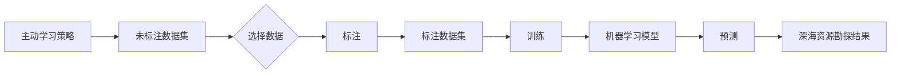

# 模型训练中的主动学习策略在深海资源勘探中的优化应用

> 关键词：模型训练、主动学习策略、深海资源勘探、优化应用、数据标注

> 摘要：本文聚焦于模型训练中的主动学习策略在深海资源勘探中的优化应用。首先介绍了研究的背景、目的、预期读者等信息，明确了文章的范围和结构。接着阐述了主动学习和深海资源勘探的核心概念及联系，给出了原理和架构的示意图与流程图。详细讲解了核心算法原理，并使用Python代码进行了说明。同时，给出了相关的数学模型和公式，并举例说明。通过项目实战，展示了在深海资源勘探中如何应用主动学习策略，包括开发环境搭建、源代码实现与解读。分析了主动学习策略在深海资源勘探中的实际应用场景，推荐了相关的学习资源、开发工具框架和论文著作。最后总结了未来的发展趋势与挑战，提供了常见问题的解答和扩展阅读参考资料，旨在为相关领域的研究和实践提供全面而深入的指导。

## 1. 背景介绍 
### 1.1 目的和范围
深海蕴含着丰富的矿产资源、生物资源等，深海资源勘探对于满足人类对资源的需求、推动科学研究等具有重要意义。然而，深海环境复杂，勘探数据获取成本高、标注困难。传统的模型训练方法在处理深海勘探数据时效率较低，需要大量的标注数据。主动学习策略可以通过选择性地标注最有价值的数据，减少标注工作量，提高模型训练效率。本文的目的是探讨如何将主动学习策略优化应用于深海资源勘探的模型训练中，提高勘探的准确性和效率。范围涵盖主动学习策略的原理、算法实现，以及在深海资源勘探不同场景下的应用。

### 1.2 预期读者
本文预期读者包括从事深海资源勘探研究的科研人员、数据科学家、机器学习工程师，以及对深海勘探和人工智能交叉领域感兴趣的学生和专业人士。这些读者希望了解如何利用主动学习策略改进深海资源勘探的模型训练，提升勘探效果。

### 1.3 文档结构概述
本文首先介绍背景信息，让读者了解研究的动机和范围。接着阐述主动学习和深海资源勘探的核心概念及联系，为后续内容奠定基础。详细讲解核心算法原理和具体操作步骤，并用Python代码实现。给出相关的数学模型和公式，帮助读者深入理解算法。通过项目实战，展示主动学习策略在深海资源勘探中的具体应用过程。分析实际应用场景，说明其在不同情况下的作用。推荐相关的学习资源、开发工具框架和论文著作，方便读者进一步学习和研究。最后总结未来发展趋势与挑战，解答常见问题，并提供扩展阅读参考资料。

### 1.4 术语表
#### 1.4.1 核心术语定义
- **主动学习策略**：一种机器学习策略，通过主动选择最有价值的数据进行标注，以提高模型性能，减少标注工作量。
- **深海资源勘探**：对深海区域的矿产资源、生物资源等进行探测和评估的过程。
- **模型训练**：使用数据对机器学习模型进行参数调整，使其能够对未知数据进行准确预测的过程。
- **数据标注**：为数据集中的样本添加标签，以便模型学习和训练。

#### 1.4.2 相关概念解释
- **不确定性采样**：主动学习中常用的一种采样方法，选择模型预测不确定性最大的数据进行标注。
- **查询合成**：主动学习中通过合成新的数据样本并查询其标签来扩充训练数据的方法。
- **深海多波束数据**：利用多波束回声测深系统获取的深海海底地形数据。

#### 1.4.3 缩略词列表
- **ML**：Machine Learning，机器学习
- **AL**：Active Learning，主动学习
- **CNN**：Convolutional Neural Network，卷积神经网络

## 2. 核心概念与联系 
### 核心概念原理
#### 主动学习策略
主动学习是一种特殊的机器学习范式，与传统的监督学习不同，它不是被动地接受所有标注数据进行训练，而是主动地选择最有价值的数据进行标注。其核心思想是通过有限的标注数据获得更好的模型性能。主动学习通常基于不确定性采样、查询合成等方法来选择数据。例如，在不确定性采样中，模型会对未标注数据进行预测，选择预测结果不确定性最大的数据让标注者进行标注。这样可以让模型更快地学习到关键信息，提高模型的泛化能力。

#### 深海资源勘探
深海资源勘探是一个复杂的过程，涉及到多种技术和方法。通过使用声纳、雷达、传感器等设备获取深海的物理、化学和生物信息，然后对这些信息进行分析和处理，以确定深海资源的分布和储量。例如，利用多波束回声测深系统可以获取深海海底地形数据，通过分析这些数据可以发现可能存在矿产资源的区域。

### 核心概念架构的文本示意图
```plaintext
          主动学习策略
             |
             | 选择数据
             v
        未标注数据集
             |
             | 标注
             v
         标注数据集
             |
             | 训练
             v
        机器学习模型
             |
             | 预测
             v
    深海资源勘探结果
```

### Mermaid 流程图


## 3. 核心算法原理 & 具体操作步骤 
### 核心算法原理
#### 不确定性采样算法
不确定性采样是主动学习中最常用的算法之一。其基本思想是选择模型对其预测结果不确定性最大的数据进行标注。对于分类问题，常用的不确定性度量方法有熵、最小置信度等。

- **熵**：对于一个分类问题，假设模型对一个样本的预测概率分布为 $P = (p_1, p_2, \cdots, p_n)$，其中 $p_i$ 表示样本属于第 $i$ 类的概率，那么该样本的熵定义为：
$$
H(P) = -\sum_{i=1}^{n} p_i \log(p_i)
$$
熵越大，说明模型对该样本的预测不确定性越大。

- **最小置信度**：选择模型预测概率最小的样本进行标注，即选择 $\min(p_1, p_2, \cdots, p_n)$ 最小的样本。

### 具体操作步骤
1. **初始化**：选择一个初始的标注数据集 $D_{labeled}$ 和一个未标注数据集 $D_{unlabeled}$，并训练一个初始的机器学习模型 $M$。
2. **选择数据**：使用不确定性采样算法从 $D_{unlabeled}$ 中选择 $k$ 个最有价值的数据样本，记为 $S$。
3. **标注数据**：让标注者对 $S$ 中的样本进行标注，将标注后的样本加入到 $D_{labeled}$ 中，并从 $D_{unlabeled}$ 中移除。
4. **更新模型**：使用更新后的 $D_{labeled}$ 重新训练模型 $M$。
5. **重复步骤 2 - 4**：直到达到预定的停止条件，如标注数据达到一定数量或模型性能达到满意的水平。

### Python 源代码实现
```python
import numpy as np
from sklearn.datasets import make_classification
from sklearn.model_selection import train_test_split
from sklearn.linear_model import LogisticRegression

# 生成数据集
X, y = make_classification(n_samples=1000, n_features=20, n_informative=10, n_classes=2, random_state=42)

# 划分初始标注数据集和未标注数据集
X_train, X_unlabeled, y_train, _ = train_test_split(X, y, test_size=0.8, random_state=42)

# 初始化模型
model = LogisticRegression()
model.fit(X_train, y_train)

# 主动学习循环
num_iterations = 5
k = 10

for i in range(num_iterations):
    # 预测未标注数据的概率
    probabilities = model.predict_proba(X_unlabeled)
    
    # 计算熵
    entropy = -np.sum(probabilities * np.log(probabilities), axis=1)
    
    # 选择熵最大的 k 个样本
    selected_indices = np.argsort(entropy)[-k:]
    selected_X = X_unlabeled[selected_indices]
    selected_y = y[selected_indices]
    
    # 更新标注数据集和未标注数据集
    X_train = np.vstack((X_train, selected_X))
    y_train = np.hstack((y_train, selected_y))
    X_unlabeled = np.delete(X_unlabeled, selected_indices, axis=0)
    
    # 重新训练模型
    model.fit(X_train, y_train)
    
    print(f'Iteration {i+1}: Model accuracy = {model.score(X_train, y_train)}')
```

## 4. 数学模型和公式 & 详细讲解 & 举例说明 
### 数学模型和公式
#### 熵的计算
在分类问题中，熵是一种常用的不确定性度量方法。对于一个样本的预测概率分布 $P = (p_1, p_2, \cdots, p_n)$，其熵的计算公式为：
$$
H(P) = -\sum_{i=1}^{n} p_i \log(p_i)
$$
其中，$n$ 是类别的数量，$p_i$ 是样本属于第 $i$ 类的概率。

#### 最小置信度
最小置信度是另一种不确定性度量方法，定义为：
$$
\min_{i=1}^{n} p_i
$$
选择最小置信度最小的样本进行标注。

### 详细讲解
- **熵的意义**：熵表示一个随机变量的不确定性程度。在分类问题中，熵越大，说明模型对样本的预测结果越不确定。例如，当模型对一个样本的预测概率分布为 $(0.5, 0.5)$ 时，熵为 $-0.5 \log(0.5) - 0.5 \log(0.5) = \log(2) \approx 0.693$；当预测概率分布为 $(0.9, 0.1)$ 时，熵为 $-0.9 \log(0.9) - 0.1 \log(0.1) \approx 0.325$。可以看出，前者的熵更大，说明模型对该样本的预测更不确定。
- **最小置信度的意义**：最小置信度越小，说明模型对样本属于任何一类的置信度都很低，即模型对该样本的预测不确定性很大。

### 举例说明
假设有一个三分类问题，模型对三个样本的预测概率分布分别为：
- 样本 1：$P_1 = (0.2, 0.3, 0.5)$
- 样本 2：$P_2 = (0.1, 0.8, 0.1)$
- 样本 3：$P_3 = (0.33, 0.33, 0.34)$

#### 熵的计算
- 样本 1 的熵：
$$
H(P_1) = -0.2 \log(0.2) - 0.3 \log(0.3) - 0.5 \log(0.5) \approx 1.098
$$
- 样本 2 的熵：
$$
H(P_2) = -0.1 \log(0.1) - 0.8 \log(0.8) - 0.1 \log(0.1) \approx 0.637
$$
- 样本 3 的熵：
$$
H(P_3) = -0.33 \log(0.33) - 0.33 \log(0.33) - 0.34 \log(0.34) \approx 1.099
$$
由于样本 3 的熵最大，所以根据熵的不确定性采样方法，应该选择样本 3 进行标注。

#### 最小置信度的计算
- 样本 1 的最小置信度：$\min(0.2, 0.3, 0.5) = 0.2$
- 样本 2 的最小置信度：$\min(0.1, 0.8, 0.1) = 0.1$
- 样本 3 的最小置信度：$\min(0.33, 0.33, 0.34) = 0.33$
由于样本 2 的最小置信度最小，所以根据最小置信度的不确定性采样方法，应该选择样本 2 进行标注。

## 5. 项目实战：代码实际案例和详细解释说明 
### 5.1  开发环境搭建
#### 操作系统
建议使用 Linux 或 macOS 操作系统，也可以使用 Windows 操作系统，但需要注意一些依赖库的安装可能会有差异。

#### 编程语言和版本
使用 Python 3.7 及以上版本。可以通过以下命令检查 Python 版本：
```sh
python --version
```

#### 依赖库安装
使用 `pip` 安装所需的依赖库，包括 `numpy`、`scikit-learn` 等：
```sh
pip install numpy scikit-learn
```

### 5.2  源代码详细实现和代码解读
```python
import numpy as np
from sklearn.datasets import make_classification
from sklearn.model_selection import train_test_split
from sklearn.linear_model import LogisticRegression

# 生成数据集
X, y = make_classification(n_samples=1000, n_features=20, n_informative=10, n_classes=2, random_state=42)

# 划分初始标注数据集和未标注数据集
X_train, X_unlabeled, y_train, _ = train_test_split(X, y, test_size=0.8, random_state=42)

# 初始化模型
model = LogisticRegression()
model.fit(X_train, y_train)

# 主动学习循环
num_iterations = 5
k = 10

for i in range(num_iterations):
    # 预测未标注数据的概率
    probabilities = model.predict_proba(X_unlabeled)
    
    # 计算熵
    entropy = -np.sum(probabilities * np.log(probabilities), axis=1)
    
    # 选择熵最大的 k 个样本
    selected_indices = np.argsort(entropy)[-k:]
    selected_X = X_unlabeled[selected_indices]
    selected_y = y[selected_indices]
    
    # 更新标注数据集和未标注数据集
    X_train = np.vstack((X_train, selected_X))
    y_train = np.hstack((y_train, selected_y))
    X_unlabeled = np.delete(X_unlabeled, selected_indices, axis=0)
    
    # 重新训练模型
    model.fit(X_train, y_train)
    
    print(f'Iteration {i+1}: Model accuracy = {model.score(X_train, y_train)}')
```

#### 代码解读
1. **数据集生成**：使用 `make_classification` 函数生成一个包含 1000 个样本、20 个特征的二分类数据集。
2. **数据划分**：使用 `train_test_split` 函数将数据集划分为初始标注数据集和未标注数据集，其中未标注数据集占 80%。
3. **模型初始化**：使用 `LogisticRegression` 初始化一个逻辑回归模型，并使用初始标注数据集进行训练。
4. **主动学习循环**：
    - 预测未标注数据的概率：使用 `predict_proba` 方法预测未标注数据属于每个类别的概率。
    - 计算熵：根据熵的计算公式计算每个样本的熵。
    - 选择样本：选择熵最大的 $k$ 个样本进行标注。
    - 更新数据集：将标注后的样本加入到标注数据集，并从未标注数据集中移除。
    - 重新训练模型：使用更新后的标注数据集重新训练模型。
    - 输出模型准确率：打印每次迭代后模型在标注数据集上的准确率。

### 5.3  代码解读与分析
#### 优点
- **减少标注工作量**：通过主动选择最有价值的数据进行标注，避免了对大量无意义数据的标注，从而减少了标注工作量。
- **提高模型性能**：选择不确定性最大的数据进行标注，可以让模型更快地学习到关键信息，提高模型的泛化能力。

#### 缺点
- **计算复杂度较高**：在每次迭代中，需要对未标注数据进行预测并计算不确定性，计算复杂度较高。
- **依赖标注者的准确性**：模型的性能依赖于标注者的准确性，如果标注错误，可能会影响模型的性能。

## 6. 实际应用场景 
### 深海矿产资源勘探
在深海矿产资源勘探中，主动学习策略可以用于对多波束回声测深数据、磁力数据等进行处理。通过选择最有价值的数据进行标注，可以训练出更准确的模型，用于识别可能存在矿产资源的区域。例如，对于多波束回声测深数据，模型可以根据海底地形特征预测可能存在矿产的区域，主动学习策略可以选择模型预测不确定性最大的区域进行详细标注，从而提高勘探的准确性。

### 深海生物资源调查
在深海生物资源调查中，主动学习策略可以应用于对水下图像、视频数据的分析。水下图像和视频数据量巨大，标注工作繁琐。主动学习策略可以选择最有代表性的图像和视频片段进行标注，训练出能够识别不同生物种类的模型。例如，对于水下珊瑚礁的图像，模型可以根据颜色、形状等特征对珊瑚种类进行分类，主动学习策略可以选择模型难以分类的图像进行标注，提高分类的准确性。

### 深海环境监测
在深海环境监测中，主动学习策略可以用于对传感器数据的分析。深海环境中的传感器会产生大量的数据，如温度、盐度、压力等。主动学习策略可以选择对模型性能提升最有帮助的数据进行标注，训练出能够准确预测深海环境变化的模型。例如，对于深海温度数据，模型可以根据历史数据预测未来的温度变化，主动学习策略可以选择模型预测不确定性最大的时间段的数据进行标注，提高预测的准确性。

## 7. 工具和资源推荐
### 7.1 学习资源推荐
#### 7.1.1 书籍推荐
- 《机器学习》（周志华）：全面介绍了机器学习的基本概念、算法和应用，对于理解主动学习和相关算法有很大帮助。
- 《深度学习》（Ian Goodfellow、Yoshua Bengio、Aaron Courville）：深入讲解了深度学习的原理和应用，其中也涉及到一些主动学习在深度学习中的应用。
- 《主动学习》（Burr Settles）：专门介绍主动学习的理论和方法，是主动学习领域的经典著作。

#### 7.1.2 在线课程
- Coursera 上的“机器学习”课程（Andrew Ng）：由著名的机器学习专家 Andrew Ng 授课，课程内容丰富，涵盖了机器学习的基础知识和常见算法。
- edX 上的“深度学习”课程：由多位深度学习领域的专家授课，深入讲解了深度学习的原理和应用。
- 中国大学 MOOC 上的“人工智能基础”课程：适合初学者入门，介绍了人工智能的基本概念和方法。

#### 7.1.3 技术博客和网站
- Medium：上面有很多关于机器学习和主动学习的技术文章，作者来自不同的领域，文章质量较高。
- arXiv：提供了大量的学术论文，包括主动学习在各个领域的最新研究成果。
- Kaggle：一个数据科学竞赛平台，上面有很多关于机器学习和数据挖掘的项目和代码，可以学习到实际应用中的技巧和方法。

### 7.2 开发工具框架推荐
#### 7.2.1 IDE和编辑器
- PyCharm：一款专门为 Python 开发设计的集成开发环境，具有代码自动补全、调试、版本控制等功能，非常适合机器学习项目的开发。
- Jupyter Notebook：一种交互式的开发环境，可以在浏览器中编写和运行代码，同时可以添加文本说明和可视化图表，方便进行数据分析和模型训练。
- Visual Studio Code：一款轻量级的代码编辑器，支持多种编程语言，有丰富的插件可以扩展功能，也可以用于机器学习项目的开发。

#### 7.2.2 调试和性能分析工具
- TensorBoard：TensorFlow 提供的可视化工具，可以用于监控模型训练过程中的损失函数、准确率等指标，还可以可视化模型的结构和数据分布。
- Py-Spy：一个用于分析 Python 代码性能的工具，可以找出代码中的瓶颈，提高代码的运行效率。
- Scalene：一个高性能的 Python 代码分析器，可以分析代码的 CPU 和内存使用情况，帮助优化代码。

#### 7.2.3 相关框架和库
- scikit-learn：一个简单易用的机器学习库，提供了多种机器学习算法的实现，包括分类、回归、聚类等，也支持主动学习策略。
- PyTorch：一个开源的深度学习框架，具有动态计算图的特点，易于使用和调试，在深度学习领域广泛应用。
- TensorFlow：另一个流行的深度学习框架，由 Google 开发，具有强大的分布式训练和部署能力。

### 7.3 相关论文著作推荐
#### 7.3.1 经典论文
- “Active Learning Literature Survey”（Burr Settles）：这篇论文是主动学习领域的经典综述，对主动学习的理论和方法进行了全面的介绍和总结。
- “Support Vector Machine Active Learning with Applications to Text Classification”（Thorsten Joachims）：提出了基于支持向量机的主动学习方法，在文本分类领域取得了很好的效果。
- “Committee-Based Sampling”（David Cohn、Leslie Atlas、Richard Ladner）：介绍了基于委员会的主动学习采样方法，通过多个模型的投票来选择最有价值的数据。

#### 7.3.2 最新研究成果
- 在 arXiv 上搜索“Active Learning in Deep Sea Exploration”等关键词，可以找到主动学习在深海资源勘探领域的最新研究成果。
- 参加相关的学术会议，如 NeurIPS、ICML 等，了解主动学习领域的最新研究动态。

#### 7.3.3 应用案例分析
- Kaggle 上有很多关于机器学习在资源勘探领域的应用案例，可以学习到实际应用中的技巧和方法。
- 一些科研机构和企业的官方网站上也会发布相关的应用案例，如国家海洋局、石油公司等。

## 8. 总结：未来发展趋势与挑战
### 未来发展趋势
#### 与深度学习的融合
随着深度学习在各个领域的广泛应用，主动学习与深度学习的融合将成为未来的发展趋势。深度学习模型通常需要大量的标注数据，而主动学习可以通过选择最有价值的数据进行标注，减少标注工作量，提高深度学习模型的训练效率。例如，在深海资源勘探中，可以使用主动学习策略选择最有代表性的图像和视频数据进行标注，训练出更准确的深度学习模型。

#### 多模态数据的应用
深海资源勘探涉及到多种类型的数据，如声纳数据、图像数据、传感器数据等。未来的主动学习策略将更加注重多模态数据的应用，通过融合不同类型的数据，提高模型的性能。例如，可以将多波束回声测深数据和水下图像数据结合起来，使用主动学习策略选择最有价值的数据进行标注，训练出更准确的模型。

#### 自动化标注技术的发展
随着人工智能技术的发展，自动化标注技术将逐渐成熟。未来的主动学习策略可以与自动化标注技术相结合，进一步减少人工标注的工作量。例如，可以使用图像识别技术自动标注水下图像中的生物种类，然后使用主动学习策略选择最有价值的标注结果进行人工审核，提高标注的效率和准确性。

### 挑战
#### 数据获取和标注的困难
深海环境复杂，数据获取成本高、难度大。同时，深海数据的标注也非常困难，需要专业的知识和技能。如何在有限的标注数据下提高模型的性能，是主动学习在深海资源勘探中面临的一个重要挑战。

#### 模型的可解释性
深度学习模型通常是黑盒模型，难以解释其决策过程。在深海资源勘探中，模型的可解释性非常重要，因为勘探结果需要得到专业人员的认可和决策。如何提高主动学习模型的可解释性，是未来需要解决的一个问题。

#### 计算资源的限制
主动学习策略通常需要对大量的未标注数据进行预测和分析，计算复杂度较高。在深海资源勘探中，由于数据量巨大，计算资源的限制可能会影响主动学习策略的应用效果。如何在有限的计算资源下提高主动学习的效率，是一个需要解决的挑战。

## 9. 附录：常见问题与解答
### 主动学习和传统监督学习有什么区别？
传统监督学习是被动地接受所有标注数据进行训练，而主动学习是主动地选择最有价值的数据进行标注。主动学习可以减少标注工作量，提高模型性能，特别是在标注数据有限的情况下。

### 主动学习策略在深海资源勘探中一定能提高模型性能吗？
不一定。主动学习策略的效果取决于多个因素，如数据的质量、标注的准确性、模型的选择等。如果数据质量较差或标注不准确，主动学习策略可能无法提高模型性能。此外，不同的主动学习策略适用于不同的场景，需要根据具体情况选择合适的策略。

### 如何选择合适的主动学习策略？
选择合适的主动学习策略需要考虑多个因素，如数据类型、模型类型、标注成本等。一般来说，如果数据的不确定性较大，可以选择基于不确定性采样的策略；如果数据的分布不均匀，可以选择基于密度的采样策略。此外，还可以通过实验比较不同策略的效果，选择最优的策略。

### 主动学习策略需要多少标注数据才能达到较好的效果？
这取决于数据的复杂度和模型的性能要求。一般来说，主动学习策略可以在较少的标注数据下达到与传统监督学习相当的性能。但是，具体需要多少标注数据还需要通过实验来确定。在实际应用中，可以逐步增加标注数据的数量，观察模型性能的变化，直到达到满意的效果。

## 10. 扩展阅读 & 参考资料
### 扩展阅读
- 阅读关于深海资源勘探技术的相关书籍和文章，了解深海勘探的最新进展和技术挑战。
- 学习其他机器学习和人工智能领域的知识，如强化学习、迁移学习等，拓宽自己的知识面。
- 关注相关领域的学术会议和研讨会，了解最新的研究动态和发展趋势。

### 参考资料
- 周志华. 机器学习[M]. 清华大学出版社, 2016.
- Ian Goodfellow, Yoshua Bengio, Aaron Courville. 深度学习[M]. 人民邮电出版社, 2017.
- Burr Settles. Active Learning Literature Survey[R]. Computer Sciences Technical Report 1648, University of Wisconsin–Madison, 2009.
- Thorsten Joachims. Support Vector Machine Active Learning with Applications to Text Classification[J]. Machine Learning, 1999, 37(2): 135-165.
- David Cohn, Leslie Atlas, Richard Ladner. Committee-Based Sampling[J]. Artificial Intelligence, 1994, 69(1-2): 271-299.

作者：AI天才研究院/AI Genius Institute & 禅与计算机程序设计艺术 /Zen And The Art of Computer Programming